# High-Level Design: CL 6978530 — [Clipboard] Implementation of Lazy Read

**CL URL:** https://chromium-review.googlesource.com/c/chromium/src/+/6978530
**Author:** Shweta Bindal (shwetabindal@microsoft.com)
**Bug:** [435051711](https://crbug.com/435051711)

---

## 1. Executive Summary

This CL implements **lazy (on-demand) reading** for the Async Clipboard API in Blink's renderer process. Currently, when `navigator.clipboard.read()` is called, **all** clipboard data for every available MIME type is eagerly read from the OS clipboard and packaged into `ClipboardItem` objects before the promise resolves. This CL changes the behavior so that `clipboard.read()` only queries the **list of available MIME types** (via `ReadAvailableCustomAndStandardFormats`) and immediately resolves the promise with lightweight `ClipboardItem` objects. The actual clipboard data for a given type is read **only when** `ClipboardItem.getType(type)` is called by the web application. Additionally, the CL validates clipboard integrity by checking the clipboard **sequence number** before and after reading, rejecting the `getType()` promise with a `DataError` if the clipboard contents have changed. The feature is gated behind a `ClipboardReadOnDemand` runtime-enabled feature flag (status: `"test"`).

---

## 2. Architecture Overview

### 2.1 Affected Components/Modules

| Component | File(s) | Role |
|---|---|---|
| **Clipboard (Web API entry)** | `clipboard.h/cc` | `navigator.clipboard.read()` entry point — *not modified* |
| **ClipboardPromise** | `clipboard_promise.h/cc` | Orchestrates the async read flow, permission checks, and data retrieval |
| **ClipboardItem** | `clipboard_item.h/cc` | Holds clipboard data per item; now supports lazy-read mode |
| **ClipboardReader** | `clipboard_reader.h/cc` | Reads individual formats from SystemClipboard and returns Blobs |
| **SystemClipboard** | `system_clipboard.h/cc` | Mojo proxy to browser-process clipboard host — *not modified* |
| **MockClipboardHost** | `mock_clipboard_host.h/cc` | Test mock for Mojo clipboard host |
| **RuntimeEnabledFeatures** | `runtime_enabled_features.json5` | Feature flag definition |

### 2.2 Architectural Fit

The Async Clipboard API in Chromium follows a layered architecture:

```
Web API (JS)  →  Clipboard  →  ClipboardPromise  →  ClipboardReader  →  SystemClipboard  →  (Mojo IPC)  →  Browser Process ClipboardHost
```

This CL modifies the **middle layers** (`ClipboardPromise`, `ClipboardItem`, `ClipboardReader`) while leaving the outer Web API surface and the inner Mojo/browser-side interface untouched.

### 2.3 Component Diagram


*Yellow-highlighted components are modified by this CL.*

---

## 3. Design Goals & Non-Goals

### Goals
1. **Defer clipboard data reads** until `getType()` is called — reduce upfront I/O and IPC for unused types.
2. **Detect clipboard changes** between `read()` and `getType()` using sequence numbers, and reject with `DataError` if the clipboard was modified.
3. **Maintain backward compatibility** — gated behind `ClipboardReadOnDemand` feature flag; when disabled, existing eager-read behavior is preserved exactly.
4. **Support concurrent `getType()` calls** — multiple in-flight `getType()` calls for different MIME types should not interfere with each other.

### Non-Goals
1. **Browser-process changes** — this CL is renderer-side only. No Mojo interface changes.
2. **Write-side changes** — `clipboard.write()` / `clipboard.writeText()` are unaffected.
3. **Cross-origin / permission model changes** — permissions are still checked before format enumeration.
4. **Caching of read data** — once a `getType()` promise is created, re-calling `getType()` with the same type returns the same promise (memoization), but there is no explicit cache invalidation or TTL.

---

## 4. System Interactions

### 4.1 Existing (Eager) Read Flow


### 4.2 New (Lazy) Read Flow

```mermaid
sequenceDiagram
    participant JS as Web Page (JS)
    participant CB as Clipboard
    participant CP as ClipboardPromise
    participant CI as ClipboardItem
    participant PS as PermissionService
    participant SC as SystemClipboard
    participant CH as ClipboardHost (Browser)
    participant CR as ClipboardReader

    JS->>CB: navigator.clipboard.read()
    CB->>CP: CreateForRead()
    CP->>PS: RequestPermission(clipboard-read)
    PS-->>CP: GRANTED
    CP->>SC: ReadAvailableCustomAndStandardFormats()
    SC->>CH: ReadAvailableCustomAndStandardFormats()
    CH-->>SC: ["text/plain", "text/html", "image/png"]
    SC-->>CP: format_names

    Note over CP: OnReadAvailableFormatNames()
    Note over CP: Store mime types only (NO data read)
    Note over CP: Capture sequence_number

    CP->>CI: new ClipboardItem(mime_types, seq_num, this, is_lazy=true)
    Note over CP: ResolveRead() IMMEDIATELY
    CP-->>JS: Promise resolves with [ClipboardItem]

    Note over JS: Later... app calls getType()
    JS->>CI: item.getType("text/plain")
    CI->>CI: CheckSequenceNumber()
    Note over CI: If seq changed → throw DataError

    CI->>CP: ReadRepresentationFromClipboard("text/plain", callback)
    CP->>CP: Store callback in read_callbacks_
    CP->>CP: PostTask → ReadRepresentationFromClipboardReader()
    CP->>CR: Create ClipboardReader("text/plain")
    CR->>SC: ReadText()
    SC->>CH: ReadText()
    CH-->>SC: "Hello world"
    SC-->>CR: text data
    CR-->>CP: OnRead(blob, "text/plain")
    CP->>CP: Lookup callback in read_callbacks_
    CP-->>CI: callback("text/plain", blob)

    CI->>CI: ResolveFormatData("text/plain", blob)
    CI->>CI: CheckSequenceNumber() again
    Note over CI: If seq changed → reject with DataError
    CI-->>JS: getType() promise resolves with Blob

    Note over JS: Clipboard changed scenario
    JS->>JS: navigator.clipboard.writeText("new data")
    JS->>CI: item.getType("text/html")
    CI->>CI: CheckSequenceNumber()
    Note over CI: seq_number != stored → DataError
    CI-->>JS: Throws DOMException(DataError)
```



### 4.3 Mojo / IPC Interactions

The Mojo interface `mojom::blink::ClipboardHost` is **not modified**. The CL reuses existing IPC methods:

| Method | When Called (Eager) | When Called (Lazy) |
|---|---|---|
| `GetSequenceNumber()` | At `ResolveRead()` time | At `ResolveRead()` AND at every `getType()` call |
| `ReadAvailableCustomAndStandardFormats()` | Once per `read()` | Once per `read()` (same) |
| `ReadText()` / `ReadHtml()` / `ReadPng()` / etc. | Immediately after format enumeration | Deferred to `getType()` call |

---

## 5. Object Lifecycle Analysis

### 5.1 Data Types Used in Detail

#### `absl::uint128` — Clipboard Sequence Number
- A 128-bit unsigned integer used as a **monotonically-increasing token** from the OS clipboard.
- Obtained via `SystemClipboard::SequenceNumber()` which calls `ClipboardHost::GetSequenceNumber()` over Mojo.
- Compared at two points: (a) when `ClipboardItem` is created (stored as `sequence_number_`), and (b) when `getType()` is called (fresh query via `ClipboardPromise::GetSequenceNumberToken()`).
- A mismatch indicates the clipboard was modified by another app or the same page between `read()` and `getType()`.
- Default value `0` is used as a sentinel when frame/clipboard is unavailable.

#### `HeapVector<String> mime_types_` (ClipboardItem)
- A GC-traced vector of MIME type strings (e.g., `"text/plain"`, `"text/html"`, `"image/png"`).
- Populated during lazy-read `ClipboardItem` construction from the `item_mime_types_` gathered in `ClipboardPromise`.
- Used by `types()` to return available types and by `getType()` to validate requested types.

#### `HeapHashMap<String, Member<ScriptPromiseResolver<Blob>>> representations_with_resolvers_` (ClipboardItem)
- A GC-traced hash map keyed by MIME type string, mapping to `ScriptPromiseResolver<Blob>`.
- Created on-demand in `getType()` — each unique MIME type gets one resolver.
- Acts as a **memoization cache**: if `getType("text/plain")` is called twice, the second call returns the same promise.
- The resolver is either `Resolve(blob)` or `Reject(DOMException)` in `ResolveFormatData()`.

#### `HashMap<String, base::OnceCallback<void(const String&, Blob*)>> read_callbacks_` (ClipboardPromise)
- A non-GC hash map keyed by MIME type, storing one-shot callbacks.
- Each callback is a bound `ClipboardItem::ResolveFormatData` function.
- Inserted in `ReadRepresentationFromClipboard()`, consumed and erased in `OnRead(blob, mime_type)`.
- This is a `base::OnceCallback`, meaning it can only be invoked once.

#### `Member<ClipboardPromise> clipboard_promise_` (ClipboardItem)
- A GC-traced strong reference from `ClipboardItem` back to its parent `ClipboardPromise`.
- Used to call `ReadRepresentationFromClipboard()` and `GetSequenceNumberToken()`.
- **This creates a bidirectional reference cycle** — see UAF analysis below.

#### `Member<ClipboardReader> clipboard_reader_` (ClipboardPromise)
- A GC-traced reference to the currently active `ClipboardReader`.
- Newly added by this CL (previously, `ClipboardReader` was a local variable in `ReadNextRepresentation()`).
- Keeps the reader alive during async clipboard reads.

#### `bool is_lazy_read_` (ClipboardItem)
- Simple boolean flag distinguishing lazy-read `ClipboardItem`s (created via the new constructor) from eager-read items (created via the existing constructor with representations).

#### `HeapVector<String> item_mime_types_` (ClipboardPromise)
- GC-traced vector storing MIME types discovered via `ReadAvailableCustomAndStandardFormats`.
- Used only in the lazy-read path; passed to the `ClipboardItem` constructor.
- Equivalent to the format keys that would be in `clipboard_item_data_` in the eager path.

#### `MemberScriptPromise<V8UnionBlobOrString>` (existing, in representations_)
- A GC-traced script promise that resolves to either a Blob or String.
- Used in the **eager** path only; each representation has its data pre-resolved.

---

### 5.2 Object Lifecycle: `ClipboardPromise`

```mermaid
stateDiagram-v2
    [*] --> Created: CreateForRead() factory
    Created --> PermissionCheck: HandleRead()
    PermissionCheck --> FormatEnumeration: HandleReadWithPermission(GRANTED)
    PermissionCheck --> Rejected: Permission DENIED

    state "Eager Path" as Eager {
        FormatEnumeration --> ReadingFormats: ReadNextRepresentation()
        ReadingFormats --> ReadingFormats: OnRead(blob) → next format
        ReadingFormats --> Resolved: All formats read → ResolveRead()
    }

    state "Lazy Path (NEW)" as Lazy {
        FormatEnumeration --> ImmediateResolve: Store mime_types only
        ImmediateResolve --> Resolved: ResolveRead() immediately
        Resolved --> OnDemandRead: getType() → ReadRepresentationFromClipboard()
        OnDemandRead --> CallbackFired: OnRead(blob, mime_type)
        CallbackFired --> OnDemandRead: Another getType() call
    end

    Resolved --> [*]: GC eligible (but may be held by ClipboardItem)
    Rejected --> [*]: GC eligible
```

**Key lifecycle observations:**
- In the **eager** path, `ClipboardPromise` is alive during the entire read sequence and becomes GC-eligible after `ResolveRead()`.
- In the **lazy** path, `ClipboardPromise` resolves immediately but **must stay alive** as long as any `ClipboardItem` holds a reference to it (for future `getType()` calls).
- `ClipboardPromise` is `GarbageCollected` and an `ExecutionContextLifecycleObserver` — it will be cleaned up when the context is destroyed.

### 5.3 Object Lifecycle: `ClipboardItem`


**Key lifecycle observations:**
- `ClipboardItem` is a `ScriptWrappable` — its lifetime is tied to JavaScript GC.
- In lazy mode, it holds a `Member<ClipboardPromise>`, creating a reference from JS-visible object to internal machinery.
- The `representations_with_resolvers_` map grows as `getType()` is called for new types, memoizing promises.

### 5.4 Object Lifecycle: `ClipboardReader`

```mermaid
stateDiagram-v2
    [*] --> Created: ClipboardReader::Create(system_clipboard, format, promise, sanitize)
    Created --> Reading: Read() called
    Reading --> DataReady: OS clipboard data received
    DataReady --> BlobCreated: Blob::Create(data, mime_type)
    BlobCreated --> CallbackInvoked: promise_->OnRead(blob) or OnRead(blob, mime_type)
    CallbackInvoked --> [*]: Reader may be replaced or GC'd

    note right of Created
        Subclasses: ClipboardPngReader,
        ClipboardPlainTextReader,
        ClipboardHtmlReader,
        ClipboardSvgReader,
        ClipboardCustomFormatReader
    end note
```

**Key lifecycle observations:**
- `ClipboardReader` is `GarbageCollected` and holds a `Member<ClipboardPromise> promise_`.
- Previously, the reader was a local stack variable (raw pointer) in `ReadNextRepresentation()`. This CL now stores it in `ClipboardPromise::clipboard_reader_` to keep it alive during async reads.
- Each format read creates a **new** `ClipboardReader` instance, replacing the previous one in `clipboard_reader_`.

---

## 6. Use-After-Free (UAF) Analysis

### 6.1 Reference Graph

```mermaid
graph LR
    JS["JavaScript<br/>(V8 Heap)"] -->|strong ref| CI["ClipboardItem<br/>(Oilpan)"]
    CI -->|clipboard_promise_<br/>(Member)| CP["ClipboardPromise<br/>(Oilpan)"]
    CP -->|clipboard_reader_<br/>(Member)| CR["ClipboardReader<br/>(Oilpan)"]
    CR -->|promise_<br/>(Member)| CP
    CI -->|representations_with_resolvers_<br/>(HeapHashMap)| SPR["ScriptPromiseResolver<br/>(Oilpan)"]
    CP -->|script_promise_resolver_<br/>(Member)| SPR2["ScriptPromiseResolverBase<br/>(Oilpan)"]
    CP -->|item_mime_types_<br/>(HeapVector)| MIME["MIME type strings"]
    CP -.->|read_callbacks_<br/>(HashMap, NOT traced)| CB["base::OnceCallback"]
    CB -.->|WrapPersistent(this)| CI

    style CB fill:#ff6b6b,stroke:#333
```

### 6.2 Critical Reference Cycle Analysis

**Cycle 1: `ClipboardItem` ↔ `ClipboardPromise` ↔ `ClipboardReader`**
- `ClipboardItem` → `ClipboardPromise` (via `clipboard_promise_`, `Member<>`, GC-traced)
- `ClipboardPromise` → `ClipboardReader` (via `clipboard_reader_`, `Member<>`, GC-traced)
- `ClipboardReader` → `ClipboardPromise` (via `promise_`, `Member<>`, GC-traced)

This is a **GC-managed cycle** in Oilpan. Oilpan uses **tracing-based GC** (not reference counting), so cycles are handled correctly — when the root reference from JavaScript is dropped, the entire subgraph becomes unreachable and will be collected. **This is NOT a UAF risk.**

**Potential Issue: `read_callbacks_` and `WrapPersistent`**

```cpp
// In ClipboardItem::getType():
clipboard_promise_->ReadRepresentationFromClipboard(
    type,
    BindOnce(&ClipboardItem::ResolveFormatData, WrapPersistent(this)));
```

- `WrapPersistent(this)` creates a **persistent handle** to the `ClipboardItem` that prevents GC collection.
- This persistent handle is stored inside a `base::OnceCallback` in `read_callbacks_` (a `HashMap`, **NOT GC-traced**).
- The callback is consumed in `OnRead(blob, mime_type)` and then erased from the map, releasing the persistent handle.

**⚠️ Risk: If `OnRead()` is never called** (e.g., due to an error path where `ReadRepresentationFromClipboardReader` fails silently, or the execution context is destroyed while a read is pending), the `WrapPersistent` handle **leaks**, keeping the `ClipboardItem` alive indefinitely.

**Mitigation present:** `ContextDestroyed()` clears `clipboard_reader_`, but does **not** clear `read_callbacks_`. This means pending persistent handles in callbacks will leak until process termination.

**⚠️ Risk: `ReadRepresentationFromClipboardReader` missing error path**

```cpp
void ClipboardPromise::ReadRepresentationFromClipboardReader(const String& format) {
    if (!GetExecutionContext()) {
        return;  // ← read_callbacks_ callback for this format is NEVER invoked
    }
    ...
    if (!clipboard_reader) {
        OnRead(nullptr, format);  // ← OK, callback IS invoked
        return;
    }
    clipboard_reader_ = clipboard_reader;
    clipboard_reader->Read();  // ← If Read() fails or context dies, callback may not be invoked
}
```

When `GetExecutionContext()` returns null (context destroyed between `PostTask` and execution), the function returns early **without invoking the callback** stored in `read_callbacks_`. The `WrapPersistent(this)` handle for the `ClipboardItem` will never be released.

**⚠️ Risk: Concurrent `getType()` calls overwrite `clipboard_reader_`**

```cpp
clipboard_reader_ = clipboard_reader;  // Overwrites previous reader
clipboard_reader->Read();
```

If two `getType()` calls are made in rapid succession, the second call will overwrite `clipboard_reader_` before the first reader's async operation completes. While the first reader may still be alive (via the Oilpan trace from the local variable in the first call's scope), this pattern is fragile. The first reader holds a raw `promise_` reference that calls `OnRead()`, which should still work, but the intent seems unclear.

### 6.3 Summary of UAF/Leak Risks

| Risk | Severity | Description |
|---|---|---|
| `read_callbacks_` leak on context destruction | Medium | `WrapPersistent` handles in callbacks not cleaned up in `ContextDestroyed()` |
| Missing callback invocation in early return | Medium | `ReadRepresentationFromClipboardReader` returns without invoking callback when context is null |
| `clipboard_reader_` overwrite on concurrent reads | Low | Multiple concurrent `getType()` calls may overwrite the `clipboard_reader_` member |
| Cycle via GC-traced Members | None | Oilpan handles cycles correctly |

---

## 7. API & Interface Changes

### 7.1 New Public Interfaces

| Class | Method/Constructor | Signature |
|---|---|---|
| `ClipboardItem` | **New constructor** | `ClipboardItem(const HeapVector<String>& mime_types, absl::uint128 sequence_number, ClipboardPromise* clipboard_promise, bool is_lazy_read)` |
| `ClipboardPromise` | `GetSequenceNumberToken()` | `absl::uint128 GetSequenceNumberToken()` |
| `ClipboardPromise` | `ReadRepresentationFromClipboard()` | `void ReadRepresentationFromClipboard(const String& format, base::OnceCallback<void(const String&, Blob*)> callback)` |
| `ClipboardPromise` | `OnRead()` (new overload) | `void OnRead(Blob* blob, const String& mime_type)` |

### 7.2 Modified Interfaces

| Class | Method | Change |
|---|---|---|
| `ClipboardItem::types()` | Now branches on `is_lazy_read_` to return from `mime_types_` instead of `representations_` |
| `ClipboardItem::getType()` | Now supports lazy-read path: creates `ScriptPromiseResolver`, triggers on-demand read |
| `ClipboardPromise::ResolveRead()` | Now branches: creates lazy `ClipboardItem` (mime types only) or eager `ClipboardItem` (with data) |
| `ClipboardPromise::OnReadAvailableFormatNames()` | Now branches: stores mime types only (lazy) or creates placeholders and reads (eager) |
| `ClipboardReader` subclasses | `OnRead`/`NextRead` callbacks now call `OnRead(blob, mime_type)` when lazy-read enabled |

### 7.3 Web-Facing API Changes

The **Web API surface** (`navigator.clipboard.read()`, `ClipboardItem.getType()`) is **unchanged**. The behavioral change is:
- `getType()` may now throw a `DOMException` with code `DataError` if the clipboard changed since `read()`.
- `getType()` now triggers actual IPC reads instead of returning pre-fetched data.

### 7.4 New Runtime Feature Flag

```json5
{
  name: "ClipboardReadOnDemand",
  status: "test"
}
```
- `status: "test"` means it's enabled in layout tests and unit tests, but **not in production** by default.

---

## 8. Dependencies

### 8.1 What This Code Depends On

| Dependency | Usage |
|---|---|
| `SystemClipboard` | Provides `SequenceNumber()`, `ReadAvailableCustomAndStandardFormats()`, and per-format read methods |
| `mojom::blink::ClipboardHost` | Mojo interface to browser-process clipboard — not changed |
| `PermissionService` | Permission checks before clipboard access — not changed |
| `RuntimeEnabledFeatures` | Feature flag gating (`ClipboardReadOnDemand`) |
| `Oilpan (GC)` | Memory management for all `GarbageCollected` objects |
| `base::OnceCallback` / `WrapPersistent` | Callback mechanism for async data delivery |
| `absl::uint128` | 128-bit integer for clipboard sequence numbers |

### 8.2 What Depends on This Code

| Dependent | Impact |
|---|---|
| Web Platform Tests (WPT) | Existing clipboard WPT tests may observe behavioral differences when flag is enabled |
| `ClipboardItem` consumers (JS) | `getType()` becomes async-on-first-call rather than returning pre-resolved promises |
| Telemetry (`UseCounter`) | `CaptureTelemetry` still works — sequence number checking is integrated |

### 8.3 Compatibility

- **Backward compatible** when `ClipboardReadOnDemand` is disabled (default in production).
- **Potential breaking** for web content that assumes `getType()` is synchronously resolved — but per spec, `getType()` returns a `Promise<Blob>` so callers should already `await` it.
- The new `DataError` exception from `getType()` is a **new observable behavior** — web apps that call `getType()` after clipboard mutation will now get errors instead of stale data.

---

## 9. Risks & Mitigations

| Risk | Impact | Mitigation |
|---|---|---|
| **Memory leak via `WrapPersistent` in callbacks** | `ClipboardItem` objects may never be GC'd if callbacks are not invoked | Should clear `read_callbacks_` in `ContextDestroyed()` |
| **Race condition with concurrent `getType()` calls** | `clipboard_reader_` overwritten; first reader may complete but result routing depends on `read_callbacks_` map | The `read_callbacks_` map per MIME type should route correctly; but `clipboard_reader_` ownership is ambiguous |
| **Sequence number check timing** | Between `CheckSequenceNumber()` in `getType()` and `CheckSequenceNumber()` in `ResolveFormatData()`, clipboard could change — but the second check catches this | Two-phase check is correct; TOCTOU window exists but is mitigated by the post-read check |
| **Feature flag scope** | `status: "test"` means the feature runs in all test contexts; test failures in WPT observed during CL history | WPT failures were addressed in subsequent patch sets |
| **`PostTask` delay** | `ReadRepresentationFromClipboardReader` is posted as a task, adding latency to `getType()` | Necessary for async execution; overhead is minimal |
| **Mojo IPC per `getType()` call** | Each `getType()` now triggers an IPC round-trip instead of using cached data | Expected tradeoff — reduces upfront cost, increases per-type cost |

---

## 10. Testing Strategy

### 10.1 Unit Tests (added)

File: `/workspace/cr1/src/third_party/blink/renderer/modules/clipboard/clipboard_unittest.cc`

| Test | What It Verifies |
|---|---|
| `ReadOnlyMimeTypesInClipboardRead` | `clipboard.read()` with lazy-read only calls `ReadAvailableCustomAndStandardFormats()`, NOT `ReadText()` or `ReadHtml()`. Verifies lazy loading. |
| `ClipboardItemGetTypeTest` | `getType("text/plain")` on a lazy-read `ClipboardItem` triggers `ReadText()` and resolves successfully. |

### 10.2 Web Tests (added)

File: `/workspace/cr1/src/third_party/blink/web_tests/clipboard/async-clipboard/async-clipboard-lazy-read.html`

| Test | What It Verifies |
|---|---|
| "Clipboard change detection should throw DataError" | After `read()`, if `writeText()` changes the clipboard, `getType()` throws `DataError`. |

### 10.3 Mock Infrastructure

`MockClipboardHost` has been enhanced with call-tracking booleans:
- `WasReadTextCalled()` / `WasReadHtmlCalled()` / `WasReadAvailableFormatsCalled()`
- These are reset in `Reset()` and set in the corresponding mock methods.

### 10.4 Test Coverage Gaps

- **No test for concurrent `getType()` calls** with different MIME types.
- **No test for `getType()` after context destruction** (memory leak scenario).
- **No test for `getType()` returning the same promise on repeat calls** (memoization behavior).
- **No test for custom web formats** (e.g., `"web text/html"`) in lazy-read mode.
- **No test for `readText()` interaction** with lazy-read (should be independent, but worth verifying).

---

## Appendix A: Existing Clipboard Read Architecture (Pre-CL)

### A.1 High-Level Architecture Diagram


### A.2 Low-Level Architecture Diagram (Pre-CL Eager Read)


### A.3 Low-Level Architecture Diagram (Post-CL Lazy Read)


---

## Appendix B: File Reference

| File | Path | Lines Changed |
|---|---|---|
| MockClipboardHost (cc) | `/workspace/cr1/src/third_party/blink/renderer/core/testing/mock_clipboard_host.cc` | +8 |
| MockClipboardHost (h) | `/workspace/cr1/src/third_party/blink/renderer/core/testing/mock_clipboard_host.h` | +13 |
| ClipboardItem (cc) | `/workspace/cr1/src/third_party/blink/renderer/modules/clipboard/clipboard_item.cc` | +95/-11 |
| ClipboardItem (h) | `/workspace/cr1/src/third_party/blink/renderer/modules/clipboard/clipboard_item.h` | +19/-2 |
| ClipboardPromise (cc) | `/workspace/cr1/src/third_party/blink/renderer/modules/clipboard/clipboard_promise.cc` | +107/-22 |
| ClipboardPromise (h) | `/workspace/cr1/src/third_party/blink/renderer/modules/clipboard/clipboard_promise.h` | +23/-1 |
| ClipboardReader (cc) | `/workspace/cr1/src/third_party/blink/renderer/modules/clipboard/clipboard_reader.cc` | +25/-5 |
| Clipboard UnitTest | `/workspace/cr1/src/third_party/blink/renderer/modules/clipboard/clipboard_unittest.cc` | +148/-9 |
| RuntimeEnabledFeatures | `/workspace/cr1/src/third_party/blink/renderer/platform/runtime_enabled_features.json5` | +4 |
| Web Test | `/workspace/cr1/src/third_party/blink/web_tests/clipboard/async-clipboard/async-clipboard-lazy-read.html` | +36 |
