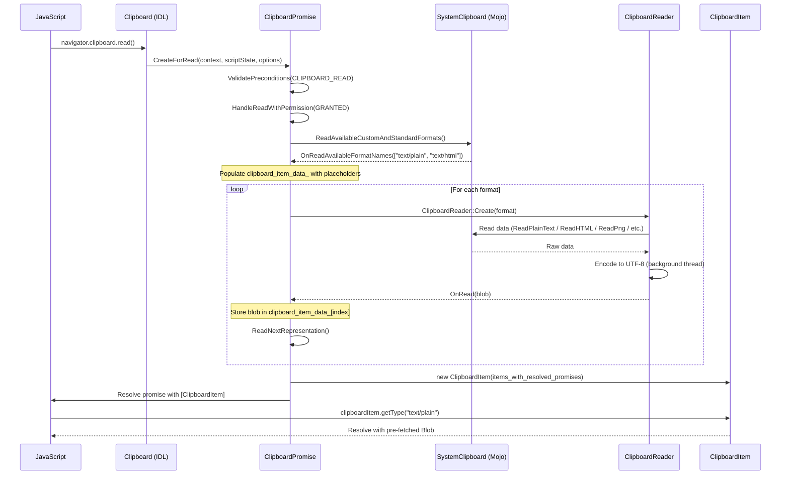
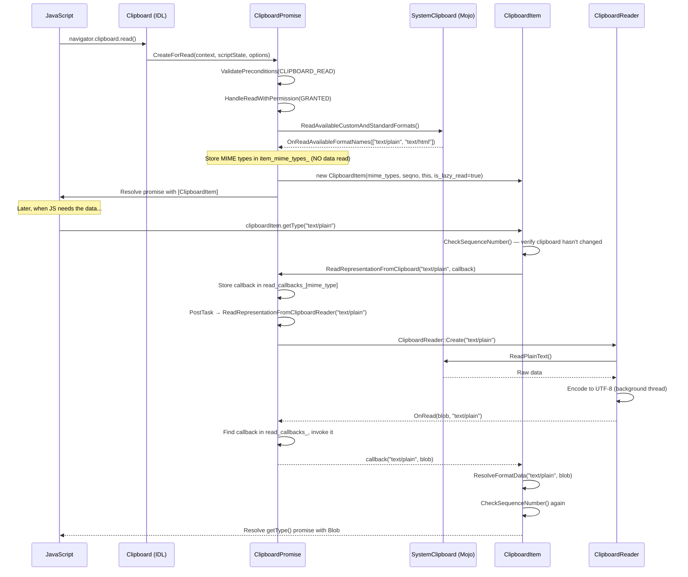
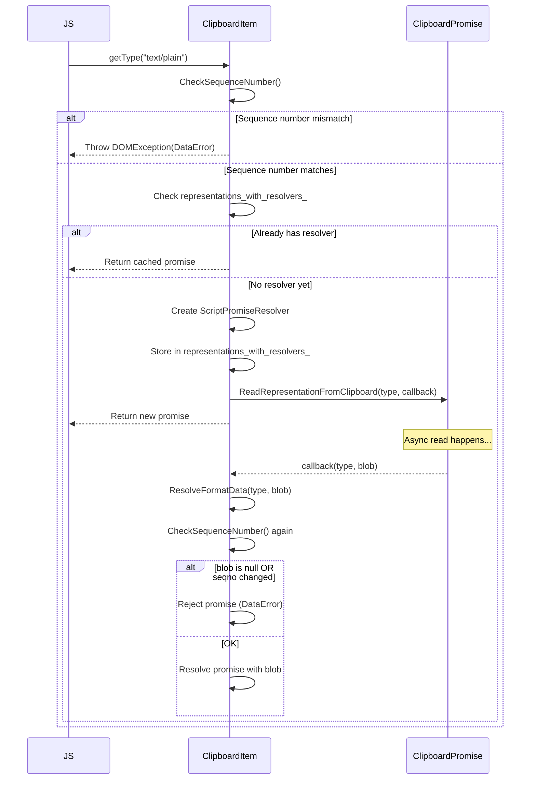
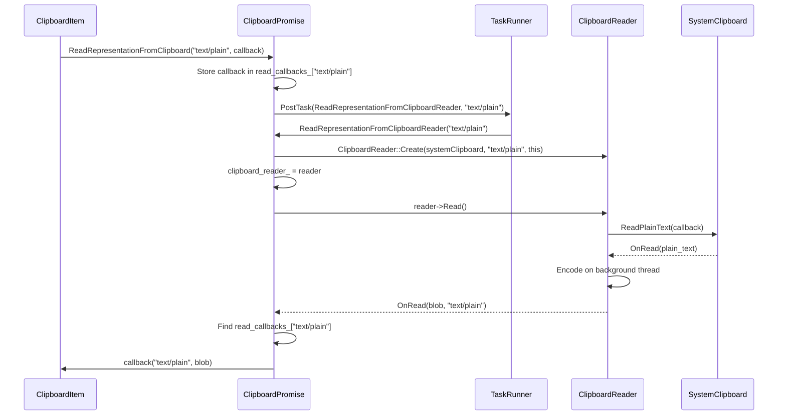
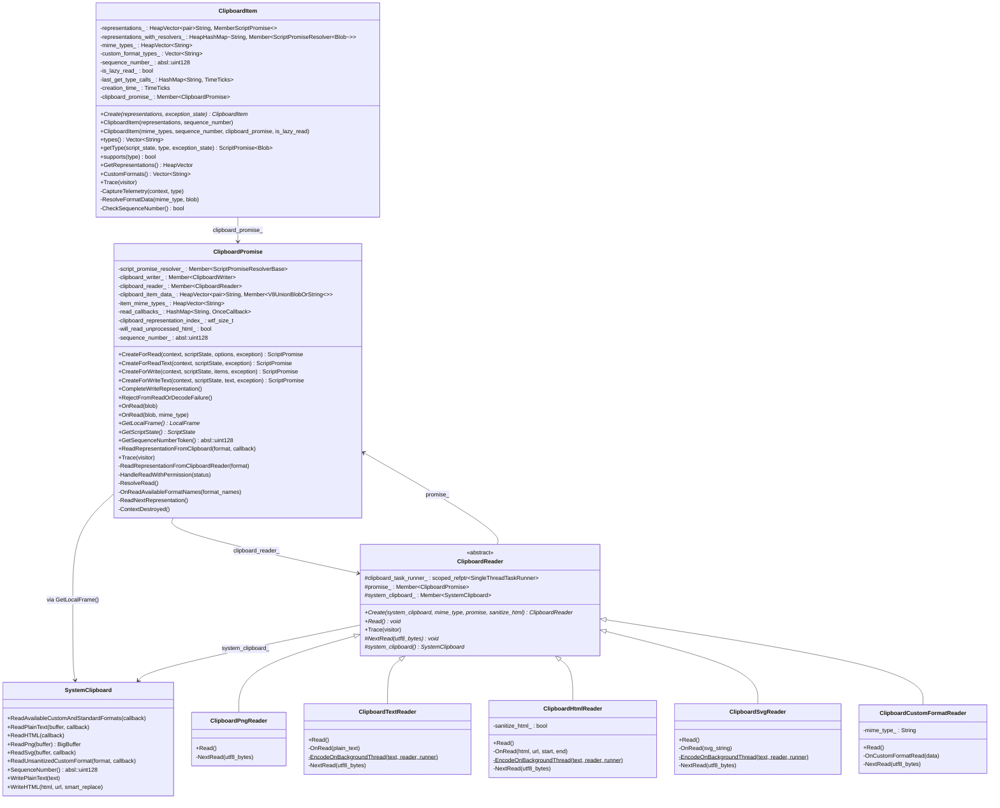
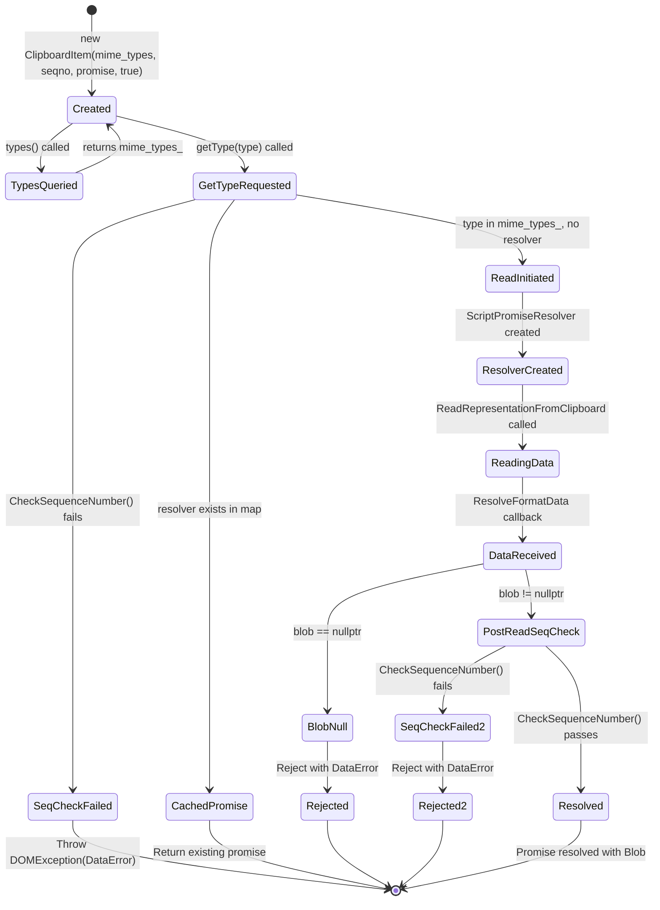

# Low-Level Design (LLD) Review: CL 6978530 — [Clipboard] Implementation of Lazy Read

**CL URL:** https://chromium-review.googlesource.com/c/chromium/src/+/6978530
**Owner:** Shweta Bindal <shwetabindal@microsoft.com>
**Total:** 10 files, +478/-50 lines

---

## Table of Contents

1. [Executive Summary](#1-executive-summary)
2. [Existing Clipboard Read Architecture (HLD)](#2-existing-clipboard-read-architecture-hld)
3. [New Lazy Read Architecture (HLD)](#3-new-lazy-read-architecture-hld)
4. [Object Lifecycle Deep Dive](#4-object-lifecycle-deep-dive)
5. [Data Types Reference](#5-data-types-reference)
6. [File-by-File Analysis](#6-file-by-file-analysis)
7. [Class Diagram](#7-class-diagram)
8. [State Diagrams](#8-state-diagrams)
9. [Use-After-Free (UAF) Analysis](#9-use-after-free-uaf-analysis)
10. [Implementation Concerns](#10-implementation-concerns)
11. [Suggestions for Improvement](#11-suggestions-for-improvement)

---

## 1. Executive Summary

This CL introduces "lazy read" (on-demand read) for the Async Clipboard API. Instead of eagerly reading **all** clipboard data formats when `navigator.clipboard.read()` is called, it now defers the actual data read until `clipboardItem.getType(mimeType)` is invoked. This is gated behind the `ClipboardReadOnDemand` runtime feature flag (status: `"test"`).

**Key behavioral change:**
- **Before:** `clipboard.read()` → reads all formats from OS clipboard → resolves with `ClipboardItem` containing pre-fetched `Blob` data.
- **After (lazy):** `clipboard.read()` → reads only MIME type list → resolves with `ClipboardItem` containing MIME type names. `getType()` → reads specific format from OS clipboard → resolves with `Blob`.

---

## 2. Existing Clipboard Read Architecture (HLD)

### 2.1 Eager Read Sequence Diagram



### 2.2 Existing Object Relationships

In the eager-read path:
1. `ClipboardPromise` owns the read loop and is the orchestrator.
2. `ClipboardReader` subclasses (one per MIME type) are created transiently during `ReadNextRepresentation()`. Each reader is used once and not stored.
3. `ClipboardItem` is created at the end, fully populated with already-resolved promises to Blobs.
4. `ClipboardItem` has **no back-reference** to `ClipboardPromise`.

---

## 3. New Lazy Read Architecture (HLD)

### 3.1 Lazy Read Sequence Diagram



### 3.2 Key Design Differences

| Aspect | Eager Read (Old) | Lazy Read (New) |
|--------|-----------------|-----------------|
| Data fetched at `read()` | All formats' data | Only MIME type list |
| `ClipboardItem` content | Pre-resolved Blob promises | MIME type names only |
| `ClipboardItem` → `ClipboardPromise` ref | None | `Member<ClipboardPromise>` back-reference |
| `getType()` behavior | Returns cached promise | Initiates on-demand IPC read |
| Sequence number check | Not enforced | Checked at `getType()` and `ResolveFormatData()` |
| `ClipboardReader` lifetime | Transient in read loop | Stored in `clipboard_reader_` member |

---

## 4. Object Lifecycle Deep Dive

### 4.1 ClipboardPromise Lifecycle

```
Creation: ClipboardPromise::CreateForRead() → MakeGarbageCollected<ClipboardPromise>()
```

**Eager path:**
- Created → Validates preconditions → Reads all data → Creates ClipboardItem → Resolves promise → **Becomes unreferenced** (eligible for GC)
- After resolution, nothing holds a strong reference to it.

**Lazy path (NEW):**
- Created → Validates preconditions → Reads MIME list → Creates ClipboardItem **with `this` reference** → Resolves promise → **Remains alive** via `ClipboardItem::clipboard_promise_`
- Lives as long as the `ClipboardItem` is alive in JS.
- On each `getType()` call, `ClipboardItem` calls back into `ClipboardPromise::ReadRepresentationFromClipboard()`.
- `ClipboardPromise` creates a `ClipboardReader`, stores it in `clipboard_reader_`, and reads data.

**GC Roots (lazy path):**
```
JS Heap → ClipboardItem → clipboard_promise_ (Member<ClipboardPromise>)
                         → representations_with_resolvers_ (HeapHashMap)
ClipboardPromise → clipboard_reader_ (Member<ClipboardReader>)
                 → script_promise_resolver_ (Member<ScriptPromiseResolverBase>)
                 → read_callbacks_ (HashMap — non-traced, raw callbacks)
```

**Destruction:**
- `ClipboardPromise` is GC'd when `ClipboardItem` is GC'd (no more JS references).
- `ContextDestroyed()` clears `clipboard_writer_` and `clipboard_reader_` and rejects the resolver.

### 4.2 ClipboardItem Lifecycle

**Eager path:**
- Created with pre-resolved `representations_` (Blob promises).
- Returned to JS. Lives as long as JS holds a reference.
- `getType()` simply unwraps existing promises.

**Lazy path (NEW):**
- Created with `mime_types_`, `sequence_number_`, `clipboard_promise_` back-ref, `is_lazy_read_=true`.
- `representations_` is **empty**. `representations_with_resolvers_` is populated lazily.
- On `getType()`:
  1. Checks `is_lazy_read_` flag.
  2. Checks if resolver already exists in `representations_with_resolvers_` (returns cached promise).
  3. If not, creates `ScriptPromiseResolver`, stores it, calls `clipboard_promise_->ReadRepresentationFromClipboard()`.
  4. Callback `ResolveFormatData()` resolves or rejects the promise.

**Key fields (lazy path):**
| Field | Type | Purpose |
|-------|------|---------|
| `mime_types_` | `HeapVector<String>` | List of available MIME types from clipboard |
| `is_lazy_read_` | `bool` | Flag distinguishing lazy vs eager ClipboardItem |
| `clipboard_promise_` | `Member<ClipboardPromise>` | Back-reference for on-demand reads |
| `representations_with_resolvers_` | `HeapHashMap<String, Member<ScriptPromiseResolver<Blob>>>` | Lazy per-type promise resolvers |
| `sequence_number_` | `absl::uint128` | Clipboard sequence at creation time |

### 4.3 ClipboardReader Lifecycle

**Eager path:**
- Created per format in `ReadNextRepresentation()`.
- **Not stored** — created, used, and immediately eligible for GC after `OnRead()` callback.
- Wait: actually in the new code, the reader IS now stored: `clipboard_reader_ = clipboard_reader;` was added at line 507. This was a bugfix to keep the reader alive during async operations.

**Lazy path (NEW):**
- Created per `getType()` call in `ReadRepresentationFromClipboardReader()`.
- Stored in `clipboard_reader_` member of `ClipboardPromise`.
- **Overwritten** on each new `getType()` call — only the latest reader is held.
- After `Read()` completes and callback fires, reader remains referenced until next `getType()`.

**Subclasses (all internal to `clipboard_reader.cc`):**
| Subclass | Format | Read Method | Encoding |
|----------|--------|-------------|----------|
| `ClipboardPngReader` | `image/png` | `ReadPng()` — synchronous | None (already PNG) |
| `ClipboardTextReader` | `text/plain` | `ReadPlainText()` — async | UTF-8 on background thread |
| `ClipboardHtmlReader` | `text/html` | `ReadHTML()` — async | Sanitize on main, UTF-8 on background |
| `ClipboardSvgReader` | `image/svg+xml` | `ReadSvg()` — async | Sanitize on main, UTF-8 on background |
| `ClipboardCustomFormatReader` | `web *` | `ReadUnsanitizedCustomFormat()` — async | None |

---

## 5. Data Types Reference

### 5.1 Core Data Types

| Type | Definition | Usage |
|------|-----------|-------|
| `absl::uint128` | 128-bit unsigned integer (`third_party/abseil-cpp/absl/numeric/int128.h`) | Clipboard sequence number. Monotonically increasing counter from the OS clipboard host. Used to detect clipboard changes between `read()` and `getType()`. |
| `ClipboardSequenceNumberToken` | Wrapper around `base::UnguessableToken` | Internal Mojo type for sequence numbers. Converted to `absl::uint128` by `SystemClipboard::SequenceNumber()`. |
| `Member<T>` | `blink::Member<T>` (Oilpan traced pointer) | GC-safe pointer to a heap-allocated object. Used for all GarbageCollected objects in Blink. |
| `HeapVector<T>` | `blink::HeapVector<T>` | GC-traced dynamic array. Used for `mime_types_` and `representations_`. |
| `HeapHashMap<K, V>` | `blink::HeapHashMap<K, V>` | GC-traced hash map. Used for `representations_with_resolvers_`. |
| `HashMap<K, V>` | `WTF::HashMap<K, V>` | Non-traced hash map. Used for `read_callbacks_` (stores `base::OnceCallback`). |
| `MemberScriptPromise<T>` | Traced JS promise wrapper | Wrapper for V8 promises stored on GC'd objects. |
| `ScriptPromiseResolver<T>` | GC'd promise resolver | Creates and resolves/rejects a JS promise. Used to create deferred promises for lazy getType(). |
| `base::OnceCallback<void(const String&, Blob*)>` | One-shot callback | Passed from `ClipboardItem` to `ClipboardPromise` for on-demand data delivery. |
| `WrapPersistent(this)` | Creates persistent handle | Prevents GC of the wrapped object until the handle is destroyed. Used in async callbacks. |
| `Blob` | `blink::Blob` (GC'd) | Binary large object representing clipboard data. Created from raw bytes + MIME type. |
| `base::TimeTicks` | Monotonic timestamp | Used in `creation_time_` for telemetry (measuring delay between `read()` and `getType()`). |

### 5.2 New Data Members Added

#### ClipboardItem (new members)
| Member | Type | Traced? | Purpose |
|--------|------|---------|---------|
| `mime_types_` | `HeapVector<String>` | ✅ Yes | Available MIME types from clipboard (lazy mode) |
| `is_lazy_read_` | `bool` | N/A (scalar) | Distinguishes lazy vs eager ClipboardItem |
| `clipboard_promise_` | `Member<ClipboardPromise>` | ✅ Yes | Back-reference for on-demand reads |
| `representations_with_resolvers_` | `HeapHashMap<String, Member<ScriptPromiseResolver<Blob>>>` | ✅ Yes | Deferred per-type promises |

#### ClipboardPromise (new members)
| Member | Type | Traced? | Purpose |
|--------|------|---------|---------|
| `clipboard_reader_` | `Member<ClipboardReader>` | ✅ Yes | Keeps current reader alive during async read |
| `item_mime_types_` | `HeapVector<String>` | ✅ Yes | MIME types discovered from clipboard (lazy mode) |
| `read_callbacks_` | `HashMap<String, base::OnceCallback<...>>` | ❌ No | Per-MIME-type callbacks for data delivery |

### 5.3 New Runtime Feature Flag
| Feature | Status | JSON5 Location |
|---------|--------|----------------|
| `ClipboardReadOnDemand` | `"test"` (enabled in tests only) | `runtime_enabled_features.json5` |

---

## 6. File-by-File Analysis

### 6.1 `clipboard_item.h`

**Purpose of changes:** Add lazy-read constructor, on-demand data resolution, and sequence number validation to `ClipboardItem`.

**Key modifications:**
- Added new constructor for lazy-read `ClipboardItem` accepting MIME type list instead of pre-resolved data.
- Added `representations_with_resolvers_` map for deferred promise management.
- Added `clipboard_promise_` back-reference.
- Added `ResolveFormatData()` and `CheckSequenceNumber()` private methods.
- Added `mime_types_` and `is_lazy_read_` fields.

**New/Modified Functions:**
| Function | Purpose | Parameters | Returns |
|----------|---------|------------|---------|
| `ClipboardItem(mime_types, seqno, promise, is_lazy)` | Construct lazy-read item | MIME type list, sequence number, promise ref, flag | N/A |
| `ResolveFormatData(mime_type, blob)` | Resolve/reject deferred getType promise | MIME type string, Blob (nullable) | void |
| `CheckSequenceNumber()` | Verify clipboard hasn't changed | None | bool |

**API Changes:**
- New public constructor is `explicit` but takes default arguments (`sequence_number=0`, `clipboard_promise=nullptr`, `is_lazy_read=false`).
- `getType()` behavior changes: in lazy mode, it creates a resolver and triggers async read instead of unwrapping a pre-resolved promise.

---

### 6.2 `clipboard_item.cc`

**Purpose of changes:** Implement lazy-read constructor, on-demand getType() flow, and sequence number validation.

**Key modifications:**
- New constructor that only stores MIME types (no data).
- `types()` now branches: lazy mode returns from `mime_types_`, eager mode from `representations_`.
- `getType()` now has three code paths: (1) eager path, (2) cached lazy promise, (3) new lazy read.
- `ResolveFormatData()` resolves or rejects the deferred promise after data read completes.
- `CheckSequenceNumber()` calls `clipboard_promise_->GetSequenceNumberToken()`.

**Data Flow (getType in lazy mode):**



**Edge Cases / Concerns:**
- Double `getType()` for same type: returns cached promise from `representations_with_resolvers_`. ✅ Correct.
- `getType()` after clipboard change: First `CheckSequenceNumber()` catches it synchronously. ✅ Correct.
- Clipboard changes during async read: `ResolveFormatData()` checks sequence number again. ✅ Correct.
- `getType()` for unsupported type: Falls through to `NotFoundError` exception. ✅ Correct.

---

### 6.3 `clipboard_promise.h`

**Purpose of changes:** Add lazy-read support infrastructure to `ClipboardPromise`.

**Key modifications:**
- Added `OnRead(Blob*, const String& mime_type)` overload for per-format callback dispatch.
- Added `GetSequenceNumberToken()` public method.
- Added `ReadRepresentationFromClipboard()` public method (entry point for `ClipboardItem`).
- Added `ReadRepresentationFromClipboardReader()` private method.
- Added `clipboard_reader_` member (keeps reader alive).
- Added `item_mime_types_` for lazy format list.
- Added `read_callbacks_` map for per-MIME callback dispatch.
- Forward declared `Blob` and `ClipboardItem`.

**New/Modified Functions:**
| Function | Purpose | Parameters | Returns |
|----------|---------|------------|---------|
| `OnRead(blob, mime_type)` | Dispatch blob to per-format callback | Blob*, MIME type | void |
| `GetSequenceNumberToken()` | Get current clipboard sequence number | None | absl::uint128 |
| `ReadRepresentationFromClipboard(format, callback)` | Public entry for on-demand read | format string, OnceCallback | void |
| `ReadRepresentationFromClipboardReader(format)` | Internal: create reader and read | format string | void |

---

### 6.4 `clipboard_promise.cc`

**Purpose of changes:** Implement lazy-read flow: deferred data reading, callback dispatch, and sequence number querying.

**Key modifications:**
1. `ReadRepresentationFromClipboard()` — stores callback, posts task to read.
2. `ReadRepresentationFromClipboardReader()` — creates `ClipboardReader`, calls `Read()`.
3. `OnRead(blob, mime_type)` — dispatches blob to stored callback.
4. `ResolveRead()` — branches: lazy mode creates lightweight `ClipboardItem` with MIME list; eager mode creates data-populated `ClipboardItem`.
5. `OnReadAvailableFormatNames()` — branches: lazy mode stores MIME types and resolves immediately; eager mode populates placeholders and starts read loop.
6. `GetSequenceNumberToken()` — fetches current sequence number from `SystemClipboard`.
7. `ContextDestroyed()` — now also clears `clipboard_reader_`.
8. `Trace()` — now traces `clipboard_reader_` and `item_mime_types_`.

**Data Flow (ReadRepresentationFromClipboard):**



---

### 6.5 `clipboard_reader.cc`

**Purpose of changes:** Add branching in all reader `NextRead()` / completion methods to call the appropriate `OnRead` overload based on feature flag.

**Key modifications:**
- All 5 reader subclasses (`ClipboardPngReader`, `ClipboardTextReader`, `ClipboardHtmlReader`, `ClipboardSvgReader`, `ClipboardCustomFormatReader`) now check `RuntimeEnabledFeatures::ClipboardReadOnDemandEnabled()` and call either `promise_->OnRead(blob, mime_type)` (lazy) or `promise_->OnRead(blob)` (eager).

**Pattern (repeated 5 times):**
```cpp
if (RuntimeEnabledFeatures::ClipboardReadOnDemandEnabled()) {
  promise_->OnRead(blob, <mime_type_constant>);
} else {
  promise_->OnRead(blob);
}
```

---

### 6.6 `mock_clipboard_host.h` / `mock_clipboard_host.cc`

**Purpose of changes:** Add method call tracking to verify lazy-read behavior in tests.

**Key modifications:**
- Added `read_text_called_`, `read_html_called_`, `read_available_formats_called_` bool members.
- Added public accessors: `WasReadTextCalled()`, `WasReadHtmlCalled()`, `WasReadAvailableFormatsCalled()`.
- Set flags in `ReadText()`, `ReadHtml()`, `ReadAvailableCustomAndStandardFormats()`.
- Reset flags in `Reset()`.

---

### 6.7 `clipboard_unittest.cc`

**Purpose of changes:** Add unit tests for lazy-read behavior and refactor test setup.

**Key modifications:**
- Added `ClipboardItemGetType` ThenCallable helper for chaining `getType()` after `read()`.
- Refactored `ClipboardTest` to use `SetUp()` override with custom `MockClipboardHostProvider` for access to `mock_clipboard_host()`.
- Changed `WritePlainTextToClipboard`/`WriteHtmlToClipboard` to use `GetFrame()` instead of `scope.GetFrame()`.
- Added test `ReadOnlyMimeTypesInClipboardRead`: verifies that `read()` only calls `ReadAvailableCustomAndStandardFormats()`, NOT `ReadText()` or `ReadHtml()`.
- Added test `ClipboardItemGetTypeTest`: verifies that `getType("text/plain")` triggers actual `ReadText()` call.

---

### 6.8 `runtime_enabled_features.json5`

**Purpose of changes:** Register new feature flag.

**Key modifications:**
- Added `ClipboardReadOnDemand` with status `"test"` (enabled only in test builds).

---

### 6.9 `async-clipboard-lazy-read.html`

**Purpose of changes:** Web platform test for clipboard change detection.

**Key modifications:**
- Tests that `getType()` throws `DataError` when clipboard content changes between `read()` and `getType()`.
- Flow: write initial → read() → write changed → getType() → expect DataError.

---

## 7. Class Diagram



---

## 8. State Diagrams

### 8.1 ClipboardItem State (Lazy Read Mode)



### 8.2 ClipboardPromise State (Lazy Read Mode)

```mermaid
stateDiagram-v2
    [*] --> Created : CreateForRead()
    Created --> Validating : ValidatePreconditions(CLIPBOARD_READ)
    Validating --> PermissionDenied : status != GRANTED
    PermissionDenied --> [*] : Reject promise

    Validating --> ReadingFormats : HandleReadWithPermission(GRANTED)
    ReadingFormats --> FormatsReceived : ReadAvailableCustomAndStandardFormats callback
    FormatsReceived --> Resolved : ResolveRead() — ClipboardItem with mime_types

    Resolved --> OnDemandRead : ReadRepresentationFromClipboard(format)
    OnDemandRead --> CallbackStored : Store callback in read_callbacks_
    CallbackStored --> ReaderCreated : PostTask → ReadRepresentationFromClipboardReader
    ReaderCreated --> Reading : ClipboardReader::Read()
    Reading --> DataReady : OnRead(blob, mime_type)
    DataReady --> CallbackDispatched : Invoke and erase callback
    CallbackDispatched --> Resolved : Ready for next getType()

    Resolved --> Destroyed : ContextDestroyed or GC
    Destroyed --> [*]
```

---

## 9. Use-After-Free (UAF) Analysis

### 9.1 ClipboardPromise UAF Risks

**Risk: ClipboardPromise accessed after context destruction**
- `ContextDestroyed()` rejects the resolver and clears `clipboard_writer_` and `clipboard_reader_`. ✅ Good.
- However, `read_callbacks_` (HashMap of `base::OnceCallback`) is **not cleared** in `ContextDestroyed()`. If a callback fires after context destruction, it would call `ResolveFormatData()` on `ClipboardItem`, which tries to access resolvers.
- **Mitigation:** `ReadRepresentationFromClipboardReader()` checks `GetExecutionContext()` at entry. But the `PostTask` from `ReadRepresentationFromClipboard` uses `WrapPersistent(this)`, which keeps `ClipboardPromise` alive. If the context is destroyed between `PostTask` and execution, the check at line 347 (`if (!GetExecutionContext()) return;`) handles it — but the callback in `read_callbacks_` is never invoked, leaving the JS promise permanently pending.
- **Severity: LOW** — pending promises after context destruction is acceptable behavior.

**Risk: ClipboardReader accessed after ClipboardPromise is destroyed**
- `ClipboardReader` holds `Member<ClipboardPromise> promise_`. This is a strong GC reference.
- In the lazy path, `ClipboardPromise` also holds `Member<ClipboardReader> clipboard_reader_`. This creates a **bidirectional reference cycle** between `ClipboardPromise` and `ClipboardReader`.
- **However**, both are `GarbageCollected` and traced properly. Oilpan handles cycles. ✅ Safe.

**⚠️ Risk: `read_callbacks_` holds raw `base::OnceCallback` that captures `WrapPersistent(ClipboardItem)`**
- In `ClipboardItem::getType()` line 198-200:
  ```cpp
  clipboard_promise_->ReadRepresentationFromClipboard(
      type,
      BindOnce(&ClipboardItem::ResolveFormatData, WrapPersistent(this)));
  ```
- `WrapPersistent(this)` creates a persistent handle to `ClipboardItem`, preventing GC.
- The callback is stored in `read_callbacks_` (a `HashMap`, **not** a `HeapHashMap`).
- `read_callbacks_` is **not traced** by Oilpan.
- The `Persistent<ClipboardItem>` inside the callback acts as a GC root — **this is correct** and prevents premature GC.
- After callback execution, the `Persistent` is destroyed (moved from). ✅ Safe.
- **But**: if the callback is never executed (e.g., context destroyed), the `Persistent` handle leaks until `ClipboardPromise` itself is destroyed. Since `ClipboardItem` → `ClipboardPromise` and `ClipboardPromise` has `read_callbacks_` with `Persistent<ClipboardItem>`, there's a reference cycle: `ClipboardItem` → `ClipboardPromise` (via `clipboard_promise_` Member) and `ClipboardPromise` → `ClipboardItem` (via `Persistent` in `read_callbacks_`).
- **Severity: MEDIUM** — The `Persistent` handle in `read_callbacks_` prevents GC of `ClipboardItem` even if JS releases it. This could be a memory leak if `getType()` is called but the callback never fires. `ContextDestroyed()` should clear `read_callbacks_` to break this cycle.

### 9.2 ClipboardItem UAF Risks

**Risk: Accessing `clipboard_promise_` after it's been GC'd**
- `clipboard_promise_` is a `Member<ClipboardPromise>`, which is a traced GC pointer. As long as `ClipboardItem` is alive and traced, `ClipboardPromise` won't be GC'd. ✅ Safe.

**Risk: Accessing `representations_with_resolvers_` entries after resolver is settled**
- `ResolveFormatData()` resolves/rejects the resolver. The resolver remains in the map.
- Calling `getType()` again for the same type returns the already-settled promise. This is the correct behavior per spec. ✅ Safe.

### 9.3 ClipboardReader UAF Risks

**⚠️ Risk: `clipboard_reader_` overwrite during concurrent getType() calls**
- If `getType("text/plain")` and `getType("text/html")` are called in quick succession:
  1. First call creates `ClipboardTextReader`, stores in `clipboard_reader_`.
  2. Second call creates `ClipboardHtmlReader`, **overwrites** `clipboard_reader_`.
  3. The old `ClipboardTextReader` may still have async work in-flight (background thread encoding).
  4. The old reader holds `promise_` (Member to ClipboardPromise), so it's kept alive by that reference.
  5. When the old reader completes, it calls `promise_->OnRead(blob, mime_type)`, which dispatches to the correct callback via `read_callbacks_`.
- **The `ClipboardTextReader` survives because** the background thread holds a `CrossThreadHandle<ClipboardTextReader>` which prevents GC.
- **Severity: LOW** — The design appears safe because each reader uses its own callback path via MIME-typed `read_callbacks_`. However, the overwrite of `clipboard_reader_` means the old reader is only kept alive by the `CrossThreadHandle` / `WrapPersistent` inside the async chain. This is fragile but correct.

---

## 10. Implementation Concerns

### 10.1 Memory Management Issues

1. **`read_callbacks_` not cleared on context destruction** — `ContextDestroyed()` does not clear `read_callbacks_`. Each callback contains a `Persistent<ClipboardItem>` which acts as a GC root. If context is destroyed while callbacks are pending, the `Persistent` handles prevent GC of both `ClipboardItem` and `ClipboardPromise` until `ClipboardPromise` itself is destroyed. Recommendation: add `read_callbacks_.clear()` to `ContextDestroyed()`.

2. **`clipboard_reader_` overwrite** — Concurrent `getType()` calls overwrite `clipboard_reader_`. While the previous reader survives via async handles, explicitly storing only the "latest" reader is misleading. Consider using a per-MIME reader map or making `clipboard_reader_` unnecessary by letting readers be self-sustaining.

3. **`Persistent` in `base::OnceCallback` stored in non-traced `HashMap`** — The `WrapPersistent(this)` in the callback bound from `ClipboardItem::getType()` creates a persistent GC root stored outside Oilpan's trace graph. This is intentional but creates an implicit reference that can mask leaks.

### 10.2 Thread Safety Concerns

1. All new code paths are protected by `DCHECK_CALLED_ON_VALID_SEQUENCE(sequence_checker_)`. ✅ Good.
2. `PostTask` for `ReadRepresentationFromClipboardReader` ensures the reader creation and system clipboard access happen on the clipboard task runner. ✅ Correct.
3. Background thread encoding in `ClipboardTextReader`, `ClipboardHtmlReader`, `ClipboardSvgReader` uses `CrossThreadHandle` and `PostCrossThreadTask` correctly. ✅ Safe.

### 10.3 Performance Implications

1. **Positive:** Lazy read avoids reading all clipboard data upfront. If JS only needs one format, this saves IPC round-trips for unused formats.
2. **Negative:** Each `getType()` call now requires a full IPC round-trip. If JS calls `getType()` for all formats, total work is equivalent to or slightly more than eager read (due to per-format overhead).
3. **Sequence number check** adds a synchronous IPC call (`SystemClipboard::SequenceNumber()`) on each `getType()`. This could be a performance concern if sequence number retrieval involves IPC.

### 10.4 Maintainability Concerns

1. **Pervasive feature flag branching** — The code has many `if (RuntimeEnabledFeatures::ClipboardReadOnDemandEnabled())` checks scattered across 3 files (`clipboard_item.cc`, `clipboard_promise.cc`, `clipboard_reader.cc`). This makes the code harder to read and maintain. Consider:
   - Separating lazy and eager paths more cleanly (e.g., subclassing or strategy pattern).
   - Once the feature ships and the flag is removed, a large cleanup will be needed.

2. **Repeated branching pattern in ClipboardReader** — The same `if/else` pattern for `OnRead(blob, mime_type)` vs `OnRead(blob)` is repeated 5 times across all reader subclasses. This could be centralized.

3. **`ClipboardItem` has dual identity** — It can be either eager (data-populated) or lazy (MIME-only). The `is_lazy_read_` flag controls behavior. Both `representations_` and `mime_types_` exist but only one is used at a time. Consider separate classes or a cleaner abstraction.

4. **Callback from `ClipboardItem` to `ClipboardPromise`** — The `BindOnce(&ClipboardItem::ResolveFormatData, WrapPersistent(this))` captures `this` (ClipboardItem) via Persistent and passes it through `ClipboardPromise`'s callback machinery. This is an unusual ownership pattern where the "child" (`ClipboardItem`) calls back into its "parent" (`ClipboardPromise`) which then calls back into the child. A simpler design might have `ClipboardPromise` directly resolve the `ScriptPromiseResolver`.

### 10.5 Error Handling

1. **Sequence number mismatch** → `DOMException(DataError, "Clipboard data has changed")` — both at `getType()` entry and in `ResolveFormatData()`. ✅ Double-check is defensive.
2. **Null blob** → `DOMException(DataError, "Clipboard data has changed")` — The error message is misleading. A null blob could mean the format was empty, not that data changed. Consider a more accurate error message.
3. **Missing callback in `OnRead(blob, mime_type)`** — If `read_callbacks_` doesn't contain the MIME type, the blob is silently dropped. This could happen if `read_callbacks_` was cleared. Consider logging a warning.
4. **`ReadRepresentationFromClipboardReader` doesn't check `GetLocalFrame()`** — It checks `GetExecutionContext()` but then calls `GetLocalFrame()->GetSystemClipboard()` which could crash if `GetLocalFrame()` returns null while `GetExecutionContext()` doesn't.

---

## 11. Suggestions for Improvement

### 11.1 Critical

1. **Clear `read_callbacks_` in `ContextDestroyed()`** — Add `read_callbacks_.clear();` to prevent persistent handle leaks:
   ```cpp
   void ClipboardPromise::ContextDestroyed() {
     script_promise_resolver_->Reject(...);
     clipboard_writer_.Clear();
     clipboard_reader_.Clear();
     read_callbacks_.clear();  // ADD THIS
   }
   ```

2. **Null-check `GetLocalFrame()` in `ReadRepresentationFromClipboardReader()`** — The method checks `GetExecutionContext()` but not `GetLocalFrame()`:
   ```cpp
   void ClipboardPromise::ReadRepresentationFromClipboardReader(const String& format) {
     if (!GetExecutionContext()) return;
     LocalFrame* frame = GetLocalFrame();
     if (!frame) return;  // ADD THIS
     ClipboardReader* clipboard_reader = ClipboardReader::Create(
         frame->GetSystemClipboard(), format, this, ...);
   ```

3. **More accurate error message for null blob** — In `ResolveFormatData()`, when `blob == nullptr`, consider "Failed to read clipboard data" instead of "Clipboard data has changed".

### 11.2 Design

4. **Centralize the `OnRead` branching in `ClipboardReader`** — Instead of duplicating the feature-flag check in 5 subclasses, add a protected helper in the base class:
   ```cpp
   void ClipboardReader::NotifyPromise(Blob* blob, const String& mime_type) {
     if (RuntimeEnabledFeatures::ClipboardReadOnDemandEnabled()) {
       promise_->OnRead(blob, mime_type);
     } else {
       promise_->OnRead(blob);
     }
   }
   ```

5. **Consider per-MIME reader storage** — Instead of a single `clipboard_reader_` that gets overwritten, store readers in a map if concurrent `getType()` is expected. Or, since readers are kept alive by their own async mechanisms, simply don't store them in `ClipboardPromise` at all for the lazy path.

6. **Add test for concurrent `getType()` calls** — The current tests call `getType()` for a single format. Add a test that calls `getType("text/plain")` and `getType("text/html")` concurrently to verify correct callback dispatch.

7. **Add test for `getType()` after resolved** — Verify that calling `getType("text/plain")` twice returns the same resolved promise with the same data.

### 11.3 Code Style

8. **Remove trailing blank line** in `types()` method (line 131 of `clipboard_item.cc`).

9. **Missing blank line** between `CheckSequenceNumber()` and `supports()` (line 218-219 of `clipboard_item.cc`):
   ```cpp
   }
   // static     ← missing blank line before this
   bool ClipboardItem::supports(const String& type) {
   ```

10. **`ClipboardItemGetType` test helper** — The `React()` method creates a promise but doesn't wait for it. The test relies on `ScriptPromiseTester` on the chained promise (which resolves to "SUCCESS" string), not on the actual blob. Consider verifying the blob content too.

### 11.4 Test Coverage Gaps

11. **No test for clipboard change detection during async read** — The sequence number check in `ResolveFormatData()` (after the read completes) is not tested. Only the pre-read check in `getType()` is tested via the web test.

12. **No test for `getType()` with unsupported format** — Should throw `NotFoundError`.

13. **No test for context destruction during pending lazy read** — Verify that promises are rejected and no crashes occur.

14. **Web test `async-clipboard-lazy-read.html`** — Missing explanation comment on line 31 as noted by reviewer (Prashant). The test should explain why DataError is expected and state the expected behavior.
