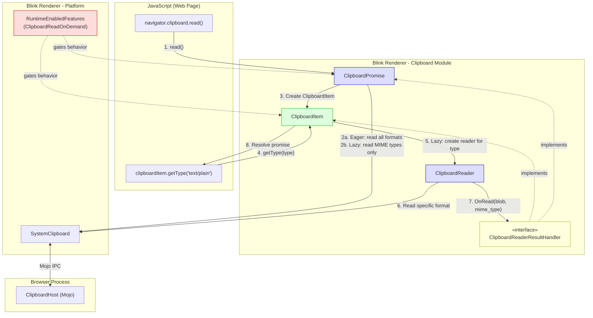
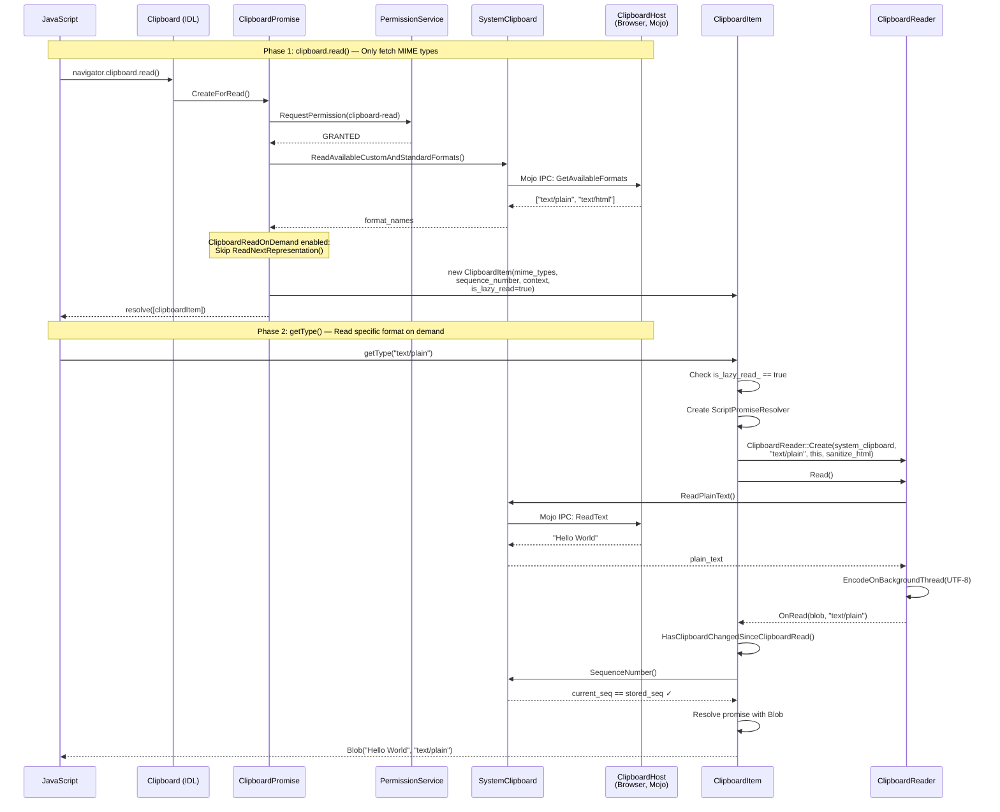
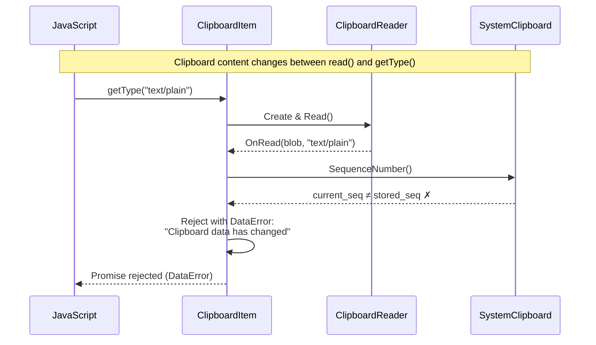

# High-Level Design: [Clipboard] Implement on-demand reading in getType()

**CL:** [6978530](https://chromium-review.googlesource.com/c/chromium/src/+/6978530)
**Author:** Shweta Bindal (shwetabindal@microsoft.com)
**Bug:** [435051711](https://crbug.com/435051711)
**Status:** NEW (in review)

---

## 1. Executive Summary

This CL implements **lazy (on-demand) clipboard data reading** in the Async Clipboard API's `ClipboardItem.getType()` method. Previously, `clipboard.read()` eagerly fetched all clipboard data for every available MIME type upfront — even types the web application never consumed. This CL defers actual data reading to the point when `getType()` is called, so only the requested format's data is read from the system clipboard. This improves performance for pages that only need a subset of clipboard formats (e.g., reading only `text/plain` when `text/html` and `image/png` are also available). The feature is gated behind a new runtime-enabled feature flag `ClipboardReadOnDemand` (currently `status: "test"`), ensuring backward compatibility. Additionally, the CL introduces clipboard change detection: if the clipboard content changes between `read()` and `getType()`, the promise is rejected with a `DataError`, preventing stale or inconsistent data from being consumed.

---

## 2. Architecture Overview

### Affected Components/Modules

| Component | Path | Role |
|-----------|------|------|
| **ClipboardItem** | `third_party/blink/renderer/modules/clipboard/clipboard_item.{h,cc}` | Core data holder for clipboard read/write; now supports lazy-read mode |
| **ClipboardPromise** | `third_party/blink/renderer/modules/clipboard/clipboard_promise.{h,cc}` | Orchestrates async clipboard operations and permission checks |
| **ClipboardReader** | `third_party/blink/renderer/modules/clipboard/clipboard_reader.{h,cc}` | Reads individual formats from SystemClipboard; refactored to use abstract handler |
| **ClipboardReaderResultHandler** | `third_party/blink/renderer/modules/clipboard/clipboard_reader.h` | **New** abstract interface for receiving read results |
| **RuntimeEnabledFeatures** | `third_party/blink/renderer/platform/runtime_enabled_features.json5` | Hosts the `ClipboardReadOnDemand` feature flag |
| **MockClipboardHost** | `third_party/blink/renderer/core/testing/mock_clipboard_host.{h,cc}` | Test mock; added call tracking for verifying lazy behavior |

### How This Fits Into Existing Architecture

The Async Clipboard API in Blink follows this layered architecture:

1. **JavaScript API** (`Clipboard` IDL) → calls `ClipboardPromise` factories
2. **ClipboardPromise** → handles permissions, coordinates read/write flows
3. **ClipboardReader** → reads individual MIME types from `SystemClipboard`
4. **SystemClipboard** → Mojo IPC to browser-process `ClipboardHost`
5. **ClipboardItem** → holds data returned to JavaScript

This CL inserts a **lazy indirection layer** at step 4: instead of `ClipboardPromise` reading all formats and packaging them into `ClipboardItem` with resolved data, it now creates a `ClipboardItem` with only MIME type metadata. When JavaScript calls `getType()`, the `ClipboardItem` itself creates a `ClipboardReader` to fetch the specific format on demand.

### Component Diagram



---

## 3. Design Goals & Non-Goals

### Goals

1. **Performance improvement**: Avoid reading unused clipboard formats. If a page only calls `getType('text/plain')`, don't also read `image/png` and `text/html` from the system clipboard.
2. **Data consistency**: Detect clipboard mutations between `read()` and `getType()` via sequence number comparison, rejecting with `DataError` when content has changed.
3. **Backward compatibility**: The new behavior is gated behind `ClipboardReadOnDemand` (currently `status: "test"`). When disabled, the existing eager-read behavior is preserved exactly.
4. **Architectural decoupling**: Introduce `ClipboardReaderResultHandler` interface so `ClipboardReader` is no longer tightly coupled to `ClipboardPromise`, allowing `ClipboardItem` to also use readers directly.
5. **Lifecycle safety**: `ClipboardItem` now observes `ExecutionContext` lifecycle to properly reject pending promises when the document is detached.

### Non-Goals

- **Write-path changes**: This CL does not change `clipboard.write()` behavior.
- **Cross-origin clipboard access**: No changes to permission model or cross-origin policies.
- **New MIME type support**: No new clipboard formats are added.
- **Spec standardization**: While this is motivated by performance, the CL doesn't change the W3C-facing API surface. The `getType()` method already returns a promise; this changes internal implementation only.
- **Shipping to stable**: The feature flag is `status: "test"`, indicating this is not yet intended for production.

---

## 4. System Interactions

### Main Flow: Lazy Read Path



### Clipboard Change Detection Flow



### IPC / Mojo Interactions

The CL does **not** introduce new Mojo interfaces. All system clipboard reads go through the existing `mojom::blink::ClipboardHost` interface. The key difference is **when** specific read methods are called:

| Method | Before (Eager) | After (Lazy) |
|--------|----------------|--------------|
| `ReadAvailableCustomAndStandardFormats` | Called during `read()` | Called during `read()` (unchanged) |
| `ReadPlainText` | Called during `read()` | Called during `getType("text/plain")` |
| `ReadHTML` | Called during `read()` | Called during `getType("text/html")` |
| `ReadPng` | Called during `read()` | Called during `getType("image/png")` |
| `ReadSvg` | Called during `read()` | Called during `getType("image/svg+xml")` |
| `ReadUnsanitizedCustomFormat` | Called during `read()` | Called during `getType("web ...")` |
| `GetSequenceNumber` | Not used for validation | Called during `getType()` to detect changes |

---

## 5. API & Interface Changes

### New Interfaces

#### `ClipboardReaderResultHandler` (abstract interface)

**File:** `/workspace/cr1/src/third_party/blink/renderer/modules/clipboard/clipboard_reader.h#L19`

```cpp
class ClipboardReaderResultHandler : public GarbageCollectedMixin {
 public:
  virtual void OnRead(Blob* blob, const String& mime_type) = 0;
  virtual ExecutionContext* GetExecutionContext() const = 0;
  virtual LocalFrame* GetLocalFrame() const = 0;
  void Trace(Visitor* visitor) const override {}
};
```

This interface decouples `ClipboardReader` from `ClipboardPromise`, enabling both `ClipboardPromise` and `ClipboardItem` to receive read results.

### Modified Interfaces

#### `ClipboardItem` — Now implements `ExecutionContextLifecycleObserver` and `ClipboardReaderResultHandler`

**File:** `/workspace/cr1/src/third_party/blink/renderer/modules/clipboard/clipboard_item.h#L33`

| Change | Details |
|--------|---------|
| New base classes | `ExecutionContextLifecycleObserver`, `ClipboardReaderResultHandler` |
| New constructor | `ClipboardItem(HeapVector<String>& mime_types, optional<uint128> seq, ExecutionContext*, bool sanitize_html, bool is_lazy_read)` — for lazy-read mode |
| Changed constructor | `sequence_number_` parameter type changed from `absl::uint128` (default `0`) to `std::optional<absl::uint128>` (default `std::nullopt`) |
| New methods | `OnRead()`, `GetLocalFrame()`, `GetSystemClipboard()`, `ContextDestroyed()`, `ReadRepresentationFromClipboardReader()`, `ResolveFormatData()`, `HasClipboardChangedSinceClipboardRead()` |
| Modified method | `getType()` — now supports lazy read path when `is_lazy_read_` is true |
| Modified method | `types()` — returns from `mime_types_` in lazy mode, `representations_` otherwise |
| New members | `representations_with_resolvers_`, `mime_types_`, `is_lazy_read_`, `sanitize_html_for_lazy_read_`, `active_readers_` |

#### `ClipboardReader::Create()` — Parameter type change

**File:** `/workspace/cr1/src/third_party/blink/renderer/modules/clipboard/clipboard_reader.h#L53`

| Before | After |
|--------|-------|
| `ClipboardPromise* promise` | `ClipboardReaderResultHandler* result_handler` |

All internal reader subclasses (`ClipboardPngReader`, `ClipboardTextReader`, `ClipboardHtmlReader`, `ClipboardSvgReader`, `ClipboardCustomFormatReader`) updated correspondingly.

#### `ClipboardPromise` — Now implements `ClipboardReaderResultHandler`

**File:** `/workspace/cr1/src/third_party/blink/renderer/modules/clipboard/clipboard_promise.h#L46`

| Change | Details |
|--------|---------|
| New base class | `ClipboardReaderResultHandler` |
| `OnRead()` signature | Changed from `OnRead(Blob*)` to `OnRead(Blob*, const String& mime_type)` |
| New method | `GetSystemClipboard()` — replaces direct `GetLocalFrame()->GetSystemClipboard()` calls |
| New member | `clipboard_reader_` — keeps reader alive during read operation |
| New member | `item_mime_types_` — stores MIME types for lazy-read path |

### Deprecated Interfaces

None. The old eager-read path is fully preserved when `ClipboardReadOnDemand` is disabled.

---

## 6. Dependencies

### What This Code Depends On

| Dependency | Usage |
|------------|-------|
| `SystemClipboard` | Read clipboard data and sequence numbers |
| `mojom::blink::ClipboardHost` | Mojo IPC to browser-process clipboard |
| `ExecutionContextLifecycleObserver` | `ClipboardItem` now observes context lifecycle for cleanup |
| `RuntimeEnabledFeatures` | Feature flag `ClipboardReadOnDemand` gates all new behavior |
| `ScriptPromiseResolver<Blob>` | Used by `ClipboardItem` to manage per-format promises in lazy mode |
| `ClipboardReader` subclasses | Used by `ClipboardItem` to read individual formats on demand |
| `GarbageCollectedMixin` | `ClipboardReaderResultHandler` inherits for GC tracing |

### What Depends On This Code

| Dependent | Impact |
|-----------|--------|
| Web pages using `navigator.clipboard.read()` + `getType()` | Behavioral change (deferred reads, new `DataError` on clipboard change) — only when flag enabled |
| `ClipboardWriter` | Not affected (write path unchanged) |
| `Clipboard` (IDL binding) | Not affected (uses `ClipboardPromise` factories, which are compatible) |
| WPT tests for Clipboard API | May need updates if they assume eager reading behavior — existing tests pass because the flag is `status: "test"` |

### Version/Compatibility Considerations

- **Feature flag**: `ClipboardReadOnDemand` is `status: "test"`, meaning it's only active in test environments. No production impact until promoted.
- **`sequence_number_` type change**: From `absl::uint128` to `std::optional<absl::uint128>`. This is source-compatible because the default changed from `0` to `std::nullopt`, and all callers are updated. The `CaptureTelemetry()` method now checks `.has_value()` before comparing.
- **`ClipboardReader` interface change**: `ClipboardPromise*` → `ClipboardReaderResultHandler*`. This is a breaking API change for `ClipboardReader`, but all consumers (`ClipboardPromise`, now `ClipboardItem`) implement the new interface.

---

## 7. Risks & Mitigations

### Risk 1: Clipboard Content Changes Between `read()` and `getType()`

**Risk:** Users may hold `ClipboardItem` references for extended periods. If the clipboard changes, stale metadata leads to reading wrong data.

**Mitigation:** Clipboard sequence number comparison in `HasClipboardChangedSinceClipboardRead()`. When a mismatch is detected, the promise rejects with `DataError: "Clipboard data has changed"`. This is validated by the `async-clipboard-lazy-read.html` web test.

### Risk 2: Document Detachment During Pending Reads

**Risk:** If a document is detached while `getType()` promises are pending (e.g., navigation during clipboard read), dangling references could cause crashes.

**Mitigation:** `ClipboardItem` now implements `ExecutionContextLifecycleObserver`. In `ContextDestroyed()`, all pending resolvers are rejected with `NotAllowedError: "Document detached."` and `active_readers_` are cleared.

### Risk 3: Memory Leaks from Active Readers

**Risk:** `ClipboardReader` instances created during `getType()` could leak if not properly tracked.

**Mitigation:** The `active_readers_` map in `ClipboardItem` holds `Member<ClipboardReader>` references keyed by MIME type. Readers are removed in `ResolveFormatData()` after completion and in `ContextDestroyed()` on teardown.

### Risk 4: Concurrent `getType()` Calls for the Same Type

**Risk:** Multiple calls to `getType("text/plain")` could create redundant readers or corrupt state.

**Mitigation:** The `representations_with_resolvers_` map caches resolvers. If a resolver already exists for a type, subsequent `getType()` calls return the same promise without creating a new reader. This is the "snapshot semantics" design: once resolved, the data is cached.

### Risk 5: Regression in Eager-Read Path

**Risk:** Refactoring `ClipboardReader` to use `ClipboardReaderResultHandler` instead of `ClipboardPromise*` could break the existing eager-read path.

**Mitigation:** 
- All reader subclasses were mechanically updated to use `result_handler_` instead of `promise_`.
- The `OnRead()` signature now includes `mime_type`, but `ClipboardPromise::OnRead()` ignores it (uses its internal `clipboard_representation_index_` instead).
- Existing tests (`ClipboardPromiseReadText`, `SelectiveClipboardFormatRead`, `ReadAllClipboardFormats`) continue to exercise the eager path.

### Risk 6: Feature Flag Interaction

**Risk:** `ClipboardReadOnDemand` interacts with `ClipboardItemGetTypeCounterEnabled`. Incorrect flag checks could cause unexpected behavior.

**Mitigation:** The code consistently checks `RuntimeEnabledFeatures::ClipboardReadOnDemandEnabled()` at every decision point. The lazy path DCHECK-asserts the flag is enabled in `ResolveFormatData()` and `ReadRepresentationFromClipboardReader()`.

### Backward Compatibility

- **No breaking changes for web developers**: The JavaScript API surface (`clipboard.read()` → `getType()`) is identical. The change is purely in when data is fetched internally.
- **New `DataError` rejection**: This is a new observable behavior — pages that previously succeeded reading from a changed clipboard will now get `DataError`. However, this only happens when the flag is enabled and is arguably more correct behavior.
- **`sequence_number_` default change**: From `0` to `std::nullopt`. When `has_value()` is false, `HasClipboardChangedSinceClipboardRead()` conservatively returns `true`, which is safe (erring on the side of rejection).

---

## 8. Testing Strategy

### Unit Tests

**File:** `/workspace/cr1/src/third_party/blink/renderer/modules/clipboard/clipboard_unittest.cc`

| Test | Purpose |
|------|---------|
| `ReadOnlyMimeTypesInClipboardRead` | **Core lazy-read validation.** Verifies that `ClipboardPromise::CreateForRead()` only calls `ReadAvailableCustomAndStandardFormats()` and does NOT call `ReadText()` or `ReadHtml()`. Uses `MockClipboardHost` call tracking. |
| `ClipboardItemGetTypeTest` | Verifies that `getType("text/plain")` actually triggers `ReadText()` on the mock clipboard host, confirming the lazy/on-demand behavior. |
| `ClipboardPromiseReadText` | Existing test (preserved) — validates the `readText()` path still works. |
| `SelectiveClipboardFormatRead` | Existing test (preserved) — validates selective format reading. |
| `ReadAllClipboardFormats` | Existing test (preserved) — validates reading all formats. |

### Web Tests (Layout Tests)

| Test | Path | Purpose |
|------|------|---------|
| Lazy read + change detection | `third_party/blink/web_tests/clipboard/async-clipboard/async-clipboard-lazy-read.html` | Verifies `DataError` is thrown when clipboard changes between `read()` and `getType()` |
| Custom format lazy read | `third_party/blink/web_tests/clipboard/async-clipboard/async-clipboard-custom-format-lazy-read.html` | Verifies lazy read works for web custom formats (`web text/custom`) |
| Concurrent custom format reads | `third_party/blink/web_tests/wpt_internal/clipboard-apis/async-custom-format-lazy-read-concurrent.tentative.https.html` | Verifies `Promise.all([getType(fmt1), getType(fmt2)])` works for concurrent lazy reads |

### Test Infrastructure Changes

- **`MockClipboardHost`** (`mock_clipboard_host.{h,cc}`): Added boolean tracking flags (`read_text_called_`, `read_html_called_`, `read_available_formats_called_`) with accessor methods to verify which clipboard read methods were actually invoked. Flags are reset in `Reset()`.
- **`ClipboardTest` base class**: Enhanced `SetUp()` to install an accessible mock clipboard host, added `mock_clipboard_host()` accessor. Changed `WritePlainTextToClipboard()` and `WriteHtmlToClipboard()` to use the test's own frame rather than scope's frame.

### Coverage Assessment

| Scenario | Covered |
|----------|---------|
| Lazy read: only MIME types fetched during `read()` | ✅ Unit test |
| Lazy read: data fetched on `getType()` | ✅ Unit test |
| Clipboard change detection (rejection) | ✅ Web test |
| Custom format lazy read | ✅ Web test |
| Concurrent `getType()` calls | ✅ Web test |
| Document detachment during pending read | ⚠️ Not directly tested (but `ContextDestroyed()` is implemented) |
| Eager-read path regression | ✅ Existing tests preserved |
| `getType()` for unsupported type (NotFoundError) | ✅ Covered by existing WPT tests |
| `getType()` caching (same promise returned) | ⚠️ Not directly tested |
| `null` blob from failed read | ⚠️ Not directly tested (but `ResolveFormatData` handles it) |

---

## Appendix: Runtime Feature Flag

```json5
// In runtime_enabled_features.json5
{
  name: "ClipboardReadOnDemand",
  status: "test",
}
```

This flag gates all lazy-read behavior. When disabled (the default for production), all code paths fall through to the original eager-read implementation. The flag must be promoted to `"experimental"` or `"stable"` for the feature to reach users.
