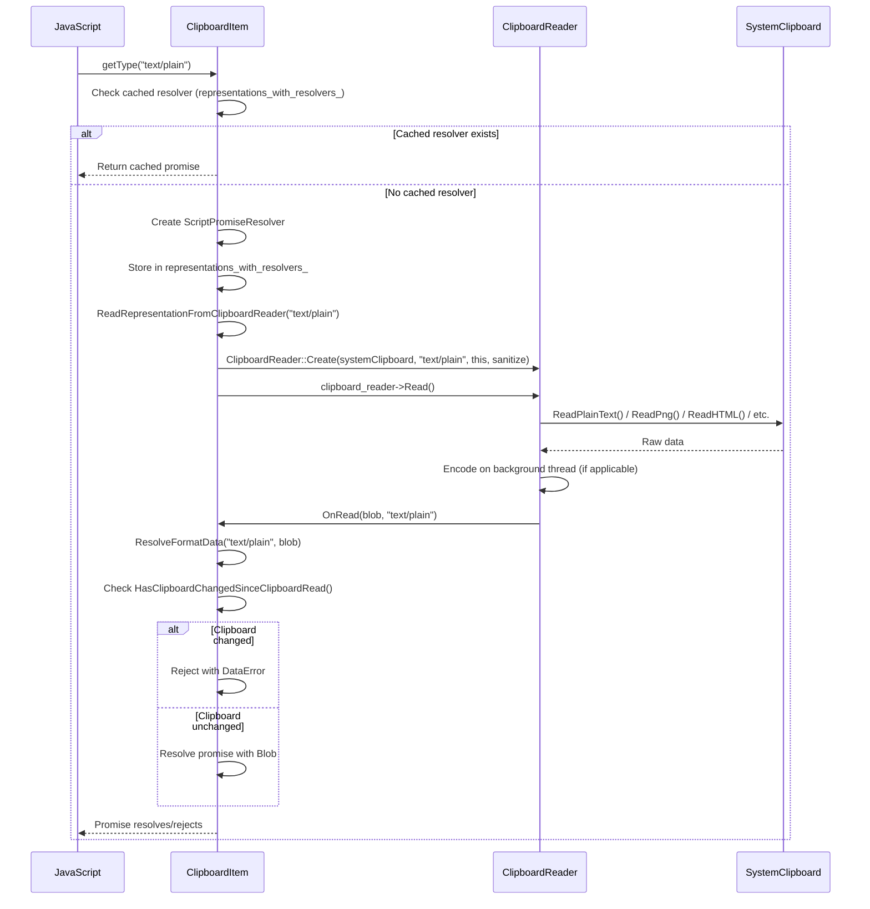
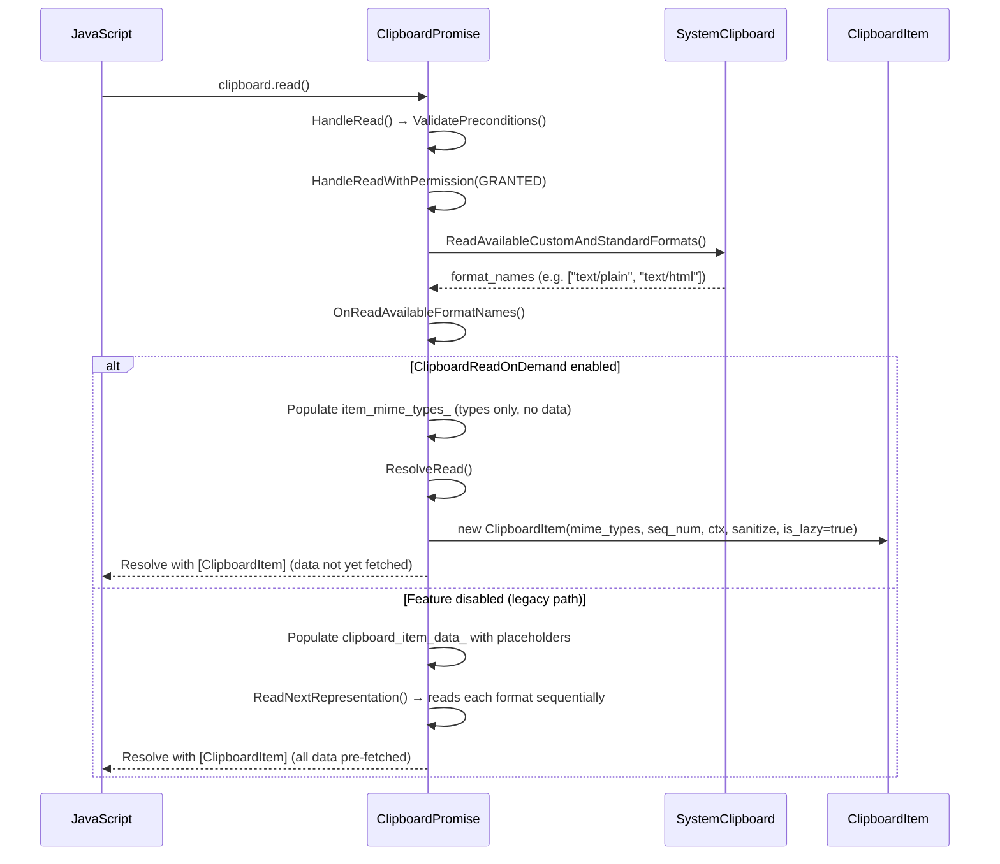
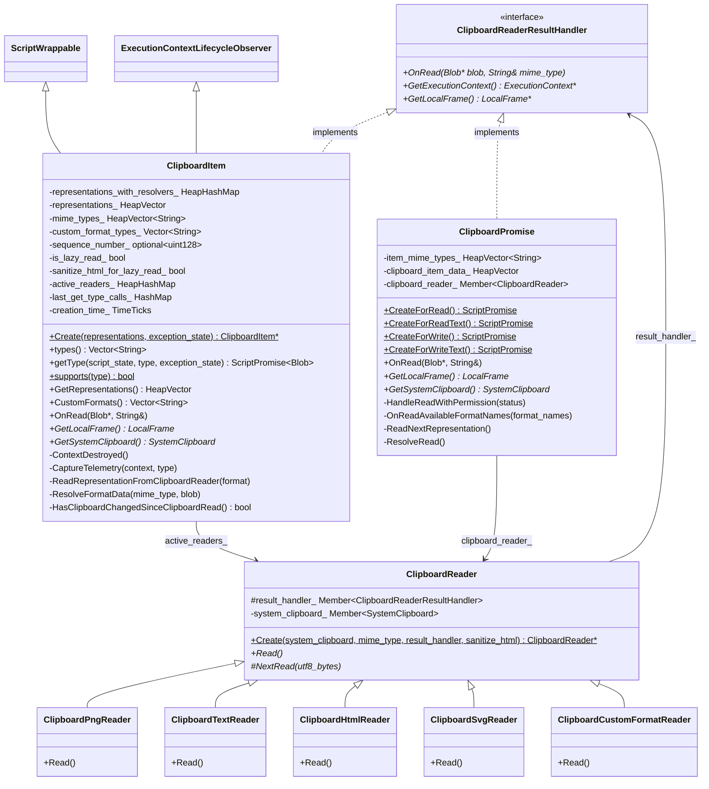
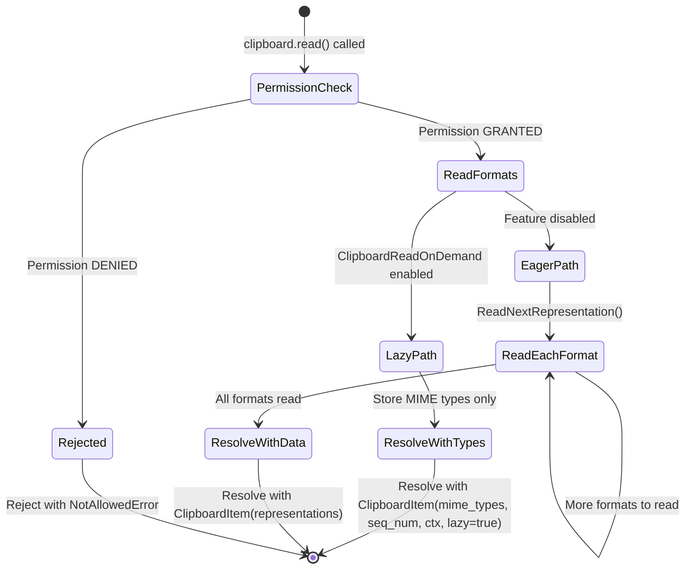

# Low-Level Design: CL 6978530 — [Clipboard] Implement on-demand reading in getType()

## Summary

This CL defers actual clipboard data reading from `clipboard.read()` to `ClipboardItem.getType()`. Previously, `clipboard.read()` fetched all clipboard data upfront; now only MIME type enumeration occurs during `read()`, and actual data is retrieved on-demand when `getType()` is called. The feature is gated behind the `ClipboardReadOnDemand` runtime flag (status: `test`).

**Bug:** [crbug.com/435051711](https://crbug.com/435051711)

---

## 1. File-by-File Analysis

---

### 1.1 `clipboard_reader.h`

**Purpose of changes**: Introduce `ClipboardReaderResultHandler` interface to decouple `ClipboardReader` from `ClipboardPromise`, allowing both `ClipboardPromise` and `ClipboardItem` to receive read results.

**Key modifications**:
- Extracted a new `ClipboardReaderResultHandler` GarbageCollectedMixin interface
- `ClipboardReader::Create()` now takes `ClipboardReaderResultHandler*` instead of `ClipboardPromise*`
- `ClipboardReader` stores `result_handler_` (was implicitly tied to `ClipboardPromise`)

**New/Modified Interfaces**:

| Interface / Method | Purpose | Parameters | Returns |
|---|---|---|---|
| `ClipboardReaderResultHandler` | Abstract mixin for receiving clipboard read results | — | — |
| `ClipboardReaderResultHandler::OnRead()` | Callback invoked when data is read | `Blob* blob, const String& mime_type` | `void` |
| `ClipboardReaderResultHandler::GetExecutionContext()` | Provides execution context to readers | — | `ExecutionContext*` |
| `ClipboardReaderResultHandler::GetLocalFrame()` | Provides local frame to readers | — | `LocalFrame*` |
| `ClipboardReader::Create()` | Factory; now accepts `ClipboardReaderResultHandler*` | `SystemClipboard*, String& mime_type, ClipboardReaderResultHandler*, bool sanitize_html` | `ClipboardReader*` |

**Data Flow**: Previously `ClipboardReader` held a raw pointer to `ClipboardPromise`. Now it holds a `Member<ClipboardReaderResultHandler>`, so either `ClipboardPromise` or `ClipboardItem` can serve as the result handler.

---

### 1.2 `clipboard_reader.cc`

**Purpose of changes**: Update all `ClipboardReader` subclasses to use the new `ClipboardReaderResultHandler` interface and pass `mime_type` alongside `Blob*` in callbacks.

**Key modifications**:
- All reader subclasses (`ClipboardPngReader`, `ClipboardTextReader`, `ClipboardHtmlReader`, `ClipboardSvgReader`, `ClipboardCustomFormatReader`) now call `result_handler_->OnRead(blob, mime_type)` instead of `clipboard_promise_->OnRead(blob)`.
- Each `NextRead()` override now passes the appropriate MIME type constant (e.g., `ui::kMimeTypePng`, `ui::kMimeTypePlainText`) as the second argument to `OnRead()`.
- Constructor takes `ClipboardReaderResultHandler*` instead of `ClipboardPromise*`.

**New/Modified Functions**:

| Function | Purpose | Parameters | Returns |
|---|---|---|---|
| `ClipboardReader::Create()` | Factory updated signature | `SystemClipboard*, const String& mime_type, ClipboardReaderResultHandler*, bool sanitize_html` | `ClipboardReader*` |
| `*Reader::NextRead()` (all subclasses) | Now passes MIME type to `OnRead()` | `Vector<uint8_t> utf8_bytes` | `void` |

---

### 1.3 `clipboard_item.h`

**Purpose of changes**: Extend `ClipboardItem` to support lazy (on-demand) reading mode, implement `ClipboardReaderResultHandler`, and observe `ExecutionContext` lifecycle.

**Key modifications**:
- `ClipboardItem` now inherits from `ExecutionContextLifecycleObserver` and `ClipboardReaderResultHandler`
- New constructor for lazy-read mode accepting `HeapVector<String>& mime_types`, `sequence_number`, `ExecutionContext*`, sanitization flag, and `is_lazy_read`
- Existing constructor gains optional `sequence_number` parameter
- New private members for lazy read state management

**New/Modified Data Structures**:

| Member | Type | Purpose |
|---|---|---|
| `representations_with_resolvers_` | `HeapHashMap<String, Member<ScriptPromiseResolver<Blob>>>` | Caches per-type promise resolvers for `getType()` |
| `mime_types_` | `HeapVector<String>` | Stores types for lazy-read ClipboardItems (replaces `representations_` usage) |
| `active_readers_` | `HeapHashMap<String, Member<ClipboardReader>>` | Tracks in-flight readers to prevent GC and allow cleanup |
| `sequence_number_` | `std::optional<absl::uint128>` | Clipboard sequence number at read() time; used for change detection |
| `is_lazy_read_` | `bool` | Whether this item uses on-demand reading |
| `sanitize_html_for_lazy_read_` | `bool` | Controls HTML sanitization in lazy mode |
| `last_get_type_calls_` | `HashMap<String, base::TimeTicks>` | Tracks last getType() call time per type for telemetry |
| `creation_time_` | `base::TimeTicks` | Item creation time for telemetry |

**API Changes**:

| Method | Purpose |
|---|---|
| `OnRead(Blob*, const String&)` | Implements `ClipboardReaderResultHandler` — routes to `ResolveFormatData()` |
| `GetLocalFrame()` | Implements `ClipboardReaderResultHandler` |
| `GetSystemClipboard()` | Helper to access system clipboard from frame |
| `ContextDestroyed()` | Rejects all pending resolvers and clears active readers |
| `ReadRepresentationFromClipboardReader()` | Creates and invokes a `ClipboardReader` for a specific format |
| `ResolveFormatData()` | Resolves or rejects the per-type promise based on read result and change detection |
| `HasClipboardChangedSinceClipboardRead()` | Compares current clipboard sequence number against stored one |
| `CaptureTelemetry()` | Records UseCounter metrics for getType() timing and clipboard changes |

---

### 1.4 `clipboard_item.cc`

**Purpose of changes**: Core implementation of lazy read logic in `ClipboardItem`.

**Key modifications**:
- New lazy-read constructor populates `mime_types_` and `custom_format_types_` from provided MIME types, including parsing web custom formats
- `types()` returns from `mime_types_` in lazy mode, `representations_` otherwise
- `getType()` in lazy mode: checks cache → creates resolver → initiates `ClipboardReader` read
- `ResolveFormatData()`: validates clipboard hasn't changed, resolves/rejects promise
- `HasClipboardChangedSinceClipboardRead()`: compares sequence numbers
- `ContextDestroyed()`: rejects all pending resolvers with `NotAllowedError`
- `CaptureTelemetry()`: extensive UseCounter tracking for time delays and clipboard changes

**New/Modified Functions**:

| Function | Purpose | Parameters | Returns |
|---|---|---|---|
| `ClipboardItem(mime_types, seq_num, ctx, sanitize, is_lazy)` | Lazy-read constructor | `HeapVector<String>&, optional<uint128>, ExecutionContext*, bool, bool` | — |
| `getType()` | On-demand data fetch with resolver caching | `ScriptState*, String& type, ExceptionState&` | `ScriptPromise<Blob>` |
| `ResolveFormatData()` | Resolve/reject per-format promise | `String& mime_type, Blob* blob` | `void` |
| `ReadRepresentationFromClipboardReader()` | Create reader and initiate read | `String& format` | `void` |
| `HasClipboardChangedSinceClipboardRead()` | Clipboard change detection | — | `bool` |
| `OnRead()` | Delegate to `ResolveFormatData()` | `Blob*, String&` | `void` |
| `ContextDestroyed()` | Cleanup pending promises | — | `void` |
| `CaptureTelemetry()` | Record UseCounter metrics | `ExecutionContext*, String& type` | `void` |

**Data Flow for `getType()` (lazy mode)**:



---

### 1.5 `clipboard_promise.h`

**Purpose of changes**: Adapt `ClipboardPromise` to implement `ClipboardReaderResultHandler` and support the new lazy-read path in `ResolveRead()`.

**Key modifications**:
- `ClipboardPromise` now implements `ClipboardReaderResultHandler` (was previously the direct handler implicitly)
- Added `GetSystemClipboard()` public method
- `OnRead()` signature updated to include `const String& mime_type`
- Added `item_mime_types_` member for storing format names in lazy-read mode

**New/Modified Functions**:

| Function | Purpose | Parameters | Returns |
|---|---|---|---|
| `OnRead()` | Now includes `mime_type` parameter | `Blob*, const String&` | `void` |
| `GetSystemClipboard()` | Public accessor for system clipboard | — | `SystemClipboard*` |

**New Data Members**:

| Member | Type | Purpose |
|---|---|---|
| `item_mime_types_` | `HeapVector<String>` | Stores MIME types during lazy-read path to pass to ClipboardItem constructor |

---

### 1.6 `clipboard_promise.cc`

**Purpose of changes**: Implement the lazy-read branching in `ResolveRead()` and `OnReadAvailableFormatNames()`.

**Key modifications**:
- `ResolveRead()`: When `ClipboardReadOnDemand` is enabled, constructs a lazy `ClipboardItem` with only MIME types (no data), passing `sequence_number`, `ExecutionContext`, and sanitization settings
- `OnReadAvailableFormatNames()`: When lazy-read is enabled, populates `item_mime_types_` instead of `clipboard_item_data_`, then immediately calls `ResolveRead()` (skipping `ReadNextRepresentation()`)
- `OnRead()`: Unchanged in behavior for non-lazy path (ignores `mime_type` and uses index-based tracking)

**Data Flow for `clipboard.read()` (lazy mode)**:



---

### 1.7 `mock_clipboard_host.h`

**Purpose of changes**: Add method call tracking to `MockClipboardHost` for verifying lazy-read behavior in tests.

**Key modifications**:
- Added `OnClipboardDataChanged()` method to simulate clipboard content changes
- Added boolean flags: `read_text_called_`, `read_html_called_`, `read_available_formats_called_`
- Added accessor methods: `WasReadTextCalled()`, `WasReadHtmlCalled()`, `WasReadAvailableFormatsCalled()`

**New/Modified Functions**:

| Function | Purpose | Parameters | Returns |
|---|---|---|---|
| `OnClipboardDataChanged()` | Simulates clipboard data change (increments sequence number) | — | `void` |
| `WasReadTextCalled()` | Query if `ReadText` was invoked | — | `bool` |
| `WasReadHtmlCalled()` | Query if `ReadHtml` was invoked | — | `bool` |
| `WasReadAvailableFormatsCalled()` | Query if `ReadAvailableCustomAndStandardFormats` was invoked | — | `bool` |

---

### 1.8 `mock_clipboard_host.cc`

**Purpose of changes**: Implement tracking flags and clipboard change simulation.

**Key modifications**:
- `ReadText()`, `ReadHtml()`, `ReadAvailableCustomAndStandardFormats()` now set corresponding `_called_` flags
- `Reset()` clears all tracking flags
- `OnClipboardDataChanged()` generates a new `ClipboardSequenceNumberToken` and notifies listener

---

### 1.9 `clipboard_unittest.cc`

**Purpose of changes**: Add unit tests for lazy-read behavior.

**Key modifications**:
- Added `ClipboardItemGetType` helper class that chains `getType()` on a read result
- `ReadOnlyMimeTypesInClipboardRead` test: Verifies that `clipboard.read()` only calls `ReadAvailableCustomAndStandardFormats()`, NOT `ReadText()` or `ReadHtml()`
- `ClipboardItemGetTypeTest` test: Verifies that `getType("text/plain")` triggers `ReadText()` but not `ReadHtml()`

**New Test Classes/Helpers**:

| Class | Purpose |
|---|---|
| `ClipboardItemGetType` | `ThenCallable` that calls `getType()` on the first ClipboardItem and returns "SUCCESS" or empty string |

---

### 1.10 `runtime_enabled_features.json5`

**Purpose of changes**: Register the `ClipboardReadOnDemand` feature flag.

**Key modifications**:
- Added `ClipboardReadOnDemand` with `status: "test"` (enabled only in test/experimental builds)

---

### 1.11 Web Tests (3 new files)

#### `async-clipboard-lazy-read.html`
Tests clipboard change detection: writes text → reads items → writes different text → verifies `getType()` rejects with `DataError`.

#### `async-clipboard-custom-format-lazy-read.html`
Tests lazy read with custom formats (`web text/custom`): writes custom format → reads items → verifies `getType()` retrieves correct data.

#### `async-custom-format-lazy-read-concurrent.tentative.https.html`
Tests concurrent `getType()` calls: writes two custom formats → reads items → calls `getType()` for both formats concurrently via `Promise.all()` → verifies both resolve correctly.

---

## 2. Class Diagram



---

## 3. State Diagram

### 3.1 ClipboardItem Lazy Read Lifecycle

```mermaid
stateDiagram-v2
    [*] --> Created : ClipboardItem constructed (lazy mode)
    Created --> TypeRequested : getType(type) called

    TypeRequested --> CachedResolverReturned : Resolver exists in cache
    TypeRequested --> TypeNotFound : Type not in mime_types_
    TypeRequested --> ReaderCreated : Type found, no cached resolver

    CachedResolverReturned --> [*] : Return cached promise

    TypeNotFound --> [*] : Throw NotFoundError

    ReaderCreated --> Reading : ClipboardReader::Read() invoked
    Reading --> ReadComplete : OnRead(blob, mime_type) callback

    ReadComplete --> ClipboardChanged : HasClipboardChangedSinceClipboardRead() == true
    ReadComplete --> BlobNull : blob == nullptr
    ReadComplete --> Resolved : blob valid, clipboard unchanged

    ClipboardChanged --> [*] : Reject with DataError
    BlobNull --> [*] : Reject with DataError
    Resolved --> [*] : Resolve promise with Blob

    Created --> Destroyed : ContextDestroyed()
    TypeRequested --> Destroyed : ContextDestroyed()
    Reading --> Destroyed : ContextDestroyed()
    Destroyed --> [*] : Reject all pending with NotAllowedError
```

### 3.2 clipboard.read() Flow Branching



---

## 4. Implementation Concerns

### 4.1 Memory Management

- **Active readers tracking (`active_readers_`)**: `ClipboardItem` maintains a `HeapHashMap<String, Member<ClipboardReader>>` to prevent GC of in-flight readers. Readers are removed from the map in `ResolveFormatData()` when the callback fires. If a reader's callback never fires (e.g., Mojo pipe broken), the reader will be held alive indefinitely until `ContextDestroyed()` clears the map.

- **Resolver caching**: Resolved promises are cached in `representations_with_resolvers_` and never cleaned up (by design — ClipboardItem represents a snapshot). This means calling `getType()` for the same type returns the same resolved promise. Rejected resolvers are removed (`erase()` in `ResolveFormatData()`), allowing retry — this is correct behavior.

- **ClipboardItem outliving ExecutionContext**: Addressed via `ContextDestroyed()` which rejects all pending resolvers and clears readers. The `ExecutionContextLifecycleObserver` subscription ensures this is called.

### 4.2 Thread Safety

- All clipboard operations run on the main thread (enforced via `DCHECK_CALLED_ON_VALID_SEQUENCE` in `ClipboardReader` subclasses and `ClipboardPromise`). Background encoding (text, HTML, SVG) correctly posts results back to the clipboard task runner.
- `ClipboardItem` has no `SEQUENCE_CHECKER`. Since it's a `ScriptWrappable` and bound to a single JS context, it should only be accessed from the main thread, but an explicit check would be safer.

### 4.3 Performance Implications

- **Positive**: `clipboard.read()` no longer reads all format data upfront. If a web app only needs `text/plain` from a clipboard with `[text/plain, text/html, image/png]`, it avoids reading HTML and PNG data entirely.
- **Negative**: Each `getType()` call makes a separate IPC to the system clipboard. For apps that call `getType()` for all types, this may be slightly slower than the batched approach due to per-call overhead. However, the concurrent `getType()` test (`Promise.all([getType(f1), getType(f2)])`) demonstrates this is supported.

### 4.4 Clipboard Change Detection

- Sequence number comparison (`HasClipboardChangedSinceClipboardRead()`) is checked **after** the read completes in `ResolveFormatData()`. This creates a TOCTOU window: the clipboard could change after the check passes but before the promise resolves to JS. However, this is acceptable because the data was already read at that point.
- If `sequence_number_` was never set (no value), `HasClipboardChangedSinceClipboardRead()` conservatively returns `true`, which causes rejection. This prevents data races when the feature is in an unexpected state.

### 4.5 Maintainability

- The dual-path logic (lazy vs eager) in `getType()`, `types()`, `ResolveRead()`, and `OnReadAvailableFormatNames()` is guarded by `RuntimeEnabledFeatures::ClipboardReadOnDemandEnabled()` checks. When the feature ships and the flag is removed, the eager-path code can be cleanly deleted.
- The `ClipboardReaderResultHandler` interface is a clean abstraction that decouples `ClipboardReader` from both callers.

---

## 5. Suggestions for Improvement

### 5.1 Add SEQUENCE_CHECKER to ClipboardItem
`ClipboardItem` now has async operations with callbacks (`OnRead`, `ResolveFormatData`, `ContextDestroyed`). Adding a `SEQUENCE_CHECKER` member with `DCHECK_CALLED_ON_VALID_SEQUENCE` in these methods would match the pattern used in `ClipboardPromise` and catch potential threading violations.

### 5.2 Consider timeout for active_readers_
If a `ClipboardReader` callback never fires (e.g., due to a broken Mojo pipe), the reader entry in `active_readers_` is never removed. Consider adding a timeout or verifying that `ContextDestroyed()` cleanup is always guaranteed to fire.

### 5.3 Telemetry method complexity
`CaptureTelemetry()` is ~70 lines with multiple `UseCounter::Count` calls for various time buckets. Consider extracting the time-bucket logic into a helper function to reduce repetition:
```cpp
void RecordTimeBucketMetric(ExecutionContext* ctx, base::TimeDelta diff,
                            WebFeature f_5sec, WebFeature f_1min, WebFeature f_10min);
```

### 5.4 Error message consistency
The `ResolveFormatData()` reject message "Failed to read or decode Blob." is generic. When the reader returns `nullptr`, the actual cause could be:
- System clipboard returned empty data
- Encoding failed on background thread
- `SystemClipboard` was null

Consider propagating a more specific error reason from the reader.

### 5.5 Consider restricting resolver cache visibility
`representations_with_resolvers_` is a `HeapHashMap` that grows with each unique `getType()` call. For a `ClipboardItem` with many types, resolved blobs stay in memory for the lifetime of the `ClipboardItem`. If the item is held long-term by JS, this could be significant. Consider documenting this trade-off or providing a way to release cached data.

### 5.6 Concurrent getType() for the same type
If `getType("text/plain")` is called twice quickly before the first resolves, the second call hits the `has_cached_resolver` branch and returns the same pending promise — this is correct. However, if the first call rejects (e.g., due to clipboard change), the resolver is erased, allowing a retry. The retry will re-read from the (now changed) clipboard, which may or may not be the desired behavior since the `ClipboardItem` was supposed to represent a snapshot.

### 5.7 Web test coverage gaps
- No test for `ContextDestroyed()` behavior (document detachment while getType is pending)
- No test for `getType()` retry after rejection
- No test for the eager-read path when the feature flag is disabled (regression protection)
- No test for `getType()` with unsupported type in lazy mode (should throw `NotFoundError`)
