# Hld

> **Source**: claude-opus-4.6-fast (only model with output for this document)

# High-Level Design: CL 6978530 — [Clipboard] Implement on-demand reading in getType()

**CL URL:** https://chromium-review.googlesource.com/c/chromium/src/+/6978530
**Author:** Shweta Bindal (shwetabindal@microsoft.com)
**Status:** NEW
**Total Changes:** 13 files, +711/−121 lines

---

## 1. Executive Summary

This CL changes the Async Clipboard API's `clipboard.read()` from eagerly fetching all clipboard data upfront to a lazy/on-demand model where `read()` only retrieves the list of available MIME types, and actual clipboard data is fetched when `ClipboardItem.getType()` is called. This improves performance for web applications that only need a subset of clipboard formats (e.g., reading only `text/plain` when `text/html`, `image/png`, and custom formats are also available). The change is gated behind the `ReadClipboardDataOnClipboardItemGetType` runtime feature flag (currently set to `"test"` status), ensuring backward compatibility via a gradual rollout. A new `ClipboardReaderResultHandler` interface is introduced so that both `ClipboardPromise` (eager path) and `ClipboardItem` (lazy path) can serve as callback targets for `ClipboardReader`.

---

## 2. Architecture Overview

### Affected Components/Modules

| Component | Location | Role |
|-----------|----------|------|
| **ClipboardItem** | `modules/clipboard/clipboard_item.{h,cc}` | Now supports lazy read mode; creates `ClipboardReader` instances on-demand in `getType()` |
| **ClipboardPromise** | `modules/clipboard/clipboard_promise.{h,cc}` | Orchestrates `clipboard.read()`. In lazy mode, resolves immediately with MIME types only |
| **ClipboardReader** | `modules/clipboard/clipboard_reader.{h,cc}` | Reads individual formats from system clipboard. Now parameterized on `ClipboardReaderResultHandler` instead of `ClipboardPromise` |
| **ClipboardReaderResultHandler** | `modules/clipboard/clipboard_reader.h` | New interface for decoupling reader output from specific handler classes |
| **MockClipboardHost** | `core/testing/mock_clipboard_host.{h,cc}` | Test mock updated to track which read methods were called |
| **RuntimeEnabledFeatures** | `platform/runtime_enabled_features.json5` | New feature flag `ReadClipboardDataOnClipboardItemGetType` |

### Component Diagram

```mermaid
graph TB
    subgraph "Web Page JavaScript"
        JS["navigator.clipboard.read&#40;&#41;<br/>clipboardItem.getType&#40;type&#41;"]
    end

    subgraph "Blink Renderer - Clipboard Module"
        CP["ClipboardPromise<br/>&#40;orchestrates read/write&#41;"]
        CI["ClipboardItem<br/>&#40;holds types, lazy-reads data&#41;"]
        CR["ClipboardReader<br/>&#40;reads individual formats&#41;"]
        CRRH["&laquo;interface&raquo;<br/>ClipboardReaderResultHandler"]
    end

    subgraph "Blink Platform"
        SC["SystemClipboard<br/>&#40;Mojo proxy to browser&#41;"]
        REF["RuntimeEnabledFeatures<br/>&#40;feature flag gate&#41;"]
    end

    subgraph "Browser Process"
        CH["ClipboardHost<br/>&#40;system clipboard access&#41;"]
    end

    JS -->|"clipboard.read&#40;&#41;"| CP
    CP -->|"lazy: creates with MIME types only"| CI
    CP -->|"eager: creates ClipboardReader"| CR
    JS -->|"getType&#40;type&#41;"| CI
    CI -->|"lazy: creates ClipboardReader"| CR
    CR -->|"OnRead&#40;blob, type&#41;"| CRRH
    CP -.->|implements| CRRH
    CI -.->|implements| CRRH
    CR -->|"ReadPlainText / ReadHTML / ..."| SC
    SC -->|"Mojo IPC"| CH
    CI -->|"SequenceNumber&#40;&#41;"| SC
    CP -->|"checks flag"| REF
    CI -->|"checks flag"| REF

    style CRRH stroke-dasharray: 5 5
    style REF fill:#ffe0b2
```



### How It Fits Into Existing Architecture

Previously, `ClipboardPromise::ReadNextRepresentation()` iterated through all available formats, creating a `ClipboardReader` for each, and collected all `Blob` results before resolving the `clipboard.read()` promise. Now, when the feature flag is enabled:

1. `ClipboardPromise::OnReadAvailableFormatNames()` stores only the MIME type list and immediately resolves the read promise with a lazy `ClipboardItem`.
2. The `ClipboardItem` itself creates `ClipboardReader` instances on-demand when `getType()` is called.

---

## 3. Design Goals & Non-Goals

### Goals
- **Performance improvement**: Avoid reading clipboard data for formats that the web page never requests via `getType()`.
- **Clipboard change detection**: Detect if clipboard content changed between `read()` and `getType()`, rejecting with `DataError` to prevent stale data.
- **Backward compatibility**: The old eager-read path is preserved behind the feature flag.
- **Telemetry**: Capture UseCounter metrics for clipboard usage patterns (time between `read()` and `getType()`, clipboard changes, etc.).

### Non-Goals
- Changes to clipboard **write** operations (untouched).
- Changes to `clipboard.readText()` (still reads eagerly).
- Modifications to the browser-side `ClipboardHost` implementation.
- Changes to the `ClipboardWriter` path.

---

## 4. System Interactions

### Sequence Diagram — Lazy Read Flow (Feature Enabled)

```mermaid
sequenceDiagram
    participant JS as JavaScript
    participant CP as ClipboardPromise
    participant SC as SystemClipboard
    participant CH as ClipboardHost<br/>&#40;Browser Process&#41;
    participant CI as ClipboardItem
    participant CR as ClipboardReader

    Note over JS,CH: Phase 1: clipboard.read&#40;&#41; — Types Only
    JS->>CP: clipboard.read&#40;&#41;
    CP->>CP: ValidatePreconditions &#40;permission check&#41;
    CP->>SC: ReadAvailableCustomAndStandardFormats&#40;&#41;
    SC->>CH: Mojo IPC: ReadAvailableCustomAndStandardFormats
    CH-->>SC: format_names &#40;e.g. text/plain, text/html&#41;
    SC-->>CP: OnReadAvailableFormatNames&#40;format_names&#41;
    CP->>SC: SequenceNumber&#40;&#41;
    SC-->>CP: sequence_number
    CP->>CI: new ClipboardItem&#40;mime_types, sequence_number, context, ...&#41;
    Note over CI: is_lazy_read_ = true<br/>No data read yet
    CP-->>JS: resolve&#40;[ClipboardItem]&#41;

    Note over JS,CH: Phase 2: getType&#40;&#41; — On-Demand Data Read
    JS->>CI: getType&#40;text/plain&#41;
    CI->>SC: SequenceNumber&#40;&#41;
    SC-->>CI: current_sequence_number
    CI->>CI: HasClipboardChangedSinceClipboardRead&#40;&#41;?
    alt Clipboard Changed
        CI-->>JS: reject&#40;DataError&#41;
    else Clipboard Unchanged
        CI->>CR: ClipboardReader::Create&#40;text/plain, this&#41;
        CI->>CI: active_readers_.insert&#40;text/plain, reader&#41;
        CR->>SC: ReadPlainText&#40;&#41;
        SC->>CH: Mojo IPC: ReadText
        CH-->>SC: text data
        SC-->>CR: callback with text
        CR->>CR: Encode on background thread
        CR-->>CI: OnRead&#40;blob, text/plain&#41;
        CI->>CI: ResolveFormatData&#40;text/plain, blob&#41;
        CI->>CI: active_readers_.erase&#40;text/plain&#41;
        CI-->>JS: resolve&#40;Blob&#41;
    end
```



### Sequence Diagram — Eager Read Flow (Feature Disabled / Legacy)

```mermaid
sequenceDiagram
    participant JS as JavaScript
    participant CP as ClipboardPromise
    participant SC as SystemClipboard
    participant CR as ClipboardReader

    JS->>CP: clipboard.read&#40;&#41;
    CP->>CP: ValidatePreconditions
    CP->>SC: ReadAvailableCustomAndStandardFormats&#40;&#41;
    SC-->>CP: format_names
    loop For each format
        CP->>CR: ClipboardReader::Create&#40;format, this&#41;
        CR->>SC: ReadPlainText/ReadHTML/ReadPng/...
        SC-->>CR: data
        CR-->>CP: OnRead&#40;blob, mime_type&#41;
    end
    CP->>CP: ResolveRead&#40;&#41; — creates ClipboardItem with all data
    CP-->>JS: resolve&#40;[ClipboardItem]&#41;
    JS->>CP: getType&#40;text/plain&#41;
    Note over JS: Returns already-resolved promise
```



### IPC/Mojo Interactions

The Mojo boundary (`SystemClipboard` ↔ `ClipboardHost`) is unchanged. The key difference is **when** individual read methods (`ReadText`, `ReadHTML`, `ReadPng`, etc.) are called:
- **Before**: All called during `clipboard.read()`.
- **After**: Only `ReadAvailableCustomAndStandardFormats` is called during `clipboard.read()`. Individual reads happen during `getType()`.

---

## 5. API & Interface Changes

### New Interfaces

#### `ClipboardReaderResultHandler` (abstract interface)
**File:** `/workspace/cr2/src/third_party/blink/renderer/modules/clipboard/clipboard_reader.h#L21-L27`

```cpp
class ClipboardReaderResultHandler : public GarbageCollectedMixin {
 public:
  virtual void OnRead(Blob* blob, const String& mime_type) = 0;
  virtual ExecutionContext* GetExecutionContext() const = 0;
  virtual LocalFrame* GetLocalFrame() const = 0;
  void Trace(Visitor* visitor) const override {}
};
```

This interface decouples `ClipboardReader` from `ClipboardPromise`, allowing both `ClipboardPromise` (eager path) and `ClipboardItem` (lazy path) to receive read results.

### Modified Interfaces

#### `ClipboardItem` — New Constructor & Methods
**File:** `/workspace/cr2/src/third_party/blink/renderer/modules/clipboard/clipboard_item.h`

- **New constructor** (line 59-63): `ClipboardItem(const HeapVector<String>& mime_types, std::optional<absl::uint128> sequence_number, ExecutionContext*, bool sanitize_html_for_lazy_read, bool is_lazy_read)` — Creates a lazy `ClipboardItem` with only MIME types and no data.
- **Implements `ClipboardReaderResultHandler`** (line 36): `OnRead()`, `GetExecutionContext()`, `GetLocalFrame()`.
- **Implements `ExecutionContextLifecycleObserver`** (line 35): `ContextDestroyed()` rejects pending promises.
- **New private methods**: `ResolveFormatData()`, `ReadRepresentationFromClipboardReader()`, `HasClipboardChangedSinceClipboardRead()`.
- **New members**: `representations_with_resolvers_`, `mime_types_`, `active_readers_`, `is_lazy_read_`, `sanitize_html_for_lazy_read_`, `last_get_type_calls_`, `creation_time_`.

#### `ClipboardReader::Create()` Parameter Change
**File:** `/workspace/cr2/src/third_party/blink/renderer/modules/clipboard/clipboard_reader.h#L55-L58`

- `ClipboardPromise* promise` → `ClipboardReaderResultHandler* result_handler`
- Internal member `promise_` → `result_handler_`

#### `ClipboardPromise` — Now Implements `ClipboardReaderResultHandler`
**File:** `/workspace/cr2/src/third_party/blink/renderer/modules/clipboard/clipboard_promise.h#L49`

- Inherits from `ClipboardReaderResultHandler` instead of accessing reader internals directly.

### New Runtime Feature Flag
**File:** `/workspace/cr2/src/third_party/blink/renderer/platform/runtime_enabled_features.json5`

```json5
{
  name: "ReadClipboardDataOnClipboardItemGetType",
  status: "test",
}
```

Status `"test"` means the feature is enabled in tests but not in production builds by default.

### Deprecated Interfaces

- The TODO comment on `ClipboardReaderResultHandler` (line 19-20) indicates it is intended to be removed once lazy read is stable, at which point `ClipboardPromise` would no longer need to implement it (the eager path would be removed).

---

## 6. Dependencies

### What This Code Depends On

| Dependency | Purpose |
|-----------|---------|
| `SystemClipboard` | Access to the platform clipboard via Mojo IPC |
| `ClipboardHost` (browser process) | Actual clipboard data storage/retrieval |
| `RuntimeEnabledFeatures` | Feature flag gating |
| `ExecutionContextLifecycleObserver` | Observing document lifecycle for cleanup |
| `GarbageCollectedMixin` / Oilpan GC | Memory management for all Blink heap objects |
| `ScriptPromiseResolver<Blob>` | Promise resolution for `getType()` returns |
| `worker_pool::PostTask` | Background thread encoding for text/HTML/SVG readers |

### What Depends On This Code

| Dependent | Impact |
|-----------|--------|
| Web pages using `clipboard.read()` + `getType()` | Behavior change: data read deferred |
| `ClipboardWriter` | No changes, but shares `ClipboardPromise` as context |
| Web Platform Tests | New tests added; existing tests adjusted |

### Compatibility

- The feature flag ensures **no behavior change in production** until explicitly enabled.
- When enabled, the web-facing API contract is preserved: `clipboard.read()` still returns `ClipboardItem[]`, and `getType()` still returns `Promise<Blob>`.

---

## 7. Object Lifecycle Analysis & Crash Risk Assessment

This section provides a detailed analysis of object lifecycles, focusing on potential NULL dereferences, use-after-free (UAF), and dangling pointer scenarios.

### 7.1 Object Lifecycle Overview

#### `ClipboardItem` (Lazy Read Mode)

| Phase | Details |
|-------|---------|
| **Creation** | Created in `ClipboardPromise::ResolveRead()` via `MakeGarbageCollected<ClipboardItem>(mime_types, seq_num, context, sanitize_html, true)`. The constructor registers the item as an `ExecutionContextLifecycleObserver` on the provided `ExecutionContext`. |
| **Ownership** | After creation, the `ClipboardItem` is resolved into a JavaScript promise. The V8 GC (via `ScriptWrappable`) and the `ExecutionContextLifecycleObserver` mechanism keep it alive as long as JavaScript references it or the context is alive. |
| **Active use** | When `getType()` is called, the item creates `ScriptPromiseResolver<Blob>` entries in `representations_with_resolvers_` and `ClipboardReader` entries in `active_readers_`. |
| **Destruction** | Via Oilpan GC when no more references exist. `ContextDestroyed()` is called if the document is torn down, which rejects all pending promises and clears `active_readers_`. |

#### `ClipboardReader` (and subclasses)

| Phase | Details |
|-------|---------|
| **Creation** | Created via `ClipboardReader::Create()` in either `ClipboardPromise::ReadNextRepresentation()` (eager) or `ClipboardItem::ReadRepresentationFromClipboardReader()` (lazy). Created with `MakeGarbageCollected`. |
| **Ownership** | In lazy mode, stored in `ClipboardItem::active_readers_` (`HeapHashMap<String, Member<ClipboardReader>>`). The `Member<>` smart pointer is traced by Oilpan, preventing premature GC. In eager mode, stored in `ClipboardPromise::clipboard_reader_`. |
| **Preventing premature GC during async operations** | When a reader posts async work (e.g., `ReadPlainText` with callback), it uses `WrapPersistent(this)` to prevent GC during the Mojo callback. When posting to background threads, it uses `MakeCrossThreadHandle(this)` (which internally creates a weak persistent handle) and `MakeUnwrappingCrossThreadHandle` to safely return to the main thread. |
| **Completion** | After `OnRead()` callback fires, the reader is removed from `active_readers_` in `ResolveFormatData()` via `active_readers_.erase(mime_type)`. |
| **Destruction** | After removal from `active_readers_`, the reader becomes eligible for GC (assuming `WrapPersistent` references from pending callbacks have also completed). |

#### `ScriptPromiseResolver<Blob>` (per-type resolvers in ClipboardItem)

| Phase | Details |
|-------|---------|
| **Creation** | Created in `ClipboardItem::getType()` via `MakeGarbageCollected<ScriptPromiseResolver<Blob>>()`. Stored in `representations_with_resolvers_`. |
| **Resolution** | Resolved in `ResolveFormatData()` with the Blob, or rejected if clipboard changed. |
| **Cleanup on context destruction** | All pending resolvers are rejected in `ContextDestroyed()` with `NotAllowedError`. |

### 7.2 Key Chromium/Blink Constructs Used

#### `WrapPersistent(this)`
Used in `ClipboardReader` subclasses (e.g., `ClipboardTextReader::Read()` at `/workspace/cr2/src/third_party/blink/renderer/modules/clipboard/clipboard_reader.cc#L74`) when binding Mojo callbacks. `WrapPersistent()` creates a **persistent handle** to the garbage-collected object, preventing Oilpan from collecting it while the Mojo callback is pending. The persistent handle is released when the callback executes or is destroyed.

**How it works**: Oilpan's garbage collector traces live objects starting from roots (stack, persistent handles, etc.). `WrapPersistent()` creates a `Persistent<T>` handle that acts as a GC root. This means even if no other traced reference points to the object, the persistent handle keeps it alive. When the callback fires (or is dropped), the persistent handle is destroyed, and the object becomes eligible for GC again if no other references exist.

**Risk**: If the callback never fires (e.g., Mojo pipe broken), the persistent handle leaks until the pipe error handler cleans up the callback. This is standard Mojo/Oilpan practice and is considered safe.

#### `MakeCrossThreadHandle(this)` / `MakeUnwrappingCrossThreadHandle`
Used when posting work to background threads (e.g., `ClipboardTextReader::EncodeOnBackgroundThread()` at `/workspace/cr2/src/third_party/blink/renderer/modules/clipboard/clipboard_reader.cc#L87`). 

**How it works**: `MakeCrossThreadHandle` creates a `CrossThreadHandle<T>` which internally holds a `CrossThreadPersistent<T>` — a persistent handle safe to destroy from any thread. This prevents GC of the target object while work is in flight on a background thread. `MakeUnwrappingCrossThreadHandle` converts the cross-thread handle into a raw pointer for use in the main-thread callback, releasing the persistent handle in the process.

**Key safety property**: The persistent handle keeps the reader alive across the background thread boundary. The unwrapped pointer is used only on the main thread where GC can run, but at that point the reader is being used in a traced callback chain.

#### `Member<T>`
Standard Oilpan traced smart pointer used throughout (e.g., `Member<ClipboardReader>`, `Member<ScriptPromiseResolver<Blob>>`). Objects stored in `Member<>` fields of a traced object are kept alive by Oilpan's tracing mechanism. The `Trace()` method of the owning object must visit all `Member<>` fields.

**In this CL**: `ClipboardItem::Trace()` visits `representations_with_resolvers_` and `active_readers_`, ensuring all stored resolvers and readers are kept alive.

#### `HeapHashMap<String, Member<ClipboardReader>> active_readers_`
Stores active readers in the lazy-read path. This map is traced in `ClipboardItem::Trace()` at `/workspace/cr2/src/third_party/blink/renderer/modules/clipboard/clipboard_item.cc#L320`, ensuring readers aren't GC'd while active. Entries are removed when the read completes (`active_readers_.erase(mime_type)` in `ResolveFormatData()`).

#### `ExecutionContextLifecycleObserver`
Both `ClipboardItem` and `ClipboardPromise` implement this. When the `ExecutionContext` (document) is destroyed, `ContextDestroyed()` is called, allowing cleanup of pending state. This is a **strong guarantee** — the observer is registered during construction and `ContextDestroyed()` is always called before the context is fully torn down.

**In ClipboardItem**: `ContextDestroyed()` at `/workspace/cr2/src/third_party/blink/renderer/modules/clipboard/clipboard_item.cc#L291-L299` rejects all pending promise resolvers with `NotAllowedError` and clears `active_readers_`. This prevents UAF of the execution context in subsequent callbacks.

#### `GarbageCollectedMixin`
The `ClipboardReaderResultHandler` interface extends `GarbageCollectedMixin`, which means it can be used as a member type in garbage-collected classes via `Member<ClipboardReaderResultHandler>`. The `Trace()` method is virtual and allows proper tracing through the mixin interface.

### 7.3 Potential Crash Scenarios & Analysis

#### Scenario 1: `getType()` called after document detachment
**Risk**: NULL dereference when accessing `GetExecutionContext()` or `GetSystemClipboard()`.
**Mitigation**: `getType()` checks `GetExecutionContext()` at `/workspace/cr2/src/third_party/blink/renderer/modules/clipboard/clipboard_item.cc#L196-L199` and throws `NotAllowedError` if null. `HasClipboardChangedSinceClipboardRead()` also returns `true` if `GetSystemClipboard()` returns null (lines 263-266). `ContextDestroyed()` rejects all pending resolvers and clears `active_readers_`.
**Assessment**: ✅ **Safe**. Null checks are present on all code paths.

#### Scenario 2: `ClipboardReader` callback fires after `ClipboardItem` is destroyed
**Risk**: UAF when `ClipboardReader` calls `result_handler_->OnRead()` but `ClipboardItem` has been GC'd.
**Mitigation**: The `ClipboardReader` holds a `Member<ClipboardReaderResultHandler> result_handler_` which is a GC-traced reference. This prevents the `ClipboardItem` from being collected while any reader references it. Additionally, `ClipboardItem` stores readers in `active_readers_`, creating a bidirectional trace chain. The reader's `WrapPersistent(this)` in Mojo callbacks also keeps the reader (and transitively the result handler) alive.
**Assessment**: ✅ **Safe**. The Oilpan tracing graph prevents UAF.

#### Scenario 3: Background thread callback after `ClipboardReader` GC
**Risk**: `PostCrossThreadTask` with `MakeUnwrappingCrossThreadHandle` could dereference a dead reader.
**Mitigation**: `MakeCrossThreadHandle` creates a persistent handle that prevents GC of the reader. The reader is only eligible for GC after all cross-thread handles are released (i.e., after the background task completes and posts back to main thread).
**Assessment**: ✅ **Safe**. Standard Chromium pattern.

#### Scenario 4: Concurrent `getType()` calls for the same MIME type
**Risk**: Creating duplicate readers/resolvers for the same type.
**Mitigation**: `/workspace/cr2/src/third_party/blink/renderer/modules/clipboard/clipboard_item.cc#L208-L219` checks `has_cached_resolver` before creating a new resolver. If a resolver already exists for the type, it returns the existing promise. This prevents duplicate readers.
**Assessment**: ✅ **Safe**. Deduplication logic is correct.

#### Scenario 5: Concurrent `getType()` calls for different MIME types
**Risk**: Multiple readers active simultaneously; potential issues with `SystemClipboard` access.
**Mitigation**: Each reader operates independently and stores its result in a type-keyed map. `SystemClipboard` operations are main-thread-only (enforced by `DCHECK_CALLED_ON_VALID_SEQUENCE`), so there's no thread-safety issue. The `active_readers_` map correctly tracks multiple concurrent readers.
**Assessment**: ✅ **Safe**. The test `async-custom-format-lazy-read-concurrent.tentative.https.html` explicitly verifies this scenario.

#### Scenario 6: `ResolveFormatData()` called with unknown MIME type
**Risk**: Accessing `representations_with_resolvers_` with a key that doesn't exist.
**Mitigation**: `/workspace/cr2/src/third_party/blink/renderer/modules/clipboard/clipboard_item.cc#L158-L161` checks if the mime_type exists in the map and returns early if not found.
**Assessment**: ✅ **Safe**. Early return on missing key.

#### Scenario 7: `ResolveFormatData()` called with null blob
**Risk**: Resolving promise with null.
**Mitigation**: `ResolveFormatData()` calls `Resolve(blob)` where `blob` can be null. A null blob would resolve the JS promise with `null`, which may not match the spec expectation (getType should reject, not resolve with null, if data is unavailable).
**Analysis**: In `ReadRepresentationFromClipboardReader()` at `/workspace/cr2/src/third_party/blink/renderer/modules/clipboard/clipboard_item.cc#L241-L250`, if `GetSystemClipboard()` returns null or `ClipboardReader::Create()` returns null, it calls `ResolveFormatData(format, nullptr)` which resolves the promise with a null blob. The spec says `getType()` should reject with `NotFoundError` if the type is not available. Resolving with `nullptr` could cause unexpected behavior in JavaScript.
**Assessment**: ⚠️ **Potential bug** — should reject the promise instead of resolving with null when reader creation fails.

#### Scenario 8: `ClipboardItem` constructor with null `ExecutionContext`
**Risk**: Null dereference in `ExecutionContextLifecycleObserver(execution_context)`.
**Mitigation**: The lazy constructor is only called from `ClipboardPromise::ResolveRead()` where `GetExecutionContext()` is checked by `DCHECK(GetExecutionContext())` at line 372. However, `GetExecutionContext()` could theoretically return null if the context was destroyed between the DCHECK and the constructor call (though this is on the same sequence, so it's extremely unlikely).
**Assessment**: ✅ **Safe** in practice due to single-threaded execution.

#### Scenario 9: `ContextDestroyed()` called while `ClipboardReader` is encoding on background thread
**Risk**: Background thread posts task back to main thread after `ContextDestroyed()`, reader calls `OnRead()` on a destroyed context.
**Mitigation**: `ContextDestroyed()` clears `active_readers_`, but the reader may still be alive due to `WrapPersistent` in its callback. When `OnRead()` fires on `ClipboardItem`, `ResolveFormatData()` would find the resolver gone (cleared in `ContextDestroyed()`) and return early at lines 158-161. The resolver would already be rejected.
**Assessment**: ✅ **Safe**. The check for resolver existence in `ResolveFormatData()` prevents issues.

#### Scenario 10: `ReadRepresentationFromClipboardReader()` — `ClipboardReader::Create()` dereferences null `result_handler->GetExecutionContext()`
**Risk**: In the `ClipboardReader` constructor at `/workspace/cr2/src/third_party/blink/renderer/modules/clipboard/clipboard_reader.cc#L367-L369`, `result_handler->GetExecutionContext()->GetTaskRunner(...)` is called. If `GetExecutionContext()` returns null, this is a null dereference crash.
**Analysis**: `ReadRepresentationFromClipboardReader()` is called from `getType()`, which checks `GetExecutionContext()` at line 196. However, there is a **TOCTOU gap**: between the check at line 196 and the call to `ClipboardReader::Create()` at line 246, the context could theoretically be destroyed if another callback runs (e.g., a microtask). In practice, this is extremely unlikely because `ContextDestroyed()` and `getType()` run on the same sequence, and there's no yield point between the check and the use.
**Assessment**: ✅ **Safe** in practice, but theoretically fragile. A defensive null check in the `ClipboardReader` constructor would add robustness.

### 7.4 Summary of Lifecycle Safety

| Object | Created By | Prevented from GC By | Cleaned Up By |
|--------|-----------|---------------------|--------------|
| `ClipboardItem` (lazy) | `ClipboardPromise::ResolveRead()` | JS reference + `ExecutionContextLifecycleObserver` | Oilpan GC + `ContextDestroyed()` |
| `ScriptPromiseResolver<Blob>` | `ClipboardItem::getType()` | `representations_with_resolvers_` (`Member<>`) | Resolved/Rejected in `ResolveFormatData()` or `ContextDestroyed()` |
| `ClipboardReader` | `ClipboardItem::ReadRepresentationFromClipboardReader()` | `active_readers_` (`Member<>`) + `WrapPersistent` in callbacks | Removed from `active_readers_` in `ResolveFormatData()` or `ContextDestroyed()` |
| `ClipboardPromise` | `ClipboardPromise::CreateForRead()` | `WrapPersistent` in permission/Mojo callbacks | `ContextDestroyed()` rejects resolver |

---

## 8. Risks & Mitigations

### Risk 1: Clipboard Content Staleness
**Risk**: Clipboard changes between `read()` and `getType()`, leading to inconsistent data.
**Mitigation**: Clipboard sequence number comparison in `HasClipboardChangedSinceClipboardRead()`. Rejects with `DataError` if changed. Double-checked both at `getType()` entry (line 202) and at resolve time (line 164).

### Risk 2: Feature Flag Interaction
**Risk**: Feature flag `ReadClipboardDataOnClipboardItemGetType` changes the behavior of a web-exposed API.
**Mitigation**: Status is `"test"` (not enabled in production). Both code paths (lazy and eager) are maintained and tested. The flag is checked consistently in `ClipboardItem::getType()`, `ClipboardItem::types()`, `ClipboardPromise::OnReadAvailableFormatNames()`, and `ClipboardPromise::ResolveRead()`.

### Risk 3: Backward Compatibility of `ClipboardItem` Constructor
**Risk**: The new constructor with `is_lazy_read` parameter could be misused.
**Mitigation**: The new constructor is only used internally by `ClipboardPromise::ResolveRead()`. A `DCHECK` at lines 83-84 of `clipboard_item.cc` ensures it's only called when the feature flag is enabled.

### Risk 4: Null Blob Resolution (⚠️)
**Risk**: As noted in Scenario 7 above, `ResolveFormatData(format, nullptr)` resolves the promise with null when `SystemClipboard` or `ClipboardReader::Create()` fails.
**Recommendation**: Consider rejecting with a `DataError` or `NotFoundError` instead of resolving with null.

### Risk 5: Memory Pressure from Held Readers
**Risk**: If a page calls `read()` but never calls `getType()`, the lazy `ClipboardItem` stays alive in JS but holds no readers. If `getType()` is called for many types but never completes (e.g., broken Mojo pipe), `active_readers_` could accumulate.
**Mitigation**: `ContextDestroyed()` clears all state. Mojo pipe errors would trigger callback cleanup. In practice, this is low risk.

---

## 9. Testing Strategy

### Unit Tests (C++)
**File:** `/workspace/cr2/src/third_party/blink/renderer/modules/clipboard/clipboard_unittest.cc`

| Test | What It Verifies |
|------|-----------------|
| `ReadOnlyMimeTypesInClipboardRead` | Verifies lazy loading: `clipboard.read()` only calls `ReadAvailableCustomAndStandardFormats`, NOT `ReadText`/`ReadHtml` |
| `ClipboardItemGetTypeTest` | Verifies `getType("text/plain")` triggers `ReadText` and returns a correctly-sized Blob |

### Web Tests (Layout/Integration Tests)

| Test | What It Verifies |
|------|-----------------|
| `async-clipboard-lazy-read.html` | Clipboard change detection: `getType()` throws `DataError` when clipboard changes after `read()` |
| `async-clipboard-custom-format-lazy-read.html` | Custom format ("web text/custom") works correctly with lazy read |
| `async-custom-format-lazy-read-concurrent.tentative.https.html` | Concurrent `getType()` calls for different custom formats resolve independently |

### Mock Infrastructure Updates
**File:** `/workspace/cr2/src/third_party/blink/renderer/core/testing/mock_clipboard_host.{h,cc}`

Added call tracking (`read_text_called_`, `read_html_called_`, `read_available_formats_called_`) to verify that specific clipboard read methods are called (or not called) during tests.

### Test Coverage Gaps
- No test for `ContextDestroyed()` rejecting pending `getType()` promises.
- No test for `getType()` when `SystemClipboard` is null (frame detached).
- No test for the null blob resolution path (when `ClipboardReader::Create()` returns null for an unsupported type).
- No test verifying metric/UseCounter telemetry (`CaptureTelemetry`).
- No test for `getType()` with a type NOT in the `mime_types_` list (the `NotFoundError` path).
