# Lld — Multi-Model Merged Review

> **Models**: claude-opus-4.6-fast, gpt-5.3-codex  
> **Models reporting**: 2/2

---

## 📋 Review by **claude-opus-4.6-fast**

# Low-Level Design: CL 6978530 — [Clipboard] Implement on-demand reading in getType()

## Overview

This CL changes the Async Clipboard API's `clipboard.read()` from an eager-load model (all clipboard data fetched upfront) to a lazy-load model (only MIME type names fetched during `read()`; actual data fetched on-demand when `getType()` is called). This is gated behind a runtime feature flag `ReadClipboardDataOnClipboardItemGetType`.

**Key architectural change**: `ClipboardItem` is elevated from a passive data container to an active participant that holds an `ExecutionContext`, observes its lifecycle, creates `ClipboardReader` instances, and resolves/rejects promises independently of `ClipboardPromise`.

---

## 1. File-by-File Analysis

---

### 1.1 `clipboard_reader.h`

**Purpose of changes**: Introduce `ClipboardReaderResultHandler` interface to decouple `ClipboardReader` from `ClipboardPromise`, allowing both `ClipboardPromise` and `ClipboardItem` to receive read results.

**Key modifications**:
- Added `ClipboardReaderResultHandler` abstract mixin class (inherits `GarbageCollectedMixin`)
- Changed `ClipboardReader::Create()` and constructor to accept `ClipboardReaderResultHandler*` instead of `ClipboardPromise*`
- Renamed member `promise_` → `result_handler_`

**New/Modified Classes/Interfaces**:

| Interface | Purpose | Methods |
|-----------|---------|---------|
| `ClipboardReaderResultHandler` | Abstraction for receiving clipboard read results | `OnRead(Blob*, String& mime_type)`, `GetExecutionContext()`, `GetLocalFrame()` |

**Object Lifecycle — `ClipboardReaderResultHandler`**:
- This is a `GarbageCollectedMixin` — it does NOT independently participate in garbage collection; rather, its inheritors (`ClipboardPromise`, `ClipboardItem`) are `GarbageCollected` objects.
- The `Trace()` override is empty (`{}`), which is correct since the mixin itself holds no traceable members.
- The `ClipboardReader` holds a `Member<ClipboardReaderResultHandler> result_handler_`, which is a strong GC reference. This prevents the result handler from being garbage-collected while a reader is alive.

**⚠️ Concern — Dangling `result_handler_` after `ContextDestroyed`**:
When `ClipboardItem::ContextDestroyed()` is called, `active_readers_` is cleared, which drops the ClipboardItem's reference to readers. However, if a `ClipboardReader` subclass has posted a cross-thread task (e.g., `ClipboardTextReader`, `ClipboardHtmlReader`, `ClipboardSvgReader` use `worker_pool::PostTask` followed by `PostCrossThreadTask` back to main thread), those tasks use `WrapPersistent(this)` and `MakeCrossThreadHandle(this)` on the reader. The cross-thread handle will prevent the reader from being collected, and when the background task completes and calls `NextRead()`, which calls `result_handler_->OnRead(...)`, the `result_handler_` (the `ClipboardItem`) may have already had its context destroyed. Let's trace this:

1. `ClipboardItem::ContextDestroyed()` → rejects all resolvers, clears `representations_with_resolvers_`, clears `active_readers_`
2. Background thread completes encoding → posts `NextRead()` back to main thread via `CrossThreadHandle`
3. `NextRead()` calls `result_handler_->OnRead(blob, mime_type)` → calls `ClipboardItem::OnRead()` → calls `ResolveFormatData()`
4. `ResolveFormatData()` checks `representations_with_resolvers_.find(mime_type)` → finds nothing (cleared in step 1) → **returns early**

**Verdict**: This is **safe** — the early-return in `ResolveFormatData()` prevents a crash. The `ClipboardItem` is still alive (held by `Member<>` in the reader), just its resolvers are empty. However, the reader's `result_handler_` (ClipboardItem) is technically in a "context-destroyed" state, and calling `GetExecutionContext()` on it would return `nullptr`. The readers access `result_handler_->GetExecutionContext()` in `Read()` (guarded by null check) and in the constructor (for `GetTaskRunner` — but by the time `ContextDestroyed` fires, the constructor has already completed). **No crash**.

---

### 1.2 `clipboard_reader.cc`

**Purpose of changes**: Replace all `ClipboardPromise*` references with `ClipboardReaderResultHandler*`. Add null-checks for `GetExecutionContext()`.

**Key modifications**:
- All reader subclasses (`ClipboardPngReader`, `ClipboardTextReader`, `ClipboardHtmlReader`, `ClipboardSvgReader`, `ClipboardCustomFormatReader`) updated constructor signatures
- `promise_->OnRead(blob)` → `result_handler_->OnRead(blob, <mime_type>)` — now passes the MIME type
- `promise_->GetExecutionContext()->CountUse(...)` → guarded with `if (ExecutionContext* context = result_handler_->GetExecutionContext())`
- `promise_->GetLocalFrame()` → `result_handler_->GetLocalFrame()`

**Object Lifecycle — `ClipboardReader` subclasses**:
- Created via `ClipboardReader::Create()` factory, returns a `GarbageCollected` pointer
- In the **eager-read** path: owned by `ClipboardPromise::clipboard_reader_` (`Member<ClipboardReader>`)
- In the **lazy-read** path: owned by `ClipboardItem::active_readers_` (`HeapHashMap<String, Member<ClipboardReader>>`)
- Cross-thread safety: `WrapPersistent(this)` is used in `BindOnce` callbacks for mojo reads, and `MakeCrossThreadHandle(this)` + `MakeUnwrappingCrossThreadHandle` for background thread round-trips. `WrapPersistent` creates a persistent GC handle that prevents collection. `MakeCrossThreadHandle` does the same for cross-thread use.
- Destroyed: When removed from the owning container and no persistent handles remain. For the lazy path, this happens when `active_readers_.erase(mime_type)` is called in `ResolveFormatData()` or when `active_readers_.clear()` is called in `ContextDestroyed()`.

**⚠️ Concern — `ClipboardReader` constructor dereferences `result_handler->GetExecutionContext()`**:
```cpp
ClipboardReader::ClipboardReader(SystemClipboard* system_clipboard,
                                 ClipboardReaderResultHandler* result_handler)
    : clipboard_task_runner_(
          result_handler->GetExecutionContext()->GetTaskRunner(
              TaskType::kUserInteraction)),
```
If `GetExecutionContext()` returns `nullptr` here, this is a **null dereference crash**. However, this is only called from `ReadRepresentationFromClipboardReader()` which is only called from `getType()`, and `getType()` has an early guard:
```cpp
if (!GetExecutionContext()) {
    exception_state.ThrowDOMException(...);
    return ScriptPromise<Blob>();
}
```
So the `ExecutionContext` is guaranteed non-null when `ClipboardReader` is constructed. **Safe**.

---

### 1.3 `clipboard_item.h`

**Purpose of changes**: Transform `ClipboardItem` from a passive data holder into an active object that can lazily read clipboard data.

**Key modifications**:
- `ClipboardItem` now inherits from `ExecutionContextLifecycleObserver` and `ClipboardReaderResultHandler`
- New constructor for lazy-read mode accepting `HeapVector<String>& mime_types`, `sequence_number`, `ExecutionContext*`, etc.
- `sequence_number_` changed from `absl::uint128` to `std::optional<absl::uint128>`
- New members: `representations_with_resolvers_`, `mime_types_`, `active_readers_`, `is_lazy_read_`, `sanitize_html_for_lazy_read_`

**New/Modified Data Structures**:

| Member | Type | Purpose |
|--------|------|---------|
| `representations_with_resolvers_` | `HeapHashMap<String, Member<ScriptPromiseResolver<Blob>>>` | Maps MIME type → promise resolver for lazy getType() calls |
| `mime_types_` | `HeapVector<String>` | MIME types available on clipboard (lazy mode) |
| `active_readers_` | `HeapHashMap<String, Member<ClipboardReader>>` | Tracks in-flight reader per MIME type to keep readers alive |
| `is_lazy_read_` | `bool` | Distinguishes lazy vs eager ClipboardItems |
| `sanitize_html_for_lazy_read_` | `bool` | Whether HTML sanitization is needed |
| `sequence_number_` | `std::optional<absl::uint128>` | Clipboard sequence number at read() time for change detection |

**Object Lifecycle — `ClipboardItem`**:
- **Creation (eager mode)**: Created by `ClipboardItem::Create()` static factory or by `ClipboardPromise::ResolveRead()`. The `ExecutionContextLifecycleObserver` is constructed with `nullptr` (not observing any context). No lazy-read members are used.
- **Creation (lazy mode)**: Created by `ClipboardPromise::ResolveRead()` with `ExecutionContext*`. The `ExecutionContextLifecycleObserver` is attached to the execution context, enabling `ContextDestroyed()` callbacks.
- **Alive**: Held by JavaScript via the ScriptWrappable mechanism. The V8 wrapper prevents GC as long as JS holds a reference. Also held by the `ClipboardItems` vector resolved to the read() promise.
- **Destruction**: When JS releases the reference and the GC collects it, or when `ContextDestroyed()` is called (which clears internal state but doesn't destroy the object itself).

**⚠️ Concern — `ExecutionContextLifecycleObserver(nullptr)` in eager-mode constructor**:
The non-lazy constructor passes `nullptr` to `ExecutionContextLifecycleObserver`:
```cpp
: ExecutionContextLifecycleObserver(nullptr),
```
This means `ContextDestroyed()` will never be called for eager-mode `ClipboardItem`s, which is correct since they don't have pending lazy-read promises. The `GetExecutionContext()` override will return `nullptr`, but for eager-mode items, the lazy-read code path is gated by `is_lazy_read_` checks. **Safe**.

---

### 1.4 `clipboard_item.cc`

**Purpose of changes**: Implement the lazy-read logic — new constructor, `getType()` branching, `ResolveFormatData()`, `ReadRepresentationFromClipboardReader()`, clipboard change detection, and `ContextDestroyed()`.

**New/Modified Functions**:

| Function | Purpose | Parameters | Returns |
|----------|---------|------------|---------|
| `ClipboardItem(HeapVector<String>&, ...)` | New lazy-read constructor | MIME types, sequence number, execution context, sanitize flag, lazy flag | N/A |
| `types()` | Returns MIME types, now branched for lazy mode | — | `Vector<String>` |
| `getType()` | Now branches for lazy-read; creates resolvers and readers on demand | `ScriptState*`, `String& type`, `ExceptionState&` | `ScriptPromise<Blob>` |
| `ResolveFormatData()` | Called by `OnRead()` to resolve/reject a specific type's promise | `String& mime_type`, `Blob*` | void |
| `ReadRepresentationFromClipboardReader()` | Creates a `ClipboardReader` and starts reading a specific format | `String& format` | void |
| `HasClipboardChangedSinceClipboardRead()` | Compares current clipboard sequence number to stored one | — | `bool` |
| `GetLocalFrame()` | Gets the `LocalFrame` from the execution context | — | `LocalFrame*` |
| `GetSystemClipboard()` | Gets the `SystemClipboard` from the local frame | — | `SystemClipboard*` |
| `OnRead()` | `ClipboardReaderResultHandler` callback; delegates to `ResolveFormatData()` | `Blob*`, `String& mime_type` | void |
| `ContextDestroyed()` | Rejects all pending promises, clears readers | — | void |

**Data Flow — Lazy `getType()` call**:

```mermaid
sequenceDiagram
    participant JS as JavaScript
    participant CI as ClipboardItem
    participant CR as ClipboardReader
    participant SC as SystemClipboard

    JS->>CI: getType("text/plain")
    CI->>CI: Check ExecutionContext (non-null)
    CI->>CI: HasClipboardChangedSinceClipboardRead() → false
    CI->>CI: Check representations_with_resolvers_ (not cached)
    CI->>CI: Check mime_types_ (type found)
    CI->>CI: Create ScriptPromiseResolver
    CI->>CI: Store in representations_with_resolvers_
    CI->>CI: ReadRepresentationFromClipboardReader("text/plain")
    CI->>CR: ClipboardReader::Create(system_clipboard, "text/plain", this, sanitize)
    CI->>CI: Store reader in active_readers_
    CR->>SC: ReadPlainText() [async mojo call]
    CI-->>JS: Return Promise
    SC-->>CR: OnRead(plain_text_string)
    CR->>CR: EncodeOnBackgroundThread (worker pool)
    CR->>CR: NextRead(utf8_bytes) [posted back to main thread]
    CR->>CI: result_handler_->OnRead(blob, "text/plain")
    CI->>CI: ResolveFormatData("text/plain", blob)
    CI->>CI: Erase from active_readers_
    CI->>CI: HasClipboardChangedSinceClipboardRead() → false
    CI->>CI: representations_with_resolvers_.at(type)->Resolve(blob)
    CI-->>JS: Promise resolved with Blob
```



**Data Flow — Concurrent `getType()` calls**:


**⚠️ Concern — `ResolveFormatData()` resolves with `nullptr` Blob**:
When `ReadRepresentationFromClipboardReader()` cannot get a `SystemClipboard` or cannot create a `ClipboardReader`, it calls `ResolveFormatData(format, nullptr)`. This calls `representations_with_resolvers_.at(mime_type)->Resolve(blob)` where `blob` is `nullptr`. This resolves the JS promise with `null`, which may surprise callers. The spec says `getType()` should resolve to a Blob, so resolving to `null` is technically a spec violation. However, this only happens when the frame/clipboard is unavailable, which is an edge case.

**⚠️ Concern — Promise caching for same type after resolution**:
When `getType("text/plain")` is called a second time after the first call has resolved:
```cpp
if (has_cached_resolver) {
    return representations_with_resolvers_.at(type)->Promise();
}
```
This returns the **same** `ScriptPromiseResolver`'s promise. Since the resolver has already been resolved, calling `.Promise()` on it returns the already-settled promise. This is correct behavior — the same Blob is returned. However, the resolver is never removed from `representations_with_resolvers_`, meaning the Blob (and the resolver) are held in memory for the entire lifetime of the `ClipboardItem`. This is a **minor memory concern** but not a crash issue.

**⚠️ Concern — `HasClipboardChangedSinceClipboardRead()` called in `ResolveFormatData()`**:
This is called when the async read completes. Between the time `getType()` checked (and clipboard was unchanged) and the time the read completes, the clipboard could change. The code correctly re-checks here and rejects with `DataError` if changed. **Good design**.

**⚠️ Concern — Race condition between `ContextDestroyed()` and `ResolveFormatData()`**:
If `ContextDestroyed()` fires while a read is in-flight:
1. `ContextDestroyed()` rejects all resolvers and clears `representations_with_resolvers_` and `active_readers_`
2. When `OnRead()` → `ResolveFormatData()` is called later, `representations_with_resolvers_.find(mime_type)` returns `end()` → early return

This is **safe** because:
- Both `ContextDestroyed()` and `ResolveFormatData()` run on the main thread (checked via `DCHECK_CALLED_ON_VALID_SEQUENCE` in the reader)
- The `ContextDestroyed()` callback happens synchronously during GC/context teardown
- If a background thread task posts back to main thread after context destruction, the main thread task runs, finds the resolver gone, and returns

However, there's a subtle issue: **rejecting a resolver that might have already been resolved**. In `ContextDestroyed()`:
```cpp
for (auto& entry : representations_with_resolvers_) {
    entry.value->Reject(detached_error);
}
```
If a resolver has already been resolved (e.g., a previous `getType` completed), calling `Reject()` on an already-settled resolver is a no-op in Chromium's implementation. **Safe**.

---

### 1.5 `clipboard_promise.cc`

**Purpose of changes**: In lazy-read mode, resolve `clipboard.read()` immediately with MIME types only (without reading data). Refactor `GetLocalFrame()->GetSystemClipboard()` to use new `GetSystemClipboard()` helper.

**Key modifications**:
- `ResolveRead()`: Branches for lazy mode — creates `ClipboardItem` with MIME types and `ExecutionContext*`, no data
- `OnReadAvailableFormatNames()`: In lazy mode, stores MIME types in `item_mime_types_` and calls `ResolveRead()` directly (skipping `ReadNextRepresentation()`)
- `ReadNextRepresentation()`: Stores reader in `clipboard_reader_` member for GC trace safety
- `OnRead()`: Added `mime_type` parameter (ignored, uses index-based tracking)
- `ContextDestroyed()`: Now also clears `clipboard_reader_`
- `GetSystemClipboard()`: New helper wrapping `GetLocalFrame()->GetSystemClipboard()` with null-safety
- `Trace()`: Traces `clipboard_reader_`, `item_mime_types_`, and `ClipboardReaderResultHandler`

**⚠️ Concern — `GetSystemClipboard()` returns `nullptr` but callers don't check**:
In `HandleReadWithPermission()`:
```cpp
GetSystemClipboard()->ReadAvailableCustomAndStandardFormats(...)
```
If `GetSystemClipboard()` returns `nullptr`, this is a **null dereference crash**. However, this is the same pattern as before (previously `GetLocalFrame()->GetSystemClipboard()`), and `GetLocalFrame()` has a `DCHECK(context)` check. The execution context is checked at the top of `HandleReadWithPermission()` via `if (!GetExecutionContext()) return;`. If the context exists, `GetLocalFrame()` should return non-null (since context comes from `LocalDOMWindow`). But `LocalDOMWindow::GetFrame()` can return `nullptr` if the frame has been detached but the window still exists. This is a **pre-existing risk**, not introduced by this CL.

In `ResolveRead()` (lazy path):
```cpp
clipboard_items = {MakeGarbageCollected<ClipboardItem>(
    item_mime_types_, GetSystemClipboard()->SequenceNumber(), ...)};
```
If `GetSystemClipboard()` returns `nullptr`, this is a **null dereference crash**. There's a `DCHECK(GetExecutionContext())` at the top of `ResolveRead()`, but no null check for `GetSystemClipboard()` specifically. Since this is reachable after a permission callback, and the frame could have been detached between permission grant and this callback, this is a **potential crash**.

**Severity**: MEDIUM — race between frame detach and mojo callback return.

**Object Lifecycle — `ClipboardPromise`**:
- Created via static factory methods (`CreateForRead`, `CreateForReadText`, `CreateForWrite`, `CreateForWriteText`)
- Is `GarbageCollected<ClipboardPromise>` and `ExecutionContextLifecycleObserver`
- Kept alive during async operations by:
  - `WrapPersistent(this)` in `BindOnce` callbacks — creates a persistent GC handle preventing collection
  - The `script_promise_resolver_` member holds the JS promise, preventing the resolver from being collected
- Destroyed after the promise is resolved/rejected and no persistent handles remain
- `ContextDestroyed()` is the cleanup hook — rejects the promise and clears writer/reader

**Key Chromium Constructs — `WrapPersistent(this)`**:
- `WrapPersistent` creates a `Persistent<T>` handle — a strong, explicitly-traced reference that roots the object in the GC heap
- This prevents the GC from collecting `ClipboardPromise` while async mojo callbacks are in flight
- When the callback fires and the `BindOnce` is consumed/destroyed, the `Persistent` handle is released
- **Risk**: If the callback is never fired (e.g., mojo pipe broken), the `Persistent` handle leaks. However, Mojo guarantees disconnect notifications, so the bound closure will eventually be destroyed.

---

### 1.6 `clipboard_promise.h`

**Purpose of changes**: Add `ClipboardReaderResultHandler` inheritance, new members and method signatures.

**Key modifications**:
- `ClipboardPromise` now inherits `ClipboardReaderResultHandler`
- `OnRead()` signature changed: added `const String& mime_type` parameter
- `GetLocalFrame()` made `override` (was non-virtual before, now virtual via `ClipboardReaderResultHandler`)
- Added `GetExecutionContext() const override` delegating to `ExecutionContextLifecycleObserver`
- Added `GetSystemClipboard() const` helper
- Added `Member<ClipboardReader> clipboard_reader_` for GC tracing
- Added `HeapVector<String> item_mime_types_` for lazy-read mime types

**⚠️ Concern — `clipboard_reader_` single-slot storage**:
In the **eager-read** path, `ReadNextRepresentation()` reads one representation at a time sequentially. Storing the reader in `clipboard_reader_` is correct since only one reader is active at a time. When `ReadNextRepresentation()` creates a new reader, it overwrites `clipboard_reader_`, dropping the reference to the previous (completed) reader. **Safe**.

---

### 1.7 `mock_clipboard_host.cc` / `mock_clipboard_host.h`

**Purpose of changes**: Add call-tracking booleans to the mock clipboard host to enable testing that lazy-read behavior is working correctly (i.e., that `ReadText`/`ReadHtml` are NOT called during `read()`, only during `getType()`).

**Key modifications**:
- Three new `bool` members: `read_text_called_`, `read_html_called_`, `read_available_formats_called_`
- Set to `true` in the corresponding `ReadText()`, `ReadHtml()`, `ReadAvailableCustomAndStandardFormats()` methods
- Reset to `false` in `Reset()`
- Public getters: `WasReadTextCalled()`, `WasReadHtmlCalled()`, `WasReadAvailableFormatsCalled()`

**No lifecycle concerns** — simple POD booleans on a test object.

---

### 1.8 `clipboard_unittest.cc`

**Purpose of changes**: Add unit tests verifying lazy-read behavior.

**Key modifications**:
- New `ClipboardItemGetType` helper class (`ThenCallable`) — chains `getType()` on a resolved clipboard read promise
- `ClipboardTest::SetUp()` override to install accessible `MockClipboardHostProvider`
- Helper method changes: `WritePlainTextToClipboard`/`WriteHtmlToClipboard` no longer take `V8TestingScope&` (use `GetFrame()`)
- `TEST_F(ClipboardTest, ReadOnlyMimeTypesInClipboardRead)` — verifies that `read()` only calls `ReadAvailableCustomAndStandardFormats`, not `ReadText`/`ReadHtml`
- `TEST_F(ClipboardTest, ClipboardItemGetTypeTest)` — verifies that `getType("text/plain")` triggers `ReadText` and returns correct blob

**⚠️ Concern — `ClipboardItemGetType::React()` returns empty `ScriptPromise<Blob>` on empty clipboard**:
```cpp
if (clipboard_items.empty()) {
    return ScriptPromise<Blob>();
}
```
Returning a default-constructed `ScriptPromise<Blob>` (which is essentially `undefined` in V8) would cause the chained `.Then()` to receive `undefined` rather than a rejected promise. This could mask test failures silently. However, this is test-only code and acceptable.

---

### 1.9 `runtime_enabled_features.json5`

**Purpose of changes**: Add the `ReadClipboardDataOnClipboardItemGetType` feature flag.

**Key modifications**:
- New entry with `status: "test"` — only enabled in test builds, not in stable/beta/dev
- Alphabetically placed in the correct position (after `ReadableStream...` entries)

---

### 1.10 Web Test Files

**Added files**:
- `async-clipboard-lazy-read.html` — Tests clipboard change detection (DataError when clipboard changes between `read()` and `getType()`)
- `async-clipboard-custom-format-lazy-read.html` — Tests lazy read with custom "web " prefix formats
- `async-custom-format-lazy-read-concurrent.tentative.https.html` — Tests concurrent `getType()` calls for multiple custom formats

All tests use `test_driver.set_permission` and `waitForUserActivation` helpers. Tests are well-structured.

---

## 2. Class Diagram


---

## 3. State Diagrams

### 3.1 `ClipboardItem` Lazy-Read State Machine

```mermaid
stateDiagram-v2
    [*] --> Created: ClipboardPromise::ResolveRead() creates ClipboardItem with mime_types
    Created --> TypeRequested: JS calls getType(type)

    state TypeRequested {
        [*] --> CheckContext
        CheckContext --> ContextNull: GetExecutionContext() == null
        CheckContext --> CheckClipboard: context exists
        ContextNull --> ThrowNotAllowed
        CheckClipboard --> ClipboardChanged: HasClipboardChanged() == true
        CheckClipboard --> CheckCache: clipboard unchanged
        ClipboardChanged --> ThrowDataError
        CheckCache --> ReturnCached: resolver exists in cache
        CheckCache --> CheckSupported: no cached resolver
        CheckSupported --> CreateReader: type in mime_types_
        CheckSupported --> ThrowNotFound: type not in mime_types_
    }

    CreateReader --> ReadingInFlight: ClipboardReader::Read() started
    ReadingInFlight --> ResolveCheck: OnRead() callback received

    state ResolveCheck {
        [*] --> FindResolver
        FindResolver --> ResolverNotFound: cleared by ContextDestroyed
        FindResolver --> ReCheckClipboard: resolver exists
        ResolverNotFound --> [*]: early return (no-op)
        ReCheckClipboard --> RejectDataError: clipboard changed
        ReCheckClipboard --> ResolveBlob: clipboard unchanged
    }

    ResolveBlob --> Resolved: promise resolved with Blob
    RejectDataError --> Rejected: promise rejected with DataError
    ThrowNotAllowed --> Rejected
    ThrowDataError --> Rejected
    ThrowNotFound --> Rejected
    ReturnCached --> Resolved: return previously settled promise

    Created --> ContextDestroyed_State: ContextDestroyed() called
    ReadingInFlight --> ContextDestroyed_State: ContextDestroyed() called

    state ContextDestroyed_State {
        [*] --> RejectAllResolvers
        RejectAllResolvers --> ClearResolvers
        ClearResolvers --> ClearReaders
    }

    ContextDestroyed_State --> Rejected: all pending promises rejected
```

### 3.2 `clipboard.read()` Flow — Lazy vs Eager


---

## 4. Object Lifecycle Summary

### 4.1 `ClipboardPromise`
| Phase | Details |
|-------|---------|
| **Created** | Via static factory methods (`CreateForRead`, etc.). `MakeGarbageCollected<ClipboardPromise>(...)` |
| **Kept alive** | `WrapPersistent(this)` in callbacks (mojo permission, clipboard reads). `script_promise_resolver_` prevents GC while JS holds the promise. |
| **Key construct**: `WrapPersistent` | Creates a `Persistent<T>` handle — a strong root reference that prevents Oilpan GC from collecting the object. Released when the `BindOnce` closure is invoked or destroyed. |
| **Destroyed** | After promise resolved/rejected and all `Persistent` handles released. `ContextDestroyed()` ensures cleanup on premature teardown. |

### 4.2 `ClipboardItem`
| Phase | Details |
|-------|---------|
| **Created (lazy)** | By `ClipboardPromise::ResolveRead()`. Registered as `ExecutionContextLifecycleObserver`. |
| **Created (eager)** | By `ClipboardPromise::ResolveRead()` or `ClipboardItem::Create()`. NOT registered as lifecycle observer (`nullptr` context). |
| **Kept alive** | JavaScript reference via ScriptWrappable. V8 wrapper prevents GC. |
| **Key construct**: `ExecutionContextLifecycleObserver` | Registers the object with the `ExecutionContext` to receive `ContextDestroyed()` notifications. When the document/context is destroyed, the observer is notified. |
| **Active state (lazy)** | Holds `ScriptPromiseResolver`s in `representations_with_resolvers_` and `ClipboardReader`s in `active_readers_`. |
| **Destroyed** | When JS releases reference and Oilpan GC collects. `ContextDestroyed()` cleans up pending state. |

### 4.3 `ClipboardReader` (subclasses)
| Phase | Details |
|-------|---------|
| **Created** | By `ClipboardReader::Create()` factory. `MakeGarbageCollected<ClipboardXxxReader>(...)`. |
| **Kept alive (lazy path)** | `active_readers_` in `ClipboardItem` (strong `Member<>` reference). Also kept alive by `WrapPersistent(this)` in mojo callbacks and `MakeCrossThreadHandle(this)` for background tasks. |
| **Kept alive (eager path)** | `clipboard_reader_` in `ClipboardPromise` (strong `Member<>` reference). Same persistent/cross-thread-handle mechanisms. |
| **Key construct**: `MakeCrossThreadHandle` | Creates a handle that allows safely passing a GC-managed pointer to another thread. The handle prevents GC collection until unwrapped. `MakeUnwrappingCrossThreadHandle` creates one that automatically unwraps on use. |
| **Key construct**: `WrapPersistent` | Used in `BindOnce` for mojo callbacks. Prevents the reader from being collected while the async clipboard IPC is in flight. |
| **Destroyed** | Removed from `active_readers_` (in `ResolveFormatData()` or `ContextDestroyed()`) or overwritten in `clipboard_reader_`. After all persistent handles and cross-thread handles are released, GC can collect. |

### 4.4 `ScriptPromiseResolver<Blob>`
| Phase | Details |
|-------|---------|
| **Created** | In `getType()` via `MakeGarbageCollected<ScriptPromiseResolver<Blob>>(script_state, ...)` |
| **Kept alive** | Stored in `representations_with_resolvers_` (`Member<>` reference). Also, the returned `Promise()` is held by JavaScript. |
| **Resolved/Rejected** | In `ResolveFormatData()` or `ContextDestroyed()`. After settlement, calling `Resolve()`/`Reject()` again is a no-op. |
| **Destroyed** | When removed from the map and all JS references released. Note: the resolver is **never** removed from `representations_with_resolvers_` during normal operation (only in `ContextDestroyed()`), serving as a cache. |

---

## 5. Implementation Concerns

### 5.1 Potential NULL Crash in `ResolveRead()` (MEDIUM Severity)

**Location**: `clipboard_promise.cc`, `ResolveRead()`, lazy path:
```cpp
clipboard_items = {MakeGarbageCollected<ClipboardItem>(
    item_mime_types_, GetSystemClipboard()->SequenceNumber(), ...)};
```

**Issue**: `GetSystemClipboard()` can return `nullptr` if the `LocalFrame` has been detached between the permission callback and this point. Calling `->SequenceNumber()` on `nullptr` would crash.

**Recommendation**: Add a null-check:
```cpp
SystemClipboard* system_clipboard = GetSystemClipboard();
if (!system_clipboard) {
    // Frame was detached; reject or return
    return;
}
```

### 5.2 Resolver Resolved with `nullptr` Blob (LOW Severity)

**Location**: `clipboard_item.cc`, `ResolveFormatData()`:
```cpp
representations_with_resolvers_.at(mime_type)->Resolve(blob);
```

**Issue**: When `blob` is `nullptr` (e.g., `SystemClipboard` unavailable or `ClipboardReader` creation failed), the promise resolves with `null`. The Web IDL for `getType()` says it returns `Promise<Blob>`, and resolving with `null` may confuse consumers.

**Recommendation**: Reject with a `DOMException` instead of resolving with `null`:
```cpp
if (!blob) {
    representations_with_resolvers_.at(mime_type)->Reject(
        MakeGarbageCollected<DOMException>(
            DOMExceptionCode::kDataError, "Failed to read clipboard data"));
    return;
}
```

### 5.3 Memory: Resolvers Never Removed from Cache (LOW Severity)

**Location**: `clipboard_item.h`, `representations_with_resolvers_`

**Issue**: Once a MIME type's resolver is stored, it's never removed (except in `ContextDestroyed()`). This means the `ScriptPromiseResolver` and its resolved `Blob` are held for the entire lifetime of the `ClipboardItem`. For large clipboard payloads (e.g., images), this could keep substantial memory alive.

**Recommendation**: Consider clearing resolved data after a timeout, or document this as acceptable behavior.

### 5.4 Thread Safety of `active_readers_` (SAFE)

The `active_readers_` map is only accessed from the main thread:
- Written in `ReadRepresentationFromClipboardReader()` (main thread)
- Erased in `ResolveFormatData()` (main thread, called from `OnRead()` which is called from reader's main-thread methods)
- Cleared in `ContextDestroyed()` (main thread)

Background threads only interact via `CrossThreadHandle` and post results back to the main thread. **No thread-safety issue**.

### 5.5 Re-entrancy in `getType()` (SAFE)

If JavaScript calls `getType("text/plain")` and then immediately calls `getType("text/plain")` again before the first resolves, the second call finds the resolver in `representations_with_resolvers_` and returns the same promise. No duplicate readers are created. **Correct behavior**.

### 5.6 `ContextDestroyed()` Not Called for Eager-Mode ClipboardItems (SAFE)

The eager-mode constructor passes `nullptr` to `ExecutionContextLifecycleObserver`, so `ContextDestroyed()` is never called. This is fine because eager-mode items don't have pending lazy-read promises. The `representations_with_resolvers_` and `active_readers_` maps are empty. **No issue**.

### 5.7 Pre-existing Risk: `GetSystemClipboard()` in Various Methods (PRE-EXISTING)

Multiple methods in `ClipboardPromise` call `GetSystemClipboard()` without null-checking:
- `HandleReadWithPermission()` (line 366)
- `HandleReadTextWithPermission()` (various)
- `HandleWriteTextWithPermission()` (line 659)

These are pre-existing patterns not introduced by this CL. The CL actually *improves* safety by adding the `GetSystemClipboard()` helper with null-safety in some paths.

---

## 6. Suggestions for Improvement

### 6.1 Add Null-Check for `GetSystemClipboard()` in `ResolveRead()`

The most critical fix. Add:
```cpp
SystemClipboard* system_clipboard = GetSystemClipboard();
if (!system_clipboard) {
    script_promise_resolver_->RejectWithDOMException(
        DOMExceptionCode::kNotAllowedError, "Frame detached.");
    return;
}
```

### 6.2 Reject Instead of Resolving with `nullptr` Blob

In `ResolveFormatData()`, when `blob` is `nullptr`, reject the promise rather than resolving with null.

### 6.3 Consider Using `std::optional<absl::uint128>` Consistently

The CL correctly changed `sequence_number_` to `std::optional`. The `HasClipboardChangedSinceClipboardRead()` method correctly handles the `!has_value()` case by returning `true` (conservatively assuming changed). Good.

### 6.4 Consider a `TODO` to Remove Dual Code Paths

The code has many `if (feature_flag) { lazy_path } else { eager_path }` branches. Once the feature is stable and permanently enabled, these branches should be cleaned up. The existing TODO on `ClipboardReaderResultHandler` acknowledges this for the interface, but similar cleanup will be needed throughout.

### 6.5 Minor: Use `WTF::StrCat` Import

The CL adds `#include "third_party/blink/renderer/platform/wtf/text/strcat.h"` to `clipboard_item.cc`. This is correct and necessary for the `StrCat` call in the lazy constructor.

### 6.6 Test Coverage Gaps

- No test for `ContextDestroyed()` rejecting pending `getType()` promises
- No test for `getType()` when `SystemClipboard` is null (frame detached between read and getType)
- No test for concurrent `getType()` with standard formats (only custom formats have a concurrency test)
- No negative test for calling `getType()` with an unsupported type on a lazy `ClipboardItem`


---

## 📋 Review by **gpt-5.3-codex**

# Low-Level Design Review: CL 6978530

## Scope
CL 6978530 introduces lazy clipboard payload fetching: `clipboard.read()` now returns `ClipboardItem` objects populated with MIME types, and `ClipboardItem.getType()` performs on-demand data read per type.

## 1. File-by-File Analysis

#### `third_party/blink/renderer/core/testing/mock_clipboard_host.cc`
**Purpose of changes**: Add observability hooks in mock host to validate lazy-read behavior.

**Key modifications**:
- `Reset()` now also clears new method-call tracking flags.
- `ReadText()`, `ReadHtml()`, and `ReadAvailableCustomAndStandardFormats()` set tracking booleans.
- No production logic change; test-only instrumentation.

**New/Modified Functions**:
| Function | Purpose | Parameters | Returns |
|----------|---------|------------|---------|
| `Reset()` | Reset clipboard state + call flags | none | `void` |
| `ReadText(...)` | Mark `read_text_called_` and return text | buffer, callback | `void` |
| `ReadHtml(...)` | Mark `read_html_called_` and return HTML | buffer, callback | `void` |
| `ReadAvailableCustomAndStandardFormats(...)` | Mark formats-enumeration call | callback | `void` |

**Data Flow**:


#### `third_party/blink/renderer/core/testing/mock_clipboard_host.h`
**Purpose of changes**: Expose read-call tracking API to unit tests.

**Key modifications**:
- Added getters: `WasReadTextCalled()`, `WasReadHtmlCalled()`, `WasReadAvailableFormatsCalled()`.
- Added private booleans for method tracking.

**New/Modified Functions**:
| Function | Purpose | Parameters | Returns |
|----------|---------|------------|---------|
| `WasReadTextCalled() const` | Verify text read happened | none | `bool` |
| `WasReadHtmlCalled() const` | Verify html read happened | none | `bool` |
| `WasReadAvailableFormatsCalled() const` | Verify format enumeration happened | none | `bool` |

**Data Flow**:


#### `third_party/blink/renderer/modules/clipboard/clipboard_item.cc`
**Purpose of changes**: Implement lazy, per-type reads in `ClipboardItem::getType()` and make object lifecycle explicit/safe.

**Key modifications**:
- Added lazy-read constructor taking MIME types, sequence number, execution context, HTML sanitization choice, and lazy mode flag.
- `types()` now switches between eager `representations_` and lazy `mime_types_`.
- Added lazy read flow methods: `ReadRepresentationFromClipboardReader()`, `ResolveFormatData()`, `HasClipboardChangedSinceClipboardRead()`, `OnRead()`.
- Added context/frame/system clipboard helpers and `ContextDestroyed()` rejection path.
- Added `active_readers_` tracking and resolver cache (`representations_with_resolvers_`) to support concurrent and repeated `getType()` safely.
- `CaptureTelemetry()` updated for optional sequence number semantics.

**New/Modified Functions**:
| Function | Purpose | Parameters | Returns |
|----------|---------|------------|---------|
| `ClipboardItem(mime_types, sequence_number, execution_context, sanitize_html_for_lazy_read, is_lazy_read)` | Construct lazy item with type-only snapshot | as listed | ctor |
| `types() const` | Return available type list (lazy/eager path) | none | `Vector<String>` |
| `getType(script_state, type, exception_state)` | Resolve requested Blob, lazily if needed | script state, MIME type | `ScriptPromise<Blob>` |
| `ResolveFormatData(mime_type, blob)` | Resolve/reject pending resolver for MIME type | MIME type, blob | `void` |
| `ReadRepresentationFromClipboardReader(format)` | Allocate/start `ClipboardReader` for one format | MIME type | `void` |
| `HasClipboardChangedSinceClipboardRead()` | Detect stale item via clipboard sequence | none | `bool` |
| `GetLocalFrame() const` | Derive frame from execution context | none | `LocalFrame*` |
| `GetSystemClipboard() const` | Resolve clipboard service from frame | none | `SystemClipboard*` |
| `OnRead(blob, mime_type)` | `ClipboardReaderResultHandler` callback | blob, MIME type | `void` |
| `ContextDestroyed()` | Reject pending promises and clear active readers | none | `void` |

**Data Flow**:


#### `third_party/blink/renderer/modules/clipboard/clipboard_item.h`
**Purpose of changes**: Extend `ClipboardItem` API/ownership model for lazy read.

**Key modifications**:
- `ClipboardItem` now inherits `ExecutionContextLifecycleObserver` and `ClipboardReaderResultHandler`.
- Added lazy-read constructor and optional sequence-number constructor semantics.
- Added lazy-read members: `mime_types_`, `representations_with_resolvers_`, `active_readers_`, `is_lazy_read_`, `sanitize_html_for_lazy_read_`.
- Added handler/lifecycle methods declarations (`OnRead`, `ContextDestroyed`, `GetLocalFrame`, `GetSystemClipboard`).

**New/Modified Functions**:
| Function | Purpose | Parameters | Returns |
|----------|---------|------------|---------|
| `ClipboardItem(... optional sequence_number)` | Distinguish unset vs valid seqno | representations, optional seqno | ctor |
| `ClipboardItem(mime_types, ... is_lazy_read)` | Lazy-read construction | type list + flags | ctor |
| `OnRead(Blob*, const String&)` | Reader callback | blob, MIME type | `void` |
| `GetExecutionContext() const` | Expose observer context | none | `ExecutionContext*` |
| `GetLocalFrame() const` | Expose frame for readers | none | `LocalFrame*` |

**Data Flow**:


#### `third_party/blink/renderer/modules/clipboard/clipboard_promise.cc`
**Purpose of changes**: Shift `read()` to type-only resolution in lazy mode and decouple reader callbacks via interface.

**Key modifications**:
- Read paths now call shared `GetSystemClipboard()` helper.
- `ResolveRead()` creates lazy `ClipboardItem` using MIME list + current sequence number when runtime flag enabled.
- `OnReadAvailableFormatNames()` now either fills `item_mime_types_` and resolves immediately (lazy) or keeps old eager path.
- `ReadNextRepresentation()`/`OnRead(...)` updated to new callback signature `(Blob*, mime_type)`.
- Added `clipboard_reader_` tracing/clearing in `ContextDestroyed()`.
- Added `GetSystemClipboard()` helper method.

**New/Modified Functions**:
| Function | Purpose | Parameters | Returns |
|----------|---------|------------|---------|
| `ResolveRead()` | Build ClipboardItem list (lazy or eager mode) | none | `void` |
| `OnReadAvailableFormatNames(format_names)` | Gather supported types and branch lazy/eager read | `Vector<String>` | `void` |
| `ReadNextRepresentation()` | Eagerly read next format (legacy path) | none | `void` |
| `OnRead(blob, mime_type)` | `ClipboardReaderResultHandler` callback | blob, MIME type | `void` |
| `GetSystemClipboard() const` | Null-safe helper from frame | none | `SystemClipboard*` |
| `ContextDestroyed()` | Reject API promise and clear writer/reader refs | none | `void` |

**Data Flow**:


#### `third_party/blink/renderer/modules/clipboard/clipboard_promise.h`
**Purpose of changes**: Update class contract to support reader callback abstraction.

**Key modifications**:
- `ClipboardPromise` now implements `ClipboardReaderResultHandler`.
- `OnRead` signature changed to include MIME type.
- Added `GetSystemClipboard()` declaration.
- Added `Member<ClipboardReader> clipboard_reader_` and `HeapVector<String> item_mime_types_`.

**New/Modified Functions**:
| Function | Purpose | Parameters | Returns |
|----------|---------|------------|---------|
| `OnRead(Blob*, const String&)` | Receive read result from `ClipboardReader` | blob, type | `void` |
| `GetLocalFrame() const override` | Frame provider for readers | none | `LocalFrame*` |
| `GetExecutionContext() const override` | Context provider for readers | none | `ExecutionContext*` |
| `GetSystemClipboard() const` | Accessor for clipboard service | none | `SystemClipboard*` |

**Data Flow**:


#### `third_party/blink/renderer/modules/clipboard/clipboard_reader.cc`
**Purpose of changes**: Generalize reader output target from `ClipboardPromise` to interface so `ClipboardItem` can be direct consumer.

**Key modifications**:
- Replaced strong compile-time dependency on `ClipboardPromise` with `ClipboardReaderResultHandler`.
- All concrete readers (`Png`, `Text`, `Html`, `Svg`, `CustomFormat`) now call `result_handler_->OnRead(blob, mime_type)`.
- `CountUse` and frame fetch now guarded through handler (`GetExecutionContext()`, `GetLocalFrame()`), with null checks in readers that need context.
- `Create()` signature changed accordingly.
- Base ctor now stores `result_handler_` and derives task runner from handler context.

**New/Modified Functions**:
| Function | Purpose | Parameters | Returns |
|----------|---------|------------|---------|
| `ClipboardReader::Create(system_clipboard, mime_type, result_handler, sanitize_html)` | Factory for MIME-specific reader | system clipboard, MIME type, handler, sanitize flag | `ClipboardReader*` |
| `ClipboardReader::ClipboardReader(system_clipboard, result_handler)` | Base reader setup | clipboard, handler | ctor |
| `Clipboard*Reader::Read/NextRead` (all subclasses) | Read/encode and callback with MIME | type-specific | `void` |

**Data Flow**:


#### `third_party/blink/renderer/modules/clipboard/clipboard_reader.h`
**Purpose of changes**: Introduce a temporary polymorphic callback interface used by reader producers/consumers.

**Key modifications**:
- Added `ClipboardReaderResultHandler` mixin with `OnRead`, `GetExecutionContext`, `GetLocalFrame`.
- Updated class comments from promise-specific ownership to generic handler-based ownership.
- Changed `Create()` and constructor signatures to use handler.
- Replaced `Member<ClipboardPromise> promise_` with `Member<ClipboardReaderResultHandler> result_handler_`.

**New/Modified Functions**:
| Function | Purpose | Parameters | Returns |
|----------|---------|------------|---------|
| `ClipboardReaderResultHandler::OnRead(...)` | Receive typed Blob results | blob, MIME | `void` |
| `ClipboardReaderResultHandler::GetExecutionContext()` | Provide execution context | none | `ExecutionContext*` |
| `ClipboardReaderResultHandler::GetLocalFrame()` | Provide frame when needed | none | `LocalFrame*` |
| `ClipboardReader::Create(...)` | Reader factory against interface | as above | `ClipboardReader*` |

**Data Flow**:


#### `third_party/blink/renderer/modules/clipboard/clipboard_unittest.cc`
**Purpose of changes**: Validate lazy-read semantics and concrete call ordering.

**Key modifications**:
- Added custom test setup installing `MockClipboardHostProvider` directly for call-tracking visibility.
- Added helper `ClipboardItemGetType` to chain `getType()` from read promise result.
- Added `ReadOnlyMimeTypesInClipboardRead` test: verifies only format enumeration happens during `read()`.
- Added `ClipboardItemGetTypeTest`: verifies `getType("text/plain")` triggers actual text read and returns valid `Blob`.

**New/Modified Functions**:
| Function | Purpose | Parameters | Returns |
|----------|---------|------------|---------|
| `ClipboardTest::SetUp()` | Override broker binder and install mock provider | none | `void` |
| `ClipboardItemGetType::React(...)` | Trigger `getType` on first item | script state, item list | `ScriptPromise<Blob>` |
| `TEST_F(..., ReadOnlyMimeTypesInClipboardRead)` | Validate lazy format-only read | n/a | test |
| `TEST_F(..., ClipboardItemGetTypeTest)` | Validate deferred payload read and blob output | n/a | test |

**Data Flow**:


#### `third_party/blink/renderer/platform/runtime_enabled_features.json5`
**Purpose of changes**: Gate lazy-read behavior behind a dedicated runtime flag.

**Key modifications**:
- Added `ReadClipboardDataOnClipboardItemGetType` feature with `status: "test"`.
- Used throughout C++ paths to branch eager vs lazy behavior safely.

**New/Modified Functions**:
| Function | Purpose | Parameters | Returns |
|----------|---------|------------|---------|
| N/A | Runtime feature declaration only | N/A | N/A |

**Data Flow**:


#### `third_party/blink/web_tests/clipboard/async-clipboard/async-clipboard-custom-format-lazy-read.html`
**Purpose of changes**: Validate lazy-read correctness for web custom format.

**Key modifications**:
- Writes custom format (`web text/custom`) clipboard item.
- Reads and verifies type appears in `types` before data retrieval.
- Calls `getType()` and validates payload content.

**New/Modified Functions**:
| Function | Purpose | Parameters | Returns |
|----------|---------|------------|---------|
| `promise_test(...)` | End-to-end custom-format lazy read validation | async closure | test |

**Data Flow**:


#### `third_party/blink/web_tests/clipboard/async-clipboard/async-clipboard-lazy-read.html`
**Purpose of changes**: Validate stale clipboard detection for lazy `getType()`.

**Key modifications**:
- Reads item, mutates clipboard content, then calls `getType("text/plain")`.
- Expects `DataError` rejection, proving sequence-number stale detection.

**New/Modified Functions**:
| Function | Purpose | Parameters | Returns |
|----------|---------|------------|---------|
| `promise_test(...)` | Verify `DataError` when clipboard changes post-read | async closure | test |

**Data Flow**:


#### `third_party/blink/web_tests/wpt_internal/clipboard-apis/async-custom-format-lazy-read-concurrent.tentative.https.html`
**Purpose of changes**: Validate concurrent `getType()` for multiple custom formats.

**Key modifications**:
- Writes clipboard item with two custom formats.
- Calls `Promise.all([getType(format1), getType(format2)])`.
- Verifies both blobs resolve with correct types and payloads.

**New/Modified Functions**:
| Function | Purpose | Parameters | Returns |
|----------|---------|------------|---------|
| `promise_test(...)` | Ensure concurrent lazy reads are safe/correct | async closure | test |

**Data Flow**:


## 2. Class Diagram


## 3. State Diagram


## 4. Object Lifecycle & Crash-Safety Deep Dive

### Lifecycle of key objects
- **`ClipboardPromise`**: created via `CreateForRead/CreateForReadText/CreateForWrite/CreateForWriteText` using `MakeGarbageCollected`; observed by `ExecutionContextLifecycleObserver`; destroyed by Oilpan GC. `ContextDestroyed()` rejects pending API promise and clears `clipboard_writer_` and `clipboard_reader_` to stop retaining in-flight helper objects.
- **`ClipboardItem` (lazy)**: created in `ClipboardPromise::ResolveRead()` with MIME list + captured clipboard sequence number + execution context. It outlives JS references and pending resolvers; on `ContextDestroyed()` it rejects all pending `getType()` resolvers and clears `active_readers_`.
- **`ClipboardReader` subclasses**: created by `ClipboardReader::Create()` per requested MIME type, then `Read()` starts async clipboard operation and optional background encoding; callback returns through `result_handler_->OnRead(blob, mime)`. In lazy mode, lifetime is anchored by `ClipboardItem::active_readers_` (per-MIME map), preventing overwrite/loss for concurrent reads.
- **Per-type `ScriptPromiseResolver<Blob>`**: created on first lazy `getType(type)`, cached in `representations_with_resolvers_`, reused for repeated same-type requests, and rejected on context detach.

### Chromium GC/ownership constructs used and why they matter
- **`MakeGarbageCollected<T>`**: allocates Oilpan-managed objects (`ClipboardPromise`, `ClipboardItem`, `ClipboardReader`, `DOMException`, resolvers), avoiding manual delete/UAF from raw ownership handoff.
- **`Member<T>` / `HeapVector` / `HeapHashMap`**: precise GC-traced references. Added `Trace()` updates ensure new members (`clipboard_reader_`, `item_mime_types_`, `representations_with_resolvers_`, `active_readers_`) are visible to GC.
- **`ExecutionContextLifecycleObserver`**: deterministic callback (`ContextDestroyed`) closes pending async operations with rejection rather than dangling state.
- **`WrapPersistent(this)`**: used in bound callbacks (`BindOnce`) to keep GC object alive until callback runs; prevents use-after-free in asynchronous mojo/task callbacks.
- **`CrossThreadHandle` + `MakeUnwrappingCrossThreadHandle`**: used for background encoding tasks to safely hop reader references across threads and back to main thread task runner.
- **`SEQUENCE_CHECKER` + `DCHECK_CALLED_ON_VALID_SEQUENCE`**: enforce main-sequence access for mutable state.

### Null/UAF crash analysis
- **UAF risk addressed**: Earlier lazy prototype risked losing references to earlier in-flight readers when multiple `getType()` calls overlapped. This CL tracks readers per MIME type (`active_readers_`) and clears them on completion/context destruction, eliminating overwrite-based UAF hazard.
- **Context teardown safety**: `ClipboardItem::ContextDestroyed()` and `ClipboardPromise::ContextDestroyed()` reject/clear outstanding state, preventing unresolved promises from later dereferencing invalid context objects.
- **Clipboard mutation race**: `HasClipboardChangedSinceClipboardRead()` is checked both before starting read and before resolving (`ResolveFormatData`), covering TOCTOU window and avoiding stale-data success path.
- **Null handling added**: helper accessors (`GetLocalFrame`, `GetSystemClipboard`) can return null; lazy path handles this and resolves/rejects safely rather than dereferencing raw frame pointers.
- **Important invariant**: `ClipboardReader` ctor dereferences `result_handler->GetExecutionContext()` to get task runner. Current call sites gate by live context, but this invariant must remain true; violating it could crash.

## 5. Implementation Concerns

- **Memory management issues**:
  - Positive: all new members are GC-traced; cyclic graphs (`ClipboardItem` <-> `ClipboardReader`) are GC-safe.
  - Watchpoint: if future changes remove `Trace` entries for new members, latent UAF/collection bugs may appear.

- **Thread safety concerns**:
  - Readers use background worker encoding then marshal to main thread; sequence checks protect mutable state.
  - `OnRead` callback ordering depends on event loop; per-type resolver map avoids cross-type confusion.

- **Performance implications**:
  - Main win: `read()` avoids up-front decoding of all formats.
  - Overhead: per-`getType()` read/encode may add latency when all types are eventually consumed; acceptable tradeoff for selective-read workloads.

- **Maintainability concerns**:
  - Temporary bridge interface (`ClipboardReaderResultHandler`) has TODO removal bug reference; dual lazy/eager code paths increase branching complexity.
  - Feature flag (`ReadClipboardDataOnClipboardItemGetType`) helps staged rollout and rollback.

## 6. Suggestions for Improvement

- Add defensive `CHECK(GetSystemClipboard())` or reject paths at `ClipboardPromise` callsites that currently dereference `GetSystemClipboard()` immediately, to harden against future call-path regressions.
- In lazy mode, consider explicit rejection for read-failure/null-blob cases with a deterministic DOMException (instead of resolving null blob) if spec-compliant, to simplify caller expectations.
- Add a focused unit/web test for **context destroyed between `getType()` start and read callback** to lock in no-crash/no-hang behavior.
- After flag stabilization, remove `ClipboardReaderResultHandler` indirection if no longer needed, as noted in TODO.


---

## 🔀 Cross-Model Summary

This document merges reviews from **2** models: claude-opus-4.6-fast, gpt-5.3-codex.

### Model Coverage

| Model | Contributed |
|-------|------------|
| claude-opus-4.6-fast | ✅ Yes |
| gpt-5.3-codex | ✅ Yes |
