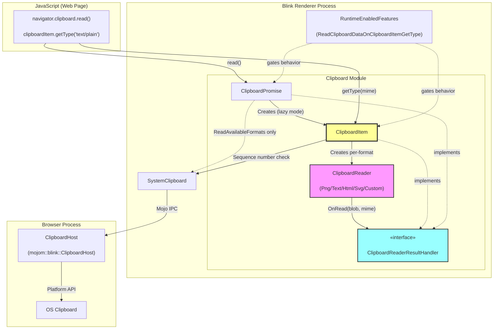
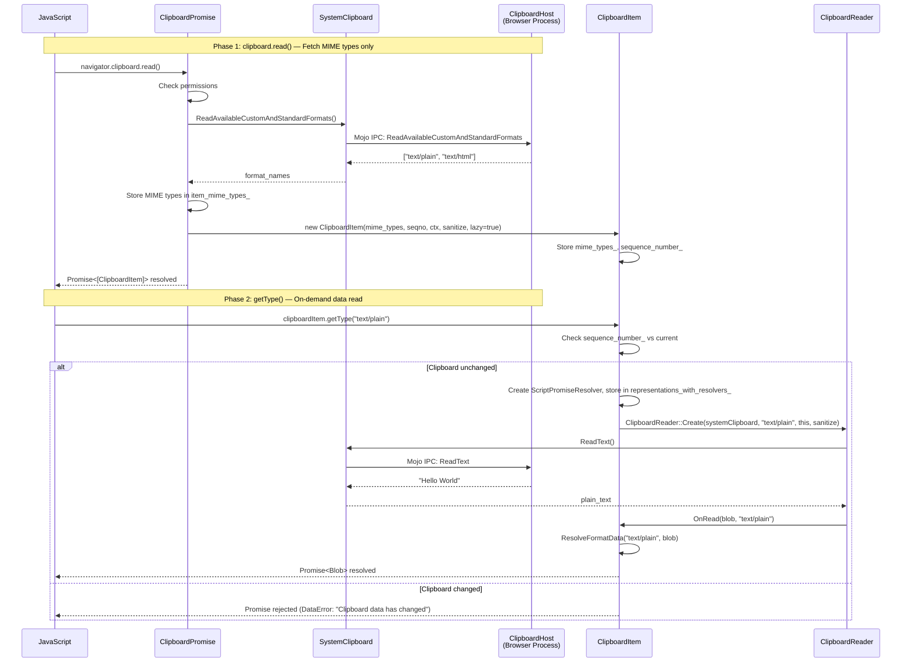
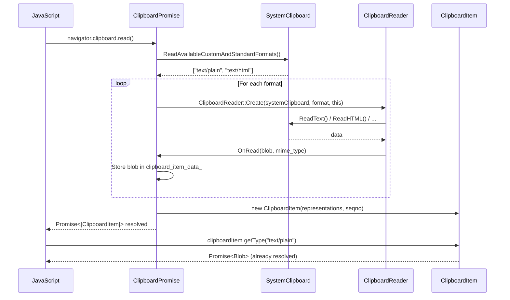

# High-Level Design: [Clipboard] Implement on-demand reading in getType()

**CL:** [6978530](https://chromium-review.googlesource.com/c/chromium/src/+/6978530)
**Author:** Shweta Bindal (shwetabindal@microsoft.com)
**Status:** NEW (Patch Set 19)
**Bug:** [435051711](https://crbug.com/435051711)
**Feature Flag:** `ReadClipboardDataOnClipboardItemGetType` (status: `"test"`)

---

## 1. Executive Summary

This CL implements **lazy (on-demand) clipboard data reading** in the Async Clipboard API. Previously, `navigator.clipboard.read()` fetched **all** clipboard data upfront — including raw payloads for every format (text, HTML, PNG, SVG, custom formats). This CL defers the actual OS-level data reading to the point when `ClipboardItem.getType(mimeType)` is called by JavaScript. During `clipboard.read()`, only the list of available MIME types is fetched (via `ReadAvailableCustomAndStandardFormats`). This significantly improves performance when a web page only needs a subset of available clipboard formats. The CL also introduces **clipboard change detection**: if the clipboard contents change between `read()` and a subsequent `getType()` call, the promise is rejected with a `DataError`, ensuring data integrity. The feature is gated behind the `ReadClipboardDataOnClipboardItemGetType` runtime-enabled feature flag, currently set to `"test"` status, ensuring no behavioral change for production users until the flag is promoted.

---

## 2. Architecture Overview

### Affected Components/Modules

| Component | Layer | Impact |
|---|---|---|
| `ClipboardItem` | Blink Modules (Renderer) | **Major** — New lazy-read constructor, `getType()` now triggers OS reads, implements `ClipboardReaderResultHandler` and `ExecutionContextLifecycleObserver` |
| `ClipboardPromise` | Blink Modules (Renderer) | **Moderate** — Modified to skip data reading in `read()` when lazy-read enabled; now implements `ClipboardReaderResultHandler` |
| `ClipboardReader` | Blink Modules (Renderer) | **Moderate** — Refactored from `ClipboardPromise`-specific to generic `ClipboardReaderResultHandler` interface |
| `MockClipboardHost` | Content Test / Blink Test | **Minor** — Added call tracking for test verification |
| `TestRunner` | Content Web Test | **Minor** — Exposes clipboard read tracking to JavaScript tests |
| `web_test.mojom` | Content Web Test IPC | **Minor** — New IPC methods for test infrastructure |
| Runtime Enabled Features | Blink Platform | **Minor** — New feature flag added |

### Component Diagram

### How it Fits into Existing Architecture

The Async Clipboard API in Chromium follows a layered architecture:

1. **JavaScript API** (`Clipboard` IDL) → calls into `ClipboardPromise`
2. **`ClipboardPromise`** orchestrates permission checks, format enumeration, and data reading
3. **`ClipboardReader`** subclasses handle format-specific reading (PNG decoding, HTML sanitization, etc.)
4. **`SystemClipboard`** provides Mojo-based access to `ClipboardHost` in the browser process
5. **`ClipboardHost`** (browser process) interfaces with the OS clipboard

This CL inserts a new responsibility into `ClipboardItem`: it can now directly initiate `ClipboardReader` operations, bypassing `ClipboardPromise` for the data-fetching step. The new `ClipboardReaderResultHandler` interface decouples `ClipboardReader` from `ClipboardPromise`, allowing either `ClipboardPromise` (eager path) or `ClipboardItem` (lazy path) to receive read results.

---

## 3. Design Goals & Non-Goals

### Goals

| # | Goal | Description |
|---|---|---|
| G1 | **Deferred data reading** | `clipboard.read()` should only fetch available MIME types; actual data is read on `getType()` |
| G2 | **Clipboard change detection** | If clipboard content changes between `read()` and `getType()`, reject with `DataError` |
| G3 | **Backward compatibility** | Existing behavior is fully preserved when the feature flag is disabled |
| G4 | **ExecutionContext lifecycle safety** | Pending `getType()` promises are properly rejected when the document is detached |
| G5 | **Promise deduplication** | Multiple `getType()` calls for the same MIME type on the same `ClipboardItem` return the same promise |
| G6 | **Test infrastructure** | Provide mock clipboard call tracking for verifying lazy-read behavior in tests |

### Non-Goals

| # | Non-Goal | Rationale |
|---|---|---|
| N1 | Changing the `clipboard.write()` path | Only the read path is affected |
| N2 | Modifying the W3C Clipboard API spec | This is an implementation optimization; the observable API behavior remains spec-compliant |
| N3 | Cross-origin clipboard isolation | Out of scope; handled by existing permission model |
| N4 | Caching previously read data across `read()` calls | Each `read()` creates a fresh `ClipboardItem` |
| N5 | Enabling the feature by default | The flag is set to `"test"` status; promotion to `"stable"` is a separate effort |

---

## 4. System Interactions

### Main Flow: Lazy Read Path

### Eager Read Path (Flag Disabled — Existing Behavior)

### IPC / Mojo Interactions

The CL does **not** introduce new Mojo interfaces between renderer and browser for the core clipboard functionality. The existing `mojom::blink::ClipboardHost` methods are reused:
- `ReadAvailableCustomAndStandardFormats()` — called during `read()`
- `ReadText()`, `ReadHtml()`, `ReadSvg()`, `ReadPng()`, `ReadUnsanitizedCustomFormat()` — now called during `getType()` instead of `read()`
- `GetSequenceNumber()` — used for clipboard change detection

New Mojo interfaces are added **only for test infrastructure** (`web_test.mojom`):
- `GetClipboardReadState()` — sync IPC to query which mock clipboard methods were called
- `ResetClipboardReadTracking()` — reset tracking counters

---

## 5. API & Interface Changes

### New Public Interfaces

| Interface | Location | Description |
|---|---|---|
| `ClipboardReaderResultHandler` | `/third_party/blink/renderer/modules/clipboard/clipboard_reader.h` | Abstract mixin (GarbageCollectedMixin) that receives read results from `ClipboardReader`. Methods: `OnRead(Blob*, String& mime_type)`, `GetExecutionContext()`, `GetLocalFrame()` |

### Modified Interfaces

| Interface | Change | Location |
|---|---|---|
| **`ClipboardItem`** | Now inherits from `ExecutionContextLifecycleObserver` and `ClipboardReaderResultHandler`. New constructor accepting `HeapVector<String>& mime_types` for lazy-read mode. `sequence_number_` changed from `absl::uint128` to `std::optional<absl::uint128>`. New methods: `OnRead()`, `ContextDestroyed()`, `GetLocalFrame()`, `GetSystemClipboard()`, `ResolveFormatData()`, `ReadRepresentationFromClipboardReader()`, `HasClipboardChangedSinceClipboardRead()` | `/third_party/blink/renderer/modules/clipboard/clipboard_item.h` |
| **`ClipboardPromise`** | Now implements `ClipboardReaderResultHandler`. `OnRead()` signature changed to include `mime_type` parameter. New member `item_mime_types_` for lazy path. New helper `GetSystemClipboard()`. | `/third_party/blink/renderer/modules/clipboard/clipboard_promise.h` |
| **`ClipboardReader`** | Constructor and `Create()` factory now accept `ClipboardReaderResultHandler*` instead of `ClipboardPromise*`. Member `promise_` renamed to `result_handler_`. | `/third_party/blink/renderer/modules/clipboard/clipboard_reader.h` |
| **`ClipboardReader::OnRead()`** | All subclass `OnRead()` callbacks now pass the MIME type string alongside the `Blob*`. | `/third_party/blink/renderer/modules/clipboard/clipboard_reader.cc` |
| **`MockClipboardHost`** (both content/ and blink/) | Added call tracking booleans and `ResetReadTracking()` method. | `content/test/mock_clipboard_host.h`, `third_party/blink/renderer/core/testing/mock_clipboard_host.h` |

### Deprecated Interfaces

None. The eager-read path is preserved and will continue to work when the feature flag is disabled. The `ClipboardPromise` still implements `ClipboardReaderResultHandler` (with a TODO to remove it once lazy read is stable — see `crbug.com/487128731`).

---

## 6. Dependencies

### What This Code Depends On

| Dependency | Type | Notes |
|---|---|---|
| `SystemClipboard` | Blink Core | Used by both `ClipboardItem` (new) and `ClipboardPromise` (existing) to access clipboard via Mojo |
| `mojom::blink::ClipboardHost` | Mojo Interface | Browser-process clipboard service — no changes to the interface itself |
| `RuntimeEnabledFeatures` | Blink Platform | New flag `ReadClipboardDataOnClipboardItemGetType` gates the behavior |
| `ExecutionContextLifecycleObserver` | Blink Core | `ClipboardItem` now observes context lifecycle to handle document detachment |
| `GarbageCollectedMixin` | Blink Platform | `ClipboardReaderResultHandler` is a GC mixin |
| `absl::uint128` | Abseil | Clipboard sequence number type (unchanged) |

### What Depends On This Code

| Dependent | Impact |
|---|---|
| Web pages using `navigator.clipboard.read()` + `getType()` | Behavioral change when flag is enabled: data fetched lazily |
| `ClipboardReader` subclasses (Png, Text, Html, Svg, Custom) | Refactored to use `ClipboardReaderResultHandler` — compile-time breaking if any external subclass existed (none do) |
| Clipboard WPTs (`clipboard-apis/`) | Existing WPTs passed on Patch Set 13/15; new layout tests added |
| Telemetry counters (`WebFeature::kClipboardChangedBetweenReadAndGetType`, etc.) | Telemetry capture adjusted for the `std::optional` sequence number change |

### Version/Compatibility Considerations

- The feature is gated behind a runtime flag (`"test"` status), so it will **not** affect stable Chrome builds
- The `ClipboardReader` API change (accepting `ClipboardReaderResultHandler*` instead of `ClipboardPromise*`) is an internal refactor; no external consumers exist
- The `sequence_number_` type change from `absl::uint128` to `std::optional<absl::uint128>` is source-compatible with existing telemetry code (updated in this CL)

---

## 7. Risks & Mitigations

### Risk Assessment

| # | Risk | Severity | Likelihood | Mitigation |
|---|---|---|---|---|
| R1 | **Clipboard race condition**: Clipboard changes between `read()` and `getType()` lead to stale or inconsistent data | High | Medium | Sequence number check in `HasClipboardChangedSinceClipboardRead()` rejects with `DataError`. Three dedicated web tests cover edge cases. |
| R2 | **Promise leaks on document detachment**: Pending `getType()` promises not resolved/rejected when the page navigates away | High | Medium | `ClipboardItem` implements `ExecutionContextLifecycleObserver::ContextDestroyed()` to reject all pending resolvers. |
| R3 | **Multiple `getType()` calls for same type**: Could create duplicate readers/resolvers | Medium | Medium | Promise deduplication via `representations_with_resolvers_` map — returns cached promise on second call. |
| R4 | **Regression in eager-read path**: Refactoring `ClipboardReader` to use `ClipboardReaderResultHandler` could break the existing eager path | High | Low | The `ClipboardPromise` implements `ClipboardReaderResultHandler`, preserving full compatibility. Existing tests cover the eager path. Feature flag ensures eager path remains default. |
| R5 | **`SystemClipboard` null pointer**: `GetSystemClipboard()` returns null if frame is detached | Medium | Low | Null checks in `ReadRepresentationFromClipboardReader()` and `HasClipboardChangedSinceClipboardRead()` — resolves with `nullptr` blob (which rejects the promise with `DataError`). |
| R6 | **Test infrastructure leaking into production**: `MockClipboardHost` tracking booleans | Low | Very Low | Tracking fields are only in test mock classes (`content/test/` and `core/testing/`), not in production `ClipboardHost`. |
| R7 | **HTML sanitization mismatch in lazy path**: `sanitize_html_for_lazy_read_` must match the sanitization setting that would have been used in the eager path | Medium | Low | Value is derived from `will_read_unprocessed_html_` in `ClipboardPromise` and passed to `ClipboardItem` constructor. |

### Backward Compatibility

- **Full backward compatibility** when `ReadClipboardDataOnClipboardItemGetType` is disabled (default for stable)
- When enabled, observable behavior change: `getType()` now returns a promise that may reject with `DataError` if the clipboard changed — this is a **new error condition** web developers must handle
- The CL preserves the existing `ClipboardItemGetTypeCounterEnabled` telemetry feature interaction

---

## 8. Testing Strategy

### Test Coverage Matrix

| Test | Type | File | What It Verifies |
|---|---|---|---|
| `ClipboardTest.ReadOnlyMimeTypesInClipboardRead` | Unit test (C++) | `/third_party/blink/renderer/modules/clipboard/clipboard_unittest.cc` | `read()` only calls `ReadAvailableCustomAndStandardFormats`, not `ReadText`/`ReadHtml` |
| `ClipboardTest.ClipboardItemGetTypeTest` | Unit test (C++) | `/third_party/blink/renderer/modules/clipboard/clipboard_unittest.cc` | `getType("text/plain")` triggers `ReadText`, returns correct blob size |
| `async-clipboard-lazy-read.html` | Web test (Layout) | `/third_party/blink/web_tests/clipboard/async-clipboard/async-clipboard-lazy-read.html` | Clipboard change detection throws `DataError` |
| `async-clipboard-lazy-read-change-detection-edge-cases.html` | Web test (Layout) | `/third_party/blink/web_tests/clipboard/async-clipboard/async-clipboard-lazy-read-change-detection-edge-cases.html` | Edge cases: identical data rewrite, format removal, previously-successful getType after change |
| `async-clipboard-lazy-read-deferred-os-call.html` | Web test (Layout) | `/third_party/blink/web_tests/clipboard/async-clipboard/async-clipboard-lazy-read-deferred-os-call.html` | Verifies OS-level read calls are deferred from `read()` to `getType()` for both standard and custom formats |
| Existing clipboard WPTs | WPT | `external/wpt/clipboard-apis/` | Regression protection — verifies no breakage in existing clipboard behavior |

### Test Infrastructure Changes

- **`MockClipboardHost`** (both `content/test/` and `blink/core/testing/`): Added read-call tracking (`read_text_called_`, `read_html_called_`, `read_unsanitized_custom_format_called_`, `read_available_custom_and_standard_formats_called_`) with `ResetReadTracking()`.
- **`web_test.mojom`**: New sync IPC `GetClipboardReadState()` and `ResetClipboardReadTracking()` for web test `testRunner` access.
- **`test_runner.cc`**: Exposes `testRunner.getClipboardReadState()` and `testRunner.resetClipboardReadTracking()` to JavaScript in web test mode.

### Coverage Gaps / Recommendations

| Area | Current Coverage | Recommendation |
|---|---|---|
| PNG/SVG/Image lazy read | Not explicitly tested | Add web tests for `getType("image/png")` and `getType("image/svg+xml")` in lazy mode |
| Multiple `getType()` deduplication | Not explicitly tested | Add unit test verifying same promise is returned for duplicate `getType()` calls |
| `ContextDestroyed()` path | Not explicitly tested | Add unit test verifying pending lazy-read promises are rejected on navigation |
| Interaction with `ClipboardItemGetTypeCounterEnabled` telemetry | Implicitly covered | Consider adding explicit telemetry verification |
| Concurrent `getType()` for different formats | Not explicitly tested | Add test calling `getType("text/plain")` and `getType("text/html")` concurrently |

---

## Appendix: Key File References

| File | Lines Changed | Role |
|---|---|---|
| `/third_party/blink/renderer/modules/clipboard/clipboard_item.cc` | +184/-15 | Core lazy-read logic in `ClipboardItem` |
| `/third_party/blink/renderer/modules/clipboard/clipboard_item.h` | +45/-5 | New members, interfaces, constructor |
| `/third_party/blink/renderer/modules/clipboard/clipboard_promise.cc` | +71/-33 | Modified read flow to skip data fetching |
| `/third_party/blink/renderer/modules/clipboard/clipboard_promise.h` | +17/-5 | Implements `ClipboardReaderResultHandler` |
| `/third_party/blink/renderer/modules/clipboard/clipboard_reader.cc` | +52/-42 | Refactored to use `ClipboardReaderResultHandler` |
| `/third_party/blink/renderer/modules/clipboard/clipboard_reader.h` | +21/-12 | New `ClipboardReaderResultHandler` interface |
| `/third_party/blink/renderer/modules/clipboard/clipboard_unittest.cc` | +167/-9 | New unit tests for lazy read |
| `/third_party/blink/renderer/platform/runtime_enabled_features.json5` | +6/-0 | Feature flag definition |
| `/content/web_test/common/web_test.mojom` | +11/-0 | Test IPC for clipboard tracking |
| `/content/web_test/renderer/test_runner.cc` | +39/-0 | Test runner JS bindings |
