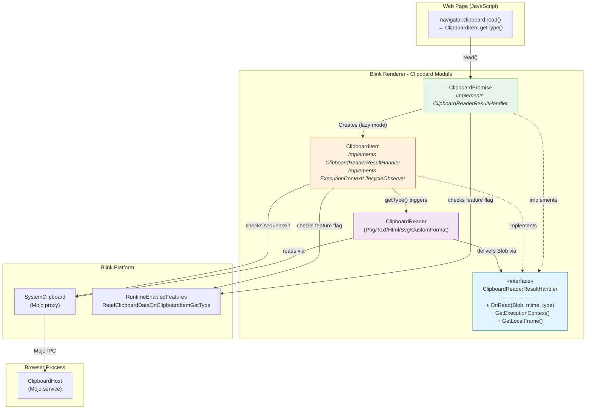
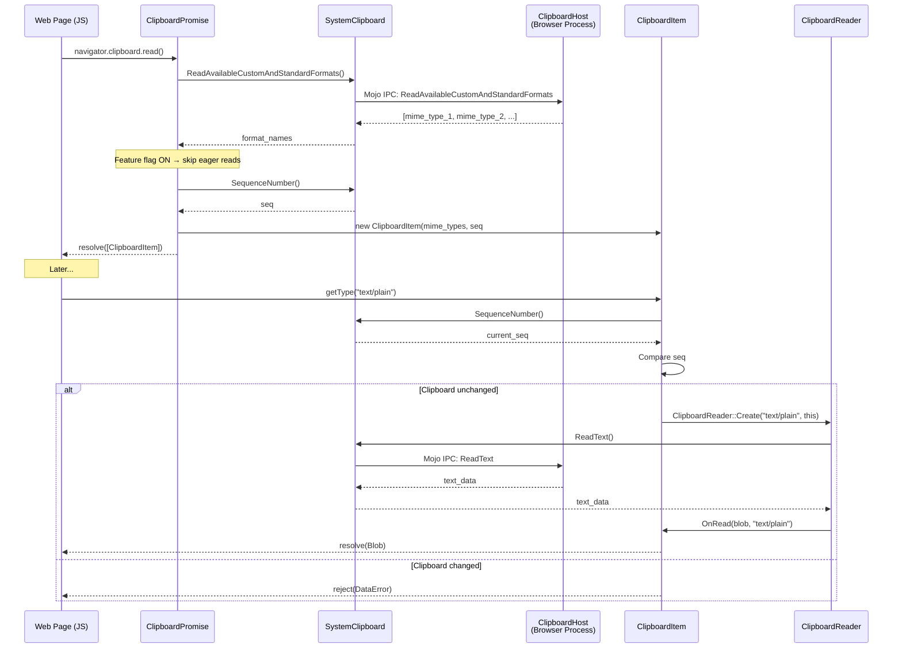
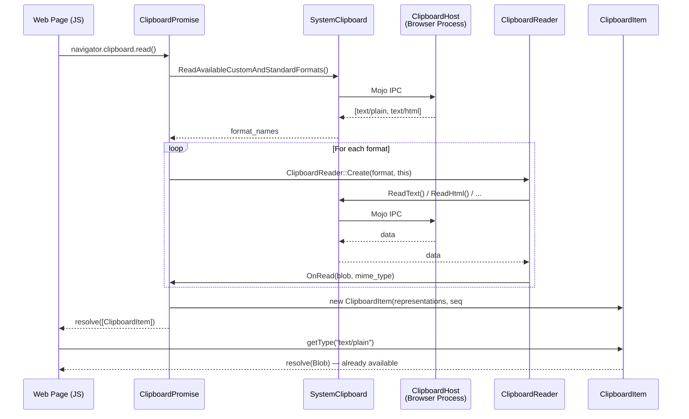

# High-Level Design: [Clipboard] Implement on-demand reading in getType()

**CL:** [6978530](https://chromium-review.googlesource.com/c/chromium/src/+/6978530)
**Author:** Shweta Bindal (shwetabindal@microsoft.com)
**Status:** NEW (in review)
**Bug:** [435051711](https://crbug.com/435051711)
**Total Change:** 20 files, +929/−121 lines

---

## 1. Executive Summary

This CL implements **lazy (on-demand) clipboard data reading** in the Async Clipboard API. Previously, `navigator.clipboard.read()` eagerly fetched **all** clipboard data (text, HTML, images, custom formats) upfront from the OS clipboard, regardless of whether the web application actually needed all of it. This CL defers the actual OS-level data reads to when `ClipboardItem.getType(mimeType)` is called, so only the specific format(s) the page requests are read from the system clipboard. This improves performance for pages that only consume a subset of available clipboard formats (e.g., pasting only text when text+HTML+image are all available). The change also introduces **clipboard change detection** that rejects with `DataError` if the clipboard content changes between the initial `read()` and a subsequent `getType()` call, ensuring data integrity. The feature is gated behind the `ReadClipboardDataOnClipboardItemGetType` runtime feature flag (currently at `"test"` status).

---

## 2. Architecture Overview

### 2.1 Affected Components/Modules

| Component | Layer | Impact |
|-----------|-------|--------|
| `ClipboardItem` | Blink Modules (renderer) | **Major** — New lazy-read constructor, deferred data fetching, lifecycle observation |
| `ClipboardPromise` | Blink Modules (renderer) | **Moderate** — Modified to skip eager reading when feature enabled |
| `ClipboardReader` | Blink Modules (renderer) | **Moderate** — Decoupled from `ClipboardPromise` via new interface |
| `ClipboardReaderResultHandler` | Blink Modules (renderer) | **New** — Abstract interface for receiving read results |
| `SystemClipboard` | Blink Platform (renderer) | Read-only dependency — sequence number checks |
| `MockClipboardHost` (content + blink testing) | Test infrastructure | **Moderate** — Call tracking for verifying lazy reads |
| `WebTestControlHost` / `TestRunner` | Web test infrastructure | **Moderate** — New Mojo IPC + JS bindings for test introspection |
| `runtime_enabled_features.json5` | Blink Platform | **Minor** — New feature flag |

### 2.2 Component Diagram



### 2.3 How This Fits Into the Existing Architecture

The Async Clipboard API in Blink follows this existing flow:
1. **`ClipboardPromise`** orchestrates the read/write operation, handling permissions and Mojo calls.
2. **`ClipboardReader`** subclasses handle format-specific reading (PNG, text, HTML, SVG, custom).
3. **`ClipboardItem`** is the web-exposed wrapper returned to JavaScript.

**Before this CL:** `ClipboardPromise` eagerly invoked `ClipboardReader` for *every* available format during `read()`, populated `ClipboardItem` with resolved Blobs, then returned it.

**After this CL:** `ClipboardPromise` only queries available format *names* during `read()`, then constructs a "lazy" `ClipboardItem` holding just MIME type strings. When JavaScript calls `getType(type)`, `ClipboardItem` itself creates a `ClipboardReader` and reads that single format on demand.

---

## 3. Design Goals & Non-Goals

### Goals
- **Defer OS clipboard reads** to `getType()` — only read formats actually requested by the page
- **Improve performance** when pages only need a subset of clipboard formats
- **Maintain data integrity** via clipboard change detection (sequence number comparison)
- **Backward compatibility** — behind a runtime feature flag; non-lazy path fully preserved
- **Proper lifecycle management** — reject pending promises when the execution context is destroyed

### Non-Goals
- **Changing the `clipboard.write()` path** — write operations are not affected
- **Changing the `readText()` path** — `readText()` is a simpler API and remains eager
- **Spec changes** — this is an implementation optimization; the web-visible behavior should match the spec (with the addition of `DataError` for stale reads)
- **Cross-origin clipboard interactions** — not addressed in this CL
- **Caching across multiple `read()` calls** — each `read()` creates fresh `ClipboardItem`s

---

## 4. System Interactions

### 4.1 Sequence Diagram — Lazy Read Flow (Feature Enabled)



### 4.2 Sequence Diagram — Eager Read Flow (Feature Disabled / Legacy)



### 4.3 IPC / Mojo Interactions

| Mojo Interface | Method | Direction | Purpose |
|----------------|--------|-----------|---------|
| `ClipboardHost` | `ReadAvailableCustomAndStandardFormats` | Renderer → Browser | Get available MIME types (both paths) |
| `ClipboardHost` | `GetSequenceNumber` | Renderer → Browser | Change detection for lazy reads |
| `ClipboardHost` | `ReadText` / `ReadHtml` / `ReadSvg` / `ReadPng` / `ReadUnsanitizedCustomFormat` | Renderer → Browser | Deferred to `getType()` in lazy mode |
| `WebTestControlHost` (new) | `GetClipboardReadState` | Renderer → Browser | **Test-only**: Introspect which read methods were called |
| `WebTestControlHost` (new) | `ResetClipboardReadTracking` | Renderer → Browser | **Test-only**: Reset call tracking |

---

## 5. API & Interface Changes

### 5.1 New Public Interfaces

#### `ClipboardReaderResultHandler` (new abstract interface)
**File:** `/workspace/cr1/src/third_party/blink/renderer/modules/clipboard/clipboard_reader.h`

```cpp
class ClipboardReaderResultHandler : public GarbageCollectedMixin {
 public:
  virtual void OnRead(Blob* blob, const String& mime_type) = 0;
  virtual ExecutionContext* GetExecutionContext() const = 0;
  virtual LocalFrame* GetLocalFrame() const = 0;
};
```

This interface decouples `ClipboardReader` from `ClipboardPromise`, allowing both `ClipboardPromise` (eager path) and `ClipboardItem` (lazy path) to receive read results.

#### New `ClipboardItem` constructor (lazy-read mode)
**File:** `/workspace/cr1/src/third_party/blink/renderer/modules/clipboard/clipboard_item.h`

```cpp
explicit ClipboardItem(const HeapVector<String>& mime_types,
                       std::optional<absl::uint128> sequence_number,
                       ExecutionContext* execution_context,
                       bool sanitize_html_for_lazy_read,
                       bool is_lazy_read);
```

#### New Runtime Feature Flag
**File:** `/workspace/cr1/src/third_party/blink/renderer/platform/runtime_enabled_features.json5`

```json
{
  "name": "ReadClipboardDataOnClipboardItemGetType",
  "status": "test"
}
```

### 5.2 Modified Interfaces

| Interface | Change | File |
|-----------|--------|------|
| `ClipboardReader::Create()` | Parameter changed from `ClipboardPromise*` to `ClipboardReaderResultHandler*` | `clipboard_reader.h` |
| `ClipboardReader` constructor | Same parameter change | `clipboard_reader.h` |
| `ClipboardReader::promise_` member | Renamed to `result_handler_` | `clipboard_reader.h` |
| `ClipboardPromise::OnRead()` | Signature changed: added `const String& mime_type` parameter | `clipboard_promise.h` |
| `ClipboardItem` existing constructor | `sequence_number` changed from `absl::uint128` to `std::optional<absl::uint128>` | `clipboard_item.h` |
| `ClipboardItem` | Now inherits from `ExecutionContextLifecycleObserver` and `ClipboardReaderResultHandler` | `clipboard_item.h` |
| `ClipboardPromise` | Now inherits from `ClipboardReaderResultHandler` | `clipboard_promise.h` |

### 5.3 New Test Infrastructure APIs

| API | Scope | Description |
|-----|-------|-------------|
| `testRunner.getClipboardReadState()` | Web tests (JS) | Returns object with booleans indicating which mock clipboard read methods were called |
| `testRunner.resetClipboardReadTracking()` | Web tests (JS) | Resets call tracking state |
| `WebTestControlHost::GetClipboardReadState()` | Mojo (browser→renderer) | Sync IPC to query mock clipboard call state |
| `WebTestControlHost::ResetClipboardReadTracking()` | Mojo (browser→renderer) | Reset tracking state |

### 5.4 Deprecated Interfaces

None. The old eager-read path is fully preserved and used when the feature flag is disabled.

---

## 6. Dependencies

### 6.1 What This Code Depends On

| Dependency | Purpose |
|------------|---------|
| `SystemClipboard` | OS clipboard access via Mojo, sequence number queries |
| `ClipboardHost` Mojo interface | Browser-process clipboard operations |
| `ExecutionContextLifecycleObserver` | Detect document destruction to reject pending promises |
| `RuntimeEnabledFeatures` | Feature flag gating (`ReadClipboardDataOnClipboardItemGetType`) |
| `ScriptPromiseResolver<Blob>` | Deferred promise resolution for lazy reads |
| `ClipboardReader` subclasses | Format-specific reading logic (PNG, text, HTML, SVG, custom) |

### 6.2 What Depends on This Code

| Dependent | Impact |
|-----------|--------|
| `ClipboardItem` JavaScript API | Behavioral change when feature enabled — `getType()` now triggers reads |
| Web Platform Tests (clipboard-apis) | May need baseline updates (CL history shows some WPT failures were addressed) |
| `ClipboardReader` subclasses | All subclasses updated to use `ClipboardReaderResultHandler` instead of `ClipboardPromise` |
| Mock clipboard test infrastructure | Both `content/test` and `blink/core/testing` mocks updated |

### 6.3 Version/Compatibility Considerations

- The feature flag is at `"test"` status, meaning it's enabled only in testing environments — no user-facing impact until promoted to `"experimental"` or `"stable"`.
- The `std::optional<absl::uint128>` change for `sequence_number_` is backward-compatible (old callers pass a value, new lazy callers may pass `std::nullopt`).

---

## 7. Risks & Mitigations

### 7.1 Potential Issues

| Risk | Severity | Mitigation |
|------|----------|------------|
| **Clipboard data staleness** | High | Sequence number comparison before every `getType()` call; rejects with `DataError` if clipboard changed |
| **Race conditions** between multiple `getType()` calls | Medium | Promise caching in `representations_with_resolvers_` — duplicate `getType()` calls for same type share the same promise |
| **Document detachment** while `getType()` pending | Medium | `ExecutionContextLifecycleObserver::ContextDestroyed()` rejects all pending promises with `NotAllowedError` |
| **`SystemClipboard` null pointer** | Medium | Null checks in `GetSystemClipboard()`, `GetLocalFrame()`, and `HasClipboardChangedSinceClipboardRead()` — returns conservative results |
| **Performance regression** on the lazy path | Low | Each `getType()` call now triggers a full Mojo IPC round-trip + sequence number check; this is the intended trade-off (fewer total reads overall) |
| **Breaking existing WPTs** | Medium | History shows some WPT failures (clipboard-item.https.html, async-navigator-clipboard-write-domstring.https.html) were encountered and addressed in subsequent patch sets |
| **Feature flag interaction** | Low | All new code paths guarded by `RuntimeEnabledFeatures::ReadClipboardDataOnClipboardItemGetTypeEnabled()` checks; old path fully preserved |

### 7.2 Backward Compatibility

- **Fully backward compatible** when feature flag is off (default for production).
- When flag is on, web-observable behavior changes:
  - `getType()` may now throw `DataError` if clipboard changed after `read()` (new behavior, not previously possible since data was pre-fetched).
  - `getType()` calls are now asynchronously backed by real clipboard reads, so timing characteristics change.
- The `ClipboardReader` API change from `ClipboardPromise*` to `ClipboardReaderResultHandler*` is internal and not web-exposed.

### 7.3 Migration Strategy

1. **Current state:** Feature flag at `"test"` — only active in test builds.
2. **Next step:** Promote to `"experimental"` behind `chrome://flags` for developer testing.
3. **Then:** Promote to `"stable"` for general availability once web compat is confirmed.
4. **Cleanup (tracked as TODO):** Once stable, remove the `ClipboardReaderResultHandler` implementation from `ClipboardPromise` (see `crbug.com/487128731` referenced in code).

---

## 8. Testing Strategy

### 8.1 Unit Tests

**File:** `/workspace/cr1/src/third_party/blink/renderer/modules/clipboard/clipboard_unittest.cc` (+167 lines)

| Test | Purpose |
|------|---------|
| `ReadOnlyMimeTypesInClipboardRead` | Verifies that `ClipboardPromise::CreateForRead()` only calls `ReadAvailableCustomAndStandardFormats` and does **not** call `ReadText` or `ReadHtml` — proving lazy loading works |
| `ClipboardItemGetTypeTest` | Verifies the full lazy-read pipeline: `read()` → `getType("text/plain")` → Blob returned with correct content; confirms `ReadText` is called only after `getType()` |

### 8.2 Web Tests (Layout Tests)

| Test File | Coverage |
|-----------|----------|
| `async-clipboard-lazy-read.html` | Basic clipboard change detection: `getType()` throws `DataError` when clipboard changes between `read()` and `getType()` |
| `async-clipboard-lazy-read-change-detection-edge-cases.html` | Edge cases: rewriting identical data, removing a format, previously-successful `getType()` after clipboard change |
| `async-clipboard-lazy-read-deferred-os-call.html` | Uses `testRunner.getClipboardReadState()` to verify OS calls are deferred: `ReadText` not called during `read()`, only during `getType()`. Tests both plain text and custom formats. |

### 8.3 Test Infrastructure Changes

- **`MockClipboardHost`** (both `content/test/` and `blink/core/testing/`): Added call-tracking booleans (`read_text_called_`, `read_html_called_`, etc.) to verify which clipboard read methods were invoked.
- **`WebTestControlHost`** + **`web_test.mojom`**: New Mojo methods `GetClipboardReadState()` (sync) and `ResetClipboardReadTracking()` for web test introspection.
- **`TestRunner`** (renderer): New JS bindings `testRunner.getClipboardReadState()` and `testRunner.resetClipboardReadTracking()`.

### 8.4 Required Additional Test Coverage (Recommendations)

- **Multiple `getType()` calls** for different MIME types on the same `ClipboardItem` — verify each triggers independent reads
- **Concurrent `getType()` calls** for the same MIME type — verify promise deduplication
- **Image (PNG) lazy reading** — currently only text/plain and custom formats are tested in web tests
- **HTML sanitization** in lazy mode — verify `sanitize_html_for_lazy_read_` flag is respected
- **Document detachment** while `getType()` is pending — verify `ContextDestroyed()` properly rejects
- **Memory/GC** — verify no leaks with the new `HeapHashMap<String, Member<ScriptPromiseResolver<Blob>>>` and lifecycle observer

---

## Appendix: Key File References

| File | Role |
|------|------|
| `/workspace/cr1/src/third_party/blink/renderer/modules/clipboard/clipboard_item.cc` | Core lazy-read logic |
| `/workspace/cr1/src/third_party/blink/renderer/modules/clipboard/clipboard_item.h` | New class hierarchy (+ `ClipboardReaderResultHandler`, `ExecutionContextLifecycleObserver`) |
| `/workspace/cr1/src/third_party/blink/renderer/modules/clipboard/clipboard_promise.cc` | Modified to skip eager reads when feature enabled |
| `/workspace/cr1/src/third_party/blink/renderer/modules/clipboard/clipboard_promise.h` | Now implements `ClipboardReaderResultHandler` |
| `/workspace/cr1/src/third_party/blink/renderer/modules/clipboard/clipboard_reader.cc` | Decoupled from `ClipboardPromise` |
| `/workspace/cr1/src/third_party/blink/renderer/modules/clipboard/clipboard_reader.h` | New `ClipboardReaderResultHandler` interface defined here |
| `/workspace/cr1/src/third_party/blink/renderer/platform/runtime_enabled_features.json5` | Feature flag definition |
| `/workspace/cr1/src/third_party/blink/renderer/modules/clipboard/clipboard_unittest.cc` | Unit tests for lazy read behavior |
| `/workspace/cr1/src/third_party/blink/web_tests/clipboard/async-clipboard/async-clipboard-lazy-read*.html` | Web tests |
