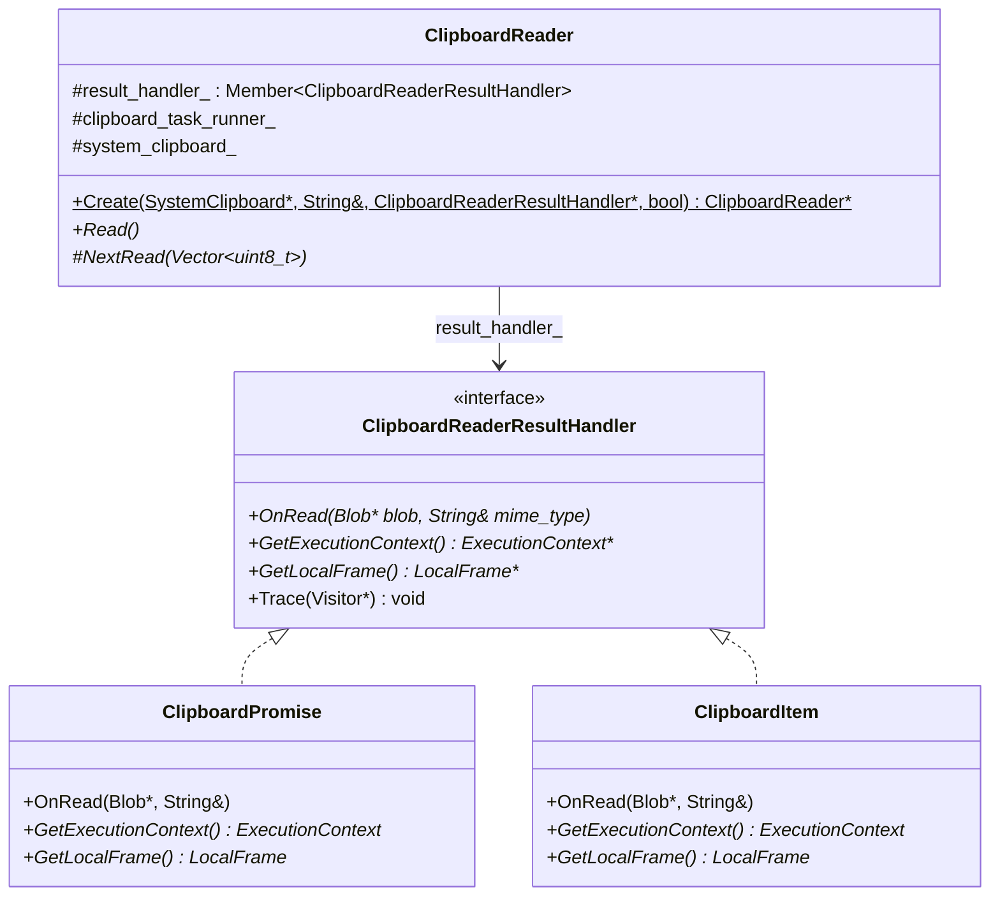
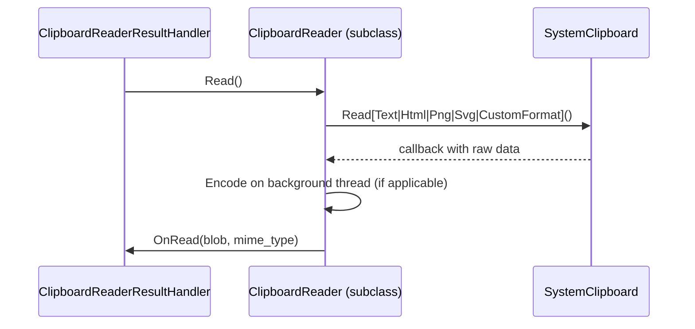
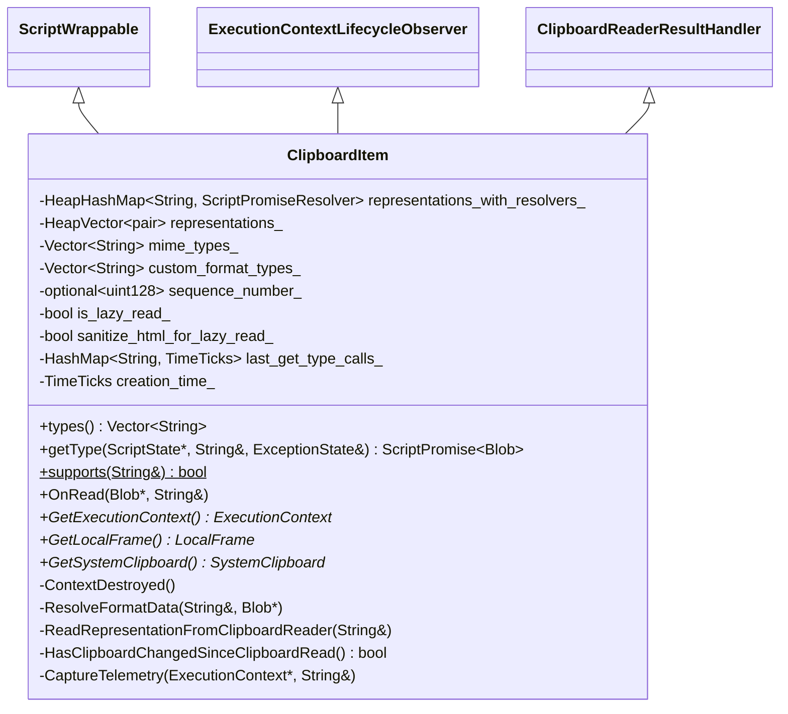
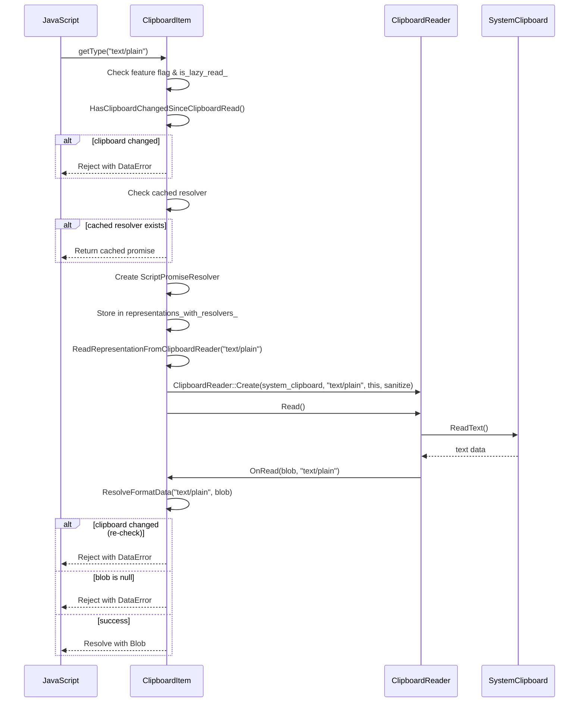
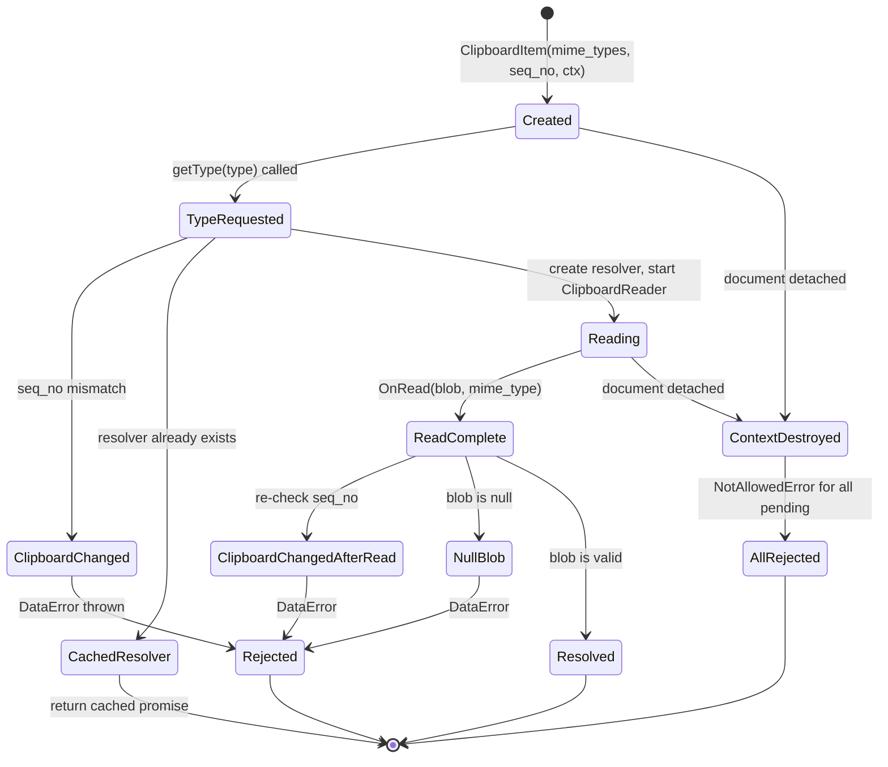
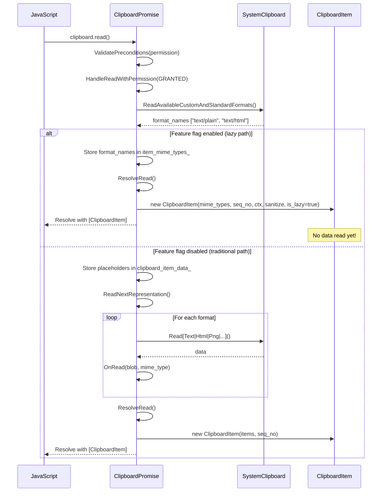
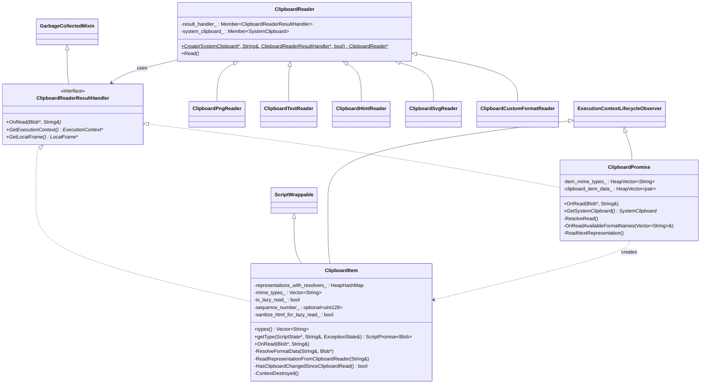
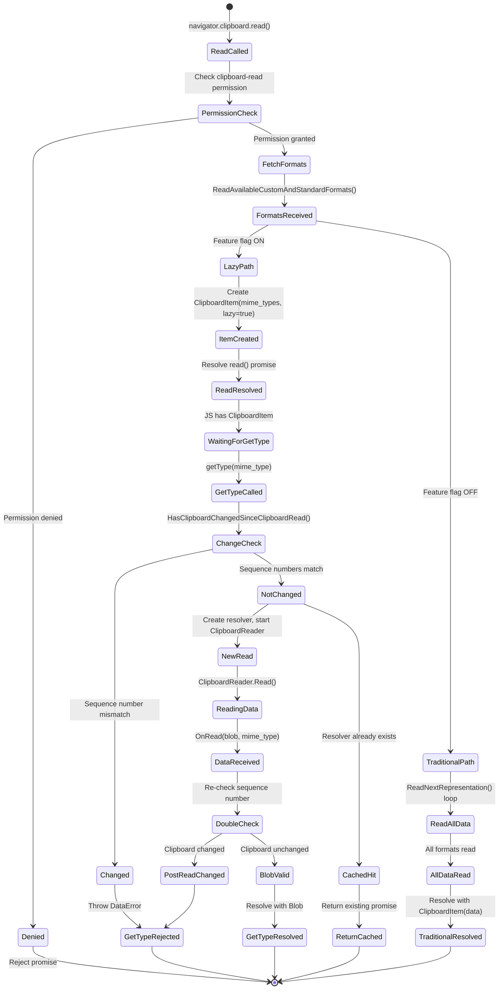

# Low-Level Design Document: CL 6978530

## [Clipboard] Implement on-demand reading in getType()

**CL URL:** https://chromium-review.googlesource.com/c/chromium/src/+/6978530
**Owner:** Shweta Bindal <shwetabindal@microsoft.com>
**Total:** 20 files, +929/−121 lines

---

## 1. File-by-File Analysis

---

### 1.1 `third_party/blink/renderer/modules/clipboard/clipboard_reader.h`

**Purpose of changes:** Introduce `ClipboardReaderResultHandler` interface to decouple `ClipboardReader` from `ClipboardPromise`, allowing both `ClipboardPromise` and `ClipboardItem` to receive read results.

**Key modifications:**
- Added new `ClipboardReaderResultHandler` abstract interface (inherits `GarbageCollectedMixin`)
- Replaced `ClipboardPromise*` parameter with `ClipboardReaderResultHandler*` in `ClipboardReader::Create()` and constructor
- Renamed member `promise_` → `result_handler_`
- Updated class-level documentation to reflect the new abstraction
- Added forward declarations for `ExecutionContext` and `LocalFrame`

**New/Modified Classes and Interfaces:**

| Class/Interface | Type | Purpose |
|----------------|------|---------|
| `ClipboardReaderResultHandler` | New abstract interface | Decouples reader from promise; provides `OnRead()`, `GetExecutionContext()`, `GetLocalFrame()` |

**New/Modified Functions:**

| Function | Purpose | Parameters | Returns |
|----------|---------|------------|---------|
| `ClipboardReaderResultHandler::OnRead` | Receives blob result from clipboard reader | `Blob* blob, const String& mime_type` | `void` |
| `ClipboardReaderResultHandler::GetExecutionContext` | Provides execution context to readers | none | `ExecutionContext*` |
| `ClipboardReaderResultHandler::GetLocalFrame` | Provides local frame to readers | none | `LocalFrame*` |
| `ClipboardReader::Create` (modified) | Factory now accepts `ClipboardReaderResultHandler*` | `SystemClipboard*, String& mime_type, ClipboardReaderResultHandler*, bool sanitize_html` | `ClipboardReader*` |

**Data Flow:**

---

### 1.2 `third_party/blink/renderer/modules/clipboard/clipboard_reader.cc`

**Purpose of changes:** Update all `ClipboardReader` subclasses to use `ClipboardReaderResultHandler*` instead of `ClipboardPromise*`, and pass MIME type to `OnRead()`.

**Key modifications:**
- All five concrete reader classes (`ClipboardPngReader`, `ClipboardTextReader`, `ClipboardHtmlReader`, `ClipboardSvgReader`, `ClipboardCustomFormatReader`) updated:
  - Constructor parameter changed from `ClipboardPromise*` to `ClipboardReaderResultHandler*`
  - `promise_->OnRead(blob)` → `result_handler_->OnRead(blob, <mime_type>)`
  - `promise_->GetExecutionContext()` → `result_handler_->GetExecutionContext()` (with null checks added)
  - `promise_->GetLocalFrame()` → `result_handler_->GetLocalFrame()`
- `ClipboardReader::Create()` factory updated to forward `ClipboardReaderResultHandler*`
- `ClipboardReader` constructor updated; `Trace()` now traces `result_handler_` instead of `promise_`
- Removed `#include "clipboard_promise.h"` and `runtime_enabled_features.h` (no longer directly needed)

**New/Modified Functions:**

| Function | Purpose | Parameters Changed | Returns |
|----------|---------|-------------------|---------|
| `ClipboardPngReader::OnRead` | Sends PNG blob to handler | now calls `result_handler_->OnRead(blob, ui::kMimeTypePng)` | void |
| `ClipboardTextReader::NextRead` | Sends text blob to handler | now calls `result_handler_->OnRead(blob, ui::kMimeTypePlainText)` | void |
| `ClipboardHtmlReader::Read` | Added null-check for execution context | safe `CountUse` via null check | void |
| `ClipboardHtmlReader::OnRead` | Uses `result_handler_->GetLocalFrame()` | — | void |
| `ClipboardHtmlReader::NextRead` | Sends HTML blob to handler | now calls `result_handler_->OnRead(blob, ui::kMimeTypeHtml)` | void |
| `ClipboardSvgReader::Read` | Added null-check for execution context | safe `CountUse` via null check | void |
| `ClipboardSvgReader::NextRead` | Sends SVG blob to handler | now calls `result_handler_->OnRead(blob, ui::kMimeTypeSvg)` | void |
| `ClipboardCustomFormatReader::Read` | Added null-check for execution context | safe `CountUse` via null check | void |
| `ClipboardCustomFormatReader::OnCustomFormatRead` | Sends custom format blob | now calls `result_handler_->OnRead(blob, mime_type_)` | void |

**Data Flow (per-reader):**

---

### 1.3 `third_party/blink/renderer/modules/clipboard/clipboard_item.h`

**Purpose of changes:** Extend `ClipboardItem` to support lazy-read mode, implementing both `ExecutionContextLifecycleObserver` and `ClipboardReaderResultHandler`.

**Key modifications:**
- New base classes: `ExecutionContextLifecycleObserver`, `ClipboardReaderResultHandler`
- Added `#include <optional>`, `execution_context_lifecycle_observer.h`, `clipboard_reader.h`, `heap_hash_map.h`
- New constructor for lazy-read mode: `ClipboardItem(HeapVector<String>& mime_types, optional<uint128> seq_no, ExecutionContext*, bool sanitize_html, bool is_lazy_read)`
- Existing constructor: `sequence_number_` changed from `absl::uint128` to `std::optional<absl::uint128>` (0 is a valid sequence number)
- New member fields: `representations_with_resolvers_`, `mime_types_`, `is_lazy_read_`, `sanitize_html_for_lazy_read_`
- New methods: `OnRead()`, `ContextDestroyed()`, `GetLocalFrame()`, `GetSystemClipboard()`, `ResolveFormatData()`, `ReadRepresentationFromClipboardReader()`, `HasClipboardChangedSinceClipboardRead()`
- Forward declaration of `ScriptPromiseResolver<IDLType>`

**New/Modified Data Structures:**

| Field | Type | Purpose |
|-------|------|---------|
| `representations_with_resolvers_` | `HeapHashMap<String, Member<ScriptPromiseResolver<Blob>>>` | Maps MIME type → promise resolver for lazy getType() calls |
| `mime_types_` | `Vector<String>` | MIME types available for lazy-read items |
| `sequence_number_` | `std::optional<absl::uint128>` | Changed from non-optional; distinguishes "unset" from valid 0 |
| `is_lazy_read_` | `bool` | Whether this ClipboardItem uses on-demand reading |
| `sanitize_html_for_lazy_read_` | `bool` | Whether HTML should be sanitized during lazy read |

**Class Diagram:**

---

### 1.4 `third_party/blink/renderer/modules/clipboard/clipboard_item.cc`

**Purpose of changes:** Core implementation of lazy-read behavior in `ClipboardItem`. The `getType()` method now triggers on-demand clipboard reads when the feature flag is enabled.

**Key modifications:**
- New lazy-read constructor: initializes `ExecutionContextLifecycleObserver`, stores MIME types, parses web custom formats, records sequence number
- `types()`: Branched to return `mime_types_` for lazy-read items vs `representations_` for traditional items
- `getType()`: Major refactor — two distinct code paths:
  1. **Non-lazy path** (feature disabled or `!is_lazy_read_`): Original behavior, looks up type in `representations_`
  2. **Lazy path**: Checks clipboard change, returns cached resolver if exists, creates new `ScriptPromiseResolver` and triggers `ReadRepresentationFromClipboardReader()`
- New `ResolveFormatData()`: Resolves/rejects the per-type promise after read completes
- New `ReadRepresentationFromClipboardReader()`: Creates `ClipboardReader` via factory, passing `this` as `ClipboardReaderResultHandler`
- New `HasClipboardChangedSinceClipboardRead()`: Compares stored sequence number with current system clipboard sequence number
- New `OnRead()`: Implements `ClipboardReaderResultHandler::OnRead()`, delegates to `ResolveFormatData()`
- New `ContextDestroyed()`: Rejects all pending promises with `NotAllowedError` on document detach
- New `GetLocalFrame()`, `GetSystemClipboard()`: Helper accessors
- Updated `CaptureTelemetry()`: sequence number comparison uses `std::optional` API
- Updated `Trace()`: Traces new members and base classes

**New/Modified Functions:**

| Function | Purpose | Parameters | Returns |
|----------|---------|------------|---------|
| `ClipboardItem(mime_types, seq_no, ctx, sanitize, lazy)` | Lazy-read constructor | `HeapVector<String>&, optional<uint128>, ExecutionContext*, bool, bool` | — |
| `types()` | Returns MIME types; branched for lazy vs traditional | none | `Vector<String>` |
| `getType()` | On-demand clipboard read or traditional lookup | `ScriptState*, String&, ExceptionState&` | `ScriptPromise<Blob>` |
| `ResolveFormatData()` | Resolves/rejects promise for a MIME type | `String& mime_type, Blob* blob` | `void` |
| `ReadRepresentationFromClipboardReader()` | Creates ClipboardReader and triggers read | `String& format` | `void` |
| `HasClipboardChangedSinceClipboardRead()` | Checks clipboard sequence number | none | `bool` |
| `OnRead()` | Receives blob from ClipboardReader | `Blob*, String& mime_type` | `void` |
| `ContextDestroyed()` | Rejects pending promises on context destruction | none | `void` |
| `GetLocalFrame()` | Gets LocalFrame from execution context | none | `LocalFrame*` |
| `GetSystemClipboard()` | Gets SystemClipboard from frame | none | `SystemClipboard*` |

**Data Flow — Lazy getType():**

**State Diagram — ClipboardItem Lazy Read Lifecycle:**

---

### 1.5 `third_party/blink/renderer/modules/clipboard/clipboard_promise.h`

**Purpose of changes:** Adapt `ClipboardPromise` to implement `ClipboardReaderResultHandler`, add `GetSystemClipboard()` helper, and store MIME types for lazy-read path.

**Key modifications:**
- Inherits from `ClipboardReaderResultHandler` (in addition to `ExecutionContextLifecycleObserver`)
- `OnRead()` signature changed: now takes `(Blob* blob, const String& mime_type)` and is `override`
- `GetLocalFrame()` is now `override` (virtual from `ClipboardReaderResultHandler`)
- Added `GetExecutionContext() override` forwarding to `ExecutionContextLifecycleObserver`
- Added `GetSystemClipboard() const` helper (null-safe)
- Added `HeapVector<String> item_mime_types_` member field
- Added TODO comment about removing `ClipboardReaderResultHandler` from `ClipboardPromise` once lazy read is stable

**New/Modified Functions:**

| Function | Purpose | Parameters | Returns |
|----------|---------|------------|---------|
| `OnRead()` (modified) | Now implements `ClipboardReaderResultHandler::OnRead` | `Blob*, const String& mime_type` | `void` |
| `GetLocalFrame()` (modified) | Now `override` from interface | none | `LocalFrame*` |
| `GetExecutionContext()` (new) | Forwarding override | none | `ExecutionContext*` |
| `GetSystemClipboard()` (new) | Null-safe system clipboard accessor | none | `SystemClipboard*` |

---

### 1.6 `third_party/blink/renderer/modules/clipboard/clipboard_promise.cc`

**Purpose of changes:** Implement the lazy-read path in `ClipboardPromise::ResolveRead()` and `OnReadAvailableFormatNames()`, replacing upfront data fetching with MIME-type-only resolution when feature flag is enabled.

**Key modifications:**
- `HandleReadWithPermission()`: Replaced `GetLocalFrame()->GetSystemClipboard()` with `GetSystemClipboard()` (null-safe)
- `ResolveRead()`: Two paths:
  - **Lazy path** (flag enabled): Creates `ClipboardItem` with only MIME types, sequence number, and `is_lazy_read=true`; no data is read
  - **Traditional path**: Creates `ClipboardItem` with pre-resolved Blob promises as before
- `OnReadAvailableFormatNames()`: Two paths:
  - **Lazy path**: Stores MIME types in `item_mime_types_` and calls `ResolveRead()` immediately (no `ReadNextRepresentation()`)
  - **Traditional path**: Stores placeholders in `clipboard_item_data_` and calls `ReadNextRepresentation()`
- `ReadNextRepresentation()`: Updated to pass `this` as `ClipboardReaderResultHandler*` and pass `mime_type` on null read
- `OnRead(Blob*, String&)`: Ignores `mime_type` param (uses index-based tracking internally), otherwise unchanged
- Multiple places: `GetLocalFrame()->GetSystemClipboard()` → `GetSystemClipboard()` (null-safe refactor)
- `Trace()`: Now traces `item_mime_types_` and `ClipboardReaderResultHandler`

**Data Flow — clipboard.read() with Lazy Loading:**

---

### 1.7 `third_party/blink/renderer/platform/runtime_enabled_features.json5`

**Purpose of changes:** Add new runtime-enabled feature flag for the lazy-read behavior.

**Key modifications:**
- Added `ReadClipboardDataOnClipboardItemGetType` feature flag with `status: "test"` (only enabled in test builds)

| Feature Flag | Status | Purpose |
|-------------|--------|---------|
| `ReadClipboardDataOnClipboardItemGetType` | `test` | Gates the lazy-read code path; only MIME types are fetched during `read()`, actual data is fetched on `getType()` |

---

### 1.8 `third_party/blink/renderer/modules/clipboard/clipboard_unittest.cc`

**Purpose of changes:** Add unit tests verifying lazy-read behavior and `getType()` on-demand data fetching.

**Key modifications:**
- Added `ClipboardItemGetType` helper class: chains `clipboard.read()` → `getType()` in a promise chain
- Added `SetUp()` override to install accessible mock clipboard host
- `WritePlainTextToClipboard()` and `WriteHtmlToClipboard()` refactored to use `GetFrame()` directly (removed `V8TestingScope` parameter)
- Added `mock_clipboard_host()` accessor and `clipboard_provider_` member

**New Tests:**

| Test Name | Purpose |
|-----------|---------|
| `ReadOnlyMimeTypesInClipboardRead` | Verifies `clipboard.read()` only calls `ReadAvailableCustomAndStandardFormats()`, NOT `ReadText()` or `ReadHtml()` — proves lazy loading |
| `ClipboardItemGetTypeTest` | Verifies `getType("text/plain")` triggers `ReadText()` call and returns correct Blob; verifies `ReadHtml()` is NOT called |

---

### 1.9 `third_party/blink/renderer/core/testing/mock_clipboard_host.h`

**Purpose of changes:** Add method call tracking to the Blink-side `MockClipboardHost` for unit tests.

**Key modifications:**
- Added public accessor methods: `WasReadTextCalled()`, `WasReadHtmlCalled()`, `WasReadAvailableFormatsCalled()`
- Added private tracking booleans: `read_text_called_`, `read_html_called_`, `read_available_formats_called_`

---

### 1.10 `third_party/blink/renderer/core/testing/mock_clipboard_host.cc`

**Purpose of changes:** Set tracking flags when clipboard read methods are invoked, and reset them on `Reset()`.

**Key modifications:**
- `Reset()`: Also resets all tracking booleans
- `ReadText()`: Sets `read_text_called_ = true`
- `ReadHtml()`: Sets `read_html_called_ = true`
- `ReadAvailableCustomAndStandardFormats()`: Sets `read_available_formats_called_ = true`

---

### 1.11 `content/test/mock_clipboard_host.h`

**Purpose of changes:** Add method call tracking to the content-side `MockClipboardHost` for web tests.

**Key modifications:**
- Added public accessors: `read_text_called()`, `read_html_called()`, `read_unsanitized_custom_format_called()`, `read_available_custom_and_standard_formats_called()`
- Added `ResetReadTracking()` public method
- Added four tracking boolean member fields

---

### 1.12 `content/test/mock_clipboard_host.cc`

**Purpose of changes:** Set tracking flags in content-side mock and add `ResetReadTracking()`.

**Key modifications:**
- `Reset()`: Now calls `ResetReadTracking()`
- `ResetReadTracking()`: Resets all four tracking booleans
- `ReadText()`, `ReadHtml()`, `ReadUnsanitizedCustomFormat()`, `ReadAvailableCustomAndStandardFormats()`: Set respective tracking flags

---

### 1.13 `content/web_test/browser/web_test_content_browser_client.h`

**Purpose of changes:** Expose `MockClipboardHost` from the browser client for web test introspection.

**Key modifications:**
- Added `GetMockClipboardHost()` public method returning `MockClipboardHost*`

---

### 1.14 `content/web_test/browser/web_test_control_host.cc`

**Purpose of changes:** Implement Mojo IPC handlers for clipboard read state queries from web tests.

**Key modifications:**
- Added `#include "content/test/mock_clipboard_host.h"`
- `GetClipboardReadState()`: Queries `MockClipboardHost` for tracking state and returns via callback
- `ResetClipboardReadTracking()`: Resets tracking state on the mock

---

### 1.15 `content/web_test/browser/web_test_control_host.h`

**Purpose of changes:** Declare Mojo handler overrides for clipboard read state.

**Key modifications:**
- Added `GetClipboardReadState()` and `ResetClipboardReadTracking()` override declarations

---

### 1.16 `content/web_test/common/web_test.mojom`

**Purpose of changes:** Define Mojo IPC interface for querying/resetting clipboard read tracking state.

**Key modifications:**
- Added `[Sync] GetClipboardReadState()` method returning four booleans
- Added `ResetClipboardReadTracking()` method

| Mojo Method | Type | Purpose |
|-------------|------|---------|
| `GetClipboardReadState()` | Sync | Returns which mock clipboard read methods were called |
| `ResetClipboardReadTracking()` | Async | Resets tracking state on mock |

---

### 1.17 `content/web_test/renderer/test_runner.cc`

**Purpose of changes:** Expose clipboard read tracking to JavaScript via `testRunner` bindings.

**Key modifications:**
- Added `GetClipboardReadState()`: Calls Mojo `GetClipboardReadState()`, returns `gin::Dictionary` with four boolean properties
- Added `ResetClipboardReadTracking()`: Calls Mojo `ResetClipboardReadTracking()`
- Registered both methods on `testRunner` object template

---

### 1.18 Web Tests (3 new files)

#### `async-clipboard-lazy-read.html`
**Purpose:** Basic test — verifies `getType()` throws `DataError` when clipboard content changes between `read()` and `getType()`.

#### `async-clipboard-lazy-read-deferred-os-call.html`
**Purpose:** Uses `testRunner.getClipboardReadState()` to verify:
- `clipboard.read()` does NOT call `ReadText` / `ReadUnsanitizedCustomFormat`
- `getType("text/plain")` DOES call `ReadText`
- `getType(customFormat)` DOES call `ReadUnsanitizedCustomFormat`

#### `async-clipboard-lazy-read-change-detection-edge-cases.html`
**Purpose:** Edge case tests:
- Rewriting identical data still invalidates lazy read (new sequence number)
- Removing a format from clipboard invalidates lazy read of that format
- Previously successful `getType()` still throws after clipboard change

---

## 2. Class Diagram — Overall Architecture

---

## 3. State Diagram — End-to-End Lazy Read Flow

---

## 4. Implementation Concerns

### 4.1 Memory Management

- **Pending promise resolvers in `representations_with_resolvers_`:** These are `Member<>` pointers traced by GC, so they should be properly managed. `ContextDestroyed()` clears the map after rejecting all pending promises. However, there is no explicit cleanup path for when a `ClipboardItem` goes out of scope with pending resolvers that are never resolved/rejected (apart from GC collection and `ContextDestroyed`).
- **ClipboardReader lifecycle:** Each `getType()` call creates a new `ClipboardReader` via `MakeGarbageCollected`, which holds a reference back to `ClipboardItem` through `result_handler_`. This creates a two-object reference cycle (`ClipboardItem` → `ClipboardReader` → `ClipboardItem`), but since both are garbage-collected and properly traced, this should be safe.

### 4.2 Thread Safety

- All clipboard operations are on the main thread (enforced by `DCHECK_CALLED_ON_VALID_SEQUENCE`). This is maintained correctly in the CL.
- `ClipboardReader` subclasses that encode on background threads (PNG, HTML, SVG) properly post tasks back to the main thread. The `result_handler_` pointer is accessed only on the main thread via `WrapPersistent`.

### 4.3 Performance Implications

- **Positive:** The primary goal — deferring clipboard reads to `getType()` — means `clipboard.read()` no longer blocks on reading all formats. Only requested formats are read.
- **Potential concern:** Each `getType()` call now requires a separate IPC roundtrip to the system clipboard. If a developer calls `getType()` on all available types sequentially, total latency could be higher than the upfront approach (n serial IPCs vs. n parallel reads). The cached resolver deduplicates repeated calls for the same type.
- **Sequence number check:** `HasClipboardChangedSinceClipboardRead()` calls `system_clipboard->SequenceNumber()` which is a synchronous Mojo call. This adds latency to every `getType()` invocation. In `ResolveFormatData()`, the sequence number is checked again after the read completes — this double-check is necessary but adds another sync IPC.

### 4.4 Error Handling

- **Clipboard change detection:** Correctly rejects with `DOMExceptionCode::kDataError` if the clipboard sequence number changes between `read()` and `getType()`. The double-check (before read and after read) is a good defensive pattern.
- **Null blob handling:** `ResolveFormatData()` correctly rejects with `DataError` if the blob is null.
- **Null system clipboard/frame:** `GetSystemClipboard()` and `GetLocalFrame()` return null safely. `HasClipboardChangedSinceClipboardRead()` conservatively returns `true` (clipboard changed) if system clipboard is unavailable.
- **Missing sequence number:** `HasClipboardChangedSinceClipboardRead()` returns `true` if `sequence_number_` is `nullopt`, which is conservative and correct.
- **Context destruction:** `ContextDestroyed()` rejects all pending promises with `NotAllowedError`, preventing leaked/hung promises.

### 4.5 Potential Edge Cases

1. **Concurrent `getType()` calls for different types:** Each creates a separate `ClipboardReader`. If the clipboard changes between the first and second call, the first may succeed while the second rejects with `DataError`. This is correct per the spec intent but may surprise developers.

2. **`getType()` called after `ContextDestroyed()`:** `getType()` checks `GetExecutionContext()` and returns an empty promise if null. This is handled.

3. **Rapid clipboard changes during read:** The sequence number is checked both before starting the read and after receiving the blob. There's a TOCTOU window between the pre-check and the `ClipboardReader::Read()` call, but the post-read check mitigates this.

4. **`getType()` called on a non-lazy ClipboardItem (created via `ClipboardItem` constructor from JS):** The `is_lazy_read_` flag defaults to `false`, so the traditional code path is used. This is correct.

5. **Feature flag disabled at runtime:** All new code paths are gated behind `RuntimeEnabledFeatures::ReadClipboardDataOnClipboardItemGetTypeEnabled()`. The traditional path is preserved as a fallback.

---

## 5. Suggestions for Improvement

### 5.1 Code Organization

1. **`ClipboardReaderResultHandler` should be in its own header file.** Currently it's defined in `clipboard_reader.h`, but it's a standalone interface implemented by both `ClipboardItem` and `ClipboardPromise`. Having it in a separate `clipboard_reader_result_handler.h` would reduce header coupling and make the dependency graph cleaner.

2. **TODO for removing dual interface on `ClipboardPromise`:** The CL includes a TODO (`crbug.com/487128731`) to remove `ClipboardReaderResultHandler` from `ClipboardPromise` once lazy read is stable. This is good — the dual implementation on `ClipboardPromise` adds complexity. Consider tracking this cleanup more prominently.

### 5.2 Error Handling

3. **`ResolveFormatData()` silently returns if resolver not found.** If `representations_with_resolvers_.find(mime_type)` fails, the method returns silently. This could hide bugs. Consider adding a `DLOG(WARNING)` or `NOTREACHED()` for this case.

4. **`ReadRepresentationFromClipboardReader()` calls `ResolveFormatData(format, nullptr)` on failure.** This is correct but the resulting error message ("Failed to read clipboard data.") is generic. It might be helpful to distinguish "no system clipboard available" from "unsupported format" errors.

### 5.3 Performance

5. **Consider batching multiple `getType()` calls.** If the developer calls `getType()` on multiple types in quick succession, each triggers a separate `ClipboardReader::Read()` call. A debounce/batching mechanism could reduce IPC overhead, though this would add complexity.

6. **Cache the sequence number check result within a single JS microtask.** Currently, `HasClipboardChangedSinceClipboardRead()` does a sync Mojo call every time. Caching the result within a single event loop turn could reduce overhead for multiple `getType()` calls in sequence.

### 5.4 Maintainability

7. **Reduce feature-flag branching in `getType()`.** The `getType()` method has a complex conditional structure. Consider extracting the lazy and non-lazy paths into separate private methods (e.g., `getTypeLazy()` and `getTypeEager()`) for readability.

8. **Similarly in `clipboard_promise.cc`:** `OnReadAvailableFormatNames()` and `ResolveRead()` both have `if (feature_flag) { ... } else { ... }` blocks. These could be extracted into helper methods.

### 5.5 Testing

9. **Missing test for SVG lazy read.** The web tests cover text/plain, text/html, and custom formats but don't explicitly test SVG (`image/svg+xml`) lazy reading.

10. **Missing test for PNG lazy read.** Similarly, `image/png` lazy reading is not covered by the web tests, though it exercises the same code path as other formats.

11. **Missing test for multiple concurrent `getType()` calls.** A test verifying that calling `getType()` for two different types simultaneously works correctly would improve confidence.

12. **Missing test for `ContextDestroyed()` behavior.** No test verifies that pending `getType()` promises are correctly rejected when the execution context is destroyed.

### 5.6 Code Style

13. **Inconsistent null-checking pattern in `ClipboardReader` subclasses.** `ClipboardHtmlReader::Read()`, `ClipboardSvgReader::Read()`, and `ClipboardCustomFormatReader::Read()` now check `result_handler_->GetExecutionContext()` for null before calling `CountUse()`, which is good. However, `ClipboardPngReader` and `ClipboardTextReader` don't have `CountUse()` calls, so the pattern is consistent by necessity but worth noting.

14. **`OnRead()` in `ClipboardPromise` ignores `mime_type` parameter.** The comment explains this is intentional (index-based tracking), but it means the `ClipboardReaderResultHandler` interface contract is partially violated. This is acceptable as a transitional state per the TODO, but should be documented more prominently.
