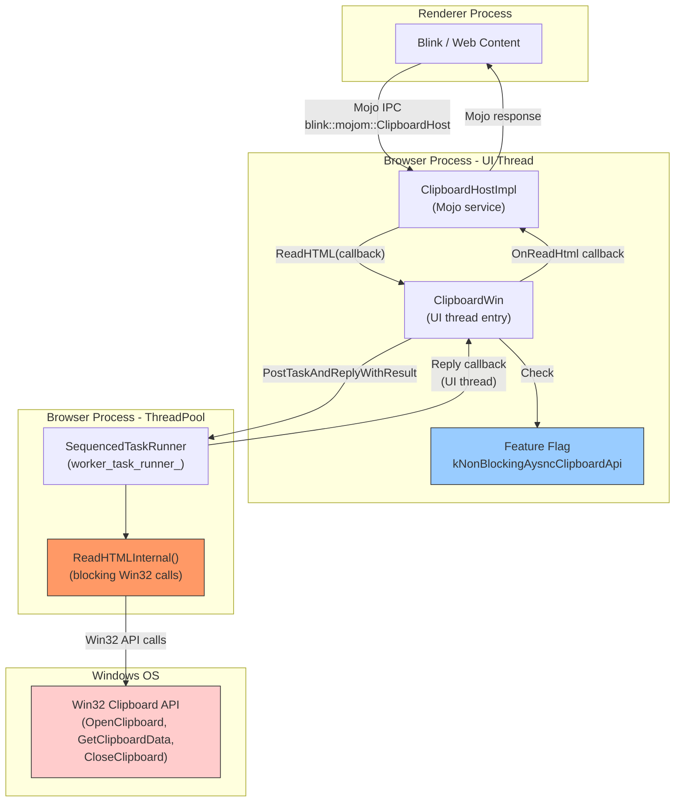
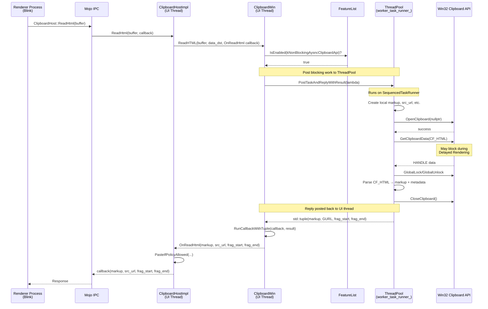
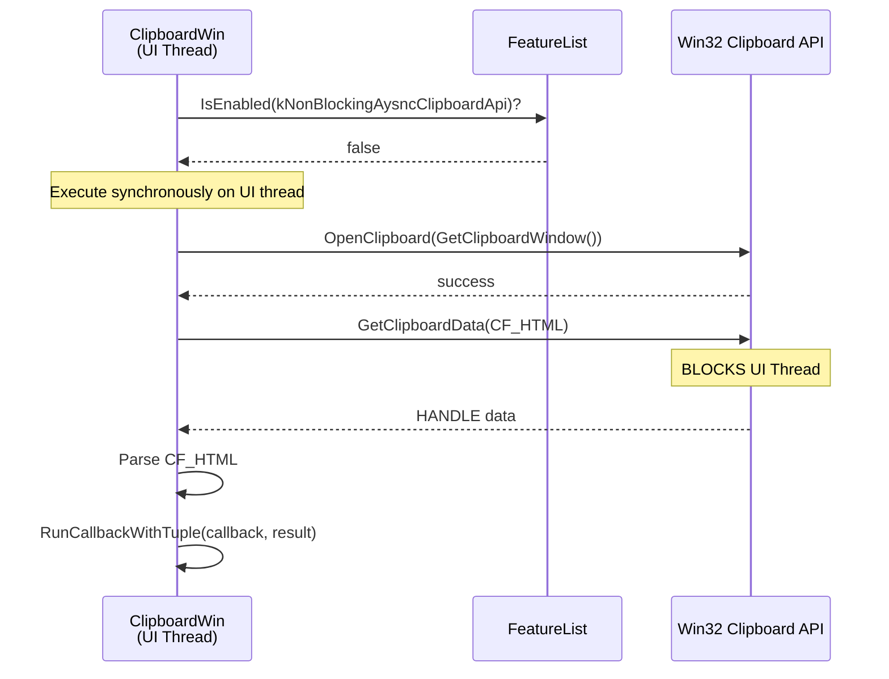

# High-Level Design Review

**CL Number**: 7151578
**Model**: claude-opus-4.6
**Generated**: 2026-02-08T08:30:18.283706+00:00

---

I'll analyze the CL details and create the HLD document.

Now let me read the cl_details.md and comments.json for additional context:

Let me check the existing HLD output and gather remaining context:

Now I have all the information needed. Let me create the HLD document.

HLD document written to `hld.md` with full architectural analysis including Mermaid diagrams for component relationships and sequence flows for both the async (feature enabled) and sync fallback paths.

# High-Level Design Document

## CL 7151578: [Clipboard][Windows] Use async ReadHTML with ThreadPool offloading

**CL URL:** https://chromium-review.googlesource.com/c/chromium/src/+/7151578
**Bug:** [458194647](https://crbug.com/458194647)
**Author:** Hewro Hewei (ihewro@chromium.org)
**Status:** NEW (Patch Set 12)

---

## 1. Executive Summary

This CL moves the blocking Win32 clipboard HTML read operations off the browser UI thread by introducing an asynchronous `ClipboardWin::ReadHTML` overload that offloads the work to a ThreadPool sequenced task runner. Currently, when a web page requests HTML clipboard content (e.g., via `navigator.clipboard.read()` or paste events), the browser calls Win32 APIs (`::OpenClipboard`, `::GetClipboardData`, `::CloseClipboard`) synchronously on the UI thread. These APIs can block for significant durations—particularly during Windows Delayed Clipboard Rendering scenarios where the clipboard owner must synthesize the data on demand—causing UI thread jank and unresponsive browser experiences. This CL addresses the problem by extracting the blocking clipboard logic into a standalone `ReadHTMLInternal()` helper function, posting it to a `SequencedTaskRunner` on the ThreadPool, and delivering results back to the UI thread via callback. A feature flag (`kNonBlockingAysncClipboardApi`) gates the new behavior, providing a safe rollback path. This is the first step in a broader plan to make all clipboard read operations non-blocking on Windows.

---

## 2. Architecture Overview

### Affected Components

This CL touches the **ui/base/clipboard** platform abstraction layer and is scoped to Windows only. It modifies how `ClipboardWin` (the Windows implementation of the `ui::Clipboard` interface) handles asynchronous HTML read requests.

| Component | Layer | Impact |
|-----------|-------|--------|
| `ui/base/clipboard/clipboard_win.cc/.h` | Platform abstraction (UI) | Core change — async ReadHTML + worker thread |
| `ui/base/ui_base_features.cc/.h` | Feature flags | New flag `kNonBlockingAysncClipboardApi` |
| `ui/base/clipboard/clipboard_win_unittest.cc` | Tests | New async ReadHTML test coverage |

### Component Diagram

### How It Fits Into Existing Architecture

The `ui::Clipboard` base class already defines an async `ReadHTML` virtual method (introduced in [CL 2728481](https://chromium-review.googlesource.com/c/chromium/src/+/2728481)). The default base class implementation simply calls the synchronous `ReadHTML` and invokes the callback immediately. This CL provides a **true asynchronous override** in `ClipboardWin` that posts the work to a ThreadPool thread instead.

The `ClipboardHostImpl` (the browser-side Mojo host for clipboard operations) already calls the async overload of `ReadHTML` (switched in [CL 7527348](https://chromium-review.googlesource.com/c/chromium/src/+/7527348)), so this CL's changes are fully transparent to `ClipboardHostImpl`.

---

## 3. Design Goals & Non-Goals

### Goals

| # | Goal | Description |
|---|------|-------------|
| G1 | **Unblock UI thread** | Move blocking Win32 clipboard read operations for HTML off the UI thread to prevent jank |
| G2 | **Safe rollout** | Gate behavior behind a feature flag (`kNonBlockingAysncClipboardApi`) with fallback to synchronous path |
| G3 | **Correct thread safety** | Use a `SequencedTaskRunner` to serialize clipboard access from the ThreadPool, and validate threading invariants with `CHECK`/`DCHECK` |
| G4 | **Minimal code duplication** | Extract blocking logic into `ReadHTMLInternal()` shared by both sync and async paths |
| G5 | **Extensible pattern** | Introduce a generic `ReadAsync<>` template that can be reused for other clipboard read operations (ReadText, ReadPng, etc.) |

### Non-Goals

| # | Non-Goal | Rationale |
|---|----------|-----------|
| NG1 | Async for all clipboard MIME types | This CL only handles HTML; other types (text, images, SVG, etc.) will follow incrementally |
| NG2 | Making the Mojo IPC itself async | The renderer still blocks synchronously on the Mojo call; true renderer-side async is a separate effort |
| NG3 | Cross-platform async clipboard | Only Windows is affected; other platforms retain existing behavior |
| NG4 | Clipboard write offloading | Write operations are out of scope |
| NG5 | Refactoring `Clipboard::GetForCurrentThread()` to `Clipboard::Get()` | Identified as a future improvement, not part of this CL |

---

## 4. System Interactions

### Main Flow — Async ReadHTML (Feature Enabled)

### Fallback Flow — Sync ReadHTML (Feature Disabled)

### Key IPC/Threading Interactions

| Boundary | Mechanism | Notes |
|----------|-----------|-------|
| Renderer → Browser | Mojo IPC (`blink::mojom::ClipboardHost`) | Currently synchronous from renderer perspective |
| UI Thread → ThreadPool | `PostTaskAndReplyWithResult` | Via `worker_task_runner_` (SequencedTaskRunner) |
| ThreadPool → UI Thread | Reply callback | Automatic via `PostTaskAndReplyWithResult` |
| Browser → Windows OS | Win32 API (`::OpenClipboard`, etc.) | Potentially blocking — the key motivation for this CL |

---

## 5. API & Interface Changes

### New Public Interfaces

| Interface | Location | Description |
|-----------|----------|-------------|
| `ClipboardWin::ReadHTML(ClipboardBuffer, const DataTransferEndpoint*, ReadHtmlCallback)` | `ui/base/clipboard/clipboard_win.h` | Async override of `Clipboard::ReadHTML` — posts work to ThreadPool |
| `ClipboardWin::ReadAsync<ReadTupleFunc, Callback, Args...>()` | `ui/base/clipboard/clipboard_win.h` | Template helper for offloading any clipboard read to ThreadPool; designed for reuse with other MIME types |
| `BASE_FEATURE(kNonBlockingAysncClipboardApi)` | `ui/base/ui_base_features.h` | Feature flag gating async clipboard behavior (enabled by default) |

### Modified Interfaces

| Interface | Location | Change |
|-----------|----------|--------|
| `ClipboardWin::ReadHTML(ClipboardBuffer, ..., u16string*, string*, uint32_t*, uint32_t*)` | `ui/base/clipboard/clipboard_win.cc` | Refactored to delegate to `ReadHTMLInternal()` — same public signature, implementation extracted |
| `ScopedClipboard::Acquire(HWND owner)` | `ui/base/clipboard/clipboard_win.cc` | Added `CHECK` validating HWND is non-null on UI thread, null on worker thread |

### Internal (Non-Public) Additions

| Symbol | Location | Description |
|--------|----------|-------------|
| `ReadHTMLInternal()` | `ui/base/clipboard/clipboard_win.cc` (anonymous namespace) | Free function containing blocking clipboard read logic |
| `RunCallbackWithTuple<Callback, Tuple>()` | `ui/base/clipboard/clipboard_win.cc` (anonymous namespace) | Utility to apply a `std::tuple` to a callback's `Run()` method |
| `ClipboardWin::worker_task_runner_` | `ui/base/clipboard/clipboard_win.h` | `scoped_refptr<base::SequencedTaskRunner>` for ThreadPool offloading |

### Deprecated Interfaces

None. The synchronous `ReadHTML` overload remains available and continues to work.

---

## 6. Dependencies

### What This Code Depends On

| Dependency | Type | Purpose |
|------------|------|---------|
| `base::ThreadPool` | Chromium base | Creating the `SequencedTaskRunner` for worker thread |
| `base::PostTaskAndReplyWithResult` | Chromium base | Posting work and receiving reply on originating thread |
| `base::FeatureList` | Chromium base | Checking `kNonBlockingAysncClipboardApi` feature flag |
| `ui::Clipboard` base class | ui/base | Async `ReadHTML` virtual method signature (`ReadHtmlCallback`) |
| Win32 Clipboard API | Windows OS | `::OpenClipboard`, `::GetClipboardData`, `::CloseClipboard`, `::GlobalLock/Unlock` |
| `clipboard_util::CFHtmlExtractMetadata` | ui/base | Parsing CF_HTML clipboard format |
| `base::UTF8ToUTF16AndAdjustOffsets` | Chromium base | UTF conversion with fragment offset tracking |

### What Depends On This Code

| Dependent | Impact |
|-----------|--------|
| `ClipboardHostImpl` | Already calls async `ReadHTML` overload — no change needed (switched in CL 7527348) |
| `Clipboard::ReadHTML` consumers | Any code calling the async overload on Windows now gets true async behavior |
| Feature flag infrastructure | `kNonBlockingAysncClipboardApi` can be toggled via `chrome://flags` or Finch experiments |

### Compatibility Considerations

- **Backward compatible**: When the feature flag is disabled, behavior is identical to the pre-CL synchronous path
- **Win32 API invariant**: `::OpenClipboard(nullptr)` is valid for read operations on Windows — the CL removes the `GetClipboardWindow()` dependency for ThreadPool execution, which is safe per Win32 documentation
- **No Mojo interface changes**: The `blink::mojom::ClipboardHost` interface is unchanged

---

## 7. Risks & Mitigations

### Risk Matrix

| Risk | Probability | Impact | Mitigation |
|------|-------------|--------|------------|
| **Clipboard content changes between read operations** | Medium | Low | Inherent to clipboard architecture; behavior unchanged from sync path. `SequencedTaskRunner` ensures serialized access within Chromium. |
| **Win32 `OpenClipboard(nullptr)` behaves differently than `OpenClipboard(hwnd)`** | Low | High | Win32 documentation confirms `nullptr` is valid for read-only access. Validated in local testing. |
| **UI thread jank during sync fallback** | Medium | Medium | Feature flag allows disabling async path if issues arise; sync path is the existing behavior. |
| **`ClipboardHostImpl` destroyed before async callback** | Low | High | Mitigated via `weak_ptr_factory_.GetWeakPtr()` — callback is safely dropped if host is destroyed. |
| **Concurrent clipboard access from multiple ThreadPool threads** | Low | Medium | `SequencedTaskRunner` guarantees ordering; only one read at a time on the worker sequence. |
| **Feature flag typo (`Aysnc` vs `Async`)** | Certain | Low | Cosmetic issue in flag name; should be fixed before merge but doesn't affect functionality. |
| **Delayed Rendering still blocks (just on ThreadPool instead of UI thread)** | Medium | Low | Acceptable — ThreadPool blocking doesn't cause UI jank. The `MayBlock` trait (mentioned in commit message) should be added to `worker_task_runner_` traits to signal ThreadPool about blocking potential. |

### Migration Strategy

This is an additive change with no migration required:
1. **Phase 1 (this CL)**: Async ReadHTML with feature flag (enabled by default on Windows)
2. **Phase 2 (future CLs)**: Extend `ReadAsync<>` pattern to other MIME types (ReadText, ReadPng, ReadSvg, etc.)
3. **Phase 3 (future)**: Investigate making the Mojo IPC itself async to unblock the renderer
4. **Phase 4 (future)**: Consider `SequenceBound<ClipboardWin>` wrapper or refactoring `Clipboard::GetForCurrentThread()` → `Clipboard::Get()` for cleaner architecture

---

## 8. Testing Strategy

### Current Test Coverage

| Test | File | What It Validates |
|------|------|-------------------|
| Async ReadHTML basic test | `ui/base/clipboard/clipboard_win_unittest.cc` | Verifies async `ReadHTML` completes via `TestFuture`, and does not trigger clipboard data change notifications |

### Recommended Additional Tests

| Test Case | Priority | Description |
|-----------|----------|-------------|
| Sync fallback when feature disabled | High | Use `ScopedFeatureList` to disable flag; verify sync `ReadHTML` still works correctly |
| Async ReadHTML returns correct data | High | Write known HTML to clipboard, read via async path, verify markup/URL/fragment offsets match |
| Destruction during async operation | Medium | Destroy `ClipboardHostImpl` after calling async `ReadHTML` but before callback — verify no crash via `WeakPtr` |
| Empty clipboard | Medium | Verify async `ReadHTML` returns empty results gracefully when clipboard has no HTML |
| Large HTML payload | Low | Verify no performance regression or memory issues with large clipboard content |
| Concurrent async reads | Low | Verify `SequencedTaskRunner` properly serializes multiple concurrent async read requests |

### Test Infrastructure

The async test uses `base::test::TestFuture<std::u16string, GURL, uint32_t, uint32_t>` to bridge the callback-based async API into a synchronous test assertion pattern. This is the standard Chromium pattern for testing async operations.

---

## Appendix: Changed Files Summary

| File | Lines Changed | Purpose |
|------|--------------|---------|
| `ui/base/clipboard/clipboard_win.cc` | +126/−50 | Core implementation: `ReadHTMLInternal()`, async `ReadHTML()`, `ReadAsync<>` template, `RunCallbackWithTuple()`, `ScopedClipboard::Acquire()` CHECK |
| `ui/base/clipboard/clipboard_win.h` | +9/−0 | Declare async `ReadHTML`, `ReadAsync<>` template, `worker_task_runner_` member |
| `ui/base/clipboard/clipboard_win_unittest.cc` | +6/−0 | Async `ReadHTML` test using `TestFuture` |
| `ui/base/ui_base_features.cc` | +3/−0 | Define `kNonBlockingAysncClipboardApi` feature flag |
| `ui/base/ui_base_features.h` | +3/−0 | Declare `kNonBlockingAysncClipboardApi` feature flag |
