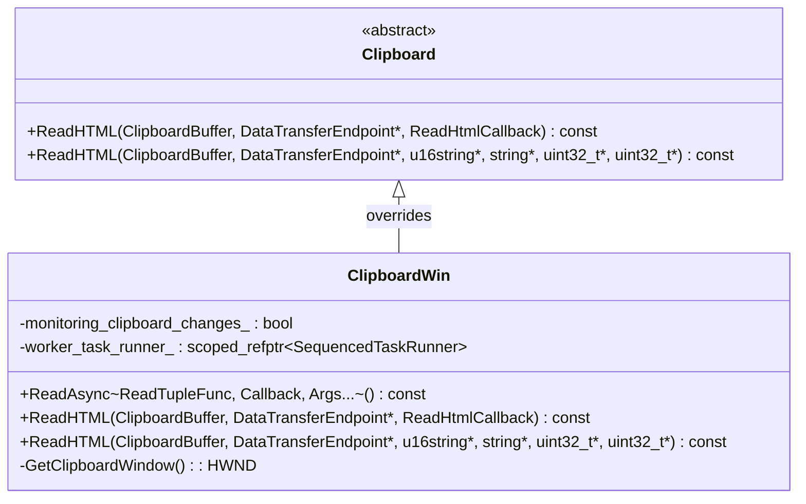
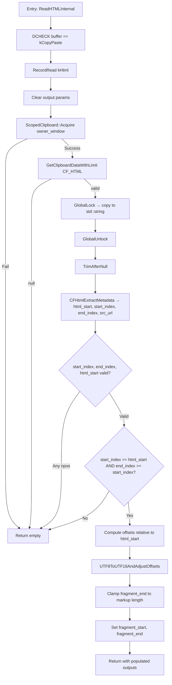
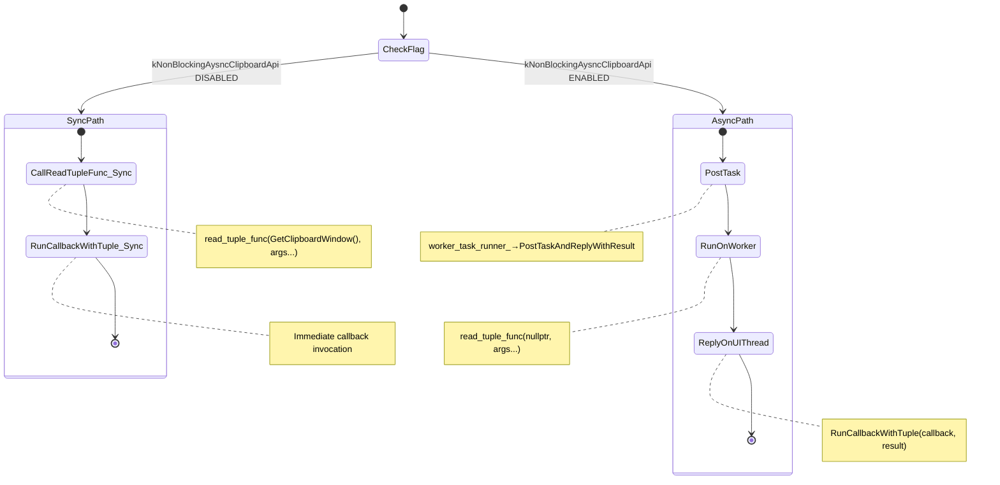
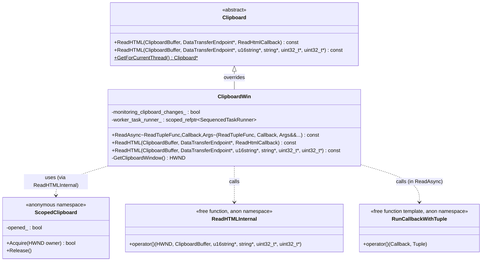
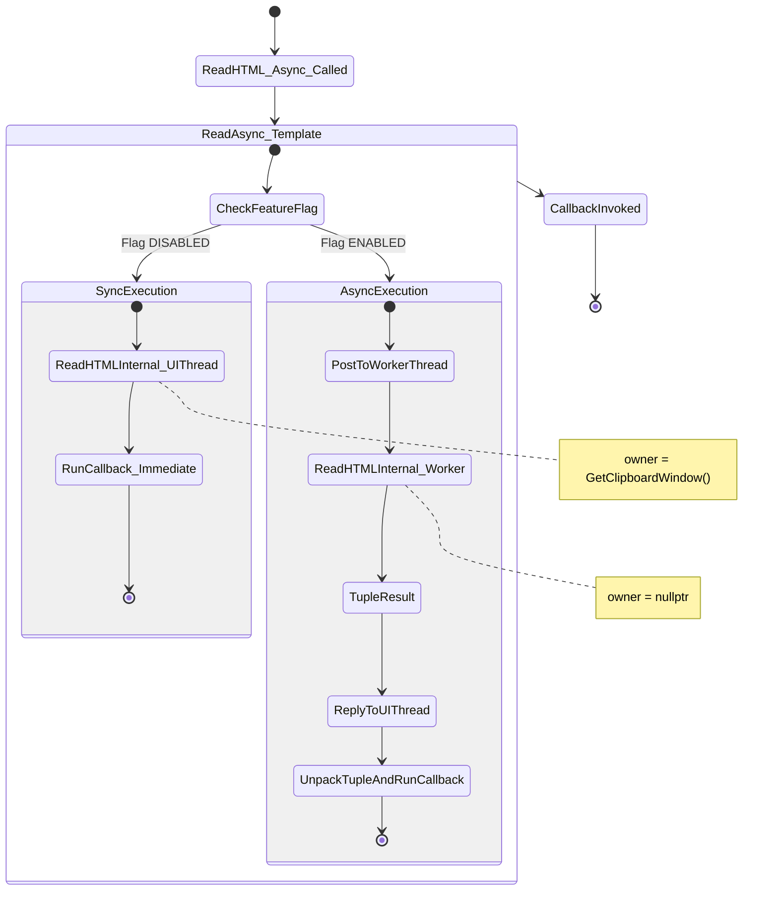
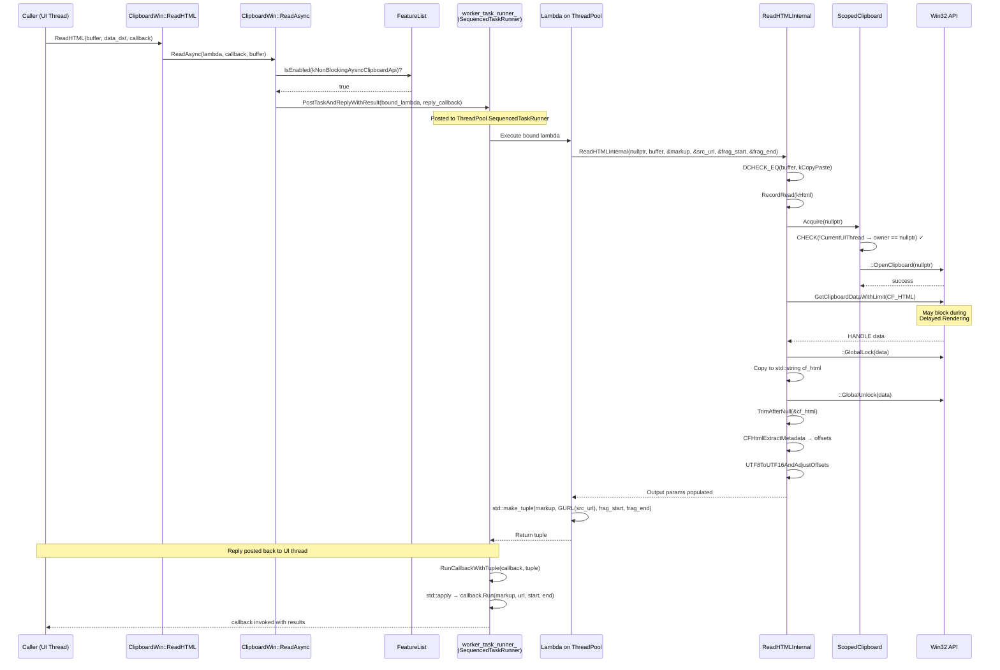

# Low-Level Design Review

**CL Number**: 7151578
**Model**: claude-opus-4.6
**Generated**: 2026-02-08T08:32:41.452512+00:00

---


I'll analyze the CL's diff and existing files to create a detailed Low-Level Design document.

Now let me also look at the existing `lld.md` to understand what needs to be updated, and look at the comments for any review feedback.

Now I have all the information needed. The existing `lld.md` references files not in this CL (clipboard_host_impl.h/.cc) and has some inaccuracies compared to the actual diff. Let me create an accurate, comprehensive LLD based on the actual patch.

Now I have all the details. Let me write the comprehensive LLD document.

Let me verify the file was written correctly by checking key sections.


# Low-Level Design Document

## CL 7151578: [Clipboard][Windows] Use async ReadHTML with ThreadPool offloading

**CL URL:** https://chromium-review.googlesource.com/c/chromium/src/+/7151578
**Bug**: [458194647](https://crbug.com/458194647)
**Author:** Hewro Hewei (ihewro@chromium.org)

---

## 1. Executive Summary

This CL introduces a true asynchronous implementation of `ClipboardWin::ReadHTML` that offloads blocking Win32 clipboard operations (`::OpenClipboard`, `::GetClipboardData`, `::CloseClipboard`) to a `SequencedTaskRunner` on the ThreadPool. The blocking logic is extracted from the former synchronous `ReadHTML` method into a standalone free function `ReadHTMLInternal()` in an anonymous namespace, parameterized by an `HWND owner_window` argument. A generic template method `ReadAsync<>()` is introduced to encapsulate the feature-flag check, ThreadPool posting, and callback unpacking—designed for reuse with future clipboard MIME type offloading. A new feature flag `kNonBlockingAysncClipboardApi` (enabled by default) gates the behavior, with a synchronous fallback when disabled.

### Scope of Changes (5 files, +147/−50 lines):
| File | Lines | Role |
|------|-------|------|
| `ui/base/clipboard/clipboard_win.cc` | +126/−50 | Core implementation: `ReadHTMLInternal`, async `ReadHTML`, `ReadAsync<>`, `RunCallbackWithTuple`, `ScopedClipboard::Acquire` CHECK |
| `ui/base/clipboard/clipboard_win.h` | +9/−0 | Declare async `ReadHTML`, `ReadAsync<>` template, `worker_task_runner_` member |
| `ui/base/clipboard/clipboard_win_unittest.cc` | +6/−0 | Async `ReadHTML` test using `TestFuture` |
| `ui/base/ui_base_features.cc` | +3/−0 | Define `kNonBlockingAysncClipboardApi` feature flag |
| `ui/base/ui_base_features.h` | +3/−0 | Declare `kNonBlockingAysncClipboardApi` feature flag |

---

## 2. File-by-File Analysis

---

### 2.1 `ui/base/ui_base_features.cc` (+3/−0)

**Purpose of changes**: Define a new feature flag to gate the async clipboard read behavior.

**Key modifications**:
- Added `BASE_FEATURE(kNonBlockingAysncClipboardApi, base::FEATURE_ENABLED_BY_DEFAULT)` — the flag is enabled by default (unconditionally, not platform-gated in the diff).

**New/Modified Declarations**:
| Declaration | Purpose | Default State |
|-------------|---------|---------------|
| `BASE_FEATURE(kNonBlockingAysncClipboardApi, ...)` | Gates whether `ReadAsync` posts to ThreadPool or runs synchronously | `FEATURE_ENABLED_BY_DEFAULT` |

**Code (from diff)**:
```cpp
// If enabled, clipboard read APIs are non-blocking on UI thread.
BASE_FEATURE(kNonBlockingAysncClipboardApi, base::FEATURE_ENABLED_BY_DEFAULT);
```

**Observations**:
- **Typo**: The identifier uses `Aysnc` (transposed letters) instead of `Async`. This will propagate through all references and Finch experiment names.
- The flag is enabled by default unconditionally (not behind `#if BUILDFLAG(IS_WIN)`), so the feature will also be checked on other platforms even though only `ClipboardWin` overrides the async `ReadHTML`. The base class default implementation (sync) is unaffected since the flag is only consulted inside `ClipboardWin::ReadAsync`.

---

### 2.2 `ui/base/ui_base_features.h` (+3/−0)

**Purpose of changes**: Declare the feature flag for use by `clipboard_win.cc`.

**Key modifications**:
- Added `COMPONENT_EXPORT(UI_BASE_FEATURES) BASE_DECLARE_FEATURE(kNonBlockingAysncClipboardApi)` declaration.

**Data Flow**: This header is `#include`d by `clipboard_win.cc` to call `base::FeatureList::IsEnabled(features::kNonBlockingAysncClipboardApi)`.

---

### 2.3 `ui/base/clipboard/clipboard_win.h` (+9/−0)

**Purpose of changes**: Extend the `ClipboardWin` class with async ReadHTML support and ThreadPool infrastructure.

**Key modifications**:
1. Declared `ReadAsync<>()` private template method
2. Declared async `ReadHTML()` override (callback-based)
3. Added `worker_task_runner_` member

**New/Modified Functions**:
| Function | Visibility | Purpose | Signature |
|----------|-----------|---------|-----------|
| `ReadAsync<ReadTupleFunc, Callback, Args...>()` | public (in header between `Clear` and `ReadAvailableTypes`) | Generic template to dispatch any clipboard read to ThreadPool | `void ReadAsync(ReadTupleFunc, Callback, Args&&...) const` |
| `ReadHTML(ClipboardBuffer, const DataTransferEndpoint*, ReadHtmlCallback)` | public override | Async HTML clipboard read | `void ReadHTML(..., ReadHtmlCallback callback) const override` |

**New Data Members**:
| Member | Type | Purpose | Initialized |
|--------|------|---------|-------------|
| `worker_task_runner_` | `scoped_refptr<base::SequencedTaskRunner>` | Sequenced task runner for blocking clipboard ops | In `ClipboardWin()` constructor |

**Concern — Template in public section**: `ReadAsync<>` is declared between `Clear()` and `ReadAvailableTypes()`, making it part of the public interface. Given it's an internal implementation detail, it should ideally be in the private section alongside other helper members. However, C++ template methods need to be visible to callers at compile time, and since only `ClipboardWin` itself calls it, the placement is functional but could be improved with a comment clarifying intent.

**Updated Class Diagram**:


---

### 2.4 `ui/base/clipboard/clipboard_win.cc` (+126/−50)

**Purpose of changes**: Core implementation of async ReadHTML with ThreadPool offloading, refactoring of sync ReadHTML, and addition of threading invariant checks.

This is the primary file with four distinct change regions:

#### 2.4.1 New Includes (lines 44–46)

```cpp
#include <tuple>
#include <type_traits>
#include <utility>
```

Added to support `std::tuple`, `std::invoke_result_t`, `std::apply`, `std::forward`, and `std::move` used by the new template infrastructure.

---

#### 2.4.2 `ScopedClipboard::Acquire()` — Threading CHECK (lines 96–99)

**Modification**: Added a `CHECK` at the top of `Acquire(HWND owner)`:

```cpp
// |owner| is non-null on the UI thread and nullptr on
// ClipboardWin::|worker_task_runner_| to serialize clipboard access.
CHECK(base::CurrentUIThread::IsSet() ? owner != nullptr : owner == nullptr);
```

**Logic**:
- On the UI thread (`CurrentUIThread::IsSet()` is true): `owner` **must** be non-null (i.e., `GetClipboardWindow()` result).
- On a non-UI thread (ThreadPool worker): `owner` **must** be `nullptr`.
- This is a **hard CHECK** (crash in production), not a DCHECK, providing strong runtime validation of the threading contract.

**Edge Cases**:
- If `Acquire` is ever called from a non-UI, non-ThreadPool thread (e.g., an IO thread), the CHECK enforces `owner == nullptr`, which is correct for read-only clipboard access.
- If a test runs on a thread without `CurrentUIThread`, passing a non-null HWND would crash — but this is unlikely given test infrastructure.

---

#### 2.4.3 `RunCallbackWithTuple<>()` — Anonymous Namespace Utility (lines 65–72)

**New Function**:
```cpp
template <typename Callback, typename Tuple>
void RunCallbackWithTuple(Callback callback, Tuple result) {
  std::apply(
      [callback = std::move(callback)](auto&&... args) mutable {
        std::move(callback).Run(std::forward<decltype(args)>(args)...);
      },
      std::move(result));
}
```

| Aspect | Detail |
|--------|--------|
| **Purpose** | Bridges `std::tuple` results from ThreadPool tasks to Chromium `base::OnceCallback::Run()` |
| **Parameters** | `Callback` — a `base::OnceCallback<void(Args...)>`; `Tuple` — a `std::tuple<Args...>` |
| **Mechanism** | Uses `std::apply` to unpack the tuple and forward each element as an argument to `callback.Run()` |
| **Thread** | Runs on the reply thread (UI thread when used with `PostTaskAndReplyWithResult`) |

**Why needed**: `PostTaskAndReplyWithResult` delivers a single return value. The clipboard read produces multiple outputs (markup, URL, fragment offsets), bundled into a `std::tuple`. This utility unpacks the tuple to match the callback's expected parameter list.

---

#### 2.4.4 `ReadHTMLInternal()` — Extracted Blocking Logic (lines 74–134)

**New Function** (anonymous namespace, free function):

```cpp
void ReadHTMLInternal(HWND owner_window,
                      ClipboardBuffer buffer,
                      std::u16string* markup,
                      std::string* src_url,
                      uint32_t* fragment_start,
                      uint32_t* fragment_end);
```

| Parameter | Type | Purpose |
|-----------|------|---------|
| `owner_window` | `HWND` | Non-null on UI thread, `nullptr` on ThreadPool |
| `buffer` | `ClipboardBuffer` | Must be `kCopyPaste` (asserted via `DCHECK_EQ`) |
| `markup` | `std::u16string*` | Output: parsed HTML markup (UTF-16) |
| `src_url` | `std::string*` | Output: source URL from CF_HTML metadata |
| `fragment_start` | `uint32_t*` | Output: start offset of HTML fragment within markup |
| `fragment_end` | `uint32_t*` | Output: end offset of HTML fragment within markup |

**Logic Flow**:



**Key difference from previous sync ReadHTML**: The only functional change is that `owner_window` is a parameter instead of always being `GetClipboardWindow()`. The logic, including all error checks and CF_HTML parsing, is identical to the previous inline implementation.

**Error Handling Strategy**: Multiple early returns with output parameters left at their cleared/zero defaults:
1. `ScopedClipboard::Acquire` fails → return (clipboard busy or unavailable)
2. `GetClipboardDataWithLimit` returns null → return (no CF_HTML data)
3. `CFHtmlExtractMetadata` returns `npos` values → return (malformed CF_HTML)
4. Index ordering validation fails → return (corrupted offset data)

---

#### 2.4.5 Constructor — `worker_task_runner_` Initialization (lines 338–340)

```cpp
worker_task_runner_ = base::ThreadPool::CreateSequencedTaskRunner(
    {base::TaskPriority::USER_VISIBLE});
```

| Aspect | Detail |
|--------|--------|
| **Type** | `SequencedTaskRunner` — guarantees FIFO ordering, no concurrent execution |
| **Priority** | `USER_VISIBLE` — higher than `BEST_EFFORT`, appropriate for user-facing clipboard operations |
| **Lifetime** | Lives as long as the `ClipboardWin` instance (singleton via `Clipboard::GetForCurrentThread()`) |
| **Missing trait** | `base::MayBlock()` is NOT specified despite the commit message mentioning it. Win32 clipboard APIs can block (especially during Delayed Rendering), so this trait should be added to avoid ThreadPool starvation warnings. |

---

#### 2.4.6 `ClipboardWin::ReadAsync<>()` — Generic Async Dispatch Template (lines 468–494)

**New Template Method**:

```cpp
template <typename ReadTupleFunc, typename Callback, typename... Args>
void ClipboardWin::ReadAsync(ReadTupleFunc read_tuple_func,
                             Callback callback,
                             Args&&... args) const;
```

| Template Parameter | Constraint | Purpose |
|-------------------|------------|---------|
| `ReadTupleFunc` | Callable: `(HWND, Args...) → std::tuple<...>` | The blocking read function that returns results as a tuple |
| `Callback` | `base::OnceCallback<void(TupleElements...)>` | The callback to invoke with unpacked tuple results |
| `Args...` | Forwarded to `read_tuple_func` | Additional arguments (e.g., `ClipboardBuffer`) |

**Internal type deduction**:
```cpp
using TupleReplyType = std::invoke_result_t<ReadTupleFunc, HWND, Args...>;
```

**Two execution paths**:



**Sync path detail** (flag disabled):
```cpp
TupleReplyType result = std::move(read_tuple_func)(
    /*owner_window=*/GetClipboardWindow(), std::forward<Args>(args)...);
RunCallbackWithTuple(std::move(callback), std::move(result));
```
- Executes `read_tuple_func` on the UI thread with the real `HWND`.
- Invokes callback synchronously (still async from caller's perspective via callback pattern, but no thread hop).

**Async path detail** (flag enabled):
```cpp
worker_task_runner_->PostTaskAndReplyWithResult(
    FROM_HERE,
    base::BindOnce(
        [](ReadTupleFunc read_tuple_func, auto&&... bound_args) {
            return std::move(read_tuple_func)(
                /*owner_window=*/nullptr,
                std::forward<decltype(bound_args)>(bound_args)...);
        },
        std::move(read_tuple_func), std::forward<Args>(args)...),
    base::BindOnce(&RunCallbackWithTuple<Callback, TupleReplyType>,
                   std::move(callback)));
```
- Wraps `read_tuple_func` in a lambda bound with forwarded args.
- Posts to `worker_task_runner_` (ThreadPool sequenced runner).
- The lambda passes `nullptr` as `owner_window` — valid for Win32 read-only clipboard access.
- Reply callback uses `RunCallbackWithTuple` to unpack the returned tuple into the original callback.

**Design for extensibility**: This template can be reused for `ReadText`, `ReadPng`, `ReadSvg`, etc., by providing different `read_tuple_func` lambdas that return appropriate tuples.

---

#### 2.4.7 Async `ClipboardWin::ReadHTML()` (lines 496–513)

**New Override**:
```cpp
void ClipboardWin::ReadHTML(ClipboardBuffer buffer,
                            const DataTransferEndpoint* data_dst,
                            ReadHtmlCallback callback) const;
```

| Aspect | Detail |
|--------|--------|
| **Overrides** | `Clipboard::ReadHTML(ClipboardBuffer, const DataTransferEndpoint*, ReadHtmlCallback)` virtual method |
| **`data_dst` usage** | Ignored (comment: "not used, only passed for consistency with other platforms") |
| **Callback type** | `ReadHtmlCallback` = `base::OnceCallback<void(std::u16string, GURL, uint32_t, uint32_t)>` |

**Implementation**: Calls `ReadAsync` with a lambda that:
1. Creates local output variables (`markup`, `src_url`, `fragment_start`, `fragment_end`)
2. Calls `ReadHTMLInternal(owner_window, buffer, ...)` to populate them
3. Returns `std::make_tuple(std::move(markup), GURL(src_url), fragment_start, fragment_end)`

```cpp
ReadAsync(
    [](HWND owner_window, ClipboardBuffer buffer) {
        std::u16string markup;
        std::string src_url;
        uint32_t fragment_start = 0;
        uint32_t fragment_end = 0;
        ReadHTMLInternal(owner_window, buffer, &markup, &src_url,
                         &fragment_start, &fragment_end);
        return std::make_tuple(std::move(markup), GURL(src_url),
                               fragment_start, fragment_end);
    },
    std::move(callback), buffer);
```

**Notable**: The `src_url` is converted from `std::string` to `GURL` inside the lambda — this conversion happens on the worker thread (async path) or UI thread (sync path), keeping it consistent.

---

#### 2.4.8 Sync `ClipboardWin::ReadHTML()` — Refactored (lines 602–607)

**Modified method** — the original 48-line inline implementation is replaced with a 2-line delegation:

```cpp
void ClipboardWin::ReadHTML(ClipboardBuffer buffer,
                            const DataTransferEndpoint* data_dst,
                            std::u16string* markup,
                            std::string* src_url,
                            uint32_t* fragment_start,
                            uint32_t* fragment_end) const {
  ReadHTMLInternal(GetClipboardWindow(), buffer, markup, src_url,
                   fragment_start, fragment_end);
}
```

This eliminates code duplication between sync and async paths. Both now share the same `ReadHTMLInternal` logic. The sync path always passes `GetClipboardWindow()` as the `owner_window`.

---

### 2.5 `ui/base/clipboard/clipboard_win_unittest.cc` (+6/−0)

**Purpose of changes**: Add test coverage for the new async `ReadHTML` overload.

**Key modifications**:
- Added 6 lines within an existing test to verify async `ReadHTML` doesn't trigger clipboard data-change notifications.

**Test Code**:
```cpp
base::test::TestFuture<std::u16string, GURL, uint32_t, uint32_t> html_future;
clipboard->ReadHTML(ClipboardBuffer::kCopyPaste, nullptr,
                    html_future.GetCallback());
ASSERT_TRUE(html_future.Wait());
ASSERT_EQ(data_changed_count(), 0);
```

| Test Aspect | Verified |
|-------------|----------|
| Async callback is invoked | ✅ (`html_future.Wait()` returns true) |
| No data-changed notification | ✅ (`data_changed_count() == 0`) |
| Correct return types | ✅ (TestFuture template matches `ReadHtmlCallback` signature) |

**Not tested** (gaps):
- Actual HTML content correctness of async result
- Feature flag disabled (sync fallback) path
- Empty clipboard behavior
- ClipboardWin destruction mid-async-operation

---

## 3. Full Class Diagram



---

## 4. State Diagram — ReadHTML Request Lifecycle



---

## 5. Data Flow — End-to-End Async ReadHTML



---

## 6. Implementation Concerns

### 6.1 Thread Safety

| Concern | Severity | Analysis |
|---------|----------|----------|
| **`ScopedClipboard::Acquire` CHECK** | **High — Correct** | The new `CHECK(base::CurrentUIThread::IsSet() ? owner != nullptr : owner == nullptr)` provides hard crash-on-violation guarantees. This is appropriate since passing the wrong HWND on the wrong thread could cause subtle Win32 clipboard corruption. |
| **`SequencedTaskRunner` ordering** | **Low risk** | Using a `SequencedTaskRunner` prevents concurrent clipboard reads from the ThreadPool. However, clipboard reads from the UI thread (sync path) and ThreadPool (async path) are NOT mutually serialized — a concurrent sync+async read is possible if both code paths are hit simultaneously. Win32 `::OpenClipboard` provides its own system-level serialization, so this is safe. |
| **`RecordRead` on worker thread** | **Medium — needs verification** | `RecordRead(ClipboardFormatMetric::kHtml)` is called inside `ReadHTMLInternal`, which now runs on the ThreadPool. If `RecordRead` uses thread-local storage or non-thread-safe UMA histograms, this could be problematic. Chromium's UMA histogram infrastructure is generally thread-safe, but this should be verified. |
| **`ClipboardFormatType::HtmlType()` on worker thread** | **Low risk** | Static accessor, likely thread-safe. Should be verified that it doesn't depend on UI thread state. |

### 6.2 Memory Management

| Concern | Severity | Analysis |
|---------|----------|----------|
| **Lambda capture in `ReadAsync`** | **Low** | The lambda captures `read_tuple_func` and `args` by value/move via `base::BindOnce`. Ownership is correctly transferred to the task. |
| **Callback ownership** | **Low** | `callback` is moved into `base::BindOnce(&RunCallbackWithTuple<...>)`, ensuring single-ownership semantics. |
| **`std::tuple` result lifetime** | **Low** | Created on the worker thread, moved into the reply callback, consumed by `RunCallbackWithTuple`. Clean ownership chain. |
| **`GURL(src_url)` construction** | **Low** | Constructed inside the lambda on the worker thread. No issues — `GURL` is thread-safe. |

### 6.3 Performance

| Aspect | Impact | Analysis |
|--------|--------|---------|
| **UI thread unblocking** | **Major positive** | The primary goal — Win32 `::OpenClipboard` and `::GetClipboardData` can block for 100ms+ during Delayed Rendering. Moving this off the UI thread eliminates jank. |
| **Task posting overhead** | **Negligible** | ~1–5µs for `PostTaskAndReplyWithResult` per clipboard read. |
| **Missing `base::MayBlock()` trait** | **Medium concern** | The `worker_task_runner_` is created without `base::MayBlock()`. ThreadPool threads without this trait have stricter blocking detection. Win32 clipboard APIs may trigger `ScopedBlockingCall` warnings or ThreadPool starvation if the pool is under pressure. The commit message mentions "MayBlock trait" but the code doesn't include it. |
| **`GURL` construction on worker** | **Minor positive** | `GURL(src_url)` parsing is done on the worker thread rather than the UI thread in the async path, slightly reducing UI thread work. |

### 6.4 Correctness

| Concern | Severity | Analysis |
|---------|----------|----------|
| **`data_dst` parameter ignored** | **Low** | The async `ReadHTML` ignores `data_dst` with a comment. This is consistent with the sync path and other Windows clipboard methods. |
| **Feature flag checked at call time** | **Correct** | The flag is checked inside `ReadAsync` each time, allowing runtime toggling via Finch. |
| **Sync fallback uses `GetClipboardWindow()`** | **Correct** | When the flag is disabled, the sync path passes `GetClipboardWindow()` to `ReadHTMLInternal`, preserving the previous behavior exactly. |
| **Sync `ReadHTML` refactored** | **Correct** | The old 48-line inline implementation is replaced by a 2-line call to `ReadHTMLInternal(GetClipboardWindow(), ...)`, sharing the same logic as the async path. |

### 6.5 Maintainability

| Concern | Severity | Analysis |
|---------|----------|----------|
| **Feature flag typo (`Aysnc`)** | **Medium** | `kNonBlockingAysncClipboardApi` will become a permanent identifier in Finch experiments, `chrome://flags` entries, and code references. Should be fixed before landing. |
| **Template complexity** | **Medium** | `ReadAsync<ReadTupleFunc, Callback, Args...>` with `std::invoke_result_t`, `base::BindOnce` with variadic lambda captures, and `RunCallbackWithTuple` using `std::apply` is complex template metaprogramming. The benefit is extensibility for other MIME types, but it increases the cognitive load for future maintainers. |
| **`ReadAsync` visibility** | **Low** | Declared in the public section of the header. Should be private since it's an internal implementation detail. |

---

## 7. Edge Cases

| Edge Case | Handling | Concern |
|-----------|----------|---------|
| **Clipboard empty (no CF_HTML)** | `GetClipboardDataWithLimit` returns null → early return with cleared outputs | ✅ Correct |
| **Clipboard changes during read** | CF_HTML metadata may be inconsistent → `npos` checks catch this | ✅ Correct |
| **Malformed CF_HTML offsets** | `start_index < html_start` or `end_index < start_index` → early return | ✅ Correct |
| **Large clipboard content** | `GetClipboardDataWithLimit` applies size limits | ✅ Correct |
| **`ClipboardWin` destroyed during async read** | The callback holds a moved `Callback` (not a weak ref to `ClipboardWin`). If `ClipboardWin` is destroyed, the reply callback will still execute. However, `ClipboardWin` is a singleton that outlives most callers, so this is unlikely. | ⚠️ Low risk |
| **`OpenClipboard(nullptr)` fails** | `ScopedClipboard::Acquire` retry loop (5 attempts, `Sleep(5)` between) handles transient failures | ✅ Correct |
| **Feature flag toggled mid-flight** | Each `ReadAsync` call checks the flag independently. A toggle between calls changes the path, but not mid-call. | ✅ Correct |
| **Multiple concurrent async reads** | `SequencedTaskRunner` serializes them — only one read at a time on the worker thread | ✅ Correct |

---

## 8. Suggestions for Improvement

### 8.1 Critical

1. **Add `base::MayBlock()` to `worker_task_runner_` traits**:
   ```cpp
   // Current
   worker_task_runner_ = base::ThreadPool::CreateSequencedTaskRunner(
       {base::TaskPriority::USER_VISIBLE});

   // Suggested
   worker_task_runner_ = base::ThreadPool::CreateSequencedTaskRunner(
       {base::TaskPriority::USER_VISIBLE, base::MayBlock()});
   ```
   Win32 clipboard APIs can block (Delayed Rendering). Without `MayBlock()`, the ThreadPool may flag these as unexpected blocking calls or fail to allocate sufficient threads.

2. **Fix feature flag typo**:
   ```cpp
   // Current
   kNonBlockingAysncClipboardApi  // "Aysnc" — transposed letters

   // Suggested
   kNonBlockingAsyncClipboardApi  // "Async" — correct spelling
   ```

### 8.2 Important

3. **Move `ReadAsync` to private section** in `clipboard_win.h`:
   Currently placed between `Clear()` and `ReadAvailableTypes()` in the public section. It's an internal implementation detail and should be private.

4. **Verify `RecordRead` thread-safety**: `RecordRead(ClipboardFormatMetric::kHtml)` is called from the worker thread in the async path. Confirm that the underlying UMA histogram recording is thread-safe.

### 8.3 Nice-to-Have

5. **Add performance tracing**:
   ```cpp
   TRACE_EVENT0("clipboard", "ReadHTMLInternal");
   ```
   This would help profile the actual blocking duration in production via `chrome://tracing`.

6. **Expand test coverage**:
   - Test with feature flag disabled (sync fallback path)
   - Verify actual HTML content returned via async path
   - Test empty clipboard behavior
   - Test concurrent async reads

7. **Add comment clarifying `nullptr` HWND validity**:
   ```cpp
   // Windows clipboard read operations do not require an HWND owner.
   // Passing nullptr to ::OpenClipboard is valid for read-only access
   // per MSDN documentation.
   ```

---

## 9. Risk Assessment

| Risk | Probability | Impact | Mitigation |
|------|-------------|--------|------------|
| ThreadPool starvation without `MayBlock()` | Medium | High | Add `base::MayBlock()` trait to `worker_task_runner_` |
| Delayed Rendering blocks ThreadPool thread for extended time | Medium | Low | Acceptable — doesn't block UI thread; `MayBlock()` allows ThreadPool to compensate |
| Feature flag typo causes confusion in Finch experiments | Certain | Low | Fix before landing |
| `RecordRead` not thread-safe | Low | Medium | Verify base histogram infrastructure; add DCHECK if needed |
| Clipboard content changes between `OpenClipboard` and `GetClipboardData` | Low | Low | Inherent to clipboard architecture; unchanged from sync behavior |
| `ScopedClipboard::Acquire` CHECK crashes in unexpected threading contexts | Very Low | High | The CHECK is intentionally strict; validates correct usage contract |
| Sync+async concurrent reads to same clipboard | Low | Low | Win32 `::OpenClipboard` provides OS-level serialization; one will retry |

---

## 10. Summary

This CL implements a well-structured async clipboard HTML read for Windows with:

- ✅ **Clean extraction**: `ReadHTMLInternal()` shares logic between sync and async paths with zero duplication
- ✅ **Extensible template**: `ReadAsync<>` is designed for reuse with other clipboard MIME types
- ✅ **Safe rollout**: Feature flag with synchronous fallback
- ✅ **Thread safety**: `SequencedTaskRunner` ordering + `ScopedClipboard::Acquire` CHECK
- ✅ **Correct ownership**: `base::BindOnce` with `std::move` throughout the callback chain

**Must-fix before landing**:
1. Add `base::MayBlock()` to `worker_task_runner_` traits (blocking Win32 APIs without it risks ThreadPool issues)
2. Fix `kNonBlockingAysncClipboardApi` typo → `kNonBlockingAsyncClipboardApi`

**Should-fix**:
3. Move `ReadAsync` to private section in header
4. Verify `RecordRead` thread-safety on worker thread
