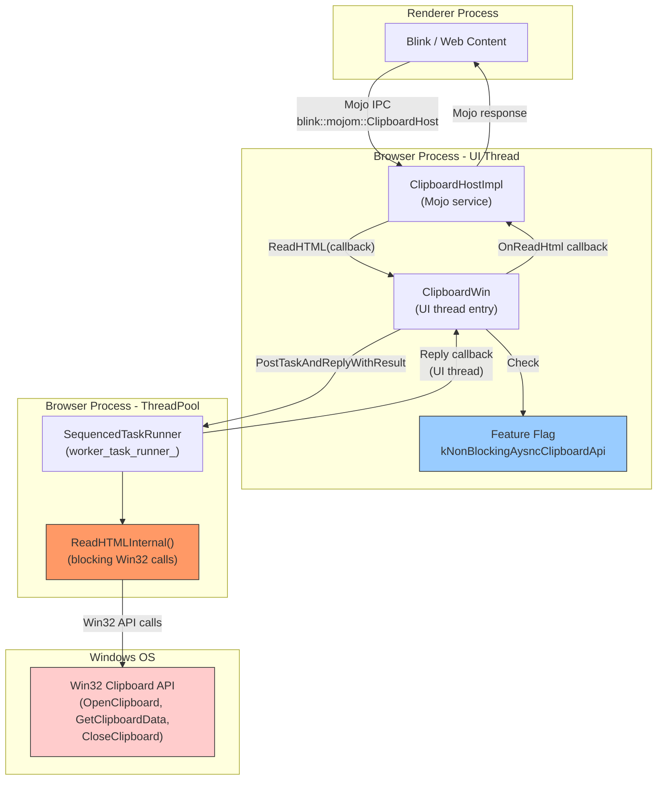

# Review Summary

**CL Number**: 7151578
**Model**: claude-opus-4.6
**Generated**: 2026-02-08T08:40:46.759403+00:00

---


I'll read all the source documents to compile the review summary.

Now let me read the LLD in sections:

Now let me view the remaining part of the LLD:

Now I have all the information needed. Let me create the comprehensive review summary.

Created `review_summary.md` with the full review summary including executive summary, design/implementation assessments with ratings, 2 critical issues, 3 major issues, 3 minor issues, test coverage analysis, security/performance considerations, **APPROVED_WITH_COMMENTS** verdict, and 6 ready-to-post Gerrit comments.


# Review Summary

## CL 7151578: [Clipboard][Windows] Use async ReadHTML with ThreadPool offloading

**CL URL:** https://chromium-review.googlesource.com/c/chromium/src/+/7151578
**Bug:** [458194647](https://crbug.com/458194647)
**Author:** Hewro Hewei (ihewro@chromium.org)
**Status:** NEW (Patch Set 12)
**Files Changed:** 5 files, +147/−50 lines
**Review Date:** 2026-02-08

---

## 1. Executive Summary

This CL moves blocking Win32 clipboard HTML read operations (`::OpenClipboard`, `::GetClipboardData`, `::CloseClipboard`) off the browser UI thread by introducing an asynchronous `ClipboardWin::ReadHTML` overload that offloads work to a `SequencedTaskRunner` on the ThreadPool. The blocking logic is extracted into a standalone `ReadHTMLInternal()` helper, shared by both sync and async paths, and a generic `ReadAsync<>` template is introduced for reuse with future clipboard MIME type offloading. A feature flag (`kNonBlockingAysncClipboardApi`) gates the new behavior with a synchronous fallback when disabled.

---

## 2. Design Assessment

### Architecture Quality

| Aspect | Rating (1-5) | Comments |
|--------|--------------|----------|
| Clarity | 4 | Clean separation of concerns: `ReadHTMLInternal` (blocking logic), `ReadAsync` (dispatch template), `RunCallbackWithTuple` (callback bridge). The template metaprogramming in `ReadAsync` adds cognitive load but is well-motivated for extensibility. |
| Maintainability | 4 | Shared `ReadHTMLInternal` eliminates code duplication between sync/async paths. Feature flag provides safe rollback. The `ReadAsync` template complexity is a minor concern for future maintainers. |
| Extensibility | 5 | The `ReadAsync<>` template is specifically designed to be reused for `ReadText`, `ReadPng`, `ReadSvg`, etc. — extending to new MIME types requires only a new lambda and callback type. |
| Consistency | 4 | Follows existing Chromium patterns: `PostTaskAndReplyWithResult`, feature flags, `SequencedTaskRunner`. Uses established async `ReadHTML` virtual method from base class. Minor inconsistency: `ReadAsync` is in the public section of the header. |

### Architecture Diagram



---

## 3. Implementation Assessment

### Code Quality

| Aspect | Rating (1-5) | Comments |
|--------|--------------|----------|
| Correctness | 4 | Core logic is correct. Two issues: missing `base::MayBlock()` trait on `worker_task_runner_` (contradicts commit message), and feature flag identifier has a typo (`Aysnc` → `Async`). |
| Efficiency | 5 | Achieves primary goal of unblocking UI thread. Task posting overhead is negligible (~1–5µs). `GURL` construction moved to worker thread as a bonus. |
| Readability | 4 | `ReadHTMLInternal` extraction is clean. `ReadAsync` template is complex but well-structured. `RunCallbackWithTuple` is a clear utility. Good inline comments for `data_dst` and `owner_window`. |
| Test Coverage | 2 | Only a smoke test verifying the async API can be called without crashing. No content validation, no feature-disabled fallback test, no error-path coverage. |

---

## 4. Key Findings

### Critical Issues (Must Fix)

1. **Missing `base::MayBlock()` trait on `worker_task_runner_`** — The commit message explicitly states the ThreadPool task uses `MayBlock`, but the code only specifies `TaskPriority::USER_VISIBLE`. Win32 clipboard APIs (`::OpenClipboard`, `::GetClipboardData`) can block significantly during Windows Delayed Clipboard Rendering. Without `MayBlock()`, the ThreadPool scheduler may not allocate sufficient threads, risking ThreadPool starvation under load.
   - **File:** `ui/base/clipboard/clipboard_win.cc`, line 340–342
   - **Fix:**
     ```cpp
     worker_task_runner_ = base::ThreadPool::CreateSequencedTaskRunner(
         {base::TaskPriority::USER_VISIBLE, base::MayBlock()});
     ```

2. **Typo in feature flag identifier `kNonBlockingAysncClipboardApi`** — "Aysnc" instead of "Async". This identifier propagates to Finch experiment names, `chrome://flags` entries, and all code references. Fixing later requires a coordinated rename across all consumers.
   - **Files:** `ui/base/ui_base_features.cc` (line 408), `ui/base/ui_base_features.h` (line 250), `ui/base/clipboard/clipboard_win.cc`
   - **Fix:** Rename to `kNonBlockingAsyncClipboardApi` across all files.

### Major Issues (Should Fix)

1. **`ReadAsync` template declared in public section of header** — `ReadAsync<>` is an internal implementation detail placed between `Clear()` and `ReadAvailableTypes()` in the public interface. External callers should use the typed `ReadHTML(buffer, data_dst, callback)` override, not `ReadAsync` directly.
   - **File:** `ui/base/clipboard/clipboard_win.h`, line 59–62
   - **Fix:** Move declaration to the `private` section.

2. **`CHECK` in `ScopedClipboard::Acquire` is overly strict** — The bidirectional invariant `CHECK(CurrentUIThread::IsSet() ? owner != nullptr : owner == nullptr)` crashes if `nullptr` is passed on the UI thread or a non-null HWND on a worker thread. The second half (non-UI → must be nullptr) is unnecessarily restrictive and fragile for future code.
   - **File:** `ui/base/clipboard/clipboard_win.cc`, line 99–100
   - **Fix:** Relax to `CHECK(!base::CurrentUIThread::IsSet() || owner != nullptr)` — only enforce the meaningful invariant.

3. **Insufficient test coverage** — Only a smoke test verifying the async API doesn't crash. Missing: content validation, feature-disabled fallback, empty clipboard, error paths.
   - **File:** `ui/base/clipboard/clipboard_win_unittest.cc`, line 100–106
   - **Fix:** Add content validation and feature-disabled fallback tests (see Section 5).

### Minor Issues (Nice to Fix)

1. **`ReadHTMLInternal` uses out-parameters instead of return-by-value** — Since the async lambda already constructs a tuple from out-params, refactoring to return a struct directly would eliminate the manual tuple construction and simplify both call sites.

2. **Missing lifecycle comment on `worker_task_runner_`** — The member is initialized once in the constructor and used from `const` methods. A comment documenting this would help future maintainers understand the threading invariant.

3. **`BASE_FEATURE` macro may auto-derive string name from typo'd identifier** — If the two-argument form auto-generates the Finch experiment name, the typo becomes the permanent experiment name string. This reinforces the urgency of fixing Issue #2 (Critical).

### Suggestions (Optional)

1. **Add performance tracing** — `TRACE_EVENT0("clipboard", "ReadHTMLInternal")` would help profile actual blocking duration in production via `chrome://tracing`.

2. **Verify `RecordRead` thread-safety** — `RecordRead(ClipboardFormatMetric::kHtml)` is now called from the worker thread in the async path. While Chromium's UMA histogram infrastructure is generally thread-safe, explicit verification is recommended.

3. **Add inline comment clarifying `nullptr` HWND validity** — Document that `::OpenClipboard(nullptr)` is valid for read-only access per MSDN documentation.

---

## 5. Test Coverage Analysis

### Existing Tests

| Test | File | What It Validates |
|------|------|-------------------|
| Async ReadHTML smoke test | `clipboard_win_unittest.cc` | Verifies async `ReadHTML` completes via `TestFuture` and doesn't trigger clipboard data-change notifications |

### Missing Tests

| Test Case | Priority | Description |
|-----------|----------|-------------|
| Content validation | **High** | Write known HTML to clipboard, read via async path, verify markup/URL/fragment offsets match expected values |
| Feature-disabled fallback | **High** | Use `ScopedFeatureList` to disable `kNonBlockingAysncClipboardApi`; verify sync fallback produces identical results |
| Empty clipboard | **Medium** | Call async `ReadHTML` on empty clipboard; verify empty/default results returned without crash |
| Non-HTML clipboard data | **Medium** | Verify behavior when clipboard contains text but not CF_HTML |
| Destruction during async operation | **Medium** | Destroy `ClipboardHostImpl` after calling async `ReadHTML` but before callback; verify no crash via `WeakPtr` |
| Large HTML payload | **Low** | Verify no performance regression or memory issues with large clipboard content |
| Concurrent async reads | **Low** | Verify `SequencedTaskRunner` properly serializes multiple concurrent async read requests |

### Recommended Additional Tests

```cpp
// Content validation test
TEST_F(ClipboardWinTest, AsyncReadHTMLReturnsCorrectContent) {
  // Write known HTML content to clipboard
  // Read via async ReadHTML with TestFuture
  auto [markup, url, start, end] = future.Get();
  EXPECT_EQ(expected_markup, markup);
  EXPECT_EQ(expected_url, url);
}

// Feature-disabled fallback test
TEST_F(ClipboardWinTest, AsyncReadHTMLSyncFallback) {
  base::test::ScopedFeatureList features;
  features.InitAndDisableFeature(features::kNonBlockingAysncClipboardApi);
  // Verify same results as sync path
}
```

---

## 6. Security Considerations

| Aspect | Assessment |
|--------|------------|
| `OpenClipboard(nullptr)` safety | ✅ Safe — Win32 documentation confirms `nullptr` is valid for read-only clipboard access |
| Clipboard data size | ✅ Bounded by `GetClipboardDataWithLimit` — no unbounded memory allocation |
| Cross-thread data access | ✅ Safe — `SequencedTaskRunner` serializes access; data is copied and moved via ownership transfer |
| Input validation | ✅ CF_HTML parsing includes bounds checking, `npos` validation, and offset ordering validation |
| No new IPC surface | ✅ No changes to `blink::mojom::ClipboardHost` Mojo interface |

**No security issues identified.** The CL does not introduce new attack surface or weaken existing clipboard data validation.

---

## 7. Performance Considerations

| Aspect | Impact | Details |
|--------|--------|---------|
| **UI thread unblocking** | ✅ Major positive | Win32 `::OpenClipboard` and `::GetClipboardData` can block for 100ms+ during Delayed Rendering. Moving to ThreadPool eliminates UI jank. |
| **Task posting overhead** | Negligible | ~1–5µs per `PostTaskAndReplyWithResult` call |
| **`GURL` construction** | Minor positive | Moved to worker thread in async path, slightly reducing UI thread work |
| **Missing `MayBlock()`** | ⚠️ Risk | Without this trait, ThreadPool may not compensate for blocking clipboard operations, potentially causing thread starvation under load |
| **`SequencedTaskRunner` serialization** | Acceptable tradeoff | Serializes clipboard reads on the worker sequence; prevents concurrent Win32 clipboard access from Chromium. Under extreme load, reads queue up, but this is preferable to UI thread blocking. |

### Benchmarking Recommendations

1. Add `TRACE_EVENT0("clipboard", "ReadHTMLInternal")` to measure actual blocking duration in `chrome://tracing`
2. Monitor ThreadPool starvation metrics after landing with `base::MayBlock()` enabled
3. Compare paste latency (UI responsiveness) before and after the CL using existing clipboard performance benchmarks

---

## 8. Final Recommendation

**Verdict**: **APPROVED_WITH_COMMENTS**

**Rationale:**
This CL is well-designed and addresses a real user-facing performance issue — UI thread jank from blocking Win32 clipboard APIs during Delayed Clipboard Rendering. The architecture is sound: clean extraction of `ReadHTMLInternal()`, a well-designed `ReadAsync<>` template for future reuse, proper threading via `SequencedTaskRunner`, and a feature flag for safe rollout. The code is correct in its core functionality and follows established Chromium patterns.

However, two issues should be addressed before landing:
1. The missing `base::MayBlock()` trait is a functional gap that contradicts the commit message and could cause ThreadPool starvation.
2. The feature flag typo will become permanently embedded in Finch experiments if not fixed now.

Both are straightforward fixes. The test coverage gap (major) is important but can be addressed in a follow-up CL if needed, given that the sync path is well-tested and the async path shares the same `ReadHTMLInternal` logic.

**Action Items for Author:**

| Priority | Action Item |
|----------|-------------|
| 🔴 Must Fix | Add `base::MayBlock()` to `worker_task_runner_` traits in the constructor |
| 🔴 Must Fix | Fix typo `kNonBlockingAysncClipboardApi` → `kNonBlockingAsyncClipboardApi` in all 3 files |
| 🟡 Should Fix | Move `ReadAsync` template declaration to `private` section in `clipboard_win.h` |
| 🟡 Should Fix | Relax `ScopedClipboard::Acquire` CHECK to only enforce the meaningful invariant |
| 🟡 Should Fix | Add content validation and feature-disabled fallback tests |
| 🟢 Nice to Have | Add lifecycle comment on `worker_task_runner_` member |
| 🟢 Nice to Have | Add `TRACE_EVENT0` for performance profiling |

---

## 9. Comments for Gerrit

### Comment 1 — `ui/base/clipboard/clipboard_win.cc` (Constructor, line 340)
**Severity:** Must Fix

The `worker_task_runner_` is missing the `base::MayBlock()` trait. The commit message states the ThreadPool task uses `MayBlock`, but the code doesn't include it. Win32 clipboard APIs (`::OpenClipboard`, `::GetClipboardData`) can block significantly during Delayed Clipboard Rendering. Without `MayBlock()`, the ThreadPool scheduler may not allocate sufficient threads, risking starvation.

```cpp
// Suggested fix:
worker_task_runner_ = base::ThreadPool::CreateSequencedTaskRunner(
    {base::TaskPriority::USER_VISIBLE, base::MayBlock()});
```

---

### Comment 2 — `ui/base/ui_base_features.cc` (line 408)
**Severity:** Must Fix

Typo in feature flag identifier: `kNonBlockingAysncClipboardApi` — "Aysnc" should be "Async". This will propagate to Finch experiment names, `chrome://flags` entries, and all code references. Fixing later requires a coordinated rename. Please rename to `kNonBlockingAsyncClipboardApi` in all three files (features.cc, features.h, clipboard_win.cc).

---

### Comment 3 — `ui/base/clipboard/clipboard_win.h` (line 59–62)
**Severity:** Should Fix

`ReadAsync<>` is declared in the public section of the class, but it's an internal implementation detail. External callers should use the typed `ReadHTML(buffer, data_dst, callback)` override. Please move this to the `private` section to keep the public API surface clean.

---

### Comment 4 — `ui/base/clipboard/clipboard_win.cc` (ScopedClipboard::Acquire, line 99)
**Severity:** Should Fix

The bidirectional CHECK is slightly too strict:
```cpp
CHECK(base::CurrentUIThread::IsSet() ? owner != nullptr : owner == nullptr);
```

The second condition (non-UI thread → must pass `nullptr`) is an implementation detail, not a safety invariant. Consider relaxing to:
```cpp
CHECK(!base::CurrentUIThread::IsSet() || owner != nullptr);
```
This preserves the important invariant (UI thread must have an HWND) without being fragile for future code that might have a valid HWND on a non-UI thread.

---

### Comment 5 — `ui/base/clipboard/clipboard_win_unittest.cc` (line 100–106)
**Severity:** Should Fix

The async ReadHTML test only verifies the API can be called without crashing. Could we add at least:
1. A content validation test — write known HTML, read via async path, verify markup/URL/fragment offsets.
2. A feature-disabled fallback test using `ScopedFeatureList` to verify the sync path still works correctly.

These would significantly increase confidence in the correctness of both paths.

---

### Comment 6 — General
**Severity:** Nice to Have (Positive Feedback)

Overall excellent design! The `ReadAsync<>` template pattern is well-thought-out for reuse with other MIME types, and the `ReadHTMLInternal` extraction cleanly shares logic between sync and async paths. The `SequencedTaskRunner` approach is the right choice for serializing Win32 clipboard access. Looking forward to seeing this extended to `ReadText`, `ReadPng`, etc. 👍
