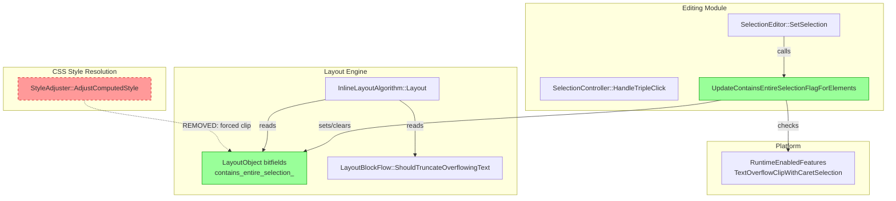
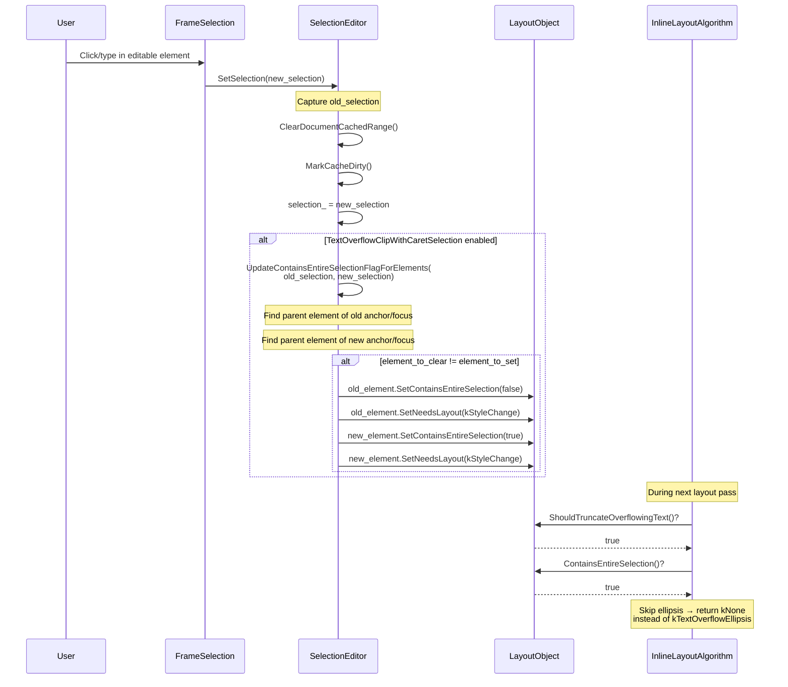
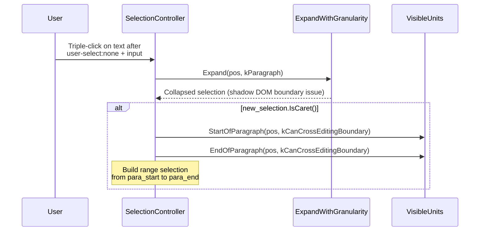

# High-Level Design: CL 7452739 — [Editing] Control text truncation based on caret selection

**CL URL:** https://chromium-review.googlesource.com/c/chromium/src/+/7452739  
**Author:** Shweta Bindal (shwetabindal@microsoft.com)  
**Bug:** [crbug.com/40731275](https://crbug.com/40731275)  
**Date:** 2026-02-09  

---

## 1. Executive Summary

This CL replaces a legacy hack in `StyleAdjuster` that forced `text-overflow: clip` on focused input placeholders with a principled, selection-aware mechanism for suppressing ellipsis truncation during editing. Previously, when a user focused an `<input>` element with `text-overflow: ellipsis`, the style adjuster would retroactively mutate the computed style to `clip` — an approach limited to input placeholders and invisible to `contenteditable` elements. This CL introduces a `ContainsEntireSelection` bitfield on `LayoutObject`, propagated by `SelectionEditor::SetSelection()`, and consumed by `InlineLayoutAlgorithm` to skip ellipsis truncation when any block contains a caret or selection. The result is a general-purpose solution that works uniformly across `<input>`, `<textarea>`, and `contenteditable` elements, aligning Chromium's behavior with the CSS Overflow Level 3 spec's permissive language on user-interaction ellipsis suppression. The feature is gated behind the `TextOverflowClipWithCaretSelection` runtime flag (status: `test`).

---

## 2. Architecture Overview

### 2.1 Affected Components/Modules

| Component | File(s) | Role |
|---|---|---|
| **CSS Style Resolution** | `style_adjuster.cc` | Removal of legacy placeholder hack |
| **Editing / Selection** | `selection_editor.cc`, `selection_editor.h`, `selection_controller.cc` | Selection state propagation and paragraph expansion fix |
| **Layout (Inline)** | `inline_layout_algorithm.cc` | Consuming selection state to suppress ellipsis |
| **Layout Core** | `layout_object.h` | New `ContainsEntireSelection` bitfield |
| **Platform Features** | `runtime_enabled_features.json5` | Feature flag definition |
| **Web Tests** | Multiple WPT + layout test files | Verification |

### 2.2 Component Diagram



### 2.3 Architectural Fit

The change moves ellipsis-suppression logic from the **style resolution layer** (where it was incorrectly mutating computed style) to the **layout layer** (where it checks a runtime bitfield set by the editing subsystem). This follows Chromium's established pattern of layout objects carrying boolean state flags that affect rendering decisions, consistent with existing bitfields like `IsMulticolContainer`, `HasSVGTextDescendants`, etc.

---

## 3. Design Goals & Non-Goals

### Goals

1. **Remove the StyleAdjuster hack** — Computed style should remain faithful to author intent; ellipsis suppression should be a layout-time decision, not a style mutation.
2. **Generalize to all editable content** — Support `contenteditable` divs, `<textarea>`, and `<input>` uniformly, not just input placeholders.
3. **Selection-aware** — Only suppress ellipsis when a caret/selection is actually present in the element, not merely when it has focus.
4. **Spec-aligned** — Implement the CSS Overflow L3 §5.1 "user interaction with ellipsis" permission: "the user agent **may** treat `text-overflow: ellipsis` as `text-overflow: clip`" during user interaction.
5. **Safe rollout** — Gate behind `TextOverflowClipWithCaretSelection` runtime flag (status: `test`).

### Non-Goals

- **Range selection styling** — This CL only tracks whether the element "contains" the entire selection (anchor+focus in same parent). It does not handle partial/cross-element selections differently.
- **text-overflow: string** — Only `ellipsis` is affected; custom string overflow values are not addressed.
- **Scroll-into-view behavior** — The CL does not change caret scrolling or auto-scroll behavior within truncated elements.
- **IME composition handling** — Although baseline images for composition-underline tests are updated, no IME-specific logic is changed.
- **`<input>` placeholder-specific behavior** — The old hack specifically targeted placeholders; this CL intentionally removes that special case without replacing it with placeholder-specific logic.

---

## 4. System Interactions

### 4.1 Main Flow: Selection Change → Ellipsis Suppression



### 4.2 Secondary Flow: Triple-Click Paragraph Selection Fix (Bug 446113738)



### 4.3 IPC/Mojo Interactions

**None.** All changes are within the Blink renderer process. The selection state propagation and layout invalidation are entirely in-process operations within the same frame.

---

## 5. API & Interface Changes

### 5.1 New Public Interfaces

| Interface | Location | Description |
|---|---|---|
| `LayoutObject::ContainsEntireSelection()` | `/third_party/blink/renderer/core/layout/layout_object.h#L3404` | Getter for new bitfield indicating selection presence |
| `LayoutObject::SetContainsEntireSelection(bool)` | `/third_party/blink/renderer/core/layout/layout_object.h#L3408` | Setter for the bitfield |
| `SelectionEditor::UpdateContainsEntireSelectionFlagForElements()` | `/third_party/blink/renderer/core/editing/selection_editor.h#L55` | Public method to update selection flag on layout objects when selection changes |

### 5.2 Modified Interfaces

| Interface | Change |
|---|---|
| `SelectionEditor::SetSelection()` | Now captures old selection before update and calls `UpdateContainsEntireSelectionFlagForElements()` when feature flag is enabled |
| `InlineLayoutAlgorithm` line-clamp evaluation | Added `!node_.GetLayoutBlockFlow()->ContainsEntireSelection()` guard before returning `kTextOverflowEllipsis` |

### 5.3 Removed/Deprecated Interfaces

| Interface | Change |
|---|---|
| `StyleAdjuster` placeholder text-overflow override | 18-line block removed from `/third_party/blink/renderer/core/css/resolver/style_adjuster.cc#L1291` that forced `text-overflow: clip` for focused input placeholders |

### 5.4 New Runtime Feature Flag

```json
{
  "name": "TextOverflowClipWithCaretSelection",
  "status": "test"
}
```

- **Status `test`**: Enabled only in web test environments and via `--enable-blink-features=TextOverflowClipWithCaretSelection`. Not enabled by default in production builds.

---

## 6. Dependencies

### 6.1 What This Code Depends On

| Dependency | Usage |
|---|---|
| `LayoutObject` bitfield infrastructure | `ADD_BOOLEAN_BITFIELD` macro for `contains_entire_selection_` |
| `RuntimeEnabledFeatures` | Feature flag gating |
| `SelectionInDOMTree` | Old/new selection comparison |
| `ComputedStyle::TextOverflow()` | Checked to determine if layout invalidation is needed |
| `LayoutInvalidationReason::kStyleChange` | Used to trigger re-layout when selection flag changes |
| `ElementTraversal`, `Range` | New includes in `selection_editor.cc` (though `CollectElementsFromSelection` declared but not defined in the diff) |
| `VisibleUnits` (StartOfParagraph, EndOfParagraph) | New dependency in `selection_controller.cc` for triple-click fix |

### 6.2 What Depends on This Code

| Dependent | Impact |
|---|---|
| `InlineLayoutAlgorithm` | Now reads `ContainsEntireSelection()` to decide ellipsis rendering |
| All existing ellipsis composition tests | Baseline images updated across Linux, Mac, Win platforms due to selection-aware rendering changes |
| Future text-overflow features | This pattern (layout-time flag checking) can be extended for other interaction-aware truncation behaviors |

### 6.3 Version/Compatibility

- **Backward compatible** when flag is disabled (default in production).
- The removal of the `StyleAdjuster` hack changes behavior for focused input placeholders unconditionally (not behind the flag), which is a **behavioral change**.

---

## 7. Risks & Mitigations

### 7.1 Risk Assessment

| Risk | Severity | Likelihood | Mitigation |
|---|---|---|---|
| **StyleAdjuster removal is unconditional** — The 18-line hack removal is not behind the feature flag, changing behavior for all users on focused input placeholders immediately | 🔴 High | Medium | The old behavior was a known hack with a TODO to fix properly (crbug.com/814954). However, removing it without the new mechanism being enabled by default creates a **gap**: focused input placeholders will now show ellipsis until the flag is enabled in stable. |
| **`ContainsEntireSelection` only checks same-parent** — The flag is only set when anchor and focus share the same `parentElement()`. Cross-element selections won't suppress ellipsis. | 🟡 Medium | Medium | Acceptable for the common case (caret placement). Range selections spanning elements are an edge case that can be addressed later. |
| **Layout invalidation on every selection change** — `SetNeedsLayout(kStyleChange)` is triggered whenever selection moves between elements with non-clip text-overflow | 🟡 Medium | Medium | The early-exit when `element_to_clear == element_to_set` avoids unnecessary work for caret movement within the same element. However, rapid selection changes (e.g., mouse drag across elements) could cause excessive re-layouts. |
| **Memory overhead** — New bitfield in `LayoutObject` | 🟢 Low | Low | Single boolean bitfield; negligible memory impact on every layout object. The bitfield struct likely already has padding bits available. |
| **`CollectElementsFromSelection` declared but undefined** — The header declares this private method, but no definition appears in the diff | 🟡 Medium | High | This is either dead code from an earlier iteration or defined elsewhere. If truly undefined, it will cause a linker error. **Needs verification.** |
| **WPT ref tests use `text-overflow: clip` as reference** — The reference files set `text-overflow: clip` to show expected "no ellipsis" rendering, which is correct only if the caret suppresses ellipsis completely | 🟢 Low | Low | This is the correct approach per the spec. |
| **Triple-click fix (Bug 446113738) is bundled** — Unrelated paragraph-expansion fix is included in the same CL | 🟡 Medium | Low | Should ideally be a separate CL for independent review and rollback capability. |

### 7.2 Backward Compatibility

- **With flag disabled (default)**: The `UpdateContainsEntireSelectionFlagForElements()` call is skipped. `ContainsEntireSelection()` defaults to `false`. The only behavioral change is the removal of the `StyleAdjuster` hack for input placeholders.
- **With flag enabled**: Editable elements with caret will no longer show ellipsis. This is the intended new behavior.
- **Concern**: The `StyleAdjuster` removal and the new flag-gated mechanism create a **transitional gap** where focused input placeholders may show ellipsis when they previously didn't, until the flag reaches `stable`.

### 7.3 Spec Compliance

The CSS Overflow Level 3 spec (§5.1, "user interaction with ellipsis") states:

> "When the user is interacting with content (e.g. editing, selecting, scrolling), the user agent **may** treat `text-overflow: ellipsis` as `text-overflow: clip`."

This is permissive ("may"), not mandatory. The CL's approach of suppressing ellipsis during caret presence is **spec-compliant**. However, the spec also notes:

> "Selecting the ellipsis should select the ellipsed text."

The CL does not change selection behavior for the ellipsis glyph itself; this is orthogonal and addressed separately.

The WPT tests reference `https://drafts.csswg.org/css-overflow/#ellipsis-interaction`, which is the correct spec anchor.

---

## 8. Testing Strategy

### 8.1 Test Coverage Summary

| Test Type | File | What It Tests |
|---|---|---|
| **C++ Unit Test** | `/third_party/blink/renderer/core/editing/selection_controller_test.cc` | `ExpandWithGranularityWithInputInUserSelectNone` — verifies triple-click paragraph expansion with `<input>` inside `user-select:none` |
| **WPT Ref Test** | `/third_party/blink/web_tests/external/wpt/css/css-overflow/text-overflow-ellipsis-editable-div-with-caret.html` | Verifies ellipsis suppression in `contenteditable` div with caret |
| **WPT Ref Test** | `/third_party/blink/web_tests/external/wpt/css/css-overflow/text-overflow-ellipsis-textarea-with-caret.html` | Verifies ellipsis suppression in `<textarea>` with caret |
| **Layout Test** | `/third_party/blink/web_tests/editing/selection/select-text-overflow-ellipsis-copy-paste.html` | Verifies mouse drag selection extends beyond visible ellipsis area; tests copy-paste of truncated text |
| **Baseline Updates** | Multiple platform-specific PNG files | Updated expected images for composition-underline tests affected by selection-aware rendering |

### 8.2 Testing Gaps & Concerns

| Gap | Severity | Description |
|---|---|---|
| **No unit test for `UpdateContainsEntireSelectionFlagForElements`** | 🔴 High | The core new method that manages the `ContainsEntireSelection` bitfield has no direct unit test. It is only indirectly tested via visual WPT ref tests. A unit test should verify: (a) flag is set when selection enters an element, (b) flag is cleared when selection leaves, (c) flag is not changed when selection moves within the same element, (d) layout invalidation occurs only when needed. |
| **No test for `<input>` with `text-overflow: ellipsis`** | 🔴 High | The old test (`text-overflow-input-focus-placeholder.html`) was deleted but no WPT replacement covers the `<input>` + placeholder + focus scenario. The new WPT tests cover `contenteditable` div and `<textarea>` but not `<input>`. |
| **No test for selection-clearing (blur)** | 🟡 Medium | No test verifies that ellipsis reappears when the element loses focus/selection. |
| **No test for cross-element selection** | 🟡 Medium | No test covers the case where anchor and focus are in different parents (flag should not be set). |
| **No test for flag behavior with feature disabled** | 🟡 Medium | No test verifies that the old behavior is preserved when `TextOverflowClipWithCaretSelection` is disabled. |
| **`CollectElementsFromSelection` is declared but unused/undefined** | 🟡 Medium | Dead declaration in `selection_editor.h` — no tests reference it, and no implementation exists in the diff. |
| **Triple-click fix lacks WPT coverage** | 🟡 Medium | The `selection_controller.cc` fix for bug 446113738 has a C++ unit test but no WPT test for interop verification. |
| **Copy-paste test relies on `eventSender`** | 🟢 Low | `select-text-overflow-ellipsis-copy-paste.html` uses `window.eventSender` which is Chromium-specific; it gracefully degrades but cannot run in other browsers. |
| **Ref tests have no newline at EOF** | 🟢 Low | Several new HTML files are missing trailing newlines (style nit). |

### 8.3 Testability Assessment

**Overall testability: Moderate.** The core behavioral change (ellipsis suppression) is visually verifiable via ref tests, which is appropriate for rendering changes. However, the **internal state management** (`ContainsEntireSelection` flag lifecycle) lacks unit-level verification. The `UpdateContainsEntireSelectionFlagForElements` method is public and could be tested directly in `selection_editor_test.cc` or an existing editing test fixture.

**Recommended additional tests:**

1. **Unit test for `ContainsEntireSelection` flag lifecycle** — Verify set/clear/no-change transitions with explicit selection construction.
2. **WPT ref test for `<input type="text">` with ellipsis** — Replace the deleted `text-overflow-input-focus-placeholder.html` test.
3. **WPT ref test for blur/unfocus** — Verify ellipsis restoration after caret removal.
4. **Unit test with feature flag disabled** — Verify no layout invalidation occurs.

---

## Appendix A: Key Code References

| File | Lines (approx.) | Description |
|---|---|---|
| `/third_party/blink/renderer/core/css/resolver/style_adjuster.cc#L1291` | Deleted L1291-L1308 | Removed StyleAdjuster hack |
| `/third_party/blink/renderer/core/editing/selection_editor.cc#L140` | New L140-L215 | `SetSelection` modification + `UpdateContainsEntireSelectionFlagForElements` |
| `/third_party/blink/renderer/core/editing/selection_editor.h#L55` | New L55-L61 | Public method declaration |
| `/third_party/blink/renderer/core/editing/selection_controller.cc#L1087` | New L1087-L1106 | Triple-click paragraph expansion fallback |
| `/third_party/blink/renderer/core/layout/layout_object.h#L3404` | New L3404-L3412 | `ContainsEntireSelection` getter/setter |
| `/third_party/blink/renderer/core/layout/layout_object.h#L4210` | New L4210 | Bitfield declaration |
| `/third_party/blink/renderer/core/layout/inline/inline_layout_algorithm.cc#L346` | Modified L346-L347 | Added `!ContainsEntireSelection()` guard |
| `/third_party/blink/renderer/platform/runtime_enabled_features.json5#L5322` | New L5322-L5325 | Feature flag |

## Appendix B: Bundled Bug Fix

This CL bundles a fix for **[crbug.com/446113738](https://crbug.com/446113738)** — triple-click after `user-select:none` content with `<input>` elements only selected text after the click position. The fix in `selection_controller.cc` adds a fallback that uses `StartOfParagraph`/`EndOfParagraph` with `kCanCrossEditingBoundary` when `ExpandWithGranularity` produces a collapsed selection due to shadow DOM boundaries. This fix is **not gated behind the feature flag** and applies unconditionally.

There's still a trailing line. Let me fix that.

