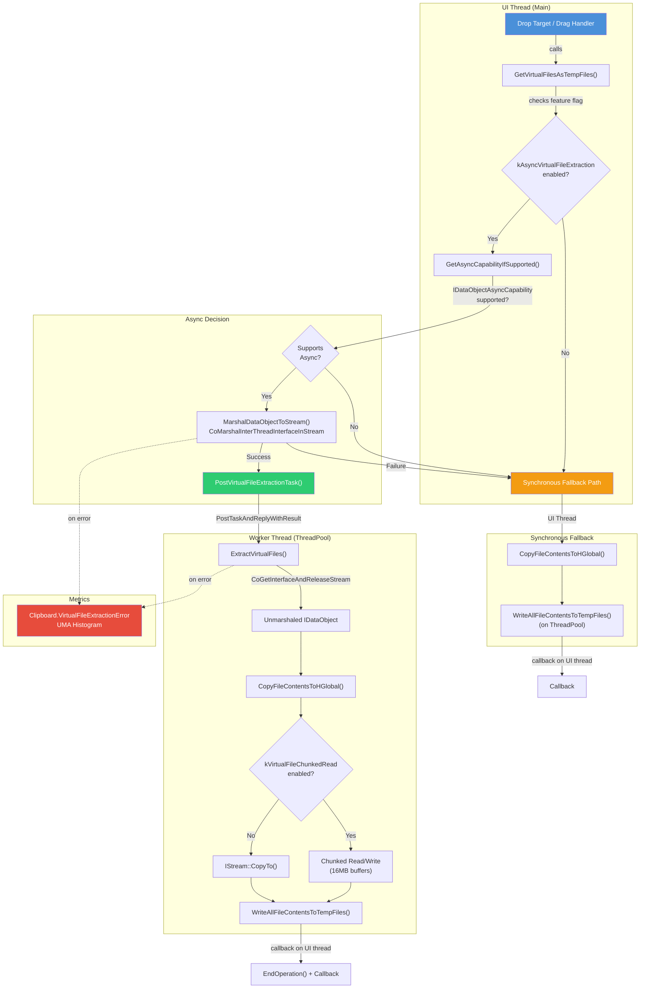
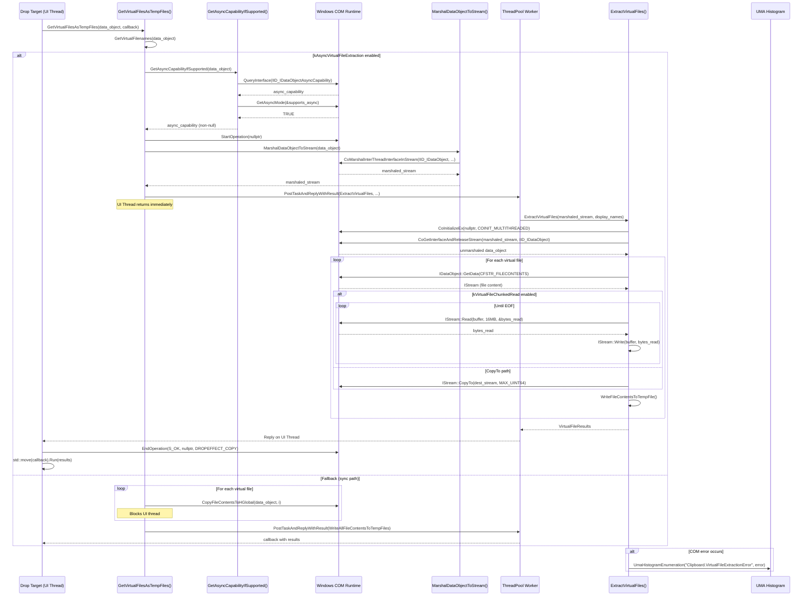

# High-Level Design: Add Async Extraction and Chunked Read for Virtual File Drag-Drop

**CL:** [7512918](https://chromium-review.googlesource.com/c/chromium/src/+/7512918)
**Author:** Sambamurthy Bandaru (sambamurthy.bandaru@microsoft.com)
**Status:** NEW (Code-Review+1 from Prashant Nevase)
**Bug:** [427093055](https://crbug.com/427093055)

---

## 1. Executive Summary

This CL addresses a UI-thread blocking problem that occurs when users drag virtual files (e.g., from Windows zip folders or Outlook attachments) into Chromium on Windows. The current implementation of `GetVirtualFilesAsTempFiles()` in `clipboard_util_win.cc` performs file extraction synchronously on the UI thread, causing noticeable jank. This change introduces two independently-controllable feature-flagged improvements: (1) **async extraction** using COM marshaling to offload `IDataObject` access to a background thread via `IDataObjectAsyncCapability`, and (2) **chunked reads** replacing the slow `IStream::CopyTo()` with explicit 16MB `Read/Write` loops to avoid HGLOBAL-backed stream performance pitfalls. A new UMA histogram (`Clipboard.VirtualFileExtractionError`) is also added to monitor COM failures in production. Both features are enabled by default and designed to gracefully fall back to the existing synchronous path if unsupported or on failure.

---

## 2. Architecture Overview

### Affected Chromium Components/Modules

| Component | Path | Role |
|-----------|------|------|
| **Clipboard Utilities (Windows)** | `ui/base/clipboard/clipboard_util_win.cc` | Core implementation — virtual file extraction logic |
| **UI Base Features** | `ui/base/ui_base_features.{cc,h}` | Feature flag declarations for `kAsyncVirtualFileExtraction` and `kVirtualFileChunkedRead` |
| **UMA Histograms** | `tools/metrics/histograms/metadata/storage/{enums,histograms}.xml` | Metrics definitions for error tracking |
| **OS Exchange Data (Tests)** | `ui/base/dragdrop/os_exchange_data_win_unittest.cc` | Unit tests for the new async+chunked path |

### How It Fits into Existing Architecture

The change is localized entirely within the `ui/base` layer's Windows-specific clipboard/drag-drop utilities. It does not alter any public API signatures (the `GetVirtualFilesAsTempFiles` function signature changes only its internal type alias). The async path leverages Chromium's `base::ThreadPool` for background work and Windows COM marshaling APIs for cross-thread `IDataObject` access. The chunked read path is an alternative I/O strategy within the existing `CopyFileContentsToHGlobal` function.

### Component Diagram

---

## 3. Design Goals & Non-Goals

### Goals

1. **Eliminate UI-thread blocking** during virtual file extraction by offloading the entire `IDataObject` interaction (data retrieval + temp file writing) to a background thread.
2. **Improve I/O throughput** for stream-backed virtual files by replacing `IStream::CopyTo()` with explicit chunked `Read/Write` using 16MB buffers, avoiding HGLOBAL reallocation overhead.
3. **Maintain backward compatibility** — both features are guarded by independent feature flags and fall back gracefully to the existing synchronous path.
4. **Add observability** for COM-related failures in the async path via UMA histograms.

### Non-Goals

- **Changing the public API surface** of `GetVirtualFilesAsTempFiles()` or `GetVirtualFilenames()` — the callback signature uses an internal type alias but remains structurally identical.
- **Supporting non-Windows platforms** — this is entirely Windows-specific COM/OLE infrastructure.
- **Streaming/progressive delivery** — files are still fully extracted to temp files before the callback fires; there is no partial/incremental notification.
- **Cancellation support** — the async extraction cannot be cancelled once started.
- **Memory-mapped or zero-copy I/O** — the chunked approach still uses heap-allocated buffers.

---

## 4. System Interactions

### Main Flow: Async Virtual File Extraction

### IPC/Mojo Interactions

This CL does **not** involve any IPC or Mojo interfaces. All interactions are within the browser process, between the UI thread and ThreadPool worker threads, using Windows COM inter-thread marshaling (`CoMarshalInterThreadInterfaceInStream` / `CoGetInterfaceAndReleaseStream`).

---

## 5. API & Interface Changes

### New Internal Interfaces

| Symbol | Location | Description |
|--------|----------|-------------|
| `VirtualFileResults` (type alias) | `ui/base/clipboard/clipboard_util_win.cc` | `std::vector<std::pair<base::FilePath, base::FilePath>>` — replaces inline type for readability |
| `VirtualFileExtractionError` (enum) | `ui/base/clipboard/clipboard_util_win.cc` | Histogram enum with values: `kCoInitializeExFailed`, `kCoGetInterfaceAndReleaseStreamFailed`, `kCoMarshalInterThreadInterfaceInStreamFailed` |
| `ExtractVirtualFiles()` | `ui/base/clipboard/clipboard_util_win.cc` | Worker-thread function: unmarshals `IDataObject`, extracts files, writes to temp |
| `GetAsyncCapabilityIfSupported()` | `ui/base/clipboard/clipboard_util_win.cc` | Checks if `IDataObject` supports `IDataObjectAsyncCapability` |
| `MarshalDataObjectToStream()` | `ui/base/clipboard/clipboard_util_win.cc` | Marshals `IDataObject` for cross-thread access |
| `PostVirtualFileExtractionTask()` | `ui/base/clipboard/clipboard_util_win.cc` | Posts extraction work to `base::ThreadPool` |

### New Feature Flags

| Flag | File | Default |
|------|------|---------|
| `features::kAsyncVirtualFileExtraction` | `ui/base/ui_base_features.{cc,h}` | `FEATURE_ENABLED_BY_DEFAULT` |
| `features::kVirtualFileChunkedRead` | `ui/base/ui_base_features.{cc,h}` | `FEATURE_ENABLED_BY_DEFAULT` |

### New UMA Histogram

| Histogram | Enum | Expiry |
|-----------|------|--------|
| `Clipboard.VirtualFileExtractionError` | `VirtualFileExtractionError` | 2026-08-04 |

### Modified Interfaces

- **`GetVirtualFilesAsTempFiles()`** — callback parameter type changed from `std::vector<std::pair<base::FilePath, base::FilePath>>` to `VirtualFileResults` (semantically identical, type alias only). No behavioral change for callers.
- **`WriteAllFileContentsToTempFiles()`** — return type changed to use `VirtualFileResults` alias. Internal only.

### Deprecated Interfaces

None.

---

## 6. Dependencies

### What This Code Depends On

| Dependency | Type | Notes |
|------------|------|-------|
| `IDataObjectAsyncCapability` (COM) | Windows SDK (`<shldisp.h>`) | Newly included; provides `StartOperation`/`EndOperation`/`GetAsyncMode`/`InOperation` |
| `CoMarshalInterThreadInterfaceInStream` | Windows COM API | Marshals COM interface for cross-thread access |
| `CoGetInterfaceAndReleaseStream` | Windows COM API | Unmarshals COM interface on worker thread |
| `CoInitializeEx` | Windows COM API | Initializes COM apartment on worker thread (MTA) |
| `base::ThreadPool` | Chromium base | Runs extraction on background thread |
| `base::FeatureList` | Chromium base | Feature flag checks |
| `base::UmaHistogramEnumeration` | Chromium base | Metrics recording |
| `Microsoft::WRL::ComPtr` | WRL | Smart pointer for COM objects |

### What Depends On This Code

| Dependent | Relationship |
|-----------|-------------|
| `OSExchangeDataProviderWin` | Calls `GetVirtualFilesAsTempFiles()` during drop handling |
| `WebContentsViewAura` / Drop targets | Indirect consumer via `OSExchangeData::GetVirtualFilesAsTempFiles()` |
| Content layer drag-drop handlers | Receive the extracted temp file paths via callback |

### Version/Compatibility

- Requires Windows SDK with `<shldisp.h>` support for `IDataObjectAsyncCapability` (available since Windows Vista / IE 5+).
- No minimum Windows version increase — the code gracefully handles `QueryInterface` failure if the interface is not available.

---

## 7. Risks & Mitigations

### Risk 1: COM Threading Model Mismatches
**Risk:** The worker thread initializes COM as MTA (`COINIT_MULTITHREADED`), but the source `IDataObject` may have been created in an STA. COM marshaling handles this, but subtle issues could arise with certain data object implementations.
**Mitigation:** COM marshaling via `CoMarshalInterThreadInterfaceInStream`/`CoGetInterfaceAndReleaseStream` is the standard Windows pattern for cross-apartment access. Errors are caught and reported via UMA histogram.

### Risk 2: Data Object Lifetime / Reentrancy
**Risk:** The `IDataObject` is accessed on a worker thread after the UI thread returns. If the drop source releases the object or the drag operation is cancelled, the unmarshaled proxy could become invalid.
**Mitigation:** COM marshaling creates a proxy that maintains a reference. `StartOperation()` signals to the data source that async work is in progress. `EndOperation()` is always called on completion (including on failure paths).

### Risk 3: Memory Pressure from 16MB Chunked Buffers
**Risk:** Allocating a 16MB buffer per file extraction could be problematic on memory-constrained systems, especially with multiple concurrent extractions.
**Mitigation:** The 16MB buffer is allocated once per file (not per chunk) and freed after extraction. The previous `CopyTo()` path also had memory issues due to HGLOBAL reallocation. The net memory impact is comparable or better.

### Risk 4: Feature Flag Interactions
**Risk:** The two feature flags are independent — async extraction can be enabled without chunked reads and vice versa. The chunked read path applies to *both* the async and sync code paths (it's in `CopyFileContentsToHGlobal`), so disabling async while keeping chunked reads still provides I/O benefits.
**Mitigation:** This independence is by design and both paths are tested.

### Risk 5: Flaky Test (Observed in PS1)
**Risk:** The `VirtualFilesAsyncChunkedCopy` test was flaky on `win-rel` in patch set 1 (1 failure in 20 runs).
**Mitigation:** Test was stabilized in patch set 2 (passed dry run). Uses `base::test::RunUntil` polling pattern instead of fixed waits.

### Backward Compatibility

- **Full backward compatibility** — both features fall back to the existing synchronous path if:
  - Feature flags are disabled
  - `IDataObjectAsyncCapability` is not supported by the data object
  - COM marshaling fails
- No changes to public API signatures visible to callers.

---

## 8. Testing Strategy

### Unit Test Coverage

A new test `VirtualFilesAsyncChunkedCopy` is added in `ui/base/dragdrop/os_exchange_data_win_unittest.cc` that exercises the combined async + chunked path:

| Test Aspect | Coverage |
|-------------|----------|
| **Large file (50MB)** | Exercises multiple 16MB chunk iterations (4 chunks) |
| **Async lifecycle** | Verifies `StartOperation()` is called (via `InOperation()` polling), `EndOperation()` called after completion |
| **Data integrity** | Reads back the extracted temp file and compares byte-for-byte with the original 50MB content |
| **COM initialization** | Uses `ScopedCOMInitializer` to set up COM apartment |
| **Async completion** | Uses `base::test::RunUntil` to wait for async callback without fixed sleeps |

### Missing Test Coverage (Potential Gaps)

| Scenario | Status |
|----------|--------|
| Async extraction fallback when `IDataObjectAsyncCapability` is not supported | Not explicitly tested in this CL (covered by existing sync tests) |
| COM marshaling failure path (histogram recording) | Not tested |
| `kVirtualFileChunkedRead` disabled (CopyTo path) | Covered by existing tests |
| `kAsyncVirtualFileExtraction` disabled | Covered by existing sync tests |
| Multiple virtual files in a single drop | Not tested in the new test (existing tests cover multi-file sync path) |
| Error histogram emissions | Not tested with histogram tester |

### Integration / Manual Testing

- Manual testing with Windows zip folder drag-drop and Outlook attachment drag-drop is expected for validation of the UI-thread responsiveness improvement.
- The CL passed the `win-rel` tryjob dry run on patch set 2.

---

## Appendix: File-Level Change Summary

| File | Changes |
|------|---------|
| `ui/base/clipboard/clipboard_util_win.cc` | +168/-18 — Core logic: async extraction path, chunked reads, COM marshaling helpers, error metrics |
| `ui/base/ui_base_features.h` | +6 — Feature flag declarations |
| `ui/base/ui_base_features.cc` | +3 — Feature flag definitions (both `FEATURE_ENABLED_BY_DEFAULT`) |
| `ui/base/dragdrop/os_exchange_data_win_unittest.cc` | +80 — New test `VirtualFilesAsyncChunkedCopy` |
| `tools/metrics/histograms/metadata/storage/enums.xml` | +6 — `VirtualFileExtractionError` enum definition |
| `tools/metrics/histograms/metadata/storage/histograms.xml` | +12 — `Clipboard.VirtualFileExtractionError` histogram definition |
