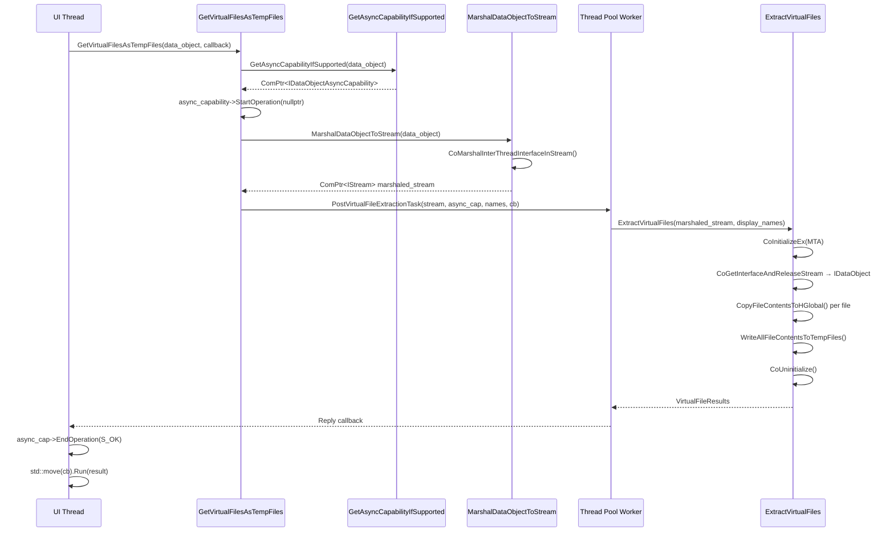
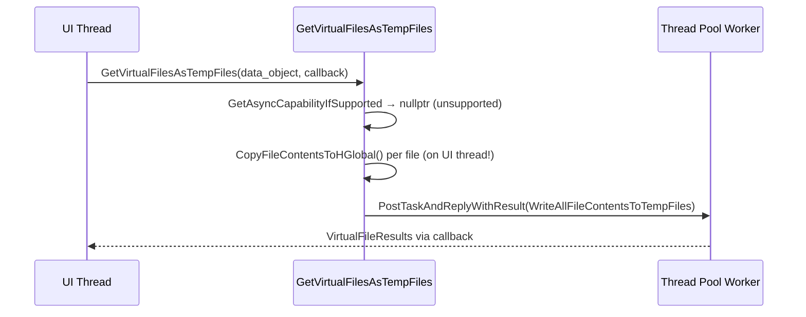
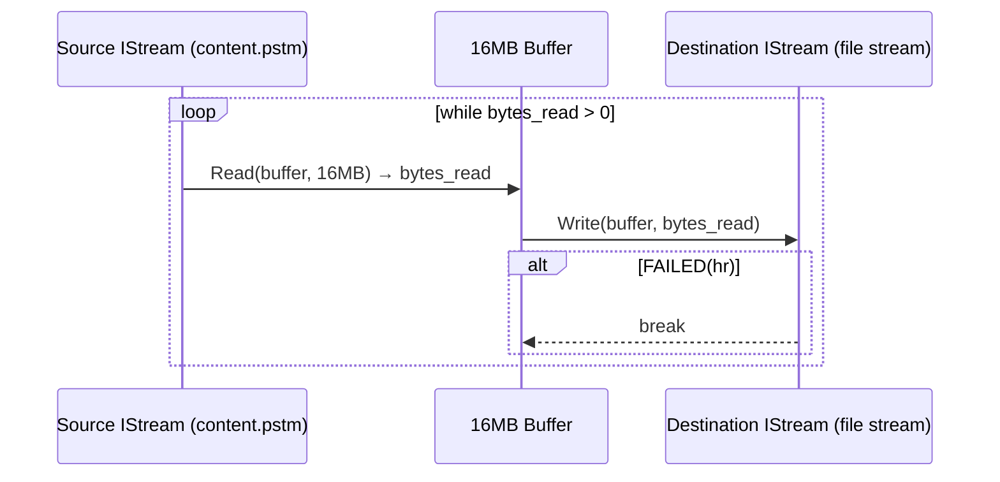
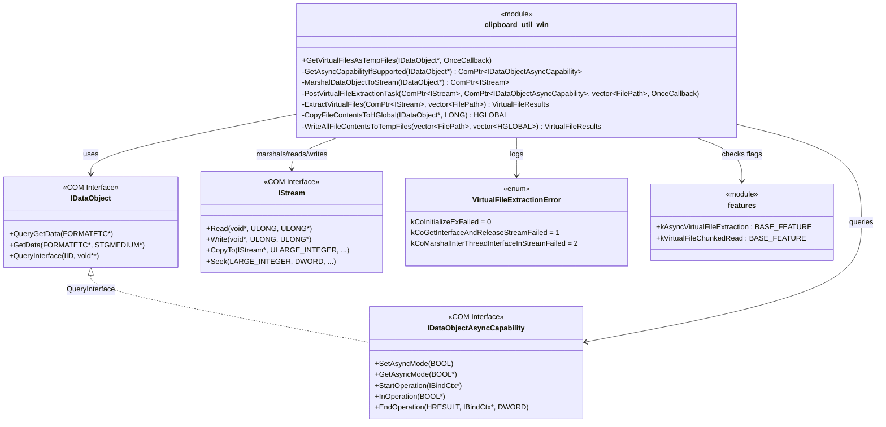
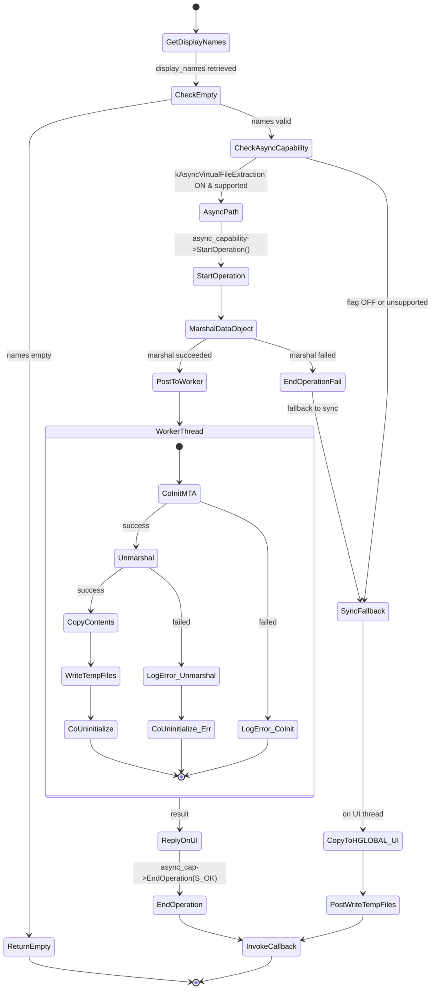
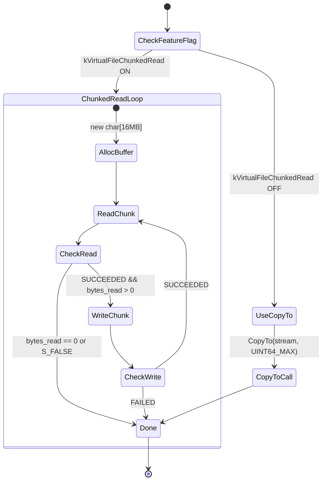

# Low-Level Design Review

**CL Number**: 7512918
**Model**: claude-opus-4.6
**Generated**: 2026-02-08T20:02:20.277373+00:00

---


I'll analyze the CL files and create a detailed Low-Level Design document.

Now let me also check the comments file for additional context:

Now I have all the data needed. Let me create the LLD document.

The LLD document has been saved to `lld.md` in the CL folder with complete analysis of all 6 files, including Mermaid diagrams for data flow, state transitions, and component relationships, plus implementation concerns and improvement suggestions.


# Low-Level Design: CL 7512918 — Add async extraction and chunked read for virtual file drag-drop

**CL URL:** https://chromium-review.googlesource.com/c/chromium/src/+/7512918
**Author:** Sambamurthy Bandaru (sambamurthy.bandaru@microsoft.com)
**Total Changes:** 6 files, +275/−18 lines

---

## 1. File-by-File Analysis

---

### 1.1 `ui/base/ui_base_features.h` (+6/−0)

**Purpose of changes:** Declares two new feature flags controlling the async extraction and chunked read behaviors.

**Key modifications:**
- Added `BASE_DECLARE_FEATURE(kAsyncVirtualFileExtraction)` with `COMPONENT_EXPORT(UI_BASE_FEATURES)`
- Added `BASE_DECLARE_FEATURE(kVirtualFileChunkedRead)` with `COMPONENT_EXPORT(UI_BASE_FEATURES)`

**New/Modified Functions:**

| Symbol | Purpose | Type |
|--------|---------|------|
| `kAsyncVirtualFileExtraction` | Feature flag for async COM-marshaled extraction on worker thread | `BASE_FEATURE` |
| `kVirtualFileChunkedRead` | Feature flag for chunked IStream read/write (16 MB) | `BASE_FEATURE` |

---

### 1.2 `ui/base/ui_base_features.cc` (+3/−0)

**Purpose of changes:** Defines the two feature flags, both enabled by default.

**Key modifications:**
- `BASE_FEATURE(kAsyncVirtualFileExtraction, base::FEATURE_ENABLED_BY_DEFAULT)`
- `BASE_FEATURE(kVirtualFileChunkedRead, base::FEATURE_ENABLED_BY_DEFAULT)`

Both flags are independently toggleable via `chrome://flags` or field trials.

---

### 1.3 `tools/metrics/histograms/metadata/storage/enums.xml` (+6/−0)

**Purpose of changes:** Registers the `VirtualFileExtractionError` enum for UMA histogram logging.

**Key modifications:**
- Added `<enum name="VirtualFileExtractionError">` with 3 values:

| Value | Label | Mapped C++ Enumerator |
|-------|-------|-----------------------|
| 0 | `CoInitializeEx failed` | `kCoInitializeExFailed` |
| 1 | `CoGetInterfaceAndReleaseStream failed` | `kCoGetInterfaceAndReleaseStreamFailed` |
| 2 | `CoMarshalInterThreadInterfaceInStream failed` | `kCoMarshalInterThreadInterfaceInStreamFailed` |

---

### 1.4 `tools/metrics/histograms/metadata/storage/histograms.xml` (+12/−0)

**Purpose of changes:** Declares the `Clipboard.VirtualFileExtractionError` histogram.

**Key modifications:**
- New histogram `Clipboard.VirtualFileExtractionError`
  - Type: enumerated (`VirtualFileExtractionError`)
  - Expiry: `2026-08-04`
  - Owners: `dcheng@chromium.org`, `src/ui/base/clipboard/OWNERS`
  - Records COM failures during async virtual file extraction on Windows

---

### 1.5 `ui/base/clipboard/clipboard_util_win.cc` (+168/−18) — **Core Implementation**

**Purpose of changes:** This is the main implementation file. It adds (a) async file extraction via COM marshaling to a worker thread, (b) chunked IStream read/write replacing `CopyTo()`, and (c) UMA error metrics.

#### New Includes
- `<shldisp.h>` — Provides `IDataObjectAsyncCapability` interface
- `"base/metrics/histogram_functions.h"` — For `base::UmaHistogramEnumeration`

#### New Type Alias

```cpp
using VirtualFileResults = std::vector<std::pair<base::FilePath, base::FilePath>>;
```

Replaces the previously inlined `std::vector<std::pair</*temp path*/ base::FilePath, /*display name*/ base::FilePath>>` with a named alias used across all functions.

#### New Enum

```cpp
enum class VirtualFileExtractionError {
  kCoInitializeExFailed = 0,
  kCoGetInterfaceAndReleaseStreamFailed = 1,
  kCoMarshalInterThreadInterfaceInStreamFailed = 2,
  kMaxValue = kCoMarshalInterThreadInterfaceInStreamFailed,
};
```

Follows Chromium histogram enum conventions (`kMaxValue` alias, stable numbering).

#### New/Modified Functions

| Function | Purpose | Parameters | Returns |
|----------|---------|------------|---------|
| `GetAsyncCapabilityIfSupported` | Checks if `IDataObject` supports `IDataObjectAsyncCapability` and async mode is enabled via feature flag | `IDataObject*` | `ComPtr<IDataObjectAsyncCapability>` (null if unsupported) |
| `MarshalDataObjectToStream` | Marshals `IDataObject` into a COM stream for cross-thread transfer | `IDataObject*` | `ComPtr<IStream>` (null on failure) |
| `ExtractVirtualFiles` | Worker-thread function: initializes COM (MTA), unmarshals `IDataObject`, copies file contents to HGLOBAL, writes temp files | `ComPtr<IStream> marshaled_stream, vector<FilePath> display_names` | `VirtualFileResults` |
| `PostVirtualFileExtractionTask` | Posts `ExtractVirtualFiles` to thread pool with reply callback that calls `EndOperation()` | `ComPtr<IStream>, ComPtr<IDataObjectAsyncCapability>, vector<FilePath>, OnceCallback` | `void` |
| `WriteAllFileContentsToTempFiles` *(modified)* | Return type changed to `VirtualFileResults` alias | (unchanged) | `VirtualFileResults` |
| `GetVirtualFilesAsTempFiles` *(modified)* | Orchestrates async vs. sync extraction path | `IDataObject*, OnceCallback<void(const VirtualFileResults&)>` | `void` |
| `CopyFileContentsToHGlobal` *(modified)* | Chunked read path added inside this function | (unchanged params) | `HGLOBAL` |

#### Chunked Read Logic (inside `CopyFileContentsToHGlobal`)

```
if kVirtualFileChunkedRead enabled:
    allocate 16MB buffer
    loop: Read(source, 16MB) → Write(dest, bytes_read)
    break on FAILED(hr) or bytes_read == 0
else:
    use original CopyTo() with max_bytes = UINT64_MAX
```

**Data Flow — Async Extraction Path:**



**Data Flow — Sync Fallback Path:**



**Data Flow — Chunked Read (inside `CopyFileContentsToHGlobal`):**



---

### 1.6 `ui/base/dragdrop/os_exchange_data_win_unittest.cc` (+80/−0)

**Purpose of changes:** Adds a test verifying the async + chunked copy path end-to-end with a 50 MB file.

**New includes:**
- `"base/test/run_until.h"` — For `base::test::RunUntil` (polling-based async wait)
- `"base/win/scoped_com_initializer.h"` — RAII COM initialization

**New Test:**

| Test | Purpose |
|------|---------|
| `OSExchangeDataWinTest::VirtualFilesAsyncChunkedCopy` | Validates the async extraction path with IDataObjectAsyncCapability, chunked 16 MB reads, and 50 MB file integrity |

**Test Flow:**
1. Initialize COM via `ScopedCOMInitializer`
2. Create a 50 MB file (`std::string(50*1024*1024, 'X')`)
3. Set virtual file contents as `TYMED_ISTREAM`
4. Enable async mode via `provider->async_operation()->SetAsyncMode(TRUE)`
5. Call `data.GetVirtualFilesAsTempFiles(callback)`
6. Poll with `RunUntil` — checks `InOperation()` on each iteration to verify `StartOperation()` was called
7. Assert `InOperation() == FALSE` after completion (verifies `EndOperation()` was called)
8. Verify temp file path, extension, and full 50 MB content integrity via `ReadFileToString`

---

## 2. Class/Component Diagram



---

## 3. State Diagram — GetVirtualFilesAsTempFiles Decision Flow



---

## 4. State Diagram — Chunked Read vs CopyTo



---

## 5. Implementation Concerns

### 5.1 Memory Management

- **16 MB heap allocation**: `std::unique_ptr<char[]> buffer(new char[kChunkSize])` allocates 16 MB on the heap each time `CopyFileContentsToHGlobal` is called with the chunked-read flag enabled. This is allocated once per file, not once per chunk, so it is efficient.
- **HGLOBAL lifecycle**: `CopyFileContentsToHGlobal` allocates global memory via `GlobalAlloc`. In the async path, these HGLOBALs are created on the worker thread and freed in `WriteAllFileContentsToTempFiles`. The lifecycle is correctly scoped.
- **COM stream ownership**: `CoGetInterfaceAndReleaseStream` releases the marshaled stream, and the code correctly calls `marshaled_data_object_stream.Detach()` after to avoid double-release. This is a subtle but correct pattern.

### 5.2 Thread Safety

- **COM apartment model**: The async path initializes COM as MTA (`COINIT_MULTITHREADED`) on the worker thread. This is correct for cross-thread COM access of marshaled interfaces.
- **Manual `CoInitializeEx`/`CoUninitialize`**: Not using Chromium's `ScopedCOMInitializer` RAII wrapper. If an exception or early return were added between `CoInitializeEx` and `CoUninitialize`, COM would leak. Currently safe because all error paths call `CoUninitialize()` explicitly, but fragile for future modifications. Using `base::win::ScopedCOMInitializer` would be safer.
- **`IDataObjectAsyncCapability` thread affinity**: `StartOperation()` is called on the UI thread, `EndOperation()` is called in the reply callback (also UI thread). This is correct per COM/OLE documentation.
- **`display_names` vector**: Passed by value (copied) into `PostTaskAndReplyWithResult` via `BindOnce`, ensuring thread-safe ownership transfer.

### 5.3 Performance Implications

- **Positive**: Async extraction avoids blocking the UI thread during large file extraction from sources like Outlook or Windows zip folders. The 16 MB chunk size avoids the pathological behavior of `IStream::CopyTo()` with HGLOBAL-backed streams that use 4–64 KB internal buffers.
- **`USER_BLOCKING` priority**: Both the async and sync fallback paths use `base::TaskPriority::USER_BLOCKING`, which is appropriate since the user is waiting for a drag-drop to complete.
- **50 MB test allocation**: The unit test allocates 50 MB of memory (`std::string(50*1024*1024, 'X')`). This could cause issues on memory-constrained CI environments. The prior patch set had a flaky failure in `win-rel` on this test.
- **UI thread still blocks in fallback**: When async is unsupported, `CopyFileContentsToHGlobal()` still runs on the UI thread (unchanged from before). This is the pre-existing behavior.

### 5.4 Error Handling

- **Histogram-only errors**: COM failures are logged via UMA histograms and `LOG(WARNING)`, and the function returns an empty result. The caller receives an empty `VirtualFileResults` vector, which silently drops the files — the user gets no feedback about the failure.
- **`EndOperation` error reporting**: On async marshal failure, `EndOperation(E_FAIL, nullptr, DROPEFFECT_NONE)` is called, and then execution falls through to the sync path. This is a good recovery strategy.
- **`EndOperation` always passes `S_OK`**: In `PostVirtualFileExtractionTask`, the reply lambda always calls `EndOperation(S_OK, ...)` regardless of whether `ExtractVirtualFiles` actually succeeded (returned empty results). This could misreport success to the data source.
- **Missing error for `CopyFileContentsToHGlobal` failures**: If individual file extraction fails within `ExtractVirtualFiles`, the null HGLOBAL is passed into `WriteAllFileContentsToTempFiles`, which then creates an empty/invalid temp file. No metric is emitted for this failure mode.

### 5.5 Maintainability

- **Feature flags**: Both features are independently toggleable, enabling safe rollout and easy rollback. Good practice.
- **Helper function decomposition**: The refactoring into `GetAsyncCapabilityIfSupported`, `MarshalDataObjectToStream`, and `PostVirtualFileExtractionTask` improves readability (addressed reviewer feedback).
- **Type alias**: `VirtualFileResults` cleans up verbose template types throughout the file.

---

## 6. Suggestions for Improvement

### 6.1 Use `ScopedCOMInitializer` in `ExtractVirtualFiles`

The manual `CoInitializeEx`/`CoUninitialize` pattern in `ExtractVirtualFiles` is error-prone. Replace with:

```cpp
base::win::ScopedCOMInitializer com_initializer(
    base::win::ScopedCOMInitializer::kMTA);
if (!com_initializer.Succeeded()) {
  // log error and return
}
// No need to call CoUninitialize; RAII handles it
```

This would eliminate two explicit `CoUninitialize()` calls and protect against future early-return bugs.

### 6.2 Report Actual Result in `EndOperation`

The reply lambda in `PostVirtualFileExtractionTask` always calls `EndOperation(S_OK, ...)`. It should check whether the result is empty/error:

```cpp
HRESULT op_result = result.empty() ? E_FAIL : S_OK;
DWORD effect = result.empty() ? DROPEFFECT_NONE : DROPEFFECT_COPY;
async_cap->EndOperation(op_result, nullptr, effect);
```

### 6.3 Consider `std::make_unique<char[]>` Over Raw `new`

```cpp
// Current:
std::unique_ptr<char[]> buffer(new char[kChunkSize]);
// Preferred (Chromium style):
auto buffer = std::make_unique<char[]>(kChunkSize);
```

`std::make_unique` value-initializes (zero-fills), which has negligible cost for a one-time 16 MB allocation and avoids any concerns about uninitialized-memory reads.

### 6.4 Add Metric for Per-File Extraction Failures

Currently, if `CopyFileContentsToHGlobal` returns null for a specific file in the async path, no histogram records this. Consider adding a `kFileContentCopyFailed` enumerator to `VirtualFileExtractionError`.

### 6.5 Test Coverage Gaps

- **No test for sync fallback path**: The test only exercises the async path (sets `SetAsyncMode(TRUE)`). A companion test with async mode disabled would verify the fallback.
- **No test for marshal failure recovery**: No test verifies that when `CoMarshalInterThreadInterfaceInStream` fails, the code correctly falls back to the synchronous path.
- **No test for chunked-read-off path**: The chunked read feature flag is always on by default; no test explicitly disables it to verify the `CopyTo()` path still works. Consider a parameterized test.
- **Flakiness concern**: The test was flagged as flaky in patch set 1 (`win-rel`). The 50 MB allocation and `RunUntil` polling pattern may contribute. Consider reducing the file size to ~20 MB (still >16 MB chunk, exercises two iterations) or using `RunLoop::QuitClosure` instead of polling.

### 6.6 Edge Cases Not Covered

| Edge Case | Current Handling | Risk |
|-----------|-----------------|------|
| Zero-byte virtual file | `bytes_read == 0` exits loop immediately; writes empty temp file | Low — benign |
| Source stream returns `S_FALSE` with partial data | `SUCCEEDED(S_FALSE) == true`, so loop continues if `bytes_read > 0` | Low — handled correctly |
| Source stream returns `S_OK` with `bytes_read == 0` (premature EOF) | Loop exits, possible truncated file | Medium — no error is reported |
| `Write()` writes fewer bytes than requested | Third param of `Write()` is `nullptr`, so partial writes are undetected | Medium — could silently truncate |
| Very large number of virtual files (>1000) | Sequential extraction in for-loop with individual HGLOBAL allocations | Medium — potential OOM or slowness |
| `CoGetInterfaceAndReleaseStream` succeeds but `data_object` is null | Caught by `!data_object` check | Low — handled |
| Thread pool shutdown during extraction | `ExtractVirtualFiles` may be interrupted mid-file | Low — standard Chromium behavior |

---

## 7. Summary

This CL adds two well-structured, independently-flagged improvements to virtual file drag-drop on Windows:

1. **Async extraction** moves COM data extraction off the UI thread using standard COM marshaling (`CoMarshalInterThreadInterfaceInStream` / `CoGetInterfaceAndReleaseStream`), with proper `StartOperation`/`EndOperation` lifecycle management.

2. **Chunked reads** replaces the problematic `IStream::CopyTo()` with explicit 16 MB Read/Write loops, avoiding HGLOBAL-backed stream performance issues.

The code is well-decomposed, follows Chromium conventions for feature flags and histograms, and has reasonable error handling with UMA metrics. Key areas for improvement are: using RAII for COM initialization, accurately reporting success/failure in `EndOperation`, detecting partial writes, and expanding test coverage for the fallback and error paths.
