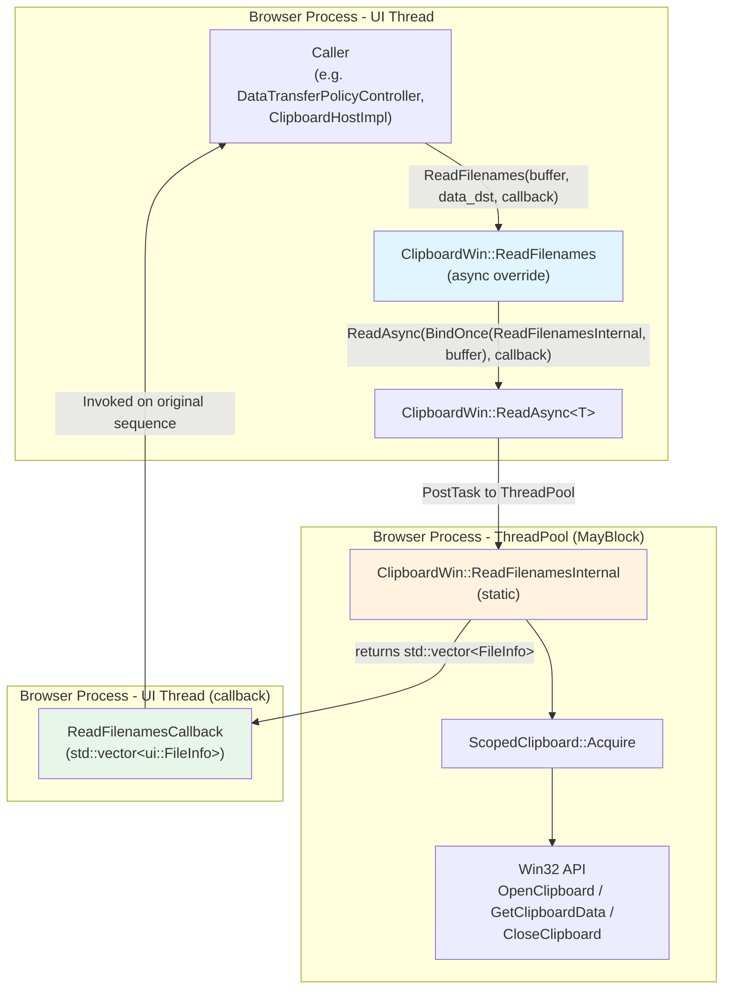
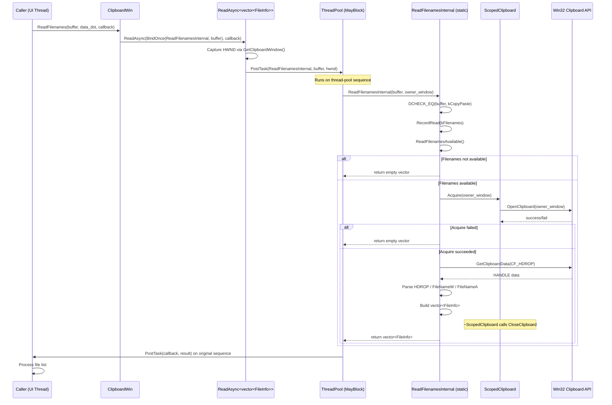
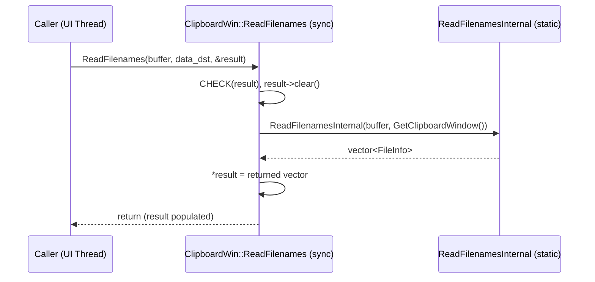

# High-Level Design: [Clipboard][Windows] Use async ReadFileNames with ThreadPool offloading

**CL:** [7556734](https://chromium-review.googlesource.com/c/chromium/src/+/7556734)
**Author:** Hewro Hewei (ihewro@chromium.org)
**Bug:** [458194647](https://crbug.com/458194647)
**Status:** NEW (Patch Set 12)

---

## 1. Executive Summary

This CL adds an asynchronous override of `ClipboardWin::ReadFilenames` that offloads the blocking Win32 clipboard access (`OpenClipboard`/`GetClipboardData`/`CloseClipboard`) from the UI thread to a `base::ThreadPool` sequenced task runner with `MayBlock` trait. The existing synchronous `ReadFilenames` is refactored into a `static` helper (`ReadFilenamesInternal`) that performs the actual Win32 work, and the new async override delegates to `ReadAsync(...)` which schedules `ReadFilenamesInternal` on the thread pool and posts the result back via callback. This is needed because Win32 clipboard operations are blocking system calls that can stall the UI thread and cause jank; moving them off the UI thread improves responsiveness, particularly when clipboard data is large or the clipboard owner is slow. The expected impact is reduced UI-thread latency for file-drop paste operations on Windows, with no behavioral change for callers that still use the synchronous path.

---

## 2. Architecture Overview

### Affected Components

| Component | Layer | Impact |
|---|---|---|
| `ui/base/clipboard/clipboard_win.cc` | Platform clipboard (Windows) | New async override + refactored internal helper |
| `ui/base/clipboard/clipboard_win.h` | Platform clipboard header | New method declarations |
| `ui/base/clipboard/clipboard.h` | Cross-platform clipboard base | Defines virtual `ReadFilenames` (async) — **not modified** |
| `base::ThreadPool` | Threading infrastructure | Used as execution context for blocking work |
| `ScopedClipboard` / Win32 API | OS integration | Acquired on thread-pool thread instead of UI thread |

### Component Diagram

### How It Fits into the Existing Architecture

Chromium's `Clipboard` base class (`ui/base/clipboard/clipboard.h`) defines both synchronous and asynchronous virtual methods for each clipboard format. The synchronous methods use output parameters (pointers), while async methods accept a callback. Platform implementations (`ClipboardWin`, `ClipboardX11`, `ClipboardOzone`, etc.) override the relevant methods. `ClipboardWin` already has a `ReadAsync<T>` template helper (used by `ReadText`, `ReadHTML`, `ReadPng`, etc.) that:

1. Captures the `HWND` clipboard window handle.
2. Posts the blocking work to a `SequencedTaskRunner` with `MayBlock`.
3. Posts the result back to the caller's sequence via the callback.

This CL extends that existing pattern to `ReadFilenames`, making it consistent with other already-async-ified read methods.

---

## 3. Design Goals & Non-Goals

### Goals

| # | Goal |
|---|------|
| G1 | **Move blocking Win32 clipboard I/O off the UI thread** for `ReadFilenames`, preventing jank. |
| G2 | **Follow the established `ReadAsync` pattern** used by `ReadText`, `ReadHTML`, `ReadPng`, `ReadBitmap`, etc. for consistency. |
| G3 | **Preserve the synchronous `ReadFilenames`** for callers that still need it (backward compatibility). |
| G4 | **Refactor the implementation into a `static` helper** (`ReadFilenamesInternal`) to maximize code reuse between sync and async paths. |
| G5 | **Add unit test coverage** for the new async path, including both non-empty and empty clipboard scenarios. |

### Non-Goals

| # | Non-Goal |
|---|----------|
| NG1 | **Removing the synchronous `ReadFilenames` override** — both sync and async paths coexist. |
| NG2 | **Changing other platform implementations** (X11, Ozone, Mac, etc.). |
| NG3 | **Changing callers** to switch from sync to async — that is a separate effort. |
| NG4 | **Modifying the `ReadAsync` template itself** or the thread-pool configuration. |
| NG5 | **Adding async support for `ReadAvailableTypes`** or other not-yet-async methods. |

---

## 4. System Interactions

### Main Flow: Async ReadFilenames

### Synchronous Fallback Flow

### IPC / Mojo Interactions

This CL does **not** directly modify any Mojo interfaces. However, the `ReadFilenames` methods are typically invoked by `ClipboardHostImpl` (in `content/browser/clipboard/clipboard_host_impl.cc`) which handles Mojo IPC from renderer-process `blink::ClipboardHost`. The async path allows `ClipboardHostImpl` to avoid blocking the browser-process IO/UI thread when servicing renderer clipboard requests, though the switch from sync to async at the call-site is outside the scope of this CL.

---

## 5. API & Interface Changes

### New Public Interface

| Method | Signature | Location |
|--------|-----------|----------|
| `ClipboardWin::ReadFilenames` (async override) | `void ReadFilenames(ClipboardBuffer buffer, const std::optional<DataTransferEndpoint>& data_dst, ReadFilenamesCallback callback) const override` | `ui/base/clipboard/clipboard_win.h` line ~62 |

This overrides the virtual method declared in `Clipboard` base class. The callback type is `ReadFilenamesCallback` which is `base::OnceCallback<void(std::vector<ui::FileInfo>)>`.

### New Private/Static Interface

| Method | Signature | Location |
|--------|-----------|----------|
| `ClipboardWin::ReadFilenamesInternal` (static) | `static std::vector<ui::FileInfo> ReadFilenamesInternal(ClipboardBuffer buffer, HWND owner_window)` | `ui/base/clipboard/clipboard_win.h` line ~147 |

This is a `static` method because it is posted to a thread-pool task runner and must not capture `this` (the `ClipboardWin` instance may not be alive when the task runs, and `Clipboard` instances are thread-affine).

### Modified Interfaces

| Method | Change | Location |
|--------|--------|----------|
| `ClipboardWin::ReadFilenames` (sync) | Refactored to delegate to `ReadFilenamesInternal`; `DCHECK` on `result` upgraded to `CHECK`; `DCHECK_EQ` on buffer moved into internal helper | `ui/base/clipboard/clipboard_win.cc` line ~681 |

### Deprecated Interfaces

None. The synchronous `ReadFilenames` remains available and functional.

---

## 6. Dependencies

### What This Code Depends On

| Dependency | Role | Notes |
|------------|------|-------|
| `Clipboard` base class (`ui/base/clipboard/clipboard.h`) | Defines virtual `ReadFilenames` (async) and `ReadFilenamesCallback` | Must declare the async virtual; already done in prior CLs |
| `ClipboardWin::ReadAsync<T>` template | Schedules work on thread pool, posts result back | Already exists; used by `ReadText`, `ReadHTML`, etc. |
| `base::ThreadPool` | Provides `SequencedTaskRunner` with `MayBlock` | Standard Chromium threading primitive |
| `ScopedClipboard` | RAII wrapper for `OpenClipboard`/`CloseClipboard` | Existing Win32 integration class |
| `clipboard_util::GetFilenames` | Parses `HDROP` into filename list | Existing utility |
| `ReadFilenamesAvailable()` (static) | Checks if clipboard contains filename formats | Existing static helper |
| Win32 API (`OpenClipboard`, `GetClipboardData`, `CloseClipboard`) | OS clipboard access | Blocking system calls — the reason for async |

### What Depends on This Code

| Dependent | Relationship | Notes |
|-----------|-------------|-------|
| `ClipboardHostImpl` (`content/browser/clipboard/`) | Calls `Clipboard::ReadFilenames` | Can switch to async override in follow-up CLs |
| `DataTransferPolicyController` | May call `ReadFilenames` for DLP checks | Sync path still available |
| `ClipboardWinTest` (unit tests) | Directly tests async and sync paths | Modified in this CL |
| Other async clipboard consumers (e.g. `ReadText`, `ReadHTML` callers) | Share the `ReadAsync` infrastructure | No change to their behavior |

### Version / Compatibility

- No feature flags or version gates. The async override is always available once compiled.
- The sync override is preserved, so no caller migration is forced.
- The `ReadFilenamesCallback` type must already be defined in the base `Clipboard` class (prerequisite satisfied by parent CLs in the series).

---

## 7. Risks & Mitigations

### Risk Assessment

| # | Risk | Severity | Likelihood | Mitigation |
|---|------|----------|------------|------------|
| R1 | **Thread-safety of `ReadFilenamesAvailable()`** — called from thread pool but checks global clipboard format state using `IsClipboardFormatAvailable` (Win32 API). | Medium | Low | `IsClipboardFormatAvailable` is documented as thread-safe by Microsoft; it does not require `OpenClipboard`. The existing `ReadText`/`ReadHTML` async paths already call similar static helpers from the thread pool. |
| R2 | **`RecordRead` (metrics) called off UI thread** — `RecordRead` is a static method that records UMA histograms. If it assumes UI-thread execution, this could be problematic. | Low | Low | UMA histogram recording in Chromium is thread-safe. Other async read methods (`ReadText`, `ReadHTML`) already call `RecordRead` from the thread pool. |
| R3 | **HWND lifetime** — `GetClipboardWindow()` returns an `HWND` that is captured and used on the thread pool. If the window is destroyed between capture and use, `OpenClipboard` will fail. | Low | Very Low | `ScopedClipboard::Acquire` handles `OpenClipboard` failure gracefully (returns empty result). The clipboard window is long-lived (tied to `ClipboardWin` instance lifetime). This is the same pattern used by all other async clipboard reads. |
| R4 | **Clipboard contention** — `OpenClipboard` may block if another application holds the clipboard lock. | Medium | Medium | This is exactly the scenario this CL addresses — by moving the blocking call to a thread pool, contention no longer blocks the UI thread. The `MayBlock` trait ensures the thread pool accommodates blocking. |
| R5 | **Behavior divergence between sync and async paths** — if one path has a bug the other doesn't. | Low | Low | Both paths now share `ReadFilenamesInternal`, ensuring identical parsing logic. The sync path calls it directly; the async path posts it to the thread pool. |

### Backward Compatibility

- **Full backward compatibility.** The synchronous `ReadFilenames` overload is preserved and unchanged in behavior (it now delegates to the same `ReadFilenamesInternal` helper).
- No callers are forced to migrate; the async path is opt-in via the callback-based overload.
- Minor change: `DCHECK(result)` upgraded to `CHECK(result)` in the sync path — this is strictly stricter and only crashes in cases that were already undefined behavior (null pointer dereference).

### Migration Strategy

No migration needed for this CL. Callers can optionally adopt the async `ReadFilenames` override at their discretion in follow-up CLs. This CL is part of a broader series that async-ifies all `ClipboardWin` read methods (see parent CLs for `ReadText`, `ReadHTML`, `ReadPng`, `ReadBitmap`, etc.).

---

## 8. Testing Strategy

### Tests Added in This CL

| Test | File | Purpose |
|------|------|---------|
| `ReadFilenamesAsyncReturnsWrittenData` | `ui/base/clipboard/clipboard_win_unittest.cc` | Writes a filename to the clipboard via `ScopedClipboardWriter`, then reads it back via the async `ReadFilenames` and verifies the file path matches. |
| `ReadFilenamesAsyncEmptyClipboard` | `ui/base/clipboard/clipboard_win_unittest.cc` | Clears the clipboard, calls async `ReadFilenames`, and verifies the result is an empty vector. |
| `ClipboardWinDataChangedTest` (modified) | `ui/base/clipboard/clipboard_win_unittest.cc` | Extended to also call the async `ReadFilenames` and verify that `data_changed_count()` remains 0 (no spurious change notifications). |

### Test Coverage Assessment

| Scenario | Covered? | Notes |
|----------|----------|-------|
| Async read with data present | ✅ | `ReadFilenamesAsyncReturnsWrittenData` |
| Async read with empty clipboard | ✅ | `ReadFilenamesAsyncEmptyClipboard` |
| Sync read (regression) | ✅ | Existing tests (not modified) continue to exercise the sync path |
| No spurious data-changed events | ✅ | Extended `ClipboardWinDataChangedTest` |
| Multiple filenames (HDROP with >1 file) | ❌ | Not explicitly tested — could be a follow-up |
| `CF_FileNameW` / `CF_FileNameA` format paths | ❌ | Not explicitly tested — existing sync tests may cover this |
| Clipboard acquisition failure | ❌ | Not tested (hard to simulate Win32 contention in unit tests) |

### Test Infrastructure

Tests use `base::test::TaskEnvironment` (with `MOCK_TIME` trait via the test fixture) to support async callback execution, and `base::test::TestFuture<>` to synchronously wait for async results in the test. `base::ScopedAllowBlockingForTesting` is used where filesystem operations are needed for temp file creation.

---

## Appendix: Code References

| File | Key Lines | Description |
|------|-----------|-------------|
| `ui/base/clipboard/clipboard_win.cc` | ~424–433 | New async `ReadFilenames` override |
| `ui/base/clipboard/clipboard_win.cc` | ~681–690 | Refactored sync `ReadFilenames` (delegates to internal) |
| `ui/base/clipboard/clipboard_win.cc` | ~693–750 | `ReadFilenamesInternal` static helper |
| `ui/base/clipboard/clipboard_win.h` | ~62–64 | Async override declaration |
| `ui/base/clipboard/clipboard_win.h` | ~147–148 | `ReadFilenamesInternal` declaration |
| `ui/base/clipboard/clipboard_win_unittest.cc` | ~178–210 | New async unit tests |
| `ui/base/clipboard/clipboard_win_unittest.cc` | ~144–149 | Extended data-changed test |
