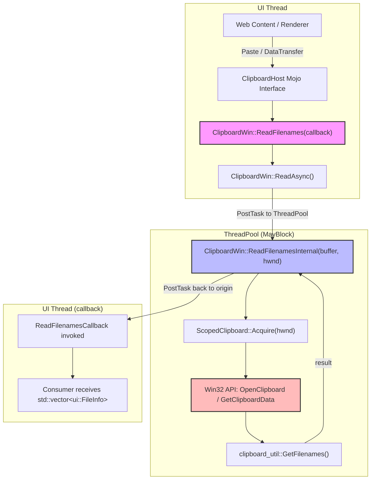
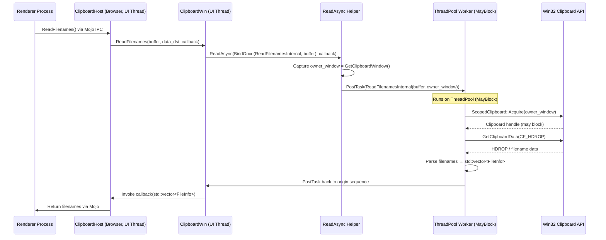
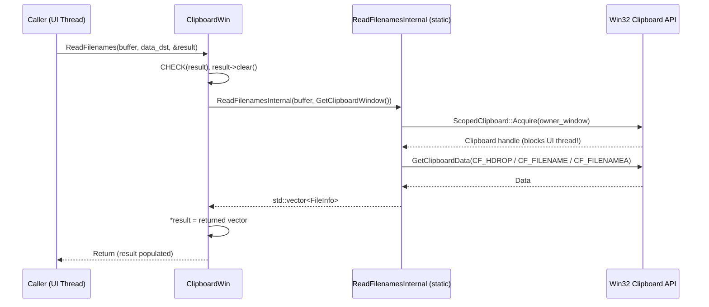
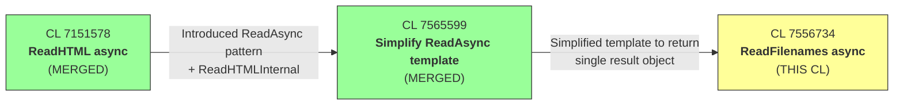

# High-Level Design: CL 7556734 — [Clipboard][Windows] Use async ReadFileNames with ThreadPool offloading

**CL URL:** https://chromium-review.googlesource.com/c/chromium/src/+/7556734
**Author:** Hewro Hewei (ihewro@chromium.org)
**Status:** NEW
**Bug:** [458194647](https://crbug.com/458194647)

---

## 1. Executive Summary

This CL migrates `ClipboardWin::ReadFilenames` from a synchronous, UI-thread-blocking implementation to an asynchronous model that offloads the blocking Win32 clipboard access (`OpenClipboard`/`GetClipboardData`/`CloseClipboard`) onto a `base::ThreadPool` sequenced task runner with the `MayBlock` trait. This is necessary because Win32 clipboard operations can block for an indeterminate time (e.g., when the clipboard owner is hung or performing delayed rendering), causing UI thread jank and potential application hangs. By following the same async pattern already established for `ReadHTML` ([CL 7151578](https://chromium-review.googlesource.com/c/chromium/src/+/7151578)) and simplified via [CL 7565599](https://chromium-review.googlesource.com/c/chromium/src/+/7565599), this CL incrementally moves the Windows clipboard subsystem toward fully non-blocking UI-thread reads, improving responsiveness for file-drop paste operations across Chromium on Windows.

---

## 2. Architecture Overview

### 2.1 Affected Components/Modules

| Component | Path | Role |
|---|---|---|
| **ClipboardWin** | `ui/base/clipboard/clipboard_win.cc/.h` | Windows-specific `Clipboard` implementation |
| **Clipboard (base class)** | `ui/base/clipboard/clipboard.h` | Cross-platform abstract clipboard interface |
| **ThreadPool** | `base/task/thread_pool.h` | Chromium's thread pool for offloading blocking work |
| **ScopedClipboard** | `ui/base/clipboard/clipboard_util_win.h` | RAII wrapper for Win32 `OpenClipboard`/`CloseClipboard` |
| **clipboard_util** | `ui/base/clipboard/clipboard_util_win.cc` | Win32 clipboard utility helpers (e.g., `GetFilenames`) |

### 2.2 Architectural Fit

This CL is part of a systematic effort to convert synchronous clipboard read methods in `ClipboardWin` to async versions. The base `Clipboard` class already declares async virtual overrides (with callback parameters) alongside the legacy synchronous versions. This CL provides the Windows-specific implementation of the async `ReadFilenames` override, following the established pattern from the `ReadHTML` migration.

### 2.3 Component Diagram

---

## 3. Design Goals & Non-Goals

### 3.1 Goals

1. **Eliminate UI-thread blocking** — Move the entire Win32 clipboard interaction for `ReadFilenames` off the UI thread to prevent jank and hangs.
2. **Follow established pattern** — Reuse the `ReadAsync` template mechanism introduced in [CL 7151578](https://chromium-review.googlesource.com/c/chromium/src/+/7151578) (ReadHTML async) and simplified in [CL 7565599](https://chromium-review.googlesource.com/c/chromium/src/+/7565599) (ReadAsync template simplification), ensuring consistency across clipboard read methods.
3. **Maintain backward compatibility** — The synchronous `ReadFilenames(buffer, data_dst, result*)` remains functional by delegating to the same `ReadFilenamesInternal` static helper, ensuring legacy callers are unaffected.
4. **Test coverage** — Add unit tests for the new async path covering both non-empty and empty clipboard scenarios.

### 3.2 Non-Goals

1. **Async migration of other read methods** — This CL only addresses `ReadFilenames`; other methods (`ReadAvailableTypes`, `ReadBookmark`, etc.) are out of scope.
2. **Removing the synchronous overload** — The legacy sync `ReadFilenames` is preserved for callers that haven't migrated.
3. **Cross-platform changes** — Only the Windows implementation is affected; other platforms' clipboard implementations are untouched.
4. **Clipboard write path changes** — Write operations are not modified by this CL.
5. **HWND dependency removal for ReadFilenames** — Unlike the `ReadHTML` CL which noted that HWND may not be required, this CL still passes `GetClipboardWindow()` as the `owner_window` parameter. Investigating whether HWND can be eliminated is deferred.

---

## 4. System Interactions

### 4.1 Interaction Flow

The async `ReadFilenames` method is invoked from the UI thread (typically via `ClipboardHost` Mojo interface from a renderer process requesting paste data). The method uses `ReadAsync` to post the blocking work to a ThreadPool worker, and the result is posted back to the calling sequence via the provided callback.

### 4.2 Sequence Diagram — Async ReadFilenames

### 4.3 Sequence Diagram — Synchronous ReadFilenames (Legacy, preserved)

### 4.4 Mojo/IPC Interaction

The clipboard read path is typically invoked via `blink::mojom::ClipboardHost` IPC from the renderer process. The Mojo interface calls into `ClipboardHostImpl` in the browser process, which then calls `Clipboard::ReadFilenames`. With this CL, the Windows implementation can now use the async overload, allowing the browser-side Mojo handler to return without blocking the UI thread.

---

## 5. API & Interface Changes

### 5.1 New Public Interfaces

| Method | Signature | Description |
|---|---|---|
| `ClipboardWin::ReadFilenames` (async override) | `void ReadFilenames(ClipboardBuffer buffer, const std::optional<DataTransferEndpoint>& data_dst, ReadFilenamesCallback callback) const override` | New async overload that offloads clipboard access to ThreadPool and returns result via callback. Declared at `ui/base/clipboard/clipboard_win.h` ~L62. |

### 5.2 New Internal Interfaces

| Method | Signature | Description |
|---|---|---|
| `ClipboardWin::ReadFilenamesInternal` | `static std::vector<ui::FileInfo> ReadFilenamesInternal(ClipboardBuffer buffer, HWND owner_window)` | Static helper extracted from the former `ReadFilenames` body. Can run on any thread. Declared at `ui/base/clipboard/clipboard_win.h` ~L147. |

### 5.3 Modified Interfaces

| Method | Change |
|---|---|
| `ClipboardWin::ReadFilenames` (sync) | Now delegates to `ReadFilenamesInternal` instead of containing the implementation inline. Adds `CHECK(result)` (upgraded from `DCHECK`). Behavior is unchanged for callers. |

### 5.4 Deprecated Interfaces

None. The synchronous overload is preserved for backward compatibility.

---

## 6. Dependencies

### 6.1 What This Code Depends On

| Dependency | Description |
|---|---|
| **`ClipboardWin::ReadAsync`** | Template method (introduced/simplified in [CL 7565599](https://chromium-review.googlesource.com/c/chromium/src/+/7565599)) that handles posting work to `ThreadPool` and returning results via callback. |
| **`base::ThreadPool`** | Used (indirectly via `ReadAsync`) to run `ReadFilenamesInternal` on a worker thread with `MayBlock` trait. |
| **`ScopedClipboard`** | RAII wrapper for Win32 clipboard open/close. |
| **`clipboard_util::GetFilenames`** | Parses `HDROP` data into a list of filenames. |
| **`ReadFilenamesAvailable()`** | Static check for whether the clipboard contains filename-type data. |
| **Win32 API** | `OpenClipboard`, `GetClipboardData`, `CloseClipboard`, `DragQueryFile`. |
| **[CL 7151578](https://chromium-review.googlesource.com/c/chromium/src/+/7151578)** | Parent CL that introduced the `ReadAsync` pattern for `ReadHTML`. MERGED. |
| **[CL 7565599](https://chromium-review.googlesource.com/c/chromium/src/+/7565599)** | Sibling CL that simplified the `ReadAsync` template to return a single result object. MERGED. |

### 6.2 What Depends on This Code

| Dependent | Description |
|---|---|
| **`ClipboardHostImpl`** | Browser-side Mojo handler that calls `Clipboard::ReadFilenames`; can now use the async overload. |
| **`DataTransferAccessPolicy`** | Enterprise clipboard policies that inspect clipboard data. |
| **Web Platform** | `navigator.clipboard.read()`, `paste` event, Drag & Drop file paste — all may trigger `ReadFilenames`. |
| **Other platform clipboard implementations** | Must implement the same async virtual override if they wish to provide non-blocking reads (not affected by this CL). |

### 6.3 Version/Compatibility Considerations

- The `ReadFilenamesCallback` type and async virtual overload must already exist in the `Clipboard` base class (they do, as established by the ReadHTML CL series).
- This CL rebases on top of the merged [CL 7565599](https://chromium-review.googlesource.com/c/chromium/src/+/7565599) which simplified `ReadAsync`.

---

## 7. Risks & Mitigations

### 7.1 Potential Issues

| Risk | Severity | Mitigation |
|---|---|---|
| **Clipboard data changes between `GetClipboardWindow()` capture and actual read** | Low | `GetClipboardWindow()` returns a stable per-thread HWND. The clipboard sequence number can change, but this is the same race that exists in the synchronous path. The `ScopedClipboard::Acquire` call will atomically lock the clipboard. |
| **`ReadFilenamesAvailable()` called on ThreadPool but may access clipboard state** | Medium | `ReadFilenamesAvailable()` is a static check on registered clipboard format types and does not call `OpenClipboard`. It should be safe to call from any thread. However, this should be verified — if it peeks at clipboard contents, it could race. |
| **Thread-safety of `RecordRead()`** | Low | `RecordRead` records UMA metrics. UMA histogram operations are typically thread-safe in Chromium. |
| **Lifetime of callback / weak pointers** | Low | `ReadAsync` handles the posting pattern, ensuring the callback runs on the original sequence. If the `Clipboard` instance is destroyed, the weak pointer check in `ReadAsync` will drop the callback. |
| **`GetClipboardDataWithLimit` and global state** | Low | This function calls `::GetClipboardData` which requires the clipboard to be open. Since `ScopedClipboard::Acquire` is called in the same scope, this is safe. |

### 7.2 Backward Compatibility

- **Fully backward compatible.** The synchronous `ReadFilenames(buffer, data_dst, result*)` overload is preserved and now delegates to the same `ReadFilenamesInternal` helper.
- Callers using the synchronous API are unaffected.
- Callers can opt in to the async API by using the callback-based overload.

### 7.3 Migration Strategy

No migration is needed. Both sync and async overloads coexist. Over time, callers (e.g., `ClipboardHostImpl`) should migrate to the async overload to realize the jank-free benefits. The sync overload can be deprecated once all callers have migrated.

---

## 8. Testing Strategy

### 8.1 New Tests Added

| Test | File | Description |
|---|---|---|
| `ReadFilenamesAsyncReturnsWrittenData` | `ui/base/clipboard/clipboard_win_unittest.cc` | Writes a file path to the clipboard via `ScopedClipboardWriter::WriteFilenames`, then reads it back using the async `ReadFilenames` overload. Verifies the returned `FileInfo` matches the written path. |
| `ReadFilenamesAsyncEmptyClipboard` | `ui/base/clipboard/clipboard_win_unittest.cc` | Clears the clipboard, then invokes async `ReadFilenames`. Verifies the result is empty. |
| Existing `ClipboardWinTest` (augmented) | `ui/base/clipboard/clipboard_win_unittest.cc` | The existing `NoDataChangedEventOnRead` test is augmented to also call the async `ReadFilenames` overload, verifying it does not trigger spurious clipboard-change notifications. |

### 8.2 Test Coverage Assessment

| Scenario | Covered? |
|---|---|
| Async read with valid file data | ✅ `ReadFilenamesAsyncReturnsWrittenData` |
| Async read with empty clipboard | ✅ `ReadFilenamesAsyncEmptyClipboard` |
| Sync read still works (legacy) | ✅ Existing tests remain |
| No data-changed event on async read | ✅ `NoDataChangedEventOnRead` augmented |
| Multiple files on clipboard | ❌ Not explicitly tested (single file only) |
| CF_FILENAME / CF_FILENAMEA formats | ❌ Not tested (only CF_HDROP path tested via `WriteFilenames`) |
| Clipboard owner hung / delayed render | ❌ Difficult to test in unit tests; covered by the `MayBlock` trait allowing the thread pool to handle blocking gracefully |
| Callback invoked on correct sequence | ✅ Implicitly tested via `TestFuture` + single-threaded `TaskEnvironment` |

### 8.3 CI Validation

The CL has passed dry-run on Chromium's CI (LUCI CQ) across multiple patch sets, including Windows trybots which exercise these tests.

---

## 9. Relationship to Referenced CLs

| CL | Title | Status | Relationship |
|---|---|---|---|
| [7151578](https://chromium-review.googlesource.com/c/chromium/src/+/7151578) | [Clipboard][Windows] Use async ReadHTML with ThreadPool offloading | **MERGED** | Introduced the `ReadAsync` pattern and `ReadHTMLInternal` static helper. This CL follows the exact same pattern for `ReadFilenames`. |
| [7565599](https://chromium-review.googlesource.com/c/chromium/src/+/7565599) | [Clipboard][Windows] Simplify ReadAsync template | **MERGED** | Simplified the `ReadAsync` template to accept functions returning a single result object instead of tuples. This CL depends on this simplification (e.g., `ReadFilenamesInternal` returns `std::vector<ui::FileInfo>` directly). |
| **7556734** | [Clipboard][Windows] Use async ReadFileNames with ThreadPool offloading | **NEW** | **This CL** — applies the pattern to `ReadFilenames`. |

---

## 10. Summary of Changes by File

### `ui/base/clipboard/clipboard_win.h` (+5 lines)

- Declares the async `ReadFilenames` override (callback-based, with `std::optional<DataTransferEndpoint>&`).
- Declares `static ReadFilenamesInternal(ClipboardBuffer, HWND)` returning `std::vector<ui::FileInfo>`.

### `ui/base/clipboard/clipboard_win.cc` (+33/-11 lines)

- **New async `ReadFilenames`** (~L424): Calls `ReadAsync(BindOnce(ReadFilenamesInternal, buffer), callback)`.
- **Refactored sync `ReadFilenames`** (~L681): Now delegates to `ReadFilenamesInternal`, with `CHECK(result)` upgrade.
- **New `ReadFilenamesInternal`** (~L687): Static method containing the original clipboard-reading logic, returning `std::vector<ui::FileInfo>` by value. Uses `owner_window` parameter instead of `GetClipboardWindow()` member call, enabling thread-pool execution.
- Minor style improvements: `push_back` → `emplace_back`, braces added to single-line `if` blocks.

### `ui/base/clipboard/clipboard_win_unittest.cc` (+45 lines)

- Adds includes for file path utilities and `FileInfo`.
- Augments `NoDataChangedEventOnRead` test with async `ReadFilenames` call.
- Adds `ReadFilenamesAsyncReturnsWrittenData` test.
- Adds `ReadFilenamesAsyncEmptyClipboard` test.
