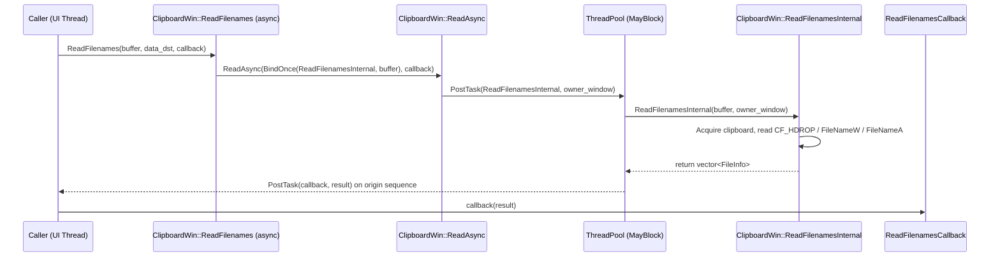
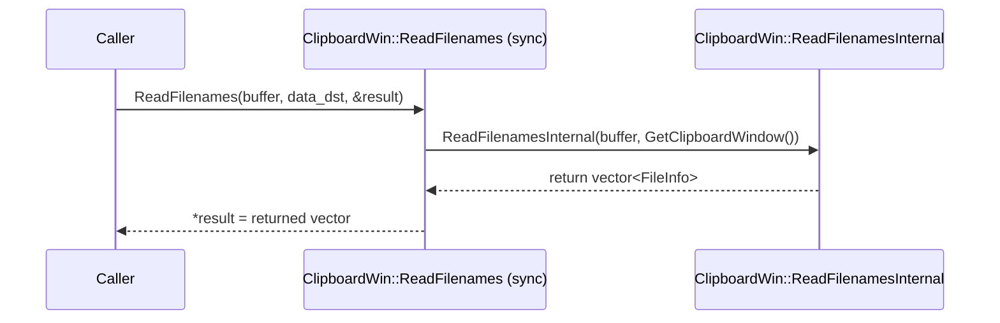
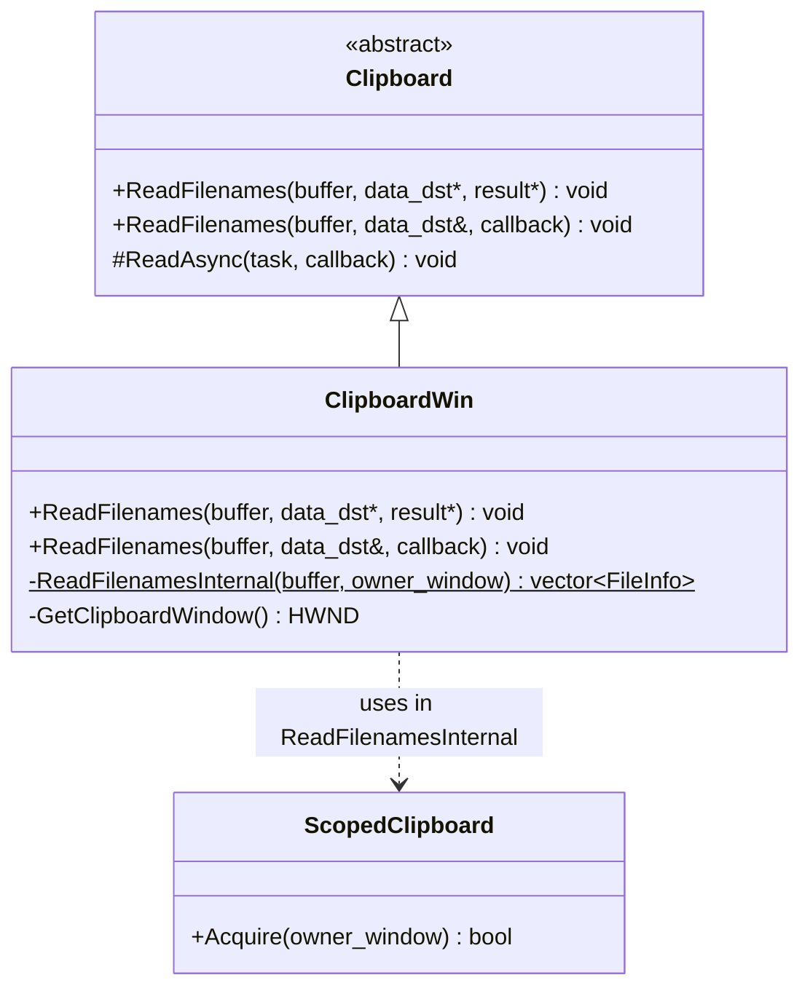
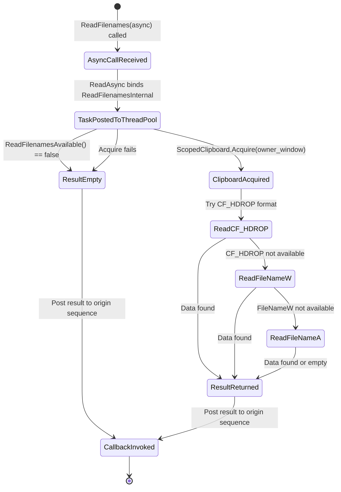

# Low-Level Design: CL 7556734 — [Clipboard][Windows] Use async ReadFileNames with ThreadPool offloading

**CL URL:** https://chromium-review.googlesource.com/c/chromium/src/+/7556734
**Author:** Hewro Hewei (ihewro@chromium.org)
**Bug:** 458194647

---

## Summary

This CL adds an asynchronous `ReadFilenames` override to `ClipboardWin` that offloads blocking Win32 clipboard access from the UI thread onto a `ThreadPool` sequenced task runner (`MayBlock`). The core clipboard reading logic is refactored into a new static helper `ReadFilenamesInternal`, which is used by both the legacy synchronous path and the new async path.

---

## 1. File-by-File Analysis

### 1.1 `ui/base/clipboard/clipboard_win.h`

**Purpose of changes:** Declare the new async `ReadFilenames` override and the static `ReadFilenamesInternal` helper.

**Key modifications:**
- Added `ReadFilenames` override accepting `std::optional<DataTransferEndpoint>&` and `ReadFilenamesCallback` (the async signature from the base class `Clipboard`).
- Added `static ReadFilenamesInternal` private helper method.

**New/Modified Functions:**

| Function | Purpose | Parameters | Returns |
|----------|---------|------------|---------|
| `ReadFilenames` (async override) | Async entry point for reading filenames from clipboard | `ClipboardBuffer buffer`, `const std::optional<DataTransferEndpoint>& data_dst`, `ReadFilenamesCallback callback` | `void` |
| `ReadFilenamesInternal` (static) | Thread-safe core logic for extracting filenames from clipboard | `ClipboardBuffer buffer`, `HWND owner_window` | `std::vector<ui::FileInfo>` |

**API Changes:**
- New public override: `ReadFilenames(ClipboardBuffer, const std::optional<DataTransferEndpoint>&, ReadFilenamesCallback)` — this is the async variant defined in the base `Clipboard` class.
- New private static: `ReadFilenamesInternal(ClipboardBuffer, HWND)` — replaces the inline logic that was previously inside the synchronous `ReadFilenames`.

---

### 1.2 `ui/base/clipboard/clipboard_win.cc`

**Purpose of changes:** Implement the async `ReadFilenames` override and refactor the synchronous `ReadFilenames` to delegate to `ReadFilenamesInternal`.

**Key modifications:**
- **New async `ReadFilenames` method** (line ~424): Calls `ReadAsync(base::BindOnce(ClipboardWin::ReadFilenamesInternal, buffer), std::move(callback))`, scheduling the blocking work on a thread-pool task runner.
- **Refactored synchronous `ReadFilenames`** (line ~681): Now delegates to `ReadFilenamesInternal(buffer, GetClipboardWindow())` and assigns the result to the output parameter.
- **New static `ReadFilenamesInternal`** (line ~689): Contains the original clipboard reading logic (acquire clipboard, read CF_HDROP / FileNameW / FileNameA formats), but returns `std::vector<ui::FileInfo>` by value instead of writing to an out-pointer.
- `DCHECK(result)` replaced with `CHECK(result)` in the sync path for null-pointer safety.
- `result->push_back(...)` calls changed to `result.emplace_back(...)` (local vector, minor style improvement).

**New/Modified Functions:**

| Function | Purpose | Parameters | Returns |
|----------|---------|------------|---------|
| `ReadFilenames` (async, ~L424) | Entry point: binds `ReadFilenamesInternal` + buffer, dispatches via `ReadAsync` | `ClipboardBuffer`, `optional<DataTransferEndpoint>&`, `ReadFilenamesCallback` | `void` |
| `ReadFilenames` (sync, ~L681) | Legacy sync path: delegates to `ReadFilenamesInternal`, assigns to `*result` | `ClipboardBuffer`, `const DataTransferEndpoint*`, `std::vector<ui::FileInfo>*` | `void` |
| `ReadFilenamesInternal` (static, ~L689) | Core logic: opens clipboard with `owner_window`, reads file names from 3 formats | `ClipboardBuffer`, `HWND owner_window` | `std::vector<ui::FileInfo>` |

**Logic inside `ReadFilenamesInternal`:**
1. `DCHECK_EQ(buffer, ClipboardBuffer::kCopyPaste)` — asserts copy-paste buffer.
2. `RecordRead(ClipboardFormatMetric::kFilenames)` — UMA metric recording.
3. `ReadFilenamesAvailable()` — early-out if no filename format is on the clipboard.
4. `ScopedClipboard::Acquire(owner_window)` — acquires exclusive clipboard access.
5. Tries three clipboard formats in order:
   - `CF_HDROP` — uses `clipboard_util::GetFilenames(hdrop.data())` to enumerate dropped files.
   - `FileNameW` — reads a single wide-character filename.
   - `FileNameA` — reads a single ANSI filename and converts via `SysNativeMBToWide`.
6. Returns the populated `std::vector<ui::FileInfo>`.

**Data Flow (Async Path):**

**Data Flow (Sync Path):**

---

### 1.3 `ui/base/clipboard/clipboard_win_unittest.cc`

**Purpose of changes:** Add unit tests for the new async `ReadFilenames` path and extend the existing `ClipboardDoesNotTriggerDataChanged` test.

**Key modifications:**
- Added `#include` directives for `base/files/file_path.h`, `base/files/file_util.h`, `base/files/scoped_temp_dir.h`, `base/threading/thread_restrictions.h`, and `ui/base/clipboard/file_info.h`.
- Extended `ClipboardDoesNotTriggerDataChanged` test to also call the async `ReadFilenames` and verify `data_changed_count()` remains 0.
- Added `TEST_F(ClipboardWinTest, ReadFilenamesAsyncReturnsWrittenData)`: writes a temporary file path via `ScopedClipboardWriter::WriteFilenames`, then reads it back via the async `ReadFilenames` and validates the result.
- Added `TEST_F(ClipboardWinTest, ReadFilenamesAsyncEmptyClipboard)`: clears the clipboard, calls async `ReadFilenames`, and asserts the result is empty.

**New Test Cases:**

| Test Name | Scenario | Key Assertions |
|-----------|----------|----------------|
| `ClipboardDoesNotTriggerDataChanged` (extended) | Async ReadFilenames on empty clipboard | `data_changed_count() == 0` (no spurious observer notification) |
| `ReadFilenamesAsyncReturnsWrittenData` | Write file path, read back async | `filenames.size() == 1`, `filenames[0].path == file` |
| `ReadFilenamesAsyncEmptyClipboard` | Empty clipboard, read async | `filenames.empty() == true` |

---

## 2. Class Diagram

---

## 3. State Diagram

---

## 4. Implementation Concerns

### 4.1 Memory Management
- **No issues identified.** The refactored `ReadFilenamesInternal` returns `std::vector<ui::FileInfo>` by value, which is move-efficient. `ScopedClipboard` and `ScopedHGlobal` use RAII to ensure clipboard and global memory handles are released.

### 4.2 Thread Safety
- **`ReadFilenamesInternal` is static and self-contained.** It does not access any `ClipboardWin` instance state, relying only on its parameters (`buffer`, `owner_window`). This makes it safe to run on the thread pool.
- **`RecordRead` is called from the thread pool.** This is a static method that records UMA metrics. It must be thread-safe; this is consistent with how other `*Internal` methods (e.g., `ReadHtmlInternal`) already call it from the thread pool.
- **`ReadFilenamesAvailable` is also called from the thread pool.** This is a static method that checks clipboard format availability. Same pattern as existing async methods.
- **`GetClipboardDataWithLimit` is called after clipboard is acquired**, so it runs within the `ScopedClipboard` lock — consistent with the existing pattern.
- **`owner_window` (HWND) is captured by value** from the UI thread via `ReadAsync`. The HWND remains valid as long as the `ClipboardWin` instance is alive. Since `ReadAsync` captures `this` (the `ClipboardWin`), the sequencing is safe.

### 4.3 Performance
- **Positive impact.** The primary goal — moving blocking Win32 clipboard calls off the UI thread — is achieved. The `ScopedClipboard::Acquire` call and subsequent data reads are now on a `MayBlock` thread pool sequence, preventing UI thread jank.
- The sync path now has a slight overhead of calling into `ReadFilenamesInternal` (function call + return-by-value), but this is negligible compared to the clipboard I/O cost.

### 4.4 Maintainability
- The pattern is consistent with the existing `ReadHtmlInternal` / `ReadPngInternal` / `ReadBitmapInternal` approach, making the codebase uniform and predictable.
- The `data_dst` parameter is unused in both sync and async paths (as documented by the comment). This is a known cross-platform consistency requirement.

---

## 5. Suggestions for Improvement

### 5.1 Missing `DCHECK_EQ` in Sync `ReadFilenames`
The original sync `ReadFilenames` had `DCHECK_EQ(buffer, ClipboardBuffer::kCopyPaste)` which was moved into `ReadFilenamesInternal`. The sync path now only has `CHECK(result)`. This is functionally correct since `ReadFilenamesInternal` still performs the DCHECK, but it may be worth keeping a DCHECK in the sync wrapper as well for fail-fast debugging at the call site.

### 5.2 Consider `[[nodiscard]]` on `ReadFilenamesInternal`
Since `ReadFilenamesInternal` returns the result by value and the caller must use it, adding `[[nodiscard]]` would prevent accidental discard of the return value.

### 5.3 Test Coverage for Multiple Files
`ReadFilenamesAsyncReturnsWrittenData` tests a single file. A test with multiple filenames (e.g., 2–3 files via CF_HDROP) would improve coverage of the iteration loop inside `ReadFilenamesInternal`.

### 5.4 Test Coverage for FileNameW / FileNameA Fallback Paths
The tests only exercise the primary `CF_HDROP` path (via `ScopedClipboardWriter::WriteFilenames`). The `FileNameW` and `FileNameA` fallback paths in `ReadFilenamesInternal` are not covered by the new async tests. These paths are harder to test (require raw clipboard manipulation), but worth noting as a coverage gap.

### 5.5 Minor: `emplace_back` Consistency
The refactoring correctly changed `push_back` to `emplace_back` for the local vector. This is a nice modernization but note it's a functional no-op for `ui::FileInfo` — just a minor style improvement.

### 5.6 `data_dst` Parameter Documentation
The comment `// |data_dst| is not used.` is duplicated before the new async `ReadFilenames` and before `ReadAvailableTypes`. This is acceptable for clarity but could be consolidated if the pattern repeats further.

---

## 6. Risk Assessment

| Risk | Severity | Likelihood | Mitigation |
|------|----------|------------|------------|
| Thread-safety of `RecordRead` / `ReadFilenamesAvailable` from thread pool | Low | Low | Same pattern used by `ReadHtmlInternal`; already validated |
| HWND validity on thread pool | Low | Low | `ReadAsync` captures HWND before posting; HWND lifetime tied to `ClipboardWin` |
| Behavioral regression in sync path | Low | Low | Sync path delegates to same `ReadFilenamesInternal`; logic unchanged |
| Missing test coverage for FileNameW/FileNameA paths | Medium | Medium | Pre-existing gap; not introduced by this CL |
