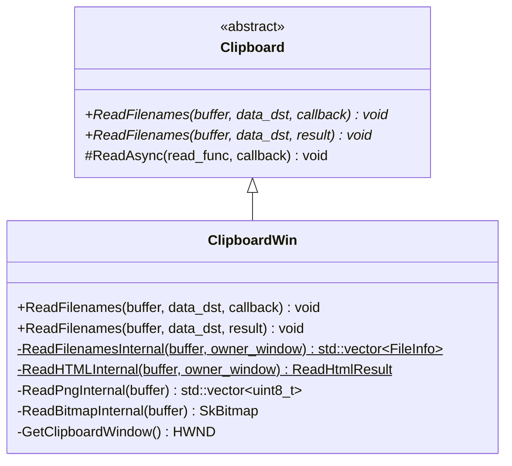
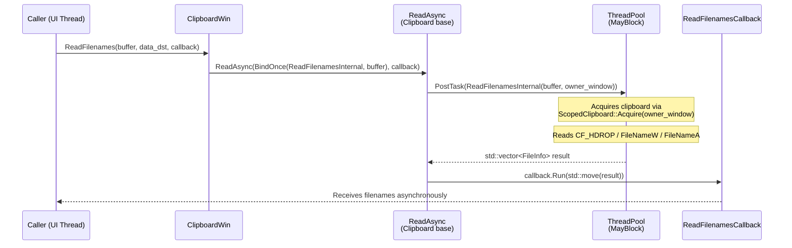
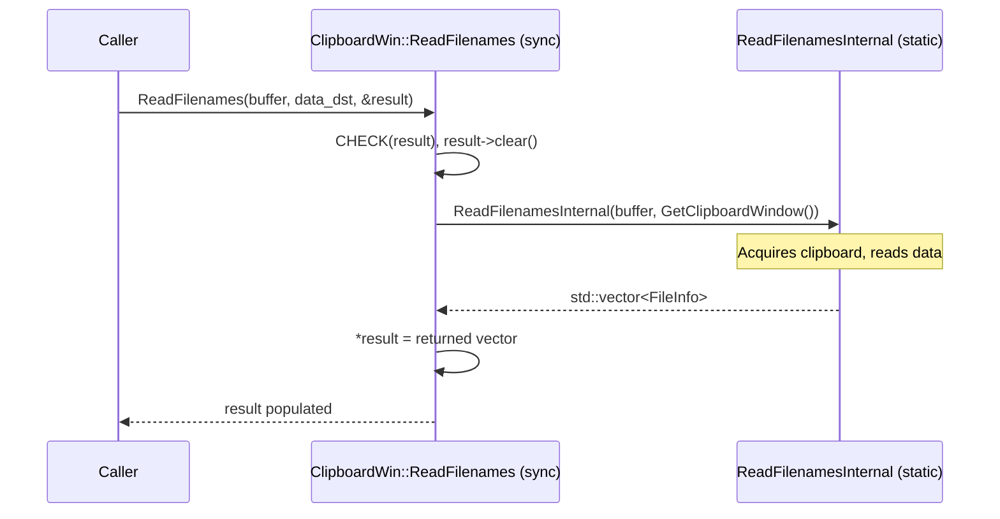
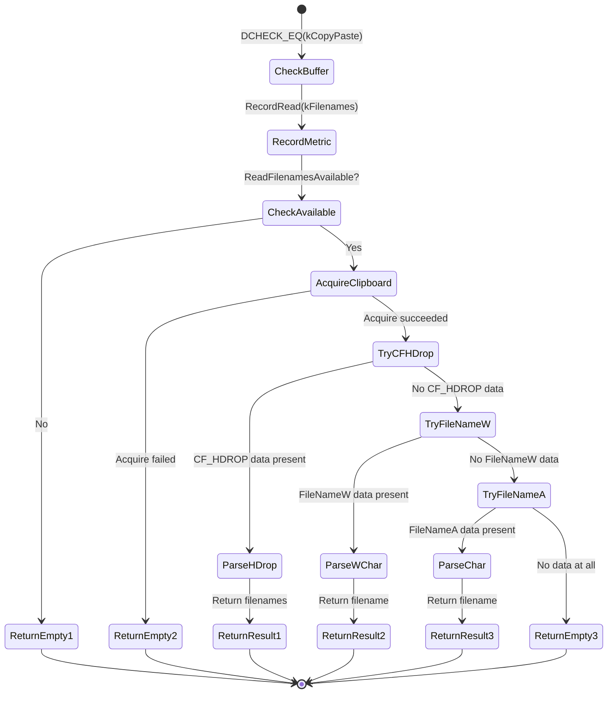
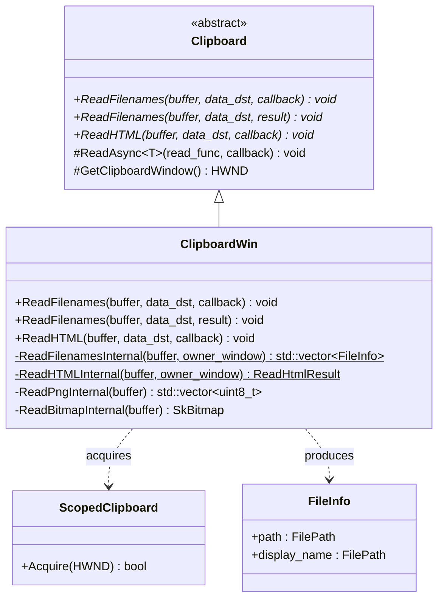

# Low-Level Design Document

## CL 7556734: [Clipboard][Windows] Use async ReadFileNames with ThreadPool offloading

**CL URL:** https://chromium-review.googlesource.com/c/chromium/src/+/7556734
**Author:** Hewro Hewei (ihewro@chromium.org)
**Status:** NEW
**Bug:** 458194647

---

## Summary

This CL adds an asynchronous `ReadFilenames` override to `ClipboardWin` that offloads blocking Win32 clipboard access to a ThreadPool sequenced task runner (with `MayBlock` trait), preventing UI-thread stalls. It follows the exact same pattern established by the already-merged [CL 7151578 (async ReadHTML)](https://chromium-review.googlesource.com/c/chromium/src/+/7151578) and relies on the simplified `ReadAsync` template from the already-merged [CL 7565599 (Simplify ReadAsync template)](https://chromium-review.googlesource.com/c/chromium/src/+/7565599).

---

## 1. File-by-File Analysis

---

### 1.1 `ui/base/clipboard/clipboard_win.h`

**Purpose of changes:** Declare the new async `ReadFilenames` override and the static helper `ReadFilenamesInternal` in the `ClipboardWin` class.

**Key modifications:**
- Added public override `ReadFilenames(ClipboardBuffer, const std::optional<DataTransferEndpoint>&, ReadFilenamesCallback)` — the async variant accepting a callback
- Added private static method `ReadFilenamesInternal(ClipboardBuffer, HWND)` — the thread-safe helper that performs the actual blocking work

**New/Modified Functions:**

| Function | Scope | Purpose | Parameters | Returns |
|----------|-------|---------|------------|---------|
| `ReadFilenames` (async override) | `public` | Async entry point; posts work to ThreadPool | `ClipboardBuffer buffer`, `const std::optional<DataTransferEndpoint>& data_dst`, `ReadFilenamesCallback callback` | `void` |
| `ReadFilenamesInternal` | `private static` | Performs blocking clipboard I/O; safe to run on any thread | `ClipboardBuffer buffer`, `HWND owner_window` | `std::vector<ui::FileInfo>` |

**Class Diagram:**



---

### 1.2 `ui/base/clipboard/clipboard_win.cc`

**Purpose of changes:** Implement the new async `ReadFilenames` and refactor the existing synchronous `ReadFilenames` to delegate to a new `static` helper `ReadFilenamesInternal`.

**Key modifications:**

1. **New async `ReadFilenames` (lines ~424–429):** Delegates to `ReadAsync` by binding `ReadFilenamesInternal` with the buffer argument, and passes the callback through.
2. **Refactored sync `ReadFilenames` (lines ~681–685):** Now validates `result` with `CHECK`, clears it, and delegates to `ReadFilenamesInternal(buffer, GetClipboardWindow())`.
3. **New `ReadFilenamesInternal` static method (lines ~688–750):** Extracted from the old `ReadFilenames` body. Takes `ClipboardBuffer` and `HWND owner_window` as parameters. Returns `std::vector<ui::FileInfo>` by value (enabling NRVO) instead of writing to an out-pointer.
4. **Minor improvements:** `DCHECK(result)` upgraded to `CHECK(result)` in the sync path. `push_back` calls replaced with `emplace_back` throughout. Bare `return;` statements replaced with `return result;` for value semantics.

**New/Modified Functions:**

| Function | Type | Purpose | Parameters | Returns |
|----------|------|---------|------------|---------|
| `ReadFilenames` (async) | New | Async entry; invokes `ReadAsync` with `ReadFilenamesInternal` | `buffer`, `data_dst` (unused), `callback` | `void` |
| `ReadFilenames` (sync) | Modified | Now delegates to `ReadFilenamesInternal` | `buffer`, `data_dst` (unused), `result` (out-ptr) | `void` |
| `ReadFilenamesInternal` | New (static) | Blocking clipboard read logic, thread-safe | `buffer`, `owner_window` | `std::vector<ui::FileInfo>` |

**Async ReadFilenames Data Flow:**



**Sync ReadFilenames Data Flow:**



**`ReadFilenamesInternal` Logic Flow:**



---

### 1.3 `ui/base/clipboard/clipboard_win_unittest.cc`

**Purpose of changes:** Add unit tests for the new async `ReadFilenames` path.

**Key modifications:**

1. **New includes:** Added `base/files/file_path.h`, `base/files/file_util.h`, `base/files/scoped_temp_dir.h`, `base/threading/thread_restrictions.h`, `ui/base/clipboard/file_info.h` to support file-based test setup.
2. **Extended `DataUnchangedAfterReadTest`:** Added async `ReadFilenames` call within the existing data-change observer test to verify the async read doesn't trigger spurious clipboard-change notifications.
3. **New test `ReadFilenamesAsyncReturnsWrittenData`:** Writes a real temporary file path to the clipboard via `ScopedClipboardWriter::WriteFilenames`, then reads it back via the async API and asserts the returned path matches.
4. **New test `ReadFilenamesAsyncEmptyClipboard`:** Clears the clipboard, calls async `ReadFilenames`, and asserts the result is empty.

**New Tests:**

| Test | Purpose | Setup | Assertion |
|------|---------|-------|-----------|
| `DataUnchangedAfterReadTest` (extended) | Async read doesn't fire clipboard-change observers | Empty clipboard | `data_changed_count() == 0` after async read |
| `ReadFilenamesAsyncReturnsWrittenData` | Round-trip write → async read | Write temp file path via `ScopedClipboardWriter` | `filenames.size() == 1`, path matches |
| `ReadFilenamesAsyncEmptyClipboard` | Async read on cleared clipboard | `clipboard->Clear(kCopyPaste)` | `filenames.empty() == true` |

---

## 2. Class Diagram



---

## 3. State Diagram — Async ReadFilenames Lifecycle

```mermaid
stateDiagram-v2
    [*] --> CallReceived: ReadFilenames(buffer, data_dst, callback)
    CallReceived --> BindFunc: BindOnce(ReadFilenamesInternal, buffer)
    BindFunc --> PostToThreadPool: ReadAsync posts to MayBlock runner
    PostToThreadPool --> ExecutingOnPool: ThreadPool picks up task

    state ExecutingOnPool {
        [*] --> Validate
        Validate --> AcquireClipboard
        AcquireClipboard --> ReadFormats
        ReadFormats --> BuildResult
        BuildResult --> [*]
    }

    ExecutingOnPool --> CallbackPosted: Result returned
    CallbackPosted --> CallbackRun: Reply posted to original sequence
    CallbackRun --> [*]: callback(std::vector<FileInfo>)
```

---

## 4. Implementation Concerns

### 4.1 Memory Management
- **Return-by-value with NRVO:** `ReadFilenamesInternal` returns `std::vector<ui::FileInfo>` by value. All return paths use the same named local `result`, enabling Named Return Value Optimization (NRVO) in practice. This is correct and efficient.
- **`CHECK(result)` in sync path:** The upgrade from `DCHECK` to `CHECK` in the sync `ReadFilenames` is appropriate — a null out-pointer would cause a crash anyway; better to fail explicitly.

### 4.2 Thread Safety
- **`ReadFilenamesInternal` is `static`:** It does not access any `ClipboardWin` member state, making it safe to run on a ThreadPool worker. This mirrors the pattern from [CL 7151578 (ReadHTML)](https://chromium-review.googlesource.com/c/chromium/src/+/7151578).
- **`RecordRead` is called from `ReadFilenamesInternal`:** This is a static method (`Clipboard::RecordRead`). Verify that it is thread-safe (typically UMA metrics are thread-safe in Chromium, so this should be fine).
- **`ReadFilenamesAvailable` is called from `ReadFilenamesInternal`:** This is a static method that calls `IsFormatAvailable` — it accesses the clipboard without acquiring it. On Windows, `IsClipboardFormatAvailable` is a Win32 API that does not require `OpenClipboard`, so this is safe to call from any thread. However, there is a potential TOCTOU (time-of-check-time-of-use) race: the format could be removed between the check and the `ScopedClipboard::Acquire` call. This is pre-existing behavior and acceptable.
- **`GetClipboardDataWithLimit`:** Called within the `ScopedClipboard` lock scope — correct usage.
- **`owner_window` parameter:** The async path passes `GetClipboardWindow()` through `ReadAsync`'s bind, which captures the HWND value at the time of the call. The HWND remains valid because it's owned by `ClipboardWin`'s lifetime. This is the same pattern used by ReadHTML.

### 4.3 Performance Implications
- **Positive:** The primary goal of this CL — moving blocking `OpenClipboard`/`GetClipboardData`/`CloseClipboard` calls off the UI thread — is achieved. This eliminates potential UI jank when clipboard data is large or the clipboard is held by another process.
- **ThreadPool overhead:** Minimal. The `MayBlock` trait correctly tells the ThreadPool scheduler that this task may block, allowing it to create additional threads if needed.
- **`data_dst` parameter is unused:** Both the sync and async variants ignore `data_dst`. This is documented with a comment and is consistent with the existing pattern across other Read methods on Windows.

### 4.4 Maintainability
- **Consistent pattern:** This CL follows the exact same refactoring pattern as the ReadHTML CL (7151578) and benefits from the simplified ReadAsync template (CL 7565599). This makes the codebase more consistent and easier to maintain.
- **Minor: `emplace_back` migration:** The CL also migrates `push_back(ui::FileInfo(path, base::FilePath()))` to `emplace_back(path, base::FilePath())` throughout. This is a good minor cleanup (avoids a move).

### 4.5 Correctness Concerns

- **`ReadFilenamesInternal` signature for `ReadAsync` binding:** The function is bound as `base::BindOnce(ClipboardWin::ReadFilenamesInternal, buffer)`. The `ReadAsync` template (from CL 7565599) will call this with the `HWND owner_window` parameter. Confirm that `ReadAsync` passes `GetClipboardWindow()` as the second argument to the bound function — based on the ReadHTML pattern and the simplified ReadAsync template, this is the expected behavior.
- **No `data_dst` forwarding needed:** Since `data_dst` is unused on Windows (documented), not forwarding it to `ReadFilenamesInternal` is correct.

---

## 5. Suggestions for Improvement

### 5.1 Test Coverage Enhancements
- **Multiple files test:** Consider adding a test that writes multiple file paths (e.g., 2–3 files) to the clipboard and verifies all are returned in the correct order via async read. The current test only covers a single file.
- **Sync→Async consistency test:** Consider a test that writes data, reads via both sync and async APIs, and asserts identical results. This would guard against future divergence between the two paths.

### 5.2 Code Observations
- **Duplicated comment block:** The comment `// |data_dst| is not used. It's only passed to be consistent with other // platforms.` appears twice before the new async `ReadFilenames` (line ~422) and before `ReadAvailableTypes` (line ~432). The first instance is correct for the async `ReadFilenames`. Verify this doesn't cause confusion — it appears the pre-existing comment before `ReadAvailableTypes` was also about `data_dst` for that function, so adding a new one for the new `ReadFilenames` is appropriate.
- **`DCHECK` vs `CHECK` consistency:** The sync path now uses `CHECK(result)` while `ReadFilenamesInternal` uses `DCHECK_EQ(buffer, ClipboardBuffer::kCopyPaste)`. Consider whether the buffer check should also be a `CHECK` for consistency with the stricter validation direction. However, this matches the existing pattern, so it's a minor point.

### 5.3 Cross-CL Consistency
- This CL is consistent with the patterns established by:
  - **CL 7151578** (ReadHTML async) — same `*Internal` static helper pattern
  - **CL 7565599** (Simplify ReadAsync template) — uses the simplified single-return-object `ReadAsync` template
- The approach is well-aligned with the broader async clipboard migration effort tracked by Bug 458194647.

---

## 6. Related CLs

| CL | Title | Status | Relationship |
|----|-------|--------|-------------|
| [7151578](https://chromium-review.googlesource.com/c/chromium/src/+/7151578) | [Clipboard][Windows] Use async ReadHTML with ThreadPool offloading | **MERGED** | Established the `*Internal` + `ReadAsync` pattern used here |
| [7565599](https://chromium-review.googlesource.com/c/chromium/src/+/7565599) | [Clipboard][Windows] Simplify ReadAsync template | **MERGED** | Simplified `ReadAsync` to return single objects; this CL depends on it |
| 7556734 (this CL) | [Clipboard][Windows] Use async ReadFileNames with ThreadPool offloading | **NEW** | Extends the pattern to `ReadFilenames` |

---

## 7. Overall Assessment

This is a clean, well-structured CL that follows the established async clipboard migration pattern. The refactoring is minimal and surgical — extracting the blocking logic into a `static` helper and wiring it through `ReadAsync`. The tests cover the key scenarios (round-trip data, empty clipboard, no spurious notifications). The code is thread-safe by design since `ReadFilenamesInternal` accesses no instance state.

**Risk: Low.** The pattern is proven by the already-merged ReadHTML CL and passes the Chromium CQ dry run.
