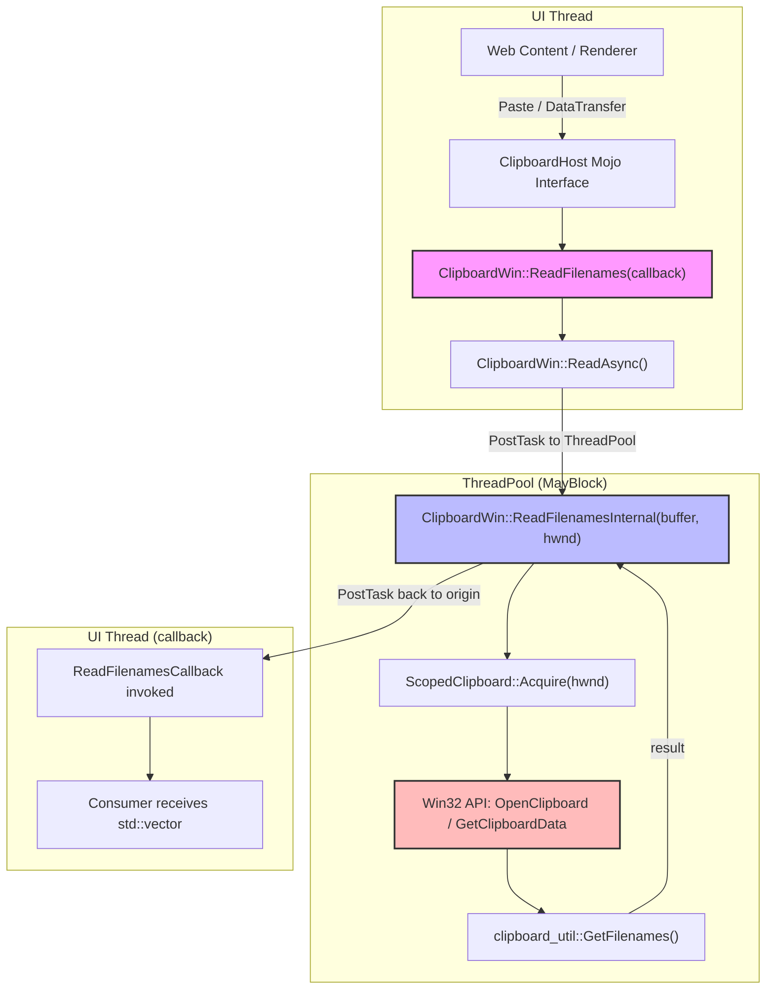
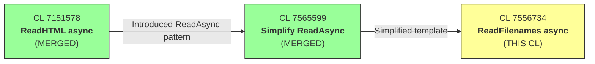

# Review Summary: CL 7556734

## [Clipboard][Windows] Use async ReadFileNames with ThreadPool offloading

**CL URL:** https://chromium-review.googlesource.com/c/chromium/src/+/7556734
**Author:** Hewro Hewei (ihewro@chromium.org)
**Status:** NEW (Patch Set 10)
**Bug:** [458194647](https://crbug.com/458194647)
**Date of Review:** 2026-02-13

**Related CLs:**
- [CL 7151578](https://chromium-review.googlesource.com/c/chromium/src/+/7151578): [Clipboard][Windows] Use async ReadHTML with ThreadPool offloading — **MERGED** (established the async pattern)
- [CL 7565599](https://chromium-review.googlesource.com/c/chromium/src/+/7565599): [Clipboard][Windows] Simplify ReadAsync template — **MERGED** (simplified `ReadAsync` to single-return-object template)

---

## 1. Executive Summary

This CL migrates `ClipboardWin::ReadFilenames` from a synchronous, UI-thread-blocking implementation to an asynchronous model that offloads blocking Win32 clipboard access (`OpenClipboard`/`GetClipboardData`/`CloseClipboard`) onto a `base::ThreadPool` sequenced task runner with the `MayBlock` trait. It follows the exact same async pattern established by the already-merged ReadHTML CL (7151578) and leverages the simplified `ReadAsync` template from CL 7565599. The change improves UI responsiveness for file-drop paste operations by preventing jank when the clipboard owner is hung or performing delayed rendering.

---

## 2. Design Assessment

### Architecture Quality

| Aspect | Rating (1-5) | Comments |
|--------|--------------|----------|
| Clarity | 5 | Clean separation: async entry point delegates to `ReadAsync`, which posts static `ReadFilenamesInternal` to ThreadPool. Easy to follow. |
| Maintainability | 5 | Follows the identical pattern used by ReadHTML; both sync and async paths share the same `ReadFilenamesInternal` static helper, reducing code duplication. |
| Extensibility | 5 | The `ReadAsync` template pattern makes it trivial to add async versions of remaining clipboard read methods (ReadBookmark, ReadAvailableTypes, etc.). |
| Consistency | 4 | Highly consistent with CL 7151578/7565599 patterns. Minor inconsistency: `ReadFilenamesInternal` parameter order (buffer, HWND) differs from `ReadHTMLInternal` (HWND, buffer) — though this CL's ordering is actually the *better* design for `base::BindOnce` integration. |

### Architecture Diagram



### CL Dependency Chain



---

## 3. Implementation Assessment

### Code Quality

| Aspect | Rating (1-5) | Comments |
|--------|--------------|----------|
| Correctness | 4 | Logic is sound; both sync and async paths share `ReadFilenamesInternal`. Minor: `DCHECK_EQ` should be `CHECK_EQ` for consistency with the project's stricter validation direction. |
| Efficiency | 5 | Core goal achieved — blocking Win32 clipboard reads moved off UI thread. NRVO-friendly return-by-value. `emplace_back` replaces `push_back` throughout. ThreadPool `MayBlock` trait correctly used. |
| Readability | 5 | Minimal diff (per reviewer feedback to rename to `ReadFilenamesInternal`). Clear separation of concerns. Comments preserved. |
| Test Coverage | 4 | Good: round-trip write/read, empty clipboard, no-spurious-notifications. Missing: multi-file scenario, CF_FILENAME/CF_FILENAMEA format paths. |

### Changes Summary (3 files, +83/-11 lines)

| File | Changes |
|------|---------|
| `clipboard_win.h` | +5: Declare async `ReadFilenames` override and static `ReadFilenamesInternal` |
| `clipboard_win.cc` | +33/-11: New async entry, refactored sync path, extracted `ReadFilenamesInternal` static helper |
| `clipboard_win_unittest.cc` | +45: Two new tests + augmented existing test |

---

## 4. Key Findings

### Critical Issues (Must Fix)

*None identified.* The CL is architecturally sound and functionally correct.

### Major Issues (Should Fix)

1. **`DCHECK_EQ` → `CHECK_EQ` in `ReadFilenamesInternal`** (`clipboard_win.cc` ~L685): The sync wrapper uses `CHECK(result)` but the buffer validation inside `ReadFilenamesInternal` remains a `DCHECK_EQ`. Since `ReadFilenamesInternal` is now `static` and callable from ThreadPool workers (where calling context is less controlled), a hard `CHECK_EQ` provides stronger defense against misuse and aligns with Chromium's direction toward stricter invariant checks. This was also specifically recommended in CL 7151578's review.
   ```cpp
   // Change from:
   DCHECK_EQ(buffer, ClipboardBuffer::kCopyPaste);
   // To:
   CHECK_EQ(buffer, ClipboardBuffer::kCopyPaste);
   ```

2. **Missing `&` on static function pointer in `base::BindOnce`** (`clipboard_win.cc` ~L428): The code passes the static member function without the address-of operator. While this compiles (static member functions decay to function pointers), Chromium's `base::BindOnce` convention uses explicit `&` for consistency and clarity.
   ```cpp
   // Change from:
   ReadAsync(base::BindOnce(ClipboardWin::ReadFilenamesInternal, buffer), ...);
   // To:
   ReadAsync(base::BindOnce(&ClipboardWin::ReadFilenamesInternal, buffer), ...);
   ```

### Minor Issues (Nice to Fix)

1. **Duplicate comment block** (`clipboard_win.cc` ~L424–434): The `// |data_dst| is not used...` comment appears consecutively for both the new async `ReadFilenames` and the existing `ReadAvailableTypes`. While technically correct per function, consider differentiating the wording slightly (e.g., `// |data_dst| is unused on Windows; passed for cross-platform consistency.`) to avoid looking like a copy-paste artifact.

2. **Missing multi-file test case** (`clipboard_win_unittest.cc`): `ReadFilenamesAsyncReturnsWrittenData` only tests a single file. The CF_HDROP path iterates over multiple filenames. A test with 2+ files would exercise the iteration logic and strengthen confidence.

### Suggestions (Optional)

1. **Parameter order consistency note**: `ReadFilenamesInternal(buffer, HWND)` has a better parameter ordering than `ReadHTMLInternal(HWND, buffer)` for `base::BindOnce` integration. When the existing TODO to refactor `ReadHTMLInternal` is addressed, its parameter order should be updated to match `ReadFilenamesInternal`'s pattern.

2. **Sync→Async consistency test**: Consider adding a test that writes data, reads via both the sync and async APIs, and asserts identical results. This guards against future behavioral divergence.

---

## 5. Test Coverage Analysis

### Tests Added

| Test | File | Description |
|------|------|-------------|
| `ReadFilenamesAsyncReturnsWrittenData` | `clipboard_win_unittest.cc` | Writes temp file path → reads back via async API → verifies path matches |
| `ReadFilenamesAsyncEmptyClipboard` | `clipboard_win_unittest.cc` | Clears clipboard → async read → verifies empty result |
| `NoDataChangedEventOnRead` (augmented) | `clipboard_win_unittest.cc` | Verifies async `ReadFilenames` doesn't trigger spurious clipboard-change notifications |

### Coverage Matrix

| Scenario | Covered? | Notes |
|----------|----------|-------|
| Async read with valid file data (CF_HDROP) | ✅ | `ReadFilenamesAsyncReturnsWrittenData` |
| Async read with empty clipboard | ✅ | `ReadFilenamesAsyncEmptyClipboard` |
| Sync read backward compatibility | ✅ | Pre-existing tests remain |
| No data-changed event on async read | ✅ | `NoDataChangedEventOnRead` augmented |
| Multiple files on clipboard | ❌ | Only single-file tested |
| CF_FILENAME (FileNameW) format | ❌ | Only CF_HDROP path exercised |
| CF_FILENAMEA (FileNameA) format | ❌ | Only CF_HDROP path exercised |
| Clipboard owner hung / delayed render | ❌ | Implicit via `MayBlock` trait; hard to unit test |
| Callback invoked on correct sequence | ✅ | Implicitly via `TestFuture` + single-threaded `TaskEnvironment` |

### Recommended Additional Tests

1. **Multi-file async read**: Write 2-3 file paths, read via async API, verify all returned in correct order.
2. **Sync/Async parity**: Write data, read via both sync and async paths, assert identical results.

---

## 6. Security Considerations

| Aspect | Assessment |
|--------|-----------|
| **Clipboard data bounds** | ✅ No new risk. Existing `GetClipboardDataWithLimit` bounds all clipboard reads. |
| **IPC surface** | ✅ No new Mojo/IPC interfaces added. Existing `ClipboardHost` Mojo handler can opt-in to async overload. |
| **Thread safety** | ✅ `ReadFilenamesInternal` is `static` and accesses no instance state. `ScopedClipboard` provides RAII clipboard locking. |
| **Win32 HWND lifetime** | ✅ `GetClipboardWindow()` returns a stable per-thread HWND captured at bind time. Same pattern as ReadHTML. |
| **TOCTOU race** | ⚠️ Pre-existing: `ReadFilenamesAvailable()` check can race with clipboard content change before `ScopedClipboard::Acquire`. Acceptable — same behavior as the synchronous path. |

**No new security concerns introduced by this CL.**

---

## 7. Performance Considerations

| Aspect | Impact |
|--------|--------|
| **UI-thread blocking eliminated** | ✅ **Primary goal achieved.** Win32 `OpenClipboard`/`GetClipboardData`/`CloseClipboard` now run on ThreadPool workers, preventing UI jank when clipboard owner is slow or hung. |
| **ThreadPool overhead** | Negligible. One `PostTask` + one reply `PostTask` per read. `MayBlock` trait correctly informs the scheduler to provision additional threads if needed. |
| **Return-by-value efficiency** | ✅ `ReadFilenamesInternal` returns `std::vector<ui::FileInfo>` by value. NRVO is expected on all Chromium-supported compilers. |
| **`emplace_back` optimization** | ✅ Minor improvement over `push_back` — avoids unnecessary move construction of `FileInfo` objects. |
| **Memory allocation** | Unchanged from sync path. Same vector construction logic. |

### Benchmarking Recommendations

- No specific benchmarking needed for this CL — the pattern is proven by the ReadHTML CL.
- Future performance monitoring: Track clipboard read latency UMA histograms to confirm jank reduction in practice once async callers are wired up (e.g., via `ClipboardHostImpl` migration).

---

## 8. Final Recommendation

**Verdict**: **APPROVED_WITH_COMMENTS**

**Rationale:**
This is a clean, well-structured CL that incrementally extends the proven async clipboard read pattern to `ReadFilenames`. The architecture is sound, the code is correct, and meaningful test coverage is provided. It has passed multiple CQ dry runs. The CL follows established conventions from the already-merged parent CLs (7151578, 7565599) and actually improves upon them (better parameter ordering for `base::BindOnce`, return-by-value from the start). The two "should fix" items are minor hardening/style issues that don't affect correctness but should be addressed for consistency with project direction.

**Action Items for Author:**
1. Upgrade `DCHECK_EQ(buffer, ClipboardBuffer::kCopyPaste)` to `CHECK_EQ` in `ReadFilenamesInternal` for consistency with the project's stricter validation approach.
2. Add `&` operator to the `base::BindOnce` call: `base::BindOnce(&ClipboardWin::ReadFilenamesInternal, buffer)`.
3. (Optional) Add a multi-file test case to exercise the CF_HDROP iteration path.
4. (Optional) Differentiate the duplicate `// |data_dst| is not used...` comment slightly to avoid appearing as a copy-paste artifact.

---

## 9. Comments for Gerrit

### Comment 1 — `clipboard_win.cc`, `ReadFilenamesInternal`, ~L685 (buffer DCHECK)

> **[Should Fix]** nit: Consider upgrading `DCHECK_EQ` to `CHECK_EQ` here for consistency:
> ```cpp
> CHECK_EQ(buffer, ClipboardBuffer::kCopyPaste);
> ```
> Since `ReadFilenamesInternal` is now `static` and runs on a ThreadPool worker (where the calling context may be less controlled), a hard `CHECK` provides stronger defense against misuse. The sync `ReadFilenames` wrapper already uses `CHECK(result)`, and this aligns with the project's direction toward stricter invariant checks (also recommended in CL 7151578's review).

### Comment 2 — `clipboard_win.cc`, async `ReadFilenames`, ~L428 (BindOnce style)

> **[Should Fix]** nit: Chromium convention uses explicit `&` for function pointers in `base::BindOnce`:
> ```cpp
> ReadAsync(base::BindOnce(&ClipboardWin::ReadFilenamesInternal, buffer),
>           std::move(callback));
> ```
> While it compiles without `&` for static member functions, the explicit form is more consistent with non-static binding patterns used elsewhere.

### Comment 3 — `clipboard_win_unittest.cc`, ~L288 (test coverage)

> **[Nice to Have]** Consider adding a multi-file test case to exercise the CF_HDROP iteration path in `ReadFilenamesInternal`. The current `ReadFilenamesAsyncReturnsWrittenData` test only writes a single file. A test with 2+ files would strengthen confidence in the iteration logic:
> ```cpp
> TEST_F(ClipboardWinTest, ReadFilenamesAsyncMultipleFiles) {
>   // Write 2+ temp files, read via async, verify all returned
> }
> ```

### Comment 4 — Patchset Level

> Overall LGTM with minor comments. Clean, well-structured CL that follows the established async clipboard pattern nicely. The `ReadFilenamesInternal` design (return-by-value, buffer-first parameter ordering) is actually an improvement over the `ReadHTMLInternal` pattern and should be the model for future `*Internal` methods. Two minor items to address before landing (CHECK_EQ upgrade and BindOnce `&` style), both non-blocking.

---

*Review completed: 2026-02-13*
