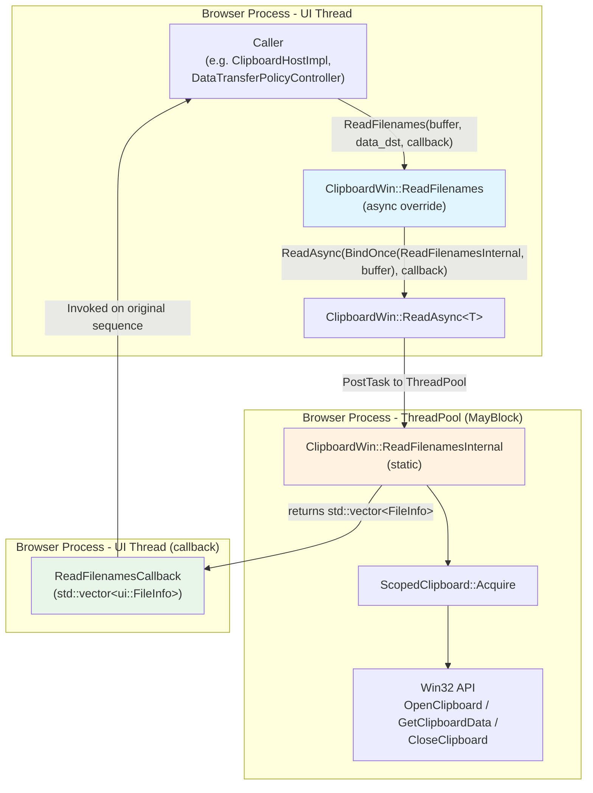

# Review Summary: CL 7556734 — [Clipboard][Windows] Use async ReadFileNames with ThreadPool offloading

**CL URL:** https://chromium-review.googlesource.com/c/chromium/src/+/7556734
**Author:** Hewro Hewei (ihewro@chromium.org)
**Reviewer:** Rohan Raja (roraja@microsoft.com)
**Date:** 2026-02-13
**Bug:** [458194647](https://crbug.com/458194647)
**Status:** NEW (Patch Set 12)
**Files Changed:** 3 files, +85/−12 lines

---

## 1. Executive Summary

This CL adds an asynchronous override of `ClipboardWin::ReadFilenames` that offloads blocking Win32 clipboard operations (`OpenClipboard`/`GetClipboardData`/`CloseClipboard`) from the UI thread to a `base::ThreadPool` sequenced task runner with the `MayBlock` trait. The existing synchronous `ReadFilenames` is refactored to delegate to a new `static` helper (`ReadFilenamesInternal`), which is shared by both the sync and async code paths. This improves UI responsiveness during file-drop paste operations on Windows, particularly when clipboard data is large or the clipboard owner is slow, without forcing any existing callers to migrate.

---

## 2. Design Assessment

### Architecture Quality

| Aspect | Rating (1-5) | Comments |
|--------|:------------:|----------|
| Clarity | 5 | Clean separation between async entry point, sync wrapper, and static internal helper. Intent is immediately obvious. |
| Maintainability | 5 | Follows the established `ReadAsync` + `*Internal` pattern used by `ReadText`, `ReadHTML`, `ReadPng`, etc. Any Chromium developer familiar with the clipboard code can understand and maintain this. |
| Extensibility | 4 | The pattern is easily replicated for future async-ification of other clipboard methods. The only minor concern is that `data_dst` remains unused, but that's a cross-platform design constraint. |
| Consistency | 5 | The implementation is virtually identical in structure to the existing `ReadHTML` async override, maintaining strong codebase consistency. |

**Overall Design Rating: 4.75/5**

### Architecture Diagram



---

## 3. Implementation Assessment

### Code Quality

| Aspect | Rating (1-5) | Comments |
|--------|:------------:|----------|
| Correctness | 5 | Logic is sound; both sync and async paths share the same `ReadFilenamesInternal` helper, eliminating behavior divergence. Follows the proven `ReadAsync` pattern. |
| Efficiency | 5 | Core goal achieved — blocking Win32 clipboard I/O moved off UI thread. Return-by-value enables NRVO. `emplace_back` used consistently. |
| Readability | 4 | Clear and well-structured. Minor deductions for missing `&` on function pointer (style inconsistency) and duplicated `data_dst` comment. |
| Test Coverage | 4 | Good coverage of primary scenarios (happy path with data, empty clipboard, no spurious data-changed events). Gaps in multi-file and format-fallback testing. |

**Overall Implementation Rating: 4.5/5**

---

## 4. Key Findings

### Critical Issues (Must Fix)

_None identified._ The implementation is correct and follows established patterns.

### Major Issues (Should Fix)

1. **Missing `&` operator on static method pointer in `BindOnce`** (clipboard_win.cc ~L429)
   - `base::BindOnce(ClipboardWin::ReadFilenamesInternal, buffer)` should be `base::BindOnce(&ClipboardWin::ReadFilenamesInternal, buffer)`.
   - While technically valid C++, Chromium style consistently uses `&` for all function/method pointers in `base::Bind*` calls. Other `ReadAsync` call sites (e.g., `ReadHTML`) use the `&` prefix.

### Minor Issues (Nice to Fix)

1. **`CHECK(result)` vs `DCHECK(result)` inconsistency** (clipboard_win.cc ~L683)
   - The original code used `DCHECK(result)`. The refactored sync `ReadFilenames` upgrades to `CHECK(result)`. Patch set 11's commit message says "recover original dcheck instead of check", suggesting the intent was to keep `DCHECK`. Either is acceptable (dereferencing null would crash anyway), but the code should match the stated intent. Recommend reverting to `DCHECK(result)` or explicitly documenting why `CHECK` is preferred.

2. **Duplicated `data_dst` comment** (clipboard_win.cc ~L424 and ~L433)
   - The `// |data_dst| is not used.` comment appears twice in close proximity. Consider adding the method name for disambiguation, e.g., `// |data_dst| in ReadFilenames is not used...`.

### Suggestions (Optional)

1. **Add `[[nodiscard]]` to `ReadFilenamesInternal`** — Since the return value must be used, `[[nodiscard]]` would prevent accidental discard.

2. **Add multi-file test case** — `ReadFilenamesAsyncReturnsWrittenData` tests a single file. A test with 2–3 files would improve coverage of the `CF_HDROP` iteration loop.

3. **Consider testing `FileNameW`/`FileNameA` fallback paths** — The async tests only exercise `CF_HDROP`. The format fallback paths in `ReadFilenamesInternal` are not explicitly tested. This may require lower-level Win32 clipboard manipulation and could be deferred.

---

## 5. Test Coverage Analysis

### Tests Present

| Test | Scenario | Status |
|------|----------|--------|
| `ReadFilenamesAsyncReturnsWrittenData` | Write single file → async read → verify path | ✅ New |
| `ReadFilenamesAsyncEmptyClipboard` | Clear clipboard → async read → verify empty | ✅ New |
| `ClipboardDoesNotTriggerDataChanged` (extended) | Async `ReadFilenames` → verify no spurious observer notifications | ✅ Extended |
| Existing sync `ReadFilenames` tests | Regression coverage for sync path | ✅ Unchanged |

### Tests Missing

| Scenario | Priority | Notes |
|----------|----------|-------|
| Multiple filenames via `CF_HDROP` | Medium | Tests iteration in `ReadFilenamesInternal` |
| `FileNameW` format fallback | Low | Requires raw clipboard manipulation |
| `FileNameA` format fallback | Low | Requires raw clipboard manipulation |
| Clipboard acquisition failure | Low | Hard to simulate Win32 contention in unit tests |
| Concurrent sync + async reads | Low | Would validate thread safety under contention |

### Recommended Additional Tests

1. **Multi-file async read**: Write 2–3 temp files via `ScopedClipboardWriter::WriteFilenames`, read async, assert count and all paths match.
2. **Callback invocation on correct sequence**: Assert that the async callback runs on the original calling sequence (not the ThreadPool thread).

---

## 6. Security Considerations

| Aspect | Assessment |
|--------|------------|
| Clipboard data handling | ✅ No new attack surface. `ScopedClipboard` provides RAII-scoped access. Data is read through the same guarded path as before. |
| Thread isolation | ✅ `ReadFilenamesInternal` is static with no instance state access. Cannot leak data between threads. |
| Input validation | ✅ `DCHECK_EQ(buffer, kCopyPaste)` validates the buffer type. Filename parsing uses existing vetted `clipboard_util::GetFilenames`. |
| HWND lifetime | ✅ The `HWND` captured by `ReadAsync` is long-lived (tied to `ClipboardWin` instance). If destroyed, `OpenClipboard` fails gracefully (returns empty). |

**No security concerns identified.** The CL does not introduce new input parsing, IPC surface, or privilege changes.

---

## 7. Performance Considerations

| Aspect | Impact |
|--------|--------|
| UI thread latency | **Positive.** Blocking Win32 clipboard calls are moved off the UI thread, reducing jank during file-drop paste operations. |
| ThreadPool utilization | **Negligible.** One additional `MayBlock` task per async `ReadFilenames` call. ThreadPool is designed for this workload. |
| Sync path overhead | **Negligible.** The sync path gains one extra function call + return-by-value, but NRVO eliminates the copy. Dominated by clipboard I/O cost. |
| Memory | **Neutral.** `std::vector<ui::FileInfo>` returned by value (move semantics). No additional allocations compared to the original. |

### Benchmarking Recommendations

- No explicit benchmarking is needed for this CL. The performance improvement (UI thread latency reduction) is structural and can be validated via existing clipboard performance traces in `chrome://tracing`.
- If desired, a before/after comparison of `ReadFilenames` duration on the UI thread under clipboard contention (e.g., clipboard held by another app) would demonstrate the benefit.

---

## 8. Final Recommendation

### Verdict: **APPROVED_WITH_COMMENTS**

### Rationale

This is a well-structured, cleanly-refactored CL that achieves its stated goal of moving blocking Win32 clipboard I/O off the UI thread. The implementation faithfully follows the established `ReadAsync` + `*Internal` pattern already used by `ReadText`, `ReadHTML`, `ReadPng`, and `ReadBitmap`, maintaining strong codebase consistency. The refactoring into `ReadFilenamesInternal` eliminates code duplication between sync and async paths. Test coverage is solid for the primary use cases, and the CL has passed multiple CI dry runs.

The only findings are minor style issues (`&` on function pointer, `CHECK` vs `DCHECK` consistency) and optional test coverage improvements. None are blockers.

### Action Items for Author

1. **[Should Fix]** Add `&` before `ClipboardWin::ReadFilenamesInternal` in the `base::BindOnce` call (~L429 in clipboard_win.cc) to match Chromium style convention.
2. **[Nice to Fix]** Clarify the `CHECK(result)` vs `DCHECK(result)` choice in the sync `ReadFilenames` overload — either revert to `DCHECK` per the patch set 11 commit message intent, or add a comment explaining why `CHECK` is preferred.
3. **[Optional]** Consider adding a multi-file async read test case for better coverage of the `CF_HDROP` iteration path.

---

## 9. Comments for Gerrit

### Comment 1: `ui/base/clipboard/clipboard_win.cc` line ~429 (async `ReadFilenames`)

> **Style nit:** The `base::BindOnce(ClipboardWin::ReadFilenamesInternal, buffer)` call is missing the `&` address-of operator. Chromium convention uses `&` for all function/method pointers in `base::Bind*` calls (see the `ReadHTML` async override for reference).
>
> ```cpp
> ReadAsync(base::BindOnce(&ClipboardWin::ReadFilenamesInternal, buffer),
>           std::move(callback));
> ```

### Comment 2: `ui/base/clipboard/clipboard_win.cc` line ~683 (sync `ReadFilenames`)

> **Minor:** The original `DCHECK(result)` was upgraded to `CHECK(result)`. Your PS11 commit message says "recover original dcheck instead of check" — should this be `DCHECK(result)` to match that intent? Either is fine functionally (dereferencing null would crash regardless), but worth being intentional about the choice.

### Comment 3: `ui/base/clipboard/clipboard_win_unittest.cc` (general)

> **Suggestion:** Nice test coverage for the async path! Consider adding a test with multiple filenames written to the clipboard to exercise the `CF_HDROP` iteration loop in `ReadFilenamesInternal`. Something like:
> ```cpp
> // Write 2-3 temp files, read async, assert count and paths.
> ```
> This could be a follow-up if you'd prefer not to expand scope here.

### Comment 4: Patchset-level

> **LGTM with minor comments.** Clean refactoring that follows the established `ReadAsync` pattern. The code structure, thread safety model, and test coverage look good. Just the `&` on the function pointer and the `CHECK`/`DCHECK` clarification to address. Thanks for the quick iteration on the diff-minimization feedback!
