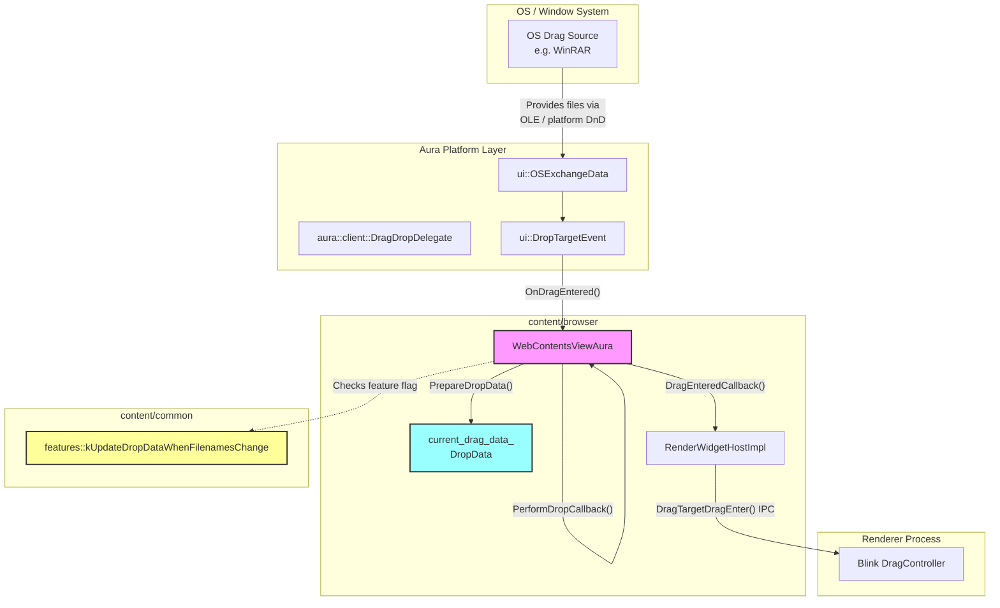
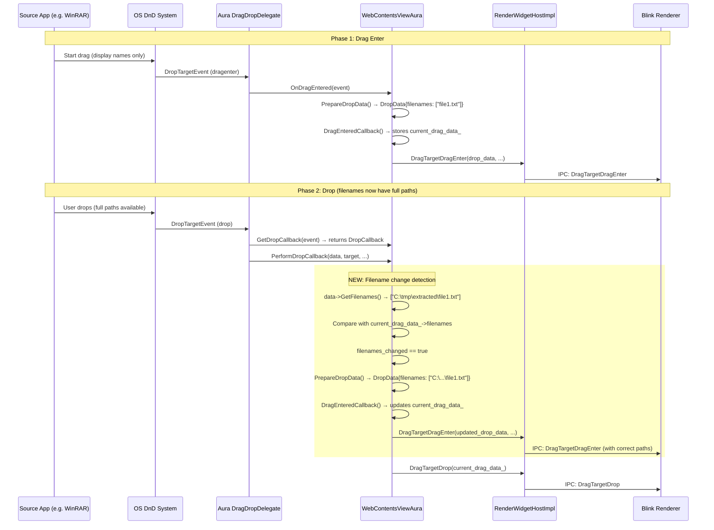

# High-Level Design: Update Drop Data if Filenames Change at Drop

**CL:** [7557194](https://chromium-review.googlesource.com/c/chromium/src/+/7557194)
**Author:** Ashish Kumar (ashishkum@microsoft.com)
**Status:** NEW (Patch Set 5)
**Bug:** [341432435](https://crbug.com/341432435)

---

## 1. Executive Summary

This CL fixes an issue where files dragged from certain applications (e.g., WinRAR) into a Chromium browser window would arrive with incomplete path information. These applications provide only display names (e.g., `file1.txt`) during the `dragenter` phase and only populate full file paths (e.g., `C:\tmp\extracted\file1.txt`) when the actual drop occurs. Because Chromium's `WebContentsViewAura` captures file metadata at drag-enter time and reuses it at drop time, the renderer would receive stale display-name-only paths, causing the drop to fail or behave incorrectly. This CL adds a check in `PerformDropCallback` to detect when filenames have changed between drag-enter and drop, and re-invokes `DragEnteredCallback` with the updated data so the renderer receives correct full file paths. The change is gated behind a feature flag (`kUpdateDropDataWhenFilenamesChange`, enabled by default) for safe rollback.

---

## 2. Architecture Overview

### Affected Components

| Component | Layer | Files Modified |
|---|---|---|
| `WebContentsViewAura` | `content/browser` — Aura-based view for web contents | `web_contents_view_aura.cc`, `web_contents_view_aura.h` |
| Content Feature Flags | `content/common` — Shared feature definitions | `features.cc`, `features.h` |
| Unit Tests | `content/browser` — Test infrastructure | `web_contents_view_aura_unittest.cc` |

### How It Fits in the Existing Architecture

`WebContentsViewAura` is Chromium's platform-specific (Aura/Views) implementation of `WebContentsView`. It implements `aura::client::DragDropDelegate`, which is the Aura interface for handling drag-and-drop events from the OS window system. The drag-and-drop pipeline already has a mechanism to re-process drop data when the target `RenderWidgetHost` changes between drag-enter and drop. This CL extends that same pattern to also handle the case where the *data itself* changes (specifically filenames) even when the target RWH remains the same.

### Component Diagram

---

## 3. Design Goals & Non-Goals

### Goals

1. **Fix stale filename data on drop:** Detect when the `ui::OSExchangeData` filenames at drop time differ from those captured at drag-enter, and update `current_drag_data_` accordingly.
2. **Safe rollout:** Gate the behavior behind a feature flag (`kUpdateDropDataWhenFilenamesChange`) that is enabled by default but can be disabled via Finch or command-line in case of regressions.
3. **Minimal code change:** Reuse the existing `DragEnteredCallback` + `PrepareDropData` pattern already used for the RWH-changed case, keeping the change additive (112 insertions, 0 deletions).

### Non-Goals

- **Updating other data types:** This CL only compares and updates filenames. Other mutable data in `OSExchangeData` (text, HTML, URLs, virtual files) is not re-checked. This is intentional—filenames are the known problematic case from apps like WinRAR.
- **Changing the drag-enter flow:** The initial `OnDragEntered` → `DragEnteredCallback` flow is unchanged.
- **Cross-platform virtual file handling:** Windows virtual file support (e.g., Outlook attachments) follows a separate code path (`GetVirtualFilesAsTempFiles`) and is not affected.
- **Refactoring the drag-and-drop architecture:** The existing asynchronous drop pipeline is preserved as-is.

---

## 4. System Interactions

### Main Flow: Drop with Changed Filenames

### IPC / Mojo Interactions

The change does not introduce new IPC or Mojo interfaces. It reuses the existing `RenderWidgetHostImpl::DragTargetDragEnter()` call, which sends the drop data to the renderer via the existing `blink::mojom::Widget::DragTargetDragEnter` Mojo interface. When filenames have changed, the re-invocation of `DragEnteredCallback` causes an additional `DragTargetDragEnter` IPC to the renderer with the corrected data before the `DragTargetDrop` IPC is sent.

---

## 5. API & Interface Changes

### New Public Interfaces

| Symbol | File | Type |
|---|---|---|
| `features::kUpdateDropDataWhenFilenamesChange` | `/workspace/cr3/src/content/common/features.h#L228` | `BASE_FEATURE` (exported via `CONTENT_EXPORT`) |

This is a new feature flag declared with `CONTENT_EXPORT BASE_DECLARE_FEATURE(kUpdateDropDataWhenFilenamesChange)` and defined in `/workspace/cr3/src/content/common/features.cc#L723` as `BASE_FEATURE(kUpdateDropDataWhenFilenamesChange, base::FEATURE_ENABLED_BY_DEFAULT)`.

### Modified Interfaces

| Symbol | File | Change |
|---|---|---|
| `WebContentsViewAura::PerformDropCallback` | `/workspace/cr3/src/content/browser/web_contents/web_contents_view_aura.cc#L1695` | New `else if` branch added (lines 1726–1742) to detect filename changes and re-enter drag data |
| `WebContentsViewAura` class | `/workspace/cr3/src/content/browser/web_contents/web_contents_view_aura.h#L154` | New `FRIEND_TEST_ALL_PREFIXES` for the unit test |

### Deprecated Interfaces

None.

---

## 6. Dependencies

### What This Code Depends On

| Dependency | Purpose |
|---|---|
| `ui::OSExchangeData::GetFilenames()` | Retrieves the current filenames from the OS drag data at drop time |
| `base::FeatureList::IsEnabled()` | Checks the feature flag gate |
| `WebContentsViewAura::PrepareDropData()` | Converts `OSExchangeData` → `DropData` |
| `WebContentsViewAura::DragEnteredCallback()` | Updates `current_drag_data_` and sends `DragTargetDragEnter` to the renderer |
| `DropData::filenames` (`std::vector<ui::FileInfo>`) | The field being compared for changes; uses `operator!=` for comparison |

### What Depends On This Code

| Dependent | Impact |
|---|---|
| Renderer (Blink `DragController`) | Will now receive an additional `DragTargetDragEnter` IPC when filenames change. The renderer already handles re-entry, so no renderer-side changes are needed. |
| `WebContentsViewDelegate` | The `CanDragEnter` delegate check is re-invoked via `DragEnteredCallback` when filenames change. Delegates must tolerate being called again. |
| Feature flag infrastructure (Finch) | The new flag `kUpdateDropDataWhenFilenamesChange` can be toggled remotely. |

### Version / Compatibility Considerations

- The feature flag is enabled by default, so the fix is active immediately upon landing.
- No backward compatibility concerns: the change is purely additive to the existing drop flow.
- The flag provides a kill-switch if any unexpected regressions emerge.

---

## 7. Risks & Mitigations

### Risk 1: Double `DragTargetDragEnter` IPC to Renderer

**Risk:** When filenames change, `DragEnteredCallback` is called again, which sends a second `DragTargetDragEnter` to the renderer. If the renderer does not handle a second enter before a drop, it could cause unexpected state.

**Mitigation:** This is an existing pattern—the same code already calls `DragEnteredCallback` when the *target RWH* changes (lines 1717–1725). The renderer's `DragController` is designed to handle re-entry. Additionally, `DragEnteredCallback` calls `DragTargetDragLeave` on the old target before entering the new one when RWH changes; in the filename-change case, the target is the same RWH, so no leave is sent (same as an update-in-place).

### Risk 2: Performance Impact from Filename Comparison

**Risk:** `data->GetFilenames()` is called on every drop even when filenames haven't changed, and the `!=` comparison on `std::vector<ui::FileInfo>` iterates all entries.

**Mitigation:** Low risk. Typical drag-and-drop operations involve very few files. The comparison is O(n) where n is the number of files, and `GetFilenames()` returns a cached value from the OS exchange data. The overhead is negligible compared to the overall asynchronous drop pipeline.

### Risk 3: Feature Flag Enabled by Default

**Risk:** The fix ships enabled immediately. If there's an unexpected interaction (e.g., a source app that deliberately changes filenames to something the renderer shouldn't see), it could cause issues.

**Mitigation:** The feature flag `kUpdateDropDataWhenFilenamesChange` provides a kill-switch. It can be disabled via Finch or `--disable-features=UpdateDropDataWhenFilenamesChange`. The existing `FilterDropData()` sanitization in `DragEnteredCallback` (line 1444) still applies to the updated data.

### Risk 4: `current_drag_data_` Null Dereference

**Risk:** Line 1735 accesses `current_drag_data_->filenames` without a null check. If `current_drag_data_` is null at this point, this would crash.

**Mitigation:** The `else if` branch at line 1726 is only reached when the target RWH has *not* changed (i.e., `target_rwh == current_rwh_for_drag_`). The `current_rwh_for_drag_` is set in `DragEnteredCallback`, which also sets `current_drag_data_`. If `current_rwh_for_drag_` is valid, `current_drag_data_` should also be valid. However, there is no explicit null guard, which could be fragile if future refactoring breaks this invariant.

### Backward Compatibility

No backward compatibility concerns. The change is purely additive and gated by a feature flag.

---

## 8. Testing Strategy

### Unit Tests Added

A new unit test `WebContentsViewAuraTest.DropDataUpdatedWhenFilenamesChange` is added in `/workspace/cr3/src/content/browser/web_contents/web_contents_view_aura_unittest.cc#L455`.

**Test flow:**
1. Creates initial `OSExchangeData` with display-name-only paths (`file1.txt`, `file2.txt`)
2. Simulates `OnDragEntered()` and verifies `current_drag_data_` captures the initial filenames
3. Creates updated `OSExchangeData` with full paths (`/tmp/extracted/file1.txt`, etc.)
4. Simulates a drop via `GetDropCallback` + `PerformDropCallback`
5. Verifies the final drop data contains the **updated** full paths, not the initial display names

The test is cross-platform (uses `#if BUILDFLAG(IS_WIN)` for Windows-style paths vs POSIX paths).

### Test Coverage Assessment

| Scenario | Covered |
|---|---|
| Filenames change between drag-enter and drop | ✅ Unit test |
| Filenames do NOT change (no-op path) | ❌ Not explicitly tested (though existing drop tests implicitly cover this since filenames don't change in standard tests) |
| `current_drag_data_` is null when entering the new branch | ❌ Not tested |
| Feature flag disabled | ❌ Not tested (would need a test with `ScopedFeatureList` disabling the flag) |
| Multiple files with partial changes (some paths updated, some not) | ❌ Not tested |
| Virtual files interaction on Windows | ❌ Not tested |

### Recommended Additional Tests

- A test with `base::test::ScopedFeatureList` that disables `kUpdateDropDataWhenFilenamesChange` and verifies the old (stale-data) behavior is preserved.
- A test where filenames are identical at drag-enter and drop to confirm no re-invocation of `DragEnteredCallback`.

---

## Appendix: Key Code Locations

| Item | Path | Lines |
|---|---|---|
| Core logic change | `/workspace/cr3/src/content/browser/web_contents/web_contents_view_aura.cc` | 1726–1742 |
| `PerformDropCallback` full method | `/workspace/cr3/src/content/browser/web_contents/web_contents_view_aura.cc` | 1695–1750+ |
| `DragEnteredCallback` | `/workspace/cr3/src/content/browser/web_contents/web_contents_view_aura.cc` | 1424–1484 |
| `PrepareDropData` | `/workspace/cr3/src/content/browser/web_contents/web_contents_view_aura.cc` | 713–770 |
| Feature flag definition | `/workspace/cr3/src/content/common/features.cc` | 721–724 |
| Feature flag declaration | `/workspace/cr3/src/content/common/features.h` | 228 |
| Unit test | `/workspace/cr3/src/content/browser/web_contents/web_contents_view_aura_unittest.cc` | 455–538 |
| FRIEND_TEST declaration | `/workspace/cr3/src/content/browser/web_contents/web_contents_view_aura.h` | 153–154 |
