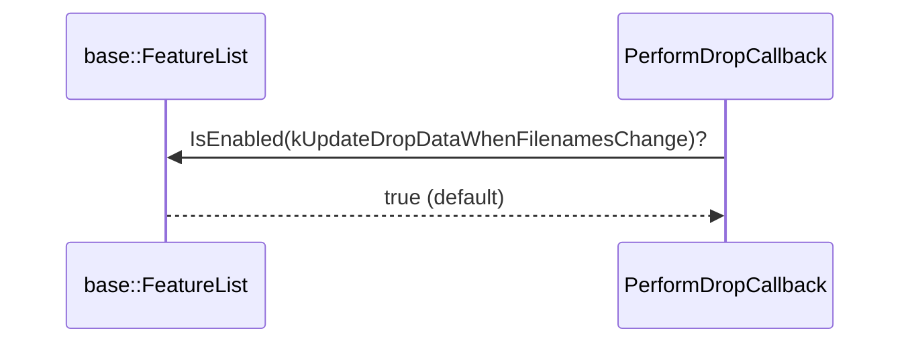
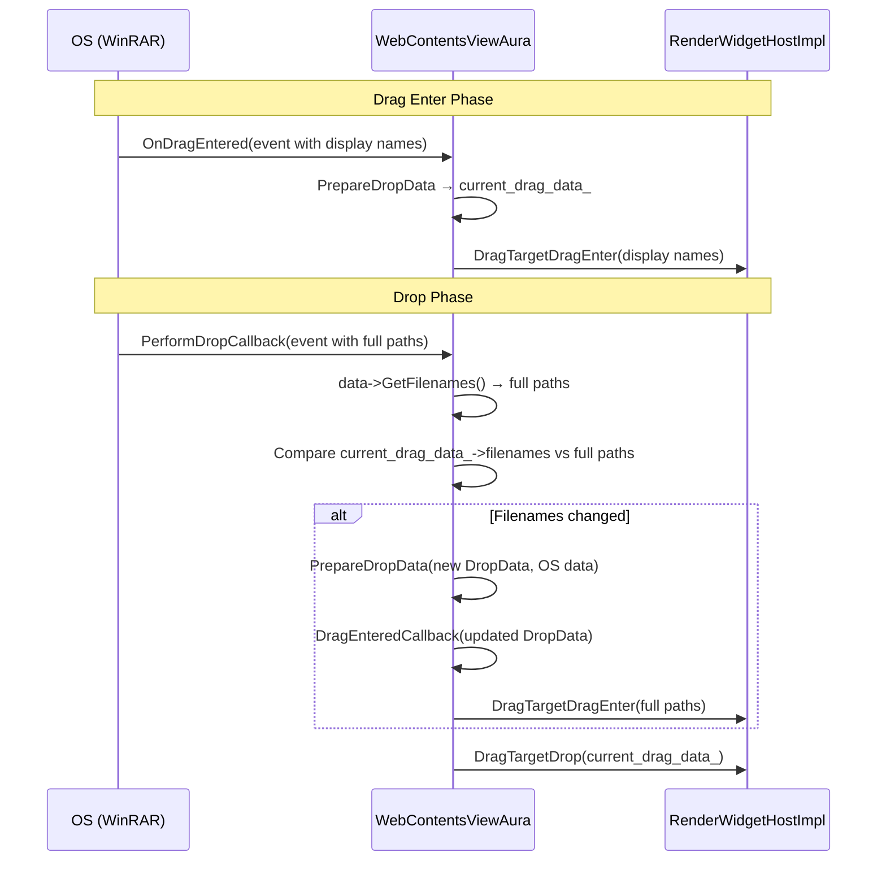
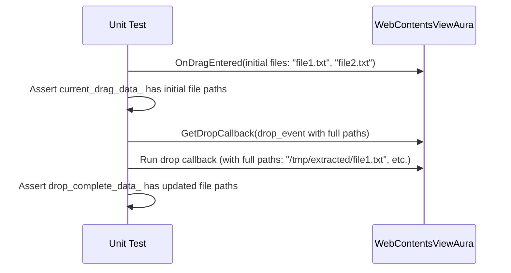
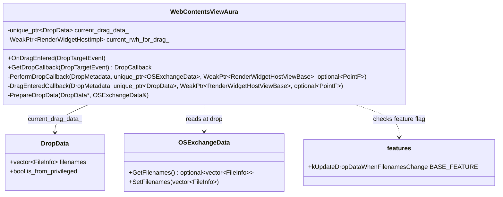
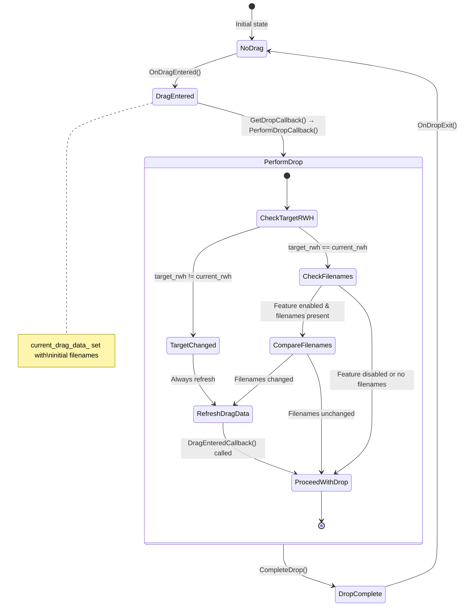

# Low-Level Design Document — CL 7557194

## CL Title: Update drop data if filenames change at drop

### Summary

Some applications (e.g., WinRAR) only provide file display names during `dragenter` but populate the full file path at `drop` time, because the source app doesn't extract the full data until it is actually requested. This CL detects when filenames have changed between `dragenter` and `drop`, and re-invokes `DragEnteredCallback` with the updated drop data so the renderer receives the correct file paths.

---

## 1. File-by-File Analysis

---

#### `content/common/features.h`

**Purpose of changes**: Declare a new feature flag `kUpdateDropDataWhenFilenamesChange`.

**Key modifications**:
- Added `CONTENT_EXPORT BASE_DECLARE_FEATURE(kUpdateDropDataWhenFilenamesChange);` at the appropriate alphabetical position in the feature declarations (line 228), outside any platform-specific `#if` guards — making it available on all platforms.

**New/Modified Functions**:

| Symbol | Purpose | Type |
|--------|---------|------|
| `kUpdateDropDataWhenFilenamesChange` | Feature flag to gate the filename-change detection at drop time | `BASE_DECLARE_FEATURE` (extern declaration) |

**Notes**: The declaration is not guarded by any platform `#if`, meaning the feature is compiled on all platforms. This is intentional — see the `.cc` analysis below.

---

#### `content/common/features.cc`

**Purpose of changes**: Define the feature flag with a default state.

**Key modifications**:
- Added the definition of `kUpdateDropDataWhenFilenamesChange` with `base::FEATURE_ENABLED_BY_DEFAULT` (lines 721–724).
- Placed between `kUpdateDirectManipulationHelperOnParentChange` (Windows-only) and `kValidateNetworkServiceProcessIdentity` (Mac-only), maintaining alphabetical ordering.

**New/Modified Functions**:

| Symbol | Purpose | Default State |
|--------|---------|---------------|
| `BASE_FEATURE(kUpdateDropDataWhenFilenamesChange, ...)` | Controls whether drop data is refreshed when filenames differ from drag-enter to drop | `FEATURE_ENABLED_BY_DEFAULT` |

**Data Flow**:



---

#### `content/browser/web_contents/web_contents_view_aura.h`

**Purpose of changes**: Grant the new unit test friend access to private members of `WebContentsViewAura`.

**Key modifications**:
- Added `FRIEND_TEST_ALL_PREFIXES(WebContentsViewAuraTest, DropDataUpdatedWhenFilenamesChange);` (lines 155–156).

**API Changes**: None — this is a test-only friend declaration; no public or protected API surfaces are altered.

---

#### `content/browser/web_contents/web_contents_view_aura.cc`

**Purpose of changes**: Implement the core logic — detect filename changes at drop time and refresh `current_drag_data_` with updated file information.

**Key modifications**:
- Added an `else if` branch inside `PerformDropCallback()` (lines 1726–1743), after the existing `if (target_rwh != current_rwh_for_drag_)` block.
- The new branch:
  1. Calls `data->GetFilenames()` to retrieve filenames from the OS exchange data at drop time.
  2. Guards execution behind `base::FeatureList::IsEnabled(features::kUpdateDropDataWhenFilenamesChange)`.
  3. Checks `filenames.has_value()` to ensure the data contains filenames.
  4. Compares `current_drag_data_->filenames` (set at drag-enter) with the newly retrieved filenames.
  5. If they differ, creates a fresh `DropData`, calls `PrepareDropData` to populate it from the OS exchange data, and calls `DragEnteredCallback` to replace `current_drag_data_` and re-enter the drag target in the renderer.

**New/Modified Functions**:

| Function | Purpose | Parameters | Returns |
|----------|---------|------------|---------|
| `PerformDropCallback` (modified) | Now detects filename changes between drag-enter and drop, refreshing drag data when needed | `DropMetadata`, `unique_ptr<OSExchangeData>`, `WeakPtr<RenderWidgetHostViewBase>`, `optional<PointF>` | `void` |

**Logic Flow (within `PerformDropCallback`)**:

```mermaid
flowchart TD
    A[PerformDropCallback called] --> B{target_rwh != current_rwh_for_drag_?}
    B -- Yes --> C[Create new DropData, call DragEnteredCallback]
    B -- No --> D{Feature kUpdateDropDataWhenFilenamesChange enabled?}
    D -- No --> G[Skip to existing drop logic]
    D -- Yes --> E{data->GetFilenames() has value?}
    E -- No --> G
    E -- Yes --> F{current_drag_data_->filenames != new filenames?}
    F -- No --> G
    F -- Yes --> H[Create new DropData from OS exchange data]
    H --> I[Call DragEnteredCallback with updated data]
    I --> G
    G --> J{current_drag_data_ != nullptr?}
    J -- No --> K[Return early]
    J -- Yes --> L[Proceed with drop - OnPerformingDropContext]
```

**Data Flow**:



**Detailed Code Analysis (lines 1726–1743)**:

```cpp
} else if (std::optional<std::vector<ui::FileInfo>> filenames =
               data->GetFilenames();
           base::FeatureList::IsEnabled(
               features::kUpdateDropDataWhenFilenamesChange) &&
           filenames.has_value()) {
    bool filenames_changed = current_drag_data_->filenames != filenames.value();
    if (filenames_changed) {
      std::unique_ptr<DropData> drop_data = std::make_unique<DropData>();
      PrepareDropData(drop_data.get(), *data.get());
      DragEnteredCallback(drop_metadata, std::move(drop_data), target,
                          transformed_pt);
    }
}
```

- Uses C++17 `if` with initializer: `filenames` is initialized in the `if` statement and its scope is limited to the branch.
- `data->GetFilenames()` returns `std::optional<std::vector<ui::FileInfo>>` — empty if no filename data is present.
- The feature flag check short-circuits before the comparison if disabled.
- `current_drag_data_->filenames` uses `operator!=` on `std::vector<ui::FileInfo>`, which performs element-wise comparison of `FileInfo::path` and `FileInfo::display_name`.

---

#### `content/browser/web_contents/web_contents_view_aura_unittest.cc`

**Purpose of changes**: Add a unit test `DropDataUpdatedWhenFilenamesChange` to verify that drop data is correctly refreshed when filenames change.

**Key modifications**:
- Added test `TEST_F(WebContentsViewAuraTest, DropDataUpdatedWhenFilenamesChange)` (lines 455–538).

**Test Flow**:



**Test Structure**:

| Phase | Action | Assertion |
|-------|--------|-----------|
| Setup | Create initial `OSExchangeData` with short filenames (`file1.txt`, `file2.txt`) | — |
| Drag Enter | Call `view->OnDragEntered(dragenter_event)` | `current_drag_data_` is non-null; `filenames` match initial values |
| Drop | Create new `OSExchangeData` with full paths; get and run drop callback | `drop_complete_data_->drop_data.filenames` matches updated full paths |

**Platform handling**:
- Uses `#if BUILDFLAG(IS_WIN)` / `#else` to provide platform-appropriate file paths (Windows backslash paths vs. POSIX forward-slash paths).
- On Windows, initial paths are relative (`file1.txt`); updated are absolute (`C:\tmp\extracted\file1.txt`).
- On non-Windows, initial paths are absolute but lack directory components (`/file1.txt`); updated have full directory paths (`/tmp/extracted/file1.txt`).

---

## 2. Class Diagram



---

## 3. State Diagram



---

## 4. Implementation Concerns

### 4.1 Memory Management
- **No issues identified.** `DropData` is managed via `std::unique_ptr` and ownership is correctly transferred to `DragEnteredCallback` via `std::move`. The old `current_drag_data_` is replaced inside `DragEnteredCallback` (line 1443: `current_drag_data_ = std::move(drop_data)`).

### 4.2 Thread Safety
- **No new concerns.** `PerformDropCallback` runs on the UI thread (as a callback from aura's drop handling), consistent with all other drag/drop code in this class. The feature flag check via `base::FeatureList::IsEnabled` is thread-safe.

### 4.3 Performance Implications
- **Minimal.** The extra work only occurs when:
  1. The feature is enabled (default: yes),
  2. The OS exchange data contains filenames, and
  3. The filenames actually changed.
- `data->GetFilenames()` may involve reading from OS clipboard/DnD subsystem, but this call already occurs in `PrepareDropData`, so it is not a new cost — only the comparison is new.
- `operator!=` on `std::vector<ui::FileInfo>` is O(n) in the number of files, which is expected to be small.

### 4.4 Correctness Concerns

#### 4.4.1 `current_drag_data_` Null Dereference Risk
- **Potential issue**: The `else if` branch accesses `current_drag_data_->filenames` (line 1735) without first checking that `current_drag_data_` is non-null. The `current_drag_data_` member can be null if `DragEnteredCallback` was never called (e.g., drag was cancelled before entering). However, this code path is only reachable in the `else` of `target_rwh != current_rwh_for_drag_`, meaning the target RWH hasn't changed. If `current_rwh_for_drag_` is set (which it must be for the comparison to succeed), then `DragEnteredCallback` was previously called and `current_drag_data_` should be non-null — **unless** `DragEnteredCallback` set it to null due to `allow_drag()` returning false (line 1470). In that case, `current_drag_data_` would be null and the access would crash.
- **Severity**: Low — this scenario is unlikely in practice (if drag was rejected at enter, the same target should also reject it at drop), but it is not defended against.

#### 4.4.2 Re-entering `DragEnteredCallback` Side Effects
- Calling `DragEnteredCallback` during `PerformDropCallback` resets `drag_in_progress_ = true` and `dropped_in_this_web_contents_ = false` (lines 1429–1430). However, `drag_in_progress_` was already set by the initial `OnDragEntered`, so this should be benign. The `dropped_in_this_web_contents_` reset is worth noting — it was set by `OnPerformDrop` before `PerformDropCallback` was invoked, and resetting it to `false` could affect cleanup logic in `OnDropExit`. The existing code for the `target_rwh != current_rwh_for_drag_` case has the same behavior, so this is pre-existing.

#### 4.4.3 `DragTargetDragEnter` called twice
- When filenames change, `DragEnteredCallback` calls `DragTargetDragEnter` on the renderer (line 1476). This means the renderer receives a second `DragTargetDragEnter` call without an intervening `DragTargetDragLeave`. The existing code for the RWH-change case sends a `DragTargetDragLeave` first (line 1719–1720), but the filename-change path does **not** send a leave first. This could potentially confuse renderer-side drag state tracking, though in practice Chrome's drag handling in Blink is likely resilient to this.

### 4.5 Feature Flag Concerns
- **Enabled by default on all platforms.** While the motivating use case is Windows-specific (WinRAR), the feature and code path are not platform-gated. This means the filename comparison runs on all platforms (Linux, Mac, ChromeOS, Android, etc.), even though the scenario of filenames changing between drag-enter and drop is primarily a Windows behavior. This is harmless (the comparison will simply find no change and skip the update), but it adds a small, unnecessary overhead on non-Windows platforms.

### 4.6 Maintainability
- The `else if` with C++17 initializer is well-structured and readable.
- The comment block clearly explains the "why" behind the change.
- The feature flag provides a safe rollback mechanism.

---

## 5. Suggestions for Improvement

### 5.1 Add Null Check for `current_drag_data_`
Before accessing `current_drag_data_->filenames`, add a null check:

```cpp
} else if (current_drag_data_ &&
           std::optional<std::vector<ui::FileInfo>> filenames =
               data->GetFilenames();
           base::FeatureList::IsEnabled(
               features::kUpdateDropDataWhenFilenamesChange) &&
           filenames.has_value()) {
```

Or more readably, check inside the body:

```cpp
} else if (...) {
    if (!current_drag_data_) {
      return;  // or skip
    }
    bool filenames_changed = current_drag_data_->filenames != filenames.value();
    ...
```

### 5.2 Consider Platform-Gating the Feature
Since the filename-change scenario is primarily a Windows issue (apps like WinRAR), consider gating both the feature flag and the code path behind `#if BUILDFLAG(IS_WIN)`:

```cpp
#if BUILDFLAG(IS_WIN)
  } else if (...kUpdateDropDataWhenFilenamesChange...) {
      ...
  }
#endif
```

This would avoid the (admittedly minor) overhead on non-Windows platforms and make the platform-specific nature of the fix explicit.

### 5.3 Consider Sending `DragTargetDragLeave` Before Re-entering
For consistency with the existing `target_rwh != current_rwh_for_drag_` path, consider sending a `DragTargetDragLeave` to the renderer before calling `DragEnteredCallback` in the filename-changed path:

```cpp
if (filenames_changed) {
    current_rwh_for_drag_->DragTargetDragLeave(transformed_pt.value(),
                                               screen_pt);
    std::unique_ptr<DropData> drop_data = std::make_unique<DropData>();
    PrepareDropData(drop_data.get(), *data.get());
    DragEnteredCallback(drop_metadata, std::move(drop_data), target,
                        transformed_pt);
}
```

### 5.4 Test Enhancement — Add Feature-Disabled Test
Consider adding a companion test that verifies behavior when `kUpdateDropDataWhenFilenamesChange` is disabled (i.e., filenames are NOT updated at drop):

```cpp
TEST_F(WebContentsViewAuraTest, DropDataNotUpdatedWhenFeatureDisabled) {
    base::test::ScopedFeatureList feature_list;
    feature_list.InitAndDisableFeature(
        features::kUpdateDropDataWhenFilenamesChange);
    // ... same setup but assert filenames remain as initial values
}
```

### 5.5 Test Enhancement — Non-Windows Initial Paths
On non-Windows platforms, the test uses absolute paths for the initial file infos (`/file1.txt`). The motivating scenario is display-name-only paths (relative/short names). While this works for the comparison logic, it doesn't perfectly mirror the real-world scenario. Consider using relative paths on non-Windows as well if `ui::FileInfo` supports them.

### 5.6 Minor: Avoid `filenames.value()` When `has_value` Already Checked
The code could use `*filenames` instead of `filenames.value()` to avoid the redundant check inside `value()`:

```cpp
bool filenames_changed = current_drag_data_->filenames != *filenames;
```

This is a stylistic preference — both are correct since `has_value()` is already confirmed.

---

## 6. Summary of Risk Assessment

| Concern | Severity | Likelihood | Notes |
|---------|----------|------------|-------|
| Null deref on `current_drag_data_` | Medium | Low | Unlikely but possible if drag was rejected at enter |
| Missing `DragTargetDragLeave` before re-enter | Low | Low | Renderer likely resilient; mirrors existing pattern partially |
| Feature enabled on all platforms | None | N/A | Harmless; comparison finds no change on non-Windows |
| `dropped_in_this_web_contents_` reset | Low | Low | Pre-existing pattern in the adjacent code path |
| Performance overhead | None | N/A | Negligible; O(n) comparison on small file lists |
