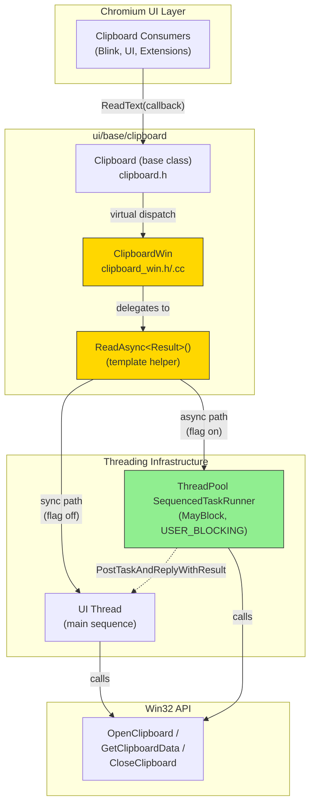
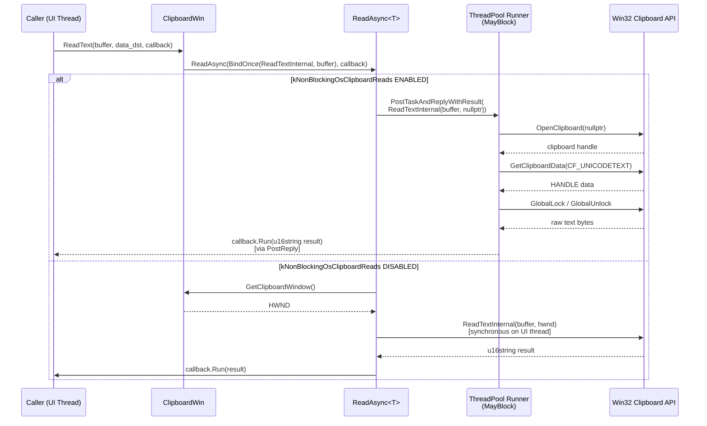
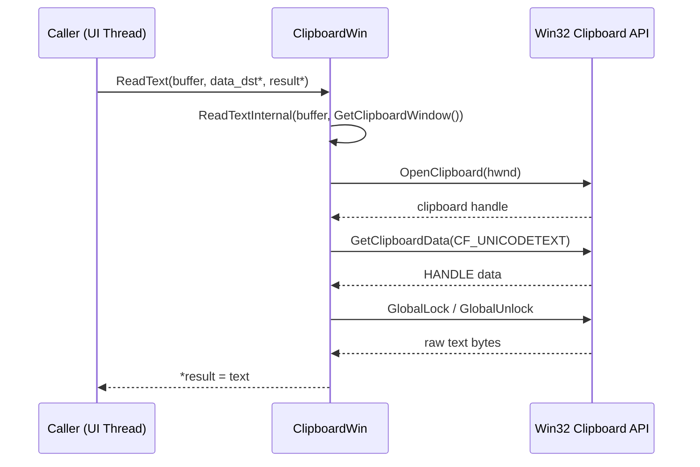

# High-Level Design: CL 7558493

## [Clipboard][Windows] Use async ReadText/ReadAsciiText with ThreadPool offloading

**CL URL:** https://chromium-review.googlesource.com/c/chromium/src/+/7558493
**Author:** Hewro Hewei (ihewro@chromium.org)
**Bug:** [crbug.com/458194647](https://crbug.com/458194647)

---

## 1. Executive Summary

This CL extends the existing `ClipboardWin` async clipboard-read pattern—previously applied to `ReadHTML`, `ReadFilenames`, and `ReadPng`—to also cover `ReadText` and `ReadAsciiText`. When the feature flag `kNonBlockingOsClipboardReads` is enabled, the Win32 clipboard `OpenClipboard`/`GetClipboardData`/`CloseClipboard` calls for text formats (`CF_UNICODETEXT`, `CF_TEXT`) are executed on a `base::ThreadPool` sequenced task runner with `MayBlock` trait, rather than synchronously on the UI thread. This prevents UI jank caused by clipboard contention (e.g., when another process holds the clipboard lock). The change is gated behind an existing feature flag and preserves the synchronous code path as a fallback, making it safe to land incrementally.

---

## 2. Architecture Overview

### 2.1 Affected Components

| Component | File(s) | Change Type |
|---|---|---|
| `ClipboardWin` (Windows clipboard implementation) | `ui/base/clipboard/clipboard_win.cc` | Modified: refactored `ReadText`/`ReadAsciiText` into static `*Internal` functions; added async overrides |
| `ClipboardWin` header | `ui/base/clipboard/clipboard_win.h` | Modified: declared new async overrides and static internal helpers |
| `ClipboardWin` unit tests | `ui/base/clipboard/clipboard_win_unittest.cc` | Modified: added 4 new async read tests |

### 2.2 Architectural Fit

The `Clipboard` base class (`ui/base/clipboard/clipboard.h`) defines two overloads for each read operation:

1. **Synchronous** — takes raw pointer out-params (e.g., `std::u16string* result`), blocks the caller.
2. **Asynchronous** — takes a `base::OnceCallback`, allowing the platform implementation to defer work.

The base class provides a default async implementation that simply wraps the sync path. `ClipboardWin` overrides the async path to use `ReadAsync<Result>()`, which conditionally posts work to a `worker_task_runner_` (ThreadPool) when `kNonBlockingOsClipboardReads` is enabled.

**Before this CL:** Only `ReadHTML`, `ReadFilenames`, and `ReadPng` had custom async overrides in `ClipboardWin`.
**After this CL:** `ReadText` and `ReadAsciiText` also have custom async overrides following the identical pattern.

### 2.3 Component Diagram

---

## 3. Design Goals & Non-Goals

### 3.1 Goals

| # | Goal |
|---|------|
| G1 | **Avoid UI-thread blocking** when reading text/ASCII-text from the Windows clipboard. The Win32 `OpenClipboard` call can block if another process holds the lock. |
| G2 | **Follow the established pattern** used by `ReadHTML`, `ReadFilenames`, and `ReadPng` async overrides in `ClipboardWin`. |
| G3 | **Preserve backward compatibility** — the synchronous overloads (`ReadText(... std::u16string*)`) continue to work unchanged. |
| G4 | **Feature-flag gated** — new behavior is controlled by `features::kNonBlockingOsClipboardReads`, enabling safe rollout and rollback. |

### 3.2 Non-Goals

| # | Non-Goal |
|---|----------|
| N1 | Migrating all callers to the async API. This CL only provides the async implementation; caller migration is tracked separately. |
| N2 | Async support for other clipboard formats (e.g., `ReadSvg`, `ReadRTF`, `ReadData`, `ReadBookmark`). These remain synchronous-only. |
| N3 | Cross-platform changes. Only the Windows implementation is modified. |
| N4 | Changing the `ReadAsync` template itself or the feature flag behavior. |

---

## 4. System Interactions

### 4.1 Interaction Overview

The async read flow involves three layers: the calling code (typically on the UI thread), the `ClipboardWin::ReadAsync` template helper, and the Win32 clipboard API (potentially on a background thread).

### 4.2 Sequence Diagram — Async Read Path (Feature Enabled)

### 4.3 Sequence Diagram — Synchronous Read Path (Unchanged)

### 4.4 IPC / Mojo

No IPC or Mojo changes are involved. The clipboard reads happen within the browser process; the async offloading is purely intra-process threading.

---

## 5. API & Interface Changes

### 5.1 New Public Interfaces

None. All new methods are private overrides of existing virtual methods in the `Clipboard` base class.

### 5.2 Modified Interfaces (Private)

| Method | Change | File |
|--------|--------|------|
| `ClipboardWin::ReadText(buffer, optional<DTE>&, ReadTextCallback)` | **New override** — async version that delegates to `ReadAsync` | `clipboard_win.h:60-62` |
| `ClipboardWin::ReadAsciiText(buffer, optional<DTE>&, ReadAsciiTextCallback)` | **New override** — async version that delegates to `ReadAsync` | `clipboard_win.h:63-65` |
| `ClipboardWin::ReadTextInternal(buffer, HWND)` | **New static helper** — extracted from the synchronous `ReadText`, returns `std::u16string` | `clipboard_win.h:140-141` |
| `ClipboardWin::ReadAsciiTextInternal(buffer, HWND)` | **New static helper** — extracted from the synchronous `ReadAsciiText`, returns `std::string` | `clipboard_win.h:142-143` |

### 5.3 Refactored (Existing Synchronous Overrides)

| Method | Change |
|--------|--------|
| `ClipboardWin::ReadText(buffer, DTE*, u16string*)` | Now delegates to `ReadTextInternal` instead of containing inline logic |
| `ClipboardWin::ReadAsciiText(buffer, DTE*, string*)` | Now delegates to `ReadAsciiTextInternal` instead of containing inline logic |

### 5.4 Deprecated Interfaces

None.

---

## 6. Dependencies

### 6.1 What This Code Depends On

| Dependency | Purpose |
|------------|---------|
| `base::ThreadPool::CreateSequencedTaskRunner` | Creates the `worker_task_runner_` for background clipboard access |
| `base::FeatureList` / `features::kNonBlockingOsClipboardReads` | Feature flag gating async behavior (`ui/base/ui_base_features.h`) |
| `base::OnceCallback` / `base::BindOnce` | Callback plumbing for async result delivery |
| `PostTaskAndReplyWithResult` | Posts `ReadTextInternal`/`ReadAsciiTextInternal` to worker, replies on caller sequence |
| Win32 clipboard API (`OpenClipboard`, `GetClipboardData`, `GlobalLock`, etc.) | Actual clipboard data retrieval |
| `ScopedClipboard` | RAII wrapper for `OpenClipboard`/`CloseClipboard` |

### 6.2 What Depends on This Code

| Dependent | Impact |
|-----------|--------|
| All callers of `Clipboard::ReadText` with callback API | Will benefit from non-blocking reads when the flag is enabled |
| All callers of `Clipboard::ReadAsciiText` with callback API | Same as above |
| Callers using synchronous overloads (`ReadText(... std::u16string*)`) | **No impact** — unchanged behavior |

### 6.3 Version / Compatibility

- No new dependencies introduced; all used APIs (`ReadAsync`, `worker_task_runner_`, feature flag) already exist from prior CLs for `ReadHTML`/`ReadFilenames`.
- The static internal functions are `private` to `ClipboardWin`, so there's no ABI concern.

---

## 7. Risks & Mitigations

| # | Risk | Severity | Mitigation |
|---|------|----------|------------|
| R1 | **Clipboard contention on ThreadPool** — if many async reads are queued, they serialize on the sequenced runner. | Low | The runner is `USER_BLOCKING` priority, and clipboard reads are fast in normal cases. Sequencing prevents concurrent `OpenClipboard` calls which would fail anyway. |
| R2 | **`owner_window = nullptr` in async path** — `OpenClipboard(nullptr)` behaves differently from `OpenClipboard(hwnd)` (per MSDN: the current task is associated rather than a specific window). | Low | This is the same pattern already shipping for `ReadHTML` and `ReadFilenames`. The `nullptr` HWND is intentional for the thread-pool path since `GetClipboardWindow()` returns a UI-thread window handle that cannot be used cross-thread. |
| R3 | **RecordRead called off UI thread** — `RecordRead(ClipboardFormatMetric::kText)` is called inside `ReadTextInternal`, which may run on the ThreadPool. | Low | `RecordRead` uses thread-safe UMA histogram recording. This is the same pattern used by other internal functions. |
| R4 | **Feature flag rollback** — if the flag is disabled, behavior reverts to synchronous. | None | The synchronous path is fully preserved and tested; rollback is safe. |
| R5 | **Static function accessing global state** — `GetClipboardDataWithLimit` and `TrimAfterNull` are called from static methods. | None | These are already free functions / static helpers used safely by existing static internal methods (`ReadHTMLInternal`, `ReadFilenamesInternal`). |

### Backward Compatibility

Fully backward compatible:
- Synchronous `ReadText`/`ReadAsciiText` overloads continue to work identically.
- Async overrides are new additions that previously fell through to the base class default (which wraps the sync path). The new overrides produce the same result, just potentially on a different thread.
- Feature-flag gated, so no behavior change without explicit opt-in.

---

## 8. Testing Strategy

### 8.1 Tests Added in This CL

The CL adds **4 new unit tests** and extends **2 existing tests** in `clipboard_win_unittest.cc`:

| Test | Purpose |
|------|---------|
| `ReadTextAsyncReturnsWrittenData` | Writes Unicode text via `ScopedClipboardWriter`, reads it back via async `ReadText`, verifies correctness |
| `ReadTextAsyncEmptyClipboard` | Clears clipboard, reads via async `ReadText`, verifies empty result |
| `ReadAsciiTextAsyncReturnsWrittenData` | Writes text, reads it back via async `ReadAsciiText`, verifies correctness |
| `ReadAsciiTextAsyncEmptyClipboard` | Clears clipboard, reads via async `ReadAsciiText`, verifies empty result |
| *(existing)* `ReadDoesNotChangeClipboardData` | Extended to also test async `ReadText` and `ReadAsciiText` don't trigger clipboard-change notifications |

### 8.2 Test Infrastructure

- Tests use `base::test::TestFuture<T>` to await async callback results.
- Tests use `base::test::TaskEnvironment` which provides a thread pool for the async path.
- The `ClipboardWinTest` fixture monitors `ClipboardMonitor` for unexpected clipboard-change events.

### 8.3 Coverage Assessment

| Scenario | Covered? |
|----------|----------|
| Async read of Unicode text (non-empty) | ✅ |
| Async read of Unicode text (empty clipboard) | ✅ |
| Async read of ASCII text (non-empty) | ✅ |
| Async read of ASCII text (empty clipboard) | ✅ |
| Sync read still works (existing tests) | ✅ (pre-existing) |
| No clipboard-change side effects | ✅ |
| Feature flag disabled (sync fallback) | ⚠️ Not explicitly tested in this CL, but `ReadAsync` template already tested via HTML/Filenames paths |
| Clipboard contention / lock timeout | ❌ Not tested (hard to simulate in unit tests) |

### 8.4 Test File References

- `/workspace/cr4/src/ui/base/clipboard/clipboard_win_unittest.cc` — all new tests

---

## Appendix: Key File References

| File | Relevant Lines | Description |
|------|---------------|-------------|
| `/workspace/cr4/src/ui/base/clipboard/clipboard_win.cc` | L404-419 | New async `ReadText`/`ReadAsciiText` overrides |
| `/workspace/cr4/src/ui/base/clipboard/clipboard_win.cc` | L487-519 | Refactored sync `ReadText` + new `ReadTextInternal` static |
| `/workspace/cr4/src/ui/base/clipboard/clipboard_win.cc` | L523-554 | Refactored sync `ReadAsciiText` + new `ReadAsciiTextInternal` static |
| `/workspace/cr4/src/ui/base/clipboard/clipboard_win.cc` | L1015-1029 | `ReadAsync<Result>` template implementation |
| `/workspace/cr4/src/ui/base/clipboard/clipboard_win.h` | L60-65 | Async override declarations |
| `/workspace/cr4/src/ui/base/clipboard/clipboard_win.h` | L137-143 | `ReadAsync` + internal helper declarations |
| `/workspace/cr4/src/ui/base/clipboard/clipboard_win_unittest.cc` | L102-130 | Extended existing test for async paths |
| `/workspace/cr4/src/ui/base/clipboard/clipboard_win_unittest.cc` | L317-370 | 4 new async read tests |
