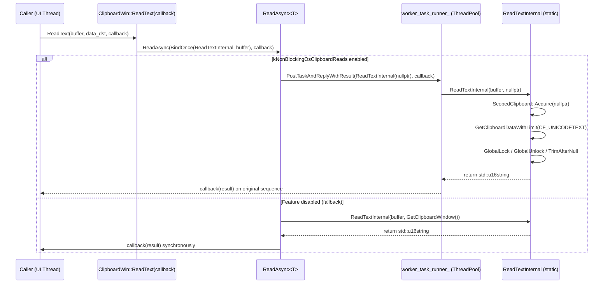
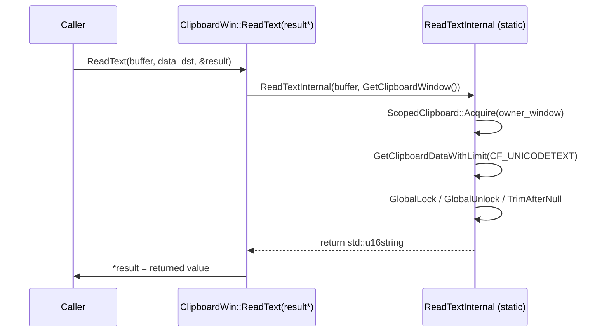
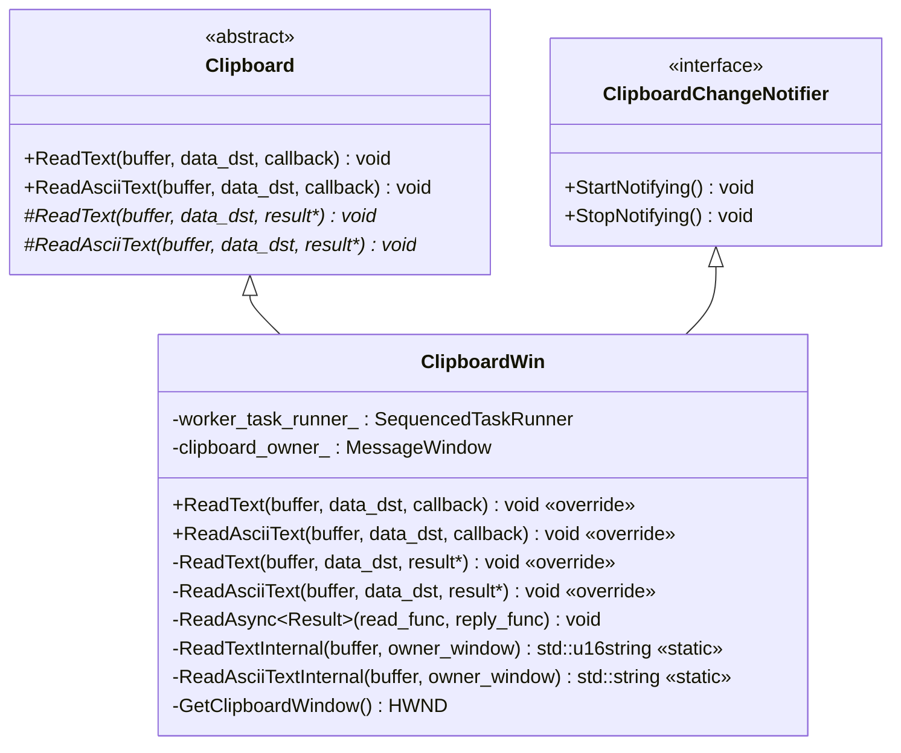
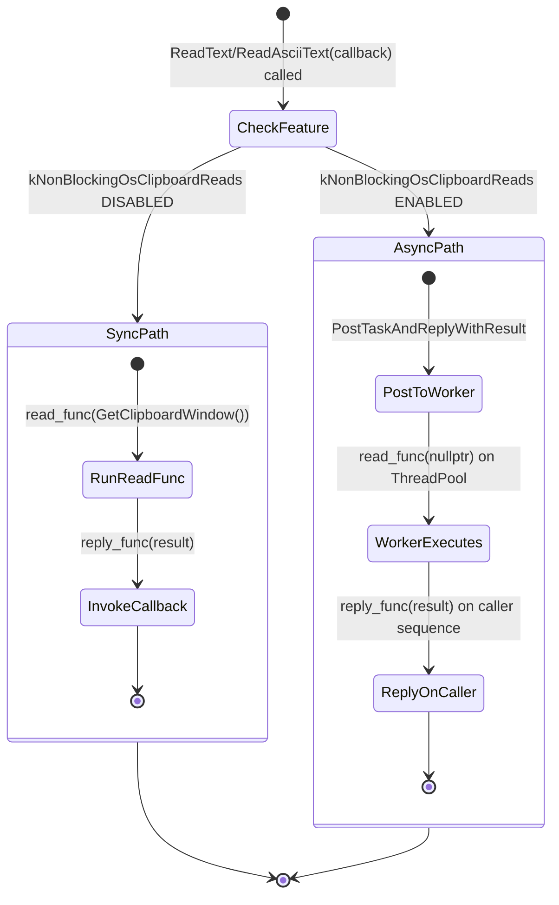

# Low-Level Design: CL 7558493

## [Clipboard][Windows] Use async ReadText/ReadAsciiText with ThreadPool offloading

**Bug:** 458194647  
**Author:** Hewro Hewei (ihewro@chromium.org)  
**Status:** NEW (Patch Set 8)

---

## 1. File-by-File Analysis

---

### 1.1 `ui/base/clipboard/clipboard_win.h`

**Purpose of changes:** Declare async overrides for `ReadText`/`ReadAsciiText` and static internal helper methods.

**Key modifications:**
- Added two new `override` declarations for the callback-based (async) `ReadText` and `ReadAsciiText` methods
- Added two new `static` internal methods: `ReadTextInternal` and `ReadAsciiTextInternal`

**New/Modified Functions:**

| Function | Purpose | Parameters | Returns |
|----------|---------|------------|---------|
| `ReadText(…, ReadTextCallback)` | Async override that offloads clipboard read to ThreadPool | `ClipboardBuffer buffer`, `optional<DataTransferEndpoint>& data_dst`, `ReadTextCallback callback` | `void` |
| `ReadAsciiText(…, ReadAsciiTextCallback)` | Async override that offloads clipboard read to ThreadPool | `ClipboardBuffer buffer`, `optional<DataTransferEndpoint>& data_dst`, `ReadAsciiTextCallback callback` | `void` |
| `ReadTextInternal` (static) | Performs the actual Win32 clipboard read for Unicode text | `ClipboardBuffer buffer`, `HWND owner_window` | `std::u16string` |
| `ReadAsciiTextInternal` (static) | Performs the actual Win32 clipboard read for ASCII text | `ClipboardBuffer buffer`, `HWND owner_window` | `std::string` |

**Design notes:**
- The `ReadTextInternal` and `ReadAsciiTextInternal` methods are `static` so they can be safely posted to the ThreadPool without requiring an instance pointer (no `this` capture needed on the worker thread).
- This follows the same pattern already established by `ReadHTMLInternal`, `ReadFilenamesInternal`, etc.

---

### 1.2 `ui/base/clipboard/clipboard_win.cc`

**Purpose of changes:** Implement async ReadText/ReadAsciiText by refactoring the blocking clipboard read logic into static internal methods, then routing through the existing `ReadAsync` template.

**Key modifications:**
- Added new async `ReadText(…, ReadTextCallback)` override that delegates to `ReadAsync` with `ReadTextInternal`
- Added new async `ReadAsciiText(…, ReadAsciiTextCallback)` override that delegates to `ReadAsync` with `ReadAsciiTextInternal`
- Refactored synchronous `ReadText(…, std::u16string*)` to delegate to `ReadTextInternal`
- Refactored synchronous `ReadAsciiText(…, std::string*)` to delegate to `ReadAsciiTextInternal`
- Extracted core clipboard read logic into `ReadTextInternal` (static) and `ReadAsciiTextInternal` (static)

**New/Modified Functions:**

| Function | Purpose | Parameters | Returns |
|----------|---------|------------|---------|
| `ReadText(…, ReadTextCallback)` | Async entry point; calls `ReadAsync` with bound `ReadTextInternal` | `buffer`, `data_dst`, `callback` | `void` |
| `ReadAsciiText(…, ReadAsciiTextCallback)` | Async entry point; calls `ReadAsync` with bound `ReadAsciiTextInternal` | `buffer`, `data_dst`, `callback` | `void` |
| `ReadTextInternal` (static) | Core Win32 clipboard read for `CF_UNICODETEXT` | `buffer`, `owner_window` | `std::u16string` |
| `ReadAsciiTextInternal` (static) | Core Win32 clipboard read for `CF_TEXT` | `buffer`, `owner_window` | `std::string` |
| `ReadText(…, std::u16string*)` (modified) | Sync entry point; now delegates to `ReadTextInternal` | `buffer`, `data_dst`, `result*` | `void` |
| `ReadAsciiText(…, std::string*)` (modified) | Sync entry point; now delegates to `ReadAsciiTextInternal` | `buffer`, `data_dst`, `result*` | `void` |

**Data Flow – Async Path:**



**Data Flow – Sync Path (unchanged semantics):**



**ReadAsync Template (pre-existing, reused):**

```cpp
template <typename Result>
void ClipboardWin::ReadAsync(
    base::OnceCallback<Result(HWND)> read_func,
    base::OnceCallback<void(Result)> reply_func) const {
  if (!kNonBlockingOsClipboardReads enabled) {
    // Sync fallback: run on current thread with real clipboard window
    Result result = read_func.Run(GetClipboardWindow());
    reply_func.Run(std::move(result));
    return;
  }
  // Async: post to ThreadPool, reply on caller sequence
  worker_task_runner_->PostTaskAndReplyWithResult(
      FROM_HERE,
      BindOnce(std::move(read_func), /*owner_window=*/nullptr),
      std::move(reply_func));
}
```

**Key design decisions in the internal methods:**
- Return by value (`std::u16string` / `std::string`) instead of out-params, enabling direct use with `PostTaskAndReplyWithResult`
- `HWND owner_window` parameter allows `nullptr` on the worker thread (clipboard access without a specific owner window) vs. `GetClipboardWindow()` on the UI thread
- `RecordRead(ClipboardFormatMetric::kText)` is called inside the internal methods, meaning it runs on the worker thread in the async path

---

### 1.3 `ui/base/clipboard/clipboard_win_unittest.cc`

**Purpose of changes:** Add tests for the new async ReadText/ReadAsciiText overrides, and extend the existing no-notification test.

**Key modifications:**
- Extended `NoDataChangedNotificationOnRead` test to also verify async ReadText/ReadAsciiText don't trigger data change notifications
- Added 4 new test cases for async read operations

**New Test Cases:**

| Test Name | Purpose | Scenario |
|-----------|---------|----------|
| `ReadTextAsyncReturnsWrittenData` | Verifies async `ReadText` returns correct Unicode text | Write `u"text_test"`, read back via async, compare |
| `ReadTextAsyncEmptyClipboard` | Verifies async `ReadText` returns empty string on empty clipboard | Clear clipboard, read via async, expect empty |
| `ReadAsciiTextAsyncReturnsWrittenData` | Verifies async `ReadAsciiText` returns correct ASCII text | Write `u"text_test"`, read back via async as ASCII, compare |
| `ReadAsciiTextAsyncEmptyClipboard` | Verifies async `ReadAsciiText` returns empty string on empty clipboard | Clear clipboard, read via async, expect empty |

**Test Pattern Used:**
All tests use `base::test::TestFuture<T>` to bridge the async callback into a synchronous test assertion:
```cpp
base::test::TestFuture<std::u16string> text_future;
clipboard->ReadText(ClipboardBuffer::kCopyPaste, std::nullopt,
                    text_future.GetCallback());
ASSERT_TRUE(text_future.Wait());
EXPECT_EQ(text_future.Get(), u"text_test");
```

---

## 2. Class Diagram



---

## 3. State Diagram — ReadAsync Dispatch



---

## 4. Implementation Concerns

### 4.1 Thread Safety

- **`RecordRead` on worker thread:** `RecordRead(ClipboardFormatMetric::kText)` is called inside `ReadTextInternal` / `ReadAsciiTextInternal`. In the async path, this executes on the `worker_task_runner_` (ThreadPool). If `RecordRead` touches any shared state or UMA histogram infrastructure that assumes UI-thread-only access, this could be problematic. However, `RecordRead` typically calls into thread-safe UMA macros, so this is likely fine — but worth verifying.
  
- **`GetClipboardDataWithLimit` is a static/global function** that calls Win32 `::GetClipboardData`. Since the clipboard is acquired via `ScopedClipboard::Acquire` within the same scope, concurrent access from multiple threads is serialized by the Windows clipboard lock. The `worker_task_runner_` is a **sequenced** task runner, so concurrent calls from the worker side won't race with each other.

- **`DCHECK_EQ(buffer, ClipboardBuffer::kCopyPaste)` in static methods:** These DCHECKs will fire on the worker thread in debug builds. This is fine but worth noting — crashes on worker threads can be harder to diagnose.

### 4.2 Memory Management

- Return-by-value pattern (`std::u16string`, `std::string`) is clean — no raw pointer ownership issues. Move semantics ensure efficient transfer through the callback chain.
- `ScopedClipboard` RAII pattern ensures clipboard is released even on early returns.
- `GlobalLock`/`GlobalUnlock` are properly paired within the same scope.

### 4.3 Performance

- The primary goal of this CL is a performance improvement: avoiding blocking the UI thread on Win32 clipboard access. This is achieved by posting the work to a `MayBlock` ThreadPool runner.
- The sync fallback (feature disabled) has **no performance regression** — it calls `ReadTextInternal` directly with `GetClipboardWindow()`, identical to the old behavior.
- Minor overhead from `base::BindOnce` allocation and task posting in the async path, but this is negligible compared to the Win32 clipboard I/O being offloaded.

### 4.4 Correctness

- **`owner_window = nullptr` in async path:** When `kNonBlockingOsClipboardReads` is enabled, `ScopedClipboard::Acquire(nullptr)` is called. Passing `nullptr` to `OpenClipboard` is valid Win32 API usage — it means the clipboard is opened without associating it with a specific window. This is the intended behavior for background thread access (no message window available on the worker thread).
  
- **`data_dst` parameter is unused:** The `data_dst` parameter in both async overrides is ignored (only passed for API consistency). This matches the existing behavior for the sync overloads and is documented with the `// |data_dst| is not used` comment.

### 4.5 Maintainability

- The refactoring cleanly separates the "how to dispatch" (sync vs. async via `ReadAsync`) from the "what to read" (`ReadTextInternal`/`ReadAsciiTextInternal`), which is a good separation of concerns.
- The sync `ReadText`/`ReadAsciiText` methods now delegate to the same internal methods, eliminating code duplication.
- The pattern is consistent with the pre-existing `ReadHTML`, `ReadFilenames`, and `ReadPng` async implementations.

---

## 5. Suggestions for Improvement

### 5.1 Test Coverage Gaps

- **No test with `kNonBlockingOsClipboardReads` explicitly enabled/disabled:** The tests don't use `base::test::ScopedFeatureList` to toggle the feature flag. The behavior under both code paths (sync fallback vs. true async ThreadPool posting) should ideally be tested explicitly. Currently, the test outcome depends on the default feature state.
  
- **No test for large clipboard data:** Edge cases like very large text content, or text with embedded null characters (which `TrimAfterNull` handles), are not tested in the new async path.

- **No test for concurrent async reads:** Since the worker is a sequenced task runner, concurrent reads should queue correctly, but this isn't tested.

### 5.2 Minor Code Observations

- **`RecordRead` placement:** Consider whether `RecordRead` should be called in the public method (before dispatch) rather than inside the internal method. This would ensure metrics are always recorded on the calling thread and avoid any theoretical thread-safety questions. The existing `ReadHTML` async implementation has the same pattern, so this is a pre-existing design choice, not a regression.

- **Consistent brace style:** The diff shows some early returns changed from brace-less `if (!x) return;` to braced `if (!x) { return result; }` style. While both are valid in Chromium, consistency within a function is preferred. The new code uses braces for `Acquire` check but not for `GetClipboardDataWithLimit` check — consider making consistent.

### 5.3 Future Work

- The commit message and code comments reference `crbug.com/458194647`. The `ReadHTMLInternal` still uses out-params with a TODO comment to return `ReadHTMLResult` instead. The `ReadTextInternal`/`ReadAsciiTextInternal` methods already return by value — this is the cleaner pattern that `ReadHTMLInternal` should eventually adopt.

---

## 6. Summary

This CL is a well-structured incremental change that:

1. **Extracts** the core clipboard read logic for text and ASCII text into static internal methods
2. **Overrides** the base class async `ReadText`/`ReadAsciiText` methods to use the existing `ReadAsync` template infrastructure
3. **Preserves** backward compatibility — the sync methods still work identically by delegating to the same internal methods
4. **Adds** appropriate unit tests covering basic success and empty-clipboard scenarios

The change follows established patterns in `ClipboardWin` (matching `ReadHTML`, `ReadFilenames`) and is minimal in scope. The primary concern is test coverage for the feature-flag-gated async path.
