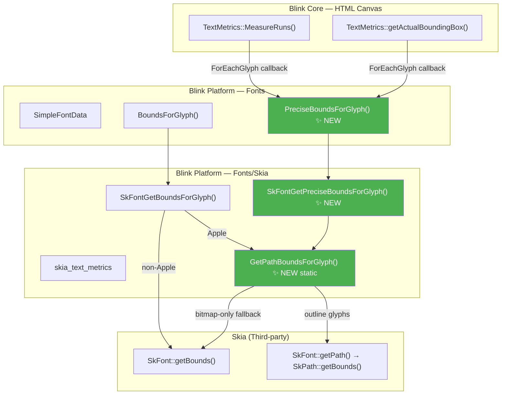
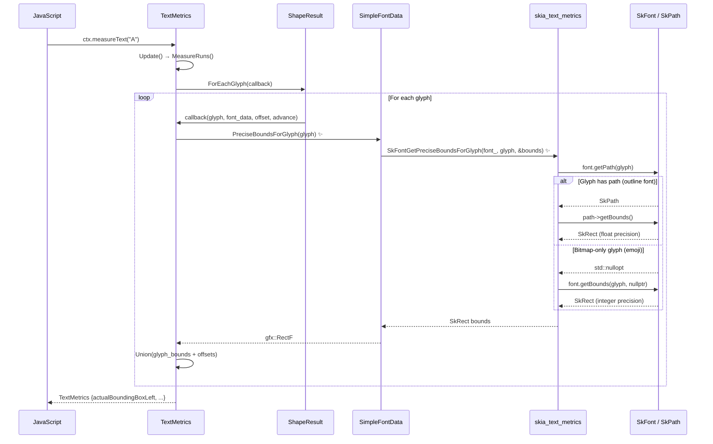

# High-Level Design: [Fonts] Fix canvas measureText() precision at small font sizes

**CL:** [7564913](https://chromium-review.googlesource.com/c/chromium/src/+/7564913)
**Bug:** [crbug.com/479240778](https://crbug.com/479240778)
**Files Changed:** 6 (+127/-13 lines)

---

## 1. Executive Summary

This CL fixes a precision bug in the HTML Canvas `measureText()` API where `actualBoundingBox*` metrics return inaccurate values at small font sizes (e.g., 1.5px). The root cause is that Skia's `SkGlyph` stores glyph bounds as integers (`int16_t`/`uint16_t` internally), which produces large relative errors when font sizes are small. The fix introduces a new `PreciseBoundsForGlyph` method that computes glyph bounds from the float-precision path outlines via `SkFont::getPath()` instead of relying on `SkFont::getBounds()`. This is a targeted, low-risk change that only affects the Canvas `TextMetrics` bounding box computation path, improving spec compliance and visual accuracy when centering text at small sizes.

---

## 2. Architecture Overview

### Affected Components/Modules

| Component | Layer | Role |
|-----------|-------|------|
| `TextMetrics` (Canvas) | Blink Core (HTML Canvas) | Computes text measurement results for `measureText()` |
| `SimpleFontData` | Blink Platform (Fonts) | Font data abstraction; provides glyph metrics |
| `skia_text_metrics` | Blink Platform (Fonts/Skia) | Low-level Skia font metric helpers |
| Skia (`SkFont`) | Third-party Graphics | Underlying font rasterization and metrics engine |

### Component Diagram

### How It Fits Into Existing Architecture

The change adds a parallel bounds-retrieval path alongside the existing `BoundsForGlyph` → `SkFontGetBoundsForGlyph` chain. The existing chain remains untouched for all other callers (layout, painting, HarfBuzz mark positioning). Only the Canvas `TextMetrics` code is wired to use the new precise path.

---

## 3. Design Goals & Non-Goals

### Goals

1. **Fix precision**: Make `measureText().actualBoundingBox{Left,Right,Ascent,Descent}` return float-precision values at all font sizes.
2. **Minimal blast radius**: Only change the Canvas `TextMetrics` bounding box computation; do not affect layout, painting, or HarfBuzz shaping.
3. **Graceful degradation**: Fall back to `SkFont::getBounds()` for bitmap-only glyphs (e.g., color emoji) that have no path outlines.
4. **Spec compliance**: Ensure the Canvas API returns accurate enough metrics to correctly center text, matching the [HTML spec for TextMetrics](https://html.spec.whatwg.org/multipage/canvas.html#dom-textmetrics-actualboundingboxleft).

### Non-Goals

- **Fixing `SkGlyph` integer storage in Skia**: The upstream Skia representation is not changed; this is a Blink-side workaround.
- **Changing batch glyph bounds (`BoundsForGlyphs`)**: Only per-glyph precise bounds are added; batch operations remain integer-based.
- **Changing HarfBuzz extents**: `SkFontGetGlyphExtentsForHarfBuzz` already uses path-based bounds on Apple; this CL does not change it.
- **Caching precise bounds**: No caching layer is added for `PreciseBoundsForGlyph`. The path extraction is done per-call.
- **Changing text rendering/painting**: Only measurement is affected.

---

## 4. System Interactions

### Main Flow: `ctx.measureText(text)` → actualBoundingBox

### IPC/Mojo Interactions

**None.** All affected code runs within the renderer process on the main thread. There are no cross-process or cross-thread interactions introduced by this CL.

### Before vs. After

| Aspect | Before | After |
|--------|--------|-------|
| Bounds source in `MeasureRuns()` | `item.InkBounds()` (batch `SkFont::getBounds`, integer-quantized) | Per-glyph `PreciseBoundsForGlyph()` via `SkFont::getPath()` (float-precision) |
| Bounds source in `getActualBoundingBox()` | `BoundsForGlyph()` (integer-quantized on non-Apple) | `PreciseBoundsForGlyph()` (float-precision on all platforms) |
| Example: 1.5px font, glyph "A" | Bounds might be `{0, -1, 1, 0}` (integers) | Bounds might be `{0.05, -1.07, 1.11, 0.0}` (floats) |

---

## 5. API & Interface Changes

### New Public Interfaces

| Interface | Location | Signature |
|-----------|----------|-----------|
| `SimpleFontData::PreciseBoundsForGlyph` | [`simple_font_data.h#L150`](/workspace/chromium/src/third_party/blink/renderer/platform/fonts/simple_font_data.h#L150) | `gfx::RectF PreciseBoundsForGlyph(Glyph) const` |
| `SkFontGetPreciseBoundsForGlyph` | [`skia_text_metrics.h#L37`](/workspace/chromium/src/third_party/blink/renderer/platform/fonts/skia/skia_text_metrics.h#L37) | `void SkFontGetPreciseBoundsForGlyph(const SkFont&, Glyph, SkRect* bounds)` |

### New Internal (static) Functions

| Function | Location | Purpose |
|----------|----------|---------|
| `GetPathBoundsForGlyph` | [`skia_text_metrics.cc#L132`](/workspace/chromium/src/third_party/blink/renderer/platform/fonts/skia/skia_text_metrics.cc#L132) | Shared helper: gets path-based bounds with bitmap fallback |

### Modified Interfaces

| Interface | Change |
|-----------|--------|
| `TextMetrics::MeasureRuns()` | Now iterates glyphs individually via `ForEachGlyph` + `PreciseBoundsForGlyph` instead of using pre-computed `item.InkBounds()` |
| `TextMetrics::getActualBoundingBox()` | Uses `PreciseBoundsForGlyph` instead of `BoundsForGlyph` in the `ForEachGlyph` callback |

### Deprecated Interfaces

**None.** The existing `BoundsForGlyph` / `SkFontGetBoundsForGlyph` remain fully functional and are still used by all other callers.

---

## 6. Dependencies

### What This Code Depends On

| Dependency | Type | Notes |
|------------|------|-------|
| `SkFont::getPath(Glyph)` | Skia API | Returns `std::optional<SkPath>` — `std::nullopt` for bitmap-only glyphs |
| `SkPath::getBounds()` | Skia API | Returns tight float-precision bounds of the path |
| `SkFont::getBounds(Glyph, SkPaint*)` | Skia API | Existing fallback; returns integer-quantized bounds from `SkGlyph` |
| `ShapeResult::ForEachGlyph()` | Blink Shaping | Iteration API over shaped glyph results |

### What Depends On This Code

| Consumer | Impact |
|----------|--------|
| `TextMetrics` (Canvas 2D) | **Direct caller** — uses the new precise bounds |
| Other `BoundsForGlyph` callers (layout, paint) | **No impact** — they continue using the existing integer-based path |

### Version/Compatibility

- The `SkFont::getPath()` API has been stable in Skia since it was migrated from `SkTypeface`. No compatibility concerns.
- The refactored `GetPathBoundsForGlyph` consolidates logic that was previously duplicated (Apple-specific path in `SkFontGetBoundsForGlyph` and `SkFontGetGlyphExtentsForHarfBuzz`), reducing maintenance burden.

---

## 7. Risks & Mitigations

### Risk Assessment

| Risk | Severity | Likelihood | Mitigation |
|------|----------|------------|------------|
| **Performance regression** from per-glyph `getPath()` calls instead of batch `getBounds()` | Medium | Low | `getPath()` is already used on Apple for the same purpose in `SkFontGetBoundsForGlyph`. Canvas `measureText()` is typically called on short strings. The overhead is bounded by glyph count. |
| **Bitmap-only glyphs return lower-precision bounds** | Low | Medium | Explicit fallback to `font.getBounds()` in `GetPathBoundsForGlyph`. This is the same precision as before — no regression for emoji/bitmap fonts. |
| **Subpixel rounding mismatch** | Low | Low | `GetPathBoundsForGlyph` applies `roundOut()` for non-subpixel fonts, matching existing behavior in `SkFontGetBoundsForGlyph`. |
| **Web compatibility** — sites depending on integer-quantized bounds | Low | Very Low | The old values were *less* accurate. More precise values should only improve centering/alignment. The WPT test confirms correct behavior. |
| **Other callers accidentally using `PreciseBoundsForGlyph`** | Low | Low | The function is public but clearly named; `BoundsForGlyph` remains the default. Code review norms will guide correct usage. |

### Backward Compatibility

- **Web-facing behavior change**: `measureText()` will return slightly different `actualBoundingBox*` values (more precise). This is a correctness fix and should not break well-written web content.
- **No feature flag / runtime guard**: The change is unconditional. If issues arise, it would need to be reverted.

---

## 8. Testing Strategy

### Test Coverage

| Test | Type | Location | What It Verifies |
|------|------|----------|------------------|
| `2d.text.measure.actualBoundingBox.small-font.html` | WPT (Web Platform Test) | [`/workspace/chromium/src/third_party/blink/web_tests/external/wpt/html/canvas/element/text/2d.text.measure.actualBoundingBox.small-font.html`](/workspace/chromium/src/third_party/blink/web_tests/external/wpt/html/canvas/element/text/2d.text.measure.actualBoundingBox.small-font.html) | Uses 1.5px `CanvasTest` font, measures "A", centers it using `actualBoundingBox` metrics, scales up 32×, asserts center pixel is yellow (text) not red (background). Fails with integer-quantized bounds because centering offset is wrong. |

### Test Design

The WPT test is clever: rather than asserting exact float values (which would be fragile across platforms/fonts), it tests the *consequence* of precision — whether text can be correctly centered using the returned metrics. This makes the test robust against minor platform differences while still catching the core bug.

### Coverage Gaps & Recommendations

1. **No unit test for `SkFontGetPreciseBoundsForGlyph` directly** — consider adding a C++ unit test that compares precise bounds vs. integer bounds at small font sizes to verify float precision.
2. **No test for bitmap-only fallback path** — the emoji/bitmap glyph codepath (where `getPath()` returns `nullopt`) is not explicitly tested.
3. **No test for `getActualBoundingBox()` method** — the `TextMetrics::getActualBoundingBox()` method at line 367 also calls `PreciseBoundsForGlyph` but is not directly exercised by the new WPT test (which tests via the `actualBoundingBoxLeft/Right/Ascent/Descent` properties from `Update()`).
4. **Performance benchmark** — no perf test is added. For long strings, the per-glyph `getPath()` approach could be measurably slower than the batch `getBounds()`. A targeted benchmark on `measureText()` with large text would validate this is not a concern.

---

## Appendix: Code Cross-Reference

### Key Code Paths (with line references)

- **Entry point** — `TextMetrics::MeasureRuns()`: [`text_metrics.cc#L170-L210`](/workspace/chromium/src/third_party/blink/renderer/core/html/canvas/text_metrics.cc#L170)
- **Per-glyph precise bounds callback**: [`text_metrics.cc#L195-L206`](/workspace/chromium/src/third_party/blink/renderer/core/html/canvas/text_metrics.cc#L195)
- **`SimpleFontData::PreciseBoundsForGlyph`**: [`simple_font_data.cc#L511-L521`](/workspace/chromium/src/third_party/blink/renderer/platform/fonts/simple_font_data.cc#L511)
- **`SkFontGetPreciseBoundsForGlyph`**: [`skia_text_metrics.cc#L164-L172`](/workspace/chromium/src/third_party/blink/renderer/platform/fonts/skia/skia_text_metrics.cc#L164)
- **`GetPathBoundsForGlyph` (shared helper)**: [`skia_text_metrics.cc#L132-L146`](/workspace/chromium/src/third_party/blink/renderer/platform/fonts/skia/skia_text_metrics.cc#L132)
- **Existing `BoundsForGlyph` (unchanged)**: [`skia_text_metrics.cc#L148-L162`](/workspace/chromium/src/third_party/blink/renderer/platform/fonts/skia/skia_text_metrics.cc#L148)
- **WPT test**: [`2d.text.measure.actualBoundingBox.small-font.html`](/workspace/chromium/src/third_party/blink/web_tests/external/wpt/html/canvas/element/text/2d.text.measure.actualBoundingBox.small-font.html)
