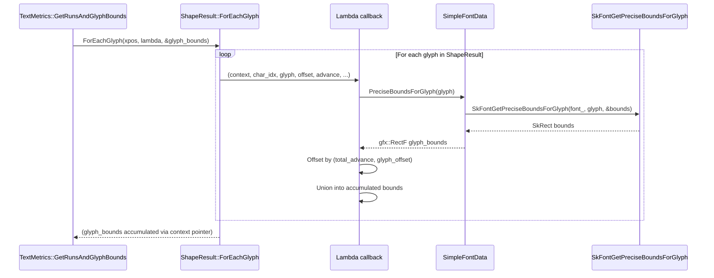
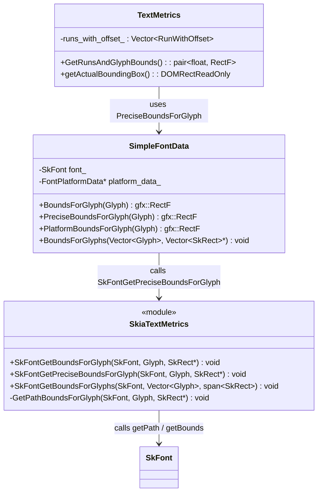
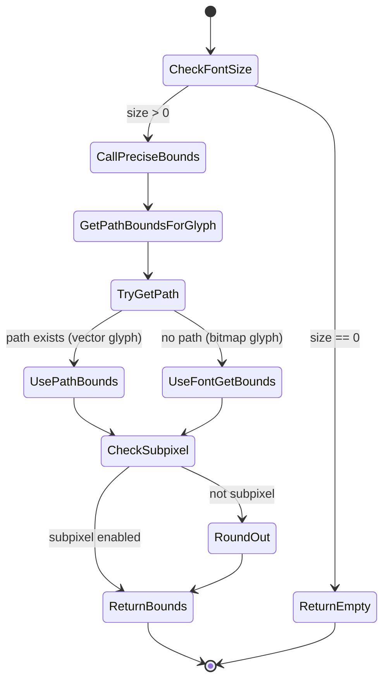

# Low-Level Design: CL 7564913 — [Fonts] Fix canvas measureText() precision at small font sizes

**CL URL:** https://chromium-review.googlesource.com/c/chromium/src/+/7564913  
**Author:** Sejal Anand <sejalanand@microsoft.com>  
**Bug:** [crbug.com/479240778](https://crbug.com/479240778)

---

## Problem Statement

Canvas `measureText()` returns inaccurate `actualBoundingBox` values at small font sizes (e.g., 1.5px). This occurs because Skia's `SkGlyph` stores glyph bounds as integers (`int16_t`/`uint16_t`), causing large *relative* errors when the glyph is small. For example, a glyph with true bounds of 1.3px might be reported as 1px or 2px — a ≥50% error.

## Solution Overview

Introduce a new `PreciseBoundsForGlyph()` path that uses `SkFont::getPath()` to obtain float-precision bounds directly from glyph outlines, bypassing the integer-quantized `SkGlyph` bounds. Use this new path in the two `TextMetrics` call sites that compute `actualBoundingBox` metrics for the canvas API.

---

## 1. File-by-File Analysis

### 1.1 `third_party/blink/renderer/platform/fonts/skia/skia_text_metrics.cc`

**Purpose of changes**: Introduce a shared helper `GetPathBoundsForGlyph()` and a new public function `SkFontGetPreciseBoundsForGlyph()` that provides float-precision glyph bounds via path extraction.

**Key modifications**:
- Extracted the existing Apple-only `getPath()` logic into a new `static` helper `GetPathBoundsForGlyph()`.
- Refactored `SkFontGetBoundsForGlyph()` to call `GetPathBoundsForGlyph()` on Apple and retain `getBounds()` on other platforms (preserving existing behavior).
- Added `SkFontGetPreciseBoundsForGlyph()` — a new public function that unconditionally calls `GetPathBoundsForGlyph()` on all platforms.

**New/Modified Functions**:

| Function | Purpose | Parameters | Returns |
|----------|---------|------------|---------|
| `GetPathBoundsForGlyph` (static) | Get float-precision bounds via `SkFont::getPath()`, falling back to `SkFont::getBounds()` for bitmap-only glyphs | `const SkFont& font`, `Glyph glyph`, `SkRect* bounds` | `void` (writes to `bounds`) |
| `SkFontGetBoundsForGlyph` (refactored) | Existing function, now delegates to `GetPathBoundsForGlyph` on Apple | same as before | `void` |
| `SkFontGetPreciseBoundsForGlyph` (new) | Float-precision glyph bounds on all platforms | `const SkFont& font`, `Glyph glyph`, `SkRect* bounds` | `void` (writes to `bounds`) |

**Logic Flow — `GetPathBoundsForGlyph`**:
```
1. Call SkFont::getPath(glyph)
2. If path exists (vector glyph):
     → Use path->getBounds() for float-precision rect
3. Else (bitmap-only glyph, e.g. Color Emoji):
     → Fall back to SkFont::getBounds(glyph) (integer-quantized)
4. If font is NOT subpixel:
     → Round out to integer rect (preserves existing rounding behavior)
```

**Data Flow**:
```mermaid
sequenceDiagram
    participant Caller as TextMetrics / SimpleFontData
    participant Precise as SkFontGetPreciseBoundsForGlyph
    participant Helper as GetPathBoundsForGlyph (static)
    participant SkFont as SkFont (Skia)

    Caller->>Precise: SkFontGetPreciseBoundsForGlyph(font, glyph, &bounds)
    Precise->>Helper: GetPathBoundsForGlyph(font, glyph, &bounds)
    Helper->>SkFont: font.getPath(glyph)
    alt Path exists (vector glyph)
        SkFont-->>Helper: std::optional<SkPath>
        Helper->>Helper: bounds = path->getBounds()
    else No path (bitmap glyph)
        Helper->>SkFont: font.getBounds(glyph, nullptr)
        SkFont-->>Helper: SkRect bounds
    end
    alt Not subpixel
        Helper->>Helper: bounds.roundOut(&ir); bounds.set(ir)
    end
    Helper-->>Precise: bounds filled
    Precise-->>Caller: bounds filled
```

**Key design decisions**:
- `GetPathBoundsForGlyph` retains the `roundOut` for non-subpixel fonts. This means `SkFontGetPreciseBoundsForGlyph` still rounds to integers for non-subpixel fonts. This is the same behavior as the Apple branch of `SkFontGetBoundsForGlyph` — it preserves consistency but may limit the precision improvement for non-subpixel configurations.
- The function is a trivial wrapper around the static helper. This keeps `SkFontGetBoundsForGlyph` backward-compatible (Apple uses path, other platforms use `getBounds()`).

---

### 1.2 `third_party/blink/renderer/platform/fonts/skia/skia_text_metrics.h`

**Purpose of changes**: Declare the new public function.

**Key modifications**:
- Added declaration: `void SkFontGetPreciseBoundsForGlyph(const SkFont&, Glyph, SkRect* bounds);`

**API Changes**:

| Before | After |
|--------|-------|
| `SkFontGetBoundsForGlyph` only | `SkFontGetBoundsForGlyph` + `SkFontGetPreciseBoundsForGlyph` |

---

### 1.3 `third_party/blink/renderer/platform/fonts/simple_font_data.cc`

**Purpose of changes**: Add `SimpleFontData::PreciseBoundsForGlyph()` as a higher-level wrapper around the Skia-level precise bounds function.

**Key modifications**:
- Added `PreciseBoundsForGlyph(Glyph glyph) const` — mirrors `PlatformBoundsForGlyph()` but calls `SkFontGetPreciseBoundsForGlyph` instead of `SkFontGetBoundsForGlyph`.

**New/Modified Functions**:

| Function | Purpose | Parameters | Returns |
|----------|---------|------------|---------|
| `PreciseBoundsForGlyph` (new) | Returns float-precision glyph bounds as `gfx::RectF` | `Glyph glyph` | `gfx::RectF` |

**Logic Flow**:
```
1. Guard: if font size is 0, return empty RectF
2. static_assert: glyph is 2 bytes (not truncated)
3. Call SkFontGetPreciseBoundsForGlyph(font_, glyph, &bounds)
4. Convert SkRect → gfx::RectF and return
```

**Comparison with existing `PlatformBoundsForGlyph`**:
The new function is structurally identical to `PlatformBoundsForGlyph()` (same guard, same static_assert, same return conversion) — the only difference is which Skia function is called. This is intentional: it provides a separate path for canvas metrics without disturbing existing layout/paint code.

---

### 1.4 `third_party/blink/renderer/platform/fonts/simple_font_data.h`

**Purpose of changes**: Declare the new public method on `SimpleFontData`.

**Key modifications**:
- Added `gfx::RectF PreciseBoundsForGlyph(Glyph) const;` immediately after `BoundsForGlyph`.

---

### 1.5 `third_party/blink/renderer/core/html/canvas/text_metrics.cc`

**Purpose of changes**: Switch the two canvas-specific bounding box computations from integer-quantized bounds to precise bounds.

**Key modifications**:

#### Change 1: `GetRunsAndGlyphBounds()` (line ~191)
- **Before**: Used `item.InkBounds()` — a precomputed `gfx::RectF` from the `ShapeResultItem`, which internally uses `SkFont::getBounds()` (integer-quantized).
- **After**: Iterates per-glyph via `shape_result->ForEachGlyph()` and accumulates the union of `font_data->PreciseBoundsForGlyph(glyph)` for each glyph, offsetting by `total_advance` and `glyph_offset`.

This is a semantic change from **per-run** bounds to **per-glyph** bounds with precise values.

#### Change 2: `getActualBoundingBox()` (line ~373)
- **Before**: `font_data->BoundsForGlyph(glyph)` — uses `SkFontGetBoundsForGlyph` (integer on non-Apple).
- **After**: `font_data->PreciseBoundsForGlyph(glyph)` — uses path-based bounds.

**New/Modified Functions**:

| Function | Change | Purpose |
|----------|--------|---------|
| `GetRunsAndGlyphBounds()` | Major refactor of bounds accumulation | Now iterates per-glyph for precise bounds |
| `getActualBoundingBox()` | Single-line change | Calls `PreciseBoundsForGlyph` instead of `BoundsForGlyph` |

**Data Flow — `GetRunsAndGlyphBounds()` (modified path)**:


---

### 1.6 `third_party/blink/web_tests/external/wpt/html/canvas/element/text/2d.text.measure.actualBoundingBox.small-font.html`

**Purpose of changes**: Add a Web Platform Test that validates precise bounding box metrics at small font sizes.

**Test Strategy**:
1. Create a 64×64 canvas, fill with red background.
2. Translate to center and scale 32× to make small text visible.
3. Set font to `1.5px CanvasTest` (a known test font).
4. Call `measureText('A')` and compute centering offsets using `actualBoundingBoxLeft/Right/Ascent/Descent`.
5. Draw the text at the computed centered position.
6. Sample the center pixel — it should be yellow (text), not red (background).
7. Assert that the green channel > 128 (yellow has high green, red has green=0).

**Key design aspects**:
- Uses the `CanvasTest` font face (`/fonts/CanvasTest.ttf`) — a stable, well-known test font.
- Uses `promise_test` with `document.fonts.ready` to ensure the font is loaded.
- The test is a regression test that specifically catches integer-quantized bounds: if bounds are rounded, the centering calculation will be wrong, and the text will miss the center pixel.
- Uses a hidden span to trigger font loading: `<span style="font-family: CanvasTest; position: absolute; visibility: hidden">A</span>`.

---

## 2. Class Diagram



---

## 3. State Diagram — Glyph Bounds Resolution



---

## 4. Implementation Concerns

### 4.1 Performance

**Primary concern**: The change replaces per-run `item.InkBounds()` (one precomputed rect) with per-glyph `ForEachGlyph() + PreciseBoundsForGlyph()` in `GetRunsAndGlyphBounds()`. Each glyph now involves:
- `SkFont::getPath()` — extracts the glyph outline path from the font scaler
- `SkPath::getBounds()` — computes the bounding rect of the path

This is **O(n)** in the number of glyphs (vs. O(1) for precomputed run bounds) and `getPath()` can be expensive (involves glyph loading, outline extraction). For text-heavy canvas workloads (e.g., data visualization with thousands of labels), this could be a measurable regression.

**Mitigation considerations**:
- No caching is implemented. A per-glyph cache (keyed by glyph ID, similar to the existing `glyph_to_bounds_map_` pattern) would amortize the cost for repeated glyphs.
- The reviewer (Dileep Maurya) flagged this same concern in the inline comments.

### 4.2 Subpixel Rounding in GetPathBoundsForGlyph

The shared helper `GetPathBoundsForGlyph` includes `roundOut` for non-subpixel fonts. This means even the "precise" path rounds to integers when subpixel rendering is disabled. This may limit the effectiveness of the fix in non-subpixel configurations, though most modern browsers enable subpixel positioning for canvas text rendering.

### 4.3 Bitmap-Only Glyph Fallback

When `SkFont::getPath()` returns no path (bitmap-only glyphs like Apple Color Emoji), the code falls back to `SkFont::getBounds()`, which returns integer-quantized bounds. This is unavoidable (no path data exists) but means emoji and other bitmap glyphs still have imprecise bounds at small sizes. This is an acceptable limitation since bitmap glyphs are typically used at larger sizes.

### 4.4 Thread Safety

No new thread safety concerns. `SimpleFontData` and `SkFont` usage patterns are unchanged — they are used within the rendering pipeline's existing threading model. `GetPathBoundsForGlyph` is a stateless static function.

### 4.5 Memory Management

No new allocations that persist. `SkPath` is returned by value (as `std::optional<SkPath>`) and destroyed after `getBounds()` is called. No memory leaks introduced.

### 4.6 Consistency Between Call Sites

Both call sites in `text_metrics.cc` (lines ~195 and ~373) now use `PreciseBoundsForGlyph`, ensuring consistent behavior between `GetRunsAndGlyphBounds()` and `getActualBoundingBox()`. This is correct.

---

## 5. Edge Cases

| Edge Case | Handling | Status |
|-----------|----------|--------|
| Zero font size | `PreciseBoundsForGlyph` returns empty `RectF` | ✅ Handled |
| Bitmap-only glyph (no path) | Falls back to `SkFont::getBounds()` | ✅ Handled (but imprecise) |
| Non-subpixel font | Bounds rounded out to integers | ⚠️ Handled but limits precision |
| Empty/missing glyph | `getPath()` returns empty optional, falls back to `getBounds()` | ✅ Handled |
| Very large font sizes | Path bounds are always precise; no regression | ✅ OK |
| RTL / vertical text | `ForEachGlyph` handles direction; offsets applied correctly | ✅ OK |
| Multi-run text (ligatures, font fallback) | Each run iterated, each glyph gets precise bounds | ✅ OK |
| Canvas with no text | No glyphs iterated, `glyph_bounds` remains default | ✅ OK |

---

## 6. Suggestions for Improvement

### 6.1 Add Caching for Precise Bounds (Performance)

As noted in review comments, `PreciseBoundsForGlyph()` is called per-glyph with no caching. Consider adding a cache similar to the existing glyph metrics caching pattern:

```cpp
// In SimpleFontData:
mutable HashMap<Glyph, gfx::RectF> precise_bounds_cache_;

gfx::RectF SimpleFontData::PreciseBoundsForGlyph(Glyph glyph) const {
  auto it = precise_bounds_cache_.find(glyph);
  if (it != precise_bounds_cache_.end())
    return it->value;
  // ... compute and cache ...
}
```

This would make repeated calls for the same glyph O(1) after first computation, which matters for text with repeated characters.

### 6.2 Deduplicate `SkFontGetBoundsForGlyph` Apple Branch

As noted in review (Divyansh Mangal), `SkFontGetBoundsForGlyph` on Apple now calls `GetPathBoundsForGlyph`, and `SkFontGetPreciseBoundsForGlyph` also calls `GetPathBoundsForGlyph`. The refactoring is good, but `SkFontGetBoundsForGlyph` on non-Apple still duplicates the `roundOut` logic that's already in `GetPathBoundsForGlyph`. The non-Apple branch of `SkFontGetBoundsForGlyph` could potentially delegate more to the helper to reduce code duplication:

```cpp
void SkFontGetBoundsForGlyph(const SkFont& font, Glyph glyph, SkRect* bounds) {
#if BUILDFLAG(IS_APPLE)
  GetPathBoundsForGlyph(font, glyph, bounds);
#else
  *bounds = font.getBounds(glyph, nullptr);
  if (!font.isSubpixel()) {
    SkIRect ir;
    bounds->roundOut(&ir);
    bounds->set(ir);
  }
#endif
}
```

The non-Apple path intentionally does NOT use `getPath()` (for performance in general layout), so this duplication is acceptable but worth documenting.

### 6.3 Consider Scope-Limiting the Precise Bounds Usage

`PreciseBoundsForGlyph` is currently only used from canvas `TextMetrics`. If this is intended to be canvas-only, consider documenting this intent or adding a comment to prevent accidental adoption by general text layout code (which would cause a performance regression).

### 6.4 WPT Test Improvements

- **Color choice**: The test uses yellow on red. While functional, the WPT convention is green for pass / red for fail. Consider using green text on red background, so a visual inspection of the reference image is more intuitive. (Author addressed this in review, preferring to match the bug repro case.)
- **Tolerance**: The threshold `pixel[1] > 128` is reasonable but could be documented with the expected value (yellow → green channel ≈ 255) to make the margin explicit.

### 6.5 Reviewer Comment: Why Not Update `BoundsForGlyph` Directly?

Gaurav Kumar asked why a new method was created instead of updating `BoundsForGlyph`. The answer: `BoundsForGlyph` is used throughout the layout pipeline (not just canvas), and switching it to path-based bounds would be a much larger change with broader performance and correctness implications. The separate method correctly limits the blast radius to canvas `measureText()` only.

---

## 7. Summary

| Aspect | Assessment |
|--------|------------|
| **Correctness** | ✅ The fix correctly addresses integer-quantized bounds at small font sizes |
| **Scope** | ✅ Changes are minimal and limited to canvas TextMetrics path |
| **Backward Compatibility** | ✅ `SkFontGetBoundsForGlyph` behavior is preserved; new function is additive |
| **Test Coverage** | ✅ WPT test directly validates the fix scenario |
| **Performance** | ⚠️ Per-glyph `getPath()` without caching may regress heavy canvas text workloads |
| **Code Quality** | ✅ Clean refactoring with shared helper; good comments |
| **Edge Cases** | ✅ Bitmap fallback, zero-size, non-subpixel all handled |
