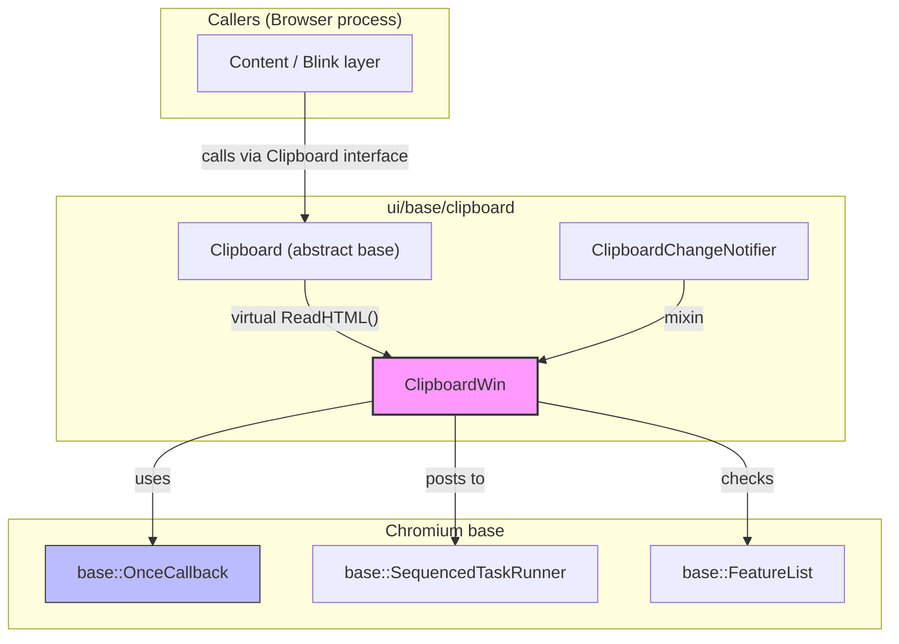
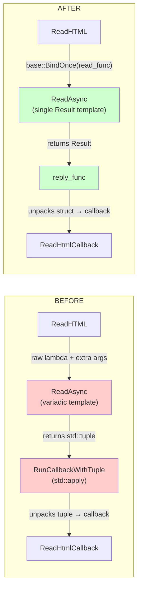
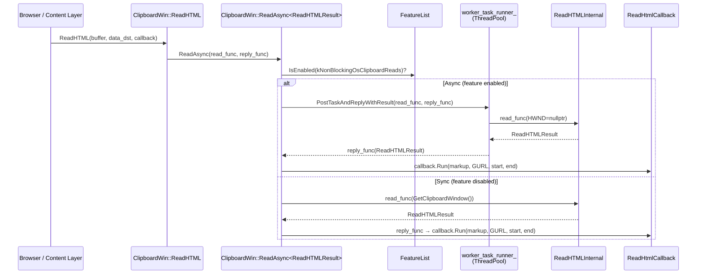

# High-Level Design: CL 7565599 — [Clipboard][Windows] Simplify ReadAsync Template

**CL URL:** https://chromium-review.googlesource.com/c/chromium/src/+/7565599
**Author:** Hewro Hewei (ihewro@chromium.org)
**Reviewer:** Dana Fried (dfried@chromium.org) — CR+1
**Status:** NEW (approved, pending additional +1 from Rohan and David)

---

## 1. Executive Summary

This CL simplifies the `ClipboardWin::ReadAsync` template method by replacing its highly generic, tuple-based return mechanism with a straightforward pattern where `read_func` returns a single typed result object (using a struct for multi-field results like `ReadHTMLResult`). The previous design relied on `std::tuple`, `std::apply`, `std::invoke_result_t`, and variadic template parameter packs (`Args&&...`), which made the template hard to read, hard to maintain, and prone to compile-time complexity. The new design uses `base::OnceCallback<Result(HWND)>` and `base::OnceCallback<void(Result)>`, which are idiomatic Chromium callback types, making the code more readable and better aligned with Chromium conventions. The net effect is a **1-line reduction** (+44/−45) that significantly improves code clarity with zero behavioral change.

---

## 2. Architecture Overview

### Affected Components

This CL is scoped entirely to the **Windows clipboard implementation** within `ui/base/clipboard/`:

| File | Role |
|------|------|
| `ui/base/clipboard/clipboard_win.h` | Header: `ClipboardWin` class declaration, new `ReadHTMLResult` struct |
| `ui/base/clipboard/clipboard_win.cc` | Implementation: `ReadAsync` template, `ReadHTML` caller, removed `RunCallbackWithTuple` helper |

### How It Fits into Existing Architecture

`ClipboardWin` is the Windows platform implementation of the abstract `ui::Clipboard` interface. It inherits from both `Clipboard` and `ClipboardChangeNotifier`. The `ReadAsync` method is a private internal helper that dispatches clipboard read operations either synchronously (on the calling thread) or asynchronously (on a `worker_task_runner_` thread pool sequence), controlled by the `kNonBlockingOsClipboardReads` feature flag.



### Data Flow (Before vs After)



---

## 3. Design Goals & Non-Goals

### Goals

1. **Reduce template complexity:** Replace variadic `Args&&...` packs and `std::invoke_result_t` with a single `Result` template parameter.
2. **Eliminate `std::tuple`/`std::apply` dependency:** Return a named struct (`ReadHTMLResult`) instead of an anonymous tuple, improving readability and debuggability.
3. **Use idiomatic Chromium types:** Adopt `base::OnceCallback` for both `read_func` and `reply_func`, replacing raw callable objects that were harder to reason about.
4. **Remove the `RunCallbackWithTuple` helper:** This anonymous-namespace utility function existed solely to unpack tuples into callbacks and is no longer needed.
5. **Add a `CHECK(worker_task_runner_)` guard:** Explicitly crash (in non-blocking mode) if the task runner is unexpectedly null, improving debuggability.

### Non-Goals

- **Refactoring `ReadHTMLInternal` to return the struct directly** — The existing out-param interface is preserved, with a `TODO(crbug.com/458194647)` annotation marking it for future cleanup.
- **Converting other read methods (e.g., `ReadPng`)** — Only `ReadHTML` uses `ReadAsync`; `ReadPng` uses a separate `PostTaskAndReplyWithResult` pattern that is not in scope.
- **Changing async/sync dispatch behavior** — The `kNonBlockingOsClipboardReads` feature flag logic is preserved exactly.
- **Modifying the public `Clipboard` interface** — All changes are internal to `ClipboardWin`.

---

## 4. System Interactions

### Main Flow: `ReadHTML` (Async Path)



### Key Interaction Details

- **No IPC/Mojo involved:** This is entirely within the browser process. The clipboard is accessed via Win32 API calls wrapped in `ScopedClipboard`/`ReadHTMLInternal`.
- **Thread safety:** `ReadHTMLResult` is a simple struct of value types (`std::u16string`, `std::string`, `uint32_t`) — all safely movable across threads. The `ClipboardBuffer` enum bound into `read_func` via `base::BindOnce` is trivially copyable.
- **`HWND` parameter:** In async mode, `owner_window` is `nullptr` (the worker thread has no window). In sync mode, it is `GetClipboardWindow()`, which lazily creates a `MessageWindow`.

---

## 5. API & Interface Changes

### New Interfaces

| Entity | Location | Description |
|--------|----------|-------------|
| `ClipboardWin::ReadHTMLResult` | `ui/base/clipboard/clipboard_win.h` (line ~134) | New struct bundling the four out-params of `ReadHTMLInternal`: `markup`, `src_url`, `fragment_start`, `fragment_end`. Declared as a nested struct within `ClipboardWin`. |

### Modified Interfaces

| Entity | Before | After |
|--------|--------|-------|
| `ClipboardWin::ReadAsync` | `template <typename ReadTupleFunc, typename Callback, typename... Args>` — accepts a raw callable, a callback, and variadic forwarded args | `template <typename Result>` — accepts `base::OnceCallback<Result(HWND)> read_func` and `base::OnceCallback<void(Result)> reply_func` |

**Signature diff:**

```cpp
// BEFORE
template <typename ReadTupleFunc, typename Callback, typename... Args>
void ReadAsync(ReadTupleFunc read_tuple_func, Callback callback, Args&&... args) const;

// AFTER
template <typename Result>
void ReadAsync(base::OnceCallback<Result(HWND)> read_func,
               base::OnceCallback<void(Result)> reply_func) const;
```

### Removed Interfaces

| Entity | Location | Description |
|--------|----------|-------------|
| `RunCallbackWithTuple` | `ui/base/clipboard/clipboard_win.cc` (anonymous namespace) | Free function template that used `std::apply` to unpack a tuple into callback arguments. No longer needed. |

### Unchanged Public API

The public `Clipboard::ReadHTML` virtual interface and its `ReadHtmlCallback` signature are **completely unchanged**. This is a purely internal refactor.

---

## 6. Dependencies

### What This Code Depends On

| Dependency | Usage |
|------------|-------|
| `base::OnceCallback` | Core callback type for `read_func` and `reply_func` |
| `base::BindOnce` | Used to bind `ClipboardBuffer` into `read_func` and bind `ReadHtmlCallback` into `reply_func` |
| `base::SequencedTaskRunner::PostTaskAndReplyWithResult` | Dispatches read work to thread pool and posts result back |
| `base::FeatureList` / `features::kNonBlockingOsClipboardReads` | Feature flag controlling sync vs async dispatch |
| `ReadHTMLInternal` (static method) | Performs the actual Win32 clipboard read (unchanged) |

### What Depends On This Code

| Dependent | Impact |
|-----------|--------|
| `ClipboardWin::ReadHTML` | **Only current caller** of `ReadAsync`. Updated in this CL to use the new signature. |
| Future callers of `ReadAsync` | Any new read method wanting async dispatch must provide a `base::OnceCallback<Result(HWND)>` + `base::OnceCallback<void(Result)>`. This is a simpler contract than the previous variadic-tuple pattern. |
| Tests (clipboard_unittest) | Existing tests exercise `ReadHTML` through the `Clipboard` interface. Behavioral equivalence means they should pass without modification. |

### Compatibility

- **ABI:** No ABI concerns — `ReadAsync` is a template instantiated at compile time within `clipboard_win.cc`. `ReadHTMLResult` is a private nested struct.
- **Build:** No new `#include` dependencies. No `BUILD.gn` changes required.

---

## 7. Risks & Mitigations

### Risk Assessment

| Risk | Severity | Likelihood | Mitigation |
|------|----------|------------|------------|
| **Behavioral regression in ReadHTML** | High | Low | The transformation is mechanical: same `ReadHTMLInternal` call, same callback arguments, same feature-flag branching. CQ dry run passed. |
| **`CHECK(worker_task_runner_)` crash** | Medium | Very Low | The new `CHECK` fires only if `kNonBlockingOsClipboardReads` is enabled but `worker_task_runner_` is null, which would indicate a constructor bug. Previously this would have been a null-pointer dereference (worse). This is strictly an improvement. |
| **`ReadHTMLResult` struct coupling** | Low | Low | The struct is private to `ClipboardWin` and only used internally. The `TODO` comment signals intent to eventually make `ReadHTMLInternal` return this struct directly. |
| **Template instantiation for future `Result` types** | Low | Medium | Each new async reader will need its own `Result` type (or use a primitive). This is simpler than the old pattern but does require defining structs for multi-value returns. This is by design and considered a feature (named fields > anonymous tuples). |

### Backward Compatibility

- **Fully backward compatible.** No public API changes. No behavioral changes. The `Clipboard` virtual interface is untouched.
- **No migration needed.** The only caller (`ReadHTML`) is updated in the same CL.

---

## 8. Testing Strategy

### Existing Coverage

- **`clipboard_unittest.cc`** — Tests `Clipboard::ReadHTML` through the abstract interface. Since the public API and behavior are unchanged, existing tests cover the sync path.
- **CQ dry run** — Patch Set 7 passed the Chromium LUCI CQ dry run, confirming no build or test failures across platforms.

### What Should Be Verified

| Aspect | How |
|--------|-----|
| Sync path correctness | Existing `clipboard_unittest` tests with `kNonBlockingOsClipboardReads` disabled (default) |
| Async path correctness | Tests with `kNonBlockingOsClipboardReads` enabled via `base::test::ScopedFeatureList` |
| `CHECK(worker_task_runner_)` safety | The CHECK only fires in the async-enabled path; constructor always sets `worker_task_runner_` when the feature is on |
| `ReadHTMLResult` move semantics | Implicitly tested by any test that exercises `ReadHTML` end-to-end |

### Test Gap Note

No new tests are introduced in this CL. This is appropriate for a pure refactor with no behavioral change, provided existing test coverage is sufficient. The reviewer (Dana Fried) approved the approach without requesting additional tests.

---

## Appendix: Key Code Locations

| What | File | Lines (approximate, post-patch) |
|------|------|----|
| `ReadHTMLResult` struct | `ui/base/clipboard/clipboard_win.h` | ~134–139 |
| `ReadAsync` declaration | `ui/base/clipboard/clipboard_win.h` | ~127–133 |
| `ReadAsync` implementation | `ui/base/clipboard/clipboard_win.cc` | ~951–974 |
| `ReadHTML` (caller) | `ui/base/clipboard/clipboard_win.cc` | ~404–425 |
| Removed `RunCallbackWithTuple` | `ui/base/clipboard/clipboard_win.cc` | Was at ~252–259 |
