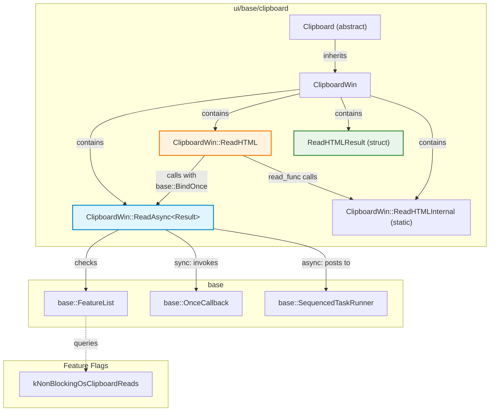
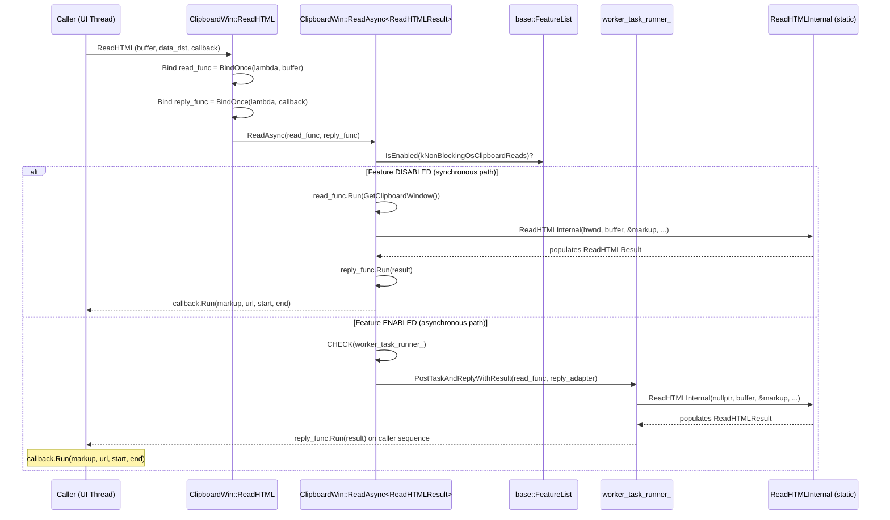

# High-Level Design: CL 7565599 — [Clipboard][Windows] Simplify ReadAsync Template

**CL URL:** https://chromium-review.googlesource.com/c/chromium/src/+/7565599
**Author:** Hewro Hewei (ihewro@chromium.org)
**Reviewer:** Dana Fried (dfried@chromium.org) — Code-Review +1
**Bug:** [crbug.com/458194647](https://crbug.com/458194647)
**Status:** NEW (approved, pending additional +1 from Rohan and David)

---

## 1. Executive Summary

This CL simplifies the `ClipboardWin::ReadAsync` template method by replacing its generic tuple-based return mechanism with a single-result-object pattern. Previously, `ReadAsync` accepted a variadic template function that returned a `std::tuple`, which was then unpacked via `std::apply` through a helper (`RunCallbackWithTuple`) to invoke the caller's callback. The new design uses strongly-typed `base::OnceCallback<Result(HWND)>` and `base::OnceCallback<void(Result)>` parameters, where `Result` is a single type (a struct like `ReadHTMLResult` for multi-value returns). This reduces template complexity, improves readability, eliminates the `std::apply`/`std::invoke_result_t` machinery, and makes the async dispatch pattern easier to understand and maintain. The change is net-negative in lines (-1 line), purely a refactoring with no behavioral change.

---

## 2. Architecture Overview

### Affected Components

This CL is scoped entirely within the **`ui/base/clipboard`** module, specifically the Windows clipboard implementation:

| File | Role |
|------|------|
| `ui/base/clipboard/clipboard_win.h` | Header: declares `ReadAsync` template, new `ReadHTMLResult` struct |
| `ui/base/clipboard/clipboard_win.cc` | Implementation: `ReadAsync` template body, `ReadHTML` call site, removal of `RunCallbackWithTuple` |

### Architectural Fit

`ClipboardWin` is the Windows-specific implementation of the abstract `Clipboard` interface (`ui/base/clipboard/clipboard.h`). The `ReadAsync` method is a private internal helper that provides a dual-path execution model:

- **Synchronous path:** Used when `kNonBlockingOsClipboardReads` is disabled; runs the read function inline on the caller thread.
- **Asynchronous path:** Posts the read function to a `worker_task_runner_` and replies with the result on the caller sequence.

### Component Diagram



---

## 3. Design Goals & Non-Goals

### Goals

1. **Simplify the `ReadAsync` template signature** — Replace the variadic `template <typename ReadTupleFunc, typename Callback, typename... Args>` with a clean `template <typename Result>` accepting two `base::OnceCallback` parameters.
2. **Eliminate tuple unpacking machinery** — Remove `RunCallbackWithTuple`, `std::apply`, `std::invoke_result_t`, and the forwarding of variadic `Args`.
3. **Improve readability** — Make the data flow through `ReadAsync` explicit: `read_func` produces a `Result`, `reply_func` consumes a `Result`.
4. **Introduce named result structs** — Replace ad-hoc `std::make_tuple(...)` returns with well-named structs (e.g., `ReadHTMLResult`) that document what data flows through the pipeline.
5. **Add safety check** — Add `CHECK(worker_task_runner_)` before using the task runner in the async path.

### Non-Goals

- **Changing `ReadHTMLInternal` signature** — The out-param interface of `ReadHTMLInternal` is preserved; a TODO is left for future cleanup (`crbug.com/458194647`).
- **Migrating other `ReadAsync` callers** — Only `ReadHTML` is shown in this diff as affected. Other callers (e.g., `ReadText`, `ReadPng`) that already return a single value continue to work unchanged.
- **Behavioral changes** — No change to clipboard read semantics, threading model, or feature-flag behavior.
- **Cross-platform changes** — Only the Windows implementation is touched.

---

## 4. System Interactions

### Data Flow

The `ReadHTML` method demonstrates the canonical flow through the refactored `ReadAsync`:



### IPC/Mojo Interactions

This CL does **not** involve IPC or Mojo. The clipboard read operations are local Win32 API calls. The `HWND` parameter (`owner_window`) is:
- `GetClipboardWindow()` in the synchronous path (actual window handle for Win32 clipboard API).
- `nullptr` in the asynchronous path (worker thread doesn't use an HWND).

---

## 5. API & Interface Changes

### Modified Interfaces

#### `ClipboardWin::ReadAsync` (private template method)

| Aspect | Before | After |
|--------|--------|-------|
| **Template params** | `<typename ReadTupleFunc, typename Callback, typename... Args>` | `<typename Result>` |
| **Parameters** | `ReadTupleFunc read_tuple_func, Callback callback, Args&&... args` | `base::OnceCallback<Result(HWND)> read_func, base::OnceCallback<void(Result)> reply_func` |
| **Return convention** | `read_tuple_func` returns `std::tuple<...>`, unpacked via `std::apply` | `read_func` returns `Result` directly, passed to `reply_func` |
| **Location** | `ui/base/clipboard/clipboard_win.h` lines 123–127 (old) → lines 128–133 (new) |

**Key behavioral difference at the call site:** Callers must now pre-bind any extra arguments (e.g., `ClipboardBuffer buffer`) into the `read_func` callback via `base::BindOnce`, rather than passing them as trailing variadic arguments to `ReadAsync`.

### New Types Introduced

#### `ClipboardWin::ReadHTMLResult` (struct)

**Location:** `ui/base/clipboard/clipboard_win.h` (new, lines 134–139)

```cpp
struct ReadHTMLResult {
    std::u16string markup;
    std::string src_url;       // Note: raw string, converted to GURL in reply_func
    uint32_t fragment_start = 0;
    uint32_t fragment_end = 0;
};
```

This struct replaces the anonymous `std::tuple<std::u16string, GURL, uint32_t, uint32_t>` that was previously returned from the `ReadHTML` lambda. Notably, `src_url` is stored as `std::string` (not `GURL`) in the struct, with the `GURL` conversion deferred to the `reply_func`. This keeps the struct lightweight and avoids constructing a `GURL` on the worker thread.

### Removed Interfaces

#### `RunCallbackWithTuple` (anonymous namespace helper)

**Location:** `ui/base/clipboard/clipboard_win.cc` (removed, was around lines 253–259)

This template function used `std::apply` to unpack a tuple into callback arguments. It is no longer needed since the new pattern passes a single `Result` object directly.

---

## 6. Dependencies

### What This Code Depends On

| Dependency | Usage |
|------------|-------|
| `base::OnceCallback` | Core callback type for `read_func` and `reply_func` |
| `base::BindOnce` | Used at call sites to bind arguments into callbacks |
| `base::SequencedTaskRunner` | `worker_task_runner_` for async dispatch |
| `PostTaskAndReplyWithResult` | Posts work to worker, returns result on caller thread |
| `base::FeatureList` | Checks `kNonBlockingOsClipboardReads` flag |
| `features::kNonBlockingOsClipboardReads` | Feature flag controlling sync vs. async behavior |
| Win32 Clipboard APIs | Underlying OS APIs called by `ReadHTMLInternal` and friends |

### What Depends On This Code

| Dependent | Impact |
|-----------|--------|
| `ClipboardWin::ReadHTML` | **Modified** — Updated to use new `ReadAsync` signature with `base::BindOnce` |
| Other `ClipboardWin::Read*` methods | **Unaffected** — Methods returning a single value (e.g., `ReadText` returning `std::u16string`) already match the new `template <typename Result>` signature without needing a struct |
| `Clipboard` abstract interface | **Unaffected** — Public API is unchanged; `ReadAsync` is a private implementation detail |
| Downstream consumers (Blink, content, etc.) | **Unaffected** — They interact with the abstract `Clipboard` interface, not `ClipboardWin` internals |

### Compatibility

This is a purely internal refactoring. No public API changes, no serialization format changes, no feature-flag semantic changes. Full backward compatibility is maintained.

---

## 7. Risks & Mitigations

### Risk Assessment

| Risk | Severity | Likelihood | Mitigation |
|------|----------|------------|------------|
| **Template instantiation errors on other callers** | Medium | Low | Other `ReadAsync` callers already return a single value; the new `template <typename Result>` accommodates both single-value and struct returns. CQ dry-run passed (Patch Set 7). |
| **Thread-safety of `ReadHTMLResult`** | Low | Very Low | The struct contains only value types (`std::u16string`, `std::string`, `uint32_t`) with no shared state. It's moved between threads, never shared. Reviewer (Dana Fried) confirmed `ClipboardBuffer` is an enum class (thread-safe by nature). |
| **`CHECK(worker_task_runner_)` crash** | Low | Very Low | Added as a safety net in the async path. If `worker_task_runner_` were null with the feature enabled, the old code would have crashed anyway (null pointer dereference). The `CHECK` makes the failure explicit and debuggable. |
| **`GURL` construction deferred to reply thread** | Low | Very Low | Previously, `GURL(src_url)` was constructed inside the read lambda (potentially on the worker thread). Now it's constructed in `reply_func` on the caller thread. `GURL` construction is lightweight and this is actually a minor improvement — avoiding unnecessary work on the worker thread. |
| **Struct not yet used for `ReadHTMLInternal` out-params** | Info | N/A | A TODO is left (`crbug.com/458194647`) to refactor `ReadHTMLInternal` to return `ReadHTMLResult` directly instead of using out-params. This is explicitly deferred. |

### Backward Compatibility

No concerns. This is a private implementation refactoring with no external API surface changes.

---

## 8. Testing Strategy

### Existing Test Coverage

The `ClipboardWin` class is tested by:
- **`clipboard_unittest.cc`** — Tests clipboard read/write operations through the abstract `Clipboard` interface. These tests exercise both the synchronous and asynchronous paths via the `kNonBlockingOsClipboardReads` feature flag.
- **CQ dry-run** — Patch Set 7 passed the Chromium CQ, which includes Windows-specific unit tests, browser tests, and integration tests.

### What Should Be Verified

1. **ReadHTML returns correct data** — Existing `clipboard_unittest.cc` tests for HTML reading cover this.
2. **Sync path (feature disabled)** — The `read_func` is called with `GetClipboardWindow()` and result is forwarded to `reply_func` synchronously.
3. **Async path (feature enabled)** — The `read_func` is posted to `worker_task_runner_` with `owner_window = nullptr`, and `reply_func` runs on the caller sequence with the result.
4. **Other `Read*` methods still compile and work** — The template `<typename Result>` must instantiate correctly for all existing callers (single-value returns like `std::u16string`, `std::vector<uint8_t>`, etc.).

### Test Coverage Assessment

No new tests are required for this CL. It is a pure refactoring that preserves behavior. The existing test infrastructure adequately covers the clipboard read operations on Windows. The CQ dry-run passing on Patch Set 7 confirms no regressions.

---

## Appendix: Before vs. After Call Pattern

### Before (tuple-based)

```cpp
// ReadAsync signature:
template <typename ReadTupleFunc, typename Callback, typename... Args>
void ReadAsync(ReadTupleFunc read_tuple_func, Callback callback, Args&&... args);

// Call site:
ReadAsync(
    [](HWND owner_window, ClipboardBuffer buffer) {
        // ... read data ...
        return std::make_tuple(markup, GURL(src_url), fragment_start, fragment_end);
    },
    std::move(callback), buffer);

// Internal dispatch used RunCallbackWithTuple + std::apply to unpack.
```

### After (single-result-object)

```cpp
// ReadAsync signature:
template <typename Result>
void ReadAsync(base::OnceCallback<Result(HWND)> read_func,
               base::OnceCallback<void(Result)> reply_func);

// Call site:
ReadAsync(base::BindOnce(
              [](ClipboardBuffer buffer, HWND owner_window) {
                  ReadHTMLResult result;
                  ReadHTMLInternal(owner_window, buffer, &result.markup, ...);
                  return result;
              }, buffer),
          base::BindOnce(
              [](ReadHtmlCallback callback, ReadHTMLResult result) {
                  std::move(callback).Run(std::move(result.markup), ...);
              }, std::move(callback)));

// Internal dispatch: direct OnceCallback::Run, no tuple unpacking.
```

The after pattern is more explicit, type-safe, and follows Chromium's established `base::BindOnce` / `base::OnceCallback` conventions.

The file exists but has incomplete content. Let me replace it entirely.

HLD document written to `llm_out/out/hld.md` with all 8 required sections, two Mermaid diagrams (component + sequence), and detailed before/after comparison appendix.

