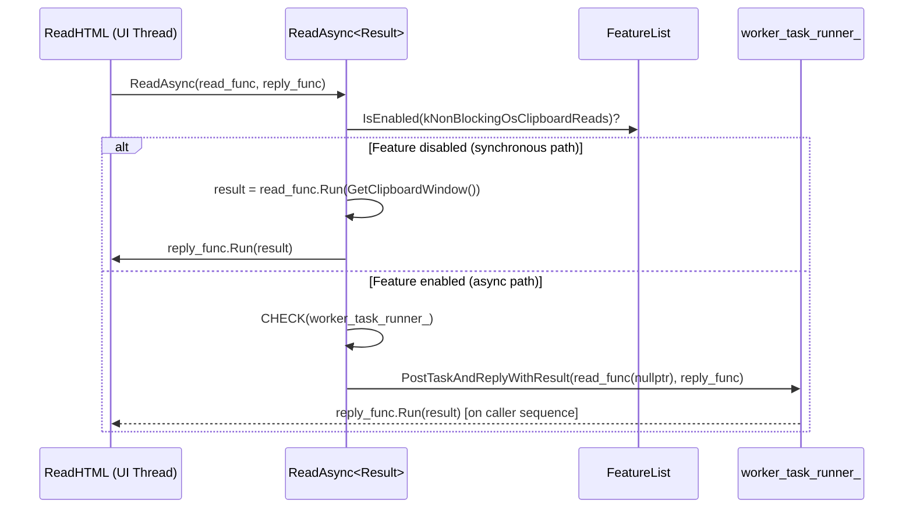
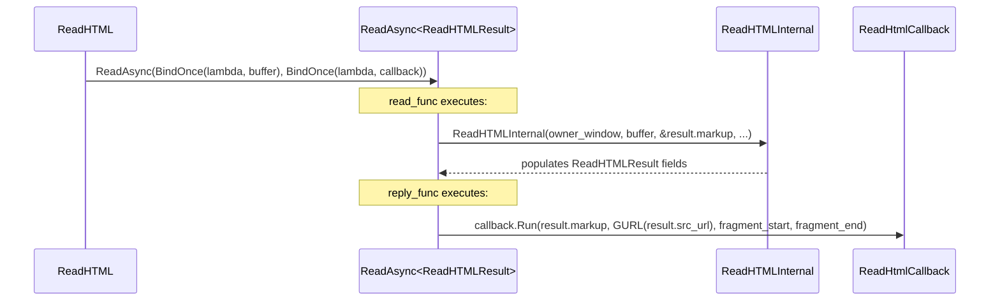
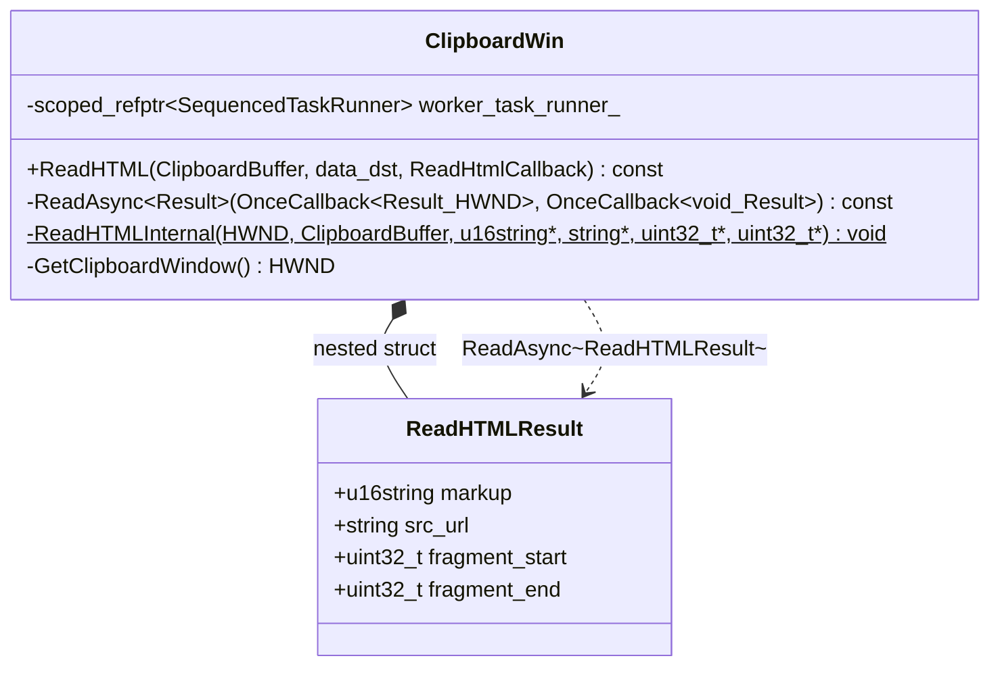
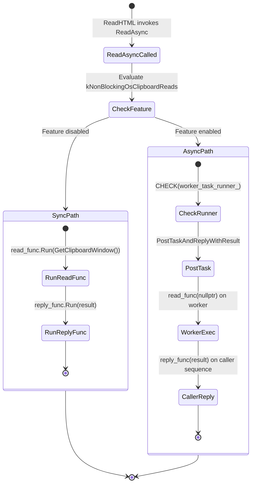

# Low-Level Design Review

**CL Number**: 7565599
**Model**: claude-opus-4.6
**Generated**: 2026-02-12T05:34:11.082928+00:00

---


Now let me read the remaining context files and check for existing output.

Created `lld.md` in the CL folder with full low-level design analysis including file-by-file breakdowns, Mermaid diagrams (sequence, class, state), implementation concerns, and improvement suggestions.

# Low-Level Design: CL 7565599 — [Clipboard][Windows] Simplify ReadAsync template

**CL URL:** https://chromium-review.googlesource.com/c/chromium/src/+/7565599  
**Author:** Hewro Hewei (ihewro@chromium.org)  
**Reviewers:** Dana Fried (dfried@chromium.org)  
**Status:** NEW (Code-Review+1 from Dana Fried)  
**Bug:** [crbug.com/458194647](https://crbug.com/458194647)

---

## 1. File-by-File Analysis

---

### 1.1 `ui/base/clipboard/clipboard_win.h` (+16/−8)

**Purpose of changes:**  
Simplify the `ReadAsync` template declaration from a variadic, tuple-based interface to a cleaner two-callback pattern parameterized on a single `Result` type. Introduce a `ReadHTMLResult` struct to carry multi-field HTML read results.

**Key modifications:**
- Replace the old variadic template `ReadAsync(ReadTupleFunc, Callback, Args&&...)` with `ReadAsync(base::OnceCallback<Result(HWND)>, base::OnceCallback<void(Result)>)`
- Add `ReadHTMLResult` struct to aggregate HTML read output fields
- Update comment/documentation for `ReadAsync` to describe the new two-callback pattern
- Add a TODO to eventually make `ReadHTMLInternal` return `ReadHTMLResult` directly

**New/Modified Functions:**

| Function/Type | Purpose | Parameters | Returns |
|---|---|---|---|
| `ReadAsync<Result>` (template, modified) | Dispatches a clipboard read on worker or caller thread | `base::OnceCallback<Result(HWND)> read_func`, `base::OnceCallback<void(Result)> reply_func` | `void` |

**New Data Structures:**

| Struct | Purpose | Fields |
|---|---|---|
| `ReadHTMLResult` | Aggregates multiple return values from `ReadHTMLInternal` | `std::u16string markup`, `std::string src_url`, `uint32_t fragment_start = 0`, `uint32_t fragment_end = 0` |

**API Change Details:**

Old signature:
```cpp
template <typename ReadTupleFunc, typename Callback, typename... Args>
void ReadAsync(ReadTupleFunc read_tuple_func,
               Callback callback,
               Args&&... args) const;
```

New signature:
```cpp
template <typename Result>
void ReadAsync(base::OnceCallback<Result(HWND)> read_func,
               base::OnceCallback<void(Result)> reply_func) const;
```

Key differences:
1. Single template parameter (`Result`) instead of three variadic packs
2. Uses `base::OnceCallback` instead of raw callables — enforces move-only semantics
3. Extra arguments (e.g., `ClipboardBuffer`) are now pre-bound via `base::BindOnce` at the call site, rather than forwarded through the template

---

### 1.2 `ui/base/clipboard/clipboard_win.cc` (+28/−37)

**Purpose of changes:**  
Implement the simplified `ReadAsync` template, remove the `RunCallbackWithTuple` helper, and update `ReadHTML` to use the new pattern with `ReadHTMLResult`.

**Key modifications:**
- **Remove** the anonymous-namespace helper `RunCallbackWithTuple` (tuple-unpacking via `std::apply`)
- **Rewrite `ReadAsync`** to use `base::OnceCallback` directly — no more tuple unpacking, no more variadic arg forwarding
- **Add `CHECK(worker_task_runner_)`** guard before posting to the worker thread
- **Update `ReadHTML`** call site to use `base::BindOnce` for both `read_func` and `reply_func`, with `ClipboardBuffer` pre-bound

**Deleted Functions:**

| Function | Reason for Removal |
|---|---|
| `RunCallbackWithTuple<Callback, Tuple>` | No longer needed; `reply_func` is invoked directly with the `Result` object |

**Modified Functions:**

| Function | Purpose | Parameters | Returns |
|---|---|---|---|
| `ClipboardWin::ReadAsync<Result>` | Dispatch clipboard read sync or async | `base::OnceCallback<Result(HWND)> read_func`, `base::OnceCallback<void(Result)> reply_func` | `void` |
| `ClipboardWin::ReadHTML` | Read HTML from clipboard (call-site updated) | `ClipboardBuffer buffer`, `data_dst`, `ReadHtmlCallback callback` | `void` |

**ReadAsync Implementation — Data Flow:**



**ReadHTML Call-Site — Data Flow:**



---

## 2. Class Diagram



---

## 3. State Diagram



---

## 4. Implementation Concerns

### 4.1 Memory Management
- **ReadHTMLResult is value-type with move semantics.** `std::u16string` and `std::string` members are movable; `uint32_t` fields are trivially copyable. No heap ownership concerns.
- **`base::OnceCallback` enforces single-use.** Move-only semantics prevent double-invocation — correct for this pattern.

### 4.2 Thread Safety
- **`ReadHTMLResult` is not shared across threads.** It is produced on one thread and consumed on another via `PostTaskAndReplyWithResult`, which handles the handoff safely.
- **`ClipboardBuffer` is an enum class** (confirmed by reviewer discussion) — trivially safe to bind and copy across threads.
- **`CHECK(worker_task_runner_)` added.** This is a new runtime assertion that crashes if the worker runner is null when the async path is taken. This is appropriate — a null runner in the async path would be a programming error.

### 4.3 Performance
- **Net reduction of template instantiation complexity.** The old approach required `std::invoke_result_t`, `std::apply`, and variadic forwarding — all of which increase compile time and binary size. The new single-parameter template is simpler.
- **No runtime performance regression.** The callback invocation path is equivalent; the struct-based return may enable RVO/NRVO more reliably than tuples in some compilers.
- **One extra lambda in the async reply path.** The reply `BindOnce` wraps `reply_func` in a lambda that unpacks `ReadHTMLResult` → callback args. This is a trivial overhead (one extra indirect call) and matches the sync path behavior.

### 4.4 Maintainability
- **Significantly improved readability.** The old `ReadTupleFunc` + `Args&&...` + `RunCallbackWithTuple` + `std::apply` chain was hard to follow. The new pattern is self-documenting.
- **TODO left for future cleanup.** `ReadHTMLInternal` still uses out-params; the struct exists at the caller level as an adapter. A future CL can make `ReadHTMLInternal` return `ReadHTMLResult` directly, eliminating the adapter lambda.
- **Pattern is extensible.** Other `ReadAsync` call sites (not shown in this CL but presumably exist) can adopt a similar struct-return pattern to eliminate tuples throughout.

---

## 5. Suggestions for Improvement

### 5.1 Struct Placement
- `ReadHTMLResult` is declared as a nested struct inside `ClipboardWin` but placed between `ReadAsync` and `ReadHTMLInternal` declarations without a blank line or access-specifier boundary. Consider grouping result structs together (e.g., near other type aliases/structs) or adding a comment block separator for clarity.

### 5.2 Reply Lambda Elimination (Future)
- The reply `BindOnce` lambda that unpacks `ReadHTMLResult` into callback arguments exists only because `ReadHtmlCallback` expects individual parameters. If the callback signature were updated to accept `ReadHTMLResult` directly, the reply lambda could be replaced with just `std::move(callback)`, further simplifying the call site.

### 5.3 GURL Construction Timing
- `GURL(result.src_url)` is constructed in the reply lambda on the caller thread. Since GURL construction involves URL parsing, it could be done in the read lambda on the worker thread to keep parsing off the UI thread. This is a minor optimization but aligns with the goal of `kNonBlockingOsClipboardReads`.

### 5.4 Consider `static_assert` on Result Type
- The template `ReadAsync<Result>` works with any `Result` type. A `static_assert(std::is_move_constructible_v<Result>)` inside the template body would catch misuse at compile time with a clear error message, rather than producing cryptic template errors.

### 5.5 Consistency Across Other ReadAsync Callers
- This CL only updates `ReadHTML`. If other callers of the old `ReadAsync` exist (likely, given this is a template utility), they will also need to be migrated. Tracking this in the bug or as follow-up CLs would be good practice.

---

## 6. Summary

| Aspect | Before | After |
|---|---|---|
| Template parameters | `ReadTupleFunc, Callback, Args...` | `Result` (single) |
| Return type | `std::tuple<...>` | Named struct (`ReadHTMLResult`) |
| Callback invocation | `std::apply` via `RunCallbackWithTuple` | Direct `reply_func.Run(result)` |
| Arg forwarding | `std::forward<Args>(args)...` | Pre-bound via `base::BindOnce` |
| Worker null check | None | `CHECK(worker_task_runner_)` |
| Lines changed | — | +44/−45 (net −1) |

The CL is a well-scoped refactor that reduces template complexity, improves readability, and uses idiomatic Chromium `base::OnceCallback` patterns. The `CHECK` addition improves robustness. The main future work is propagating the struct-return pattern to `ReadHTMLInternal` itself and other `ReadAsync` callers.

