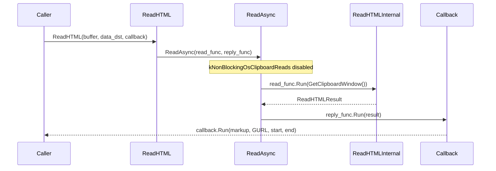
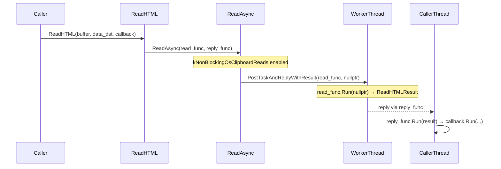
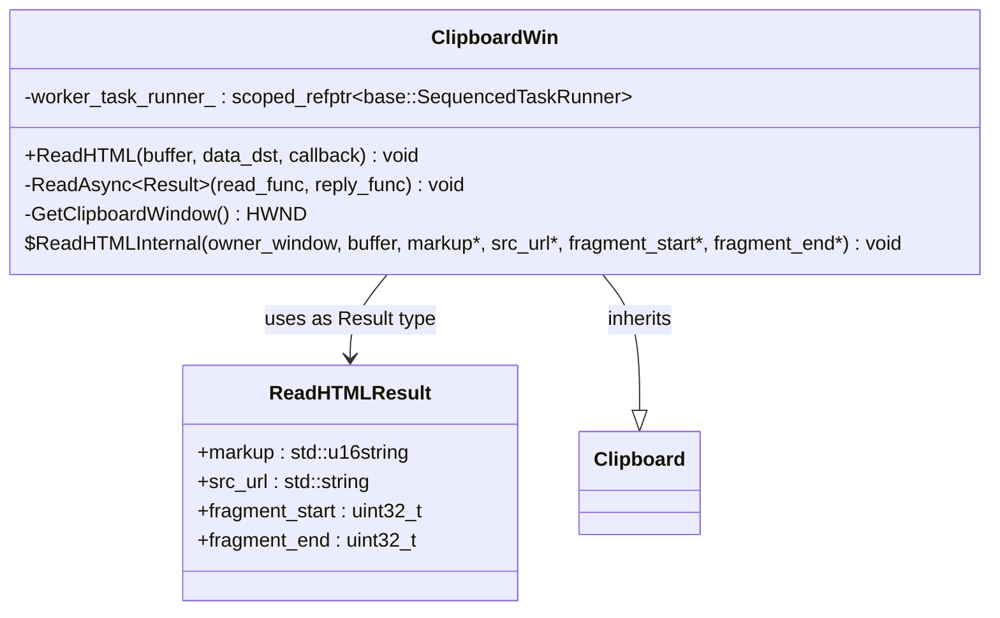
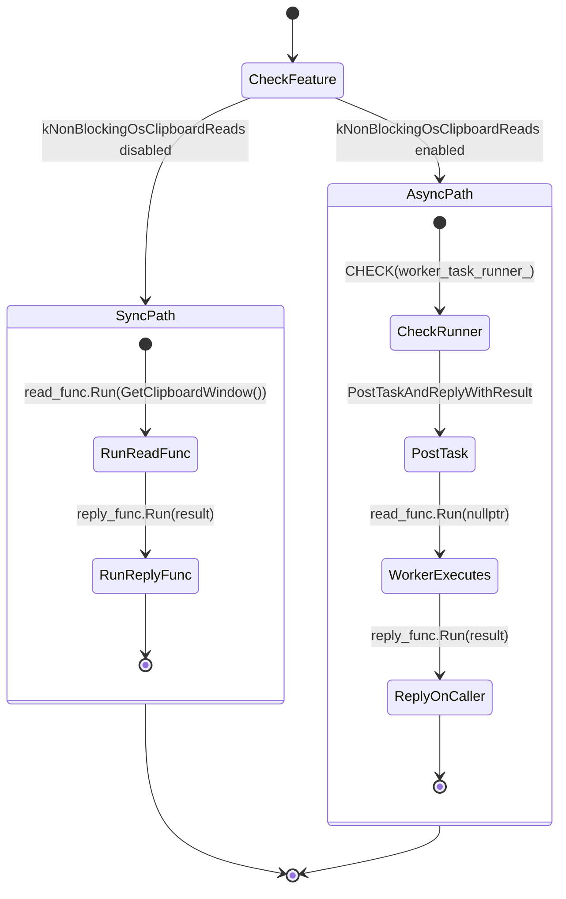

# Low-Level Design: CL 7565599 — [Clipboard][Windows] Simplify ReadAsync Template

**CL URL:** https://chromium-review.googlesource.com/c/chromium/src/+/7565599
**Author:** Hewro Hewei (ihewro@chromium.org)
**Reviewer:** Dana Fried (dfried@chromium.org) — Code-Review +1
**Status:** NEW (approved, pending additional +1s from Rohan and David)

---

## 1. File-by-File Analysis

---

### 1.1 `ui/base/clipboard/clipboard_win.h`

**Purpose of changes:**
Simplify the `ReadAsync` method template from a variadic, tuple-based design to a cleaner two-callback pattern with a single `Result` type parameter. Introduce `ReadHTMLResult` struct to replace the `std::tuple` previously used to bundle HTML read outputs.

**Key modifications:**
- Replace the old variadic template `ReadAsync(ReadTupleFunc, Callback, Args&&...)` with a simpler `ReadAsync<Result>(base::OnceCallback<Result(HWND)>, base::OnceCallback<void(Result)>)`.
- Add `ReadHTMLResult` struct as a named result type for `ReadHTML` operations.
- Update the doc comment to accurately describe the new two-callback contract.
- Add a `TODO` comment referencing crbug.com/458194647 to track future refactoring of `ReadHTMLInternal` to return `ReadHTMLResult` directly instead of using out-params.

**New/Modified Functions:**

| Function/Type | Purpose | Parameters | Returns |
|---|---|---|---|
| `ReadAsync<Result>` (modified) | Dispatches a clipboard read either synchronously or to `worker_task_runner_` | `base::OnceCallback<Result(HWND)> read_func`, `base::OnceCallback<void(Result)> reply_func` | `void` |
| `ReadHTMLResult` (new struct) | Bundles HTML clipboard read results | N/A (POD struct) | N/A |

**ReadHTMLResult struct fields:**

| Field | Type | Default | Description |
|---|---|---|---|
| `markup` | `std::u16string` | (empty) | The HTML markup content |
| `src_url` | `std::string` | (empty) | Source URL of the HTML content |
| `fragment_start` | `uint32_t` | `0` | Start offset of the HTML fragment |
| `fragment_end` | `uint32_t` | `0` | End offset of the HTML fragment |

**API Change Summary:**

| Aspect | Before | After |
|---|---|---|
| Template params | `typename ReadTupleFunc, typename Callback, typename... Args` | `typename Result` |
| Signature | `ReadAsync(ReadTupleFunc, Callback, Args&&...)` | `ReadAsync(base::OnceCallback<Result(HWND)>, base::OnceCallback<void(Result)>)` |
| read_func signature | Implicit: callable taking `(HWND, Args...)` returning `std::tuple<...>` | Explicit: `base::OnceCallback<Result(HWND)>` |
| Callback invocation | Tuple unpacked via `std::apply` into callback | `reply_func` receives `Result` directly |
| Extra args | Forwarded via parameter pack | Bound into `read_func` via `base::BindOnce` at call site |

---

### 1.2 `ui/base/clipboard/clipboard_win.cc`

**Purpose of changes:**
Update the `ReadAsync` implementation and the `ReadHTML` call site to use the simplified template. Remove the now-unnecessary `RunCallbackWithTuple` helper.

**Key modifications:**
- **Remove `RunCallbackWithTuple`**: The anonymous-namespace helper that used `std::apply` to unpack a tuple into a callback's arguments is deleted entirely (9 lines removed).
- **Rewrite `ReadHTML` call site**: The lambda that returned `std::make_tuple(...)` is replaced with a `base::BindOnce` lambda returning a `ReadHTMLResult` struct. A separate `reply_func` lambda decomposes the struct and calls the original `ReadHtmlCallback`.
- **Simplify `ReadAsync` implementation**: The synchronous path now directly calls `read_func.Run()` and `reply_func.Run()`. The async path passes `read_func` directly to `PostTaskAndReplyWithResult` without an intermediate wrapping lambda for argument forwarding. A `CHECK(worker_task_runner_)` is added before use.

**New/Modified Functions:**

| Function | Purpose | Parameters | Returns |
|---|---|---|---|
| `RunCallbackWithTuple` (removed) | Was: Unpack tuple into callback args via `std::apply` | `Callback`, `Tuple` | `void` |
| `ClipboardWin::ReadHTML` (modified) | Reads HTML from clipboard asynchronously or synchronously | `ClipboardBuffer buffer`, `data_dst`, `ReadHtmlCallback callback` | `void` |
| `ClipboardWin::ReadAsync<Result>` (modified) | Core dispatch method for clipboard reads | `base::OnceCallback<Result(HWND)> read_func`, `base::OnceCallback<void(Result)> reply_func` | `void` |

**Data Flow — `ReadHTML` (synchronous path, feature disabled):**



**Data Flow — `ReadHTML` (asynchronous path, feature enabled):**



---

## 2. Class Diagram



---

## 3. State Diagram — `ReadAsync` Dispatch



---

## 4. Implementation Concerns

### 4.1 Memory Management
- **No issues.** `ReadHTMLResult` is a plain struct with value-semantic members (`std::u16string`, `std::string`, `uint32_t`). It is moved through the callback chain, so no extra copies or dangling references occur.
- `base::OnceCallback` enforces single-use semantics, preventing double-invocation of `read_func` or `reply_func`.

### 4.2 Thread Safety
- **ReadHTMLResult is safe to move across threads**: It contains no thread-affine members (strings and integers only). This was confirmed in review discussion — `ClipboardBuffer` (bound into the `read_func` closure) is an `enum class`, which is trivially thread-safe.
- **`CHECK(worker_task_runner_)` addition**: The new `CHECK` on the async path is a good defensive addition. Previously, a null `worker_task_runner_` when the feature was enabled would have caused a null-pointer dereference at `PostTaskAndReplyWithResult`. The explicit CHECK provides a clearer crash signature.

### 4.3 Performance
- **Neutral to slightly positive.** The `std::tuple` + `std::apply` machinery involved template instantiation overhead and an intermediate lambda for argument forwarding. The new code eliminates that layer. At runtime, the difference is negligible — this is clipboard I/O code, not a hot path.

### 4.4 Maintainability
- **Significantly improved.** The new `ReadAsync` template has a single type parameter (`Result`) vs. three variadic parameters. The contract is expressed with concrete `base::OnceCallback` types, making it self-documenting and IDE-friendly.
- **Callers bear slightly more boilerplate**: `ReadHTML` now constructs two `base::BindOnce` callbacks explicitly. However, this makes the data flow (what runs on the worker, what runs on the reply) explicit at the call site, which aids readability.

---

## 5. Suggestions for Improvement

### 5.1 Struct Placement and Visibility

**Concern:** `ReadHTMLResult` is declared inside `ClipboardWin`'s private section in the header, immediately before `ReadHTMLInternal`. While it's currently only used internally, placing it as a nested struct within a class that already has a large interface adds to cognitive load.

**Suggestion:** Consider moving `ReadHTMLResult` to an unnamed namespace in `clipboard_win.cc` since it is only used as an implementation detail of `ReadHTML` and `ReadAsync`. If it needs to remain in the header (e.g., for test visibility), that's fine, but a comment explaining why would help.

### 5.2 Redundant Reply Wrapper in Async Path

**Concern:** In the async path of `ReadAsync`, the reply callback is wrapped in another lambda:
```cpp
base::BindOnce(
    [](base::OnceCallback<void(Result)> reply_func, Result result) {
        std::move(reply_func).Run(std::move(result));
    },
    std::move(reply_func))
```
This lambda does nothing except forward `result` to `reply_func` — it's a no-op wrapper.

**Suggestion:** `PostTaskAndReplyWithResult` accepts a `base::OnceCallback` for the reply. Since `reply_func` is already a `base::OnceCallback<void(Result)>`, it can be passed directly as the reply callback:
```cpp
worker_task_runner_->PostTaskAndReplyWithResult(
    FROM_HERE,
    base::BindOnce(std::move(read_func), /*owner_window=*/nullptr),
    std::move(reply_func));
```
This would remove the unnecessary indirection and further simplify the code.

### 5.3 Follow Through on TODO

The CL adds a `TODO(crbug.com/458194647)` to refactor `ReadHTMLInternal` to return `ReadHTMLResult` directly instead of using out-params. This would eliminate the decomposition in the `reply_func` lambda:
```cpp
// Current: reply_func unpacks struct fields into callback args
[](ReadHtmlCallback callback, ReadHTMLResult result) {
    std::move(callback).Run(
        std::move(result.markup), GURL(result.src_url),
        result.fragment_start, result.fragment_end);
}
```
Following through on this TODO would make the code even cleaner — `ReadHtmlCallback` could accept `ReadHTMLResult` directly, and the reply_func could just forward the struct.

### 5.4 Consider Applying the Pattern to Other ReadAsync Callers

This CL only modifies `ReadHTML`. If there are other callers of `ReadAsync` in `clipboard_win.cc` (e.g., `ReadText`, `ReadRTF`, `ReadPng`, etc.), they presumably still use the old tuple-based signature. Since this CL changes the `ReadAsync` signature, all callers must have been updated (or there's a compile error). It would be worth confirming all call sites are consistent and similarly benefit from the simplification.

### 5.5 `GURL` Construction Deferred to Reply

The `GURL(result.src_url)` construction happens in the `reply_func` lambda (on the caller thread), not in the `read_func` (on the worker thread). This is fine since `GURL` construction is lightweight, but if `GURL` ever becomes thread-affine or expensive, it would be worth noting this choice was deliberate.
