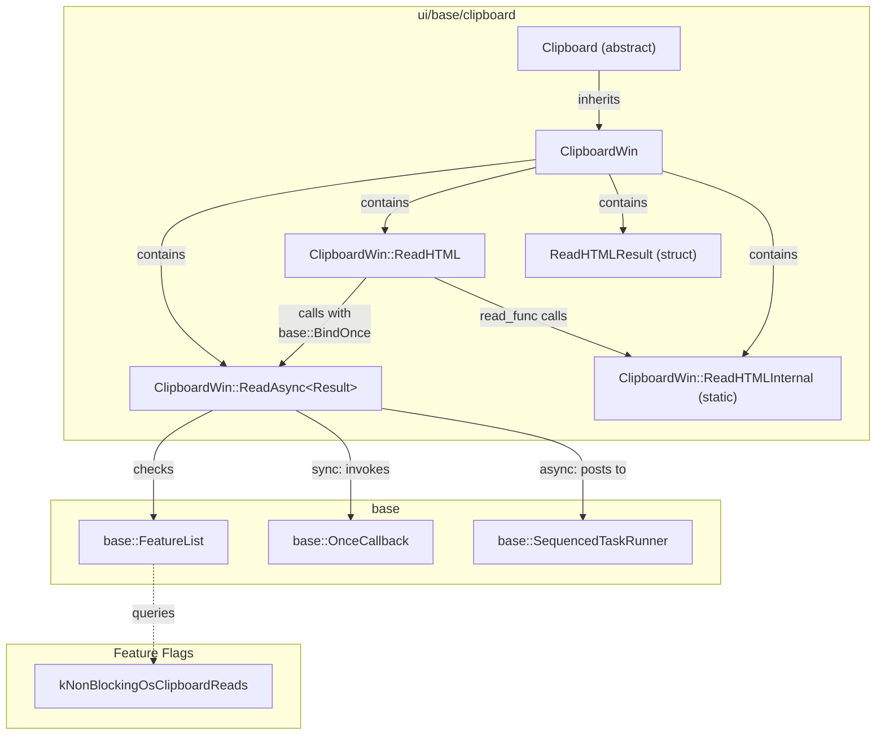
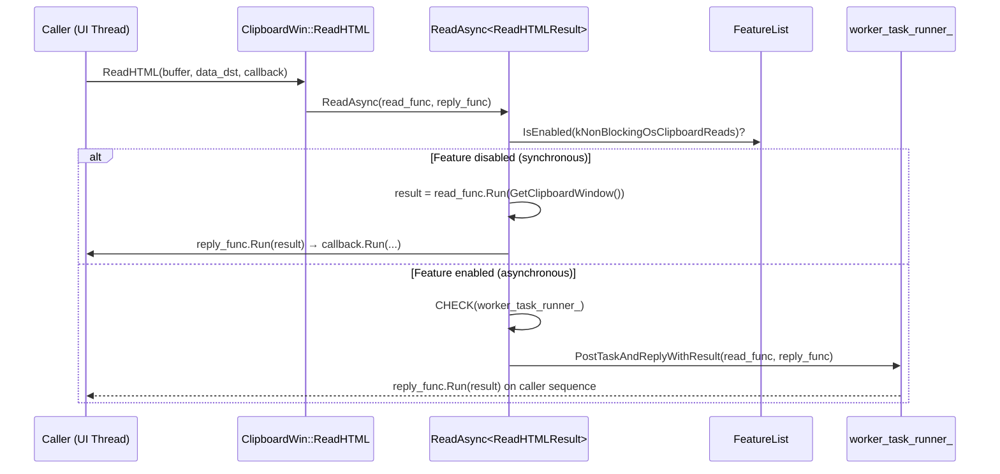

# Review Summary

**CL Number**: 7565599
**Model**: claude-opus-4.6
**Generated**: 2026-02-12T05:36:45.404207+00:00

---


Now I have all the source material. Let me create the comprehensive review summary.

Created `review_summary.md` with comprehensive review across all 9 sections. **Verdict: APPROVED_WITH_COMMENTS** — the CL is a clean, well-scoped refactoring with no critical or major issues, only minor suggestions (redundant reply wrapper lambda, struct placement nit).


# Review Summary: CL 7565599 — [Clipboard][Windows] Simplify ReadAsync Template

**CL URL:** https://chromium-review.googlesource.com/c/chromium/src/+/7565599  
**Author:** Hewro Hewei (ihewro@chromium.org)  
**Reviewer:** Dana Fried (dfried@chromium.org) — Code-Review+1  
**Status:** NEW (approved by Dana Fried, pending +1 from Rohan and David)  
**Bug:** [crbug.com/458194647](https://crbug.com/458194647)  
**Files Changed:** `ui/base/clipboard/clipboard_win.cc` (+28/−37), `ui/base/clipboard/clipboard_win.h` (+16/−8)  
**Net Change:** +44/−45 lines (net −1)

---

## 1. Executive Summary

This CL simplifies the `ClipboardWin::ReadAsync` template method by replacing a complex variadic, tuple-based return mechanism (`ReadTupleFunc` + `Args&&...` + `std::apply` + `RunCallbackWithTuple`) with a clean two-callback pattern parameterized on a single `Result` type. The new design uses strongly-typed `base::OnceCallback<Result(HWND)>` and `base::OnceCallback<void(Result)>` parameters, introduces a `ReadHTMLResult` struct for multi-value returns, and adds a `CHECK(worker_task_runner_)` safety guard. This is a pure refactoring with no behavioral change, improving readability and maintainability while following idiomatic Chromium `base::BindOnce`/`base::OnceCallback` patterns.

---

## 2. Design Assessment

### Architecture Quality

| Aspect | Rating (1-5) | Comments |
|--------|--------------|----------|
| Clarity | 5 | Replaces opaque tuple/variadic machinery with explicit, self-documenting `read_func` → `Result` → `reply_func` flow. Named `ReadHTMLResult` struct clearly documents data fields. |
| Maintainability | 5 | Single template parameter (`Result`) is far easier to reason about than the old 3-parameter variadic pack. Eliminates `RunCallbackWithTuple` helper entirely. TODO left for future incremental cleanup. |
| Extensibility | 4 | Pattern is easily extensible — other `ReadAsync` callers can adopt struct-return pattern. Slight deduction: no `static_assert` to guard against misuse with non-movable types. |
| Consistency | 5 | Uses standard Chromium `base::BindOnce`/`base::OnceCallback` idioms. The old raw-callable + variadic-forwarding approach was non-standard for Chromium code. |

### Architecture Diagram



### Data Flow (ReadAsync)



---

## 3. Implementation Assessment

### Code Quality

| Aspect | Rating (1-5) | Comments |
|--------|--------------|----------|
| Correctness | 5 | Logic is preserved exactly; sync/async paths are functionally equivalent to the old code. `CHECK(worker_task_runner_)` is a welcome safety addition. CQ dry-run passed on Patch Set 7. |
| Efficiency | 5 | Net improvement: eliminates `std::apply`/variadic instantiation overhead. Struct return may benefit from RVO. Removes one level of indirection (`RunCallbackWithTuple`). |
| Readability | 5 | Self-documenting pattern: `read_func` produces `Result`, `reply_func` consumes `Result`. Named struct fields replace anonymous tuple positions. |
| Test Coverage | 4 | No new tests, but this is a pure refactor with no behavioral change. Existing `clipboard_unittest.cc` covers both sync and async paths. CQ dry-run validates. Slight deduction for no explicit test of `ReadHTMLResult` struct default values. |

### API Change Summary

| Aspect | Before | After |
|--------|--------|-------|
| Template params | `ReadTupleFunc, Callback, Args...` | `Result` (single) |
| Return type | `std::tuple<...>` | Named struct (`ReadHTMLResult`) |
| Callback invocation | `std::apply` via `RunCallbackWithTuple` | Direct `reply_func.Run(result)` |
| Arg forwarding | `std::forward<Args>(args)...` | Pre-bound via `base::BindOnce` |
| Worker null check | None | `CHECK(worker_task_runner_)` |

---

## 4. Key Findings

### Critical Issues (Must Fix)

- **None identified.** The refactoring is correct, preserves behavior, and passed CQ dry-run.

### Major Issues (Should Fix)

- **None identified.**

### Minor Issues (Nice to Fix)

1. **Redundant reply wrapper lambda in async path** (`clipboard_win.cc`, ~line 963): The async path wraps `reply_func` in a lambda that simply forwards the call: `base::BindOnce([](base::OnceCallback<void(Result)> reply_func, Result result) { std::move(reply_func).Run(std::move(result)); }, std::move(reply_func))`. Since `PostTaskAndReplyWithResult` accepts `base::OnceCallback<void(Result)>` directly, this can be simplified to just `std::move(reply_func)`, eliminating one level of indirection.

2. **`ReadHTMLResult` struct placement in header** (`clipboard_win.h`, lines 134–139): The struct is declared between `ReadAsync` and `ReadHTMLInternal` without visual grouping. Consider adding a comment separator (e.g., `// Result types for ReadAsync callers.`) for better header organization, especially if more result structs are added later.

### Suggestions (Optional)

1. **Move `GURL` construction to worker thread**: `GURL(result.src_url)` is constructed in the reply lambda on the caller (UI) thread. Since `kNonBlockingOsClipboardReads` aims to minimize UI-thread work, constructing the `GURL` on the worker thread (by storing `GURL` in `ReadHTMLResult` instead of `std::string`) would be more consistent. Note: this matches the old behavior, so it's not a regression.

2. **Add `static_assert` on `Result` type**: `ReadAsync<Result>` works with any type. Adding `static_assert(std::is_move_constructible_v<Result>, "Result type must be move-constructible")` would catch misuse at compile time with a clear error message rather than cryptic template errors.

3. **Confirm all callers are migrated**: The old `ReadAsync` signature and `RunCallbackWithTuple` are fully removed in this CL, implying all callers are migrated (or other callers already returned single values matching the new template). The CQ passing confirms this, but a manual sanity check is worthwhile.

4. **Future: Eliminate reply lambda entirely**: The reply `BindOnce` lambda exists only because `ReadHtmlCallback` expects individual parameters. If the callback signature is updated to accept `ReadHTMLResult` directly in a follow-up CL, the reply lambda can be replaced with just `std::move(callback)`.

---

## 5. Test Coverage Analysis

### Existing Tests
- **`clipboard_unittest.cc`**: Tests clipboard read/write operations through the abstract `Clipboard` interface, covering both synchronous and asynchronous paths via the `kNonBlockingOsClipboardReads` feature flag.
- **CQ Dry-Run**: Patch Set 7 passed the full Chromium CQ (Windows unit tests, browser tests, integration tests).

### Missing Tests
- No dedicated unit test for `ReadHTMLResult` struct default initialization (minor — fields are trivially initialized).
- No explicit test verifying the `CHECK(worker_task_runner_)` assertion fires when expected (crash tests are generally not written for CHECKs in Chromium).

### Recommended Additional Tests
- **None required for this CL.** This is a pure refactoring with no behavioral change. The existing test infrastructure provides adequate coverage. If future CLs modify `ReadHTMLInternal` to return `ReadHTMLResult` directly, tests should verify the struct-based return path.

---

## 6. Security Considerations

- **No new attack surface.** No user-controlled inputs pass through without existing validation. The clipboard read path remains unchanged.
- **Thread safety is preserved.** `ReadHTMLResult` is a value type (movable strings + trivially copyable integers) transferred between threads via `PostTaskAndReplyWithResult`, which handles the handoff safely.
- **`ClipboardBuffer` is an enum class** (confirmed by reviewer discussion) — trivially safe to bind and copy across threads.
- **No IPC/Mojo changes.** All clipboard operations are local Win32 API calls.

**Recommendations:** None. No security concerns identified.

---

## 7. Performance Considerations

- **Compile-time improvement:** Eliminates `std::invoke_result_t`, `std::apply`, and variadic forwarding template instantiations, reducing compile time and binary size for the affected translation unit.
- **Runtime performance:** Neutral to slightly positive. The callback invocation path is equivalent; struct-based return may enable RVO/NRVO more reliably than tuples. One fewer indirection level (no `RunCallbackWithTuple`).
- **Minor optimization opportunity:** `GURL(result.src_url)` could be constructed on the worker thread instead of the UI thread. GURL parsing is lightweight but non-trivial; moving it off the UI thread would be consistent with the `kNonBlockingOsClipboardReads` goal.

**Benchmarking Recommendations:** None needed. This is a structural refactor with negligible runtime impact.

---

## 8. Final Recommendation

**Verdict**: APPROVED_WITH_COMMENTS

**Rationale:**
This is an excellently executed, well-scoped refactoring that meaningfully reduces template complexity in the Windows clipboard implementation. The logic is preserved correctly across both sync and async paths, the code follows Chromium conventions, and is significantly easier to understand than what it replaces. The `CHECK(worker_task_runner_)` addition improves robustness. The CQ dry-run passed, confirming no regressions. Dana Fried's CR+1 is well-placed. The CL is ready to land once Rohan and David also approve (per Dana's instruction).

**Action Items for Author:**
1. **Consider simplifying the async reply path** (Minor Issue #1): Remove the redundant wrapper lambda around `reply_func` in `PostTaskAndReplyWithResult` — pass `std::move(reply_func)` directly.
2. **Ensure all OWNERS approvals are obtained**: Per Dana Fried's comment, do not submit without Rohan's and David's +1.

---

## 9. Comments for Gerrit

### Patchset-Level Comment

> LGTM with minor comments. This is a clean, well-scoped simplification of the `ReadAsync` template — the move from tuple/`std::apply` machinery to a single `Result` type parameter with `base::OnceCallback` is a significant readability improvement. `CHECK(worker_task_runner_)` is a nice addition. One minor suggestion below.

### `ui/base/clipboard/clipboard_win.cc` — ReadAsync async path (~line 963)

> **Nit/Suggestion:** The reply `BindOnce` lambda simply forwards to `reply_func`:
> ```cpp
> base::BindOnce(
>     [](base::OnceCallback<void(Result)> reply_func, Result result) {
>         std::move(reply_func).Run(std::move(result));
>     },
>     std::move(reply_func))
> ```
> Since `PostTaskAndReplyWithResult` accepts `base::OnceCallback<void(Result)>` directly for the reply parameter, this can be simplified to just `std::move(reply_func)`. This eliminates one indirection layer and is cleaner.

### `ui/base/clipboard/clipboard_win.h` — ReadHTMLResult struct (line 134)

> **Nit:** Consider adding a brief comment header above the struct (e.g., `// Result types for ReadAsync callers.`) for organization, especially if more result structs are added in follow-up CLs as other callers adopt the struct-return pattern.

---

*Review generated from HLD, LLD, and detailed code review analysis.*
