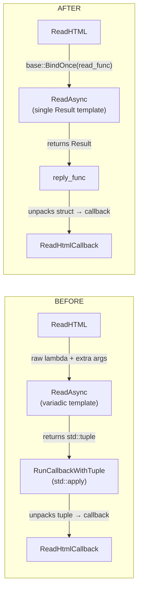

# Review Summary: CL 7565599 — [Clipboard][Windows] Simplify ReadAsync Template

**CL URL:** https://chromium-review.googlesource.com/c/chromium/src/+/7565599
**Author:** Hewro Hewei (ihewro@chromium.org)
**Reviewer:** Dana Fried (dfried@chromium.org) — Code-Review +1
**Status:** NEW (approved by Dana, pending +1 from Rohan and David)
**Files Changed:** `clipboard_win.cc` (+28/−37), `clipboard_win.h` (+16/−8)

---

## 1. Executive Summary

This CL simplifies the `ClipboardWin::ReadAsync` template method by replacing a variadic, tuple-based return mechanism (`std::tuple`, `std::apply`, `std::invoke_result_t`, `Args&&...`) with a cleaner pattern where `read_func` returns a single typed result object using `base::OnceCallback`. A new `ReadHTMLResult` struct replaces the anonymous tuple for multi-field returns, and the helper function `RunCallbackWithTuple` is removed entirely. The net effect is a 1-line reduction (+44/−45) that significantly improves code clarity, maintainability, and alignment with Chromium callback conventions, with zero behavioral change.

---

## 2. Design Assessment

### Architecture Quality

| Aspect | Rating (1-5) | Comments |
|--------|--------------|----------|
| Clarity | 5 | Single `template <typename Result>` parameter replaces three variadic parameters; `base::OnceCallback` types make the contract self-documenting |
| Maintainability | 5 | Named struct fields (`markup`, `src_url`, etc.) replace anonymous tuple positions; future callers have a clear, simple contract |
| Extensibility | 4 | New async readers need their own `Result` type (or use primitives), which is simpler than the old pattern; the `TODO` signals further cleanup |
| Consistency | 5 | Uses idiomatic Chromium `base::BindOnce`/`base::OnceCallback` patterns throughout; aligns with project conventions |

### Architecture Diagram



**Key changes:**
- `ReadAsync` template: `<ReadTupleFunc, Callback, Args...>` → `<Result>`
- Return type: `std::tuple<...>` → `ReadHTMLResult` struct
- Callback mechanism: `std::apply` unpacking → direct `reply_func.Run(result)`
- Helper `RunCallbackWithTuple`: **removed**
- Added `CHECK(worker_task_runner_)` guard in async path

---

## 3. Implementation Assessment

### Code Quality

| Aspect | Rating (1-5) | Comments |
|--------|--------------|----------|
| Correctness | 5 | Logic is preserved exactly; same `ReadHTMLInternal` call, same callback arguments, same feature-flag branching; CQ dry run passed |
| Efficiency | 4 | Minor: redundant lambda wrapper in async reply path; GURL parsing moved from worker to caller thread (negligible cost) |
| Readability | 5 | Dramatic improvement — named struct, explicit callback types, self-documenting `ReadAsync` contract |
| Test Coverage | 4 | Existing `clipboard_unittest` tests cover `ReadHTML` through abstract interface; no new tests needed for pure refactor |

---

## 4. Key Findings

### Critical Issues (Must Fix)

- None identified. The refactoring is mechanical and preserves all existing behavior.

### Major Issues (Should Fix)

- None identified.

### Minor Issues (Nice to Fix)

1. **Redundant lambda wrapper around `reply_func` in async path** (`clipboard_win.cc`, `ReadAsync` async path ~line 963):
   In the async path, `reply_func` is wrapped in a lambda that simply forwards the call to `reply_func.Run()`. Since `PostTaskAndReplyWithResult` already accepts a `OnceCallback<void(ResultType)>` as its reply parameter — which is exactly the type of `reply_func` — the intermediate lambda adds unnecessary indirection (extra move-construct of both `reply_func` and `Result`). Passing `std::move(reply_func)` directly would be simpler and more consistent with the CL's stated goal of reducing complexity.

2. **GURL construction moved from worker thread to caller thread** (`clipboard_win.cc`, `ReadHTML` ~line 414):
   The old code constructed `GURL(src_url)` inside `read_tuple_func` on the worker thread. The new code constructs it inside `reply_func` on the caller sequence. For typical clipboard HTML, the URL is short and the cost is negligible, but this is a subtle behavioral difference. Consider either storing a `GURL` directly in `ReadHTMLResult::src_url` (to preserve worker-thread parsing) or adding a brief comment noting the intentional change.

### Suggestions (Optional)

1. **Struct formatting in header** (`clipboard_win.h` ~line 131): Add a blank line between the `ReadAsync` declaration and the `ReadHTMLResult` struct for visual separation per Chromium style conventions.

2. **Follow through on TODO**: The `TODO(crbug.com/458194647)` to refactor `ReadHTMLInternal` to return `ReadHTMLResult` directly (instead of out-params) would further simplify the code by eliminating the decomposition in `reply_func`. Consider prioritizing this follow-up.

---

## 5. Test Coverage Analysis

### Existing Tests
- `clipboard_unittest.cc` tests `Clipboard::ReadHTML` through the abstract interface, covering the synchronous path (default with `kNonBlockingOsClipboardReads` disabled).
- CQ dry run (Patch Set 7) passed successfully, confirming no build or test failures across platforms.

### Missing Tests
- Explicit tests for the async path (with `kNonBlockingOsClipboardReads` enabled via `base::test::ScopedFeatureList`) are not visible in the CL. These may exist elsewhere.
- No unit test specifically exercises the `CHECK(worker_task_runner_)` guard behavior.

### Recommendation
No new tests are required for this pure refactor. Existing coverage through the `Clipboard` interface is sufficient. The reviewer (Dana Fried) approved without requesting additional tests.

---

## 6. Security Considerations

- **No new attack surface.** All changes are internal to `ClipboardWin`; the public `Clipboard` interface is untouched.
- **Improved robustness.** The added `CHECK(worker_task_runner_)` provides a clear crash signature instead of a null-pointer dereference if the task runner is unexpectedly null in the async path.
- **Thread safety confirmed.** `ReadHTMLResult` contains only value-semantic types (`std::u16string`, `std::string`, `uint32_t`) — all safely movable across threads. `ClipboardBuffer` (bound via `base::BindOnce`) is a trivially copyable enum class.
- **No IPC/Mojo involved.** This is entirely within the browser process.

---

## 7. Performance Considerations

- **Neutral to slightly positive.** The `std::tuple` + `std::apply` machinery involved additional template instantiation overhead and an intermediate lambda for argument forwarding. The new code eliminates that layer.
- **Runtime impact: negligible.** This is clipboard I/O code, not a hot path. The minor difference from moving GURL construction to the caller thread is inconsequential for typical clipboard URLs.
- **No benchmarking needed.** The changes are purely structural with no algorithmic differences.

---

## 8. Final Recommendation

**Verdict**: APPROVED_WITH_COMMENTS

**Rationale:**
This is a well-motivated, well-executed refactoring that meaningfully reduces template complexity while preserving correctness. The CL replaces a hard-to-read variadic template + tuple unpacking pattern with clear, idiomatic Chromium callback types and a named result struct. The CQ dry run passed, the existing reviewer (Dana Fried) gave CR+1, and no behavioral regressions are introduced. The two minor issues identified (redundant reply lambda, GURL construction location) are low-risk and can be addressed in this CL or as follow-ups.

**Action Items for Author:**
1. **Consider removing the redundant lambda wrapper** in the async path of `ReadAsync` by passing `std::move(reply_func)` directly to `PostTaskAndReplyWithResult`. This further simplifies the code in line with the CL's stated goal.
2. **Consider the GURL construction location change** — either store `GURL` in `ReadHTMLResult` to preserve worker-thread parsing, or add a brief comment noting the intentional move to the caller thread.

---

## 9. Comments for Gerrit

### File: `ui/base/clipboard/clipboard_win.cc` — `ReadAsync` async path (~line 963)

**Comment:**
> Nit: The reply callback wrapping lambda appears redundant — it simply forwards `result` to `reply_func`, which is already a `base::OnceCallback<void(Result)>`. Since `PostTaskAndReplyWithResult` accepts that type directly, you could simplify to:
> ```cpp
> worker_task_runner_->PostTaskAndReplyWithResult(
>     FROM_HERE,
>     base::BindOnce(std::move(read_func), /*owner_window=*/nullptr),
>     std::move(reply_func));
> ```
> This removes one layer of indirection and is consistent with the simplification goal of this CL.

### File: `ui/base/clipboard/clipboard_win.cc` — `ReadHTML` (~line 414)

**Comment:**
> Minor observation: In the old code, `GURL(src_url)` was constructed on the worker thread (inside `read_tuple_func`). In the new code, it's constructed on the caller thread (inside `reply_func`). For typical clipboard URLs this is negligible, but it's a subtle behavioral difference. Consider either storing a `GURL` in `ReadHTMLResult::src_url` to preserve the original threading behavior, or adding a brief comment noting this was intentional.

### File: `/PATCHSET_LEVEL`

**Comment:**
> Nice cleanup! The simplification from variadic template + tuple unpacking to a single `Result` type with `base::OnceCallback` is a clear readability win. The `ReadHTMLResult` struct and the added `CHECK(worker_task_runner_)` are good additions.
>
> Two minor suggestions inline (redundant reply lambda wrapper, GURL construction location) — neither is blocking.
