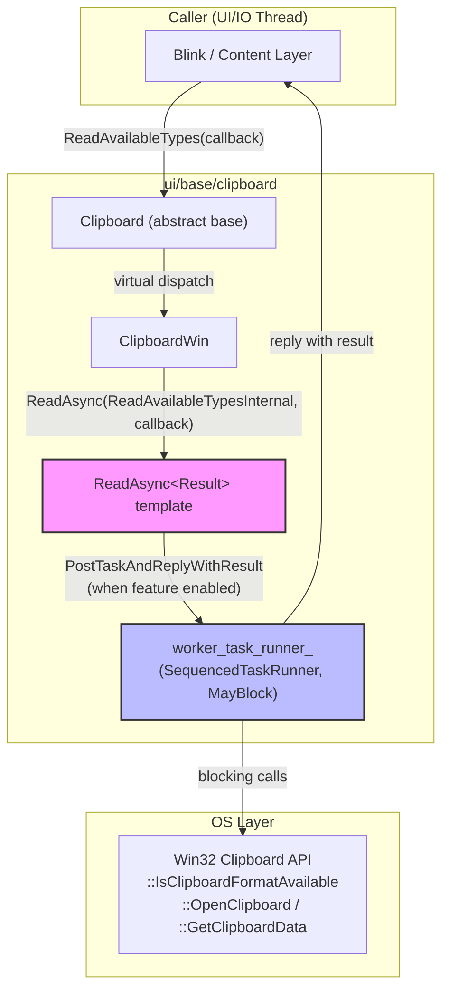
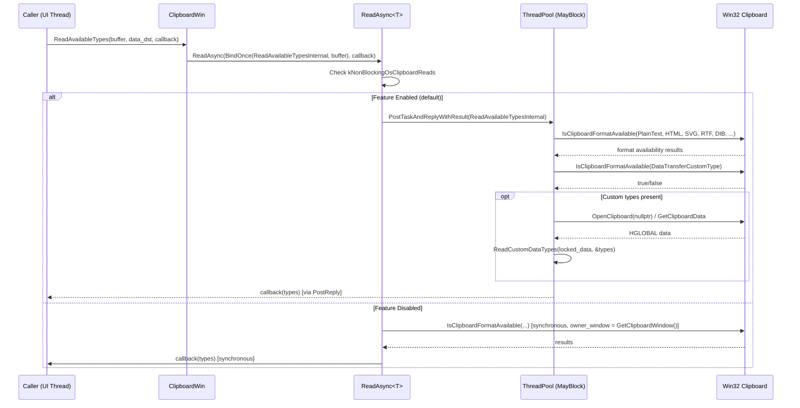
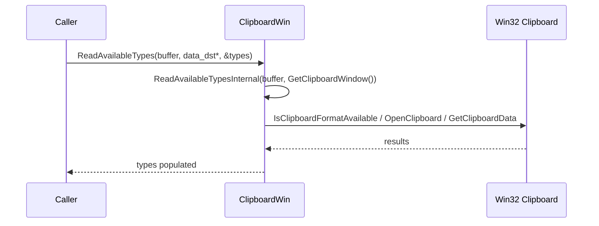

# High-Level Design: [Clipboard][Windows] Use async ReadAvailableTypes with ThreadPool offloading

**CL:** [7574178](https://chromium-review.googlesource.com/c/chromium/src/+/7574178)
**Author:** Hewro Hewei (ihewro@chromium.org)
**Status:** NEW (Patch Set 10)

---

## 1. Executive Summary

This CL adds an asynchronous override of `ReadAvailableTypes` to `ClipboardWin`, following the same `ReadAsync` + ThreadPool offloading pattern already used for `ReadText`, `ReadAsciiText`, `ReadHTML`, and `ReadFilenames`. When the `kNonBlockingOsClipboardReads` feature flag is enabled (currently `FEATURE_ENABLED_BY_DEFAULT`), the Win32 clipboard interrogation calls—`::IsClipboardFormatAvailable`, `ScopedClipboard::Acquire`, and `GetClipboardDataWithLimit`—are executed on a `MayBlock` sequenced ThreadPool runner instead of blocking the caller (typically the UI/IO thread). This prevents potential UI jank caused by the OS clipboard lock or slow clipboard data providers, and brings `ReadAvailableTypes` into parity with the other read operations that have already been migrated.

---

## 2. Architecture Overview

### Affected Components

| Component | Path | Role |
|---|---|---|
| `ClipboardWin` | `ui/base/clipboard/clipboard_win.{h,cc}` | Windows platform clipboard implementation |
| `Clipboard` (base) | `ui/base/clipboard/clipboard.h` | Abstract clipboard interface with virtual `ReadAvailableTypes` |
| Feature flags | `ui/base/ui_base_features.{h,cc}` | `kNonBlockingOsClipboardReads` gate |
| Unit tests | `ui/base/clipboard/clipboard_win_unittest.cc` | Platform-specific clipboard tests |

### How It Fits Into the Existing Architecture

`ClipboardWin` inherits from `Clipboard`, which defines two overloads of `ReadAvailableTypes`:

1. **Sync (deprecated):** `ReadAvailableTypes(buffer, raw_ptr, out_vector*)` — synchronous, blocking.
2. **Async (callback-based):** `ReadAvailableTypes(buffer, optional<DTE>&, callback)` — the base class default implementation calls the sync overload and posts the result.

Before this CL, `ClipboardWin` only overrode the sync version. The async version fell through to the base class default, which simply called the sync overload on the same thread—no actual offloading occurred. This CL overrides the async version to use the `ReadAsync` template, routing the blocking work to the ThreadPool.

### Component Diagram

---

## 3. Design Goals & Non-Goals

### Goals

| # | Goal |
|---|---|
| G1 | Move `ReadAvailableTypes` blocking Win32 calls off the caller thread to a ThreadPool `MayBlock` task runner |
| G2 | Follow the established `ReadAsync` pattern already used by `ReadText`, `ReadAsciiText`, `ReadHTML`, `ReadFilenames` |
| G3 | Maintain backward compatibility: the synchronous `ReadAvailableTypes` overload continues to work unchanged |
| G4 | Refactor `IsFormatAvailable` and `GetStandardFormats` into static `*Internal` helper methods so they are callable from the ThreadPool (no `this` pointer / `const` instance method dependency) |

### Non-Goals

| # | Non-Goal |
|---|---|
| NG1 | Migrating other remaining synchronous read methods (e.g., `ReadSvg`, `ReadRTF`, `ReadData`, `ReadBookmark`, `ReadPng`) — these are handled in separate CLs |
| NG2 | Removing the synchronous `ReadAvailableTypes` overload (it is deprecated but still called by some code paths) |
| NG3 | Changing the feature flag `kNonBlockingOsClipboardReads` default state |
| NG4 | Cross-platform async clipboard changes (this is Windows-only) |

---

## 4. System Interactions

### Sequence Diagram — Async Path (Feature Enabled)

### Sequence Diagram — Sync Path (Deprecated, Unchanged)

### IPC / Mojo Interactions

This CL does not directly modify any IPC or Mojo interfaces. However, `ReadAvailableTypes` is called from `content::ClipboardHostImpl` over Mojo (`blink.mojom.ClipboardHost`), which brokers clipboard access from renderer processes. The async callback-based flow naturally integrates with the Mojo reply callback pattern, making the ThreadPool offloading transparent to callers.

---

## 5. API & Interface Changes

### New Public/Override Methods

| Method | Signature | Notes |
|---|---|---|
| `ClipboardWin::ReadAvailableTypes` (async) | `void ReadAvailableTypes(ClipboardBuffer, const std::optional<DataTransferEndpoint>&, ReadAvailableTypesCallback) const override` | New override in `clipboard_win.h` ([L66-68](/workspace/cr1/src/ui/base/clipboard/clipboard_win.h#L66)). Previously fell through to base class default. |

### New Private Static Methods

| Method | Signature | Notes |
|---|---|---|
| `ReadAvailableTypesInternal` | `static std::vector<std::u16string> ReadAvailableTypesInternal(ClipboardBuffer, HWND)` | Core logic extracted from old sync `ReadAvailableTypes`. Callable from ThreadPool. ([L147-149](/workspace/cr1/src/ui/base/clipboard/clipboard_win.h#L147)) |
| `GetStandardFormatsInternal` | `static std::vector<std::u16string> GetStandardFormatsInternal(ClipboardBuffer)` | Extracted from `GetStandardFormats`. Static so it's ThreadPool-safe. ([L150-151](/workspace/cr1/src/ui/base/clipboard/clipboard_win.h#L150)) |
| `IsFormatAvailableInternal` | `static bool IsFormatAvailableInternal(const ClipboardFormatType&, ClipboardBuffer)` | Extracted from `IsFormatAvailable`. Static so it's ThreadPool-safe. ([L152-153](/workspace/cr1/src/ui/base/clipboard/clipboard_win.h#L152)) |

### Modified Methods

| Method | Change |
|---|---|
| `IsFormatAvailable` | Now delegates to `IsFormatAvailableInternal`. The instance method becomes a thin wrapper. ([clipboard_win.cc L331-336](/workspace/cr1/src/ui/base/clipboard/clipboard_win.cc#L331)) |
| `GetStandardFormats` | Now delegates to `GetStandardFormatsInternal`. The instance method becomes a thin wrapper. ([clipboard_win.cc L379-383](/workspace/cr1/src/ui/base/clipboard/clipboard_win.cc#L379)) |
| `ReadAvailableTypes` (sync) | Body replaced: now calls `ReadAvailableTypesInternal(buffer, GetClipboardWindow())` instead of inlining the logic. `DCHECK(types)` upgraded to `CHECK(types)`. ([clipboard_win.cc L475-483](/workspace/cr1/src/ui/base/clipboard/clipboard_win.cc#L475)) |

### Deprecated Interfaces

No interfaces are newly deprecated. The sync `ReadAvailableTypes(buffer, raw_ptr, out_vector*)` was already deprecated upstream (see `crbug.com/443355`).

---

## 6. Dependencies

### What This Code Depends On

| Dependency | Purpose |
|---|---|
| `base::ThreadPool::CreateSequencedTaskRunner` | Creates the `MayBlock` worker runner during `ClipboardWin` construction |
| `base::FeatureList` / `features::kNonBlockingOsClipboardReads` | Feature gate controlling async vs sync behavior ([ui_base_features.cc L409](/workspace/cr1/src/ui/base/ui_base_features.cc#L409)) |
| `ReadAsync<Result>` template | Generic helper for posting work and replying ([clipboard_win.cc L1044-1058](/workspace/cr1/src/ui/base/clipboard/clipboard_win.cc#L1044)) |
| Win32 API: `::IsClipboardFormatAvailable`, `::OpenClipboard`, `::GetClipboardData` | OS clipboard access |
| `ScopedClipboard` | RAII wrapper for `::OpenClipboard` / `::CloseClipboard` |
| `ClipboardFormatType` | Clipboard format identifiers |
| `ReadCustomDataTypes` | Parses pickled custom MIME types from `DataTransferCustomType` |

### What Depends On This Code

| Dependent | Impact |
|---|---|
| `content::ClipboardHostImpl` | Calls `ReadAvailableTypes` to service Mojo `blink.mojom.ClipboardHost.ReadAvailableTypes` requests from renderers. Gains async ThreadPool offloading transparently. |
| `blink::SystemClipboard` | Calls through `ClipboardHost` Mojo; indirectly benefits. |
| Any caller using the async `Clipboard::ReadAvailableTypes(callback)` API | Previously ran synchronously (base class default); now runs on ThreadPool when feature is enabled. |

### Version/Compatibility

- No new build dependencies or third-party library changes.
- The feature flag `kNonBlockingOsClipboardReads` is already `FEATURE_ENABLED_BY_DEFAULT`, so this behavior is on by default.
- The sync API path is fully preserved for any callers that still use the deprecated raw-pointer overload.

---

## 7. Risks & Mitigations

| # | Risk | Severity | Mitigation |
|---|---|---|---|
| R1 | **Race with clipboard owner window:** When `kNonBlockingOsClipboardReads` is enabled, `ReadAvailableTypesInternal` is called with `owner_window = nullptr`. If the OS requires a valid HWND for `OpenClipboard`, the call may fail. | Medium | This is the **same behavior** already in production for `ReadText`, `ReadAsciiText`, `ReadHTML`, and `ReadFilenames`. Passing `nullptr` to `::OpenClipboard` is valid Win32 API usage (it means "no owner"). The existing pattern has shipped without regressions. |
| R2 | **Thread safety of static helpers:** `IsFormatAvailableInternal` and `GetStandardFormatsInternal` call `::IsClipboardFormatAvailable`, which is a thread-safe Win32 API. `ReadAvailableTypesInternal` calls `::OpenClipboard` and `::GetClipboardData`, which are per-thread (clipboard ownership is per-thread). | Low | The `worker_task_runner_` is a **sequenced** task runner, so only one read runs at a time. No concurrent clipboard access from the worker thread. |
| R3 | **Behavioral change for existing async callers:** Before this CL, the base class default `ReadAvailableTypes(callback)` called the sync version on the same thread. Now it posts to a ThreadPool. Callers that assumed synchronous completion may break. | Low | The callback-based API contract is inherently asynchronous; callers should not depend on synchronous completion. This matches the behavior of all other async clipboard reads on Windows. |
| R4 | **`CHECK(types)` upgrade:** The sync `ReadAvailableTypes` changes `DCHECK(types)` to `CHECK(types)`. If any caller passes `nullptr`, this will crash in release builds. | Very Low | Passing `nullptr` for an out-param is a programming error. `CHECK` is the correct severity per Chromium coding guidelines. |
| R5 | **Feature flag rollback path:** If `kNonBlockingOsClipboardReads` is disabled, the code falls back to synchronous execution, same as before. | N/A | Built-in fallback via the `ReadAsync` template's feature check. |

### Backward Compatibility

- **Fully backward compatible.** The sync API (`ReadAvailableTypes(buffer, raw_ptr, out_vector*)`) is untouched in its external behavior—it still blocks and returns results inline.
- No migration needed for callers. The async path is an override of a virtual method with a default base-class implementation.

---

## 8. Testing Strategy

### New Tests Added

| Test | File | Description |
|---|---|---|
| `ReadAvailableTypesAsyncReturnsWrittenData` | [clipboard_win_unittest.cc L377-391](/workspace/cr1/src/ui/base/clipboard/clipboard_win_unittest.cc#L377) | Writes text to clipboard, then verifies async `ReadAvailableTypes` returns `kMimeTypePlainText16` in the result vector. |
| `ReadAvailableTypesAsyncEmptyClipboard` | [clipboard_win_unittest.cc L393-402](/workspace/cr1/src/ui/base/clipboard/clipboard_win_unittest.cc#L393) | Clears clipboard, then verifies async `ReadAvailableTypes` returns an empty vector. |
| `NoDataChangedNotificationOnRead` (extended) | [clipboard_win_unittest.cc L102-106](/workspace/cr1/src/ui/base/clipboard/clipboard_win_unittest.cc#L102) | Existing test extended to verify async `ReadAvailableTypes` does not trigger clipboard change notifications. |

### Test Patterns Used

- **`base::test::TestFuture`** — waits for async callback completion in unit tests without manual `RunLoop` management.
- **`ScopedClipboardWriter`** — sets up clipboard state for read verification.
- Tests cover both the populated-clipboard and empty-clipboard cases.

### Coverage Assessment

| Scenario | Covered? |
|---|---|
| Async read with data present | ✅ |
| Async read with empty clipboard | ✅ |
| Async read does not fire change notifications | ✅ |
| Sync read still works (regression) | ✅ (existing test at L98-100) |
| Custom `DataTransferCustomType` types | ❌ Not explicitly tested in new tests (but covered by existing sync tests) |
| Feature flag disabled (sync fallback) | ❌ Not explicitly tested with parameterized feature state |

### Suggested Additional Test Coverage

- A parameterized test varying `kNonBlockingOsClipboardReads` enabled/disabled to ensure both paths are exercised.
- A test writing custom `DataTransferCustomType` data and verifying async `ReadAvailableTypes` returns the custom MIME types.

---

## Appendix: File Change Summary

| File | Lines Changed | Key Changes |
|---|---|---|
| `clipboard_win.h` | +10 | Declare async `ReadAvailableTypes` override; declare `ReadAvailableTypesInternal`, `GetStandardFormatsInternal`, `IsFormatAvailableInternal` static methods |
| `clipboard_win.cc` | +38/-9 | Add async `ReadAvailableTypes` override calling `ReadAsync`; extract `IsFormatAvailableInternal`, `GetStandardFormatsInternal`, `ReadAvailableTypesInternal` as static methods; refactor sync `ReadAvailableTypes` to delegate to `ReadAvailableTypesInternal` |
| `clipboard_win_unittest.cc` | +34 | Add `ReadAvailableTypesAsyncReturnsWrittenData`, `ReadAvailableTypesAsyncEmptyClipboard` tests; extend `NoDataChangedNotificationOnRead` test |
