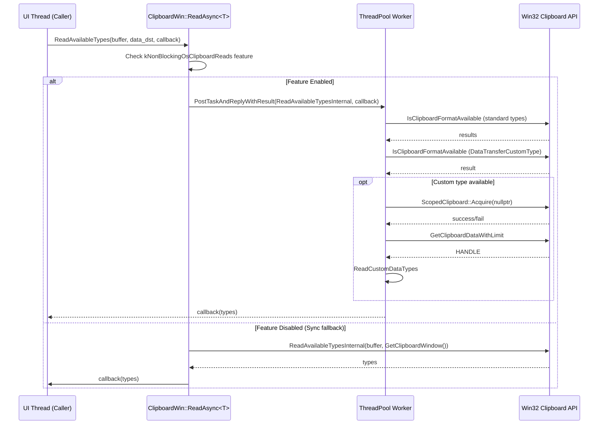
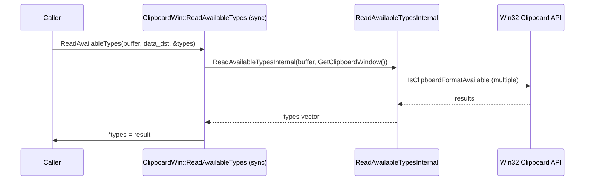
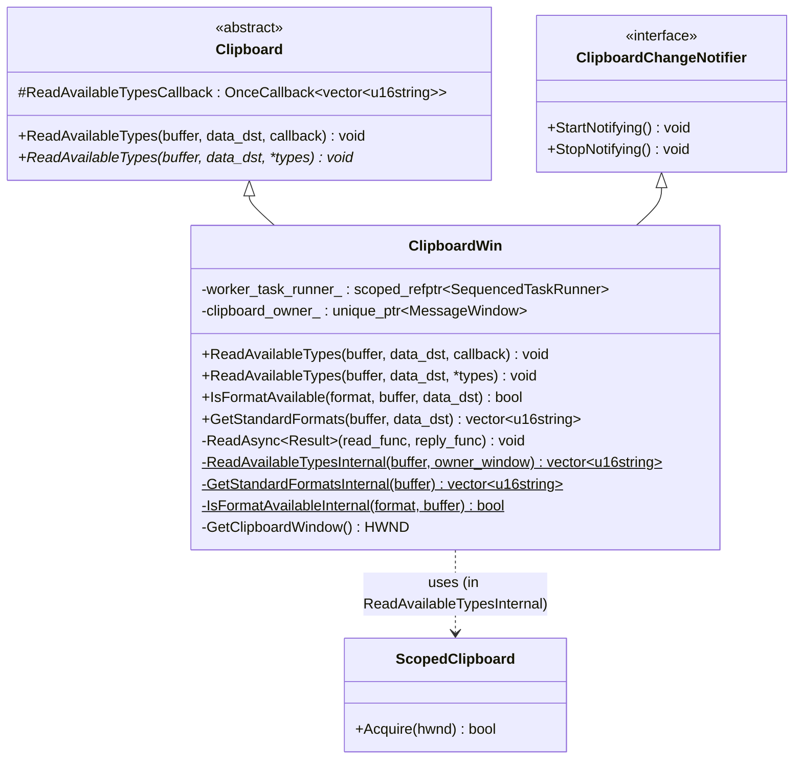
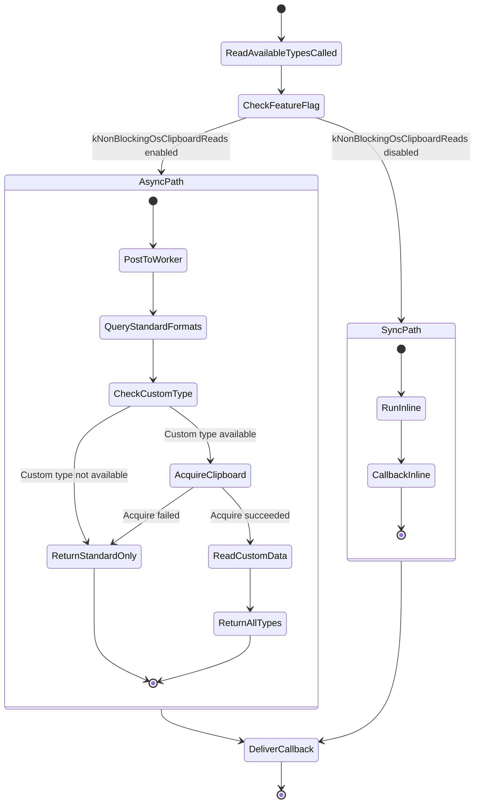

# Low-Level Design: CL 7574178

## [Clipboard][Windows] Use async ReadAvailableTypes with ThreadPool offloading

**CL URL:** https://chromium-review.googlesource.com/c/chromium/src/+/7574178
**Owner:** Hewro Hewei (ihewro@chromium.org)
**Status:** NEW
**Files Changed:** 3 (+82/−9)

---

## 1. File-by-File Analysis

### 1.1 `ui/base/clipboard/clipboard_win.cc` (+38/−9)

**Purpose of changes:**
Adds an async override of `ReadAvailableTypes` that offloads blocking Win32 clipboard I/O to a ThreadPool sequenced task runner (via the existing `ReadAsync` template). The previously monolithic `ReadAvailableTypes` (sync) and `GetStandardFormats`/`IsFormatAvailable` methods are refactored to extract static internal helpers that can be called from both the sync path and the new async (threadpool-offloaded) path.

**Key modifications:**

1. **Extracted `IsFormatAvailableInternal` (static):** The instance method `IsFormatAvailable()` now delegates to a new `static` helper `IsFormatAvailableInternal(format, buffer)`, decoupling the logic from the `this` pointer so it can be invoked from a worker thread.

2. **Extracted `GetStandardFormatsInternal` (static):** Similarly, `GetStandardFormats()` now delegates to `GetStandardFormatsInternal(buffer)` — a static method that queries Win32 `::IsClipboardFormatAvailable` for each standard MIME type.

3. **Added async `ReadAvailableTypes` override:** New override accepting `std::optional<DataTransferEndpoint>&` + callback. Uses the existing `ReadAsync` template to post `ReadAvailableTypesInternal` onto `worker_task_runner_` (when `kNonBlockingOsClipboardReads` is enabled) and deliver the result via callback on the caller sequence.

4. **Added `ReadAvailableTypesInternal` (static):** Contains the merged logic from the old sync `ReadAvailableTypes`:
   - Gets standard formats via `GetStandardFormatsInternal`.
   - Checks for `DataTransferCustomType` via `IsFormatAvailableInternal`.
   - Acquires clipboard via `ScopedClipboard::Acquire(owner_window)`.
   - Reads custom data types into the vector and returns it.

5. **Refactored sync `ReadAvailableTypes`:** The old sync overload now simply calls `ReadAvailableTypesInternal(buffer, GetClipboardWindow())`, keeping the sync path functional.

6. **`DCHECK` → `CHECK` upgrade:** `DCHECK(types)` changed to `CHECK(types)` in the sync `ReadAvailableTypes` overload, consistent with Chromium's move toward production-safe checks.

**New/Modified Functions:**

| Function | Purpose | Parameters | Returns |
|----------|---------|------------|---------|
| `IsFormatAvailableInternal` (static) | Check if a clipboard format is available via Win32 API | `const ClipboardFormatType& format, ClipboardBuffer buffer` | `bool` |
| `GetStandardFormatsInternal` (static) | Query standard MIME types from Win32 clipboard | `ClipboardBuffer buffer` | `std::vector<std::u16string>` |
| `ReadAvailableTypes` (async override) | Async entry point — posts work to ThreadPool | `ClipboardBuffer, const std::optional<DataTransferEndpoint>&, ReadAvailableTypesCallback` | `void` |
| `ReadAvailableTypesInternal` (static) | Core logic: reads standard + custom types from clipboard | `ClipboardBuffer buffer, HWND owner_window` | `std::vector<std::u16string>` |
| `IsFormatAvailable` (modified) | Now delegates to `IsFormatAvailableInternal` | unchanged | `bool` |
| `GetStandardFormats` (modified) | Now delegates to `GetStandardFormatsInternal` | unchanged | `std::vector<std::u16string>` |
| `ReadAvailableTypes` (sync, modified) | Now delegates to `ReadAvailableTypesInternal` | unchanged | `void` |

**Data Flow (Async Path):**



**Data Flow (Sync Path — unchanged semantics):**



---

### 1.2 `ui/base/clipboard/clipboard_win.h` (+10/−0)

**Purpose of changes:**
Declares the new async `ReadAvailableTypes` override and the three new static internal helper methods.

**Key modifications:**

1. **`ReadAvailableTypes` async override declaration** (line 66–68): Added alongside existing async overrides (`ReadText`, `ReadAsciiText`, etc.) in the `// Clipboard overrides` section.

2. **Three static internal helper declarations** (lines 147–153):
   - `ReadAvailableTypesInternal(ClipboardBuffer, HWND)` → returns `std::vector<std::u16string>`
   - `GetStandardFormatsInternal(ClipboardBuffer)` → returns `std::vector<std::u16string>`
   - `IsFormatAvailableInternal(const ClipboardFormatType&, ClipboardBuffer)` → returns `bool`

**New/Modified Functions:**

| Function | Visibility | Static | Purpose |
|----------|-----------|--------|---------|
| `ReadAvailableTypes` (callback) | `private` (override) | No | Async override for clipboard type enumeration |
| `ReadAvailableTypesInternal` | `private` | Yes | Threadpool-safe implementation |
| `GetStandardFormatsInternal` | `private` | Yes | Threadpool-safe standard format query |
| `IsFormatAvailableInternal` | `private` | Yes | Threadpool-safe format availability check |

---

### 1.3 `ui/base/clipboard/clipboard_win_unittest.cc` (+34/−0)

**Purpose of changes:**
Adds unit tests for the new async `ReadAvailableTypes` path, following the established pattern of existing async read tests in this file.

**Key modifications:**

1. **New `#include`:** Added `"ui/base/clipboard/clipboard_constants.h"` for `kMimeTypePlainText16`.

2. **Extended `NoDataChangedNotificationOnRead` test** (lines 102–106): Added async `ReadAvailableTypes` call to verify it does not trigger a data-changed notification, mirroring existing assertions for the sync overload.

3. **New test `ReadAvailableTypesAsyncReturnsWrittenData`** (lines 377–391):
   - Writes text to clipboard via `ScopedClipboardWriter`.
   - Calls async `ReadAvailableTypes` with `TestFuture`.
   - Asserts returned types contain `kMimeTypePlainText16`.

4. **New test `ReadAvailableTypesAsyncEmptyClipboard`** (lines 393–402):
   - Clears clipboard.
   - Calls async `ReadAvailableTypes` with `TestFuture`.
   - Asserts returned types vector is empty.

**Test Coverage:**

| Test | Scenario | Assertion |
|------|----------|-----------|
| `NoDataChangedNotificationOnRead` (extended) | Async read on empty clipboard | `data_changed_count() == 0` |
| `ReadAvailableTypesAsyncReturnsWrittenData` | Write text → async read types | Types contains `text/plain` |
| `ReadAvailableTypesAsyncEmptyClipboard` | Clear → async read types | Types vector is empty |

---

## 2. Class Diagram



---

## 3. State Diagram



---

## 4. Implementation Concerns

### 4.1 Thread Safety

- **Static methods accessing Win32 APIs:** The new static helpers (`IsFormatAvailableInternal`, `GetStandardFormatsInternal`, `ReadAvailableTypesInternal`) call Win32 clipboard APIs (`::IsClipboardFormatAvailable`, `ScopedClipboard::Acquire`). These Win32 APIs are inherently thread-safe in that they operate on system-global state, but concurrent calls may race with clipboard mutations from other processes. This is acceptable because clipboard reads are inherently racy on Windows — a consistent snapshot is not guaranteed without `OpenClipboard`.

- **`owner_window = nullptr` on ThreadPool:** When `kNonBlockingOsClipboardReads` is enabled, `ReadAvailableTypesInternal` is called with `owner_window = nullptr`. This means `ScopedClipboard::Acquire(nullptr)` is called, which calls `OpenClipboard(NULL)`. Per Win32 docs, passing `NULL` to `OpenClipboard` associates the clipboard with the current task — this is valid but means no window owns the clipboard during the read, which is the intended behavior for the thread-pool path. This is consistent with how the other async read methods (`ReadTextInternal`, `ReadAsciiTextInternal`) handle the `owner_window` parameter.

- **No `this` capture in static methods:** The static methods do not capture `this`, which is correct since the `ClipboardWin` instance may not be accessible from the worker thread. All state needed is passed via parameters.

### 4.2 Memory Management

- **Return-by-value:** `ReadAvailableTypesInternal` returns `std::vector<std::u16string>` by value. With move semantics and NRVO, this is efficient and avoids lifetime issues with pointers across threads.

- **`ScopedHGlobal` and `ScopedClipboard`:** RAII wrappers ensure proper cleanup of global memory locks and clipboard handles, preventing resource leaks on any early-return path.

### 4.3 Performance

- **Positive impact:** Moving `ReadAvailableTypes` off the UI thread is the primary goal. The Win32 clipboard API can block (e.g., when another application holds the clipboard open), so offloading to a `MayBlock` ThreadPool runner prevents UI jank.

- **Multiple `IsClipboardFormatAvailable` calls:** `GetStandardFormatsInternal` calls `::IsClipboardFormatAvailable` 6+ times without holding the clipboard open. Each call is a quick Win32 API check, but they collectively form a non-atomic snapshot. Between calls, the clipboard content could change. This was already the existing behavior and is consistent with the non-atomic nature of `::IsClipboardFormatAvailable`.

- **Double format check for `DataTransferCustomType`:** `ReadAvailableTypesInternal` first checks `IsFormatAvailableInternal(DataTransferCustomType)` and then acquires the clipboard. Between the check and the acquire, the custom type could disappear — but this is guarded by the `if (!hdata)` check after acquisition.

### 4.4 Maintainability

- **Consistent pattern:** The implementation follows the exact same pattern as `ReadTextInternal`, `ReadAsciiTextInternal`, `ReadFilenamesInternal`, etc. — making it easy for future developers to understand and extend.

- **`DCHECK` → `CHECK` upgrade:** The change from `DCHECK(types)` to `CHECK(types)` in the sync overload is a minor hardening improvement, ensuring null-pointer dereference is caught in production builds.

---

## 5. Suggestions for Improvement

### 5.1 Missing Blank Line Before `ReadAvailableTypes` Async Override (Style)

In `clipboard_win.cc` at line 432, the async `ReadAvailableTypes` is placed immediately after `ReadAsciiText` without a preceding comment block. Other async methods in the file have a `// |data_dst| is not used...` comment. Adding one would maintain consistency:

```cpp
// |data_dst| is not used. It's only passed to be consistent with other
// platforms.
void ClipboardWin::ReadAvailableTypes(
    ClipboardBuffer buffer,
    const std::optional<DataTransferEndpoint>& data_dst,
    ReadAvailableTypesCallback callback) const {
```

### 5.2 Alignment Issue in Header Declaration

In `clipboard_win.h` line 153, the second parameter of `IsFormatAvailableInternal` has an extra space for alignment:

```cpp
  static bool IsFormatAvailableInternal(const ClipboardFormatType& format,
                                         ClipboardBuffer buffer);
```

The double-space before `ClipboardBuffer` appears to be an alignment attempt but is slightly off from the typical Chromium style of aligning to the opening parenthesis. It should be:

```cpp
  static bool IsFormatAvailableInternal(const ClipboardFormatType& format,
                                        ClipboardBuffer buffer);
```

(One fewer space — aligns with the `c` in `const` on the line above.)

### 5.3 Test Coverage Gaps

The new tests cover the basic happy path (text written → read types) and the empty clipboard case. Consider adding tests for:

- **Multiple types written:** Write text + HTML + image, verify all expected MIME types appear in the result.
- **Custom data types:** Write `DataTransferCustomType` data and verify custom types appear in the async result.
- **Concurrent read/write:** Stress test to ensure no crashes when async reads overlap with writes (though this may be better suited for integration tests).

### 5.4 `data_dst` Parameter Is Unused

The `data_dst` parameter in the async `ReadAvailableTypes` override is not used (consistent with other methods), but no `[[maybe_unused]]` annotation or comment explains this. While this is consistent with the existing codebase pattern, it would be cleaner to document it with the standard comment:

```cpp
// |data_dst| is not used. It's only passed to be consistent with other
// platforms.
```

### 5.5 Consider Consolidating Sync Path

The sync `ReadAvailableTypes(buffer, data_dst, *types)` now simply delegates to `ReadAvailableTypesInternal(buffer, GetClipboardWindow())`. The base class `Clipboard::ReadAvailableTypes(buffer, optional_data_dst, callback)` default implementation calls the sync overload. With the new async override in `ClipboardWin`, the sync path is only used by callers that explicitly use the raw-pointer `data_dst` overload. As the codebase migrates toward async APIs, the sync overload may become dead code and could eventually be removed.

---

## 6. Summary

This CL is a well-structured, incremental step in the ongoing effort to make clipboard reads non-blocking on Windows. It follows the established `ReadAsync` pattern precisely, extracts the right pieces into static helper methods, and adds appropriate test coverage. The implementation is thread-safe, uses proper RAII, and maintains backward compatibility through the sync path delegation. The main areas for improvement are minor style issues and expanding test coverage for multi-type and custom-type scenarios.
