# High-Level Design: CL 7578053

## [clipboard][Windows] Make ReadPng non-blocking and refactor internals

**CL URL:** https://chromium-review.googlesource.com/c/chromium/src/+/7578053
**Author:** Hewro Hewei (ihewro@chromium.org)
**Bug:** [458194647](https://crbug.com/458194647)

---

## 1. Executive Summary

This CL makes the `ClipboardWin::ReadPng` operation non-blocking on Windows by routing it through the existing `ReadAsync` infrastructure when the `kNonBlockingOsClipboardReads` feature flag is enabled. Previously, `ReadPng` was the only async-callback-based clipboard read method on Windows that still performed clipboard access synchronously on the calling (UI) thread. The change refactors the internal helpers (`ReadPngInternal`, `ReadBitmapInternal`) into `static` methods that accept an `HWND owner_window` parameter—consistent with all other `Read*Internal` methods—and introduces a new `ReadPngTypeDataInternal` helper to separate raw PNG data reading from the full PNG-with-bitmap-fallback logic. This eliminates a potential source of UI thread jank when reading image data from the OS clipboard.

---

## 2. Architecture Overview

### Affected Components

| Component | Location | Impact |
|---|---|---|
| `ClipboardWin` | `ui/base/clipboard/clipboard_win.{h,cc}` | Core change: `ReadPng` path refactored |
| `Clipboard` (base class) | `ui/base/clipboard/clipboard.h` | No change; virtual `ReadPng` interface unchanged |
| `ReadAsync` template | `ui/base/clipboard/clipboard_win.cc` | Template signature generalized (`TaskReturnType` ≠ `ReplyArgType`) |
| Feature flag | `ui/base/ui_base_features.{h,cc}` | `kNonBlockingOsClipboardReads` — already exists, no change |

### Component Diagram

**Legend:** 🟡 Yellow = modified, 🟢 Green = newly introduced.

### How It Fits Into Existing Architecture

The `ClipboardWin` class already had a `ReadAsync` template method used by `ReadText`, `ReadAsciiText`, `ReadAvailableTypes`, `ReadHTML`, and `ReadFilenames` to offload clipboard access to a worker thread. `ReadPng` was the remaining holdout that still did synchronous clipboard I/O even though it already accepted an async callback. This CL brings `ReadPng` into alignment with the other read methods.

---

## 3. Design Goals & Non-Goals

### Goals

1. **Non-blocking PNG reads:** Route `ReadPng` through `ReadAsync` so clipboard access happens on `worker_task_runner_` when `kNonBlockingOsClipboardReads` is enabled, avoiding UI thread jank.
2. **Consistent internal API:** Convert `ReadPngInternal` and `ReadBitmapInternal` to `static` methods taking `HWND owner_window`, matching the convention of `ReadTextInternal`, `ReadAsciiTextInternal`, `ReadFilenamesInternal`, etc.
3. **Consolidate logic:** Move the PNG-read-with-bitmap-fallback logic (previously in `ReadPng`) into `ReadPngInternal` so the same code path is used in both sync and async modes.
4. **Generalize `ReadAsync`:** Introduce a second template parameter (`ReplyArgType`, defaulting to `TaskReturnType`) so the template can bridge `std::vector<uint8_t>` (return type) to `const std::vector<uint8_t>&` (callback parameter type used by `ReadPngCallback`).

### Non-Goals

- **Other platforms:** This CL only affects Windows. No changes to `clipboard_x11.cc`, `clipboard_ozone.cc`, `clipboard_mac.mm`, etc.
- **New feature flag:** No new flags introduced; uses existing `kNonBlockingOsClipboardReads`.
- **Bitmap encoding optimization:** The `EncodeBitmapToPng` fallback is moved into `ReadPngInternal` (running synchronously within the worker task), rather than keeping the prior `PostTaskAndReplyWithResult` two-hop approach. This is a simplification, not a performance optimization of the encoding itself.
- **Other sync-path read methods** (e.g., `ReadRTF`, `ReadData`, `ReadBookmark`) are not converted in this CL.

---

## 4. System Interactions

### Main Flow: Async Path (feature enabled)

```mermaid
sequenceDiagram
    participant Caller as Caller (UI Thread)
    participant CW as ClipboardWin::ReadPng
    participant RA as ReadAsync<vector<uint8_t>, const vector<uint8_t>&>
    participant Worker as Worker Thread (SequencedTaskRunner)
    participant RI as ReadPngInternal (static)
    participant OS as Win32 Clipboard

    Caller->>CW: ReadPng(buffer, data_dst, callback)
    CW->>RA: ReadAsync(BindOnce(ReadPngInternal, buffer, data_dst), callback)
    RA->>RA: Check kNonBlockingOsClipboardReads → enabled
    RA->>Worker: PostTaskAndReplyWithResult(ReadPngInternal, callback)
    Worker->>RI: ReadPngInternal(buffer, data_dst, owner_window=nullptr)
    RI->>OS: ScopedClipboard::Acquire(nullptr)
    RI->>OS: GetClipboardData(PNG format)
    alt PNG data available
        OS-->>RI: PNG bytes
        RI-->>Worker: vector<uint8_t> (PNG)
    else No PNG, fallback to bitmap
        RI->>OS: GetClipboardData(CF_DIB)
        OS-->>RI: DIB data
        RI->>RI: EncodeBitmapToPng(bitmap)
        RI-->>Worker: vector<uint8_t> (encoded PNG)
    end
    Worker-->>Caller: callback(png_data) [via reply on UI thread]
```

### Main Flow: Sync Path (feature disabled / fallback)

```mermaid
sequenceDiagram
    participant Caller as Caller (UI Thread)
    participant CW as ClipboardWin::ReadPng
    participant RPDI as ReadPngTypeDataInternal (static)
    participant RBI as ReadBitmapInternal (static)
    participant TP as ThreadPool
    participant OS as Win32 Clipboard

    Caller->>CW: ReadPng(buffer, data_dst, callback)
    CW->>CW: Check kNonBlockingOsClipboardReads → disabled
    CW->>RPDI: ReadPngTypeDataInternal(buffer, GetClipboardWindow())
    RPDI->>OS: ScopedClipboard::Acquire(hwnd)
    RPDI->>OS: GetClipboardData(PNG format)
    alt PNG data available
        OS-->>RPDI: PNG bytes
        RPDI-->>CW: vector<uint8_t>
        CW-->>Caller: callback(png_data) [sync]
    else No PNG data
        RPDI-->>CW: empty vector
        CW->>RBI: ReadBitmapInternal(buffer, GetClipboardWindow())
        RBI->>OS: GetClipboardData(CF_DIB)
        OS-->>RBI: DIB data
        RBI-->>CW: SkBitmap
        CW->>TP: PostTaskAndReplyWithResult(EncodeBitmapToPng, callback)
        TP-->>Caller: callback(png_data) [async encoding only]
    end
```

### Key Differences Between Paths

| Aspect | Sync Path (flag off) | Async Path (flag on) |
|---|---|---|
| Clipboard access thread | UI thread | Worker thread |
| Bitmap encoding | Separate `PostTaskAndReplyWithResult` | Inline in `ReadPngInternal` on worker |
| `HWND` passed | `GetClipboardWindow()` | `nullptr` |
| Number of thread hops | 1 (for bitmap encoding only) | 1 (entire read + encode) |

---

## 5. API & Interface Changes

### Modified Public Interfaces

**None.** The public `Clipboard::ReadPng` virtual interface is unchanged. Callers continue to use the same callback-based API.

### Modified Internal Interfaces

| Method | Before | After | Notes |
|---|---|---|---|
| `ReadAsync` | `template <typename Result>` | `template <typename TaskReturnType, typename ReplyArgType = TaskReturnType>` | Allows `TaskReturnType = std::vector<uint8_t>` while `ReplyArgType = const std::vector<uint8_t>&` to match `ReadPngCallback` signature |
| `ReadPngInternal` | `std::vector<uint8_t> ReadPngInternal(ClipboardBuffer) const` (instance method) | `static std::vector<uint8_t> ReadPngInternal(ClipboardBuffer, const std::optional<DataTransferEndpoint>&, HWND)` | Made static; takes `owner_window`; now includes bitmap fallback + PNG encoding |
| `ReadBitmapInternal` | `SkBitmap ReadBitmapInternal(ClipboardBuffer) const` (instance method) | `static SkBitmap ReadBitmapInternal(ClipboardBuffer, HWND)` | Made static; takes `owner_window` |

### New Internal Interfaces

| Method | Signature | Purpose |
|---|---|---|
| `ReadPngTypeDataInternal` | `static std::vector<uint8_t> ReadPngTypeDataInternal(ClipboardBuffer, HWND)` | Reads raw PNG-format clipboard data only (no bitmap fallback). Extracted from the old `ReadPngInternal`. |

### Deprecated Interfaces

**None.** The old instance-method signatures of `ReadPngInternal` and `ReadBitmapInternal` are replaced in-place, not deprecated.

---

## 6. Dependencies

### What This Code Depends On

| Dependency | Location | Usage |
|---|---|---|
| `base::FeatureList` / `kNonBlockingOsClipboardReads` | `ui/base/ui_base_features.h` | Feature gate for async vs sync path |
| `base::ThreadPool` / `SequencedTaskRunner` | `base/task/` | Worker thread for async clipboard reads |
| `ScopedClipboard` | `ui/base/clipboard/` | RAII wrapper for Win32 `OpenClipboard`/`CloseClipboard` |
| `clipboard_util::EncodeBitmapToPng` | `ui/base/clipboard/clipboard_util.h` | Bitmap→PNG encoding (now called inline in `ReadPngInternal`) |
| Win32 Clipboard API | OS | `GetClipboardData`, `GlobalLock`, `GlobalSize` |

### What Depends on This Code

| Dependent | Relationship |
|---|---|
| All `Clipboard::ReadPng` callers (Blink, Extensions, DevTools, etc.) | Call through the virtual `ReadPng` interface; transparent to this change |
| `ClipboardWinTest` unit tests | Directly test `ReadPng` behavior (new tests added) |

### Compatibility

- **Feature flag gated:** Behavior is identical to pre-CL when `kNonBlockingOsClipboardReads` is disabled. The flag is currently `FEATURE_ENABLED_BY_DEFAULT` (`ui/base/ui_base_features.cc#L409`).
- **Template default:** `ReplyArgType = TaskReturnType` preserves source compatibility for all existing `ReadAsync` call sites.

---

## 7. Risks & Mitigations

### Risk 1: Bitmap Encoding Now Blocks the Worker Thread

**Before:** In the sync path with bitmap fallback, `EncodeBitmapToPng` was posted to `ThreadPool` as a separate task, keeping the bitmap-encoding CPU work off the UI thread even without the feature flag.

**After (async path):** `ReadPngInternal` calls `EncodeBitmapToPng` synchronously on the worker thread. This is acceptable because:
- The worker thread is specifically for clipboard I/O and has `USER_BLOCKING` priority.
- PNG encoding for typical clipboard bitmaps is fast (< 10ms).
- The UI thread is fully unblocked regardless.

**Mitigation:** The sync fallback path (feature disabled) retains the old `PostTaskAndReplyWithResult` behavior for bitmap encoding.

### Risk 2: `HWND = nullptr` in Async Path

When running on the worker thread, `owner_window` is `nullptr`. `ScopedClipboard::Acquire(nullptr)` calls `OpenClipboard(NULL)`, which associates the clipboard with the calling thread rather than a specific window.

**Mitigation:** This is the established pattern already used by `ReadTextInternal`, `ReadAsciiTextInternal`, `ReadAvailableTypesInternal`, `ReadHTMLInternal`, and `ReadFilenamesInternal`. It is the documented Win32 behavior for background clipboard access.

### Risk 3: Template Type Mismatch

`ReadPngCallback` is `base::OnceCallback<void(const std::vector<uint8_t>&)>` (takes `const ref`), but `ReadPngInternal` returns `std::vector<uint8_t>` (by value). The new `ReplyArgType` template parameter bridges this gap.

**Mitigation:** The default `ReplyArgType = TaskReturnType` ensures all existing call sites are unaffected. Only the `ReadPng` call site uses the explicit second template parameter. `base::PostTaskAndReplyWithResult` handles the value→const-ref binding correctly.

### Risk 4: Race Conditions

Multiple threads accessing the OS clipboard concurrently could theoretically conflict, since `OpenClipboard` is a system-wide lock.

**Mitigation:** `ReadAsync` posts to a single `SequencedTaskRunner`, so only one read operation runs at a time on the worker thread. This serialization prevents concurrent clipboard access from within Chromium.

### Backward Compatibility

- **Full backward compatibility.** The sync fallback path is preserved for when `kNonBlockingOsClipboardReads` is disabled.
- No public API changes; all callers of `Clipboard::ReadPng` are unaffected.
- The feature flag is enabled by default, so the async path is the primary code path.

---

## 8. Testing Strategy

### New Tests Added

Two new unit tests in `ui/base/clipboard/clipboard_win_unittest.cc`:

| Test | Description | Ref |
|---|---|---|
| `ReadPngAsyncReturnsWrittenData` | Writes a bitmap via `ScopedClipboardWriter`, reads it back via `ReadPng` with `TestFuture`, and asserts the PNG data is non-empty. | `clipboard_win_unittest.cc#L404-L417` |
| `ReadPngAsyncEmptyClipboard` | Clears the clipboard, reads via `ReadPng` with `TestFuture`, and asserts the result is empty. | `clipboard_win_unittest.cc#L419-L428` |

### Test Coverage Assessment

| Scenario | Coverage |
|---|---|
| Async path — PNG data present | ✅ Covered (bitmap written → falls back to bitmap→PNG encoding) |
| Async path — Empty clipboard | ✅ Covered |
| Sync fallback path (flag disabled) | ⚠️ Existing tests cover the sync `ReadPng` path; the test fixture enables the feature flag, so sync-off path relies on existing coverage |
| PNG-format data (not bitmap) | ⚠️ Not directly tested (requires writing raw PNG to clipboard, which `ScopedClipboardWriter` doesn't do) |
| Template type bridging (`TaskReturnType` ≠ `ReplyArgType`) | ✅ Implicitly tested by the new `ReadPng` tests |

### Recommended Additional Coverage

- A test with `kNonBlockingOsClipboardReads` disabled to verify the sync fallback still works correctly (parameterized test or `ScopedFeatureList` override).
- A test writing raw PNG clipboard format data to verify `ReadPngTypeDataInternal` returns it directly without bitmap fallback.

---

## Appendix: File-Level Change Summary

### `ui/base/clipboard/clipboard_win.cc` (+42/−10)

- **`ReadPng`** (`L725-L748`): Added feature-flag gate that delegates to `ReadAsync(ReadPngInternal, callback)`. Sync fallback refactored to use `ReadPngTypeDataInternal` and `ReadBitmapInternal` with explicit `HWND`.
- **`ReadAsync`** (`L1077-L1091`): Template parameters renamed from `Result` → `TaskReturnType, ReplyArgType`.
- **`ReadPngInternal`** (`L1093-L1111`): Converted to static. Now contains full PNG-read-with-bitmap-fallback logic (moved from `ReadPng`).
- **`ReadPngTypeDataInternal`** (`L1113-L1135`): **New.** Extracted raw PNG-only reading from old `ReadPngInternal`.
- **`ReadBitmapInternal`** (`L1137-L1160`): Converted to static with `HWND` parameter.

### `ui/base/clipboard/clipboard_win.h` (+10/−5)

- `ReadAsync` template signature updated with two type parameters.
- `ReadPngInternal` → static, new signature with `data_dst` and `owner_window`.
- `ReadPngTypeDataInternal` → **new** static declaration.
- `ReadBitmapInternal` → static, new signature with `owner_window`.

### `ui/base/clipboard/clipboard_win_unittest.cc` (+26/−0)

- Two new tests: `ReadPngAsyncReturnsWrittenData`, `ReadPngAsyncEmptyClipboard`.
