# Hld — Multi-Model Merged Review

> **Models**: claude-opus-4.6-fast, gemini-3-pro-preview, gpt-5.3-codex  
> **Models reporting**: 3/3

---

## 📋 Review by **claude-opus-4.6-fast**

# High-Level Design: [Clipboard][Windows] Make ReadPng Non-Blocking and Refactor Internals

**CL:** [7578053](https://chromium-review.googlesource.com/c/chromium/src/+/7578053)
**Author:** Hewro Hewei (ihewro@chromium.org)
**Bug:** [458194647](https://crbug.com/458194647)
**Status:** NEW (Patch Set 17 — CQ dry run passed)

---

## 1. Executive Summary

This CL makes `ClipboardWin::ReadPng()` non-blocking on Windows by routing it through the existing `ReadAsync()` infrastructure, gated behind the `kNonBlockingOsClipboardReads` feature flag. Previously, `ReadPng()` was the only async-callback-based clipboard read operation on Windows that still performed synchronous OS clipboard access on the calling (UI) thread. This change eliminates that UI-thread blocking by offloading the OS clipboard read to a dedicated `worker_task_runner_` (a sequenced thread-pool task runner), consistent with how `ReadText`, `ReadAsciiText`, `ReadHTML`, `ReadFilenames`, and `ReadAvailableTypes` already work. The internal implementation is refactored: the former `ReadPngInternal()` and `ReadBitmapInternal()` instance methods become static free-threaded functions, and a new `ReadPngTypeDataInternal()` static method is extracted to separate PNG-format reading from bitmap fallback reading. PNG encoding (bitmap → PNG bytes) remains on `base::ThreadPool` rather than the serialized worker runner, preserving concurrency for other clipboard reads.

---

## 2. Architecture Overview

### 2.1 Affected Components

| Component | File(s) | Nature of Change |
|---|---|---|
| **ClipboardWin** | `ui/base/clipboard/clipboard_win.cc`, `clipboard_win.h` | Core implementation change |
| **ClipboardWin unit tests** | `ui/base/clipboard/clipboard_win_unittest.cc` | New test coverage |
| **Feature flag** | `ui/base/ui_base_features.h` (unchanged) | Existing `kNonBlockingOsClipboardReads` flag governs behavior |
| **Clipboard base class** | `ui/base/clipboard/clipboard.h` (unchanged) | Defines `ReadPng()` virtual interface and `ReadPngCallback` |

### 2.2 Architectural Fit

`ClipboardWin` is the Windows platform implementation of the abstract `Clipboard` class. The `kNonBlockingOsClipboardReads` feature flag was introduced to progressively migrate all clipboard read operations from synchronous UI-thread reads to asynchronous worker-thread reads. This CL is the next step in that migration, bringing `ReadPng` in line with the other read methods that already use `ReadAsync()`.

### 2.3 Component Diagram

```mermaid
graph TD
    subgraph "Chromium UI Layer"
        A["Clipboard (abstract base)"]
    end

    subgraph "Windows Platform Implementation"
        B["ClipboardWin"]
        C["ReadAsync&lt;Result&gt;()"]
        D["ReadPngInternal() — static"]
        E["ReadPngTypeDataInternal() — static"]
        F["ReadBitmapInternal() — static"]
    end

    subgraph "Threading Infrastructure"
        G["worker_task_runner_<br/>(SequencedTaskRunner)"]
        H["base::ThreadPool<br/>(for PNG encoding)"]
    end

    subgraph "OS Layer"
        I["Win32 Clipboard API<br/>(OpenClipboard, GetClipboardData)"]
    end

    subgraph "Utilities"
        J["clipboard_util::EncodeBitmapToPng()"]
    end

    A -->|"virtual ReadPng()"| B
    B -->|"delegates to"| C
    C -->|"async path<br/>(feature ON)"| G
    C -->|"sync path<br/>(feature OFF)"| D
    G -->|"runs"| D
    D -->|"tries PNG format"| E
    D -->|"falls back to bitmap"| F
    E -->|"ScopedClipboard::Acquire()"| I
    F -->|"ScopedClipboard::Acquire()"| I
    C -->|"reply callback"| B
    B -->|"if bitmap fallback"| H
    H -->|"runs"| J
    J -->|"PNG bytes"| B

    style B fill:#f9f,stroke:#333,stroke-width:2px
    style D fill:#bbf,stroke:#333,stroke-width:2px
    style E fill:#bbf,stroke:#333,stroke-width:2px
    style F fill:#bbf,stroke:#333,stroke-width:2px
    style C fill:#fbb,stroke:#333,stroke-width:2px
```

---

## 3. Design Goals & Non-Goals

### 3.1 Goals

1. **Make `ReadPng()` non-blocking** — Move the OS clipboard access (which can block on the Win32 clipboard lock) off the UI thread when `kNonBlockingOsClipboardReads` is enabled.
2. **Consistent architecture** — Align `ReadPng()` with the `ReadAsync()` pattern already used by `ReadText()`, `ReadAsciiText()`, `ReadHTML()`, `ReadFilenames()`, and `ReadAvailableTypes()`.
3. **Keep PNG encoding off the serialized worker** — PNG encoding (`EncodeBitmapToPng`) is CPU-intensive and should not block the serialized `worker_task_runner_`, which is needed for other clipboard reads. It continues to use `base::ThreadPool`.
4. **Backward compatibility** — When `kNonBlockingOsClipboardReads` is disabled, behavior is identical to before (synchronous on the calling thread).

### 3.2 Non-Goals

- **Migrating other clipboard operations** — This CL does not touch `ReadDataTransferCustomData`, `ReadBookmark`, `ReadData`, `ReadSvg`, or `ReadRTF`, which still use synchronous reads.
- **Changing the public `Clipboard` API** — The `ReadPng()` virtual interface and `ReadPngCallback` type remain unchanged.
- **Cross-platform changes** — Only the Windows implementation (`ClipboardWin`) is modified. Ozone, Mac, and other platforms are unaffected.
- **Enabling the feature flag by default** — The flag `kNonBlockingOsClipboardReads` is not toggled in this CL.

---

## 4. System Interactions

### 4.1 Data Flow

When a consumer (e.g., a renderer process via the browser clipboard host) calls `ReadPng()`:

1. `ReadPng()` packages the read operation into a `ReadAsync()` call.
2. `ReadAsync()` checks the `kNonBlockingOsClipboardReads` feature flag.
3. **Async path (flag ON):** Posts `ReadPngInternal()` to `worker_task_runner_`. The worker acquires the Win32 clipboard, attempts to read PNG format data, and falls back to reading a bitmap if no PNG is available. The result (a `ReadPngResult` pair) is posted back to the caller thread.
4. **Sync path (flag OFF):** Runs `ReadPngInternal()` directly on the calling thread with `GetClipboardWindow()` as the HWND owner.
5. The reply callback inspects the result: if PNG bytes are present, returns them directly. If a bitmap was read instead, posts a `base::ThreadPool` task to encode it to PNG via `clipboard_util::EncodeBitmapToPng()`.

### 4.2 Sequence Diagram

### 4.3 IPC / Mojo

No IPC or Mojo changes are involved. The `Clipboard` interface is used in-process within the browser process. The renderer communicates with the browser clipboard via `blink::mojom::ClipboardHost`, but that layer is unchanged — it already expects `ReadPng()` to return results via callback.

---

## 5. API & Interface Changes

### 5.1 New Internal Interfaces

| Symbol | Signature | Notes |
|---|---|---|
| `ClipboardWin::ReadPngResult` | `using ReadPngResult = std::pair<std::vector<uint8_t>, SkBitmap>` | Type alias for the composite result: PNG bytes (first) and bitmap fallback (second). Declared at `/workspace/cr1/src/ui/base/clipboard/clipboard_win.h#L184`. |
| `ClipboardWin::ReadPngTypeDataInternal()` | `static std::vector<uint8_t> ReadPngTypeDataInternal(ClipboardBuffer, HWND)` | New static method extracted from old `ReadPngInternal()`. Reads only the PNG clipboard format. Declared at `/workspace/cr1/src/ui/base/clipboard/clipboard_win.h#L189`. |

### 5.2 Modified Internal Interfaces

| Symbol | Before | After | Notes |
|---|---|---|---|
| `ReadPngInternal()` | `std::vector<uint8_t> ReadPngInternal(ClipboardBuffer) const` (instance method) | `static ReadPngResult ReadPngInternal(ClipboardBuffer, const std::optional<DataTransferEndpoint>&, HWND)` | Changed from instance → static. Returns composite result instead of just PNG bytes. Now also reads bitmap as fallback. Signature includes `HWND` for `ReadAsync()` compatibility. `/workspace/cr1/src/ui/base/clipboard/clipboard_win.h#L185-L188` |
| `ReadBitmapInternal()` | `SkBitmap ReadBitmapInternal(ClipboardBuffer) const` (instance method) | `static SkBitmap ReadBitmapInternal(ClipboardBuffer, HWND)` | Changed from instance → static. Takes explicit `HWND` parameter. `/workspace/cr1/src/ui/base/clipboard/clipboard_win.h#L191` |
| `ReadPng()` | Synchronous clipboard access + async PNG encoding | Fully async clipboard access via `ReadAsync()` + async PNG encoding | `/workspace/cr1/src/ui/base/clipboard/clipboard_win.cc#L725-L747` |

### 5.3 Public Interface Changes

**None.** The public `Clipboard::ReadPng()` virtual method signature and `ReadPngCallback` type are unchanged. All changes are internal to `ClipboardWin`.

### 5.4 Deprecated Interfaces

**None.**

---

## 6. Dependencies

### 6.1 What This Code Depends On

| Dependency | Nature |
|---|---|
| `features::kNonBlockingOsClipboardReads` | Feature flag in `ui/base/ui_base_features.h` that gates the async behavior |
| `ClipboardWin::ReadAsync<Result>()` | Template method that dispatches to `worker_task_runner_` or runs synchronously |
| `ClipboardWin::worker_task_runner_` | `base::SequencedTaskRunner` created in constructor when the feature is enabled |
| `base::ThreadPool` | Used for CPU-intensive PNG encoding (not for OS clipboard access) |
| `clipboard_util::EncodeBitmapToPng()` | Utility function for bitmap → PNG conversion |
| `ScopedClipboard` | RAII wrapper around `OpenClipboard()` / `CloseClipboard()` Win32 APIs |
| Win32 Clipboard API | `GetClipboardData()`, `GlobalLock()`, `GlobalSize()` |

### 6.2 What Depends On This Code

| Dependent | Impact |
|---|---|
| `blink::mojom::ClipboardHost` implementation | Calls `Clipboard::ReadPng()` via the abstract interface — no change needed since the callback signature is unchanged |
| Any code calling `Clipboard::ReadPng()` | Transparent — the callback contract is preserved |
| `ClipboardWin` test suite | New tests added for async PNG reads |

### 6.3 Version / Compatibility

- The behavior change is gated by `kNonBlockingOsClipboardReads`. When the flag is disabled, the code path is functionally identical to the old implementation (synchronous read on calling thread).
- No serialization format changes, no persistent state changes, no protocol changes.

---

## 7. Risks & Mitigations

### 7.1 Risk: Clipboard Contention on Worker Thread

**Risk:** When `kNonBlockingOsClipboardReads` is enabled, all clipboard reads (text, HTML, filenames, PNG) share the same `worker_task_runner_`. If one read blocks on the Win32 clipboard lock (e.g., another app holds it), it delays all subsequent reads.

**Mitigation:** This is an inherent trade-off of the `ReadAsync()` design and is pre-existing for all other read types. The serialized runner ensures clipboard operations don't race with each other. The added `ReadPng` operation is no more blocking than the existing `ReadText` etc.

### 7.2 Risk: PNG Encoding Not on Worker Runner

**Risk:** After reviewer feedback, PNG encoding was moved back to `base::ThreadPool` instead of `worker_task_runner_`. This means the reply callback posts yet another async task, adding latency.

**Mitigation:** This is the correct design — encoding is CPU-bound, not I/O bound, and blocking the serialized worker would delay other clipboard reads. The extra hop is negligible compared to the encoding time itself. This also preserves the prior behavior where encoding was already on `base::ThreadPool`.

### 7.3 Risk: `ReadPngResult` Struct Size

**Risk:** `ReadPngResult` is `std::pair<std::vector<uint8_t>, SkBitmap>`. In the bitmap-fallback path, both the vector and bitmap are populated/moved across threads. `SkBitmap` contains a ref-counted pixel buffer, so moves are cheap.

**Mitigation:** In practice, only one of the two fields is non-empty at a time. The PNG bytes vector is moved (not copied). The `SkBitmap` move transfers a `sk_sp<SkPixelRef>` — a pointer-sized refcount bump. No significant memory overhead.

### 7.4 Risk: `HWND = nullptr` in Async Path

**Risk:** When running on the worker thread, `owner_window` is `nullptr` (passed to `ScopedClipboard::Acquire(nullptr)` → `OpenClipboard(NULL)`). This means no specific window "owns" the clipboard during the read. The Win32 docs allow `NULL` but it means any thread can take the clipboard.

**Mitigation:** This is the pre-existing pattern for all other `ReadAsync()` calls. It has been validated through prior CQ runs and deployed behind the feature flag. Reading does not require ownership — `OpenClipboard(NULL)` is valid for read-only access.

### 7.5 Risk: Backward Compatibility

**Risk:** None — the change is fully gated behind `kNonBlockingOsClipboardReads`. When disabled, the synchronous path is executed, which is functionally identical to the old code.

**Mitigation:** Feature flag provides a kill switch.

---

## 8. Testing Strategy

### 8.1 New Tests Added

Two new unit tests were added in `/workspace/cr1/src/ui/base/clipboard/clipboard_win_unittest.cc`:

| Test | Description | Coverage |
|---|---|---|
| `ReadPngAsyncReturnsWrittenData` | Writes a bitmap to the clipboard via `ScopedClipboardWriter::WriteImage()`, then reads it back via `ReadPng()` asynchronously. Asserts the returned PNG data is non-empty. | Happy path: bitmap → PNG encoding via async flow |
| `ReadPngAsyncEmptyClipboard` | Clears the clipboard, then calls `ReadPng()`. Asserts the result is empty. | Edge case: no data available |

### 8.2 Existing Test Coverage

The existing `ClipboardWinTest` fixture already covers:
- `ReadTextAsyncReturnsWrittenData` / `ReadTextAsyncEmptyClipboard`
- `ReadAsciiTextAsync*`
- `ReadHTMLAsync*`
- `ReadFilenamesAsync*`
- `ReadAvailableTypesAsync*`

These validate the `ReadAsync()` infrastructure that `ReadPng()` now uses.

### 8.3 Test Gaps / Recommendations

| Gap | Recommendation |
|---|---|
| No test for direct PNG clipboard format (only bitmap fallback is tested via `WriteImage`) | Consider adding a test that writes PNG data directly to the clipboard and verifies `ReadPng()` returns it without bitmap encoding |
| No test for sync path (flag disabled) | The existing tests run with the flag enabled (`ClipboardWinTest` fixture enables it). A parameterized test or separate fixture with the flag disabled would increase confidence |
| No performance/latency test | Out of scope for unit tests, but manual or perf-test verification that the async path doesn't regress paste latency would be valuable |

### 8.4 CQ Status

- **Patch Set 16:** Failed compilation due to missing out-of-line constructor/destructor for `ReadPngResult` (Chromium style check). Fixed in PS 17.
- **Patch Set 17:** CQ dry run **passed** (all trybots green).

---

## Appendix: File-Level Change Summary

### `ui/base/clipboard/clipboard_win.h` (+10/−2)

- Added `#include <utility>` for `std::pair`.
- Defined `ReadPngResult` type alias (`std::pair<std::vector<uint8_t>, SkBitmap>`).
- Changed `ReadPngInternal()` from `const` instance method → `static` with `HWND` and `data_dst` params.
- Added new `ReadPngTypeDataInternal()` static method declaration.
- Changed `ReadBitmapInternal()` from `const` instance method → `static` with `HWND` param.

### `ui/base/clipboard/clipboard_win.cc` (+49/−19)

- **`ReadPng()`** (line 725): Replaced synchronous `ReadPngInternal()` + `ReadBitmapInternal()` + `ThreadPool::PostTask` with a single `ReadAsync()` call. The reply callback handles the PNG-vs-bitmap branching and posts encoding to `ThreadPool` if needed.
- **`ReadPngInternal()`** (line 1094): Now `static`. Calls `ReadPngTypeDataInternal()` first; if empty, calls `ReadBitmapInternal()`. Returns `ReadPngResult`.
- **`ReadPngTypeDataInternal()`** (line 1112): New `static` method extracted from old `ReadPngInternal()`. Takes `HWND`. Acquires clipboard and reads PNG format.
- **`ReadBitmapInternal()`** (line 1136): Now `static`. Takes `HWND` instead of using `GetClipboardWindow()`.

### `ui/base/clipboard/clipboard_win_unittest.cc` (+26/−0)

- Added `ReadPngAsyncReturnsWrittenData` test.
- Added `ReadPngAsyncEmptyClipboard` test.

---

## 📋 Review by **gemini-3-pro-preview**

# High-Level Design: Non-Blocking ReadPng on Windows

## 1. Executive Summary

This CL refactors the `ReadPng` method in `ClipboardWin` to perform clipboard read operations asynchronously, preventing UI jank on Windows. By leveraging the existing `ReadAsync` infrastructure, the actual OS-level clipboard calls are offloaded from the calling thread. Additionally, if the clipboard contains a bitmap instead of a PNG, the expensive encoding step (Bitmap to PNG) is explicitly posted to the thread pool. This ensures that heavy clipboard operations do not block the main application thread, improving responsiveness.

## 2. Architecture Overview

The change primarily affects the `ui/base/clipboard` component on Windows. It decouples the request for PNG data from the synchronous execution of Windows APIs and image encoding.

## 3. Design Goals & Non-Goals

**Goals:**
*   **Non-blocking I/O:** Move `GetClipboardData` and `OpenClipboard` calls off the UI thread (or whichever thread calls `ReadPng`).
*   **Non-blocking Compute:** Move image encoding (Bitmap -> PNG) to a background thread.
*   **Safety:** Ensure thread safety by using static helper methods for the worker thread operations.

**Non-Goals:**
*   Changing the underlying Windows clipboard format handling logic (other than the execution context).
*   Refactoring other platforms' clipboard implementations.

## 4. System Interactions

The interaction involves the client, `ClipboardWin`, a background worker (managed by `ReadAsync`), and the global Thread Pool.

## 5. API & Interface Changes

**Modified Public Interface:**
*   `ClipboardWin::ReadPng`: The signature remains the same, but the implementation is now fully asynchronous internally. The callback is guaranteed to be run later.

**New/Modified Internal Interfaces:**
*   `ReadPngResult`: A new struct/alias (`std::pair<std::vector<uint8_t>, SkBitmap>`) to return potentially raw PNG bytes or a fallback Bitmap from the worker.
*   `ReadPngInternal`, `ReadPngTypeDataInternal`, `ReadBitmapInternal`: Refactored to be `static` to ensure they don't access `this` (which might be unsafe on a worker thread if not carefully managed) and to accept `HWND owner_window` explicitly.

## 6. Dependencies

*   **Windows API**: Relies on standard `OpenClipboard`, `GetClipboardData` (CF_DIB, etc.).
*   **Skia**: Used for `SkBitmap` handling.
*   **Base**: Uses `base::ThreadPool` and `base::BindOnce` for async execution.

## 7. Risks & Mitigations

*   **Risk:** Thread Safety of `ClipboardWin` members.
    *   *Mitigation:* The internal reading methods were made `static`. They only operate on passed-in arguments (`buffer`, `owner_window`) and do not access instance state.
*   **Risk:** Lifetime of the callback.
    *   *Mitigation:* `base::BindOnce` retains the callback. The flow guarantees the callback is eventually run either by the worker thread or the thread pool.
*   **Risk:** `owner_window` validity.
    *   *Mitigation:* The `owner_window` handle is passed by value. Windows handles are generally safe to pass across threads, though we rely on the window still existing. (Existing `ReadAsync` pattern assumes this).

## 8. Testing Strategy

*   **Unit Tests**:
    *   `ReadPngAsyncReturnsWrittenData`: Verifies that writing an image and reading it back via `ReadPng` works correctly.
    *   `ReadPngAsyncEmptyClipboard`: Verifies behavior when the clipboard is empty.
*   **Manual Testing**:
    *   Verify copy/paste of images from various sources (Browser, Paint, File Explorer) to ensure format negotiation (PNG vs Bitmap fallback) works as expected.

---

## 📋 Review by **gpt-5.3-codex**

# High-Level Design Review — CL 7578053

## 1) Executive Summary
This CL makes Windows `ReadPng` clipboard reads non-blocking on the caller/UI sequence by routing the OS clipboard read through `ReadAsync`, gated by `kNonBlockingOsClipboardReads`, while also refactoring PNG internals into clearer stages (raw PNG read, bitmap fallback read, async encode). The change is needed to reduce UI-thread blocking risk during clipboard access while preserving existing behavior when the feature is disabled. Expected impact is improved responsiveness for clipboard consumers with behavior-safe fallback and explicit async test coverage.

Key references: `/workspace/cr1/src/ui/base/clipboard/clipboard_win.cc#L725`, `/workspace/cr1/src/ui/base/clipboard/clipboard_win.cc#L1077`, `/workspace/cr1/src/ui/base/ui_base_features.cc#L409`.

## 2) Architecture Overview
### Affected modules/components
- **UI Clipboard abstraction (Windows implementation):** `ClipboardWin` in `/workspace/cr1/src/ui/base/clipboard/clipboard_win.cc` and `.h`.
- **Feature flag plumbing:** `kNonBlockingOsClipboardReads` in `/workspace/cr1/src/ui/base/ui_base_features.h#L250` and `/workspace/cr1/src/ui/base/ui_base_features.cc#L409`.
- **Async worker + encode path:** `worker_task_runner_` and `base::ThreadPool::PostTaskAndReplyWithResult`.
- **Tests:** Windows clipboard unit tests in `/workspace/cr1/src/ui/base/clipboard/clipboard_win_unittest.cc#L399`.

### Fit in existing architecture
The CL keeps the public clipboard API stable (`ReadPng` callback-based API unchanged) and aligns PNG with the existing `ReadAsync` pattern already used by other async clipboard reads. The OS clipboard access remains serialized via `worker_task_runner_` when enabled, while expensive bitmap→PNG encoding stays on ThreadPool to avoid blocking the clipboard read queue.

## 3) Design Goals & Non-Goals
### Goals
- Make `ReadPng` follow non-blocking OS clipboard read architecture via `ReadAsync` (`/workspace/cr1/src/ui/base/clipboard/clipboard_win.cc#L728`).
- Preserve PNG-first then bitmap-fallback behavior (`/workspace/cr1/src/ui/base/clipboard/clipboard_win.cc#L1101`).
- Refactor internals into composable static helpers with explicit inputs (`owner_window`) for easier async execution (`/workspace/cr1/src/ui/base/clipboard/clipboard_win.h#L183`).
- Keep expensive encoding off the serialized clipboard worker queue (`/workspace/cr1/src/ui/base/clipboard/clipboard_win.cc#L739`).

### Non-goals
- No change to cross-platform clipboard interface contract (`ReadPng` signature unchanged).
- No change to clipboard write path.
- No Mojo/IPC protocol changes.
- No change to feature default (flag already enabled by default in UI base features).

## 4) System Interactions
`ClipboardWin::ReadPng` now delegates to templated `ReadAsync`, which either executes synchronously with `GetClipboardWindow()` (flag off) or posts OS read work to `worker_task_runner_` with `owner_window = nullptr` (flag on). `ReadPngInternal` returns a pair of (PNG bytes, bitmap fallback); if bytes are absent and bitmap is valid, encoding is posted to generic ThreadPool and callback is replied on the caller sequence.

**IPC/Mojo:** None in this CL; interactions are in-process clipboard abstraction + Win32 API calls.

## 5) API & Interface Changes
### New/updated internal interfaces
- `using ReadPngResult = std::pair<std::vector<uint8_t>, SkBitmap>;` added to represent PNG-or-bitmap fallback (`/workspace/cr1/src/ui/base/clipboard/clipboard_win.h#L184`).
- `ReadPngInternal` changed to static, now takes `(ClipboardBuffer, data_dst, HWND owner_window)` and returns `ReadPngResult` (`/workspace/cr1/src/ui/base/clipboard/clipboard_win.h#L185`, `/workspace/cr1/src/ui/base/clipboard/clipboard_win.cc#L1094`).
- New helper `ReadPngTypeDataInternal(ClipboardBuffer, HWND)` (`/workspace/cr1/src/ui/base/clipboard/clipboard_win.h#L189`, `/workspace/cr1/src/ui/base/clipboard/clipboard_win.cc#L1112`).
- `ReadBitmapInternal` changed from const member to static helper with `HWND owner_window` (`/workspace/cr1/src/ui/base/clipboard/clipboard_win.h#L191`, `/workspace/cr1/src/ui/base/clipboard/clipboard_win.cc#L1136`).

### Public API impact
- No public `Clipboard` interface signature changes.
- No deprecations/removals.

## 6) Dependencies
### Depends on
- `base::FeatureList` + `features::kNonBlockingOsClipboardReads` (`/workspace/cr1/src/ui/base/ui_base_features.h#L250`).
- `base::ThreadPool` and sequenced task runner for off-thread operations (`/workspace/cr1/src/ui/base/clipboard/clipboard_win.cc#L273`, `#L739`).
- Win32 clipboard primitives (`ScopedClipboard`, `GetClipboardData`, CF_DIB/PNG format handling) in `clipboard_win.cc`.
- `clipboard_util::EncodeBitmapToPng` for fallback conversion (`/workspace/cr1/src/ui/base/clipboard/clipboard_win.cc#L742`).

### Depended on by
- Any Chromium code path using `Clipboard::ReadPng` on Windows (renderer/browser consumers through UI clipboard abstraction).

### Compatibility/version considerations
- Behavior remains feature-gated with synchronous fallback, minimizing compatibility risk in environments toggling the feature.

## 7) Risks & Mitigations
- **Risk: serialized worker starvation** if PNG encoding ran on clipboard read runner.  
  **Mitigation:** encoding is intentionally posted to ThreadPool, not `worker_task_runner_` (`/workspace/cr1/src/ui/base/clipboard/clipboard_win.cc#L739`).
- **Risk: async/sync divergence** across feature states.  
  **Mitigation:** both paths share the same `ReadPngInternal` logic via `ReadAsync`, reducing behavioral skew (`/workspace/cr1/src/ui/base/clipboard/clipboard_win.cc#L1077`, `#L1094`).
- **Risk: empty-data edge cases** (no PNG and no bitmap).  
  **Mitigation:** explicit empty-vector callback path when bitmap draws nothing (`/workspace/cr1/src/ui/base/clipboard/clipboard_win.cc#L735`).
- **Backward compatibility:** maintained through unchanged external API and feature-flag fallback.

## 8) Testing Strategy
### Added coverage in this CL
- `ReadPngAsyncReturnsWrittenData` validates non-empty PNG callback after writing an image (`/workspace/cr1/src/ui/base/clipboard/clipboard_win_unittest.cc#L399`).
- `ReadPngAsyncEmptyClipboard` validates empty result on cleared clipboard (`/workspace/cr1/src/ui/base/clipboard/clipboard_win_unittest.cc#L414`).

### Existing/required coverage expectations
- Keep existing async read tests (text/available types) as regression baseline for shared `ReadAsync` behavior.
- Run Windows clipboard unit tests in CQ/tryjobs to validate feature-on default and callback sequencing.
- Optional targeted follow-up: feature-param test forcing flag off to assert sync fallback parity.

---

## 🔀 Cross-Model Summary

This document merges reviews from **3** models: claude-opus-4.6-fast, gemini-3-pro-preview, gpt-5.3-codex.

### Model Coverage

| Model | Contributed |
|-------|------------|
| claude-opus-4.6-fast | ✅ Yes |
| gemini-3-pro-preview | ✅ Yes |
| gpt-5.3-codex | ✅ Yes |
