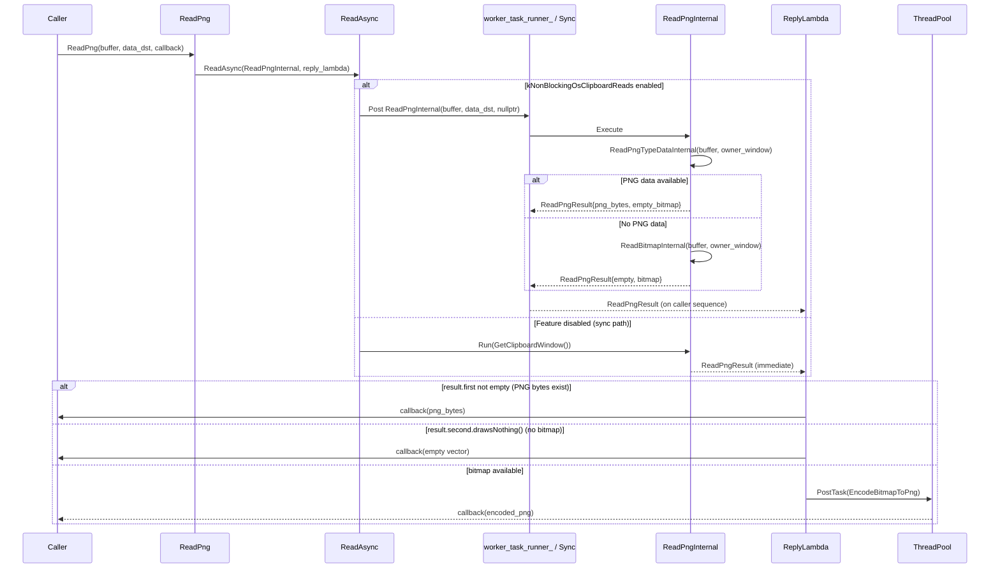
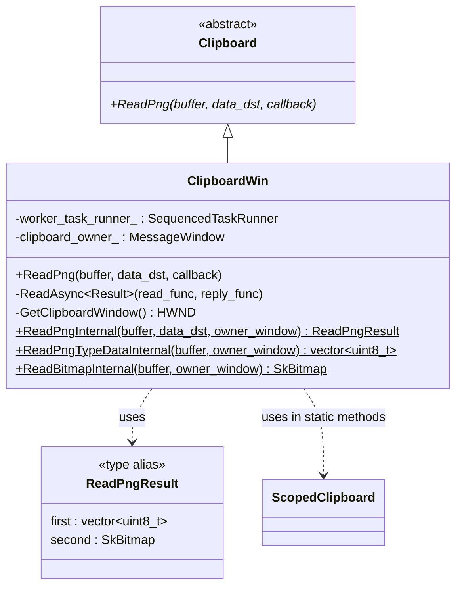
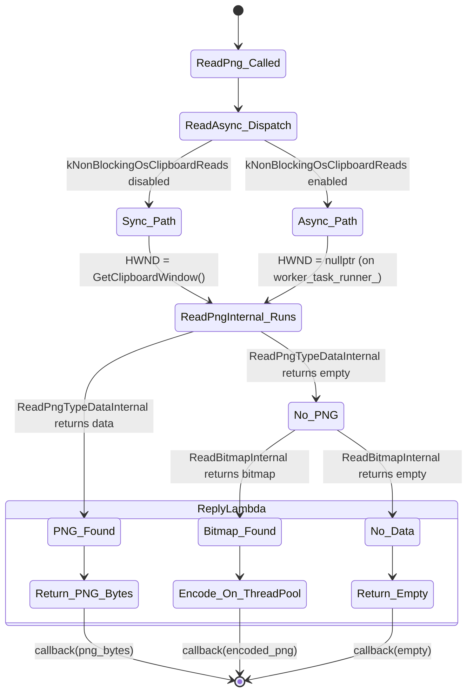
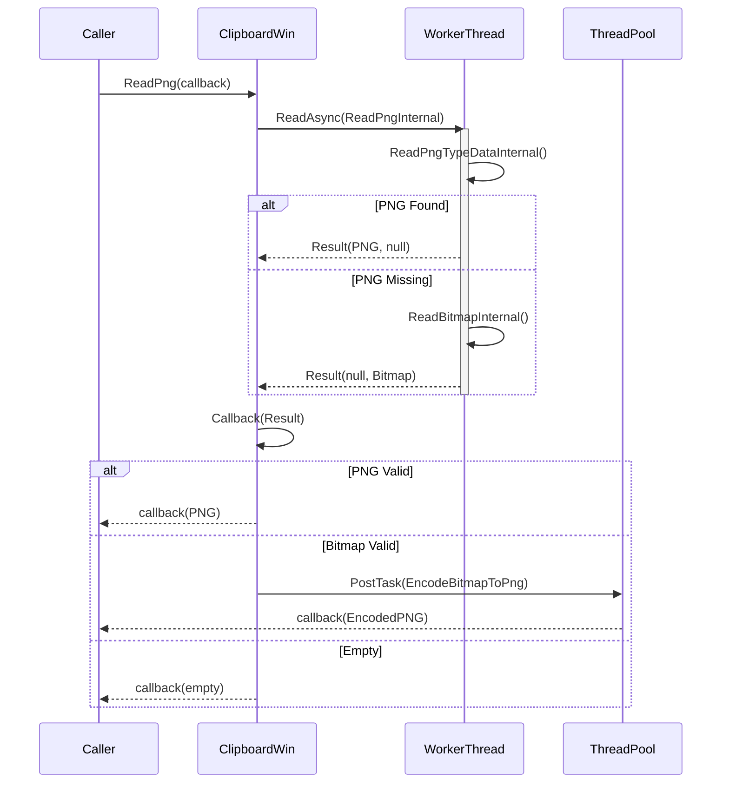
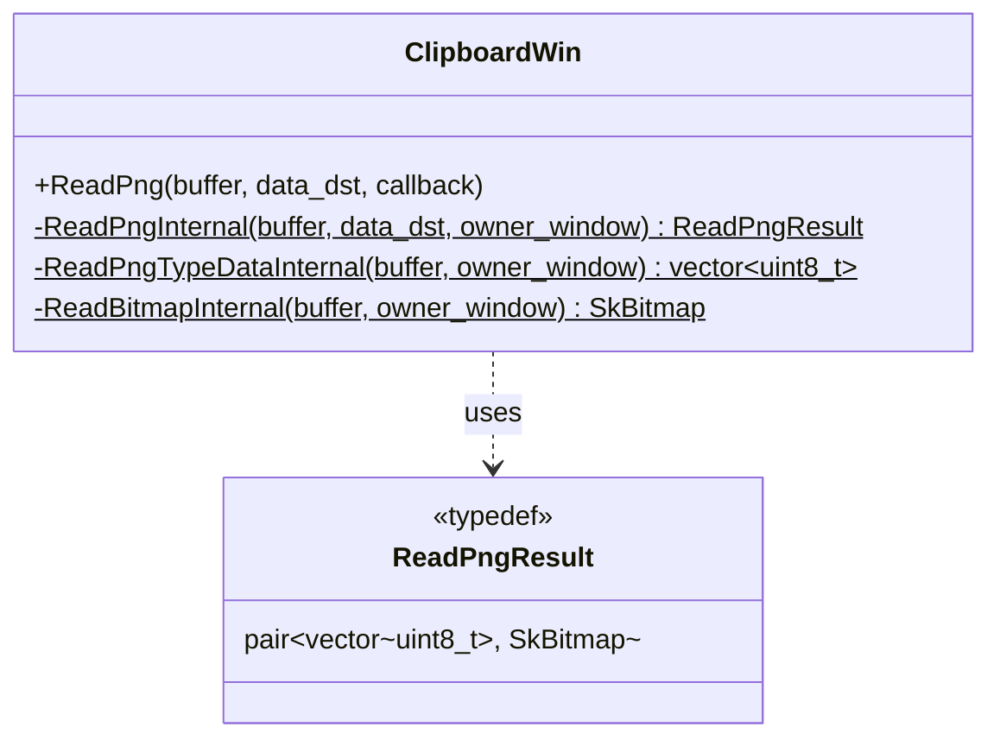
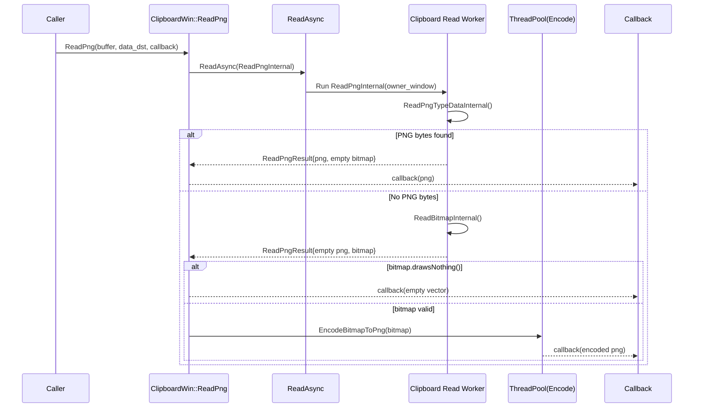
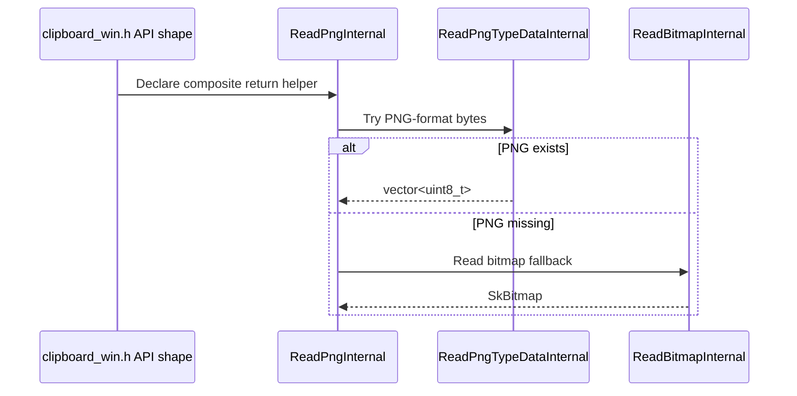
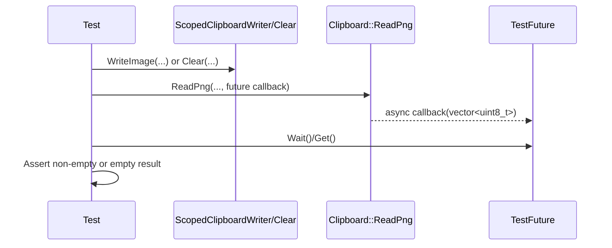
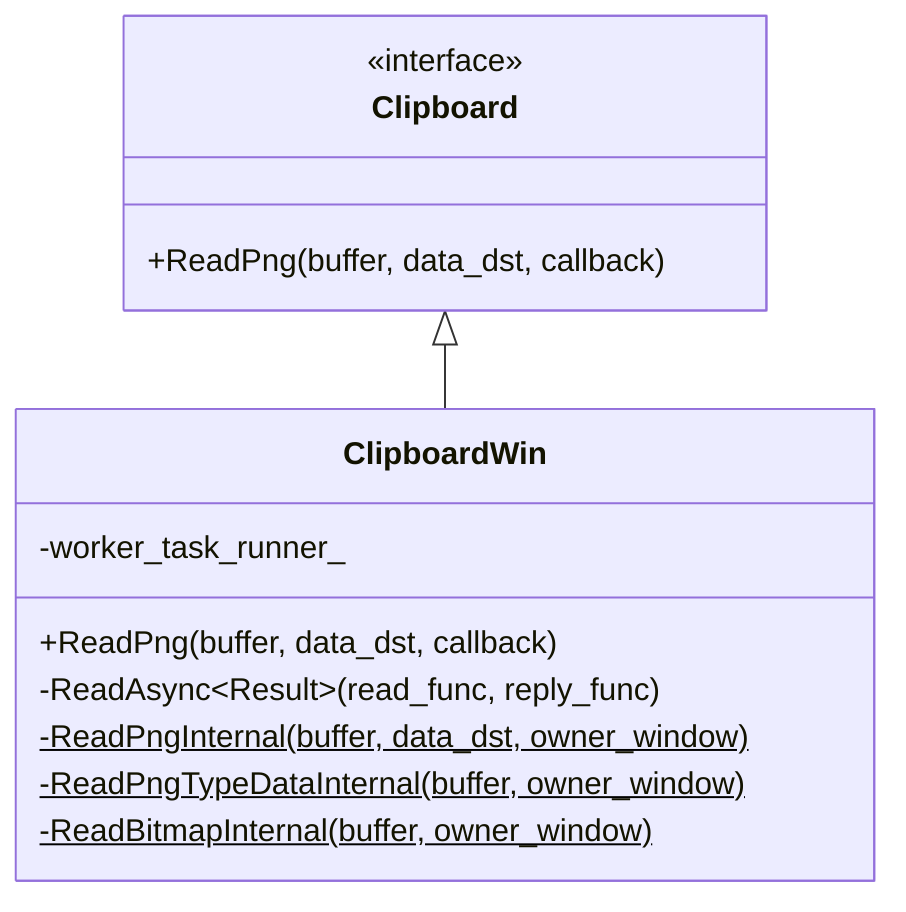
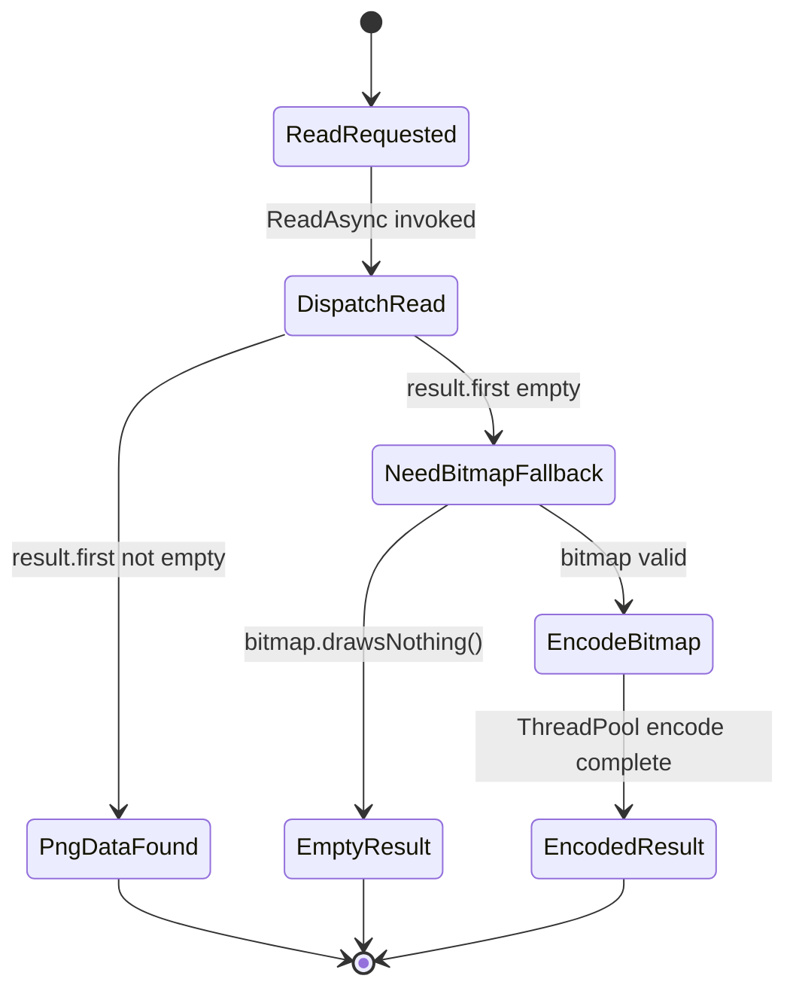

# Lld — Multi-Model Merged Review

> **Models**: claude-opus-4.6-fast, gemini-3-pro-preview, gpt-5.3-codex  
> **Models reporting**: 3/3

---

## 📋 Review by **claude-opus-4.6-fast**

# Low-Level Design: CL 7578053

## [Clipboard][Windows] Make ReadPng non-blocking and refactor internals

**CL URL:** https://chromium-review.googlesource.com/c/chromium/src/+/7578053
**Owner:** Hewro Hewei (ihewro@chromium.org)
**Bug:** 458194647

---

## 1. File-by-File Analysis

### 1.1 `ui/base/clipboard/clipboard_win.h`

**Purpose of changes:** Declare new static internal methods and the `ReadPngResult` type alias to support the refactored async `ReadPng` flow.

**Key modifications:**
- Added `#include <utility>` for `std::pair`.
- Introduced `using ReadPngResult = std::pair<std::vector<uint8_t>, SkBitmap>` — a composite return type bundling PNG bytes and a bitmap fallback.
- Changed `ReadPngInternal` from a non-static `const` member (taking only `ClipboardBuffer`) to a `static` method accepting `(ClipboardBuffer, optional<DataTransferEndpoint>&, HWND)`.
- Added new `static ReadPngTypeDataInternal(ClipboardBuffer, HWND)` — extracted from the old `ReadPngInternal`.
- Changed `ReadBitmapInternal` from a non-static `const` member to a `static` method accepting `HWND`.

**New/Modified Functions:**

| Function | Purpose | Parameters | Returns |
|----------|---------|------------|---------|
| `ReadPngInternal` (modified) | Reads PNG data, falling back to bitmap; now static and compatible with `ReadAsync` | `ClipboardBuffer buffer`, `const optional<DataTransferEndpoint>& data_dst`, `HWND owner_window` | `ReadPngResult` (pair of PNG bytes + SkBitmap) |
| `ReadPngTypeDataInternal` (new) | Reads raw PNG clipboard format data | `ClipboardBuffer buffer`, `HWND owner_window` | `std::vector<uint8_t>` |
| `ReadBitmapInternal` (modified) | Reads bitmap from clipboard; now static | `ClipboardBuffer buffer`, `HWND owner_window` | `SkBitmap` |

**Data Structures:**

| Type | Definition | Purpose |
|------|-----------|---------|
| `ReadPngResult` | `std::pair<std::vector<uint8_t>, SkBitmap>` | Bundles PNG data (`.first`) and bitmap fallback (`.second`) from a single clipboard read pass |

---

### 1.2 `ui/base/clipboard/clipboard_win.cc`

**Purpose of changes:** Refactor `ReadPng` to use the existing `ReadAsync` template, making it non-blocking when the `kNonBlockingOsClipboardReads` feature flag is enabled, while keeping PNG encoding on the general `ThreadPool` (not the serialized `worker_task_runner_`).

**Key modifications:**
- **`ReadPng` (lines 725–747):** Completely rewritten. Previously performed synchronous clipboard reads inline, then posted bitmap encoding to `ThreadPool`. Now delegates the clipboard read to `ReadAsync` (which dispatches to `worker_task_runner_` or runs synchronously depending on feature flag), and handles the result in a reply lambda that either returns PNG bytes directly or posts bitmap encoding to `ThreadPool`.
- **`ReadPngInternal` (lines 1092–1109):** Extracted and made static. Now returns `ReadPngResult` containing both PNG bytes and bitmap fallback. Calls `RecordRead`, `ReadPngTypeDataInternal`, and conditionally `ReadBitmapInternal`.
- **`ReadPngTypeDataInternal` (lines 1111–1133):** New static function extracted from old `ReadPngInternal`. Handles raw clipboard acquisition and PNG data extraction.
- **`ReadBitmapInternal` (lines 1135–1157):** Made static, now takes `HWND owner_window` parameter directly instead of calling `GetClipboardWindow()` internally.

**New/Modified Functions:**

| Function | Purpose | Parameters | Returns |
|----------|---------|------------|---------|
| `ReadPng` (modified) | Entry point for reading PNG; now uses `ReadAsync` | `ClipboardBuffer`, `optional<DTE>&`, `ReadPngCallback` | `void` |
| `ReadPngInternal` (refactored, static) | Combines PNG + bitmap reads in one clipboard pass | `ClipboardBuffer`, `optional<DTE>&`, `HWND` | `ReadPngResult` |
| `ReadPngTypeDataInternal` (new, static) | Acquires clipboard and reads PNG format data | `ClipboardBuffer`, `HWND` | `vector<uint8_t>` |
| `ReadBitmapInternal` (refactored, static) | Acquires clipboard and reads CF_DIB bitmap | `ClipboardBuffer`, `HWND` | `SkBitmap` |

**Data Flow:**



**Logic Flow Detail (ReadPng):**

1. `ReadPng` is called with a `ReadPngCallback`.
2. It invokes `ReadAsync` with:
   - **read_func:** `ClipboardWin::ReadPngInternal` (bound with `buffer` and `data_dst`). This is a static function compatible with the `ReadAsync<Result>(OnceCallback<Result(HWND)>, ...)` template — `HWND` is provided by `ReadAsync`.
   - **reply_func:** A lambda that inspects the `ReadPngResult`:
     - If PNG bytes are present (`result.first` non-empty), returns them directly via callback.
     - If bitmap is empty (`drawsNothing()`), returns an empty vector.
     - Otherwise, posts `EncodeBitmapToPng` to `ThreadPool` (not `worker_task_runner_`), replying with the encoded PNG.
3. `ReadAsync` checks `kNonBlockingOsClipboardReads`:
   - **Enabled:** Posts `read_func` to `worker_task_runner_` with `HWND=nullptr`, replies on caller sequence.
   - **Disabled:** Runs synchronously with `HWND=GetClipboardWindow()`.

---

### 1.3 `ui/base/clipboard/clipboard_win_unittest.cc`

**Purpose of changes:** Add unit tests for the new async `ReadPng` code path.

**Key modifications:**
- Added `ReadPngAsyncReturnsWrittenData` test: Writes a 2×3 bitmap to clipboard, reads it back via `ReadPng`, asserts returned PNG data is non-empty.
- Added `ReadPngAsyncEmptyClipboard` test: Clears clipboard, reads via `ReadPng`, asserts returned data is empty.

**New Tests:**

| Test Name | Scenario | Assertion |
|-----------|----------|-----------|
| `ReadPngAsyncReturnsWrittenData` | Write bitmap → ReadPng | PNG bytes non-empty (`ASSERT_GT(png.size(), 0u)`) |
| `ReadPngAsyncEmptyClipboard` | Clear clipboard → ReadPng | PNG bytes empty (`EXPECT_TRUE(png_future.Get().empty())`) |

Both tests use `base::test::TestFuture` to bridge the async callback to a synchronous test assertion, consistent with existing test patterns (e.g., `ReadAvailableTypesAsync*` tests above them).

---

## 2. Class Diagram



---

## 3. State Diagram



---

## 4. Implementation Concerns

### 4.1 Memory Management
- **`ReadPngResult` contains an `SkBitmap`:** When the PNG path succeeds, the `SkBitmap` in `result.second` is default-constructed (empty), so no unnecessary pixel buffer is allocated. This is correct — no wasted memory.
- **`std::move(result.second)` in `EncodeBitmapToPng`:** The bitmap is moved into the `ThreadPool` task, avoiding a deep copy of pixel data. Correct usage.
- **`ReadPngResult` lifetime:** In the async path, the result is moved from the worker thread to the reply lambda on the caller sequence. The `std::pair` move semantics handle this cleanly.

### 4.2 Thread Safety
- **Static methods read OS clipboard:** `ReadPngTypeDataInternal` and `ReadBitmapInternal` are static and access the Win32 clipboard API via `ScopedClipboard`. In the async path, these run on `worker_task_runner_` (a sequenced task runner), serializing all clipboard reads. This is correct — no concurrent clipboard access.
- **`RecordRead` called from static context:** `RecordRead` is called inside `ReadPngInternal` (static). This is safe only if `RecordRead` is a static/free function or thread-safe. The existing pattern in the codebase calls `RecordRead` from instance methods on the main thread — calling it from a worker thread is a change in threading context. **This should be verified to ensure `RecordRead` is thread-safe.**
- **PNG encoding on separate `ThreadPool`:** The bitmap encoding is correctly posted to `base::ThreadPool` rather than `worker_task_runner_`, so it does not block subsequent clipboard reads on the serialized worker. This was a review feedback item that was addressed.

### 4.3 Performance Implications
- **Positive:** The main thread is no longer blocked for clipboard access when the feature flag is enabled. This is the primary goal of the CL.
- **Two clipboard acquisitions in fallback path:** `ReadPngInternal` acquires the clipboard in `ReadPngTypeDataInternal`, releases it, then acquires again in `ReadBitmapInternal`. This is two separate `ScopedClipboard::Acquire` / release cycles. There is a small window where clipboard content could change between the two reads. However, this is the existing behavior (just moved to a single static function), and the Win32 clipboard model doesn't support holding the clipboard open across format reads in a clean way.
- **`EncodeBitmapToPng` overhead unchanged:** The encoding still happens on `ThreadPool` with `USER_BLOCKING` priority, same as before.

### 4.4 Maintainability Concerns
- **`std::pair` with `.first`/`.second` is opaque:** The `ReadPngResult` type alias uses `std::pair<vector<uint8_t>, SkBitmap>`, with semantics documented only in a comment (`// first: PNG bytes (if available), second: bitmap fallback`). Using `.first` and `.second` in the reply lambda (lines 731, 735, 743) hurts readability. The earlier build failure with `ReadPngResult` as a struct was resolved by moving constructor/destructor out-of-line, but using a struct with named fields (e.g., `.png_data`, `.bitmap_fallback`) would be clearer than a `std::pair`.
- **Feature flag branching in `ReadAsync`:** The sync/async split is clean and contained in the `ReadAsync` template, making it easy to remove once the flag is fully launched.

---

## 5. Suggestions for Improvement

### 5.1 Use a Named Struct Instead of `std::pair`
Replace `using ReadPngResult = std::pair<std::vector<uint8_t>, SkBitmap>` with a named struct:
```cpp
struct ReadPngResult {
  std::vector<uint8_t> png_data;
  SkBitmap bitmap_fallback;
};
```
This would make the reply lambda code self-documenting (`result.png_data.empty()` vs `result.first.empty()`). Note: An earlier patchset attempted this but hit a Chromium style check requiring out-of-line constructors for complex structs. The author switched to `std::pair` to avoid the overhead. If using a struct, the constructor/destructor should be defined in the `.cc` file.

### 5.2 Verify `RecordRead` Thread Safety
`RecordRead(ClipboardFormatMetric::kPng)` is now called from `ReadPngInternal`, which runs on `worker_task_runner_` in the async path. Verify that `RecordRead` (typically a UMA histogram recording function) is safe to call from a non-main thread. Chromium's UMA macros are generally thread-safe, but this should be confirmed.

### 5.3 Consider Single Clipboard Acquisition
`ReadPngInternal` performs two clipboard acquisitions (one in `ReadPngTypeDataInternal`, one in `ReadBitmapInternal`). Merging them into a single acquisition would:
- Eliminate the race window between PNG and bitmap reads.
- Reduce overhead of two `OpenClipboard`/`CloseClipboard` round-trips.

This would require `ReadPngInternal` to open the clipboard itself and pass the open handle to sub-functions, which is a larger refactor.

### 5.4 Test Coverage Gaps
- **No test for the PNG-format-available path:** `ReadPngAsyncReturnsWrittenData` writes a bitmap, which exercises the bitmap-to-PNG encoding fallback. There is no test that writes actual PNG data to the clipboard to test the `ReadPngTypeDataInternal` → direct return path.
- **No test with feature flag toggling:** Tests do not explicitly verify behavior with `kNonBlockingOsClipboardReads` both enabled and disabled. Consider using `base::test::ScopedFeatureList` to test both paths.
- **No test for concurrent reads:** No test validates that PNG encoding on `ThreadPool` does not block other clipboard reads on `worker_task_runner_`.

---

## 6. Summary

This CL cleanly integrates `ReadPng` into the existing `ReadAsync` framework used by other clipboard read operations (`ReadText`, `ReadAsciiText`, `ReadAvailableTypes`, `ReadFilenames`). The key architectural decision — keeping PNG encoding on the general `ThreadPool` rather than the serialized `worker_task_runner_` — is sound and prevents blocking other clipboard reads during encoding. The refactoring of `ReadPngInternal`, `ReadBitmapInternal`, and new `ReadPngTypeDataInternal` into static methods follows the pattern established by other `*Internal` methods and is necessary for `ReadAsync` compatibility. The use of `std::pair` for `ReadPngResult` trades readability for simplicity (avoiding Chromium style checks on complex structs), which is an acceptable tradeoff for this scope.


---

## 📋 Review by **gemini-3-pro-preview**

# Low-Level Design Review

## 1. File-by-File Analysis

#### [ui/base/clipboard/clipboard_win.cc]
**Purpose of changes**: 
The primary goal is to make `ReadPng` non-blocking by offloading the clipboard read operations to a background thread using `ReadAsync`. This prevents the UI thread from hanging during potentially slow clipboard interactions. The implementation is refactored to separate the reading of PNG data and the fallback reading of Bitmap data into static helper functions that can be executed on a worker thread.

**Key modifications**:
- `ReadPng` is rewritten to use `ReadAsync`, passing a callback that handles the result.
- `ReadPngInternal` is converted from a member function to a static function that returns a `ReadPngResult` containing either PNG bytes or a fallback `SkBitmap`.
- `ReadBitmapInternal` is converted to a static function accepting an `HWND` owner window.
- A new static helper `ReadPngTypeDataInternal` is added to handle the specific logic of reading PNG format data from the clipboard.
- The callback logic in `ReadPng` handles the `ReadPngResult`:
    - If PNG data is present, it is returned immediately.
    - If only Bitmap data is present, it posts a task to `EncodeBitmapToPng` on the ThreadPool (blocking, as encoding is CPU intensive).
    - If neither is present, it returns an empty vector.

**New/Modified Functions**:
| Function | Purpose | Parameters | Returns |
|----------|---------|------------|---------|
| `ReadPng` | Initiates async read of PNG data. | `buffer`, `data_dst`, `callback` | `void` |
| `ReadPngInternal` (static) | Reads PNG or Bitmap data from clipboard. | `buffer`, `data_dst`, `owner_window` | `ReadPngResult` (pair<vector<uint8_t>, SkBitmap>) |
| `ReadPngTypeDataInternal` (static) | Reads raw PNG bytes from clipboard. | `buffer`, `owner_window` | `std::vector<uint8_t>` |
| `ReadBitmapInternal` (static) | Reads Bitmap data from clipboard. | `buffer`, `owner_window` | `SkBitmap` |

**Data Flow**:


#### [ui/base/clipboard/clipboard_win.h]
**Purpose of changes**: 
Updates the `ClipboardWin` class definition to support the static helper methods and the new return type required for the asynchronous operation.

**Key modifications**:
- Added `ReadPngResult` type alias (or struct) representing a pair of `std::vector<uint8_t>` and `SkBitmap`.
- Changed `ReadPngInternal` and `ReadBitmapInternal` to be `static`.
- Added `ReadPngTypeDataInternal` declaration.
- Added `HWND owner_window` parameter to internal read methods to support execution on worker threads where the `GetClipboardWindow()` context might need to be passed explicitly or handled correctly.

#### [ui/base/clipboard/clipboard_win_unittest.cc]
**Purpose of changes**: 
Adds unit tests to verify the new asynchronous `ReadPng` implementation ensures data is correctly retrieved and that empty clipboards are handled gracefully.

**Key modifications**:
- `ReadPngAsyncReturnsWrittenData`: Writes a bitmap to the clipboard and verifies that `ReadPng` retrieves it (implying the fallback to bitmap reading and encoding works).
- `ReadPngAsyncEmptyClipboard`: Clears the clipboard and verifies that `ReadPng` returns an empty vector.

## 2. Class Diagram



## 3. Implementation Concerns

- **Thread Safety**: The clipboard is a system-global resource. Moving reads to a worker thread via `ReadAsync` (which likely serializes access) is good, but care must be taken that the `owner_window` passed to the static functions is valid and thread-safe to use if it's accessed across threads. The `ReadAsync` implementation in `ClipboardWin` (not shown in diff but implied) presumably handles the creation/management of the worker thread and the clipboard window affinity.
- **Performance**: 
    - **Pros**: `ReadPng` no longer blocks the main thread, improving responsiveness.
    - **Cons**: There is overhead in posting tasks and marshalling data (copying `std::vector` and `SkBitmap`) between threads.
    - **Encoding**: The `EncodeBitmapToPng` step is still posted to the thread pool (`USER_BLOCKING`), which is appropriate as PNG encoding is expensive.
- **Memory Management**: The `ReadPngResult` involves moving potentially large vectors and bitmaps. Usage of `std::move` in the callback is crucial to avoid unnecessary copies. The implementation appears to use `std::move` correctly.
- **Window Handle Validity**: The static methods take `HWND owner_window`. If the worker thread creates its own window for clipboard interaction (common in Windows clipboard async implementations), this is fine. If it relies on a UI thread window, there could be cross-thread message pump issues, but `ClipboardWin` typically manages a message-only window for this purpose.

## 4. Suggestions for Improvement

- **Error Handling**: The callback logic checks `!result.first.empty()` then `result.second.drawsNothing()`. Explicitly checking for failure cases (e.g., cannot acquire clipboard) inside `ReadPngInternal` and returning a clear error state in `ReadPngResult` (perhaps a `std::optional` or a status code) might be cleaner than relying on empty containers.
- **Data Structure**: `ReadPngResult` being a `std::pair` is functional but `std::pair<std::vector<uint8_t>, SkBitmap>` is a bit opaque. A named struct with fields `png_data` and `bitmap` would improve readability.
    ```cpp
    struct ReadPngResult {
      std::vector<uint8_t> png_data;
      SkBitmap bitmap;
    };
    ```
- **Callback Complexity**: The lambda inside `ReadPng` is getting a bit complex. Extracting it to a named method `OnReadPngInternalFinished` could improve readability and testability.


---

## 📋 Review by **gpt-5.3-codex**

# Low-Level Design Review: CL 7578053

## 1. File-by-File Analysis

#### `ui/base/clipboard/clipboard_win.cc`
**Purpose of changes**: Route `ReadPng` through the existing non-blocking clipboard read pipeline and split PNG-vs-bitmap fallback logic into reusable helpers.

**Key modifications**:
- `ReadPng()` now calls `ReadAsync(...)` instead of running clipboard read synchronously on the caller sequence.
- Added two-stage result handling: return PNG bytes directly when present, otherwise optionally encode a fallback `SkBitmap` on `base::ThreadPool`.
- Refactored internals: `ReadPngInternal` now returns a composite result (`PNG bytes`, `fallback bitmap`) and delegates raw PNG extraction to new `ReadPngTypeDataInternal`.
- `ReadBitmapInternal` now accepts `HWND owner_window` and is static for compatibility with `ReadAsync` worker execution.

**New/Modified Functions**:

| Function | Purpose | Parameters | Returns |
|----------|---------|------------|---------|
| `ClipboardWin::ReadPng` | Asynchronous PNG read entry point; orchestrates fallback encode path | `ClipboardBuffer buffer`, `optional<DataTransferEndpoint> data_dst`, `ReadPngCallback callback` | `void` |
| `ClipboardWin::ReadPngInternal` (static) | Reads clipboard PNG format first, then bitmap fallback if needed | `ClipboardBuffer buffer`, `optional<DataTransferEndpoint> data_dst`, `HWND owner_window` | `ReadPngResult` (`pair<vector<uint8_t>, SkBitmap>`) |
| `ClipboardWin::ReadPngTypeDataInternal` (static) | Reads bytes from Windows PNG clipboard format | `ClipboardBuffer buffer`, `HWND owner_window` | `vector<uint8_t>` |
| `ClipboardWin::ReadBitmapInternal` (static, signature changed) | Reads DIB bitmap as fallback source for PNG encoding | `ClipboardBuffer buffer`, `HWND owner_window` | `SkBitmap` |

**Data Flow**:


---

#### `ui/base/clipboard/clipboard_win.h`
**Purpose of changes**: Adjust private helper APIs to support asynchronous execution and multi-value return for PNG read flow.

**Key modifications**:
- Added `<utility>` include to support `std::pair`.
- Introduced `using ReadPngResult = std::pair<std::vector<uint8_t>, SkBitmap>;` for dual-format read result.
- Changed `ReadPngInternal` from const instance method returning PNG bytes to static helper returning `ReadPngResult` and accepting `HWND owner_window`.
- Added new static helper `ReadPngTypeDataInternal(...)` and updated `ReadBitmapInternal(...)` signature to include `owner_window`.

**New/Modified Functions**:

| Function | Purpose | Parameters | Returns |
|----------|---------|------------|---------|
| `ReadPngInternal` (private static) | Aggregates PNG-format and bitmap fallback read | `ClipboardBuffer`, `optional<DataTransferEndpoint>`, `HWND` | `ReadPngResult` |
| `ReadPngTypeDataInternal` (private static) | Dedicated raw PNG clipboard format reader | `ClipboardBuffer`, `HWND` | `vector<uint8_t>` |
| `ReadBitmapInternal` (private static) | Bitmap fallback reader usable from async worker path | `ClipboardBuffer`, `HWND` | `SkBitmap` |

**Data Flow**:


---

#### `ui/base/clipboard/clipboard_win_unittest.cc`
**Purpose of changes**: Validate new async `ReadPng` behavior for success and empty-clipboard paths.

**Key modifications**:
- Added `ReadPngAsyncReturnsWrittenData`: writes bitmap, calls async `ReadPng`, asserts non-empty PNG bytes.
- Added `ReadPngAsyncEmptyClipboard`: clears clipboard, calls async `ReadPng`, asserts empty result.

**New/Modified Functions**:

| Function | Purpose | Parameters | Returns |
|----------|---------|------------|---------|
| `TEST_F(ClipboardWinTest, ReadPngAsyncReturnsWrittenData)` | Confirms async path returns encoded PNG bytes for image data | N/A | N/A |
| `TEST_F(ClipboardWinTest, ReadPngAsyncEmptyClipboard)` | Confirms empty clipboard yields empty PNG result | N/A | N/A |

**Data Flow**:


## 2. Class Diagram (applicable)


## 3. State Diagram (applicable)


## 4. Implementation Concerns
- **Memory management**: Uses move semantics (`std::move(result.second)`) into encode task, avoiding unnecessary bitmap copies; clipboard handles remain guarded by existing scoped wrappers.
- **Thread safety**: Clipboard OS access remains serialized through `ReadAsync` + worker task runner when feature flag is enabled; encode task intentionally runs on separate pool to avoid blocking clipboard read queue.
- **Performance**: Primary improvement is non-blocking caller behavior for `ReadPng`; additional benefit from avoiding worker queue starvation by moving PNG encoding off `worker_task_runner_`.
- **Maintainability**: `ReadPngResult` as `std::pair` is compact but less self-documenting than a named struct; logic split into `ReadPngTypeDataInternal`/`ReadBitmapInternal` improves separation of concerns.

## 5. Suggestions for Improvement
- Replace `ReadPngResult` pair with a named struct (`png_bytes`, `bitmap_fallback`) to improve readability and reduce positional-field ambiguity.
- Add explicit unit coverage for the bitmap-fallback encoding path (no PNG format present but valid CF_DIB available).
- Add a feature-flag-off regression test to assert synchronous `ReadAsync` branch still returns correct PNG output.
- Consider histogram/perf instrumentation for encode-latency in async `ReadPng` path to detect expensive bitmap-to-PNG conversions.


---

## 🔀 Cross-Model Summary

This document merges reviews from **3** models: claude-opus-4.6-fast, gemini-3-pro-preview, gpt-5.3-codex.

### Model Coverage

| Model | Contributed |
|-------|------------|
| claude-opus-4.6-fast | ✅ Yes |
| gemini-3-pro-preview | ✅ Yes |
| gpt-5.3-codex | ✅ Yes |
