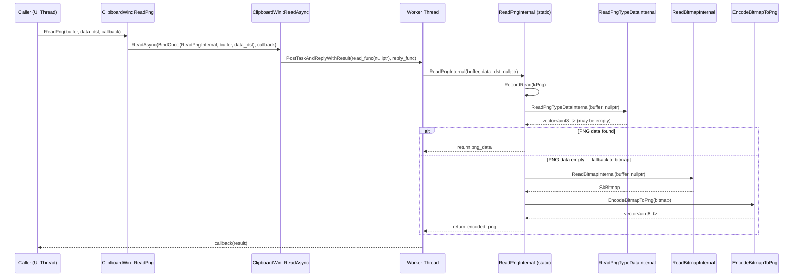
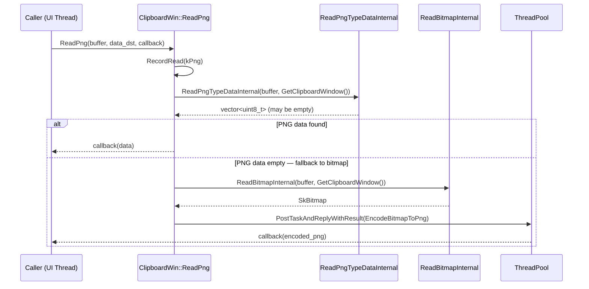
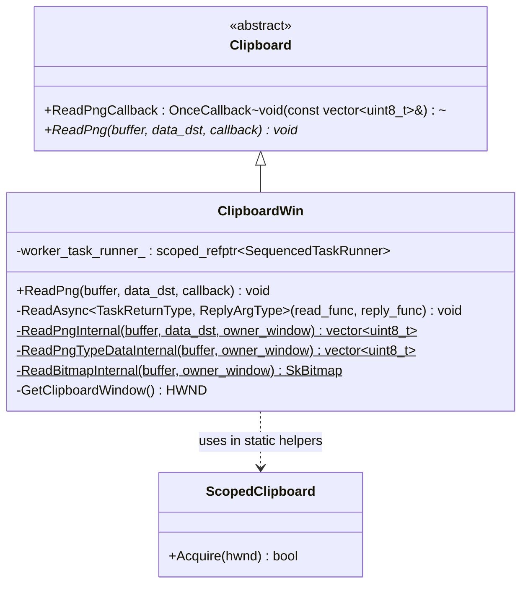
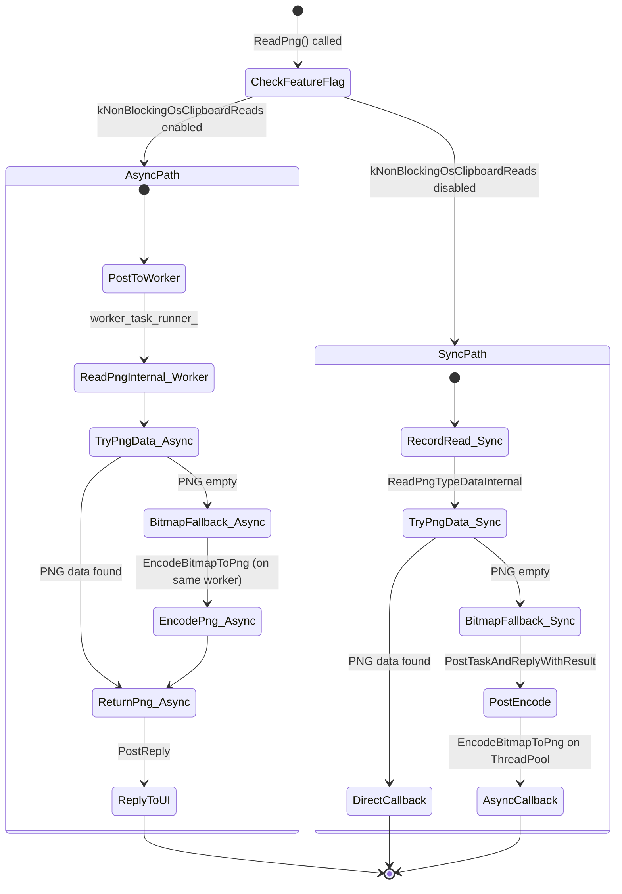

# Low-Level Design Review: CL 7578053

## [clipboard][Windows] Make ReadPng non-blocking and refactor internals

**CL URL:** https://chromium-review.googlesource.com/c/chromium/src/+/7578053
**Owner:** Hewro Hewei (ihewro@chromium.org)
**Bug:** 458194647

---

## 1. File-by-File Analysis

---

### 1.1 `ui/base/clipboard/clipboard_win.h`

**Purpose of changes:** Refactor `ReadPngInternal` and `ReadBitmapInternal` from non-static instance methods to static free functions that accept an `HWND` parameter, enabling them to run on worker threads. Introduce a new `ReadPngTypeDataInternal` static helper. Generalize the `ReadAsync` template to support differing task return types and reply argument types.

**Key modifications:**
- `ReadAsync` template changed from single `Result` type to two template parameters: `TaskReturnType` and `ReplyArgType` (defaulting to `TaskReturnType`).
- `ReadPngInternal` changed from `const` instance method to `static` method with added `data_dst` and `owner_window` parameters.
- New `ReadPngTypeDataInternal` static method extracted for reading raw PNG clipboard data.
- `ReadBitmapInternal` changed from `const` instance method to `static` method with added `owner_window` parameter.

**New/Modified Functions:**

| Function | Purpose | Parameters | Returns | Change |
|----------|---------|------------|---------|--------|
| `ReadAsync<TaskReturnType, ReplyArgType>` | Dispatch clipboard reads to worker thread or run synchronously | `OnceCallback<TaskReturnType(HWND)>`, `OnceCallback<void(ReplyArgType)>` | `void` | Modified — two template params instead of one |
| `ReadPngInternal` (static) | Full PNG read logic including bitmap fallback and encoding | `ClipboardBuffer`, `optional<DataTransferEndpoint>&`, `HWND` | `vector<uint8_t>` | Modified — now static, accepts `HWND` and `data_dst` |
| `ReadPngTypeDataInternal` (static) | Read raw PNG-format data from clipboard | `ClipboardBuffer`, `HWND` | `vector<uint8_t>` | **New** |
| `ReadBitmapInternal` (static) | Read bitmap (DIB) from clipboard | `ClipboardBuffer`, `HWND` | `SkBitmap` | Modified — now static, accepts `HWND` |

---

### 1.2 `ui/base/clipboard/clipboard_win.cc`

**Purpose of changes:** Gate `ReadPng` on `kNonBlockingOsClipboardReads` using the `ReadAsync` infrastructure, and refactor internal helpers to be static so they can run on the worker thread without `this`.

**Key modifications:**
- **`ReadPng` (public):** Added early-return path when `kNonBlockingOsClipboardReads` is enabled. In that path, delegates entirely to `ReadAsync` + `ReadPngInternal`, which handles PNG reading, bitmap fallback, and PNG encoding all on the worker thread. The old synchronous fallback path is preserved behind the feature gate.
- **`ReadAsync` (template):** Updated to two template parameters (`TaskReturnType`, `ReplyArgType`) to handle the type mismatch where `ReadPngInternal` returns `std::vector<uint8_t>` by value but `ReadPngCallback` accepts `const std::vector<uint8_t>&`.
- **`ReadPngInternal` (static):** Extracted from `ReadPng`'s inline logic. Now contains the full flow: `RecordRead` → `ReadPngTypeDataInternal` → bitmap fallback → `EncodeBitmapToPng`. This consolidates duplicate logic previously split between `ReadPng` and the old `ReadPngInternal`.
- **`ReadPngTypeDataInternal` (static, new):** Renamed from the old `ReadPngInternal`. Handles only the raw PNG clipboard data acquisition via `ScopedClipboard` + `GetClipboardDataWithLimit`.
- **`ReadBitmapInternal` (static):** Changed from `const` instance method to static, taking `owner_window` as a parameter instead of calling `GetClipboardWindow()` internally.

**Data Flow — Async path (feature enabled):**



**Data Flow — Sync path (feature disabled):**



---

### 1.3 `ui/base/clipboard/clipboard_win_unittest.cc`

**Purpose of changes:** Add test coverage for the new async `ReadPng` code path.

**Key modifications:**
- **`ReadPngAsyncReturnsWrittenData`:** Writes a 2×3 bitmap to clipboard, calls `ReadPng` asynchronously, asserts non-empty PNG data is returned.
- **`ReadPngAsyncEmptyClipboard`:** Clears clipboard, calls `ReadPng` asynchronously, asserts empty result.

**New Tests:**

| Test | Purpose | Validates |
|------|---------|-----------|
| `ReadPngAsyncReturnsWrittenData` | Round-trip: write bitmap → read as PNG | Non-empty PNG returned via async callback |
| `ReadPngAsyncEmptyClipboard` | Read from empty clipboard | Empty vector returned, no crash |

---

## 2. Class Diagram



---

## 3. State Diagram



---

## 4. Implementation Concerns

### 4.1 Thread Safety

- **`RecordRead` call location:** In the async path, `RecordRead(ClipboardFormatMetric::kPng)` is called inside `ReadPngInternal` which runs on the worker thread. In other `ReadAsync` callers (e.g., `ReadText`, `ReadAsciiText`), `RecordRead` is called on the calling thread (or within the internal function on the worker). The CL is consistent with the pattern used by `ReadFilenamesInternal` (which also calls `RecordRead` inside the static function). However, `RecordRead` must be thread-safe for this to work — it should be verified that the UMA histogram macros used are thread-safe (they typically are in Chromium).

- **`owner_window = nullptr` in async path:** When the feature is enabled, `ReadAsync` passes `nullptr` as `owner_window` to the worker thread. `ReadPngTypeDataInternal` and `ReadBitmapInternal` pass this to `ScopedClipboard::Acquire(nullptr)`. This is intentional — on worker threads, there's no message window, so `nullptr` is passed. The Win32 `OpenClipboard(NULL)` call associates the clipboard with the current task, which is valid. This is consistent with other async clipboard reads.

### 4.2 Behavioral Difference: Async vs Sync Path

- **Bitmap-to-PNG encoding location differs:** In the **sync path**, `EncodeBitmapToPng` runs on a ThreadPool task (via `PostTaskAndReplyWithResult`). In the **async path**, `EncodeBitmapToPng` runs synchronously inside `ReadPngInternal` on the worker thread. This means the async path does the encoding on `worker_task_runner_` instead of a separate ThreadPool task. This is acceptable since `worker_task_runner_` already has `MayBlock` and `USER_BLOCKING` priority, and avoids an extra thread hop, but it's a semantic difference worth noting.

### 4.3 Template Type Mismatch Handling

- The `ReadAsync` template was generalized to support `TaskReturnType != ReplyArgType`. Specifically, `ReadPngInternal` returns `std::vector<uint8_t>` (by value) but `ReadPngCallback` takes `const std::vector<uint8_t>&`. The `ReplyArgType = TaskReturnType` default preserves backward compatibility for existing callers (ReadText, ReadAsciiText, etc.) where the return type and callback argument type match. This is a clean solution.

### 4.4 Dead Code / Unused Parameter

- The `data_dst` parameter in `ReadPngInternal` is explicitly documented as unused ("is not used, but is kept as it may be used in the future"). This follows the existing pattern for other `*Internal` methods (e.g., `ReadFilenamesInternal`). The parameter is carried through `BindOnce` into the static function. While it adds a small overhead for passing an `optional<DataTransferEndpoint>` through the bind chain, this is negligible.

### 4.5 Memory Management

- No concerns. All data structures are value types (`std::vector<uint8_t>`, `SkBitmap`) that are moved through callbacks. The `ScopedClipboard` RAII pattern correctly manages clipboard handle lifetime in both new static helpers.

### 4.6 Duplicated Logic

- The sync fallback path in `ReadPng` (lines 733–748) is now essentially a duplicate of the logic in `ReadPngInternal`. If the feature flag is eventually removed and the async path becomes the only path, this dead code should be cleaned up. However, keeping both paths during the flag rollout is standard Chromium practice.

---

## 5. Suggestions for Improvement

### 5.1 Consolidate Duplicate Logic in `ReadPng`

The synchronous fallback path in `ReadPng()` duplicates the logic now encapsulated in `ReadPngInternal()`. Consider rewriting the sync path to also call `ReadPngInternal` through `ReadAsync`'s synchronous fallback:

```cpp
void ClipboardWin::ReadPng(ClipboardBuffer buffer,
                           const std::optional<DataTransferEndpoint>& data_dst,
                           ReadPngCallback callback) const {
  ReadAsync(base::BindOnce(&ClipboardWin::ReadPngInternal, buffer, data_dst),
            std::move(callback));
}
```

This would work because `ReadAsync` already handles the sync case when the feature is disabled. This eliminates ~15 lines of duplicate code. **However**, there's a subtle difference: the current sync path uses `PostTaskAndReplyWithResult` for the bitmap-to-PNG encoding, while `ReadPngInternal` does it synchronously. If keeping the async encoding in the sync path is important for performance (avoiding blocking the UI thread on encoding), the current approach is justified.

### 5.2 Test Coverage Gaps

- **No test for the sync fallback path explicitly:** The existing tests run with the feature flag enabled (based on the test fixture). Consider adding a parameterized test that also validates behavior with the flag disabled to ensure both paths are covered.
- **No test for PNG-format clipboard data:** Both tests write a bitmap (which gets stored as DIB). The PNG-first path in `ReadPngTypeDataInternal` is never exercised. Consider a test that writes PNG-format data directly to the clipboard.
- **No test for `ReadPngInternal` or `ReadPngTypeDataInternal` in isolation:** These static methods could be unit-tested directly for better coverage.

### 5.3 Minor: Brace Consistency

The CL correctly adds braces to single-line `if` blocks for `ScopedClipboard::Acquire` checks in the modified functions (following Chromium style). However, line 1128 (`if (!data)`) in `ReadPngTypeDataInternal` still lacks braces — this is pre-existing and outside the CL scope but worth noting.

### 5.4 Consider `[[maybe_unused]]` for `data_dst`

Instead of a comment explaining `data_dst` is unused, consider using `[[maybe_unused]]` on the parameter to make the intent machine-checkable:

```cpp
static std::vector<uint8_t> ReadPngInternal(
    ClipboardBuffer buffer,
    [[maybe_unused]] const std::optional<DataTransferEndpoint>& data_dst,
    HWND owner_window);
```

This follows modern C++ practices, though it may not be standard Chromium style.

---

## 6. Summary

| Aspect | Assessment |
|--------|-----------|
| **Correctness** | ✅ Logic is sound. Both async and sync paths produce correct results. |
| **Thread Safety** | ✅ Static methods with explicit `HWND` parameter avoid `this` access on worker. `RecordRead` should be thread-safe (standard UMA). |
| **API Design** | ✅ Two-template-parameter `ReadAsync` is a clean generalization with backward-compatible defaults. |
| **Test Coverage** | ⚠️ Adequate for the async path, but sync fallback and PNG-format clipboard data are untested. |
| **Code Duplication** | ⚠️ Sync fallback in `ReadPng` duplicates `ReadPngInternal` logic — acceptable during flag rollout. |
| **Overall Risk** | Low — well-structured, follows existing patterns, minimal surface area. |
