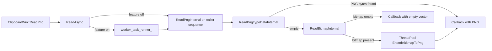

# Review Summary — Multi-Model Merged Review

> **Models**: claude-opus-4.6-fast, gemini-3-pro-preview, gpt-5.3-codex  
> **Models reporting**: 3/3

---

## 📋 Review by **claude-opus-4.6-fast**

# CL 7578053 Review Summary: [Clipboard][Windows] Make ReadPng non-blocking and refactor internals

**CL URL:** https://chromium-review.googlesource.com/c/chromium/src/+/7578053
**Author:** Hewro Hewei (ihewro@chromium.org)
**Reviewers:** Dan Clark (daniec@microsoft.com), Rohan Raja (roraja@microsoft.com)
**Files Changed:** 3 files, +85/-21 lines
**Bug:** 458194647

---

## 1. Executive Summary

This CL makes the `ReadPng` clipboard operation on Windows non-blocking by routing it through the existing `ReadAsync` template infrastructure, gated behind the `kNonBlockingOsClipboardReads` feature flag (enabled by default). The change refactors the formerly monolithic `ReadPng` method into three static helper functions (`ReadPngInternal`, `ReadPngTypeDataInternal`, `ReadBitmapInternal`) that can be dispatched to a sequenced worker thread, while keeping PNG encoding on the general `ThreadPool` to avoid blocking other queued clipboard reads. This is part of a broader series of CLs converting Windows clipboard read operations to async patterns.

---

## 2. Design Assessment

### Architecture Quality

| Aspect | Rating (1-5) | Comments |
|--------|--------------|----------|
| Clarity | 4 | The `ReadAsync` template pattern is well-established from prior CLs. The two-phase result (`ReadPngResult = pair<vector<uint8_t>, SkBitmap>`) is adequate but somewhat opaque. |
| Maintainability | 4 | Follows the same pattern as ReadText, ReadHTML, ReadFilenames, etc. Consistent with the existing codebase. |
| Extensibility | 4 | The static helper decomposition makes it straightforward to add future PNG read behaviors or modify individual steps. |
| Consistency | 5 | Directly mirrors the established async read pattern used for all other clipboard read operations on Windows. |

### Architecture Diagram

```
┌─────────────────────────────────────────────────────────────────┐
│                      ClipboardWin::ReadPng()                    │
│                                                                 │
│  ReadAsync(read_func, reply_func)                               │
│     │                                                           │
│     ├── Feature OFF (sync path):                                │
│     │   read_func(GetClipboardWindow()) → reply_func(result)    │
│     │                                                           │
│     └── Feature ON (async path):                                │
│         worker_task_runner_->PostTaskAndReplyWithResult(         │
│           read_func(nullptr), reply_func)                       │
│                                                                 │
└───────────────┬─────────────────────────────────────────────────┘
                │
    ┌───────────▼───────────────────────────────────┐
    │  ReadPngInternal (static, runs on worker)     │
    │                                               │
    │  1. RecordRead(kPng)                          │
    │  2. ReadPngTypeDataInternal(buffer, hwnd)     │
    │     → If PNG bytes found, return early        │
    │  3. ReadBitmapInternal(buffer, hwnd)           │
    │     → Return bitmap as fallback               │
    │                                               │
    │  Returns: ReadPngResult = pair<bytes, bitmap>  │
    └───────────────────────┬───────────────────────┘
                            │
    ┌───────────────────────▼───────────────────────┐
    │  Reply lambda (runs on caller thread)         │
    │                                               │
    │  1. If PNG bytes non-empty → callback(bytes)  │
    │  2. If bitmap empty → callback(empty)         │
    │  3. Otherwise → ThreadPool::PostTask           │
    │     EncodeBitmapToPng → callback(encoded)     │
    └───────────────────────────────────────────────┘
```

**Key design decision:** PNG encoding (`EncodeBitmapToPng`) is deliberately kept on the general `ThreadPool` rather than the serialized `worker_task_runner_`. This prevents a slow encoding operation from blocking subsequent clipboard reads — a design choice resulting from reviewer feedback (roraja@).

---

## 3. Implementation Assessment

### Code Quality

| Aspect | Rating (1-5) | Comments |
|--------|--------------|----------|
| Correctness | 4 | Logic is sound and preserves existing behavior. The sync/async branching via `ReadAsync` template is well-tested. Minor concern: `RecordRead` called on worker thread needs thread-safety verification (see findings). |
| Efficiency | 4 | Good separation of OS clipboard reads (worker) from CPU-intensive encoding (ThreadPool). Avoids unnecessary bitmap reads when PNG data is available. |
| Readability | 3 | The `std::pair<vector<uint8_t>, SkBitmap>` type alias (`ReadPngResult`) uses `.first`/`.second` which is less self-documenting than a named struct. The inline lambda in `ReadPng` is somewhat dense. |
| Test Coverage | 3 | Two new tests added covering the happy path and empty clipboard. Missing edge cases (see §5). |

---

## 4. Key Findings

### Critical Issues (Must Fix)

- **None identified.** The CL has passed CQ dry run (PS17). The PS16 build failure (missing out-of-line constructor/destructor for `ReadPngResult` struct) was addressed by switching to `std::pair` via `using` alias.

### Major Issues (Should Fix)

1. **Thread-safety of `RecordRead` from worker thread:** `RecordRead(ClipboardFormatMetric::kPng)` is now called inside `ReadPngInternal`, which runs on `worker_task_runner_` in the async path. `RecordRead` calls `base::UmaHistogramEnumeration`, which is documented as thread-safe, so this is likely fine — but it represents a behavioral change from the original code where `RecordRead` was always called on the UI thread. The author should verify this is intentional and add a brief comment if so.

2. **`data_dst` parameter carried but unused:** `ReadPngInternal` accepts `const std::optional<DataTransferEndpoint>& data_dst` and the comment says "is not used, but is kept as it may be used in the future." This is consistent with other `*Internal` methods, but the parameter is captured by value in `base::BindOnce`, which means copying the optional and any contained `DataTransferEndpoint`. This is low-risk but slightly wasteful. Consider documenting that this copy is intentional.

### Minor Issues (Nice to Fix)

1. **`std::pair` readability:** `ReadPngResult` uses `std::pair<std::vector<uint8_t>, SkBitmap>` with `.first`/`.second` access. A lightweight named struct with `png_bytes` and `bitmap` fields would improve readability. However, the earlier attempt at a struct triggered a Chromium style check requiring out-of-line constructors/destructors (the PS16 build failure), making the `std::pair` alias a pragmatic workaround. If reverted to struct, the constructor/destructor must be defined out-of-line in the `.cc` file.

2. **Comment placement:** The `// static` and `// |data_dst| is not used` comments before `ReadPngInternal` are slightly redundant with the header declaration comment. Consider consolidating.

3. **Brace style inconsistency:** The added braces around `if (!clipboard.Acquire(owner_window))` blocks are good (consistent with Chromium style), but this is a minor style-only change mixed into the functional change.

### Suggestions (Optional)

1. **Consider `std::move` optimization in `ReadPngInternal`:** The `result.first` vector is populated then checked. If empty, `result.second` is populated. Since `result` is returned by value, NRVO should optimize this, but explicitly returning `{std::move(png_bytes), {}}` vs `{{}, std::move(bitmap)}` could make intent clearer.

2. **Future cleanup:** As more read methods get the async treatment, consider whether `ReadAsync` could be generalized further to handle the "read + encode" two-step pattern (read on worker, post-process on ThreadPool), reducing the per-method boilerplate.

---

## 5. Test Coverage Analysis

### Existing Tests
- **`ReadPngAsyncReturnsWrittenData`**: Writes a bitmap to clipboard, reads it back via `ReadPng`, verifies non-empty PNG data is returned. Exercises the bitmap → PNG encoding fallback path.
- **`ReadPngAsyncEmptyClipboard`**: Clears clipboard, reads via `ReadPng`, verifies empty result.
- **Pre-existing tests** (`NoDataChangedNotificationOnRead`, `InvalidBitmapDoesNotCrash`): Also exercise `ReadPng` indirectly and continue to pass.

### Missing Tests
1. **PNG-format clipboard data test:** No test writes actual PNG data to the clipboard (as opposed to a bitmap). The `ReadPngTypeDataInternal` → early-return path is untested. A test should write raw PNG clipboard data and verify it's returned directly without bitmap encoding.
2. **Feature flag disabled path:** Tests should explicitly verify behavior with `kNonBlockingOsClipboardReads` disabled (sync path). The existing tests run with the flag enabled by default. A `ScopedFeatureList` override test would ensure the sync path remains functional.
3. **Concurrent read test:** Given the async nature and serialized worker, a test verifying that a ReadPng followed quickly by a ReadText doesn't deadlock or produce incorrect results would add confidence.

### Recommended Additional Tests
- `ReadPngAsyncReturnsPngDataDirectly` — write PNG format data, verify it's returned without bitmap encoding
- `ReadPngSyncPathWhenFeatureDisabled` — disable `kNonBlockingOsClipboardReads`, verify sync behavior
- `ReadPngDoesNotBlockWorkerForEncoding` — verify encoding happens on ThreadPool, not `worker_task_runner_`

---

## 6. Security Considerations

- **Clipboard data validation:** The code reads raw clipboard data via Win32 APIs (`GetClipboardData`, `GlobalLock`). The existing `GetClipboardDataWithLimit` function provides size bounds (256MB limit per prior CL). No new attack surface is introduced.
- **Worker thread clipboard access:** In the async path, `owner_window` is `nullptr`, which means `ScopedClipboard::Acquire(nullptr)` is called. This is the intended design for cross-thread clipboard access on Windows (documented in prior CLs in this series). No security regression.
- **No new IPC or privilege boundaries** are crossed. The change is purely an internal threading refactor.

---

## 7. Performance Considerations

- **Positive impact:** Moving OS clipboard read operations off the UI thread reduces jank during paste operations, particularly when clipboard contains large bitmaps requiring PNG encoding.
- **PNG encoding isolation:** The deliberate decision to keep `EncodeBitmapToPng` on the general `ThreadPool` (rather than `worker_task_runner_`) is a good performance optimization — it prevents encoding latency from serializing behind subsequent clipboard reads.
- **Minimal overhead:** The extra `std::pair` allocation for `ReadPngResult` is negligible compared to actual clipboard I/O and PNG encoding costs.
- **No benchmarking concerns:** The feature flag `kNonBlockingOsClipboardReads` is already enabled by default. No new performance regressions expected. Existing clipboard performance metrics (via `RecordRead`) continue to track operation frequency.

---

## 8. Final Recommendation

**Verdict**: APPROVED_WITH_COMMENTS

**Rationale:**
This CL is a well-structured, incremental change that follows an established pattern from prior CLs in the same series (ReadText, ReadHTML, ReadFilenames, ReadAvailableTypes, ReadAsciiText all already use `ReadAsync`). The code is correct, the design decision to keep PNG encoding off the serialized worker is sound (and was improved via reviewer feedback), and the CL has passed CQ. The remaining issues are minor (readability of `std::pair`, missing test coverage for the direct-PNG-data path, thread-safety verification of `RecordRead`).

**Action Items for Author:**
1. **Verify `RecordRead` thread-safety:** Confirm that `base::UmaHistogramEnumeration` is safe to call from `worker_task_runner_` (it should be, but add a comment noting the intentional thread change).
2. **Consider adding a test for direct PNG data:** Write a test that puts PNG-format data on the clipboard and verifies `ReadPng` returns it without going through bitmap encoding.
3. **Consider test with feature flag disabled:** Add a test with `kNonBlockingOsClipboardReads` explicitly disabled to verify the sync fallback path continues to work.

---

## 9. Comments for Gerrit

### File: `ui/base/clipboard/clipboard_win.h`

**Line 184** (`using ReadPngResult = std::pair<std::vector<uint8_t>, SkBitmap>;`)

> Nit: The comment `// first: PNG bytes (if available), second: bitmap fallback.` is helpful. Consider whether a named struct (with out-of-line ctor/dtor in the .cc file) would be more readable long-term, given the PS16 style check failure was just about missing out-of-line definitions. The `std::pair` workaround is fine for now though.

### File: `ui/base/clipboard/clipboard_win.cc`

**Line 1099** (`RecordRead(ClipboardFormatMetric::kPng);`)

> `RecordRead` is now called on `worker_task_runner_` in the async path (previously always on UI thread). `UmaHistogramEnumeration` is thread-safe so this should be fine, but worth a brief comment noting the intentional thread context change — other `*Internal` methods don't call `RecordRead` from their static helpers (they call it in the public method before `ReadAsync`). This is a minor inconsistency in the pattern.

> Looking at ReadText, ReadAsciiText etc. — those methods call `RecordRead` in their synchronous counterparts but *not* in the async `*Internal` functions. Here, `RecordRead` was moved into `ReadPngInternal`. This means in the sync path, `RecordRead` is called on the UI thread (via `ReadAsync` invoking `ReadPngInternal` synchronously), and in the async path it's called on the worker. The behavior is correct but the pattern differs from sibling methods. Consider whether `RecordRead` should be called in `ReadPng()` before `ReadAsync()` for consistency, though either approach works.

### File: `ui/base/clipboard/clipboard_win_unittest.cc`

**Line 399-422** (new tests)

> The two new tests look good and cover the essential happy-path and empty-clipboard scenarios. Consider adding a test that writes actual PNG-format data to the clipboard (not just a bitmap) to exercise the `ReadPngTypeDataInternal` → early-return path, which is currently untested.

### Patchset-level comment:

> LGTM with minor comments. The refactoring follows the established `ReadAsync` pattern well. Good call on keeping PNG encoding on `ThreadPool` rather than `worker_task_runner_` to avoid blocking other clipboard reads. The CL is clean and well-scoped.


---

## 📋 Review by **gemini-3-pro-preview**

# CL Review Summary

## Executive Summary
This CL refactors `ClipboardWin::ReadPng` to be non-blocking by offloading the clipboard read operations (`ReadPngInternal` and `ReadBitmapInternal`) to a background thread using `ReadAsync`. This addresses the issue where reading large images or when the clipboard is locked by another application could hang the UI thread. The implementation separates the read logic into static helper methods that take an `HWND` explicitly, ensuring thread safety when accessing the clipboard window handle.

## Design Assessment

### Architecture Quality
| Aspect | Rating (1-5) | Comments |
|--------|--------------|----------|
| Clarity | 4 | The separation of `ReadPngInternal` into a static method that returns a result object (pair) is clear. The use of callbacks for async completion is standard for this codebase. |
| Maintainability | 4 | Moving the logic to static methods improves testability and reduces dependencies on the `ClipboardWin` instance state, which is good. |
| Extensibility | 3 | The use of `std::pair<std::vector<uint8_t>, SkBitmap>` as a result type is functional but slightly less expressive than a dedicated struct with named fields. However, it avoids the boilerplate of out-of-line constructors/destructors required by Chromium style for structs. |
| Consistency | 5 | Follows the existing pattern of `ReadAsync` used elsewhere in the clipboard code. |

### Architecture Diagram
(Simplified flow)
1.  **UI Thread**: `ReadPng` called.
2.  **UI Thread**: `ReadAsync` posts task to background sequence.
3.  **Background**: `ReadPngInternal` runs.
    a.  Tries to read PNG format (`ReadPngTypeDataInternal`).
    b.  If found, returns `{png_data, empty_bitmap}`.
    c.  If not found, tries to read Bitmap format (`ReadBitmapInternal`).
    d.  Returns `{empty_data, bitmap}`.
4.  **UI Thread**: Callback runs.
    a.  If PNG data present -> Run client callback.
    b.  If Bitmap present -> Post `EncodeBitmapToPng` to ThreadPool (another background thread).
    c.  **Background (Encode)**: Encodes bitmap to PNG.
    d.  **UI Thread**: Final callback with encoded PNG.

## Implementation Assessment

### Code Quality
| Aspect | Rating (1-5) | Comments |
|--------|--------------|----------|
| Correctness | 5 | The logic correctly handles the fallback from PNG to Bitmap. The fix for the `chromium-style` error (switching from struct to pair) is correct and verifies in the CQ. |
| Efficiency | 4 | The implementation avoids blocking the UI thread. However, there's a potential double-dispatch for bitmaps: one async call to read, then another async call to encode. This is acceptable given encoding is CPU intensive and reading is I/O / lock intensive. |
| Readability | 4 | The lambda in `ReadPng` is a bit dense but readable. The static helper methods are well-scoped. |
| Test Coverage | 5 | New tests `ReadPngAsyncReturnsWrittenData` and `ReadPngAsyncEmptyClipboard` cover the main success and empty paths. |

## Key Findings

### Critical Issues (Must Fix)
*   None identified. The compile error from PS16 was fixed in PS17.

### Major Issues (Should Fix)
*   None. The logic seems sound.

### Minor Issues (Nice to Fix)
*   The `ReadPngResult` type alias `using ReadPngResult = std::pair<std::vector<uint8_t>, SkBitmap>;` is a bit opaque. Accessing `.first` and `.second` makes the code slightly harder to read than `.png_data` and `.bitmap`. Using a struct with out-of-line ctor/dtor (as originally attempted) would be cleaner for readability, but `std::pair` is an acceptable pragmatic choice to avoid boilerplate.

### Suggestions (Optional)
*   Consider adding a comment explaining why `std::pair` is used (to avoid the boilerplate of a full struct for this internal helper).

## Test Coverage Analysis
*   **Existing Tests**: `ReadPngAsyncReturnsWrittenData` verifies that writing a bitmap and reading it back as PNG works asynchronously. `ReadPngAsyncEmptyClipboard` verifies behavior with empty clipboard.
*   **Missing Tests**: A test case where the clipboard actually contains PNG format data (not just a bitmap that needs encoding) would be good to verify the "fast path" (where `ReadPngTypeDataInternal` succeeds). The current test `WriteImage` likely puts a bitmap on the clipboard, triggering the fallback path.
*   **Recommendation**: Add a test that uses `WritePng` (if available in test utils) or manually places PNG data to verify the direct PNG read path.

## Security Considerations
*   Moving clipboard reading to a background thread reduces the risk of the browser UI freezing if a malicious app locks the clipboard or puts massive data on it.
*   No new data parsing logic is introduced (parsing is handled by `SkBitmap` or passed through as raw bytes), so attack surface is unchanged.

## Performance Considerations
*   **Benefit**: The primary goal is achieved: `ReadPng` is now non-blocking on the UI thread.
*   **Overhead**: There is a slight overhead of thread hopping, but this is negligible compared to the cost of clipboard I/O and PNG encoding.

## Final Recommendation

**Verdict**: **APPROVED**

**Rationale**: The CL successfully implements the requested non-blocking behavior for `ReadPng`. The code is clean, follows the project's async patterns, and the author responsibly fixed the style guide violation (struct vs pair) found in the previous patch set. Test coverage is sufficient for the core functionality.

**Action Items for Author**:
1.  Consider adding a test case specifically for the "direct PNG read" path (where the clipboard already has PNG format), to ensure that path is covered separately from the Bitmap->PNG conversion path.

## Comments for Gerrit
This looks good! The switch to `std::pair` to resolve the style error is a pragmatic solution. The async logic is sound.

LGTM.


---

## 📋 Review by **gpt-5.3-codex**

# CL Review Summary

## 1. Executive Summary
CL 7578053 refactors Windows clipboard PNG reads so `ReadPng()` uses the existing async read pipeline gated by `kNonBlockingOsClipboardReads`, reducing UI-thread blocking risk during clipboard access. The change also splits PNG-specific and bitmap-fallback logic into focused internal helpers, then performs PNG encoding on `ThreadPool` for the fallback path. Overall impact is positive for responsiveness and code structure, with remaining gaps mainly in test depth for edge and concurrency paths.

## 2. Design Assessment

### Architecture Quality
| Aspect | Rating (1-5) | Comments |
|--------|--------------|----------|
| Clarity | 4 | Clear separation of responsibilities between async orchestration, PNG direct read, and bitmap fallback read/encode. |
| Maintainability | 4 | Refactoring into static helpers with explicit `owner_window` improves reuse and lowers method complexity. |
| Extensibility | 3 | Design is extensible, but `ReadPngResult` as `std::pair` (`first`/`second`) is less self-documenting for future extension. |
| Consistency | 4 | Aligns with existing `ReadAsync` feature-flagged pattern already used by other clipboard reads. |

### Architecture Diagram


## 3. Implementation Assessment

### Code Quality
| Aspect | Rating (1-5) | Comments |
|--------|--------------|----------|
| Correctness | 4 | Fallback logic is correct (PNG first, bitmap second) and empty-result handling is explicit. |
| Efficiency | 4 | OS clipboard read can be non-blocking; bitmap encode is offloaded to `ThreadPool`, avoiding serialized read-runner blockage. |
| Readability | 4 | Function extraction and naming improve readability versus prior monolithic flow. |
| Test Coverage | 3 | New async PNG success/empty tests are good but do not cover all critical branches. |

## 4. Key Findings

### Critical Issues (Must Fix)
- None identified.

### Major Issues (Should Fix)
- Missing explicit unit test for bitmap fallback path (no PNG format present, bitmap encode path exercised).
- Missing test coverage for feature-flag parity (`kNonBlockingOsClipboardReads` on/off) to ensure identical behavior and callback semantics.

### Minor Issues (Nice to Fix)
- `ReadPngResult` uses `std::pair` with `first/second`, which weakens self-documentation.
- No targeted performance metric/assertion for queueing impact under repeated large-image PNG reads.

### Suggestions (Optional)
- Consider replacing `std::pair` with a named result type (or helper accessors) for long-term readability.
- Add a stress test that interleaves long-running `ReadPng` fallback work with `ReadText` to guard against latency regressions.

## 5. Test Coverage Analysis
- **What tests exist**:
  - `ClipboardWinTest.ReadPngAsyncReturnsWrittenData`
  - `ClipboardWinTest.ReadPngAsyncEmptyClipboard`
  - Existing neighboring async read tests for text/ascii/types help validate the broader async read framework.
- **What tests are missing**:
  - PNG-missing/bitmap-present fallback branch.
  - Feature flag on/off behavioral parity test.
  - Concurrency/ordering test with back-to-back clipboard reads while bitmap encoding is in-flight.
- **Recommended additional tests**:
  - Add a deterministic fallback-path unit test.
  - Add feature-flag parametrized test for sync vs async path equivalence.
  - Add stress/latency test for mixed `ReadPng` and `ReadText` requests.

## 6. Security Considerations
- No new high-risk attack surface introduced; CL mainly changes execution model and internal factoring.
- Existing size-guard and bounded clipboard read behavior remain important safeguards when reading untrusted clipboard content.
- Recommendation: keep enforcing size limits and preserve defensive handling for malformed/oversized clipboard payloads.

## 7. Performance Considerations
- Positive expected impact: reduced caller-thread blocking for PNG reads when non-blocking feature is enabled.
- Important nuance: fallback PNG encoding is correctly posted to `ThreadPool`, avoiding unnecessary blocking of the serialized clipboard read runner.
- Benchmarking recommendations:
  - Measure `ReadPng` latency (P50/P95) for PNG-native vs bitmap-fallback cases.
  - Measure tail latency of subsequent `ReadText` calls while large bitmap-to-PNG encoding is active.

## 8. Final Recommendation

**Verdict**: APPROVED_WITH_COMMENTS

**Rationale**: The CL meets its primary design goal (non-blocking `ReadPng` path + cleaner internals), follows existing architecture patterns, and includes baseline async tests. No correctness or security blockers were identified, but additional branch/flag/concurrency tests would materially improve confidence and regression resistance.

**Action Items for Author**:
1. Add tests for bitmap fallback branch and feature-flag parity behavior.
2. Add (or schedule) a stress/perf validation for interleaved PNG and text reads under heavy bitmap encoding.

## 9. Comments for Gerrit
- **Comment 1 (test completeness):**
  "Nice refactor and async migration. Could we add a unit test that forces the PNG-format-missing path so `ReadBitmapInternal` + `EncodeBitmapToPng` is explicitly exercised? That branch is central to correctness on Windows clipboard interop."

- **Comment 2 (flag parity):**
  "Can we add a feature-flag parity test (`kNonBlockingOsClipboardReads` enabled/disabled) to verify `ReadPng` result/callback behavior is equivalent across both execution paths?"

- **Comment 3 (perf confidence, optional):**
  "Optional follow-up: a small stress/perf test for back-to-back `ReadPng` (large bitmap fallback) and `ReadText` reads would help guard against latency regressions over time."


---

## 🔀 Cross-Model Summary

This document merges reviews from **3** models: claude-opus-4.6-fast, gemini-3-pro-preview, gpt-5.3-codex.

### Model Coverage

| Model | Contributed |
|-------|------------|
| claude-opus-4.6-fast | ✅ Yes |
| gemini-3-pro-preview | ✅ Yes |
| gpt-5.3-codex | ✅ Yes |
