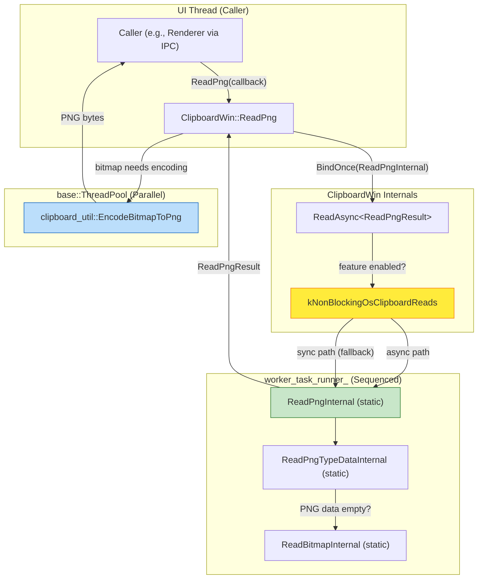
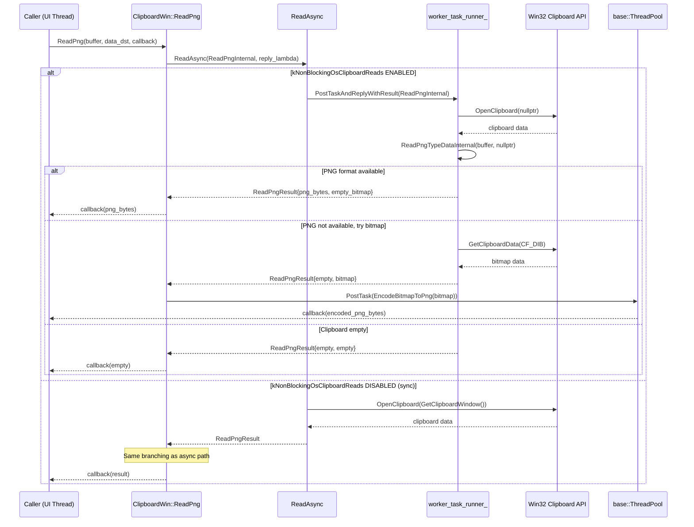
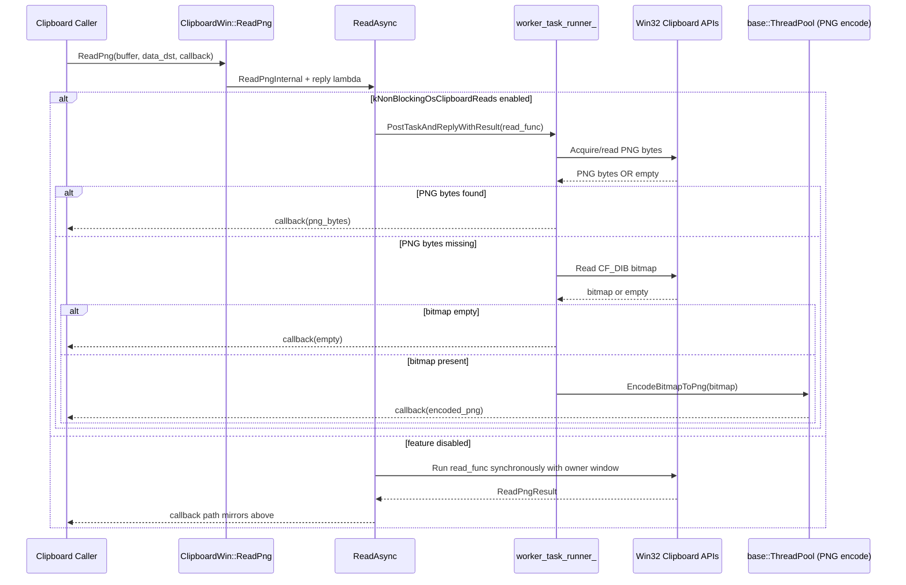

# Hld — Multi-Model Merged Review

> **Models**: claude-opus-4.6-fast, gpt-5.3-codex  
> **Models reporting**: 2/2

---

## 📋 Review by **claude-opus-4.6-fast**

# High-Level Design: [Clipboard][Windows] Make ReadPng Non-Blocking and Refactor Internals

**CL:** [7578053](https://chromium-review.googlesource.com/c/chromium/src/+/7578053)
**Author:** Hewro Hewei (ihewro@chromium.org)
**Reviewer:** Thomas Anderson (thomasanderson@chromium.org) — CR+1
**Bug:** [458194647](https://crbug.com/458194647)

---

## 1. Executive Summary

This CL makes `ClipboardWin::ReadPng` non-blocking by routing it through the existing `ReadAsync` infrastructure, which is gated on the `kNonBlockingOsClipboardReads` feature flag. Previously, `ReadPng` was the only read method in `ClipboardWin` that still performed synchronous OS clipboard access on the calling (UI) thread before offloading only the PNG encoding to a thread pool. This was inconsistent with other read methods (`ReadText`, `ReadAsciiText`, `ReadHTML`, `ReadFilenames`, `ReadAvailableTypes`) that already used `ReadAsync`. The change eliminates a potential UI-thread stall when the OS clipboard is slow to respond, while keeping expensive PNG encoding on a separate thread pool (not the serialized worker) to avoid blocking subsequent clipboard reads.

---

## 2. Architecture Overview

### Affected Components

| Component | Role | Change |
|---|---|---|
| `ClipboardWin` (`ui/base/clipboard/clipboard_win.{h,cc}`) | Windows platform clipboard implementation | Core change: `ReadPng` refactored to use `ReadAsync`; internal methods made `static` |
| `Clipboard` (base class, `ui/base/clipboard/clipboard.h`) | Abstract clipboard interface | No change — `ReadPng` virtual signature unchanged |
| `kNonBlockingOsClipboardReads` feature flag | Controls async clipboard behavior | No change — existing flag, now also gates `ReadPng` |
| `clipboard_util::EncodeBitmapToPng` | PNG encoding utility | No change — still used for bitmap→PNG conversion |
| `base::ThreadPool` | Chromium's general-purpose thread pool | No change — still used for PNG encoding (CPU-bound work) |
| `worker_task_runner_` (sequenced) | Serialized task runner for OS clipboard access | No change — now also used for `ReadPng`'s OS access portion |

### Component Diagram



### How It Fits Into Existing Architecture

The `ClipboardWin` class already had a well-established pattern for non-blocking reads via the `ReadAsync<Result>` template method (introduced for `ReadText`, `ReadAsciiText`, `ReadHTML`, `ReadFilenames`, and `ReadAvailableTypes`). `ReadPng` was the notable outlier — it accessed the OS clipboard synchronously on the UI thread and only posted the PNG encoding step to a thread pool. This CL aligns `ReadPng` with the existing pattern, making all clipboard read methods consistently non-blocking when the feature flag is enabled.

---

## 3. Design Goals & Non-Goals

### Goals

1. **Make `ReadPng` non-blocking**: Move OS clipboard access (Win32 `OpenClipboard`/`GetClipboardData`) off the UI thread when `kNonBlockingOsClipboardReads` is enabled.
2. **Maintain consistency**: Align `ReadPng` with the `ReadAsync` pattern already used by all other clipboard read methods.
3. **Preserve encoding isolation**: Keep PNG encoding (`EncodeBitmapToPng`) on `base::ThreadPool` rather than the serialized `worker_task_runner_`, so a slow encoding operation does not block subsequent clipboard reads (e.g., `ReadText`).
4. **Refactor internals**: Split the monolithic `ReadPngInternal` into `ReadPngTypeDataInternal` (reads raw PNG clipboard format) and `ReadBitmapInternal` (reads DIB bitmap), both as static methods compatible with `ReadAsync`.

### Non-Goals

- **Changing the `Clipboard` base class interface**: The virtual `ReadPng` signature remains unchanged.
- **Modifying other platform implementations**: Only the Windows clipboard is affected.
- **Changing the feature flag behavior**: `kNonBlockingOsClipboardReads` semantics and rollout are unchanged.
- **Optimizing PNG encoding performance**: The encoding step itself is not modified.
- **Adding new clipboard format support**: No new formats are introduced.

---

## 4. System Interactions

### Data Flow

When a consumer (e.g., renderer process via Mojo IPC → `ClipboardHost`) calls `ReadPng`:

1. `ClipboardWin::ReadPng` invokes `ReadAsync` with `ReadPngInternal` as the read function.
2. `ReadAsync` checks the `kNonBlockingOsClipboardReads` feature flag:
   - **Disabled (sync path)**: Calls `ReadPngInternal` immediately on the current thread with `GetClipboardWindow()` as the owner.
   - **Enabled (async path)**: Posts `ReadPngInternal` to `worker_task_runner_` with `nullptr` as owner (no window needed for async clipboard access).
3. `ReadPngInternal` attempts to read PNG data from the clipboard. If unavailable, falls back to reading a DIB bitmap.
4. The reply callback examines the `ReadPngResult`:
   - If PNG bytes are available → returns them directly.
   - If a bitmap was read → posts `EncodeBitmapToPng` to `base::ThreadPool` for encoding, then returns the encoded PNG.
   - If both are empty → returns an empty vector.

### Sequence Diagram



### IPC/Mojo Interactions

This CL does not directly modify any Mojo interfaces. The `ReadPng` method is invoked by `ClipboardHost` (in `content/browser/clipboard/clipboard_host_impl.cc`) which handles the Mojo IPC bridge between renderer and browser processes. The callback-based signature of `ReadPng` already supports asynchronous completion, so no IPC changes are needed.

---

## 5. API & Interface Changes

### New Internal Interfaces

| Method | Signature | Description |
|---|---|---|
| `ReadPngTypeDataInternal` | `static std::vector<uint8_t> ReadPngTypeDataInternal(ClipboardBuffer, HWND)` | Reads raw PNG-format data from the clipboard. Extracted from the former `ReadPngInternal`. |
| `ReadPngResult` (type alias) | `using ReadPngResult = std::pair<std::vector<uint8_t>, SkBitmap>` | Return type for `ReadPngInternal` — carries both PNG bytes and bitmap fallback. |

### Modified Internal Interfaces

| Method | Before | After |
|---|---|---|
| `ReadPngInternal` | `std::vector<uint8_t> ReadPngInternal(ClipboardBuffer) const` (instance method) | `static ReadPngResult ReadPngInternal(ClipboardBuffer, const std::optional<DataTransferEndpoint>&, HWND)` (static, returns pair) |
| `ReadBitmapInternal` | `SkBitmap ReadBitmapInternal(ClipboardBuffer) const` (instance method) | `static SkBitmap ReadBitmapInternal(ClipboardBuffer, HWND)` (static, takes HWND) |

### Unchanged Public Interfaces

| Method | Signature |
|---|---|
| `ReadPng` (virtual override) | `void ReadPng(ClipboardBuffer, const std::optional<DataTransferEndpoint>&, ReadPngCallback) const override` |

The public `ReadPng` signature is unchanged. All changes are internal implementation details.

### Deprecated Interfaces

None.

---

## 6. Dependencies

### What This Code Depends On

| Dependency | Location | Usage |
|---|---|---|
| `features::kNonBlockingOsClipboardReads` | `ui/base/clipboard/clipboard_features.h` | Feature flag gating async behavior |
| `ReadAsync<Result>` template | `clipboard_win.cc` (L1076–1090) | Dispatches read operations sync or async based on feature flag |
| `worker_task_runner_` | `ClipboardWin` member | Sequenced task runner for OS clipboard access |
| `base::ThreadPool` | `base/task/thread_pool.h` | Used for CPU-bound PNG encoding |
| `clipboard_util::EncodeBitmapToPng` | `ui/base/clipboard/clipboard_util.h` | Bitmap-to-PNG encoding |
| Win32 Clipboard API | OS | `OpenClipboard`, `GetClipboardData`, `GlobalLock` |
| `ScopedClipboard` | `ui/base/clipboard/scoped_clipboard_writer.h` | RAII wrapper for clipboard open/close |

### What Depends On This Code

| Dependent | Location | Impact |
|---|---|---|
| `ClipboardHost` | `content/browser/clipboard/clipboard_host_impl.cc` | Calls `ReadPng` — no change needed (already callback-based) |
| `ClipboardWin` unit tests | `clipboard_win_unittest.cc` | Two new tests added for async `ReadPng` |
| Other consumers of `Clipboard::ReadPng` | Various | No impact — public API unchanged |

### Compatibility

- **Backward compatible**: The sync path (feature disabled) behaves identically to the previous implementation.
- **No version/ABI concerns**: All changes are internal to `ClipboardWin`.

---

## 7. Risks & Mitigations

### Risk 1: Race conditions with async clipboard access
**Risk**: When `kNonBlockingOsClipboardReads` is enabled, clipboard access happens on `worker_task_runner_` with `owner_window=nullptr`. Concurrent clipboard mutations could produce inconsistent reads.
**Mitigation**: The `worker_task_runner_` is a **sequenced** task runner, serializing all clipboard reads. Both PNG data read and bitmap fallback read happen within the same task, ensuring atomicity within a single `ReadPngInternal` call. This is the same pattern used by all other read methods.

### Risk 2: PNG encoding blocking the worker
**Risk (addressed by review feedback)**: An earlier patch set ran PNG encoding on `worker_task_runner_`, which would block subsequent clipboard reads during encoding.
**Mitigation**: The final patch set keeps `EncodeBitmapToPng` on `base::ThreadPool` (not `worker_task_runner_`), ensuring the serialized worker remains available for other read operations. This was raised in review by Rohan Raja and addressed by the author.

### Risk 3: `RecordRead` called on worker thread
**Risk**: `RecordRead(ClipboardFormatMetric::kPng)` is now called inside `ReadPngInternal` which runs on the worker thread when async is enabled. Previously it was called on the UI thread.
**Mitigation**: `RecordRead` uses thread-safe UMA histogram macros, so this is safe. Other read methods (e.g., `ReadTextInternal`) already call `RecordRead` from the worker thread in the same manner.

### Risk 4: Build failure with Chromium style checker
**Risk**: The `ReadPngResult` struct (originally defined as a struct with non-trivial members) triggered Chromium's style checker requiring out-of-line constructors/destructors.
**Mitigation**: Resolved in patch set 17 by using `std::pair<std::vector<uint8_t>, SkBitmap>` type alias instead of a custom struct. The CQ dry run passed.

### Backward Compatibility

- **Feature flag disabled**: Behavior is identical to pre-CL behavior (synchronous read on UI thread).
- **Feature flag enabled**: OS clipboard access moves to worker thread; PNG encoding stays on thread pool. No behavioral change from caller's perspective — callback is invoked with the same data.

### Migration Strategy

No migration needed. The change is transparent to all callers of `Clipboard::ReadPng`.

---

## 8. Testing Strategy

### New Tests Added

| Test | File | Description |
|---|---|---|
| `ReadPngAsyncReturnsWrittenData` | `/workspace/cr1/src/ui/base/clipboard/clipboard_win_unittest.cc#L399` | Writes a bitmap to the clipboard via `ScopedClipboardWriter`, reads it back via `ReadPng`, and asserts non-empty PNG data is returned. Exercises the bitmap→PNG encoding fallback path. |
| `ReadPngAsyncEmptyClipboard` | `/workspace/cr1/src/ui/base/clipboard/clipboard_win_unittest.cc#L414` | Clears the clipboard and verifies `ReadPng` returns an empty vector. Exercises the empty-clipboard path. |

### Test Coverage Assessment

| Path | Covered? | How |
|---|---|---|
| PNG data directly available on clipboard | ❌ Not directly tested | Would require placing raw PNG data on the clipboard (not via `ScopedClipboardWriter`). Existing tests may cover this indirectly. |
| Bitmap fallback → PNG encoding | ✅ | `ReadPngAsyncReturnsWrittenData` — `WriteImage` writes a bitmap, forcing the fallback path |
| Empty clipboard | ✅ | `ReadPngAsyncEmptyClipboard` |
| Sync path (feature disabled) | ⚠️ Implicit | Tests run with default feature state. If `kNonBlockingOsClipboardReads` is disabled by default, these test the sync path. A parameterized test covering both states would be ideal. |
| Async path (feature enabled) | ⚠️ Depends on flag | Same as above — depends on default feature state |

### Recommendations

1. **Parameterized tests**: Consider adding `INSTANTIATE_TEST_SUITE_P` with `kNonBlockingOsClipboardReads` enabled/disabled to ensure both sync and async paths are explicitly tested.
2. **Direct PNG clipboard test**: A test that places raw PNG data on the clipboard (bypassing bitmap fallback) would exercise the `ReadPngTypeDataInternal` → direct-return path.
3. **Existing test coverage**: The existing `ClipboardWinTest` suite covers other async read methods (`ReadTextAsync`, `ReadAvailableTypesAsync`), providing confidence in the shared `ReadAsync` infrastructure.


---

## 📋 Review by **gpt-5.3-codex**

# High-Level Design: CL 7578053 — [Clipboard][Windows] Make ReadPng non-blocking and refactor internals

## 1. Executive Summary
This CL makes Windows clipboard `ReadPng` follow the same non-blocking read architecture already used by other async clipboard reads, gated by `features::kNonBlockingOsClipboardReads` (`/workspace/cr1/src/ui/base/clipboard/clipboard_win.cc#L725`, `/workspace/cr1/src/ui/base/clipboard/clipboard_win.cc#L1077`, `/workspace/cr1/src/ui/base/ui_base_features.cc#L409`). It is needed to avoid UI-thread blocking on OS clipboard access and to better separate PNG-byte retrieval from bitmap fallback/encoding work (`/workspace/cr1/src/ui/base/clipboard/clipboard_win.cc#L1094`, `/workspace/cr1/src/ui/base/clipboard/clipboard_win.cc#L1112`). Expected impact is reduced UI jank risk for image paste reads on Windows with behavior preserved via feature-gated synchronous fallback and unchanged public `Clipboard` API surface.

## 2. Architecture Overview
### Affected Components
- Windows clipboard backend: `ClipboardWin` internals in `/workspace/cr1/src/ui/base/clipboard/clipboard_win.cc` and `/workspace/cr1/src/ui/base/clipboard/clipboard_win.h`.
- Feature gate: `kNonBlockingOsClipboardReads` in `/workspace/cr1/src/ui/base/ui_base_features.h#L250` and `/workspace/cr1/src/ui/base/ui_base_features.cc#L409`.
- Windows clipboard unit tests: `/workspace/cr1/src/ui/base/clipboard/clipboard_win_unittest.cc#L399`.

### Fit in Existing Architecture
`ClipboardWin` already has a generic `ReadAsync` helper used by `ReadText`, `ReadHTML`, `ReadAvailableTypes`, etc. This CL aligns `ReadPng` with that pattern by moving OS clipboard reads onto the worker task runner when the feature is enabled, while keeping CPU-heavy PNG encoding on `base::ThreadPool` (`/workspace/cr1/src/ui/base/clipboard/clipboard_win.cc#L739`).

```mermaid
graph TD
  Caller[Clipboard consumer\n(UI/Blink/browser code)] --> ClipboardAPI[Clipboard::ReadPng API]
  ClipboardAPI --> CW[ClipboardWin::ReadPng\nclipboard_win.cc#L725]
  CW --> RA[ClipboardWin::ReadAsync\nclipboard_win.cc#L1077]
  RA -->|Feature ON| Worker[worker_task_runner_\nsequenced MayBlock queue]
  RA -->|Feature OFF| UIThread[Caller/UI thread path]
  Worker --> RPI[ReadPngInternal\nclipboard_win.cc#L1094]
  UIThread --> RPI
  RPI --> PNGRead[ReadPngTypeDataInternal\nWin32 clipboard PNG format]
  RPI --> BMPRead[ReadBitmapInternal\nCF_DIB fallback]
  BMPRead --> Encode[clipboard_util::EncodeBitmapToPng\nbase::ThreadPool]
  PNGRead --> Callback[ReadPng callback]
  Encode --> Callback
```

## 3. Design Goals & Non-Goals
### Goals
- Make Windows `ReadPng` non-blocking under `kNonBlockingOsClipboardReads` (`/workspace/cr1/src/ui/base/clipboard/clipboard_win.cc#L728`).
- Reuse unified async read plumbing (`ReadAsync`) for consistency with other read methods.
- Refactor PNG read internals into explicit steps:
  - read native PNG format bytes first,
  - then fallback bitmap read,
  - then optional async PNG encoding.
- Preserve existing behavior when the feature is disabled (sync fallback in `ReadAsync`).

### Non-Goals
- No cross-platform clipboard behavior changes (Windows-only backend touched).
- No new Mojo/IPC protocol or clipboard API contract changes.
- No change to clipboard write paths or monitor notifications.

## 4. System Interactions
`ReadPng` now delegates clipboard acquisition/read to `ReadAsync`, which either executes directly on the caller sequence (feature disabled) or posts to `worker_task_runner_` (feature enabled). OS interaction remains through Win32 clipboard APIs in `ReadPngTypeDataInternal` and `ReadBitmapInternal` (`/workspace/cr1/src/ui/base/clipboard/clipboard_win.cc#L1112`, `/workspace/cr1/src/ui/base/clipboard/clipboard_win.cc#L1136`). If PNG bytes are unavailable but bitmap data exists, encoding is still offloaded to `base::ThreadPool` before returning callback data (`/workspace/cr1/src/ui/base/clipboard/clipboard_win.cc#L739`).



**IPC/Mojo note:** This CL does not introduce or modify Mojo/IPC surfaces; it is an in-process backend implementation change.

## 5. API & Interface Changes
### Public Interfaces
- **No change** to public `Clipboard` interface signature for `ReadPng` (`/workspace/cr1/src/ui/base/clipboard/clipboard.h#L229`).

### Modified Internal Interfaces
- `ClipboardWin::ReadPng` implementation now uses `ReadAsync` path (`/workspace/cr1/src/ui/base/clipboard/clipboard_win.cc#L725`).
- Introduced internal alias:
  - `using ReadPngResult = std::pair<std::vector<uint8_t>, SkBitmap>;`
  - `/workspace/cr1/src/ui/base/clipboard/clipboard_win.h#L184`
- Refactored internals:
  - `ReadPngInternal(buffer, data_dst, owner_window)` now static and returns `ReadPngResult` (`/workspace/cr1/src/ui/base/clipboard/clipboard_win.h#L185`, `/workspace/cr1/src/ui/base/clipboard/clipboard_win.cc#L1094`).
  - Added `ReadPngTypeDataInternal(...)` for PNG native format retrieval (`/workspace/cr1/src/ui/base/clipboard/clipboard_win.h#L189`, `/workspace/cr1/src/ui/base/clipboard/clipboard_win.cc#L1112`).
  - `ReadBitmapInternal(...)` now static and takes `owner_window` (`/workspace/cr1/src/ui/base/clipboard/clipboard_win.h#L191`, `/workspace/cr1/src/ui/base/clipboard/clipboard_win.cc#L1136`).

### Deprecated Interfaces
- None.

## 6. Dependencies
### Direct Dependencies
- Feature framework: `base::FeatureList`, `features::kNonBlockingOsClipboardReads`.
- Tasking primitives: `base::SequencedTaskRunner` (`worker_task_runner_`), `base::ThreadPool::PostTaskAndReplyWithResult`.
- Windows clipboard APIs (`ScopedClipboard`, `GetClipboardData`, `CF_DIB`, PNG format registration path).
- PNG encoding utility: `clipboard_util::EncodeBitmapToPng`.

### Upstream/Downstream Dependents
- Depends on callers using `Clipboard::ReadPng` callback-based contract.
- Downstream consumers (paste/image read flows) remain contract-compatible because callback output type and semantics are unchanged.

### Version/Compatibility
- Feature is currently enabled by default (`/workspace/cr1/src/ui/base/ui_base_features.cc#L409`), but guarded fallback keeps compatibility if disabled at runtime.

## 7. Risks & Mitigations
- **Risk: Latency/queue contention on clipboard worker queue.**
  - **Mitigation:** Keep bitmap-to-PNG encoding on general `ThreadPool` rather than serialized clipboard worker (`/workspace/cr1/src/ui/base/clipboard/clipboard_win.cc#L739`).
- **Risk: Behavior drift between enabled vs disabled feature paths.**
  - **Mitigation:** Single `ReadAsync` abstraction preserves equivalent read logic and callback shaping in both paths (`/workspace/cr1/src/ui/base/clipboard/clipboard_win.cc#L1077`).
- **Risk: Empty/invalid clipboard data edge cases.**
  - **Mitigation:** Explicit empty checks for PNG bytes and `drawsNothing()` bitmap path return empty vector safely (`/workspace/cr1/src/ui/base/clipboard/clipboard_win.cc#L731`, `/workspace/cr1/src/ui/base/clipboard/clipboard_win.cc#L735`).
- **Backward compatibility:** No API-breaking changes; migration is runtime-flag controlled and transparent to callers.

## 8. Testing Strategy
### Added Coverage in CL
- `ReadPngAsyncReturnsWrittenData` validates async callback receives non-empty PNG bytes after writing an image (`/workspace/cr1/src/ui/base/clipboard/clipboard_win_unittest.cc#L399`).
- `ReadPngAsyncEmptyClipboard` validates empty clipboard returns empty result (`/workspace/cr1/src/ui/base/clipboard/clipboard_win_unittest.cc#L414`).

### Existing Coverage Leveraged
- Existing Windows clipboard read tests around async text/types continue to exercise shared `ReadAsync` machinery (`/workspace/cr1/src/ui/base/clipboard/clipboard_win.cc#L426`, `/workspace/cr1/src/ui/base/clipboard/clipboard_win.cc#L445`).

### Recommended Validation Scope
- Run `clipboard_win_unittest` on Windows builders with default feature config.
- (Optional hardening) add explicit feature-toggle tests for `kNonBlockingOsClipboardReads` enabled/disabled parity for `ReadPng` behavior.


---

## 🔀 Cross-Model Summary

This document merges reviews from **2** models: claude-opus-4.6-fast, gpt-5.3-codex.

### Model Coverage

| Model | Contributed |
|-------|------------|
| claude-opus-4.6-fast | ✅ Yes |
| gpt-5.3-codex | ✅ Yes |
