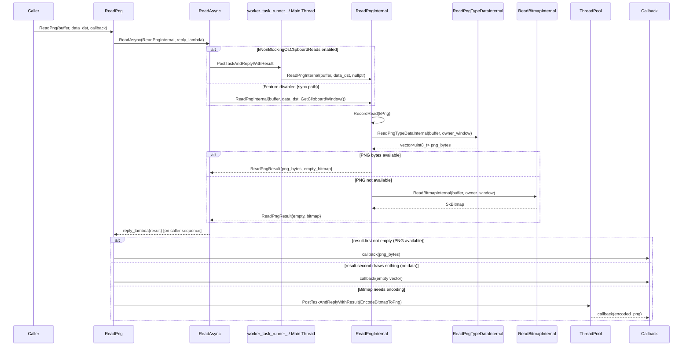
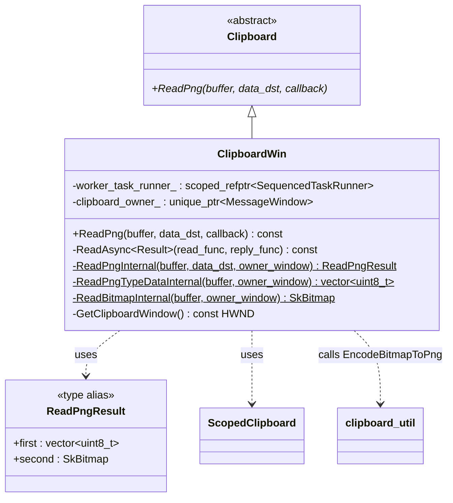
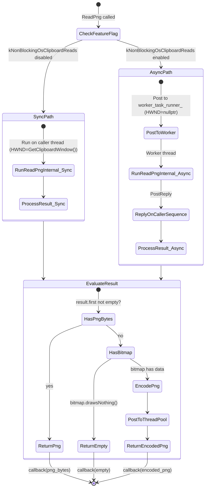
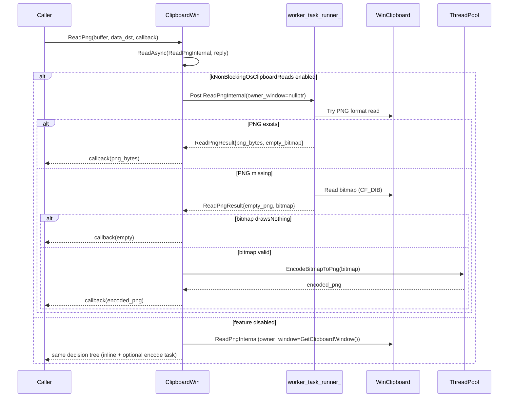
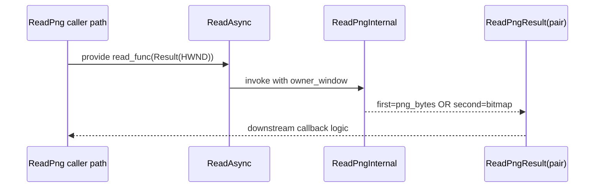
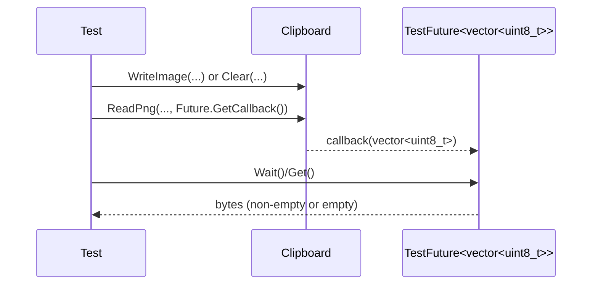
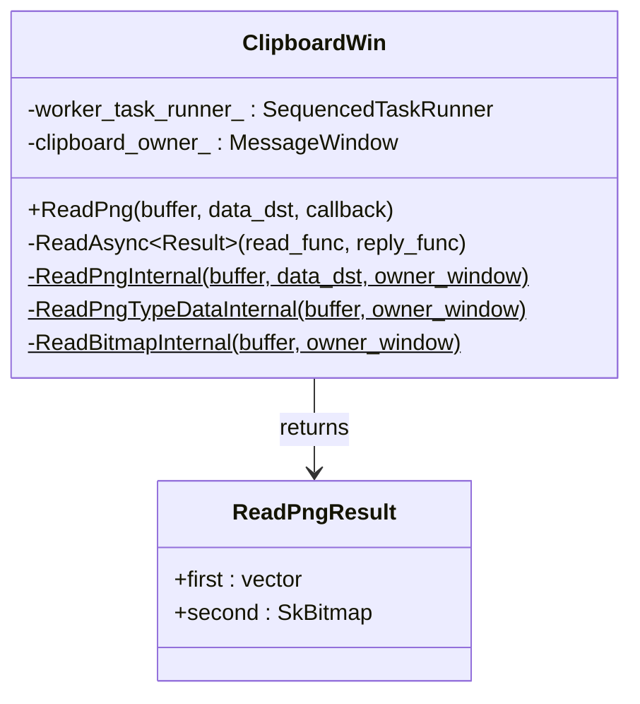
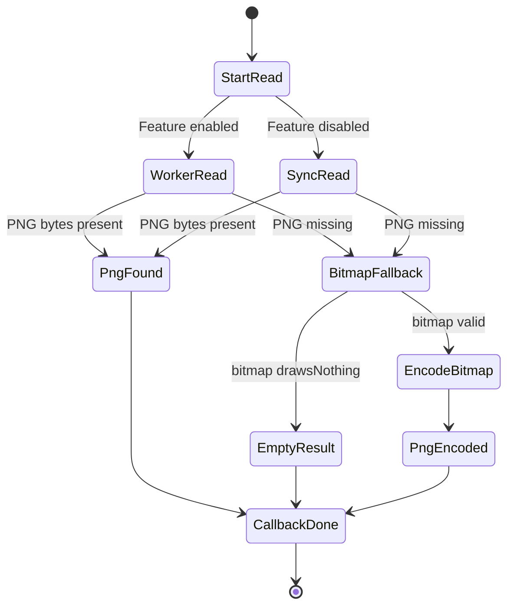

# Lld — Multi-Model Merged Review

> **Models**: claude-opus-4.6-fast, gpt-5.3-codex  
> **Models reporting**: 2/2

---

## 📋 Review by **claude-opus-4.6-fast**

# Low-Level Design: CL 7578053

## [Clipboard][Windows] Make ReadPng non-blocking and refactor internals

**CL URL:** https://chromium-review.googlesource.com/c/chromium/src/+/7578053
**Owner:** Hewro Hewei (ihewro@chromium.org)
**Bug:** 458194647

---

## 1. File-by-File Analysis

### 1.1 `ui/base/clipboard/clipboard_win.h`

**Purpose of changes:** Introduce a new `ReadPngResult` type alias and refactor internal PNG/Bitmap read methods to be `static`, enabling them to run on a worker thread via the existing `ReadAsync` infrastructure.

**Key modifications:**
- Added `#include <utility>` for `std::pair`.
- Introduced `using ReadPngResult = std::pair<std::vector<uint8_t>, SkBitmap>` type alias.
- Changed `ReadPngInternal` from a non-static `const` method (taking only `ClipboardBuffer`) to a `static` method taking `(ClipboardBuffer, optional<DataTransferEndpoint>&, HWND)`.
- Added new `static` method `ReadPngTypeDataInternal(ClipboardBuffer, HWND)` — extracted from the old `ReadPngInternal`.
- Changed `ReadBitmapInternal` from a non-static `const` method to a `static` method taking `(ClipboardBuffer, HWND)`.

**New/Modified Functions:**

| Function | Purpose | Parameters | Returns | Change Type |
|----------|---------|------------|---------|-------------|
| `ReadPngInternal` | Reads PNG data, falls back to bitmap | `ClipboardBuffer buffer, const optional<DataTransferEndpoint>& data_dst, HWND owner_window` | `ReadPngResult` (pair of PNG bytes + SkBitmap) | Signature changed: non-static→static, new params, new return type |
| `ReadPngTypeDataInternal` | Reads raw PNG clipboard format bytes | `ClipboardBuffer buffer, HWND owner_window` | `std::vector<uint8_t>` | **New** — extracted from old `ReadPngInternal` |
| `ReadBitmapInternal` | Reads bitmap from clipboard as DIB | `ClipboardBuffer buffer, HWND owner_window` | `SkBitmap` | Signature changed: non-static→static, added `HWND` param |

**Data Structures:**

```
using ReadPngResult = std::pair<std::vector<uint8_t>, SkBitmap>;
// first:  PNG bytes from clipboard (if CF_PNG format is available)
// second: SkBitmap fallback (if PNG not available, read CF_DIB instead)
```

This follows the same pattern as `ReadHTMLResult` (line 163-168 in the header) but uses `std::pair` instead of a named struct. The comment `// first: PNG bytes (if available), second: bitmap fallback.` documents the semantics.

---

### 1.2 `ui/base/clipboard/clipboard_win.cc`

**Purpose of changes:** Refactor `ReadPng` to use the `ReadAsync` pattern (gated on `kNonBlockingOsClipboardReads` feature flag), moving OS clipboard access off the main thread. PNG encoding is kept on `base::ThreadPool` to avoid blocking the serialized `worker_task_runner_`.

**Key modifications:**
- **`ReadPng` (public method, lines 725-747):** Completely rewritten to use `ReadAsync` instead of direct synchronous clipboard access.
- **`ReadPngInternal` (static, lines 1092-1109):** New orchestrator that calls `ReadPngTypeDataInternal` then conditionally `ReadBitmapInternal`. Moved `RecordRead` into this function.
- **`ReadPngTypeDataInternal` (static, lines 1111-1133):** Extracted from the old `ReadPngInternal`—handles raw PNG format acquisition from clipboard.
- **`ReadBitmapInternal` (static, lines 1135-1157+):** Changed from non-static `const` to `static`, now takes `HWND owner_window` instead of using `GetClipboardWindow()`.

#### `ReadPng` — Detailed Logic

**Before (synchronous):**
```
ReadPng() {
  RecordRead(kPng)
  data = ReadPngInternal(buffer)          // blocks main thread
  if (!data.empty()) → callback(data)
  else {
    bitmap = ReadBitmapInternal(buffer)    // blocks main thread
    ThreadPool::PostTask(EncodeBitmapToPng(bitmap), callback)
  }
}
```

**After (async-capable):**
```
ReadPng() {
  ReadAsync(
    read_func = ReadPngInternal(buffer, data_dst, HWND),  // runs on worker or main
    reply_func = lambda(ReadPngResult result) {
      if (result.first not empty) → callback(result.first)
      elif (result.second draws nothing) → callback(empty)
      else → ThreadPool::PostTask(EncodeBitmapToPng(result.second), callback)
    }
  )
}
```

**New/Modified Functions:**

| Function | Purpose | Parameters | Returns |
|----------|---------|------------|---------|
| `ReadPng` | Public entry point for PNG reading | `ClipboardBuffer, optional<DTE>&, ReadPngCallback` | `void` |
| `ReadPngInternal` | Static worker: reads PNG or bitmap from clipboard | `ClipboardBuffer, optional<DTE>&, HWND` | `ReadPngResult` |
| `ReadPngTypeDataInternal` | Static: reads raw CF_PNG data | `ClipboardBuffer, HWND` | `vector<uint8_t>` |
| `ReadBitmapInternal` | Static: reads CF_DIB bitmap | `ClipboardBuffer, HWND` | `SkBitmap` |

**Data Flow:**



---

### 1.3 `ui/base/clipboard/clipboard_win_unittest.cc`

**Purpose of changes:** Add two new tests for the async `ReadPng` path, following the existing test patterns for `ReadText`, `ReadAsciiText`, `ReadAvailableTypes`, etc.

**Key modifications:**
- Added `ReadPngAsyncReturnsWrittenData`: Writes a 2×3 bitmap via `ScopedClipboardWriter`, reads it back via `ReadPng`, verifies non-empty PNG output.
- Added `ReadPngAsyncEmptyClipboard`: Clears the clipboard, reads via `ReadPng`, verifies empty output.

**New Tests:**

| Test Name | Scenario | Setup | Assertion |
|-----------|----------|-------|-----------|
| `ReadPngAsyncReturnsWrittenData` | Write bitmap, read back as PNG | `ScopedClipboardWriter::WriteImage(CreateBitmap(2,3))` | `png.size() > 0` |
| `ReadPngAsyncEmptyClipboard` | Read PNG from empty clipboard | `clipboard->Clear(kCopyPaste)` | `png_future.Get().empty()` |

Both tests use `base::test::TestFuture` for async callback handling, consistent with existing tests in this file (`ReadTextAsyncReturnsWrittenData`, `ReadAvailableTypesAsyncReturnsWrittenData`, etc.).

---

## 2. Class Diagram



---

## 3. State Diagram — ReadPng Execution



---

## 4. Implementation Concerns

### 4.1 Thread Safety

- **`RecordRead` called from worker thread:** `RecordRead(ClipboardFormatMetric::kPng)` is now called inside `ReadPngInternal`, which runs on `worker_task_runner_` when the feature is enabled. This is consistent with other `ReadXxxInternal` methods (e.g., `ReadAsciiTextInternal` at line 587 also calls `RecordRead` and is invoked via `ReadAsync`). `RecordRead` records UMA histograms which are thread-safe, so this is correct.

- **`worker_task_runner_` is serialized:** The `worker_task_runner_` is a `SequencedTaskRunner`, ensuring only one clipboard read runs at a time. The PNG encoding is correctly kept off this runner (uses `base::ThreadPool`), so subsequent clipboard reads aren't blocked by encoding — this was a specific reviewer concern that was addressed.

- **Static methods:** All internal methods (`ReadPngInternal`, `ReadPngTypeDataInternal`, `ReadBitmapInternal`) are `static` and don't access `this`, making them safe to run on any thread. They only access the clipboard via the `HWND` parameter.

### 4.2 Memory Management

- **`ReadPngResult` uses `std::pair<vector<uint8_t>, SkBitmap>`:** When PNG bytes are found, the `SkBitmap` in `.second` is default-constructed (empty). When falling back to bitmap, the `vector<uint8_t>` in `.first` is empty. This avoids unnecessary data copying, but both fields are always present in memory. The overhead of an empty `SkBitmap` or empty `vector` is minimal (stack-allocated metadata only).

- **`std::move(result.second)` in the lambda:** The bitmap is moved into `EncodeBitmapToPng`, avoiding a potentially expensive copy of pixel data.

### 4.3 Performance Implications

- **Positive:** The main/UI thread is no longer blocked by OS clipboard access for PNG reads when `kNonBlockingOsClipboardReads` is enabled. Previously, `ReadPng` would synchronously call `ReadPngInternal` + `ReadBitmapInternal` on the calling thread before dispatching encoding to the thread pool.

- **PNG encoding stays on ThreadPool:** This is a deliberate design choice (per reviewer feedback). The serialized `worker_task_runner_` is only used for OS clipboard access, not for CPU-intensive PNG encoding. This prevents encoding from delaying other queued clipboard reads.

### 4.4 `HWND` Parameter Semantics

- **Sync path:** `GetClipboardWindow()` is passed, providing a valid HWND for `ScopedClipboard::Acquire`.
- **Async path:** `nullptr` is passed. This is consistent with other `ReadAsync` callers. The `ScopedClipboard::Acquire(nullptr)` call should still work on Windows (opens clipboard without an owner window), though it may have different behavior in edge cases (e.g., clipboard ownership conflicts).

### 4.5 Maintainability

- **`std::pair` vs named struct:** `ReadPngResult` uses `std::pair` with `.first` / `.second` access. A named struct with descriptive fields (e.g., `png_bytes`, `bitmap_fallback`) would be more readable. The CL originally used a struct but switched to `std::pair` to avoid Chromium style checker errors about needing out-of-line constructors/destructors for complex structs (as seen in the build failure on patch set 16). The `using` alias with a comment is a reasonable compromise.

---

## 5. Suggestions for Improvement

### 5.1 Consider a Named Struct with Out-of-Line Constructor/Destructor

The `std::pair<std::vector<uint8_t>, SkBitmap>` works but `.first` / `.second` are less readable than named fields. The build failure on patch set 16 required out-of-line constructor/destructor for the struct — this is easy to add:

```cpp
// In header:
struct ReadPngResult {
  std::vector<uint8_t> png_bytes;
  SkBitmap bitmap_fallback;
  ReadPngResult();
  ~ReadPngResult();
  ReadPngResult(ReadPngResult&&);
  ReadPngResult& operator=(ReadPngResult&&);
};

// In .cc:
ClipboardWin::ReadPngResult::ReadPngResult() = default;
ClipboardWin::ReadPngResult::~ReadPngResult() = default;
ClipboardWin::ReadPngResult::ReadPngResult(ReadPngResult&&) = default;
ClipboardWin::ReadPngResult& ClipboardWin::ReadPngResult::operator=(ReadPngResult&&) = default;
```

This would make call sites like `result.png_bytes` and `result.bitmap_fallback` self-documenting instead of relying on comments.

### 5.2 Test Coverage

The two new tests cover the happy path (bitmap → PNG encoding) and empty clipboard case. Consider adding:
- A test where raw PNG format data is written directly (covering the `result.first` non-empty path).
- A test verifying the actual PNG output can be decoded back to the original bitmap dimensions.

### 5.3 Minor: Consistent Brace Style

The changes add braces to single-line `if` statements in `ReadPngTypeDataInternal` and `ReadBitmapInternal` (e.g., `if (!clipboard.Acquire(owner_window)) { return ...; }`), which is good Chromium style. However, existing adjacent code in the same functions still uses the brace-less form (`if (!data) return ...`). For consistency within these now-modified functions, the remaining single-line conditionals could also get braces, though this is very minor.

### 5.4 `data_dst` Parameter

The `data_dst` parameter is passed through to `ReadPngInternal` but never used (only forwarded, never read). The comment `// |data_dst| is not used, but is kept as it may be used in the future.` explains this. This is consistent with how other `ReadXxxInternal` functions handle `data_dst` on Windows. No action needed, but worth noting for future cleanup.


---

## 📋 Review by **gpt-5.3-codex**

# Low-Level Design Review — CL 7578053

## 1. File-by-File Analysis

#### `ui/base/clipboard/clipboard_win.cc`
**Purpose of changes**: Make `ReadPng` follow the non-blocking clipboard-read architecture and split PNG-specific vs bitmap-fallback internals.

**Key modifications**:
- `ReadPng()` now uses `ReadAsync(...)` instead of direct synchronous clipboard calls.
- Added a two-phase async flow: read PNG bytes / bitmap fallback first, then PNG-encode bitmap on `ThreadPool` only when needed.
- Refactored internals: `ReadPngInternal` now returns both possible outcomes (`PNG bytes`, `SkBitmap`) and takes `owner_window`.
- Extracted `ReadPngTypeDataInternal(...)` to isolate direct PNG-format read (`ClipboardFormatType::PngType()`).
- `ReadBitmapInternal(...)` converted to static helper with explicit `owner_window` argument.

**New/Modified Functions**:
| Function | Purpose | Parameters | Returns |
|----------|---------|------------|---------|
| `ClipboardWin::ReadPng` | Entry point for PNG read; dispatches through async read pipeline | `ClipboardBuffer buffer`, `optional<DataTransferEndpoint> data_dst`, `ReadPngCallback callback` | `void` |
| `ClipboardWin::ReadPngInternal` (static) | Read PNG format data first; if absent, read bitmap fallback | `ClipboardBuffer buffer`, `optional<DataTransferEndpoint> data_dst`, `HWND owner_window` | `ReadPngResult` (`pair<vector<uint8_t>, SkBitmap>`) |
| `ClipboardWin::ReadPngTypeDataInternal` (static) | Read raw PNG bytes from OS clipboard format | `ClipboardBuffer buffer`, `HWND owner_window` | `vector<uint8_t>` |
| `ClipboardWin::ReadBitmapInternal` (static, signature changed) | Read CF_DIB bitmap fallback for later PNG encoding | `ClipboardBuffer buffer`, `HWND owner_window` | `SkBitmap` |

**Data Flow**:


#### `ui/base/clipboard/clipboard_win.h`
**Purpose of changes**: Update internal interface to support async-owner-window execution and structured PNG read result.

**Key modifications**:
- Added `#include <utility>` for `std::pair`.
- Added `using ReadPngResult = std::pair<std::vector<uint8_t>, SkBitmap>`.
- Changed `ReadPngInternal` declaration to static, expanded signature with `data_dst` and `HWND owner_window`, and changed return type.
- Added `ReadPngTypeDataInternal(...)` declaration.
- Changed `ReadBitmapInternal(...)` declaration to static with `HWND owner_window`.

**New/Modified Functions**:
| Function | Purpose | Parameters | Returns |
|----------|---------|------------|---------|
| `ReadAsync<Result>` (comment context) | Executes clipboard reads sync or on worker sequence based on feature flag | `OnceCallback<Result(HWND)> read_func`, `OnceCallback<void(Result)> reply_func` | `void` |
| `ReadPngInternal` (static, signature changed) | Produce either direct PNG bytes or bitmap fallback in one result object | `ClipboardBuffer`, `optional<DataTransferEndpoint>`, `HWND` | `ReadPngResult` |
| `ReadPngTypeDataInternal` (static, new) | Read PNG clipboard format directly | `ClipboardBuffer`, `HWND` | `vector<uint8_t>` |
| `ReadBitmapInternal` (static, signature changed) | Read fallback bitmap with explicit owner window | `ClipboardBuffer`, `HWND` | `SkBitmap` |

**Data Flow**:


#### `ui/base/clipboard/clipboard_win_unittest.cc`
**Purpose of changes**: Add async `ReadPng` behavior coverage for both populated and empty clipboard cases.

**Key modifications**:
- Added `ReadPngAsyncReturnsWrittenData` test for success path.
- Added `ReadPngAsyncEmptyClipboard` test for empty-output path.

**New/Modified Functions**:
| Function | Purpose | Parameters | Returns |
|----------|---------|------------|---------|
| `TEST_F(ClipboardWinTest, ReadPngAsyncReturnsWrittenData)` | Validates that async `ReadPng` returns non-empty bytes after writing an image | test fixture, no explicit params | `void` |
| `TEST_F(ClipboardWinTest, ReadPngAsyncEmptyClipboard)` | Validates async `ReadPng` returns empty vector when clipboard is cleared | test fixture, no explicit params | `void` |

**Data Flow**:


## 2. Class Diagram (applicable)


## 3. State Diagram (applicable)


## 4. Implementation Concerns
- **Memory management**: PNG path copies global clipboard bytes into `std::string` then `std::vector<uint8_t>` (double buffering); safe but adds transient allocations.
- **Thread safety**: Async reads pass `owner_window=nullptr` on worker thread, avoiding UI-thread window dependency; callback execution remains on caller sequence through `PostTaskAndReplyWithResult`.
- **Performance**: Positive: OS clipboard read no longer blocks caller when feature enabled; encoding stays on `ThreadPool` to avoid blocking serialized clipboard worker.
- **Maintainability**: Refactor improves separation (`ReadPngTypeDataInternal` vs bitmap fallback) and makes async/sync behavior uniform via `ReadAsync`.

## 5. Suggestions for Improvement
- Replace `ReadPngResult` positional `pair` access (`first`/`second`) with a small named struct to improve readability and reduce misuse risk.
- Add a targeted test for bitmap-fallback branch (PNG format absent, CF_DIB present) to explicitly validate encoding path.
- Consider avoiding intermediate `std::string` in `ReadPngTypeDataInternal` by constructing `std::vector<uint8_t>` directly from locked memory span.


---

## 🔀 Cross-Model Summary

This document merges reviews from **2** models: claude-opus-4.6-fast, gpt-5.3-codex.

### Model Coverage

| Model | Contributed |
|-------|------------|
| claude-opus-4.6-fast | ✅ Yes |
| gpt-5.3-codex | ✅ Yes |
