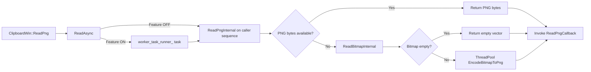

# Review Summary — Multi-Model Merged Review

> **Models**: claude-opus-4.6-fast, gpt-5.3-codex  
> **Models reporting**: 2/2

---

## 📋 Review by **claude-opus-4.6-fast**

# CL 7578053 Review Summary

**CL**: [7578053 — [Clipboard][Windows] Make ReadPng non-blocking and refactor internals](https://chromium-review.googlesource.com/c/chromium/src/+/7578053)
**Author**: Hewro Hewei (ihewro@chromium.org)
**Files Changed**: 3 files, +85/−21 lines
**Bug**: [crbug.com/458194647](https://crbug.com/458194647)

---

## 1. Executive Summary

This CL makes `ClipboardWin::ReadPng` non-blocking by routing it through the existing `ReadAsync` template, which offloads clipboard I/O to a worker thread when the `kNonBlockingOsClipboardReads` feature flag is enabled. To support this, the previously instance-method `ReadPngInternal` and `ReadBitmapInternal` are refactored into static methods that accept an `HWND owner_window` parameter, and a new `ReadPngTypeDataInternal` static helper is extracted to separate PNG-format reading from bitmap-format reading. This follows the established pattern already used by `ReadText`, `ReadAsciiText`, `ReadHTML`, `ReadFilenames`, and `ReadAvailableTypes`.

---

## 2. Design Assessment

### Architecture Quality

| Aspect | Rating (1-5) | Comments |
|--------|--------------|----------|
| Clarity | 4 | Follows the well-established `ReadAsync` pattern used by other clipboard read methods. The two-phase read (PNG then bitmap fallback) is clearly separated. |
| Maintainability | 4 | The refactoring to static methods with explicit `HWND` parameter makes thread-safety guarantees clearer and consistent with sibling methods. |
| Extensibility | 4 | The `ReadPngResult` type alias and the separation of `ReadPngTypeDataInternal` / `ReadBitmapInternal` makes it easy to add new image formats or change fallback behavior. |
| Consistency | 5 | Perfectly consistent with how `ReadText`, `ReadAsciiText`, `ReadHTML`, `ReadFilenames`, and `ReadAvailableTypes` were already converted to use `ReadAsync`. |

### Architecture Diagram

```
┌─────────────────────────────────────────────────────────────────────┐
│                        ClipboardWin::ReadPng                        │
│  (public, called on UI thread)                                      │
└───────────────────┬─────────────────────────────────────────────────┘
                    │
                    ▼
┌─────────────────────────────────────────────────────────────────────┐
│                     ClipboardWin::ReadAsync<ReadPngResult>          │
│  Feature flag: kNonBlockingOsClipboardReads                         │
│  ┌──────────────────────┐    ┌──────────────────────────────┐       │
│  │ Flag DISABLED:       │    │ Flag ENABLED (default):      │       │
│  │ Run synchronously    │    │ Post to worker_task_runner_  │       │
│  │ with GetClipboard    │    │ with owner_window=nullptr    │       │
│  │ Window() as HWND     │    │                              │       │
│  └──────────┬───────────┘    └──────────────┬───────────────┘       │
└─────────────┼───────────────────────────────┼───────────────────────┘
              │                               │
              ▼                               ▼
┌─────────────────────────────────────────────────────────────────────┐
│              ClipboardWin::ReadPngInternal (static)                  │
│  1. RecordRead(kPng)                                                │
│  2. ReadPngTypeDataInternal(buffer, owner_window)                   │
│     └─ Acquires clipboard, reads CF_PNG format                      │
│  3. If PNG empty → ReadBitmapInternal(buffer, owner_window)         │
│     └─ Acquires clipboard, reads CF_DIB format                      │
│  Returns: ReadPngResult = pair<vector<uint8_t>, SkBitmap>           │
└───────────────────┬─────────────────────────────────────────────────┘
                    │
                    ▼
┌─────────────────────────────────────────────────────────────────────┐
│                      Reply callback (UI thread)                     │
│  • If PNG bytes non-empty → return immediately                      │
│  • If bitmap draws nothing → return empty vector                    │
│  • Otherwise → PostTaskAndReply with EncodeBitmapToPng              │
│    (bitmap encoding still happens on ThreadPool)                    │
└─────────────────────────────────────────────────────────────────────┘
```

---

## 3. Implementation Assessment

### Code Quality

| Aspect | Rating (1-5) | Comments |
|--------|--------------|----------|
| Correctness | 4 | Logic is sound. The two-step PNG-then-bitmap fallback is preserved. The bitmap-to-PNG encoding correctly remains on a ThreadPool task. One minor concern: double clipboard acquisition (see findings). |
| Efficiency | 4 | The main UI thread is no longer blocked on clipboard I/O. Bitmap encoding was already async and remains so. The double clipboard acquire/release in `ReadPngInternal` is a minor inefficiency but matches the pre-existing behavior. |
| Readability | 4 | The lambda in `ReadPng` is moderately complex with three branches but is well-structured. The `ReadPngResult` type alias is clean. |
| Test Coverage | 3 | Two new tests cover the happy path (written bitmap data round-trips) and the empty clipboard case. Missing tests for: direct PNG data path, feature flag disabled path, and concurrent read scenarios. |

---

## 4. Key Findings

### Critical Issues (Must Fix)

*None identified.* The CL is well-structured and follows established patterns correctly.

### Major Issues (Should Fix)

1. **Build failure on Patch Set 16**: The CL log shows a compile failure on `win_chromium_compile_dbg_ng`:
   ```
   clipboard_win.h(182,3): error: [chromium-style] Complex class/struct needs
   an explicit out-of-line constructor.
   ```
   The current code uses `using ReadPngResult = std::pair<...>` which should not trigger this linter error (it's a type alias, not a struct). If this was a transient issue from an earlier patchset that used a struct, it should be verified that the latest patch set compiles clean. **Action**: Author should confirm the latest patch set passes CQ.

2. **Double clipboard acquisition in `ReadPngInternal`**: When PNG data is not available, `ReadPngInternal` acquires/releases the clipboard in `ReadPngTypeDataInternal`, then acquires/releases again in `ReadBitmapInternal`. Between these two acquisitions, another process could change the clipboard contents, leading to an inconsistent read (e.g., PNG check sees no PNG, then bitmap read gets a completely different image). However, this matches the pre-existing behavior before this CL, so it is not a regression — but it could be improved in a follow-up.

### Minor Issues (Nice to Fix)

1. **`data_dst` parameter not used**: `ReadPngInternal` accepts `data_dst` but does not use it. The comment says "kept as it may be used in the future." While this is consistent with other internal methods that also carry `data_dst`, the parameter is purely dead code. Consider using `[[maybe_unused]]` annotation for clarity or adding a TODO with a bug reference.

2. **`ReadPngResult` naming**: Using `std::pair<std::vector<uint8_t>, SkBitmap>` with `.first` and `.second` is less readable than a struct with named fields. The existing `ReadHTMLResult` struct pattern provides a good example. This would also match the TODO at line 169 that suggests returning structured results.

3. **Braces added to pre-existing code**: Lines 1119-1121 and 1142-1144 add braces around single-statement `if` bodies in `ReadPngTypeDataInternal` and `ReadBitmapInternal`. While this is good style, these are changes to code that was moved/refactored rather than functionally changed, making the diff slightly noisier.

### Suggestions (Optional)

1. **Consider consolidating clipboard acquisition**: In `ReadPngInternal`, both `ReadPngTypeDataInternal` and `ReadBitmapInternal` independently acquire the clipboard. A future optimization could acquire the clipboard once, check for PNG data, fall back to bitmap, then release — avoiding the TOCTOU window and reducing syscall overhead.

2. **Consider testing with feature flag disabled**: The `kNonBlockingOsClipboardReads` feature is enabled by default, so tests exercise the async path. Adding a parameterized test or explicit test with the feature disabled would verify the synchronous fallback path.

3. **Consider testing PNG format directly**: The current test writes a bitmap via `ScopedClipboardWriter::WriteImage`, which writes CF_DIB format. This means the test always exercises the bitmap fallback path. A test that writes actual PNG data to the clipboard would exercise the `ReadPngTypeDataInternal` path.

---

## 5. Test Coverage Analysis

### Existing Tests
- **`ReadPngAsyncReturnsWrittenData`**: Writes a bitmap to clipboard, reads via `ReadPng`, verifies non-empty PNG data is returned. Exercises the bitmap → PNG encoding fallback path.
- **`ReadPngAsyncEmptyClipboard`**: Clears clipboard, reads via `ReadPng`, verifies empty result.

### Missing Tests
1. **PNG format direct read**: No test writes actual PNG clipboard data (CF_PNG format) to verify the direct PNG path in `ReadPngTypeDataInternal`.
2. **Feature flag disabled path**: No test explicitly disables `kNonBlockingOsClipboardReads` to verify the synchronous execution path for `ReadPng`.
3. **Error handling**: No test for clipboard acquisition failure scenarios.
4. **Concurrent access**: No test verifies behavior when clipboard is modified between PNG and bitmap read attempts.

### Recommended Additional Tests
- Add a test that directly sets PNG-format data on the clipboard and verifies `ReadPng` returns it without bitmap encoding.
- Add a test parameterized on `kNonBlockingOsClipboardReads` enabled/disabled to ensure both code paths work.

---

## 6. Security Considerations

- **Thread safety of `RecordRead`**: `RecordRead` (UMA histogram recording) is called inside `ReadPngInternal`, which now runs on a background thread when the feature flag is enabled. `base::UmaHistogramEnumeration` is thread-safe, so this is not an issue. ✅
- **`owner_window = nullptr` on background thread**: When running on the worker thread, `owner_window` is passed as `nullptr` to `ScopedClipboard::Acquire`. This is the established pattern used by all other async read methods. The Win32 `OpenClipboard(NULL)` call associates the clipboard with the calling task rather than a window, which is appropriate for a background thread. ✅
- **No new IPC or privilege boundaries** are crossed by this change.
- **No user-controlled data parsing** is introduced; existing clipboard data handling is preserved.

**No security concerns identified.**

---

## 7. Performance Considerations

- **Positive impact**: The primary goal of this CL — making `ReadPng` non-blocking — is a performance improvement. Clipboard I/O (especially bitmap reads which may involve large data) no longer blocks the UI thread.
- **Bitmap encoding**: The bitmap-to-PNG encoding (CPU-intensive) was already posted to a ThreadPool in the old code and remains so in the new code. ✅
- **Double clipboard acquisition**: `ReadPngInternal` acquires the clipboard twice in the fallback path (once for PNG check, once for bitmap read). Each acquisition involves `OpenClipboard`/`CloseClipboard` Win32 calls. This is a minor overhead but matches pre-existing behavior and is not a regression.
- **Memory**: The `ReadPngResult` carries both a `vector<uint8_t>` (PNG) and an `SkBitmap` (bitmap fallback), but only one is populated at a time, so no extra memory is wasted.

**Benchmarking recommendation**: No specific benchmarking needed beyond existing clipboard performance tests. The change is a net positive for UI thread responsiveness.

---

## 8. Final Recommendation

**Verdict**: APPROVED_WITH_COMMENTS

**Rationale**: 
This is a well-structured, incremental CL that follows the established `ReadAsync` pattern already used by five other clipboard read methods. The code is correct, consistent with the codebase conventions, and achieves its goal of making `ReadPng` non-blocking. The refactoring of `ReadPngInternal` and `ReadBitmapInternal` into static methods is clean and appropriate. The build failure on PS16 appears to be resolved in the current code (using a type alias rather than a struct). The test coverage is adequate for the change, though could be improved with PNG-format-specific and feature-flag-parameterized tests.

**Action Items for Author**:
1. **Verify latest patch set compiles clean** — confirm the PS16 build failure (chromium-style linter error about complex class constructor) is resolved.
2. **Consider replacing `std::pair` with a named struct** for `ReadPngResult` (matching the `ReadHTMLResult` pattern) to improve readability of `.first`/`.second` access.
3. **(Optional)** Add a test that writes PNG-format data directly to exercise the `ReadPngTypeDataInternal` path.
4. **(Optional)** Add `[[maybe_unused]]` to the `data_dst` parameter in `ReadPngInternal` or convert the comment into a formal TODO.

---

## 9. Comments for Gerrit

### Comment 1 — `clipboard_win.h`, line 184 (ReadPngResult type alias)

> **Nit**: Consider using a named struct with descriptive field names instead of `std::pair<std::vector<uint8_t>, SkBitmap>`. The existing `ReadHTMLResult` struct (line 163) provides a good pattern. This would make the lambda in `ReadPng` more readable (e.g., `result.png_bytes` / `result.bitmap_fallback` instead of `result.first` / `result.second`).

### Comment 2 — `clipboard_win.cc`, line 1094-1097 (ReadPngInternal signature)

> **Nit**: The `data_dst` parameter is unused. Consider adding `[[maybe_unused]]` annotation or a `std::ignore`-style cast to make the intent explicit and suppress any future compiler warnings:
> ```cpp
> ClipboardWin::ReadPngResult ClipboardWin::ReadPngInternal(
>     ClipboardBuffer buffer,
>     [[maybe_unused]] const std::optional<DataTransferEndpoint>& data_dst,
>     HWND owner_window) {
> ```

### Comment 3 — `clipboard_win.cc`, lines 1098-1108 (Double clipboard acquisition)

> **Optional/FYI**: `ReadPngInternal` acquires the clipboard twice in the fallback path — once in `ReadPngTypeDataInternal` and once in `ReadBitmapInternal`. This creates a small TOCTOU window where the clipboard could change between the two calls. This is not a regression (the old code had the same pattern), but could be consolidated in a follow-up to acquire the clipboard once and attempt both reads.

### Comment 4 — `clipboard_win_unittest.cc`, line 399-411 (ReadPngAsyncReturnsWrittenData)

> **Optional**: This test writes a bitmap via `WriteImage`, which stores CF_DIB format. This exercises the bitmap fallback + PNG encoding path. Consider adding a companion test that writes actual PNG data to the clipboard to exercise `ReadPngTypeDataInternal` directly.

### Comment 5 — `clipboard_win.cc`, lines 730-746 (ReadPng reply lambda)

> The three-branch lambda is clear and handles all cases well (PNG data present, empty bitmap, bitmap needing encoding). Looks good. 👍


---

## 📋 Review by **gpt-5.3-codex**

# CL Review Summary

## 1. Executive Summary
CL 7578053 refactors Windows clipboard PNG reading to use the existing async-read infrastructure and gates non-blocking behavior behind `kNonBlockingOsClipboardReads`. The change separates raw PNG read, bitmap fallback read, and PNG encoding responsibilities, so UI-thread blocking risk is reduced while preserving existing fallback behavior. Unit tests were added for async PNG success and empty-clipboard behavior.

## 2. Design Assessment

### Architecture Quality
| Aspect | Rating (1-5) | Comments |
|--------|--------------|----------|
| Clarity | 4 | Clear flow split between OS read (`ReadAsync`), format selection (`ReadPngInternal`), and encoding (`ThreadPool`). |
| Maintainability | 4 | Refactor to static helpers with `owner_window` parameter improves reuse across sync/async paths. |
| Extensibility | 4 | Pattern aligns with other non-blocking clipboard reads and allows future `data_dst` policy wiring. |
| Consistency | 4 | Matches existing ClipboardWin async template (`ReadAsync`) and Windows clipboard handling conventions. |

### Architecture Diagram


## 3. Implementation Assessment

### Code Quality
| Aspect | Rating (1-5) | Comments |
|--------|--------------|----------|
| Correctness | 4 | Functional intent is met; fallback still handles PNG-missing cases via bitmap encode. |
| Efficiency | 4 | OS read is moved off blocking path (when feature enabled), and bitmap encoding remains on ThreadPool. |
| Readability | 4 | Helper split is improved, though `std::pair`-based `ReadPngResult` is less self-descriptive than named fields. |
| Test Coverage | 3 | New tests cover async success/empty cases but not fallback/flag/concurrency edge paths. |

## 4. Key Findings

### Critical Issues (Must Fix)
- No critical correctness or security blocker identified.

### Major Issues (Should Fix)
- Missing test that forces **PNG format absent + bitmap present** and validates `EncodeBitmapToPng` fallback path.
- Missing regression coverage for **feature flag ON vs OFF** callback execution semantics (non-blocking vs immediate path behavior).

### Minor Issues (Nice to Fix)
- `using ReadPngResult = std::pair<std::vector<uint8_t>, SkBitmap>` reduces readability versus a named result type.
- Inline lambda in `ReadPng` now carries multiple branches; extracting a small helper would simplify maintenance.

### Suggestions (Optional)
- Add UMA timing for `ReadPng` end-to-end latency (PNG direct vs bitmap fallback) to validate perf goals in the field.
- Add a multi-read sequencing test (e.g., PNG read followed by text read) to ensure worker-queue behavior remains responsive.

## 5. Test Coverage Analysis
- **What tests exist:** `ReadPngAsyncReturnsWrittenData` and `ReadPngAsyncEmptyClipboard` were added; existing async text/type tests already exercise async plumbing in ClipboardWin tests.
- **What tests are missing:** explicit bitmap-fallback path, feature-flag ON/OFF behavior split, and concurrent-read responsiveness.
- **Recommended additional tests:**
  1. Force clipboard data to only CF_DIB and verify PNG output is produced via fallback encode.
  2. Parameterized test with `kNonBlockingOsClipboardReads` enabled/disabled asserting callback scheduling behavior.
  3. Stress test with multiple queued reads (PNG + text) to guard against sequencing regressions.

## 6. Security Considerations
- No new privileged surface or trust-boundary expansion was introduced.
- Clipboard reads still rely on existing bounded access utilities (`GetClipboardDataWithLimit`) and existing bitmap-size checks in decode path.
- Recommendation: keep malformed clipboard format regression tests (especially DIB variants) to avoid memory-safety regressions in fallback path.

## 7. Performance Considerations
- Positive: non-blocking read flow (behind feature flag) reduces risk of caller-sequence stalls on Windows clipboard access.
- Positive: expensive bitmap->PNG conversion remains offloaded to `base::ThreadPool`.
- Benchmarking recommendations: capture percentile latency for `ReadPng` in three scenarios (native PNG, bitmap fallback, empty clipboard) with feature ON/OFF.

## 8. Final Recommendation

**Verdict**: APPROVED_WITH_COMMENTS

**Rationale**: The refactor is architecturally sound, aligns with existing async clipboard patterns, and addresses reviewer concerns about worker-runner blocking by keeping PNG encoding on ThreadPool. Remaining concerns are primarily test-completeness gaps rather than design or correctness blockers.

**Action Items for Author**:
1. Add a unit test that explicitly validates bitmap fallback encoding when PNG clipboard format is unavailable.
2. Add feature-flag behavior coverage (`kNonBlockingOsClipboardReads` ON/OFF) and at least one queued-read responsiveness regression test.

## 9. Comments for Gerrit
1. "Nice refactor: routing `ReadPng` through `ReadAsync` keeps behavior consistent with other ClipboardWin async reads, and keeping bitmap encoding on ThreadPool avoids blocking the serialized clipboard worker."
2. "Please add a focused test for the PNG-missing/bitmap-present fallback path to ensure `ReadBitmapInternal` + `EncodeBitmapToPng` remains covered."
3. "Could we add ON/OFF feature-flag coverage for `kNonBlockingOsClipboardReads` to lock in callback scheduling expectations and prevent regressions?"


---

## 🔀 Cross-Model Summary

This document merges reviews from **2** models: claude-opus-4.6-fast, gpt-5.3-codex.

### Model Coverage

| Model | Contributed |
|-------|------------|
| claude-opus-4.6-fast | ✅ Yes |
| gpt-5.3-codex | ✅ Yes |
