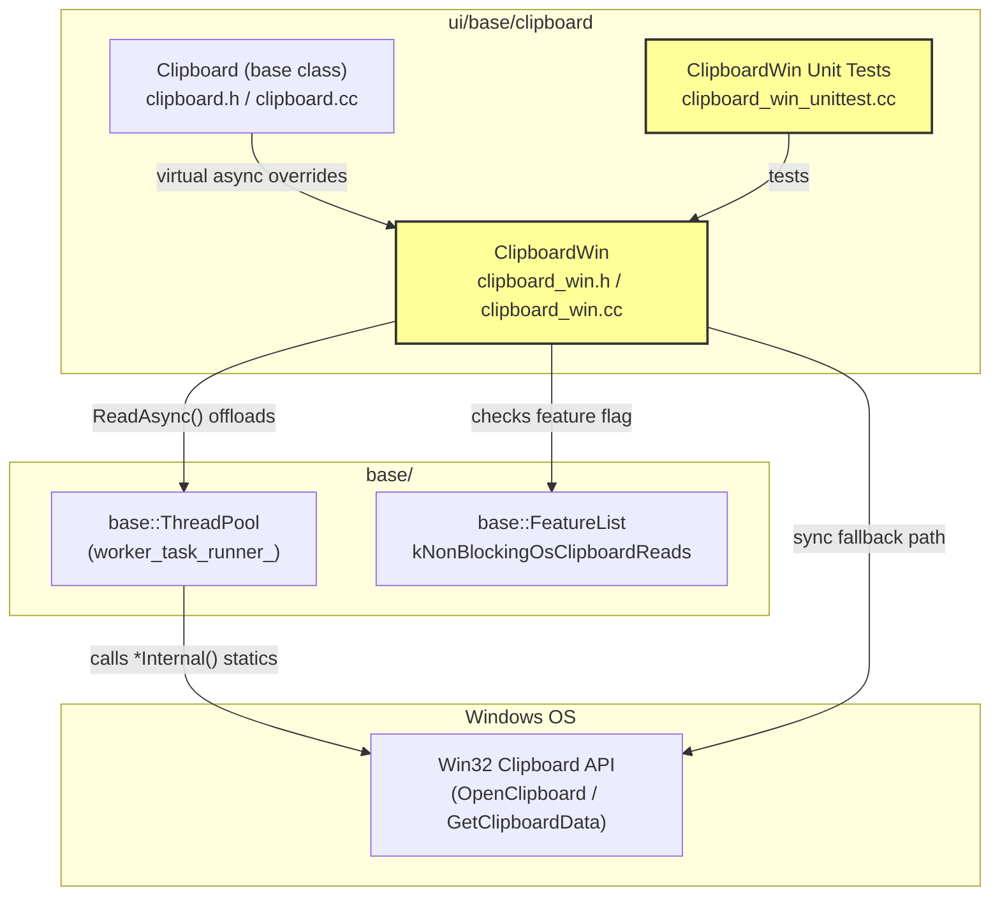
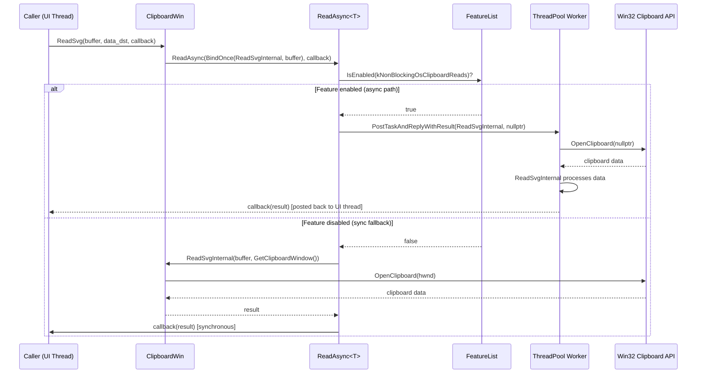
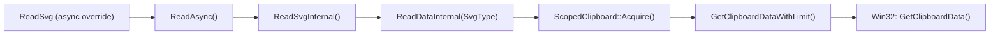

# High-Level Design: CL 7578233

## [Clipboard][Windows] Use async ReadSvg/ReadRTF/ReadDataTransferCustomData/ReadData with ThreadPool offloading

**CL:** [7578233](https://chromium-review.googlesource.com/c/chromium/src/+/7578233)
**Author:** Hewro Hewei (ihewro@chromium.org)
**Status:** NEW (Tryjob failure on `interactive_ui_tests`: `ClipboardWinTest.ReadDataAsyncReturnsWrittenData`)

---

## 1. Executive Summary

This CL extends the Windows clipboard asynchronous read infrastructure by adding async overrides for four additional clipboard read methods: `ReadSvg`, `ReadRTF`, `ReadDataTransferCustomData`, and `ReadData`. These methods previously used the synchronous base-class default implementations (which just called the synchronous `DataTransferEndpoint*` variants inline). With this change, when the `kNonBlockingOsClipboardReads` feature flag is enabled, these reads are offloaded to a `ThreadPool` worker thread, avoiding blocking the UI thread during clipboard I/O. This follows the same pattern already established for `ReadText`, `ReadAsciiText`, `ReadAvailableTypes`, `ReadHTML`, `ReadFilenames`, and `ReadPng` in earlier CLs. The expected impact is reduced UI jank on Windows when reading SVG, RTF, custom data transfer, or arbitrary data formats from the clipboard.

---

## 2. Architecture Overview

### Affected Components

| Component | File(s) | Role |
|---|---|---|
| **ClipboardWin** | `ui/base/clipboard/clipboard_win.cc`, `clipboard_win.h` | Windows clipboard implementation |
| **Clipboard** (base class) | `ui/base/clipboard/clipboard.h`, `clipboard.cc` | Cross-platform clipboard interface with default sync async wrappers |
| **ClipboardWin unit tests** | `ui/base/clipboard/clipboard_win_unittest.cc` | Test coverage for async read paths |

### How It Fits Into the Existing Architecture

The `Clipboard` base class defines two overload families for each read operation:
1. **Synchronous** (`DataTransferEndpoint*` + out-pointer) — pure virtual, implemented per-platform.
2. **Async** (`std::optional<DataTransferEndpoint>` + callback) — virtual with a default implementation that calls the synchronous variant on the current thread and invokes the callback immediately.

`ClipboardWin` already overrides several async methods to use its `ReadAsync<T>` template, which conditionally offloads work to `worker_task_runner_` when `kNonBlockingOsClipboardReads` is enabled. This CL adds four more such overrides.

### Component Diagram

---

## 3. Design Goals & Non-Goals

### Goals
- **Non-blocking clipboard reads:** Offload `ReadSvg`, `ReadRTF`, `ReadDataTransferCustomData`, and `ReadData` to a thread pool worker when `kNonBlockingOsClipboardReads` is enabled, matching the pattern already used by other read methods.
- **Refactor to static internal helpers:** Extract the core read logic into `static` methods (`ReadSvgInternal`, `ReadRTFInternal`, `ReadDataTransferCustomDataInternal`, `ReadDataInternal`) that accept an `HWND` parameter, making them safe to run on a worker thread (with `owner_window = nullptr`).
- **Backward compatibility:** Preserve the existing synchronous read paths (the `DataTransferEndpoint*` overloads) unchanged in behavior — they now delegate to the same internal helpers.
- **Test coverage:** Add unit tests for all four new async paths (both data-present and empty-clipboard scenarios).

### Non-Goals
- **Other platforms:** This CL only affects the Windows implementation. macOS, Linux, ChromeOS, and Fuchsia clipboard implementations are not modified.
- **ReadPng changes:** `ReadPng` already has its own async path with special bitmap-fallback logic; it is not touched.
- **Feature flag rollout:** This CL does not change the default state of `kNonBlockingOsClipboardReads`.
- **Write path changes:** Only read operations are affected.

---

## 4. System Interactions

### Main Flow: Async Clipboard Read (e.g., ReadSvg)

### Key Design Detail: `HWND owner_window` parameter

The `*Internal` static methods accept an `HWND owner_window`:
- **Sync path:** `GetClipboardWindow()` is passed, acquiring the clipboard with an owned window handle.
- **Async path:** `nullptr` is passed, which calls `OpenClipboard(NULL)` — this is valid on Windows and associates the clipboard with the calling thread rather than a specific window.

### Internal Call Chain for ReadSvg

Note: `ReadSvgInternal` internally calls `ReadDataInternal` (the static helper) rather than the instance method `ReadData`, avoiding virtual dispatch and ensuring it works correctly on the worker thread.

---

## 5. API & Interface Changes

### New Public Overrides (in `ClipboardWin`)

All of these are `override` of `virtual` methods already declared in the base `Clipboard` class. No new public API surface is introduced.

| Method | Signature | Purpose |
|---|---|---|
| `ReadSvg` | `void ReadSvg(ClipboardBuffer, const std::optional<DataTransferEndpoint>&, ReadSvgCallback) const override` | Async SVG read with ThreadPool offloading |
| `ReadRTF` | `void ReadRTF(ClipboardBuffer, const std::optional<DataTransferEndpoint>&, ReadRTFCallback) const override` | Async RTF read with ThreadPool offloading |
| `ReadDataTransferCustomData` | `void ReadDataTransferCustomData(ClipboardBuffer, const std::u16string&, const std::optional<DataTransferEndpoint>&, ReadDataTransferCustomDataCallback) const override` | Async custom data read with ThreadPool offloading |
| `ReadData` | `void ReadData(const ClipboardFormatType&, const std::optional<DataTransferEndpoint>&, ReadDataCallback) const override` | Async arbitrary format read with ThreadPool offloading |

### New Private Static Helpers (in `ClipboardWin`)

| Method | Signature | Purpose |
|---|---|---|
| `ReadSvgInternal` | `static std::u16string ReadSvgInternal(ClipboardBuffer, HWND)` | Thread-safe SVG read logic |
| `ReadRTFInternal` | `static std::string ReadRTFInternal(ClipboardBuffer, HWND)` | Thread-safe RTF read logic |
| `ReadDataTransferCustomDataInternal` | `static std::u16string ReadDataTransferCustomDataInternal(ClipboardBuffer, const std::u16string&, HWND)` | Thread-safe custom data read logic |
| `ReadDataInternal` | `static std::string ReadDataInternal(const ClipboardFormatType&, HWND)` | Thread-safe arbitrary format read logic |

### Modified Methods

The existing synchronous overloads (`DataTransferEndpoint*` variants) for `ReadSvg`, `ReadRTF`, `ReadDataTransferCustomData`, and `ReadData` are refactored to delegate to the new `*Internal` static helpers. Their external behavior is unchanged.

### Deprecated Interfaces

None.

---

## 6. Dependencies

### What This Code Depends On

| Dependency | Description |
|---|---|
| `base::ThreadPool` | Worker thread for async clipboard reads via `worker_task_runner_` |
| `base::FeatureList` / `kNonBlockingOsClipboardReads` | Feature flag gating async vs sync behavior |
| `base::OnceCallback` / `base::BindOnce` | Callback machinery for async plumbing |
| `ClipboardWin::ReadAsync<T>` | Template method (pre-existing) that handles the feature-gated async dispatch |
| Win32 Clipboard API | `OpenClipboard`, `GetClipboardData`, `GlobalLock`/`GlobalUnlock` |
| `ScopedClipboard` | RAII wrapper for Win32 clipboard open/close |
| `ClipboardFormatType` | Format descriptors (SvgType, RtfType, DataTransferCustomType, PlainTextType) |
| `base::DetectEncoding` / `base::ConvertToUtf8AndNormalize` | RTF encoding normalization |

### What Depends On This Code

| Dependent | Description |
|---|---|
| `content/browser/renderer_host/clipboard_host_impl.cc` | Browser-side clipboard host that calls `Clipboard::ReadSvg`, `ReadRTF`, `ReadData`, etc. via the async callback interface |
| `blink::ClipboardAccessToken` | Blink clipboard access that may invoke these reads |
| Any code calling `Clipboard::GetForCurrentThread()->ReadSvg(...)` etc. with the async overloads | Will now get non-blocking behavior on Windows when the feature is enabled |

### Compatibility

- **Feature flag gated:** When `kNonBlockingOsClipboardReads` is disabled (default), behavior is identical to before — the `ReadAsync` template runs the read synchronously and invokes the callback inline.
- **No ABI/API breakage:** All changes are internal implementation details behind existing virtual interfaces.

---

## 7. Risks & Mitigations

### 7.1 Failing Test: `ClipboardWinTest.ReadDataAsyncReturnsWrittenData`

**Risk:** The CL already has a **tryjob failure** on `win-rel` for this test.

**Analysis:** The test writes raw data using `WriteRawDataForTest` with `ClipboardFormatType::PlainTextType()` and then reads it back via the async `ReadData` path. The failure likely stems from one of:
- `ReadDataInternal` being invoked with `owner_window = nullptr` on the worker thread, but the test's `TaskEnvironment` may not be set up to properly handle the ThreadPool reply posting.
- A race condition or clipboard state issue specific to the test harness.

**Mitigation:** The CL author will need to investigate the test failure. The test environment likely needs `base::test::TaskEnvironment::MainThreadType::UI` with proper thread pool support, similar to other async tests in this file.

### 7.2 Thread Safety of Static Helpers

**Risk:** The `*Internal` static methods call `RecordRead()` which records UMA histograms. `RecordRead` must be thread-safe.

**Mitigation:** `RecordRead` uses `base::UmaHistogramEnumeration` which is thread-safe. This is consistent with existing internal helpers (e.g., `ReadPngInternal`) that also call `RecordRead` from worker threads.

### 7.3 `ReadSvgInternal` calls `ReadDataInternal` directly

**Risk:** `ReadSvgInternal` calls `ReadDataInternal` (the static helper) which calls `ScopedClipboard::Acquire()`. This means SVG reads open and close the clipboard within `ReadDataInternal`, then `ReadSvgInternal` does post-processing (UTF-8 decoding, null trimming). This is correct but means the clipboard is opened/closed for each call — no change from current behavior.

**Mitigation:** No action needed; this matches the existing synchronous behavior.

### 7.4 `owner_window = nullptr` Semantics

**Risk:** When reading on the worker thread, `OpenClipboard(NULL)` is used. This means no window owns the clipboard, which is acceptable for reading but could theoretically conflict with other clipboard operations.

**Mitigation:** This is the same pattern already used by `ReadTextInternal`, `ReadFilenamesInternal`, `ReadPngInternal`, etc. It has been validated in production.

### 7.5 Backward Compatibility

**Risk:** Minimal. The synchronous paths (`DataTransferEndpoint*` overloads) now delegate to the `*Internal` helpers instead of inlining the logic. The observable behavior is identical.

**Mitigation:** The existing synchronous tests are unchanged and should continue to pass.

---

## 8. Testing Strategy

### New Tests Added

| Test Name | What It Tests |
|---|---|
| `ReadSvgAsyncReturnsWrittenData` | Writes SVG data, reads it back via async `ReadSvg`, verifies content matches |
| `ReadSvgAsyncEmptyClipboard` | Reads SVG from empty clipboard via async path, verifies empty result |
| `ReadRTFAsyncReturnsWrittenData` | Writes RTF data, reads it back via async `ReadRTF`, verifies content matches |
| `ReadRTFAsyncEmptyClipboard` | Reads RTF from empty clipboard via async path, verifies empty result |
| `ReadDataTransferCustomDataAsyncReturnsWrittenData` | Writes custom data via pickle, reads back via async `ReadDataTransferCustomData`, verifies content |
| `ReadDataTransferCustomDataAsyncEmptyClipboard` | Reads custom data from empty clipboard, verifies empty result |
| `ReadDataAsyncReturnsWrittenData` | Writes raw data, reads back via async `ReadData`, verifies content (**currently failing**) |
| `ReadDataAsyncEmptyClipboard` | Reads arbitrary format from empty clipboard, verifies empty result |

### Existing Tests Enhanced

The `ReadDoesNotIncreaseMonitorCount` test is extended to also verify that the new async read methods (`ReadSvg`, `ReadRTF`, `ReadDataTransferCustomData`, `ReadData` with callback variants) do not trigger clipboard change notifications.

### Test Pattern

All async tests use `base::test::TestFuture<T>` to synchronously wait for the async callback, following the same pattern established by existing tests for `ReadPng`, `ReadFilenames`, etc.

### Coverage Gaps

- Tests only run with the **default** feature flag state. Ideally, tests should also run with `kNonBlockingOsClipboardReads` explicitly enabled to exercise the actual ThreadPool path (similar to `ClipboardWinTestNonBlockingOsClipboardReads` test fixture used elsewhere in the file).
- The failing `ReadDataAsyncReturnsWrittenData` test needs to be fixed before this CL can land.

---

## Appendix: File-Level Change Summary

### `ui/base/clipboard/clipboard_win.h` (+24 lines)

- Added four async override declarations: `ReadSvg`, `ReadRTF`, `ReadDataTransferCustomData`, `ReadData` (lines 72-88).
- Added four `static` internal helper declarations: `ReadSvgInternal`, `ReadRTFInternal`, `ReadDataTransferCustomDataInternal`, `ReadDataInternal` (lines 183-191).

### `ui/base/clipboard/clipboard_win.cc` (+110/-24 lines)

- **New async overrides** (lines 465-500): Four new methods that delegate to `ReadAsync()` with `BindOnce` to the corresponding `*Internal` static.
- **Refactored sync methods**: `ReadSvg`, `ReadRTF`, `ReadDataTransferCustomData`, `ReadData` (synchronous overloads) now delegate to `*Internal` helpers and assign the result to the out-pointer.
- **New static helpers**: `ReadSvgInternal`, `ReadRTFInternal`, `ReadDataTransferCustomDataInternal`, `ReadDataInternal` — extracted from the previous inline implementations, now returning by value instead of writing to out-pointers.

### `ui/base/clipboard/clipboard_win_unittest.cc` (+137 lines)

- Added 8 new test cases covering async read paths for SVG, RTF, custom data, and raw data (both data-present and empty clipboard).
- Extended `ReadDoesNotIncreaseMonitorCount` with async read calls for the four new methods.
- Added `#include` for `base/pickle.h`, `custom_data_helper.h`, and `<unordered_map>`.
