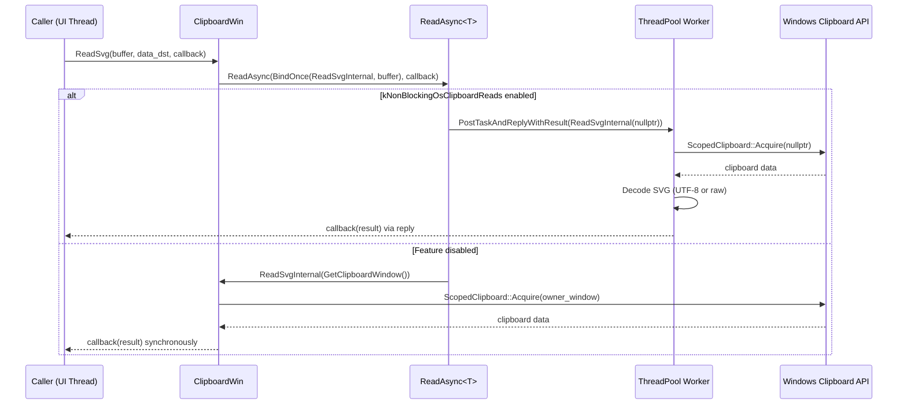
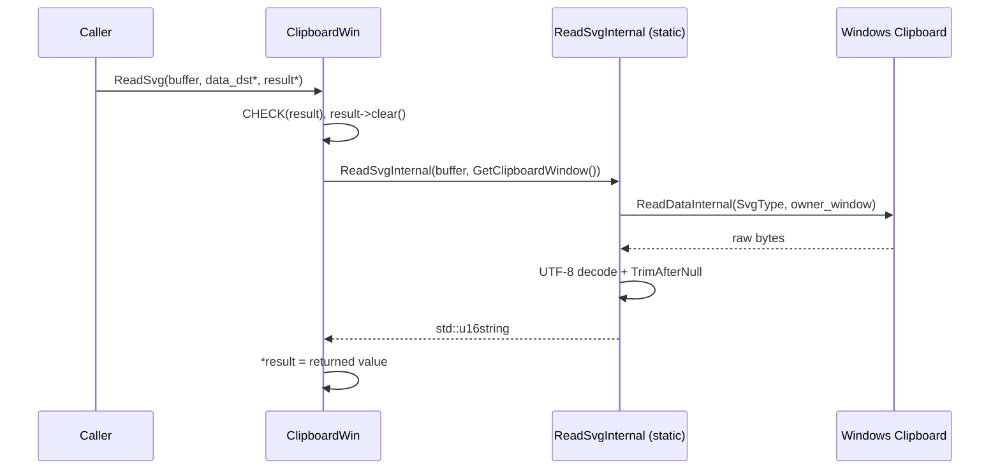
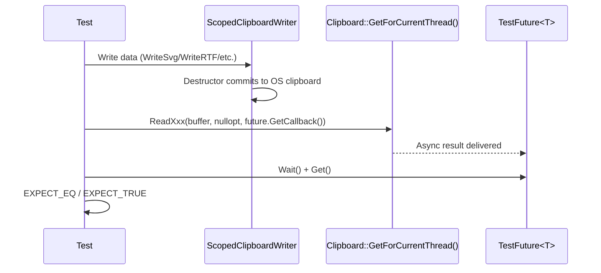
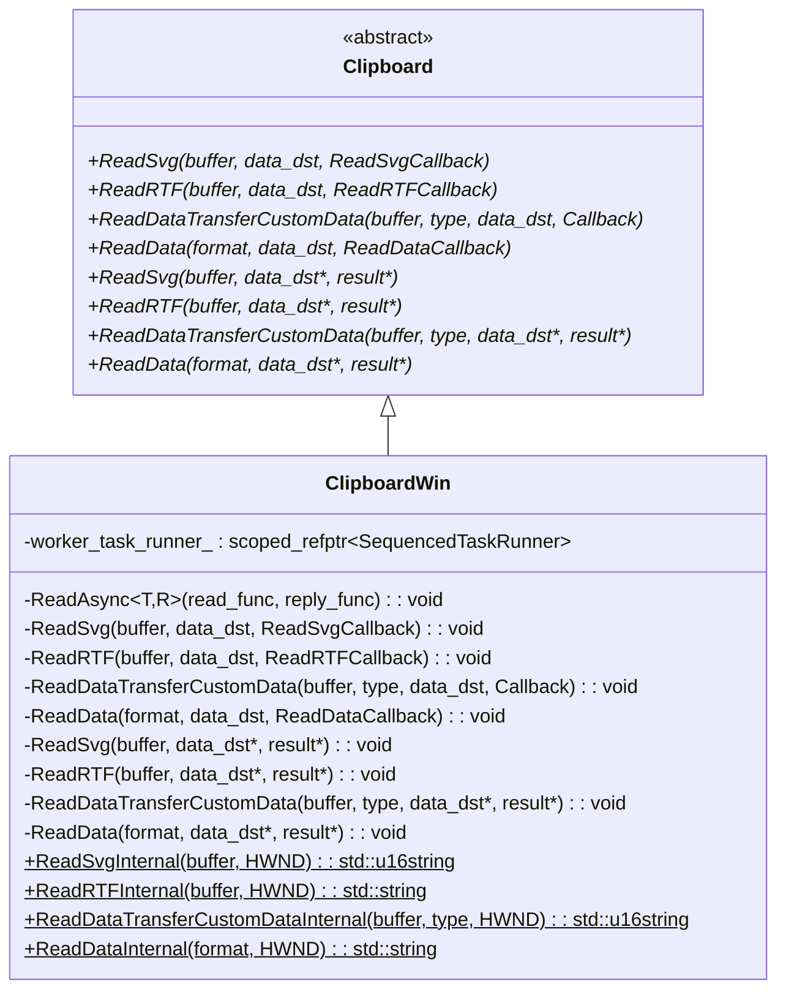
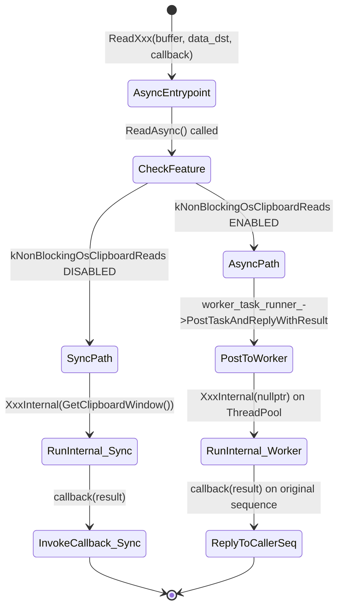

# Low-Level Design: CL 7578233

## [Clipboard][Windows] Use async ReadSvg/ReadRTF/ReadDataTransferCustomData/ReadData with ThreadPool offloading

**CL URL:** https://chromium-review.googlesource.com/c/chromium/src/+/7578233
**Author:** Hewro Hewei (ihewro@chromium.org)
**Status:** NEW (CI failure on `interactive_ui_tests` — `ClipboardWinTest.ReadDataAsyncReturnsWrittenData`)

---

## 1. File-by-File Analysis

---

### 1.1 `ui/base/clipboard/clipboard_win.h`

**Purpose of changes**: Declare new async-callback overrides and static internal helper methods for four clipboard read operations (`ReadSvg`, `ReadRTF`, `ReadDataTransferCustomData`, `ReadData`).

**Key modifications**:
- Added 4 async overrides (callback-based API using `std::optional<DataTransferEndpoint>&`) for `ReadSvg`, `ReadRTF`, `ReadDataTransferCustomData`, and `ReadData`.
- Added 4 static `*Internal` methods that perform the actual clipboard I/O, decoupled from `this`.

**New/Modified Functions**:

| Function | Purpose | Parameters | Returns |
|----------|---------|------------|---------|
| `ReadSvg(…, ReadSvgCallback)` | Async override of SVG read | `buffer`, `data_dst`, `callback` | `void` |
| `ReadRTF(…, ReadRTFCallback)` | Async override of RTF read | `buffer`, `data_dst`, `callback` | `void` |
| `ReadDataTransferCustomData(…, ReadDataTransferCustomDataCallback)` | Async override for custom data | `buffer`, `type`, `data_dst`, `callback` | `void` |
| `ReadData(…, ReadDataCallback)` | Async override for arbitrary format data | `format`, `data_dst`, `callback` | `void` |
| `ReadSvgInternal(buffer, owner_window)` | Static: reads SVG from clipboard | `ClipboardBuffer`, `HWND` | `std::u16string` |
| `ReadRTFInternal(buffer, owner_window)` | Static: reads RTF from clipboard | `ClipboardBuffer`, `HWND` | `std::string` |
| `ReadDataTransferCustomDataInternal(buffer, type, owner_window)` | Static: reads custom transfer data | `ClipboardBuffer`, `std::u16string`, `HWND` | `std::u16string` |
| `ReadDataInternal(format, owner_window)` | Static: reads raw format data | `ClipboardFormatType`, `HWND` | `std::string` |

**Declaration ordering**: The new async overrides are inserted into the private section alongside existing async overrides (`ReadText`, `ReadAsciiText`, `ReadHTML`). The static internal methods are grouped with the existing `ReadHTMLInternal`, `ReadFilenamesInternal`, `ReadPngInternal`, etc.

---

### 1.2 `ui/base/clipboard/clipboard_win.cc`

**Purpose of changes**: Implement async callback-based wrappers and refactor the four read operations to use static `*Internal` methods that can run on a thread pool.

**Key modifications**:
1. **New async wrappers** (lines 462-500): Four new methods delegate to `ReadAsync()` template, binding the corresponding `*Internal` static method.
2. **Refactored `ReadSvg` (sync)**: Now calls `ReadSvgInternal(buffer, GetClipboardWindow())` and assigns result. Added `CHECK(result)` and `result->clear()`.
3. **New `ReadSvgInternal`** (static): Extracted from old `ReadSvg`. Calls `ReadDataInternal(SvgType, owner_window)`, then UTF-8 or raw decode, then `TrimAfterNull`.
4. **Refactored `ReadRTF` (sync)**: Now calls `ReadRTFInternal`. Added `CHECK(result)` and `result->clear()`.
5. **New `ReadRTFInternal`** (static): Calls `ReadDataInternal(RtfType, owner_window)`, detects encoding, normalizes to UTF-8, trims null.
6. **Refactored `ReadDataTransferCustomData` (sync)**: Now calls `ReadDataTransferCustomDataInternal`. Added `CHECK(result)` and `result->clear()`.
7. **New `ReadDataTransferCustomDataInternal`** (static): Acquires clipboard via `ScopedClipboard`, reads `DataTransferCustomType`, uses `ReadCustomDataForType`.
8. **Refactored `ReadData` (sync)**: Now calls `ReadDataInternal`. Removed duplicated logic.
9. **New `ReadDataInternal`** (static): Acquires clipboard, gets handle via `GetClipboardDataWithLimit`, copies data with `GlobalLock`/`GlobalSize`/`GlobalUnlock`.

**New/Modified Functions**:

| Function | Purpose | Parameters | Returns |
|----------|---------|------------|---------|
| `ReadSvg(…, ReadSvgCallback)` | Async entry point | `buffer`, `data_dst (optional)`, `callback` | `void` |
| `ReadSvgInternal` | Static worker | `buffer`, `HWND` | `std::u16string` |
| `ReadRTF(…, ReadRTFCallback)` | Async entry point | `buffer`, `data_dst (optional)`, `callback` | `void` |
| `ReadRTFInternal` | Static worker | `buffer`, `HWND` | `std::string` |
| `ReadDataTransferCustomData(…, Callback)` | Async entry point | `buffer`, `type`, `data_dst (optional)`, `callback` | `void` |
| `ReadDataTransferCustomDataInternal` | Static worker | `buffer`, `type`, `HWND` | `std::u16string` |
| `ReadData(…, ReadDataCallback)` | Async entry point | `format`, `data_dst (optional)`, `callback` | `void` |
| `ReadDataInternal` | Static worker | `format`, `HWND` | `std::string` |

**Data Flow** (Async path — same pattern for all four operations):

**Data Flow** (Sync path — legacy pointer-based API):

---

### 1.3 `ui/base/clipboard/clipboard_win_unittest.cc`

**Purpose of changes**: Add test coverage for the new async overrides, plus verify async reads don't trigger spurious clipboard change notifications.

**Key modifications**:
1. **New includes**: `<unordered_map>`, `base/pickle.h`, `custom_data_helper.h`.
2. **Extended `ReadDoesNotTriggerClipboardDataChanged` test**: Added async calls for `ReadSvg`, `ReadRTF`, `ReadDataTransferCustomData`, and `ReadData` using `TestFuture`, asserting `data_changed_count()` remains 0.
3. **New test: `ReadSvgAsyncReturnsWrittenData`**: Writes SVG via `ScopedClipboardWriter`, reads back with async `ReadSvg`, asserts equality.
4. **New test: `ReadSvgAsyncEmptyClipboard`**: Clears clipboard, reads SVG async, asserts empty.
5. **New test: `ReadRTFAsyncReturnsWrittenData`**: Writes RTF, reads back async, asserts equality.
6. **New test: `ReadRTFAsyncEmptyClipboard`**: Clears, reads RTF async, asserts empty.
7. **New test: `ReadDataTransferCustomDataAsyncReturnsWrittenData`**: Writes custom data via `WritePickledData(DataTransferCustomType)`, reads back async with type `"text/plain"`, asserts value.
8. **New test: `ReadDataTransferCustomDataAsyncEmptyClipboard`**: Clears, reads custom data async, asserts empty.
9. **New test: `ReadDataAsyncReturnsWrittenData`**: Writes raw data via `WriteRawDataForTest(PlainTextType)`, reads back via async `ReadData`, asserts `"data"`. **⚠️ This test fails in CI.**
10. **New test: `ReadDataAsyncEmptyClipboard`**: Clears, reads data async, asserts empty.

**Test Pattern** (common to all new tests):

---

## 2. Class Diagram

---

## 3. State Diagram

---

## 4. Implementation Concerns

### 4.1 Thread Safety — `RecordRead` Called from Thread Pool

All `*Internal` static methods call `RecordRead(ClipboardFormatMetric::kXxx)`. `RecordRead` records UMA histogram metrics. While UMA histogram macros are generally thread-safe, this is a departure from the previous pattern where `RecordRead` was always called on the UI thread. **The existing `ReadPngInternal` and `ReadFilenamesInternal` also follow this same pattern, so this is consistent.**

### 4.2 Clipboard Acquisition with `nullptr` HWND on Thread Pool

When `kNonBlockingOsClipboardReads` is enabled, `ReadAsync` passes `owner_window = nullptr` to the `*Internal` methods. This is passed to `ScopedClipboard::Acquire(nullptr)`, which calls `::OpenClipboard(nullptr)`. On Windows, `OpenClipboard(NULL)` is valid and associates the clipboard with the calling thread (not a window). This is the established pattern used by `ReadPngInternal`, `ReadTextInternal`, etc.

### 4.3 `ReadSvgInternal` Calls `ReadDataInternal` — Double Clipboard Acquisition

`ReadSvgInternal` calls `ReadDataInternal(ClipboardFormatType::SvgType(), owner_window)`, which internally opens the clipboard. This means the clipboard is opened and closed within `ReadDataInternal` for SVG reads. The previous code called the instance method `ReadData(SvgType, data_dst, &data)` which did the same thing — so this is semantically identical.

Similarly, `ReadRTFInternal` calls `ReadDataInternal(RtfType, owner_window)` — same pattern.

### 4.4 `ReadDataInternal` Does Not Call `TrimAfterNull`

Unlike `ReadSvgInternal` (which trims after decoding), `ReadDataInternal` returns raw bytes without trimming. This is correct because `ReadData` is a generic raw data reader — it should not interpret the data. The callers (`ReadSvgInternal`, `ReadRTFInternal`) handle their own trimming.

### 4.5 Memory Management

All methods use stack-based return values (`std::string`, `std::u16string`), which are moved through the callback chain. There are no raw pointer allocations or ownership transfers to worry about. `ScopedClipboard` handles `OpenClipboard`/`CloseClipboard` via RAII. `GlobalLock`/`GlobalUnlock` are always paired.

### 4.6 Test Failure: `ReadDataAsyncReturnsWrittenData`

**The CI reports that `ClipboardWinTest.ReadDataAsyncReturnsWrittenData` fails.** This is the test at line 540 of the unittest file.

Potential root cause analysis:

The test uses `WriteRawDataForTest(ClipboardFormatType::PlainTextType(), {'d','a','t','a'})` which writes 4 bytes, then reads them back via async `ReadData(PlainTextType)`. On Windows, `CF_TEXT` (plain text) has special behavior: when you use `SetClipboardData` with `CF_TEXT`, Windows may auto-convert and add a null terminator. `GlobalSize()` returns the **allocated** size of the memory block (which on Windows is often rounded up to alignment boundaries), not the logical size of the data. So `ReadDataInternal` may read back more bytes than the 4 written, causing the `EXPECT_EQ(data_future.Get(), "data")` assertion to fail.

This is a pre-existing semantic issue with `ReadData` on Windows: `GlobalSize()` may return a size larger than the written data (due to `GMEM_MOVEABLE` allocation rounding). For standard clipboard formats like `CF_TEXT` / `CF_UNICODETEXT`, the data is null-terminated so `TrimAfterNull` handles it. But for raw `ReadData`, the extra padding causes the string to contain garbage trailing bytes.

**This is likely why the test fails** — the returned string is longer than `"data"` due to `GlobalSize` rounding up the allocation.

### 4.7 Performance Implications

This CL is a positive performance change. By offloading clipboard reads to the thread pool (when `kNonBlockingOsClipboardReads` is enabled), the UI thread is no longer blocked by potentially slow clipboard operations (e.g., when another process holds the clipboard lock).

### 4.8 `data_dst` Parameter Ignored

All async overrides take `const std::optional<DataTransferEndpoint>& data_dst` but do not use it. This is documented with a comment "not used, only passed for consistency with other platforms." This is consistent with the existing sync overrides.

---

## 5. Suggestions for Improvement

### 5.1 Fix the Failing Test (`ReadDataAsyncReturnsWrittenData`)

The test writes 4 raw bytes as `PlainTextType` (`CF_TEXT`) data and expects to read back exactly `"data"`. This fails because `GlobalSize` may include padding/null-terminator bytes. Two options:

1. **Use a custom/private clipboard format** instead of `PlainTextType` to avoid Windows auto-conversion behavior. This is the safer fix.
2. **Trim the result** in the test comparison (e.g., compare only the first N bytes), though this would paper over the underlying issue.

### 5.2 Typo in CL Title

The CL title says `RadRTF` instead of `ReadRTF`.

### 5.3 Consider Adding `DCHECK(CalledOnValidThread())` to Async Entry Points

The async entry points (`ReadSvg`, `ReadRTF`, etc.) don't have `DCHECK(CalledOnValidThread())` checks. The existing `ReadText`, `ReadAsciiText` async overrides also lack this check, so this is consistent — but adding it would be defensive.

### 5.4 `ReadDataTransferCustomDataInternal` Doesn't Need `buffer` Parameter

The `buffer` parameter is only used for `DCHECK_EQ(buffer, ClipboardBuffer::kCopyPaste)`. Since it's always `kCopyPaste`, the parameter could be removed, though this would break consistency with the established pattern.

### 5.5 Sync `ReadData` No Longer Calls `result->clear()`

The refactored sync `ReadData(format, data_dst*, result*)` calls `CHECK(result)` then `*result = ReadDataInternal(...)`. Unlike the other refactored methods (`ReadSvg`, `ReadRTF`, `ReadDataTransferCustomData`) which all call `result->clear()` before assignment, `ReadData` omits the `clear()` call. This is functionally equivalent (assignment replaces the value), but inconsistent with the other methods.

### 5.6 `ReadSvgInternal` and `ReadRTFInternal` Call `RecordRead` Themselves

`ReadSvgInternal` calls `RecordRead(kSvg)` and then delegates to `ReadDataInternal` which calls `RecordRead(kData)`. This results in **two metric recordings per SVG read** — one for `kSvg` and one for `kData`. This was also the case in the original code (the sync `ReadSvg` called `ReadData` which called `RecordRead(kData)`), so it's not a regression, but it may inflate the `kData` metric count.
