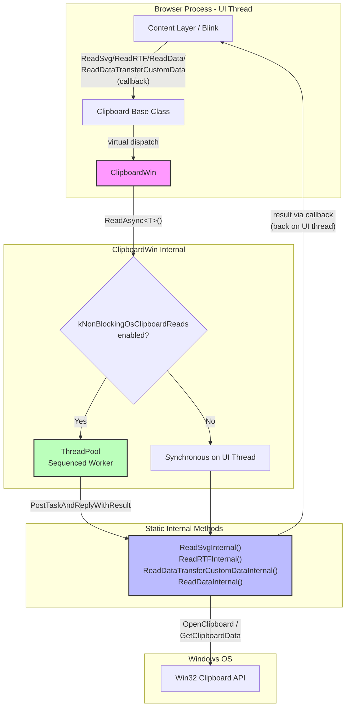
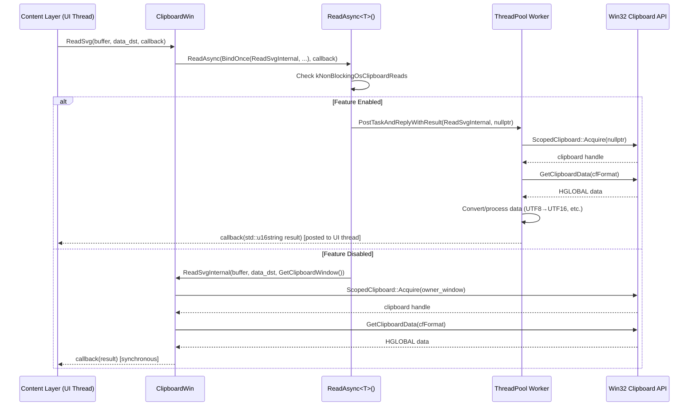
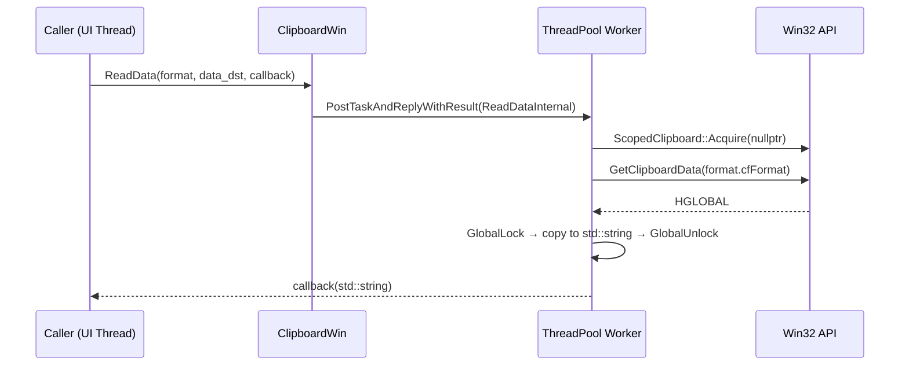

# High-Level Design: CL 7578233

## [Clipboard][Windows] Async ReadSvg/ReadRTF/ReadDataTransferCustomData/ReadData with ThreadPool Offloading

**CL URL:** https://chromium-review.googlesource.com/c/chromium/src/+/7578233
**Author:** Hewro Hewei (ihewro@chromium.org)
**Bug:** [crbug.com/458194647](https://crbug.com/458194647)

---

## 1. Executive Summary

This CL extends the ongoing effort to make Windows clipboard reads non-blocking by adding async overrides for four additional read operations: `ReadSvg`, `ReadRTF`, `ReadDataTransferCustomData`, and `ReadData`. Previously, these operations ran synchronously on the UI thread, which could block the browser's main event loop while waiting on the Windows clipboard API (particularly under contention when other applications hold the clipboard lock). This CL refactors each of these read methods into a static `*Internal` function that can be posted to a ThreadPool worker, and adds async callback-based overrides that leverage the existing `ReadAsync` template pattern. When the `kNonBlockingOsClipboardReads` feature flag is enabled (currently enabled by default), clipboard reads are offloaded to a dedicated sequenced worker thread, eliminating UI-thread jank. This is a continuation of prior work that already converted `ReadText`, `ReadAsciiText`, `ReadAvailableTypes`, `ReadHTML`, `ReadPng`, and `ReadFilenames` to the same pattern.

---

## 2. Architecture Overview

### Affected Components

| Component | Path | Role |
|-----------|------|------|
| `ClipboardWin` | `ui/base/clipboard/clipboard_win.{h,cc}` | Windows-specific clipboard implementation |
| `Clipboard` (base class) | `ui/base/clipboard/clipboard.h` | Platform-abstracted clipboard interface with virtual async methods |
| `ClipboardWin` unit tests | `ui/base/clipboard/clipboard_win_unittest.cc` | Tests for Windows clipboard behavior |
| Feature flags | `ui/base/ui_base_features.{h,cc}` | `kNonBlockingOsClipboardReads` feature flag (not modified in this CL) |

### How This Fits Into Existing Architecture

The `Clipboard` base class (`ui/base/clipboard/clipboard.h`) defines both synchronous (deprecated, raw-pointer out-params) and asynchronous (callback-based) virtual read methods. The default async implementations in the base class call the synchronous versions. `ClipboardWin` overrides the async versions to use `ReadAsync<T>()`, a template method that conditionally posts work to a ThreadPool worker or runs synchronously depending on the `kNonBlockingOsClipboardReads` feature flag.

This CL follows the exact same pattern already established for `ReadText`, `ReadAsciiText`, `ReadHTML`, `ReadAvailableTypes`, `ReadPng`, and `ReadFilenames` — converting the read logic into a static `*Internal` function and wiring it through `ReadAsync`.

### Component Diagram

---

## 3. Design Goals & Non-Goals

### Goals

1. **Eliminate UI-thread blocking** for `ReadSvg`, `ReadRTF`, `ReadDataTransferCustomData`, and `ReadData` clipboard operations on Windows by offloading them to a ThreadPool worker.
2. **Maintain backward compatibility** — the existing synchronous (deprecated) read methods continue to work unchanged, delegating to the same static `*Internal` functions.
3. **Follow the established pattern** — use the same `ReadAsync<T>()` template and static `*Internal` function convention already used by other read methods.
4. **Feature-flag gated** — all async behavior is gated behind `kNonBlockingOsClipboardReads`, allowing safe rollback.

### Non-Goals

1. **Converting write operations** — only read operations are converted to async; write operations remain synchronous.
2. **Cross-platform changes** — this CL only targets the Windows clipboard implementation. Other platforms (macOS, Linux, ChromeOS) are unaffected.
3. **Changing the `ReadBookmark` method** — `ReadBookmark` is not converted in this CL.
4. **Modifying the Clipboard base class interface** — the async virtual methods already exist in the base class; this CL only provides Windows-specific overrides.
5. **Removing deprecated synchronous APIs** — the sync `Read*()` methods with raw-pointer out-params are preserved.

---

## 4. System Interactions

### Data Flow

When a consumer (e.g., Blink's `DataTransferAccessPolicy`, `ClipboardHost` Mojo endpoint) calls an async clipboard read method:

1. The call arrives on the UI thread at `ClipboardWin::Read*(buffer, data_dst, callback)`.
2. `ReadAsync<T>()` checks the `kNonBlockingOsClipboardReads` feature flag.
3. If enabled: the static `*Internal` function is posted to `worker_task_runner_` (a sequenced ThreadPool runner with `USER_BLOCKING` priority). The `owner_window` parameter is `nullptr` (Windows opens clipboard without ownership in worker mode).
4. If disabled: the `*Internal` function runs synchronously on the UI thread with `owner_window = GetClipboardWindow()`.
5. The `*Internal` function acquires the OS clipboard via `ScopedClipboard::Acquire()`, reads the data via Win32 `GetClipboardData`, processes/converts it, and returns the result by value.
6. The result is delivered to the caller's callback on the original (UI) sequence.

### Sequence Diagram — Async Path (Feature Enabled)

### Sequence Diagram — ReadData (Generic Format)

### IPC/Mojo Interactions

This CL does **not** directly modify any Mojo interfaces. However, the async clipboard read methods are consumed by `ClipboardHostImpl` (in `content/browser/renderer_host/clipboard_host_impl.cc`), which serves the `blink.mojom.ClipboardHost` Mojo interface. The existing Mojo plumbing already expects callback-based async reads, so this CL improves the pipeline by making the underlying reads truly non-blocking rather than faking async on the UI thread.

---

## 5. API & Interface Changes

### New Public Overrides in `ClipboardWin` (`clipboard_win.h`)

These are overrides of existing `Clipboard` base class virtual methods — no new abstract interfaces are introduced:

| Method | Signature | Description |
|--------|-----------|-------------|
| `ReadSvg` (async) | `void ReadSvg(ClipboardBuffer, const std::optional<DataTransferEndpoint>&, ReadSvgCallback) const override` | Async SVG read via ThreadPool |
| `ReadRTF` (async) | `void ReadRTF(ClipboardBuffer, const std::optional<DataTransferEndpoint>&, ReadRTFCallback) const override` | Async RTF read via ThreadPool |
| `ReadDataTransferCustomData` (async) | `void ReadDataTransferCustomData(ClipboardBuffer, const std::u16string&, const std::optional<DataTransferEndpoint>&, ReadDataTransferCustomDataCallback) const override` | Async custom data read via ThreadPool |
| `ReadData` (async) | `void ReadData(const ClipboardFormatType&, const std::optional<DataTransferEndpoint>&, ReadDataCallback) const override` | Async raw data read via ThreadPool |

### New Private Static Methods in `ClipboardWin`

| Method | Return Type | Purpose |
|--------|-------------|---------|
| `ReadSvgInternal` | `std::u16string` | Thread-safe SVG read logic; called by both sync and async paths |
| `ReadRTFInternal` | `std::string` | Thread-safe RTF read logic |
| `ReadDataTransferCustomDataInternal` | `std::u16string` | Thread-safe custom data read logic |
| `ReadDataInternal` | `std::string` | Thread-safe raw data read logic |

All four follow the same pattern: `static` method taking `(format_params..., std::optional<DataTransferEndpoint>, HWND owner_window)` and returning the result by value.

### Modified Methods

The existing synchronous `ReadSvg`, `ReadRTF`, `ReadDataTransferCustomData`, and `ReadData` methods (with raw-pointer out-params) are refactored to delegate to the corresponding `*Internal` static methods. Their public signatures are **unchanged**. A `CHECK(result)` guard was added to each sync method to fail fast on null out-params.

### Deprecated Interfaces

No interfaces are deprecated by this CL. The synchronous read methods were already marked as deprecated in the base class (`clipboard.h` line 256: "Synchronous reads are deprecated").

---

## 6. Dependencies

### What This Code Depends On

| Dependency | Location | Usage |
|------------|----------|-------|
| `base::ThreadPool` | `base/task/thread_pool.h` | Worker thread for async reads |
| `base::SequencedTaskRunner` | `base/task/sequenced_task_runner.h` | `worker_task_runner_` for ordered read execution |
| `base::OnceCallback` / `base::BindOnce` | `base/functional/` | Callback plumbing for async pattern |
| `base::OptionalFromPtr` | `base/types/optional_util.h` | Convert raw `DataTransferEndpoint*` to `std::optional` |
| `features::kNonBlockingOsClipboardReads` | `ui/base/ui_base_features.cc` | Feature flag gating async behavior |
| `ScopedClipboard` | `ui/base/clipboard/clipboard_util_win.h` | RAII clipboard acquisition |
| Win32 Clipboard API | `windows.h` | `OpenClipboard`, `GetClipboardData`, `GlobalLock`, etc. |
| `base::test::TestFuture` | `base/test/test_future.h` | Used in unit tests to await async results |

### What Depends On This Code

| Consumer | How |
|----------|-----|
| `ClipboardHostImpl` | Calls async `Clipboard::Read*()` methods via the base class interface to serve Mojo requests from renderers |
| `DataTransfer` (Blink) | Indirectly consumes clipboard data via `ClipboardHost` Mojo |
| Other `Clipboard` consumers in `//chrome`, `//content` | May call sync or async read methods |

### Version/Compatibility

- The `kNonBlockingOsClipboardReads` feature flag is **enabled by default** (`ui/base/ui_base_features.cc:409`).
- No protocol buffer, Mojo IDL, or serialization format changes are introduced.
- The CL is purely an implementation detail of `ClipboardWin`; no cross-platform ABI or API changes.

---

## 7. Risks & Mitigations

### Risk 1: Thread Safety of Win32 Clipboard API

**Risk:** The Win32 clipboard API has thread-affinity constraints. When `owner_window` is `nullptr`, `OpenClipboard(NULL)` associates the clipboard with the calling thread rather than a window. If two threads attempt to open the clipboard simultaneously, one will fail.

**Mitigation:** The `worker_task_runner_` is a **sequenced** task runner (`CreateSequencedTaskRunner`), ensuring all clipboard reads from the worker are serialized. This prevents concurrent `OpenClipboard` calls from the worker side. The `ScopedClipboard` RAII wrapper ensures `CloseClipboard` is always called.

### Risk 2: Callback Ordering / Race Conditions

**Risk:** With async reads, results arrive on the UI thread after a delay. If the clipboard contents change between the read request and result delivery, the caller may receive stale data.

**Mitigation:** This is inherent to any async clipboard read and is no worse than the current behavior where the UI thread blocks (the clipboard can change immediately after a sync read returns too). Callers should use sequence numbers (`GetSequenceNumber`) to detect staleness if needed.

### Risk 3: Overlapping CL

**Risk:** The author noted CL [7590029](https://chromium-review.googlesource.com/c/chromium/src/+/7590029) by thomasanderson@chromium.org overlaps with parts of this change. Merge conflicts or duplicated work are possible.

**Mitigation:** The author has flagged this in the review comments and asked for guidance on how to proceed. Reviewers should coordinate the two CLs.

### Risk 4: `CHECK(result)` in Sync Methods

**Risk:** The sync `ReadSvg`, `ReadRTF`, `ReadDataTransferCustomData`, and `ReadData` methods now include `CHECK(result)` for the output pointer. Any existing caller passing `nullptr` would crash.

**Mitigation:** Passing `nullptr` for an output parameter has always been a bug in callers. The `CHECK` makes the contract explicit and will surface misuse early. `ReadData` already had a `CHECK(result)` before this CL.

### Backward Compatibility

- **Sync callers:** Unaffected. The sync methods still work identically (they now delegate to the same static `*Internal` functions).
- **Async callers:** Previously used the base class default implementation (which called sync methods on the UI thread). Now use the `ClipboardWin` override which posts to ThreadPool. The callback signature is identical — no caller changes needed.
- **Feature flag rollback:** If `kNonBlockingOsClipboardReads` is disabled, `ReadAsync` falls back to synchronous execution, identical to the pre-CL behavior.

---

## 8. Testing Strategy

### New Tests Added (in `clipboard_win_unittest.cc`)

| Test Name | What It Verifies |
|-----------|------------------|
| `ReadSvgAsyncReturnsWrittenData` | Writes SVG data, reads it back via async `ReadSvg`, verifies content matches |
| `ReadSvgAsyncEmptyClipboard` | Reads SVG from empty clipboard via async path, verifies empty result |
| `ReadRTFAsyncReturnsWrittenData` | Writes RTF data, reads it back via async `ReadRTF`, verifies content matches |
| `ReadRTFAsyncEmptyClipboard` | Reads RTF from empty clipboard via async path, verifies empty result |
| `ReadDataTransferCustomDataAsyncReturnsWrittenData` | Writes custom data via pickle, reads back via async `ReadDataTransferCustomData`, verifies content |
| `ReadDataTransferCustomDataAsyncEmptyClipboard` | Reads custom data from empty clipboard, verifies empty result |
| `ReadDataAsyncReturnsWrittenData` | Writes raw data with custom format, reads back via async `ReadData`, verifies content |
| `ReadDataAsyncEmptyClipboard` | Reads raw data from empty clipboard, verifies empty result |

### Existing Tests Extended

The `ClipboardWinTest.ReadDoesNotFireClipboardMonitor` test was extended to also invoke the async versions of `ReadSvg`, `ReadRTF`, `ReadDataTransferCustomData`, and `ReadData`, verifying that async reads do not trigger clipboard change notifications.

### Test Pattern

All async tests use `base::test::TestFuture<T>` to bridge the callback-based API into a synchronous test assertion pattern. Tests call the async method, `Wait()` for the future, then assert on `Get()`.

### Coverage Assessment

- **Happy path:** ✅ Each method tested with valid data roundtrip (write → async read → verify).
- **Empty clipboard:** ✅ Each method tested with empty/cleared clipboard.
- **Monitor side effects:** ✅ Verified async reads don't fire clipboard change observer.
- **Feature flag off path:** Not explicitly tested in new tests, but the sync path is already covered by existing tests and the `ReadAsync` template has existing coverage.
- **Error cases:** `ScopedClipboard::Acquire` failure path is implicitly tested via the empty clipboard tests (no data to read, graceful empty return).

---

## Appendix: File-Level Change Summary

### `ui/base/clipboard/clipboard_win.h` (+32 lines)

- Added 4 async override declarations: `ReadSvg`, `ReadRTF`, `ReadDataTransferCustomData`, `ReadData` ([lines 72–88](/workspace/cr1/src/ui/base/clipboard/clipboard_win.h#L72))
- Added 4 static `*Internal` method declarations ([lines 193–209](/workspace/cr1/src/ui/base/clipboard/clipboard_win.h#L193))

### `ui/base/clipboard/clipboard_win.cc` (+118/-24 lines)

- Added 4 async override implementations that call `ReadAsync()` with `BindOnce(*Internal, ...)` ([lines 478–514](/workspace/cr1/src/ui/base/clipboard/clipboard_win.cc#L478))
- Refactored 4 sync read methods to delegate to `*Internal` static functions, adding `CHECK(result)` guards
- Extracted read logic into 4 new static `*Internal` methods that return by value instead of writing to out-params

### `ui/base/clipboard/clipboard_win_unittest.cc` (+137 lines)

- Added 8 new test cases (2 per method: data roundtrip + empty clipboard)
- Extended existing `ReadDoesNotFireClipboardMonitor` test with async read calls
- Added `#include` for `base/pickle.h`, `custom_data_helper.h`, and `<unordered_map>` to support custom data test
