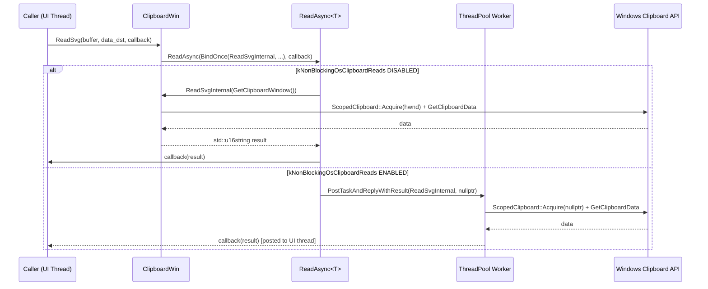
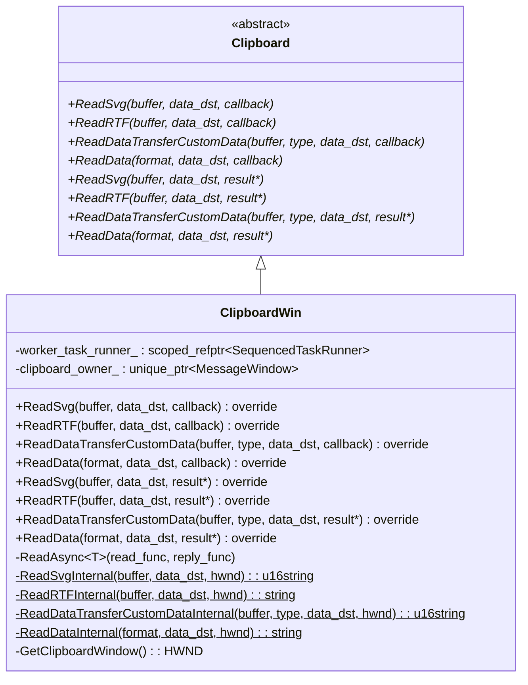

# Low-Level Design: CL 7578233

## [Clipboard][Windows] Use async ReadSvg/ReadRTF/ReadDataTransferCustomData/ReadData with ThreadPool offloading

**Bug:** 458194647
**Owner:** Hewro Hewei (ihewro@chromium.org)

---

## 1. File-by-File Analysis

---

### 1.1 `ui/base/clipboard/clipboard_win.h` (+32/-0)

**Purpose of changes**: Declare four new async override methods and four new static `*Internal` helper methods that contain the actual clipboard read logic, enabling thread-pool offloading.

**Key modifications**:
- Added async override declarations for `ReadSvg`, `ReadRTF`, `ReadDataTransferCustomData`, and `ReadData` (callback-based, taking `std::optional<DataTransferEndpoint>&`).
- Added static internal helpers: `ReadSvgInternal`, `ReadRTFInternal`, `ReadDataTransferCustomDataInternal`, `ReadDataInternal`.
- Reordered `ReadFilenames` and `ReadData` async overrides to group them with the other async overrides.

**New/Modified Functions**:

| Function | Purpose | Parameters | Returns |
|----------|---------|------------|---------|
| `ReadSvg(…, ReadSvgCallback)` | Async override for SVG reads | `ClipboardBuffer`, `optional<DTE>&`, callback | `void` |
| `ReadRTF(…, ReadRTFCallback)` | Async override for RTF reads | `ClipboardBuffer`, `optional<DTE>&`, callback | `void` |
| `ReadDataTransferCustomData(…, callback)` | Async override for custom data reads | `ClipboardBuffer`, `u16string& type`, `optional<DTE>&`, callback | `void` |
| `ReadData(…, ReadDataCallback)` | Async override for raw data reads | `ClipboardFormatType&`, `optional<DTE>&`, callback | `void` |
| `ReadSvgInternal` (static) | Thread-safe SVG read logic | `ClipboardBuffer`, `optional<DTE>&`, `HWND` | `std::u16string` |
| `ReadRTFInternal` (static) | Thread-safe RTF read logic | `ClipboardBuffer`, `optional<DTE>&`, `HWND` | `std::string` |
| `ReadDataTransferCustomDataInternal` (static) | Thread-safe custom data read logic | `ClipboardBuffer`, `u16string& type`, `optional<DTE>&`, `HWND` | `std::u16string` |
| `ReadDataInternal` (static) | Thread-safe raw data read logic | `ClipboardFormatType&`, `optional<DTE>&`, `HWND` | `std::string` |

---

### 1.2 `ui/base/clipboard/clipboard_win.cc` (+118/-24)

**Purpose of changes**: Implement the four new async override methods and refactor the four synchronous methods to delegate to new static `*Internal` helpers that return values instead of writing to out-params, enabling use with `ReadAsync` for thread-pool offloading.

**Key modifications**:
- **New async overrides** (lines 478–513): Each wraps the corresponding `*Internal` static method via `ReadAsync(base::BindOnce(&ClipboardWin::*Internal, …), std::move(callback))`.
- **Sync methods refactored** (ReadSvg, ReadRTF, ReadDataTransferCustomData, ReadData): Now add `CHECK(result)` then delegate to `*Internal(…, GetClipboardWindow())` and assign the return to `*result`.
- **Static `ReadSvgInternal`** (lines 734–751): Extracted from old `ReadSvg`. Calls `ReadDataInternal` with `SvgType`, applies UTF-8 or raw char16 conversion based on feature flag, trims null, returns value.
- **Static `ReadRTFInternal`** (lines 766–785): Extracted from old `ReadRTF`. Calls `ReadDataInternal` with `RtfType`, detects encoding and normalizes to UTF-8, trims null, returns value.
- **Static `ReadDataTransferCustomDataInternal`** (lines 828–855): Extracted from old `ReadDataTransferCustomData`. Acquires clipboard via `ScopedClipboard`, reads `DataTransferCustomType`, uses `ReadCustomDataForType`, returns value. Early returns on failure with empty result.
- **Static `ReadDataInternal`** (lines 972–993): Extracted from old `ReadData`. Acquires clipboard, calls `GetClipboardDataWithLimit`, uses `GlobalLock`/`GlobalUnlock`, returns value. `RecordRead` moved before the `CHECK`.

**Pattern applied**: The same pattern used for `ReadText`, `ReadAsciiText`, `ReadAvailableTypes`, `ReadHTML`, `ReadFilenames`, and `ReadPng` async methods is extended to these four methods.

**Data Flow**:



**Refactoring pattern for each method**:

```
Before (sync only):
  void ReadFoo(..., T* result) const {
    // inline logic writing to *result
  }

After (sync + async):
  // Async override: delegates to ReadAsync
  void ReadFoo(..., ReadFooCallback callback) const {
    ReadAsync(BindOnce(&ReadFooInternal, ...), std::move(callback));
  }
  // Sync override: delegates to Internal
  void ReadFoo(..., T* result) const {
    CHECK(result);
    *result = ReadFooInternal(..., GetClipboardWindow());
  }
  // Static Internal: contains the actual logic, returns value
  static T ReadFooInternal(..., HWND owner_window) {
    // logic, returns T
  }
```

---

### 1.3 `ui/base/clipboard/clipboard_win_unittest.cc` (+137/-0)

**Purpose of changes**: Add test coverage for the new async overrides and extend the no-data-changed-on-read test to also verify async read paths.

**Key modifications**:
- **Includes added**: `<unordered_map>`, `base/pickle.h`, `custom_data_helper.h` for custom data test setup.
- **`NoDataChangedNotificationOnRead` test extended**: Added async calls for `ReadSvg`, `ReadRTF`, `ReadDataTransferCustomData`, and `ReadData`, each asserting `data_changed_count() == 0`.
- **8 new test cases added**:

| Test Name | Purpose |
|-----------|---------|
| `ReadSvgAsyncReturnsWrittenData` | Write SVG, read async, verify value |
| `ReadSvgAsyncEmptyClipboard` | Clear clipboard, read SVG async, verify empty |
| `ReadRTFAsyncReturnsWrittenData` | Write RTF, read async, verify value |
| `ReadRTFAsyncEmptyClipboard` | Clear clipboard, read RTF async, verify empty |
| `ReadDataTransferCustomDataAsyncReturnsWrittenData` | Write pickled custom data, read async, verify value |
| `ReadDataTransferCustomDataAsyncEmptyClipboard` | Clear clipboard, read custom data async, verify empty |
| `ReadDataAsyncReturnsWrittenData` | Write raw data, read async, verify value |
| `ReadDataAsyncEmptyClipboard` | Clear clipboard, read raw data async, verify empty |

---

## 2. Class Diagram



---

## 3. State Diagram

```mermaid
stateDiagram-v2
    [*] --> CheckFeatureFlag : ReadFoo(callback) called

    CheckFeatureFlag --> SyncPath : kNonBlockingOsClipboardReads DISABLED
    CheckFeatureFlag --> AsyncPath : kNonBlockingOsClipboardReads ENABLED

    SyncPath --> RunInternal_UI : ReadFooInternal(GetClipboardWindow())
    RunInternal_UI --> AcquireClipboard : ScopedClipboard::Acquire(hwnd)
    AcquireClipboard --> ReadData_Sync : GetClipboardDataWithLimit
    ReadData_Sync --> InvokeCallback : callback(result) on UI thread
    InvokeCallback --> [*]

    AsyncPath --> PostToPool : PostTaskAndReplyWithResult
    PostToPool --> RunInternal_Pool : ReadFooInternal(nullptr) on worker
    RunInternal_Pool --> AcquireClipboard_Pool : ScopedClipboard::Acquire(nullptr)
    AcquireClipboard_Pool --> ReadData_Async : GetClipboardDataWithLimit
    ReadData_Async --> ReplyToUI : Post reply to UI thread
    ReplyToUI --> InvokeCallback
```

---

## 4. Implementation Concerns

### Memory Management
- **No issues found.** All data is returned by value (RAII). `ScopedClipboard` and `ScopedHGlobal` ensure proper cleanup. `GlobalLock`/`GlobalUnlock` are properly paired in `ReadDataInternal`.

### Thread Safety
- **Static methods are inherently safe**: The `*Internal` methods are static and do not access any `ClipboardWin` instance state. They acquire the clipboard independently via `ScopedClipboard`.
- **`RecordRead` called from worker thread**: `ReadSvgInternal`, `ReadRTFInternal`, `ReadDataTransferCustomDataInternal`, and `ReadDataInternal` all call `RecordRead(...)` which records UMA metrics. This same pattern exists in the already-landed `ReadTextInternal`, `ReadFilenamesInternal`, etc. However, if `RecordRead` is not thread-safe, this could be an issue. In practice, Chromium UMA recording functions are thread-safe, so this should be fine.
- **`base::FeatureList::IsEnabled` called from worker thread**: `ReadSvgInternal` calls `base::FeatureList::IsEnabled(features::kUseUtf8EncodingForSvgImage)` which may execute on the thread pool. `FeatureList` is safe to read from any thread once initialized, so this is acceptable.
- **`base::DetectEncoding` / `base::ConvertToUtf8AndNormalize` from worker thread**: Called in `ReadRTFInternal`. These are pure functions operating on local data; thread-safe.
- **`ScopedClipboard::Acquire(nullptr)`**: When running async, `owner_window` is `nullptr`. The `ScopedClipboard::Acquire` method handles this by falling through to `OpenClipboard(NULL)`, which is the Windows API's way of opening the clipboard without an owner window. This is correct for background thread usage.

### Performance
- **Positive impact**: Moving clipboard reads to a thread pool avoids blocking the UI thread on Windows clipboard IPC, which can be slow if the clipboard owner (e.g., another application) is unresponsive.
- **Feature-gated**: All async behavior is behind `features::kNonBlockingOsClipboardReads`, enabling safe rollout.
- **`ReadSvgInternal` calls `ReadDataInternal` internally**: This means SVG reads go through two layers of function calls, but the actual clipboard acquisition happens only once (in `ReadDataInternal`). Then a second step does encoding conversion. This is the same architecture as the pre-existing synchronous code.

### Maintainability
- **Consistent pattern**: The CL follows the exact same refactoring pattern as the previously landed async methods (`ReadText`, `ReadAsciiText`, `ReadAvailableTypes`, `ReadHTML`, `ReadFilenames`). This consistency is positive for maintainability.
- **`ReadPng` not refactored in same way**: `ReadPng`'s async path still has special handling with a separate `if (kNonBlockingOsClipboardReads)` check and its own `PostTaskAndReplyWithResult`. The four new methods use `ReadAsync` uniformly, which is cleaner. `ReadPng`'s more complex fallback logic (PNG → bitmap → encode) justifies its different treatment.

---

## 5. Suggestions for Improvement

### 5.1 Typo in CL Title
- The CL title says `RadRTF` instead of `ReadRTF`. This should be corrected in the commit message.

### 5.2 `ReadDataInternal` Double `RecordRead` in SVG/RTF Paths
- `ReadSvgInternal` calls `RecordRead(kSvg)` and then calls `ReadDataInternal` which calls `RecordRead(kData)`. This means an SVG read records **two** UMA metrics: `kSvg` and `kData`. The same applies to `ReadRTFInternal` (records `kRtf` + `kData`). This is pre-existing behavior from the synchronous code (where `ReadSvg` called `ReadData` which also recorded), but it may cause inflated `kData` counts. Consider whether `ReadDataInternal` should skip `RecordRead` when called internally (e.g., via an optional parameter), or accept this as intentional.

### 5.3 Missing `WriteRawDataForTest` Method Availability Check
- The `ReadDataAsyncReturnsWrittenData` test uses `writer.WriteRawDataForTest(format, std::move(data))`. This is a test-only method. Verify this method exists and is accessible from the test target. (The initial CI failure `ClipboardWinTest.ReadDataAsyncReturnsWrittenData` on PS1 suggests there may have been issues here, though it was resolved by PS4.)

### 5.4 Consider Adding Async `ReadBookmark`
- `ReadBookmark` is the only remaining synchronous-only read method without an async counterpart. For completeness and consistency, consider adding it in a follow-up CL.

### 5.5 Test Coverage Gaps
- **No tests with `kNonBlockingOsClipboardReads` feature explicitly enabled/disabled**: The tests run with whatever the default feature state is. Consider adding test variants using `base::test::ScopedFeatureList` to explicitly test both the sync and async paths of `ReadAsync`.
- **No tests verifying `data_dst` parameter forwarding**: All tests pass `std::nullopt` for `data_dst`. While the parameter is documented as unused on Windows, a test verifying it's correctly forwarded would improve confidence.
- **No concurrent read test**: A test exercising multiple simultaneous async reads would verify there are no clipboard contention issues under thread pool scheduling.

### 5.6 `maybe_result.value()` vs `*maybe_result`
- In `ReadDataTransferCustomDataInternal`, the code uses `std::move(maybe_result.value())` whereas idiomatic Chromium style might prefer `std::move(*maybe_result)`. Both are equivalent but `*maybe_result` is slightly more concise. This matches what was used in the old code (`*maybe_result`), so the change to `.value()` is a minor style inconsistency.

### 5.7 Overlapping CL
- As noted in the review comments, CL https://chromium-review.googlesource.com/c/chromium/src/+/7590029/5 by @thomasanderson overlaps with this change. Coordination is needed to avoid merge conflicts and duplicate work.
