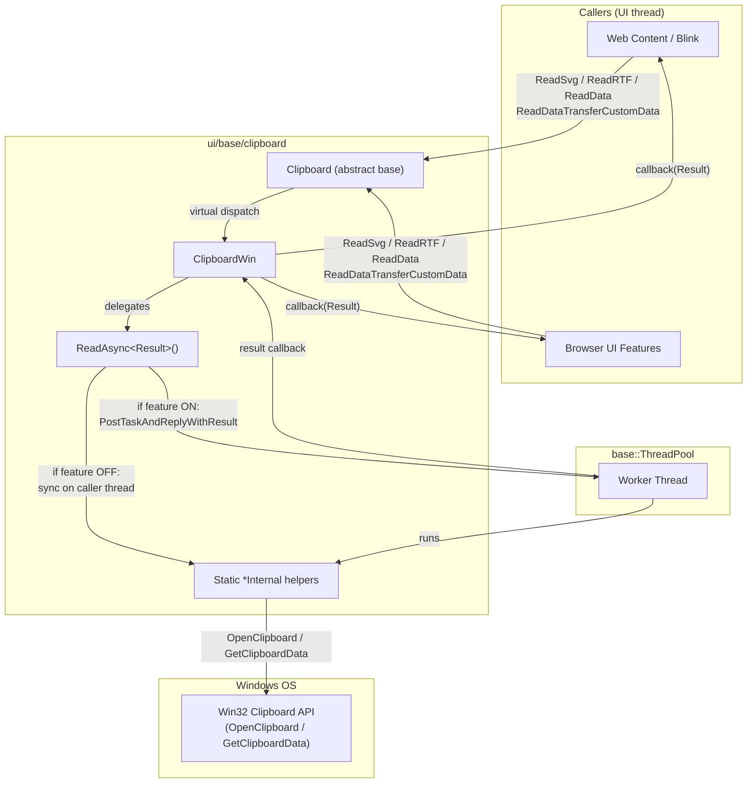
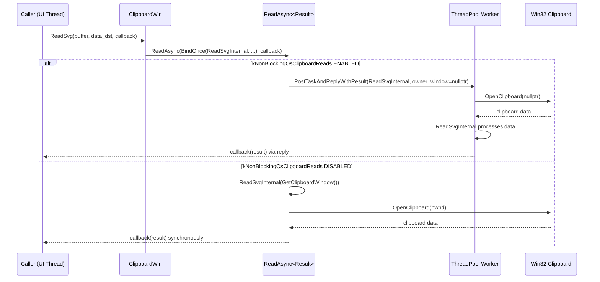

# High-Level Design: CL 7578233

## [Clipboard][Windows] Async ReadSvg / ReadRTF / ReadDataTransferCustomData / ReadData with ThreadPool Offloading

**CL:** [7578233](https://chromium-review.googlesource.com/c/chromium/src/+/7578233)
**Author:** Hewro Hewei (ihewro@chromium.org)
**Reviewer:** Thomas Anderson (thomasanderson@chromium.org)
**Bug:** [458194647](https://crbug.com/458194647)
**Status:** NEW (Code-Review +1)

---

## 1. Executive Summary

This CL extends the Windows clipboard async-read infrastructure (gated behind the `kNonBlockingOsClipboardReads` feature flag) to four additional clipboard read operations: **ReadSvg**, **ReadRTF**, **ReadDataTransferCustomData**, and **ReadData**. Previously, these four operations used only the synchronous (raw-pointer out-param) codepath, which blocks the calling thread while acquiring the Windows clipboard lock and reading global memory. By introducing callback-based async overrides that delegate to static `*Internal` helper functions via `ClipboardWin::ReadAsync`, these operations can now be offloaded to a dedicated `base::ThreadPool` worker — matching the pattern already established for `ReadText`, `ReadAsciiText`, `ReadAvailableTypes`, `ReadHtml`, `ReadPng`, and `ReadFilenames`. The expected impact is reduced UI-thread jank on Windows when web content or browser features read SVG, RTF, custom DataTransfer, or raw clipboard data.

---

## 2. Architecture Overview

### Affected Components

| Component | Path | Role |
|-----------|------|------|
| `ClipboardWin` | `ui/base/clipboard/clipboard_win.{h,cc}` | Windows `Clipboard` implementation |
| `Clipboard` (base class) | `ui/base/clipboard/clipboard.h` | Platform-agnostic interface declaring virtual async read methods |
| `ClipboardWin` unit tests | `ui/base/clipboard/clipboard_win_unittest.cc` | Coverage for new async paths |

### How It Fits Into Existing Architecture

`Clipboard` declares two families of virtual read methods per format:

1. **Synchronous** — `void Read*(…, T* result) const` (raw-pointer out-param, legacy).
2. **Async (callback-based)** — `void Read*(…, ReadCallback callback) const` (introduced with `kNonBlockingOsClipboardReads`).

`ClipboardWin` already overrides the async variants for Text, AsciiText, AvailableTypes, HTML, PNG, and Filenames. This CL adds overrides for the remaining four: SVG, RTF, DataTransferCustomData, and Data — completing the async coverage for all clipboard read operations on Windows.

The core dispatch mechanism is the template method `ClipboardWin::ReadAsync<Result>()`, which either runs the static `*Internal` function synchronously (feature disabled) or posts it to `worker_task_runner_` and relays the result back via `PostTaskAndReplyWithResult` (feature enabled).

### Component Diagram

---

## 3. Design Goals & Non-Goals

### Goals

| # | Goal |
|---|------|
| G1 | Provide async (callback-based) overrides for `ReadSvg`, `ReadRTF`, `ReadDataTransferCustomData`, and `ReadData` on Windows. |
| G2 | Reuse the existing `ReadAsync<Result>()` template to offload clipboard I/O to the ThreadPool, keeping the pattern consistent with already-converted methods. |
| G3 | Preserve existing synchronous codepaths by having them delegate to the same static `*Internal` functions, avoiding code duplication. |
| G4 | Gate the async-offloading behavior behind the existing `kNonBlockingOsClipboardReads` feature flag (no new flags introduced). |
| G5 | Add unit test coverage for all four new async overrides (happy path + empty clipboard). |

### Non-Goals

| # | Non-Goal |
|---|----------|
| NG1 | Converting read operations on other platforms (Mac, Linux, ChromeOS) — out of scope. |
| NG2 | Removing or deprecating the synchronous `Read*(…, T* result)` overrides — they remain for backward compatibility. |
| NG3 | Changing the write path or clipboard change notification logic. |
| NG4 | Modifying the `kNonBlockingOsClipboardReads` feature flag default state. |
| NG5 | Addressing overlapping CL [7590029](https://chromium-review.googlesource.com/c/chromium/src/+/7590029) by thomasanderson — coordination noted in review comments but not resolved in this CL. |

---

## 4. System Interactions

### Main Flow: Async Clipboard Read (Feature Enabled)

### Key Detail: `owner_window` Parameter

When the feature is **enabled**, `ReadAsync` passes `owner_window = nullptr` to the `*Internal` static function. This causes `OpenClipboard(NULL)` to be called on the worker thread, which is valid per Win32 semantics — it associates the clipboard with the calling thread rather than a specific window. When the feature is **disabled**, `GetClipboardWindow()` provides the `HWND` of the hidden message window owned by `ClipboardWin`, and the call executes synchronously on the UI thread.

### IPC / Mojo Interactions

This CL does not directly involve IPC or Mojo. However, the async clipboard reads are typically triggered via Mojo IPC from the renderer process through `blink::mojom::ClipboardHost`, which calls into `ui::Clipboard` on the browser's UI thread. The async pattern allows the browser-side handler to avoid blocking while the OS clipboard lock is held.

---

## 5. API & Interface Changes

### New Public Interface Overrides (in `ClipboardWin`)

These are overrides of virtual methods already declared in the `Clipboard` base class. The base class provides default implementations that call the synchronous variant; `ClipboardWin` now overrides them with ThreadPool-offloaded implementations.

| Method | Signature | File |
|--------|-----------|------|
| `ReadSvg` (async) | `void ReadSvg(ClipboardBuffer, const std::optional<DataTransferEndpoint>&, ReadSvgCallback) const override` | `clipboard_win.h#L73` |
| `ReadRTF` (async) | `void ReadRTF(ClipboardBuffer, const std::optional<DataTransferEndpoint>&, ReadRTFCallback) const override` | `clipboard_win.h#L76` |
| `ReadDataTransferCustomData` (async) | `void ReadDataTransferCustomData(ClipboardBuffer, const std::u16string&, const std::optional<DataTransferEndpoint>&, ReadDataTransferCustomDataCallback) const override` | `clipboard_win.h#L79` |
| `ReadData` (async) | `void ReadData(const ClipboardFormatType&, const std::optional<DataTransferEndpoint>&, ReadDataCallback) const override` | `clipboard_win.h#L85` |

### New Private Static Helpers (in `ClipboardWin`)

These extract the core read logic into free-standing static functions suitable for execution on any thread.

| Method | Return Type | Purpose | File |
|--------|-------------|---------|------|
| `ReadSvgInternal` | `std::u16string` | Reads SVG data via `ReadDataInternal`, converts encoding | `clipboard_win.h#L194` |
| `ReadRTFInternal` | `std::string` | Reads RTF data, normalizes encoding to UTF-8 | `clipboard_win.h#L198` |
| `ReadDataTransferCustomDataInternal` | `std::u16string` | Acquires clipboard, reads custom DataTransfer format | `clipboard_win.h#L201` |
| `ReadDataInternal` | `std::string` | Acquires clipboard, reads raw format data via `GlobalLock` | `clipboard_win.h#L206` |

### Modified Interfaces

The existing synchronous methods (`ReadSvg`, `ReadRTF`, `ReadDataTransferCustomData`, `ReadData` with raw-pointer out-params) are refactored to delegate to the corresponding `*Internal` static functions. Their public signatures are **unchanged**; only the internal implementation changes.

### Deprecated Interfaces

None. The synchronous variants remain functional.

---

## 6. Dependencies

### What This Code Depends On

| Dependency | Nature |
|------------|--------|
| `Clipboard` base class (`ui/base/clipboard/clipboard.h`) | Declares the virtual async read methods and callback types that `ClipboardWin` overrides. |
| `ReadAsync<Result>()` template (`clipboard_win.cc`) | Pre-existing dispatch mechanism that routes to ThreadPool or runs synchronously. |
| `kNonBlockingOsClipboardReads` feature flag (`ui/base/clipboard/clipboard_features.h`) | Gates async offloading behavior. |
| `base::ThreadPool` / `base::SequencedTaskRunner` | Provides `worker_task_runner_` for off-thread execution. |
| `ScopedClipboard` / `GetClipboardDataWithLimit` | Internal Windows clipboard access helpers. |
| `base::OptionalFromPtr` | Converts `DataTransferEndpoint*` to `std::optional<DataTransferEndpoint>` at the sync→internal boundary. |
| Win32 API (`OpenClipboard`, `GetClipboardData`, `GlobalLock`, `GlobalSize`, `GlobalUnlock`) | OS-level clipboard access. |

### What Depends On This Code

| Dependent | Impact |
|-----------|--------|
| `blink::mojom::ClipboardHost` implementation | Calls `Clipboard::ReadSvg/ReadRTF/ReadData/ReadDataTransferCustomData` — will now use async path on Windows when feature is enabled. |
| `ScopedClipboardWriter` / clipboard test utilities | No changes needed; they use the write path. |
| Other `Clipboard` platform implementations | Unaffected; only `ClipboardWin` is modified. |

### Version / Compatibility

- No new feature flags introduced; relies on existing `kNonBlockingOsClipboardReads`.
- No Mojo interface changes.
- Binary-compatible: only virtual method overrides added in `ClipboardWin` (a final class not subclassed externally).

---

## 7. Risks & Mitigations

| # | Risk | Severity | Mitigation |
|---|------|----------|------------|
| R1 | **Thread safety of `ScopedClipboard` / `GetClipboardDataWithLimit`**: These helpers are now called from a ThreadPool worker rather than the UI thread. | Medium | The static `*Internal` functions are self-contained — they acquire and release the clipboard lock within their scope. `ScopedClipboard::Acquire(nullptr)` is valid per Win32 docs. Pre-existing pattern used by `ReadFilenamesInternal`, `ReadPngInternal`, etc. |
| R2 | **Overlapping CL [7590029](https://chromium-review.googlesource.com/c/chromium/src/+/7590029)** by thomasanderson covers similar changes. | Medium | Author noted the overlap in review comments. Coordination is needed to avoid merge conflicts and duplicated logic. |
| R3 | **`owner_window = nullptr` semantics**: On the worker thread, `OpenClipboard(NULL)` associates the clipboard with the calling thread. If the thread is reused or if another thread also calls `OpenClipboard(NULL)`, there could be contention. | Low | The ThreadPool worker is on a `base::SequencedTaskRunner`, serializing all clipboard reads. The Win32 clipboard lock is acquired/released within each `*Internal` call scope. |
| R4 | **Feature flag disabled path regression**: The synchronous `Read*` methods now delegate to `*Internal` functions with a `std::optional<DataTransferEndpoint>` copy instead of a raw pointer. | Low | `base::OptionalFromPtr` faithfully converts. `CHECK(result)` guards added at the synchronous entry points. Unit tests cover both sync test helpers and async futures. |
| R5 | **Encoding handling for SVG and RTF**: `ReadSvgInternal` and `ReadRTFInternal` include encoding conversion logic (`UTF8ToUTF16`, `DetectEncoding`, `ConvertToUtf8AndNormalize`). Running on a worker thread should be safe but increases the work done off the UI thread. | Low | These are pure functions operating on local data — no thread-safety concerns. This is actually a benefit (less UI-thread work). |

### Backward Compatibility

- Synchronous `Read*(…, T* result)` overrides remain unchanged in signature and continue to work.
- The async overrides are additive (new virtual overrides, not replacements).
- No migration needed for callers — the `Clipboard` base class already provides default async implementations that call the synchronous path. `ClipboardWin` now simply provides optimized overrides.

---

## 8. Testing Strategy

### New Tests Added (in `clipboard_win_unittest.cc`)

| Test Name | What It Verifies |
|-----------|-----------------|
| `ReadSvgAsyncReturnsWrittenData` | Writes SVG via `ScopedClipboardWriter`, reads via async `ReadSvg`, asserts correct round-trip. |
| `ReadSvgAsyncEmptyClipboard` | Clears clipboard, reads via async `ReadSvg`, asserts empty result. |
| `ReadRTFAsyncReturnsWrittenData` | Writes RTF, reads via async `ReadRTF`, asserts correct round-trip. |
| `ReadRTFAsyncEmptyClipboard` | Clears clipboard, reads via async `ReadRTF`, asserts empty result. |
| `ReadDataTransferCustomDataAsyncReturnsWrittenData` | Writes custom DataTransfer pickle, reads via async `ReadDataTransferCustomData`, asserts correct value. |
| `ReadDataTransferCustomDataAsyncEmptyClipboard` | Clears clipboard, reads via async `ReadDataTransferCustomData`, asserts empty. |
| `ReadDataAsyncReturnsWrittenData` | Writes raw data via `WriteRawDataForTest`, reads via async `ReadData`, asserts correct round-trip. |
| `ReadDataAsyncEmptyClipboard` | Clears clipboard, reads via async `ReadData`, asserts empty. |

### Existing Test Coverage Extended

The `ClipboardDoesNotFireClipboardChanged` test is extended to also exercise the new async overrides (SVG, RTF, DataTransferCustomData, Data) to verify they do not trigger spurious clipboard-changed notifications.

### Test Infrastructure

- Tests use `base::test::TestFuture<T>` to await async results.
- Tests use `base::test::TaskEnvironment` for threading support.
- All tests run under the `ClipboardWinTest` fixture which sets up a real `Clipboard` instance.

### Coverage Assessment

| Aspect | Covered? |
|--------|----------|
| Happy-path round-trip for each format | ✅ |
| Empty clipboard (no data) for each format | ✅ |
| No spurious clipboard-changed events | ✅ |
| Feature flag ON (async path) | ✅ (via `TestFuture` async waits) |
| Feature flag OFF (sync fallback) | ⚠️ Indirectly — the synchronous `Read*` helpers delegate to same `*Internal` functions. No explicit test toggling the feature flag. |
| Thread-safety stress testing | ❌ Not included (consistent with existing tests) |

---

## Appendix: File-Level Change Summary

### `ui/base/clipboard/clipboard_win.h` (+32 lines)

- Declares four new async override methods: `ReadSvg`, `ReadRTF`, `ReadDataTransferCustomData`, `ReadData` (callback variants).
- Declares four new private static helpers: `ReadSvgInternal`, `ReadRTFInternal`, `ReadDataTransferCustomDataInternal`, `ReadDataInternal`.

### `ui/base/clipboard/clipboard_win.cc` (+118/-24 lines)

- Implements the four async overrides, each delegating to `ReadAsync()` with a `BindOnce` to the corresponding `*Internal` static.
- Refactors the four synchronous `Read*` methods to delegate to `*Internal` (adds `CHECK(result)`, calls `base::OptionalFromPtr` for the `DataTransferEndpoint` conversion).
- Extracts core logic into four static `*Internal` functions that return values by value (instead of writing to out-params), making them suitable for `PostTaskAndReplyWithResult`.

### `ui/base/clipboard/clipboard_win_unittest.cc` (+137 lines)

- Adds 8 new `TEST_F` cases covering async reads for all four formats (data + empty).
- Extends the clipboard-changed notification test to cover async overrides.
- Adds `#include` for `base/pickle.h`, `custom_data_helper.h`, and `<unordered_map>`.
