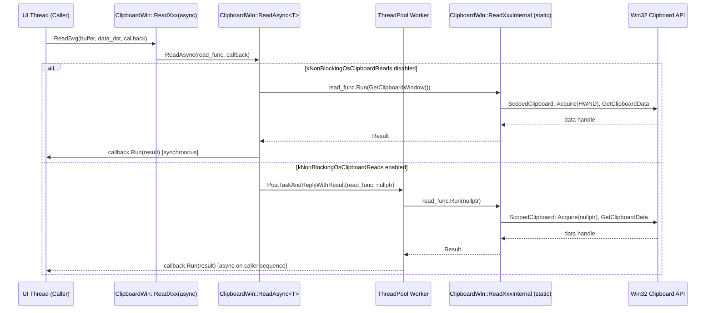
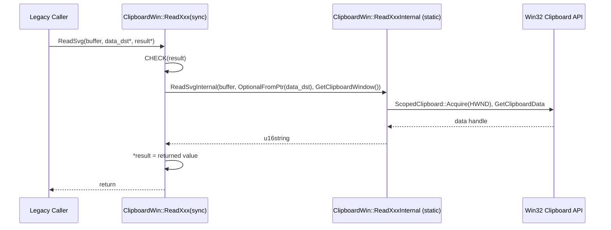
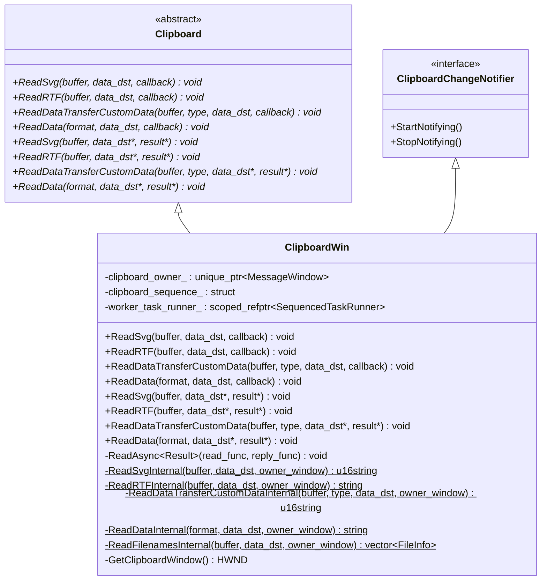

# Low-Level Design: CL 7578233

## [Clipboard][Windows] Use async ReadSvg/ReadRTF/ReadDataTransferCustomData/ReadData with ThreadPool offloading

**CL URL:** https://chromium-review.googlesource.com/c/chromium/src/+/7578233
**Bug:** 458194647
**Owner:** Hewro Hewei (ihewro@chromium.org)
**Reviewer:** Thomas Anderson (thomasanderson@chromium.org) — CR+1

---

## 1. File-by-File Analysis

### 1.1 `ui/base/clipboard/clipboard_win.h` (+32/-0)

**Purpose of changes:** Declare four new async read method overrides and their corresponding static `*Internal` helper functions.

**Key modifications:**
- Added override declarations for `ReadSvg`, `ReadRTF`, `ReadDataTransferCustomData`, and `ReadData` with callback-based (async) signatures.
- Added static internal helper declarations: `ReadSvgInternal`, `ReadRTFInternal`, `ReadDataTransferCustomDataInternal`, `ReadDataInternal`.

**New/Modified Functions:**

| Function | Purpose | Parameters | Returns |
|----------|---------|------------|---------|
| `ReadSvg(buffer, data_dst, callback)` | Async override for reading SVG from clipboard | `ClipboardBuffer`, `optional<DataTransferEndpoint>&`, `ReadSvgCallback` | `void` |
| `ReadRTF(buffer, data_dst, callback)` | Async override for reading RTF from clipboard | `ClipboardBuffer`, `optional<DataTransferEndpoint>&`, `ReadRTFCallback` | `void` |
| `ReadDataTransferCustomData(buffer, type, data_dst, callback)` | Async override for reading custom data transfer data | `ClipboardBuffer`, `u16string&`, `optional<DataTransferEndpoint>&`, `ReadDataTransferCustomDataCallback` | `void` |
| `ReadData(format, data_dst, callback)` | Async override for reading raw clipboard data by format | `ClipboardFormatType&`, `optional<DataTransferEndpoint>&`, `ReadDataCallback` | `void` |
| `ReadSvgInternal(buffer, data_dst, owner_window)` | Static: thread-safe SVG read logic | `ClipboardBuffer`, `optional<DataTransferEndpoint>&`, `HWND` | `std::u16string` |
| `ReadRTFInternal(buffer, data_dst, owner_window)` | Static: thread-safe RTF read logic | `ClipboardBuffer`, `optional<DataTransferEndpoint>&`, `HWND` | `std::string` |
| `ReadDataTransferCustomDataInternal(buffer, type, data_dst, owner_window)` | Static: thread-safe custom data read logic | `ClipboardBuffer`, `u16string&`, `optional<DataTransferEndpoint>&`, `HWND` | `std::u16string` |
| `ReadDataInternal(format, data_dst, owner_window)` | Static: thread-safe raw data read logic | `ClipboardFormatType&`, `optional<DataTransferEndpoint>&`, `HWND` | `std::string` |

---

### 1.2 `ui/base/clipboard/clipboard_win.cc` (+118/-24)

**Purpose of changes:** Implement the four new async read methods and refactor the existing synchronous read methods to delegate to static `*Internal` helpers that can run on a worker thread.

**Key modifications:**
- Added four new async method implementations (`ReadSvg`, `ReadRTF`, `ReadDataTransferCustomData`, `ReadData`) that delegate to `ReadAsync()` template.
- Refactored existing synchronous `ReadSvg`, `ReadRTF`, `ReadDataTransferCustomData`, `ReadData` to call through the new static `*Internal` methods.
- Each `*Internal` static method returns a value (rather than using out-params), making them compatible with `PostTaskAndReplyWithResult`.
- Added `CHECK(result)` guards on all synchronous entry points that take raw pointer out-params.

#### 1.2.1 Async Entry Points (New Code)

Each async method follows an identical pattern — bind the static `*Internal` method with its parameters (excluding `HWND`) into a `base::OnceCallback<Result(HWND)>`, then pass it to `ReadAsync`:

```cpp
void ClipboardWin::ReadSvg(ClipboardBuffer buffer,
                           const std::optional<DataTransferEndpoint>& data_dst,
                           ReadSvgCallback callback) const {
  ReadAsync(base::BindOnce(&ClipboardWin::ReadSvgInternal, buffer, data_dst),
            std::move(callback));
}
```

The other three (`ReadRTF`, `ReadDataTransferCustomData`, `ReadData`) are identical in structure.

#### 1.2.2 Synchronous Entry Points (Refactored)

Each synchronous method now: (1) CHECKs the out-pointer, (2) converts `DataTransferEndpoint*` → `optional` via `base::OptionalFromPtr`, (3) calls the static `*Internal` and assigns the result:

```cpp
void ClipboardWin::ReadSvg(ClipboardBuffer buffer,
                           const DataTransferEndpoint* data_dst,
                           std::u16string* result) const {
  CHECK(result);
  *result = ReadSvgInternal(buffer, base::OptionalFromPtr(data_dst),
                            GetClipboardWindow());
}
```

#### 1.2.3 Static Internal Helpers (New Code)

| Function | Key Logic |
|----------|-----------|
| `ReadSvgInternal` | Calls `ReadDataInternal` with `SvgType()`, then converts via UTF-8 or raw char16_t reinterpretation based on `kUseUtf8EncodingForSvgImage` feature flag. Trims after null. |
| `ReadRTFInternal` | Calls `ReadDataInternal` with `RtfType()`, detects encoding, normalizes to UTF-8, trims after null. |
| `ReadDataTransferCustomDataInternal` | Acquires clipboard via `ScopedClipboard`, reads `DataTransferCustomType` handle, locks global memory, extracts typed data via `ReadCustomDataForType`. |
| `ReadDataInternal` | Acquires clipboard via `ScopedClipboard`, reads format handle via `GetClipboardDataWithLimit`, locks/copies global memory into `std::string`. |

**Data Flow:**



**Synchronous path (legacy callers):**



---

### 1.3 `ui/base/clipboard/clipboard_win_unittest.cc` (+137/-0)

**Purpose of changes:** Add unit tests for all four new async read methods, covering both the happy path (data present) and the empty clipboard case.

**Key modifications:**
- Added `#include <unordered_map>`, `base/pickle.h`, `custom_data_helper.h` for custom data test setup.
- Extended existing `ClipboardDoesNotFireObserver` test with async calls for `ReadSvg`, `ReadRTF`, `ReadDataTransferCustomData`, and `ReadData` to verify no spurious observer notifications.
- Added 8 new test cases.

**New Test Cases:**

| Test Name | What It Tests | Data Setup | Assertion |
|-----------|---------------|------------|-----------|
| `ReadSvgAsyncReturnsWrittenData` | Async SVG read returns correct data | `ScopedClipboardWriter::WriteSvg(u"svg_test")` | `== u"svg_test"` |
| `ReadSvgAsyncEmptyClipboard` | Async SVG read on empty clipboard | `clipboard->Clear()` | `.empty()` |
| `ReadRTFAsyncReturnsWrittenData` | Async RTF read returns correct data | `ScopedClipboardWriter::WriteRTF("rtf_test")` | `== "rtf_test"` |
| `ReadRTFAsyncEmptyClipboard` | Async RTF read on empty clipboard | `clipboard->Clear()` | `.empty()` |
| `ReadDataTransferCustomDataAsyncReturnsWrittenData` | Async custom data read | Pickle with `{u"text/plain": u"custom_data"}` via `WritePickledData` | `== u"custom_data"` |
| `ReadDataTransferCustomDataAsyncEmptyClipboard` | Async custom data read on empty clipboard | `clipboard->Clear()` | `.empty()` |
| `ReadDataAsyncReturnsWrittenData` | Async raw data read | `WriteRawDataForTest` with custom format `"chromium-raw-test"` | `== "data"` |
| `ReadDataAsyncEmptyClipboard` | Async raw data read on empty clipboard | `clipboard->Clear()` | `.empty()` |

All tests use `base::test::TestFuture<T>` to await the async callback result.

---

## 2. Class Diagram



---

## 3. State Diagram

```mermaid
stateDiagram-v2
    [*] --> AsyncEntryPoint: ReadXxx(buffer, data_dst, callback)

    AsyncEntryPoint --> CheckFeatureFlag: ReadAsync called

    CheckFeatureFlag --> SynchronousExecution: kNonBlockingOsClipboardReads OFF
    CheckFeatureFlag --> ThreadPoolPost: kNonBlockingOsClipboardReads ON

    SynchronousExecution --> InternalHelper: read_func.Run(GetClipboardWindow())
    InternalHelper --> AcquireClipboard: ScopedClipboard::Acquire(HWND)
    AcquireClipboard --> ReadClipboardData: GetClipboardDataWithLimit
    ReadClipboardData --> ProcessResult: Transform/normalize data
    ProcessResult --> RunCallback: reply_func.Run(result)
    RunCallback --> [*]

    ThreadPoolPost --> WorkerThread: PostTaskAndReplyWithResult
    WorkerThread --> InternalHelperAsync: read_func.Run(nullptr)
    InternalHelperAsync --> AcquireClipboardAsync: ScopedClipboard::Acquire(nullptr)
    AcquireClipboardAsync --> ReadClipboardDataAsync: GetClipboardDataWithLimit
    ReadClipboardDataAsync --> ProcessResultAsync: Transform/normalize data
    ProcessResultAsync --> ReplyOnCallerThread: Reply posted to caller sequence
    ReplyOnCallerThread --> RunCallbackAsync: reply_func.Run(result)
    RunCallbackAsync --> [*]
```

---

## 4. Implementation Concerns

### 4.1 Memory Management
- **No concerns.** All data is returned by value (`std::string`, `std::u16string`), avoiding dangling pointer issues. `ScopedClipboard` and `ScopedHGlobal` ensure proper RAII cleanup of Win32 handles. The `CHECK(result)` guards on synchronous paths prevent null pointer dereferences.

### 4.2 Thread Safety
- **Static internal helpers are thread-safe by design.** They access no instance state — all data comes from parameters or Win32 global APIs. `RecordRead` (UMA histogram recording) is thread-safe.
- **`HWND owner_window` semantics:** When running on the thread pool (`kNonBlockingOsClipboardReads` enabled), `owner_window` is `nullptr`. The Windows `OpenClipboard(NULL)` call associates the clipboard with the calling task rather than a specific window, which is correct for background thread usage.
- **`ReadDataTransferCustomDataInternal` acquires the clipboard lock itself** via `ScopedClipboard`, which is correct since it needs to read a different format than `ReadDataInternal` does (it reads `DataTransferCustomType` directly rather than delegating to `ReadDataInternal`).

### 4.3 Performance Implications
- **Positive.** This CL is specifically designed to improve performance by offloading clipboard reads to a thread pool worker, avoiding blocking the UI thread. This is gated behind the `kNonBlockingOsClipboardReads` feature flag.
- **Minimal overhead when flag is off.** The synchronous path adds only one extra function call (the static helper) and a value return (move semantics minimize copies).
- **`ReadSvgInternal` calls `ReadDataInternal` internally**, which means SVG reads open/close the clipboard once (good — no double-acquire).

### 4.4 Maintainability
- **Consistent pattern.** All four new async methods follow the exact same pattern as the existing `ReadText`, `ReadAsciiText`, `ReadAvailableTypes`, and `ReadFilenames` async implementations. This makes the code predictable and easy to extend.
- **Static helpers are reusable.** Both the sync and async paths share the same `*Internal` logic, eliminating code duplication.
- **Minor nit:** The commit message has a typo — "RadRTF" should be "ReadRTF".

---

## 5. Suggestions for Improvement

### 5.1 Commit Message Typo
The commit message reads `ReadSvg/RadRTF/ReadDataTransferCustomData/ReadData` — "RadRTF" should be "ReadRTF".

### 5.2 Consider Adding Async Bookmark Read
`ReadBookmark` is the only remaining sync-only read method without an async counterpart. For completeness and to fully unblock the UI thread for all clipboard reads, it could be converted in a follow-up CL.

### 5.3 Test Coverage for Feature Flag States
The current tests rely on the default feature flag state. Consider adding test parameterization (or explicit `ScopedFeatureList` toggling) to verify both the synchronous fallback path (`kNonBlockingOsClipboardReads` off) and the async thread-pool path (`kNonBlockingOsClipboardReads` on) for these new methods, similar to what may exist for other async read methods.

### 5.4 ReadHTMLInternal Consistency
The existing `ReadHTMLInternal` still uses out-params (with a `TODO` comment referencing bug 458194647). The new `*Internal` methods correctly return by value. A follow-up could refactor `ReadHTMLInternal` to match.

### 5.5 Parameter Order Consistency
`ReadHTMLInternal` takes `(HWND, buffer, data_dst)` while all other `*Internal` methods take `(buffer, data_dst, HWND)`. Aligning the parameter order would improve consistency.
