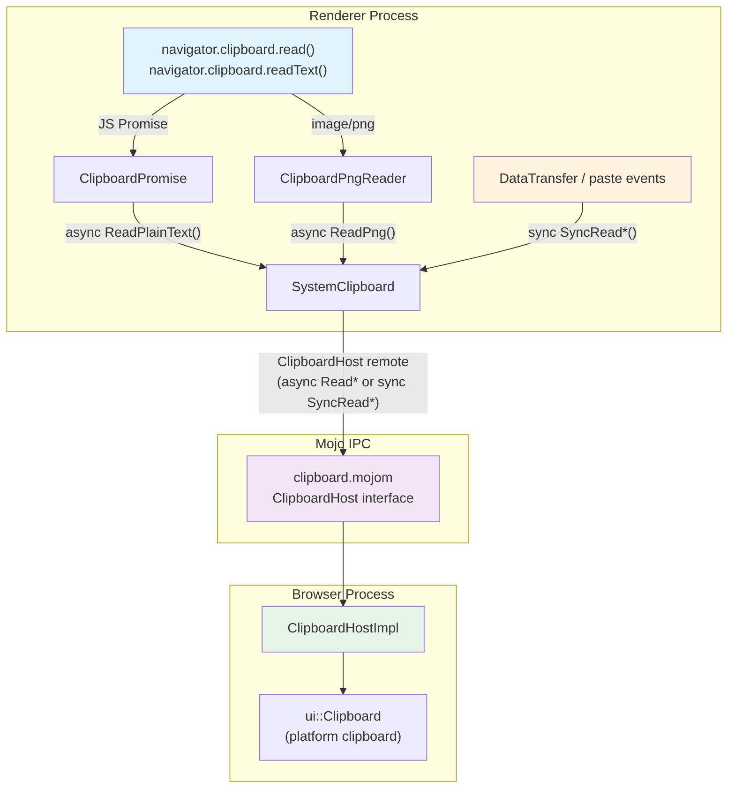
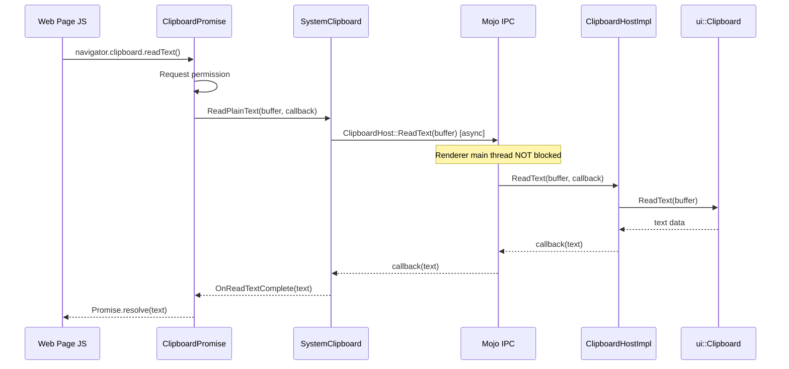
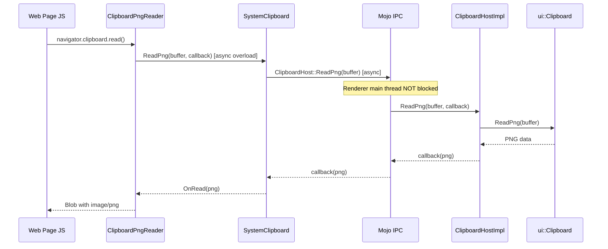
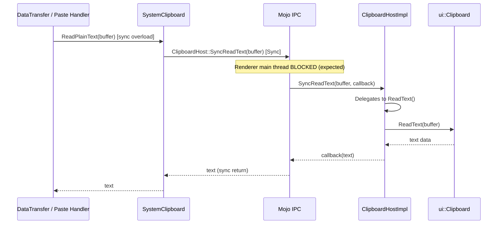

# High-Level Design: Async Clipboard API — Convert Sync Mojom IPC to Async

**CL:** [7579673](https://chromium-review.googlesource.com/c/chromium/src/+/7579673)
**Author:** Rohan Raja \<roraja@microsoft.com\>
**Bug:** [chromium:474131935](https://crbug.com/474131935)
**Date:** 2026-02-15

---

## 1. Executive Summary

This CL converts 8 synchronous (`[Sync]`) Mojo IPC read methods in the `ClipboardHost` interface to asynchronous, eliminating renderer main-thread blocking when the Async Clipboard API (`navigator.clipboard.read()` / `navigator.clipboard.readText()`) is used. The blocking was particularly harmful when the clipboard source application (e.g., Microsoft Excel) uses delayed/lazy clipboard rendering — the synchronous IPC chain froze the browser UI for multiple seconds while waiting for the source app to produce data. To preserve backward compatibility for existing synchronous callers (DataTransfer / paste events), the CL introduces parallel `SyncRead*` legacy methods that retain the `[Sync]` annotation. The expected impact is a significantly more responsive browsing experience when web applications read clipboard data asynchronously.

---

## 2. Architecture Overview

### Affected Chromium Components

| Layer | Component | Role |
|-------|-----------|------|
| **Mojo Interface** | `clipboard.mojom` | Defines the IPC contract between renderer and browser |
| **Browser Process** | `ClipboardHostImpl` | Implements the `ClipboardHost` Mojo interface; delegates to `ui::Clipboard` |
| **Renderer — Core** | `SystemClipboard` | Renderer-side Mojo client; wraps `ClipboardHost` remote calls |
| **Renderer — Modules** | `ClipboardPromise` | Implements the JS `navigator.clipboard.readText()` promise |
| **Renderer — Modules** | `ClipboardPngReader` | Implements the JS `navigator.clipboard.read()` for image/png |
| **Test Infrastructure** | `MockClipboardHost` (×2), `clipboard_host_impl_unittest`, `system_clipboard_test` | Test doubles and test coverage |
| **Web Tests** | `test_runner.cc` | Web-test clipboard helper |

### Component Diagram



### How It Fits Into Existing Architecture

Chromium's clipboard access follows a strict renderer → browser IPC pattern via Mojo. The `ClipboardHost` interface in `clipboard.mojom` is the single gateway. Previously, all read methods were `[Sync]`, meaning the renderer's main thread would block on every clipboard read, regardless of whether the caller was synchronous (paste events) or asynchronous (Clipboard API). This CL splits the interface into two parallel sets of methods — async `Read*` for the Clipboard API path and sync `SyncRead*` for the legacy paste/DataTransfer path — without altering the browser-side implementation logic.

---

## 3. Design Goals & Non-Goals

### Goals

1. **Unblock the renderer main thread** for Async Clipboard API reads (`navigator.clipboard.read()`, `navigator.clipboard.readText()`).
2. **Preserve backward compatibility** for synchronous callers (DataTransfer, paste event handlers) by introducing `SyncRead*` variants.
3. **Minimize behavioral changes** — the browser-side `ClipboardHostImpl` implementation is unchanged; `SyncRead*` methods simply delegate to the existing `Read*` implementations.
4. **Maintain full test coverage** — new unit tests verify parity between sync and async paths.

### Non-Goals

- **Converting all clipboard operations to async** — write operations and format-checking (`IsFormatAvailable`) remain unchanged.
- **Eliminating `[Sync]` Mojo IPC entirely** — the `SyncRead*` methods intentionally preserve synchronous semantics for callers that require it.
- **Changing the `ui::Clipboard` platform abstraction** — the browser-side clipboard backend is untouched.
- **Adding async overloads for ReadText in SystemClipboard** — only `ReadPng` gets a new async overload in `SystemClipboard`; `ReadPlainText` async is handled directly in `ClipboardPromise` via the Mojo remote.
- **Addressing clipboard write performance** — out of scope for this CL.

---

## 4. System Interactions

### Main Flow: Async Clipboard API `readText()`



### Main Flow: Async Clipboard API `read()` (PNG)



### Legacy Flow: DataTransfer / Paste Event (Sync)



---

## 5. API & Interface Changes

### Mojom Interface (`third_party/blink/public/mojom/clipboard/clipboard.mojom`)

#### Modified — `[Sync]` annotation removed (now async)

| Method | Signature |
|--------|-----------|
| `ReadAvailableTypes` | `(ClipboardBuffer buffer) => (array<String16> types)` |
| `ReadText` | `(ClipboardBuffer buffer) => (BigString16 result)` |
| `ReadHtml` | `(ClipboardBuffer buffer) => (BigString16 markup, Url url, uint32 start, uint32 end)` |
| `ReadRtf` | `(ClipboardBuffer buffer) => (BigString result)` |
| `ReadPng` | `(ClipboardBuffer buffer) => (BigBuffer png)` |
| `ReadFiles` | `(ClipboardBuffer buffer) => (ClipboardFiles result)` |
| `ReadDataTransferCustomData` | `(ClipboardBuffer buffer, String16 type) => (BigString16 result)` |
| `ReadAvailableCustomAndStandardFormats` | `() => (array<String16> format_types)` |

#### New — `[Sync]` legacy variants

| Method | Annotation | Purpose |
|--------|------------|---------|
| `SyncReadAvailableTypes` | `[Sync]` | Legacy sync for DataTransfer |
| `SyncReadText` | `[Sync]` | Legacy sync for paste events |
| `SyncReadHtml` | `[Sync]` | Legacy sync for paste events |
| `SyncReadRtf` | `[Sync]` | Legacy sync for paste events |
| `SyncReadPng` | `[Sync]` | Legacy sync for paste events |
| `SyncReadFiles` | `[Sync]` | Legacy sync for paste events |
| `SyncReadDataTransferCustomData` | `[Sync]` | Legacy sync for DataTransfer |
| `SyncReadAvailableCustomAndStandardFormats` | `[Sync]` | Legacy sync for custom formats |

### C++ Public API Changes

#### `SystemClipboard` (`third_party/blink/renderer/core/clipboard/system_clipboard.h`)

- **New async overload:**
  ```cpp
  void ReadPng(mojom::blink::ClipboardBuffer buffer,
               mojom::blink::ClipboardHost::ReadPngCallback callback);
  ```

#### `ClipboardPromise` (`third_party/blink/renderer/modules/clipboard/clipboard_promise.h`)

- **New private callback:**
  ```cpp
  void OnReadTextComplete(const String& text);
  ```

#### `ClipboardPngReader` (`third_party/blink/renderer/modules/clipboard/clipboard_reader.cc`)

- **Refactored:** `Read()` now dispatches to `OnRead(mojo_base::BigBuffer)` via async callback instead of blocking inline.

### Deprecated / Redirected

The existing synchronous call sites in `SystemClipboard` (e.g., `ReadPlainText()`, `ReadHTML()`) now route through `SyncRead*` mojom methods instead of the formerly-sync `Read*` methods. No public C++ API is removed.

---

## 6. Dependencies

### What This Code Depends On

| Dependency | Description |
|------------|-------------|
| `ui::Clipboard` | Platform clipboard abstraction (unchanged) |
| Mojo IPC framework | Message passing between renderer ↔ browser |
| `mojo_base::BigBuffer` | Efficient cross-process buffer transfer for PNG data |
| `base::OnceCallback` / `BindOnce` | Async callback plumbing |
| `WrapPersistent` | GC prevent pointers into Blink GC-heap across async boundaries |

### What Depends On This Code

| Dependent | Impact |
|-----------|--------|
| `navigator.clipboard.read()` / `readText()` | **Improved** — now truly async, no main-thread blocking |
| DataTransfer / paste event handlers | **Unchanged** — routed through `SyncRead*` variants |
| Web tests (`test_runner.cc`) | **Updated** — switched from `ReadPng` → `SyncReadPng` |
| `ClipboardHostImpl` unit tests | **Updated** — use `SyncReadAvailableTypes`; new parity tests added |
| All `MockClipboardHost` implementations | **Updated** — implement new `SyncRead*` methods |

### Version/Compatibility Considerations

- The Mojo interface change is **not backward compatible** at the wire level — both browser and renderer must be updated atomically. This is standard for Chromium Mojo interface changes since browser and renderer are always shipped together.
- No feature flag is introduced; the change takes effect immediately upon landing.

---

## 7. Risks & Mitigations

| Risk | Severity | Mitigation |
|------|----------|------------|
| **Behavioral regression in async callers** — race conditions or use-after-free if the execution context is destroyed before the async callback fires | High | `OnReadTextComplete` checks `GetExecutionContext()` before resolving. `WrapPersistent(this)` prevents premature GC. `DCHECK_CALLED_ON_VALID_SEQUENCE` enforces thread safety. |
| **Sync caller breakage** — DataTransfer/paste events fail if not properly routed to `SyncRead*` | High | All 7 sync call sites in `SystemClipboard` are mechanically updated to `SyncRead*`. Unit tests (`Bug474131935_SyncReadTextReturnsCorrectData`, etc.) verify parity. |
| **Mock/test staleness** — three separate `MockClipboardHost` implementations must stay in sync | Medium | All three mocks (content/test, blink core/testing, web_test) updated with identical `SyncRead*` delegation. |
| **Mojo wire format change** — adding 8 new methods changes ordinals | Low | Standard Chromium practice; browser and renderer ship as a unit. No cross-version compatibility needed. |
| **Clipboard snapshot invalidation** — async reads may see stale snapshot state | Medium | The `SystemClipboard` snapshot cache continues to serve sync callers. Async callers (`ClipboardPromise`, `ClipboardPngReader`) bypass the snapshot and read fresh data via the Mojo remote. |
| **Delayed clipboard rendering still slow** — the OS-level delay from source apps (e.g., Excel) is not eliminated, only moved off the renderer main thread | Low | Expected behavior — the user still waits for data, but the page remains interactive. This is the correct trade-off. |

### Migration Strategy

No migration is needed. The change is additive:
1. Existing sync call sites are mechanically re-pointed to `SyncRead*` methods.
2. Async Clipboard API call sites are converted to use callbacks.
3. The `SyncRead*` methods delegate directly to `Read*`, so no behavior change occurs on the browser side.

---

## 8. Testing Strategy

### New Tests Added

| Test | File | What It Verifies |
|------|------|------------------|
| `Bug474131935_SyncReadTextReturnsCorrectData` | `content/browser/renderer_host/clipboard_host_impl_unittest.cc` | `SyncReadText` returns identical data to `ReadText` |
| `Bug474131935_SyncReadHtmlReturnsCorrectData` | `content/browser/renderer_host/clipboard_host_impl_unittest.cc` | `SyncReadHtml` returns correct HTML markup |
| `Bug474131935_SyncReadPngReturnsCorrectData` | `content/browser/renderer_host/clipboard_host_impl_unittest.cc` | `SyncReadPng` returns valid PNG that decodes to expected dimensions |
| `Bug474131935_SyncReadAvailableCustomAndStandardFormats` | `content/browser/renderer_host/clipboard_host_impl_unittest.cc` | `SyncReadAvailableCustomAndStandardFormats` returns correct format list |
| `Bug474131935_ReadPngAsync` | `third_party/blink/renderer/core/clipboard/system_clipboard_test.cc` | Async `ReadPng` overload returns valid PNG data via callback |
| `Bug474131935_ReadPngAsyncWithUnboundHost` | `third_party/blink/renderer/core/clipboard/system_clipboard_test.cc` | Async `ReadPng` gracefully handles unbound Mojo remote |
| `Bug474131935_ReadPngAsyncEmpty` | `third_party/blink/renderer/core/clipboard/system_clipboard_test.cc` | Async `ReadPng` returns empty buffer when no image present |

### Existing Tests Updated

| Test | Change |
|------|--------|
| `ClipboardHostImplTest::ReadTypesContainsTextUriList` | `ReadAvailableTypes` → `SyncReadAvailableTypes` |
| `ClipboardHostImplTest::ReadTypesContainsTextUriListAndCustomData` | `ReadAvailableTypes` → `SyncReadAvailableTypes` |
| `test_runner.cc` | `ReadPng` → `SyncReadPng` |

### Test Coverage Assessment

- **Browser-side parity:** 4 new tests confirm `SyncRead*` methods return identical results to their `Read*` counterparts.
- **Renderer-side async path:** 3 new tests cover the async `ReadPng` overload including normal, unbound, and empty clipboard scenarios.
- **Edge cases covered:** Unbound Mojo remote, empty clipboard, GC-safe callbacks (`WrapPersistent`), execution context destruction (`GetExecutionContext()` check).
- **Gap:** No explicit integration/browser test verifying the full async pipeline from JavaScript → `ClipboardPromise` → `SystemClipboard` → Mojo → `ClipboardHostImpl` under a delayed-write scenario. This could be addressed in a follow-up CL with a browser test using a mock clipboard source that simulates delayed rendering.
